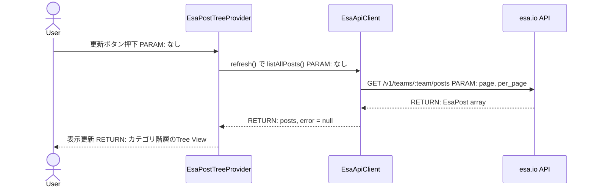
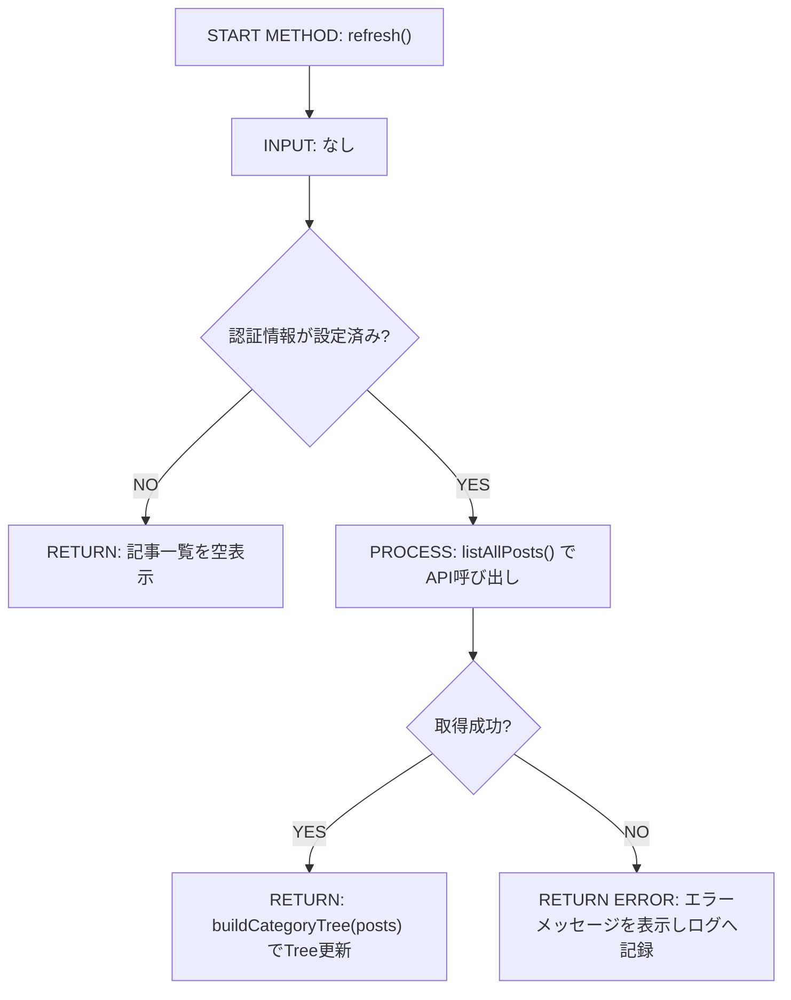
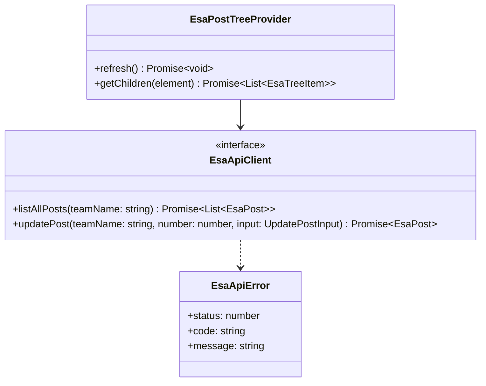

# Mermaid 図作成・修正ガイド

GitHub の Mermaid レンダラーは標準の Mermaid と比較して一部構文を厳格に解釈する。
過去にこのプロジェクトで発生した構文エラーのパターンを元にルールを整理している。

## 共通ルール（全図種）

**バッククォートを絶対に使わない**
Mermaid はバッククォート（`` ` ``）を特殊なレンダリング記法として解釈するため、
ノードラベル・メッセージラベル・エッジラベルを問わず使用禁止。
インラインコードを表現したい場合はプレーンテキストに書き直す。

```
# NG
A[START: `refreshPosts()`]
User->>View: `.refresh()` で `refreshPosts()` PARAM: なし

# OK
A["START: refreshPosts()"]
User->>View: .refresh() で refreshPosts() PARAM: なし
```

現状 `.github/workflows/` に mermaid専用の構文検証CI（mermaid-lint等）は無い。構文検証はローカルでmermaid-cli（mmdc）を実行して行う（後述）。

---

## sequenceDiagram

### ルール

| ルール | 説明 |
|---|---|
| メッセージラベルにバッククォート禁止 | `A->>B: \`method()\`` → `A->>B: method()` |
| 複数コロンは問題なし | `A->>B: PARAM: foo, bar` の 2 つ目以降のコロンはそのまま文字として扱われる |
| `Note over P1,P2:` は使える | カンマ区切りの複数参加者に対する注釈 |

### テンプレート



---

## flowchart / flowchart TD

### ルール

| ルール | 説明 |
|---|---|
| ラベルは必ずダブルクォートで囲む | `A["ラベル"]` — 括弧・コロン・日本語を安全に扱える |
| バッククォート禁止 | ダブルクォート内でも `` ` `` は不可 |
| ダイヤモンド条件内の `==` は使える | `C{"isLoading == true?"}` は有効 |
| エッジラベル `\|YES\|` `\|NO\|` は使える | 条件分岐の可読性を高める |
| `()` `[]` `:` はダブルクォート内で使える | 関数名・型・TypeScript 構文をそのまま書ける |

### テンプレート



---

## classDiagram

### ルール

| ルール | 説明 |
|---|---|
| 配列型は `List~T~` を使う | `EsaPost[]` はパーサーがノード記法と誤解する恐れがある |
| Optional 付きジェネリックは単純化 | `Map~string, EsaPost~ \| undefined` のような `?`/`\|` を含む複雑な型はパースエラーになりやすい → `PostMap` など省略名で代替 |
| `async` は戻り値として解釈される | メソッド名の後に `async` を書くと誤解を招くため省略して OK（`+refresh()` のように書き、`Promise<T>` はコメントで補足する） |
| `<<interface>>` `<<enum>>` は使える | ステレオタイプは正常動作（TypeScriptの `interface`/`enum` に対応） |

### テンプレート



---

## 修正チェックリスト

図の修正・レビュー時は次の順で確認する：

1. バッククォート（`` ` ``）が図内に 1 つもないことを確認
2. flowchart のノードラベルがすべてダブルクォートで囲まれていることを確認
3. classDiagram で `~T~?` や `[T]` の戻り値型を使っていないことを確認
4. sequenceDiagram で `:` を含むメッセージが正常に1つ目のコロンで区切られることを確認
5. 修正後は `git diff` でバッククォートが残っていないことを grep で確認：
   ```bash
   grep -n '`' <ファイル名> | grep -A2 -B2 '```mermaid'
   ```

---

## CI との連携

現時点で `docs/**/*.md` と `.github/**/*.md` 内の mermaid ブロックを自動検証する専用CIジョブ（mermaid-lint等）は `.github/workflows/` に存在しない。構文検証は本スキルのルールに沿った目視確認と、ローカルでのmermaid-cli実行に依存する。

ローカルで事前確認する場合は：
```bash
npx @mermaid-js/mermaid-cli -i <ファイル> -o /tmp/out.svg
```
