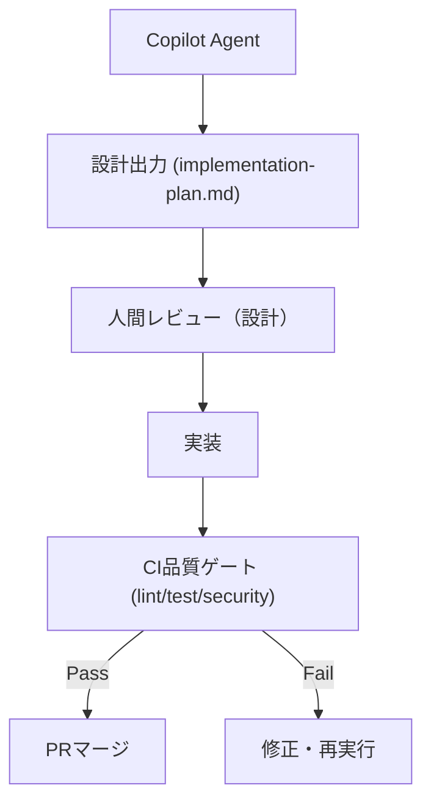

# 20 Architecture — 二層構造と開発ループ

## 二層構造

- **規範層**: `.github/copilot-instructions.md` — 短く強いルール。全タスク共通。
- **仕様層 (SSOT)**: `.github/copilot/*.md` — 要件・設計・品質・セキュリティの単一情報源。
- **実行指示レイヤ**: `.github/instructions/**/*.instructions.md` — `applyTo` で対象ファイルに適用される補助的な設計/背景資料レイヤ。

## 開発フロー（2段階ループ）



- Phase A (Design): `80-templates/implementation-plan.md` に沿って plan を作り、レビューで固定する。
- Phase B (Implement): 確定 plan の範囲で実装し、CI 品質ゲートを全て通過させる。

## 責務分担

- 仕様の更新・判断根拠: `.github/copilot/` と `70-adr/`
- 実務上の禁止事項・コマンド: `.github/instructions/`（パス適用）
- 実装・テスト計画: `80-templates/implementation-plan.md`
- レビュー本文（人間向け）: `.github/PULL_REQUEST_TEMPLATE/*.md`

## テンプレートの役割分離

- PRテンプレートは「人間レビューのための説明」を記録する。
- `80-templates/implementation-plan.md` は「設計Agentから製造Agentへの実装仕様引き渡し」を記録する。
- IMPLEMENT フェーズでは、確定 plan Markdown を一次入力として実装し、プロンプトに仕様全文の再記載を要求しない。

## 依存と適用範囲

- すべてのタスクは `00-index.md` の参照順を守る。
- 破壊的変更や例外的運用は必ず ADR または plan に残す。

## レイヤー構成

設計判断の背景は [docs/architecture.md](../../docs/architecture.md) にも記載がある。SSOTとしての詳細ルールは本ファイルと `30-coding-standards.md` を正とする。

```
extension.ts (エントリポイント / activate()がDIルート)
├── api/          esa Public API v1 クライアント
│   ├── EsaApiClient.ts   HTTP呼び出し・ページネーション・型ガード
│   ├── EsaApiError.ts    構造化エラー（status/code/レート制限情報）
│   └── types.ts          APIレスポンスの型定義
├── authentication/
│   └── CredentialService.ts  SecretStorageとチーム名設定、接続確認UI
├── cache/
│   └── PostCache.ts      記事本文とリビジョンのメモリキャッシュ
├── filesystem/
│   ├── EsaUri.ts         esa: URIの生成・解析
│   └── EsaFileSystemProvider.ts  仮想FS（読み込み/保存=API PATCH）
├── tree/
│   ├── CategoryTree.ts   カテゴリ文字列から階層ツリーを構築（純粋関数）
│   ├── EsaTreeItem.ts    TreeItem実装（カテゴリ/記事）
│   └── EsaPostTreeProvider.ts  TreeDataProvider
├── commands/     コマンドハンドラ登録
├── logging/      OutputChannelラッパー
├── configuration.ts  設定アクセス
└── constants.ts  定数
```

## DI（依存の組み立て）方針

- DI起点は `src/extension.ts` の `activate(context)` のみ。`EsaApiClient` / `CredentialService` / `PostCache` / `EsaPostTreeProvider` / `EsaFileSystemProvider` 等のインスタンスは `activate()` 内で生成し、コンストラクタ引数として依存先へ注入する（例: `new CredentialService(context.secrets, apiClient, logger)`）。
- グローバルなシングルトンや `import` 時点での即時初期化は行わない。テスト時に差し替えられるよう、外部I/O（`fetch`・`SecretStorage`・ファイルI/O）はコンストラクタ引数またはモジュール境界で受け渡す（例: `EsaApiClient` は `FetchFn` 型でfetch実装を差し替え可能にしている）。
- `context.subscriptions` に登録した `Disposable` はVS Codeが拡張機能の非activate時に破棄する。手動でのクリーンアップコードは書かない。
- コマンドハンドラは `commands/registerXxxCommand(context, ...)` の形で登録関数を分離し、`extension.ts` を薄く保つ。

## データフロー

1. `configure` コマンドでチーム名とトークンを入力し、`CredentialService.checkConnection` で接続確認後に `SecretStorage` へ保存する。
2. Tree View 表示時に `EsaApiClient.listAllPosts` で全記事を取得し、`buildCategoryTree`（純粋関数）でカテゴリ階層を構築する。
3. 記事を開くと `esa://<team>/posts/<number>.md` を `vscode.workspace.openTextDocument` で開き、`EsaFileSystemProvider.readFile` が本文を返す。
4. 保存時は `EsaFileSystemProvider.writeFile` が `original_revision` 付きで `EsaApiClient.updatePost` を呼び、3-way mergeに対応する。

## Issue 運用ルール

- Copilot を Issue にアサインする前に、必要な要件は本文へすべて記載する（アサイン後のコメントは認識されないため、追記は PR コメントで渡す）。
- 設計と実装の Issue は分離し、設計 Issue はドキュメントのみの PR、実装 Issue は確定 plan のパスを明示してその範囲に限定する。
- 設計 Issue の plan では、設計行為そのものをゴール/要件にしない。実装で変化する機能/コマンド/API/データ契約のみを対象化する。
- 設計 Issue の要件は、実装後に観測できる受入条件（テスト可能）で固定し、実装 Issue ではその plan Markdown を一次入力として実装する。
- 不確実性解消のために **[RESEARCH]** Issue を設け、コード変更禁止を基本とする（成果物は docs/research や Issue/PR コメントに集約し、結論は ADR/Requirements へ昇格させてから Design に渡す）。
- 仕様参照を避けたい場合は、任意フェーズの Issue に付与できるモディファイアとして **[BLIND]** を用いる。本文に必要情報を埋め込み、参照禁止範囲と変更可否を明示する。成果物は最小差分かつ本文完結とする。
- 推奨する最小セット: `[RESEARCH]`（調査のみ）、`[DESIGN]`（plan確定）、`[IMPLEMENT]`（plan通り実装）、`[BLIND]`（任意フェーズに付与可能な仕様参照抑制モディファイア）。
