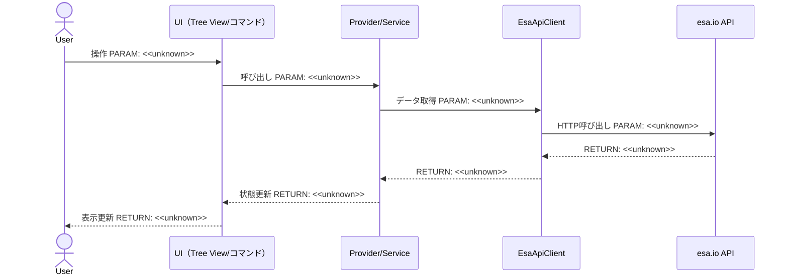
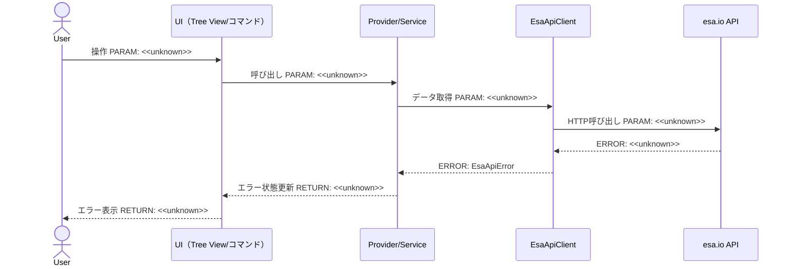
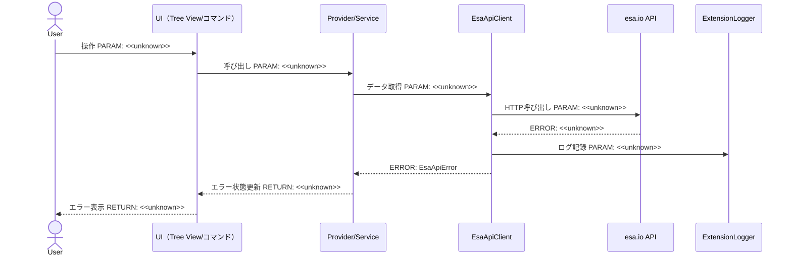
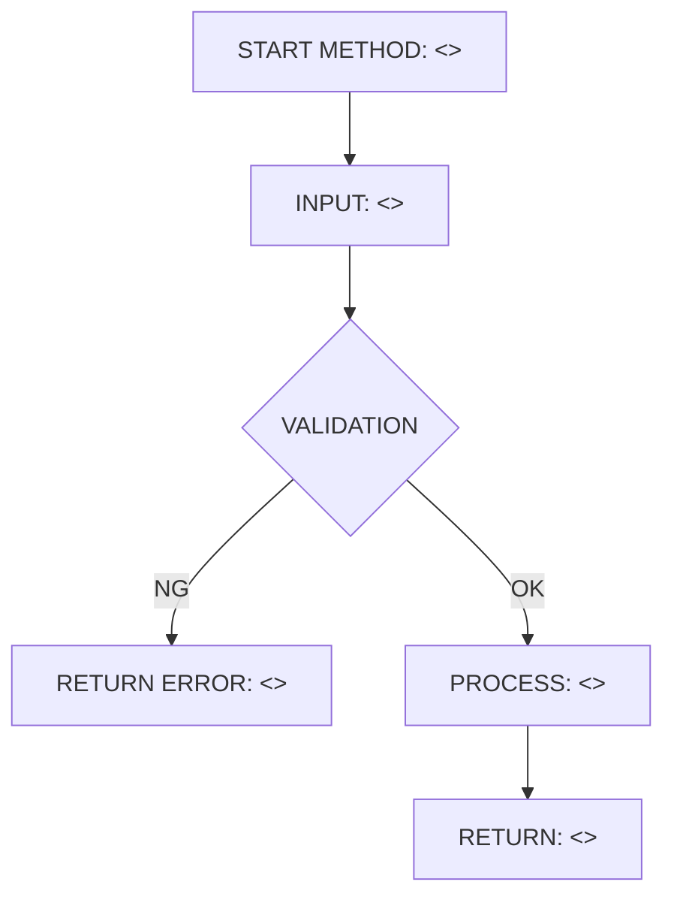
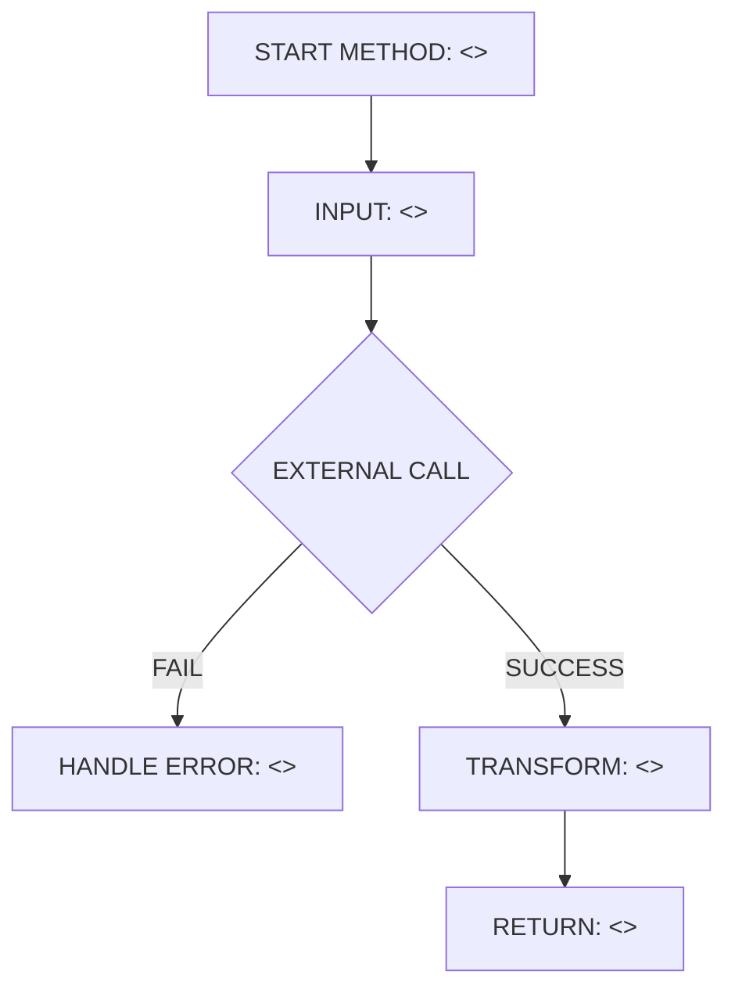
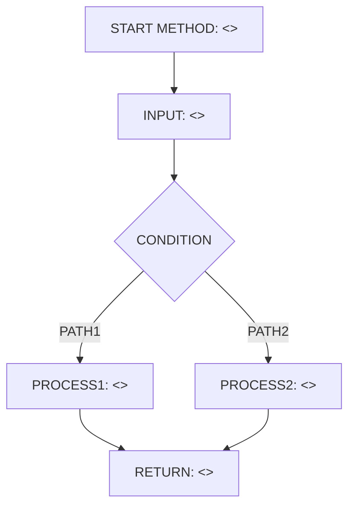

# Implementation Plan テンプレート

---

## 0. 実装入力コンテキスト

| 項目                             | 記入        |
| -------------------------------- | ----------- |
| 対象Issue                        | <<unknown>> |
| 対象リポジトリ内パス（実装起点） | <<unknown>> |

運用補足: Agent が実装時に直接参照する入力のみを記載する。未確定は `TBD（理由/決定条件/期限）` で記載する。

### 0.1 変更サマリ一覧（複数行）

| 区分（追加/修正/削除） | 対象（機能/コマンド/API） | 変更概要    |
| ---------------------- | ------------------------- | ----------- |
| 追加                   | <<unknown>>               | <<unknown>> |
| 追加                   | <<unknown>>               | <<unknown>> |
| 追加                   | <<unknown>>               | <<unknown>> |
| 修正                   | <<unknown>>               | <<unknown>> |
| 修正                   | <<unknown>>               | <<unknown>> |
| 削除                   | <<unknown>>               | <<unknown>> |

運用補足: 行数が不足する場合は同じ形式で行を追加する。

### 0.2 入力制約一覧（複数行）

| 制約区分（互換性/禁止事項/期限/その他） | 制約内容    | 適用対象    |
| --------------------------------------- | ----------- | ----------- |
| 互換性                                  | <<unknown>> | <<unknown>> |
| 禁止事項                                | <<unknown>> | <<unknown>> |
| 期限                                    | <<unknown>> | <<unknown>> |
| その他                                  | <<unknown>> | <<unknown>> |

運用補足: 行数が不足する場合は同じ形式で行を追加する。

### 0.3 関連機能・関連仕様一覧（複数行）

| 種別（要件/設計方針/ADR/調査/既存実装/外部仕様/その他） | パス/識別子 | この設計での利用目的 |
| ------------------------------------------------------- | ----------- | -------------------- |
| 要件                                                    | <<unknown>> | <<unknown>>          |
| 設計方針                                                | <<unknown>> | <<unknown>>          |
| ADR                                                     | <<unknown>> | <<unknown>>          |
| 調査                                                    | <<unknown>> | <<unknown>>          |
| 既存実装                                                | <<unknown>> | <<unknown>>          |
| 外部仕様                                                | <<unknown>> | <<unknown>>          |
| その他                                                  | <<unknown>> | <<unknown>>          |

運用補足: 行数が不足する場合は同じ形式で行を追加する。

---

## 1. 実装対象機能と機能ゴール

| 項目                                           | 内容        | 根拠        |
| ---------------------------------------------- | ----------- | ----------- |
| 実装対象詳細（機能/コマンド/View/API）         | <<unknown>> | <<unknown>> |
| 機能ゴール（実装後に観測できるユーザーユース） | <<unknown>> | <<unknown>> |
| 非ゴール（今回やらないこと）                   | <<unknown>> | <<unknown>> |
| 完了条件（実装完了の判定）                     | <<unknown>> | <<unknown>> |
| 受入確認手順（1行で再現可能）                  | <<unknown>> | <<unknown>> |

運用補足: 「完了条件」はテストまたは確認手順で判定可能な文で記載する。
運用補足: 「受入確認手順」はコマンド/操作を1行で再現できる形で記載する（例: Extension Development Hostでコマンド`esaExplorer.xxx`を実行 + `npm run check` 実行）。

---

## 2. 前提・制約（SSOT）

| 種別                                                 | 内容                                             | 根拠（ファイル/ADR/Issue） |
| ---------------------------------------------------- | ------------------------------------------------ | -------------------------- |
| 参照したSSOT                                         | <<unknown>>                                      | <<unknown>>                |
| アーキテクチャ前提（UI/Provider・Service/ApiClient） | <<unknown>>                                      | <<unknown>>                |
| VS Code バージョン要件                               | `^1.105.0`（`package.json` の `engines.vscode`） | package.json               |
| 技術制約（互換性/期限/運用/セキュリティ）            | <<unknown>>                                      | <<unknown>>                |
| 未確定前提（TBD）                                    | TBD（理由/決定条件/期限）                        | <<unknown>>                |

運用補足: 根拠は `ファイルパス` または `Issue/ADR` を必ず記載する。

---

## 3. 要件定義（実装受入条件）

### 3.1 機能要件

| ID    | 要件        | 受入条件（テスト可能な形） |
| ----- | ----------- | -------------------------- |
| FR-01 | <<unknown>> | <<unknown>>                |
| FR-02 | <<unknown>> | <<unknown>>                |
| FR-03 | <<unknown>> | <<unknown>>                |
| FR-04 | <<unknown>> | <<unknown>>                |
| FR-05 | <<unknown>> | <<unknown>>                |

運用補足: ID は `FR-01` 形式の連番（欠番禁止）。

### 3.2 非機能要件

| ID     | 要件        | 受入条件（テスト可能な形） |
| ------ | ----------- | -------------------------- |
| NFR-01 | <<unknown>> | <<unknown>>                |
| NFR-02 | <<unknown>> | <<unknown>>                |
| NFR-03 | <<unknown>> | <<unknown>>                |

運用補足: ID は `NFR-01` 形式の連番（欠番禁止）。

---

## 4. スコープ境界

運用補足: この章は「実装時の影響範囲」を記載する。設計 Agent の作業内容や設計書ファイル変更そのものは書かない。
運用補足: この章は「この設計を実装したときの想定差分」を書く。現在の Design PR 差分は書かない。

### 4.0 スコープ境界の定義（機能単位）

| 区分（In-Scope/Out-of-Scope） | 対象機能/責務 | 判定理由    |
| ----------------------------- | ------------- | ----------- |
| In-Scope                      | <<unknown>>   | <<unknown>> |
| In-Scope                      | <<unknown>>   | <<unknown>> |
| In-Scope                      | <<unknown>>   | <<unknown>> |
| Out-of-Scope                  | <<unknown>>   | <<unknown>> |
| Out-of-Scope                  | <<unknown>>   | <<unknown>> |

運用補足: 対象機能/責務は「実装で変更される責務単位」を書く。
運用補足: ファイル列挙は `8.1 変更予定ファイル一覧` に一本化する。

### 4.2 実装時の影響範囲・互換性リスク

| 影響対象                                                   | 結論（影響あり/なし/未確定） | 影響内容    |
| ---------------------------------------------------------- | ---------------------------- | ----------- |
| UI（Tree View/コマンド/QuickPick等）                       | <<unknown>>                  | <<unknown>> |
| API/外部通信（esa Public API v1）                          | <<unknown>>                  | <<unknown>> |
| データモデル（`api/types.ts`）                             | <<unknown>>                  | <<unknown>> |
| 外部依存（npm）                                            | <<unknown>>                  | <<unknown>> |
| CI/運用                                                    | <<unknown>>                  | <<unknown>> |
| `package.json` contributes（commands/views/configuration） | <<unknown>>                  | <<unknown>> |

運用補足: 結論は `影響あり` / `影響なし` / `未確定` のいずれかを記載する。

### 4.3 外部依存・Secrets の扱い

| 項目                                        | 内容        | リスク/対応 |
| ------------------------------------------- | ----------- | ----------- |
| 外部依存の追加/更新（npm）                  | <<unknown>> | <<unknown>> |
| Secrets 利用有無（Personal Access Token等） | <<unknown>> | <<unknown>> |
| ログ/設定への機密混入対策                   | <<unknown>> | <<unknown>> |

### 4.4 4章の自己検証（必須）

| チェック項目                   | 合格条件                                                                    |
| ------------------------------ | --------------------------------------------------------------------------- |
| Design PR 差分を書いていないか | `.github/copilot/plans/*.md` や「設計ドキュメントのみ変更」を記載していない |
| 実装責務を書いているか         | In-Scope に実装責務が2件以上ある                                            |
| 実装影響を書いているか         | 4.2 で `影響あり/未確定` が1件以上あり、影響内容が具体記述されている        |

---

## 5. アーキテクチャ設計

### 5.0 依存の組み立て（DI）経路

本プロジェクトは `src/extension.ts` の `activate(context)` を唯一のDIルートとし、コンストラクタ引数による依存注入を採用する。UI層（Provider/コマンドハンドラ）は具象クラスを直接 `new` せず、`activate()` から渡されたインスタンスを利用する。

| 区分（記載例/追記No） | 提供主体                  | 提供する依存                     | 受け取る側                                    | 入力（型/値）                                        | 出力（型/値）       | 境界制約（禁止事項を含む）                                     |
| --------------------- | ------------------------- | -------------------------------- | --------------------------------------------- | ---------------------------------------------------- | ------------------- | -------------------------------------------------------------- |
| 記載例                | `extension.ts activate()` | `EsaApiClient` インスタンス      | `EsaPostTreeProvider`（コンストラクタ引数）   | なし                                                 | `EsaApiClient`      | Provider/コマンド内で `new EsaApiClient()` を直接呼ばない      |
| 記載例                | `extension.ts activate()` | `CredentialService` インスタンス | `EsaFileSystemProvider`（コンストラクタ引数） | `context.secrets`, `EsaApiClient`, `ExtensionLogger` | `CredentialService` | SecretStorageへのアクセスは `CredentialService` 経由に限定する |
| 01                    | <<unknown>>               | <<unknown>>                      | <<unknown>>                                   | <<unknown>>                                          | <<unknown>>         | <<unknown>>                                                    |
| 02                    | <<unknown>>               | <<unknown>>                      | <<unknown>>                                   | <<unknown>>                                          | <<unknown>>         | <<unknown>>                                                    |
| 03                    | <<unknown>>               | <<unknown>>                      | <<unknown>>                                   | <<unknown>>                                          | <<unknown>>         | <<unknown>>                                                    |

運用補足: 記載例の行は削除せず参照用に残す。
運用補足: 新規クラスを追加する場合、それがどこで生成され（`activate()` か、既存クラスのコンストラクタ内か）、どこへ渡されるかを明記する。
運用補足: 未確定値は `TBD（理由/決定条件/期限）` を使用し、空欄を禁止する。

#### 5.0.1 最小固定セット（TBD禁止）

| 最小固定項目 | 必須記載内容                                                                  | 対応セクション          |
| ------------ | ----------------------------------------------------------------------------- | ----------------------- |
| DI 経路      | `extension.ts activate() -> Provider/コマンドハンドラ` を具体主体名で固定する | `5.0`, `5.7.0`, `5.7.2` |
| 非同期境界   | Extension Hostのイベントループをブロックしないことを具体箇所で固定する        | `5.5.1`, `8.3`          |
| 外部I/O境界  | esa.io APIへのアクセスが `api/` 層に閉じていることを具体ルールで固定する      | `8.3`, `8.4`            |

運用補足: 上記3項目は `TBD（理由/決定条件/期限）` を禁止する。
運用補足: 上記3項目の記述が未確定の場合は設計未完了として扱い、実装へ進めない。

### 5.1 設計判断

#### 5.1.1 責務分離 / データフロー（詳細）

| 記載形式        | 選択（A/B） |
| --------------- | ----------- |
| 形式A: 箇条書き | <<unknown>> |
| 形式B: テーブル | <<unknown>> |

運用補足: A/B のどちらか一方のみ記載する。

形式A（箇条書き）

- <<unknown>>
- <<unknown>>
- <<unknown>>

形式B（テーブル）

| No. | 決定事項（実装責務単位） | 根拠        | 未確定（あれば） |
| --- | ------------------------ | ----------- | ---------------- |
| 1   | <<unknown>>              | <<unknown>> | <<unknown>>      |
| 2   | <<unknown>>              | <<unknown>> | <<unknown>>      |
| 3   | <<unknown>>              | <<unknown>> | <<unknown>>      |

#### 5.1.2 エッジケース / 例外系 / リトライ方針（詳細）

| 記載形式        | 選択（A/B） |
| --------------- | ----------- |
| 形式A: 箇条書き | <<unknown>> |
| 形式B: テーブル | <<unknown>> |

形式A（箇条書き）

- <<unknown>>
- <<unknown>>
- <<unknown>>

形式B（テーブル）

| No. | ケース      | 方針（戻り値/表示/再試行） | 根拠        | 未確定（あれば） |
| --- | ----------- | -------------------------- | ----------- | ---------------- |
| 1   | <<unknown>> | <<unknown>>                | <<unknown>> | <<unknown>>      |
| 2   | <<unknown>> | <<unknown>>                | <<unknown>> | <<unknown>>      |
| 3   | <<unknown>> | <<unknown>>                | <<unknown>> | <<unknown>>      |

#### 5.1.3 VS Code UI部品一覧

| 種別     | 部品名（設計上の候補）                                  | 主責務      | 対応機能    |
| -------- | ------------------------------------------------------- | ----------- | ----------- |
| View     | <<unknown（例: Tree View / WebView）>>                  | <<unknown>> | <<unknown>> |
| Item     | <<unknown（例: TreeItem/QuickPickItem）>>               | <<unknown>> | <<unknown>> |
| Command  | <<unknown（例: esaExplorer.xxx）>>                      | <<unknown>> | <<unknown>> |
| Input    | <<unknown（例: InputBox/QuickPick）>>                   | <<unknown>> | <<unknown>> |
| Feedback | <<unknown（例: showInformationMessage/StatusBarItem）>> | <<unknown>> | <<unknown>> |

運用補足: View は `contributes.views`/`createTreeView`/`WebviewPanel` 単位、Item はTree/QuickPickの各項目、Command は `contributes.commands` に登録するコマンド、Input はユーザー入力UI、Feedback は通知・ステータス表示を指す。

#### 5.1.4 ログと観測性（漏洩防止を含む / 詳細）

| 記載形式        | 選択（A/B） |
| --------------- | ----------- |
| 形式A: 箇条書き | <<unknown>> |
| 形式B: テーブル | <<unknown>> |

形式A（箇条書き）

- <<unknown>>
- <<unknown>>
- <<unknown>>

形式B（テーブル）

| No. | 観点                  | 方針        | 根拠        | 未確定（あれば） |
| --- | --------------------- | ----------- | ----------- | ---------------- |
| 1   | ログ出力内容          | <<unknown>> | <<unknown>> | <<unknown>>      |
| 2   | マスキング/非出力項目 | <<unknown>> | <<unknown>> | <<unknown>>      |
| 3   | エラー記録粒度        | <<unknown>> | <<unknown>> | <<unknown>>      |

### 5.2 トレードオフ

| 判断テーマ  | 案A         | 案B         | 採用案      | 採用理由    | 不採用理由  |
| ----------- | ----------- | ----------- | ----------- | ----------- | ----------- |
| <<unknown>> | <<unknown>> | <<unknown>> | <<unknown>> | <<unknown>> | <<unknown>> |
| <<unknown>> | <<unknown>> | <<unknown>> | <<unknown>> | <<unknown>> | <<unknown>> |

### 5.3 UI導線方針

| 項目                                                                    | 決定内容    | 根拠        |
| ----------------------------------------------------------------------- | ----------- | ----------- |
| 導線方式（Tree View項目/コマンドパレット/コンテキストメニュー/WebView） | <<unknown>> | <<unknown>> |
| 操作の起点（誰がどこから呼び出すか）                                    | <<unknown>> | <<unknown>> |
| `package.json` contributes への登録要否（commands/menus/views）         | <<unknown>> | <<unknown>> |
| 状態受け渡し方式（Tree Item引数/QuickPick選択結果等）                   | <<unknown>> | <<unknown>> |

### 5.4 アーキテクチャレイヤー方針

| レイヤ                                             | 定義                       | 許可する依存方向       | 禁止する依存                                 |
| -------------------------------------------------- | -------------------------- | ---------------------- | -------------------------------------------- |
| UI（tree/commands）                                | ユーザー操作の受付・表示   | Service/Provider層のみ | `api/` の具象クライアントを直接 `new` しない |
| Provider/Service（tree/filesystem/authentication） | 状態管理・VS Code API連携  | `api/`・`cache/`       | UI層のimportを持たない                       |
| ApiClient（api/）                                  | esa.io APIとのHTTP通信     | 外部HTTP（fetch）      | UI/Provider層をimportしない                  |
| Model/Type（api/types.ts）                         | データ構造（TypeScript型） | なし                   | 他レイヤに依存しない                         |

運用補足: 各レイヤの依存方向は必ず内側（Model/Type）に向かう単方向とする。

### 5.5 データ取得ライフサイクル

| データ種別                     | 取得タイミング                                | 取得場所              | 理由        |
| ------------------------------ | --------------------------------------------- | --------------------- | ----------- |
| 初期表示必須データ（記事一覧） | Tree View初回展開時/`refresh()`               | `EsaPostTreeProvider` | <<unknown>> |
| ユーザー操作後データ           | コマンド実行時                                | コマンドハンドラ      | <<unknown>> |
| バックグラウンド更新           | <<unknown（現状は明示的な更新コマンドのみ）>> | <<unknown>>           | <<unknown>> |

| キャッシュ方針                      | 採用有無                                            | ルール      |
| ----------------------------------- | --------------------------------------------------- | ----------- |
| インメモリキャッシュ（`PostCache`） | <<unknown>>                                         | <<unknown>> |
| ディスクキャッシュ                  | <<unknown（現状不採用。採用する場合は理由を明記）>> | <<unknown>> |

#### 5.5.1 非同期処理とイベントループ境界

| 対象処理                          | 実行コンテキスト                                | 実装場所                              | 禁止事項                                         |
| --------------------------------- | ----------------------------------------------- | ------------------------------------- | ------------------------------------------------ |
| UI更新（Tree View再描画）         | Extension Host（`_onDidChangeTreeData.fire()`） | Provider                              | 同期的な重い処理でイベントループをブロックしない |
| ネットワーク通信（esa.io API）    | Extension Host（`async/await`）                 | `api/EsaApiClient.ts`                 | 呼び出し元をブロックする同期APIを使わない        |
| ファイルI/O（`esa:` 仮想FS）      | Extension Host（`async/await`）                 | `filesystem/EsaFileSystemProvider.ts` | <<unknown>>                                      |
| 認証情報アクセス（SecretStorage） | Extension Host（`async/await`）                 | `authentication/CredentialService.ts` | <<unknown>>                                      |

運用補足: VS Code拡張機能はExtension Host（単一のNode.jsプロセス）上で動作するため、iOSのMainActor/BackgroundActorのようなスレッド分離は存在しない。かわりに「イベントループをブロックしないこと」「`async/await`で外部I/Oを行うこと」を境界として扱う。
運用補足: 境界違反は `8.3 実装禁止事項` と `8.4 モジュール/アクセス制御方針` に同じ内容で反映する。

### 5.6 エラーハンドリング標準形

| 分類（network/unauthorized/notfound/validation/unknown） | エラー型    | UI 表示ルール | 再試行ルール |
| -------------------------------------------------------- | ----------- | ------------- | ------------ |
| network                                                  | <<unknown>> | <<unknown>>   | <<unknown>>  |
| unauthorized                                             | <<unknown>> | <<unknown>>   | <<unknown>>  |
| notfound                                                 | <<unknown>> | <<unknown>>   | <<unknown>>  |
| validation                                               | <<unknown>> | <<unknown>>   | <<unknown>>  |
| unknown                                                  | <<unknown>> | <<unknown>>   | <<unknown>>  |

| ログ方針                      | 内容        |
| ----------------------------- | ----------- |
| 出力する情報                  | <<unknown>> |
| 出力しない情報（Secrets/PII） | <<unknown>> |

#### 5.6.1 エラー変換責務（例外 → 構造化エラー）

| 変換対象                        | 例外発生層                | 構造化エラーへ変換する層 | 上位層へ渡す型                              | 禁止事項                                              |
| ------------------------------- | ------------------------- | ------------------------ | ------------------------------------------- | ----------------------------------------------------- |
| ネットワーク例外（fetch失敗等） | `api/EsaApiClient.ts`     | `api/EsaApiClient.ts`    | `EsaApiError`                               | UI/Provider層で生の`fetch`エラーを直接判定しない      |
| APIエラーレスポンス（4xx/5xx）  | `api/EsaApiClient.ts`     | `api/EsaApiClient.ts`    | `EsaApiError`（status/code/レート制限情報） | Provider層に変換ロジック以外の責務を持たせない        |
| バリデーションエラー（入力値）  | コマンドハンドラ/Provider | 発生層                   | <<unknown>>                                 | <<unknown>>                                           |
| 予期せぬ例外                    | 任意層                    | 呼び出し元               | `Error`                                     | スタックトレース/機密情報をユーザー向け通知に含めない |

### 5.7 シーケンス図（Mermaid / 複数必須）

運用補足: 正常系・異常系で participant 名を統一し、図ごとに別名へ置換しない。
運用補足: `ログ責務` / `エラー変換責務` / `非同期処理の境界` は本文・表・図で同一結論に統一する（矛盾禁止）。

| 必須項目   | 記載ルール                                                    |
| ---------- | ------------------------------------------------------------- |
| DI 経路    | 必須（`extension.ts activate() -> Provider/コマンド` を明記） |
| 正常系     | 必須（最低1本）                                               |
| 異常系     | 必須（最低2本。業務エラー系/システムエラー系）                |
| パラメータ | 各呼び出しメッセージに `PARAM` を明記                         |
| 戻り値     | 各応答メッセージに `RETURN` を明記                            |
| エラー返却 | 各異常系で `ERROR` の返却値とハンドリング先を明記             |

#### 5.7.0 DI 経路（テキスト再掲 / 必須）

| No     | 開始主体                  | 終了主体              | 提供する依存   | 受け渡し方法       | 経路文字列（`A -> B -> C`）                      | 境界チェック観点                            | 対応シーケンス図ID |
| ------ | ------------------------- | --------------------- | -------------- | ------------------ | ------------------------------------------------ | ------------------------------------------- | ------------------ |
| 記載例 | `extension.ts activate()` | `EsaPostTreeProvider` | `EsaApiClient` | コンストラクタ引数 | `activate() -> EsaPostTreeProvider -> Tree View` | 具象APIクライアントがUI層に漏れていないこと | SEQ-01             |
| 01     | <<unknown>>               | <<unknown>>           | <<unknown>>    | <<unknown>>        | <<unknown>>                                      | <<unknown>>                                 | SEQ-01             |
| 02     | <<unknown>>               | <<unknown>>           | <<unknown>>    | <<unknown>>        | <<unknown>>                                      | <<unknown>>                                 | SEQ-02             |

運用補足: 記載例の行は削除せず参照用に残す。
運用補足: 経路文字列は `主体名` を `->` で連結した1行形式で記載する。

#### 5.7.1 シーケンス対象一覧

| 図ID   | 種別（正常/異常） | 起点（コマンド/UI操作） | 終点（ApiClient/外部I/O） | 対応要件ID（FR/NFR） |
| ------ | ----------------- | ----------------------- | ------------------------- | -------------------- |
| SEQ-01 | 正常（DI 経路）   | <<unknown>>             | <<unknown>>               | <<unknown>>          |
| SEQ-02 | 異常              | <<unknown>>             | <<unknown>>               | <<unknown>>          |
| SEQ-03 | 異常              | <<unknown>>             | <<unknown>>               | <<unknown>>          |

#### 5.7.1.1 境界整合チェック（必須）

| 境界テーマ                     | 文章セクション | 表セクション | 図セクション | 整合判定（OK/NG） |
| ------------------------------ | -------------- | ------------ | ------------ | ----------------- |
| ログ責務（どの層で出力するか） | `5.1.4`        | `5.6`        | `5.7.4`      | <<unknown>>       |
| エラー変換責務                 | `5.1.2`        | `5.6.1`      | `5.7.3`      | <<unknown>>       |
| 非同期処理の境界               | `5.5.1`        | `8.3`        | `5.7.2`      | <<unknown>>       |

運用補足: 3行すべて `OK` になるまで設計を確定しない。

#### 5.7.1.2 最小固定セット具体化チェック（必須）

| 最小固定項目                                 | 文章セクション | 表セクション | 図セクション     | TBD残存数（0のみ可） |
| -------------------------------------------- | -------------- | ------------ | ---------------- | -------------------- |
| DI 経路（`activate() -> Provider/コマンド`） | `5.0.1`        | `5.0`        | `5.7.0`, `5.7.2` | <<unknown>>          |
| 非同期処理の境界（イベントループ非ブロック） | `5.5.1`        | `5.5.1`      | `5.7.2`          | <<unknown>>          |
| 外部I/O境界（`api/`層への閉じ込め）          | `8.3`          | `8.4`        | `5.7.2`          | <<unknown>>          |

運用補足: `TBD残存数` は各項目で `0` 以外を禁止する。

#### 5.7.2 正常系シーケンス（必須）

運用補足: Mermaid のラベルでは半角括弧/半角カギ括弧を使わず、全角の `（ ）［ ］｛ ｝` を使用する。バッククォートはラベル内で使用しない（`.github/instructions/mermaid.instructions.md` 参照）。



#### 5.7.3 異常系シーケンス（業務エラー）



#### 5.7.4 異常系シーケンス（システムエラー）



### 5.8 処理フロー図（メソッドレベル / 複数必須）

| 必須項目       | 記載ルール                       |
| -------------- | -------------------------------- |
| 対象メソッド数 | 必須（最低3メソッド）            |
| 分岐           | 各メソッドで正常/異常分岐を明記  |
| 入出力         | 各メソッドの入力/出力を明記      |
| 例外処理       | 例外時の戻り値または伝播先を明記 |

#### 5.8.1 メソッド一覧

| 図ID    | メソッド名  | 層（UI/Provider/ApiClient） | 対応要件ID（FR/NFR） |
| ------- | ----------- | --------------------------- | -------------------- |
| FLOW-01 | <<unknown>> | <<unknown>>                 | <<unknown>>          |
| FLOW-02 | <<unknown>> | <<unknown>>                 | <<unknown>>          |
| FLOW-03 | <<unknown>> | <<unknown>>                 | <<unknown>>          |

運用補足: メソッド名の全件 `<<unknown>>` / `TBD（理由/決定条件/期限）` は禁止する。最低3件は具体メソッド名を記載する。

#### メソッドフロー（FLOW-01）



#### メソッドフロー（FLOW-02）



#### メソッドフロー（FLOW-03）



---

## 6. 契約仕様（インターフェース / 型契約）

### 6.0 契約の固定前提

| 項目                      | 固定方針                                                                                                                     |
| ------------------------- | ---------------------------------------------------------------------------------------------------------------------------- |
| DI 起点                   | `extension.ts activate()` のみで依存を組み立てる                                                                             |
| 外部I/Oを持つクラスの責務 | コンストラクタで依存（`FetchFn`・`SecretStorage`・他クラスのインスタンス）を受け取り、モジュールスコープの可変状態を持たない |
| 型ガードの配置            | 外部入力（APIレスポンス）を受け取る層（`api/`）に配置し、`unknown` から安全に絞り込む                                        |
| UI 層の責務               | Provider/Serviceの公開メソッド（exportされる関数・publicメソッド）にのみ依存し、`api/` の具象クライアントを直接importしない  |

運用補足: 型・インターフェース定義が曖昧な場合は実装を開始しない。先にこの章を確定させる。

### 6.1 入出力契約（コマンド/関数/API呼び出し）

| ID     | 入口（コマンド/操作/関数） | 入力        | 出力        | エラー      | 備考        |
| ------ | -------------------------- | ----------- | ----------- | ----------- | ----------- |
| IFC-01 | <<unknown>>                | <<unknown>> | <<unknown>> | <<unknown>> | <<unknown>> |
| IFC-02 | <<unknown>>                | <<unknown>> | <<unknown>> | <<unknown>> | <<unknown>> |

運用補足: ID は `IFC-01` 形式の連番。入口ごとに採番する。

### 6.2 型/モデル/スキーマ

| ID      | 対象        | 変更内容（追加/変更/削除） | 後方互換    |
| ------- | ----------- | -------------------------- | ----------- |
| TYPE-01 | <<unknown>> | <<unknown>>                | <<unknown>> |
| TYPE-02 | <<unknown>> | <<unknown>>                | <<unknown>> |

運用補足: ID は `TYPE-01` 形式の連番。変更内容は `追加` / `変更` / `削除` のみ。

### 6.3 インターフェース定義（実装エンジニア向け固定案）

#### 6.3.1 公開関数/クラスメソッド一覧

| No. | 対象（クラス名/関数名） | メソッド署名（TypeScript形式）              | 配置ファイル候補 | 備考        |
| --- | ----------------------- | ------------------------------------------- | ---------------- | ----------- |
| 1   | <<unknown>>             | `async <<unknown>>(): Promise<<<unknown>>>` | <<unknown>>      | <<unknown>> |
| 2   | <<unknown>>             | `async <<unknown>>(): Promise<<<unknown>>>` | <<unknown>>      | <<unknown>> |
| 3   | <<unknown>>             | `async <<unknown>>(): Promise<<<unknown>>>` | <<unknown>>      | <<unknown>> |

#### 6.3.2 型/インターフェース図（Mermaid classDiagram）

| 図ID   | 対象領域    | 対応する型/クラス | 対応要件ID（FR/NFR） |
| ------ | ----------- | ----------------- | -------------------- |
| CLS-01 | <<unknown>> | <<unknown>>       | <<unknown>>          |
| CLS-02 | <<unknown>> | <<unknown>>       | <<unknown>>          |

##### 型レベルのクラス図（CLS-01）

```mermaid
classDiagram
  direction TB
  %% TODO: 1つの図で1領域（例: api/types.tsのEsaPost関連）を表現する
  %% class EsaPost {
  %%   +number: number
  %%   +name: string
  %%   +category: string
  %%   +body_md: string
  %% }
  %% class EsaPostsResponse {
  %%   +posts: List~EsaPost~
  %%   +next_page: number
  %% }
  %% EsaPostsResponse --> EsaPost
```

#### 6.3.3 型別モデル定義（省略不可）

運用補足: 論理名ではなく、コード上の物理名（実際の型名/プロパティ名）で記載する。
運用補足: 全プロパティを行単位で列挙する。

##### 6.3.3.1 モデル一覧

| 対象領域    | 型名        | 区分（interface/type/enum） | 用途        |
| ----------- | ----------- | --------------------------- | ----------- |
| <<unknown>> | <<unknown>> | <<unknown>>                 | <<unknown>> |
| <<unknown>> | <<unknown>> | <<unknown>>                 | <<unknown>> |

##### 6.3.3.2 プロパティ詳細定義（全項目を行で列挙）

| 対象領域    | 型名        | プロパティ名 | TypeScript 型（完全表記） | 必須（Y/N） | Optional（Y/N） | 説明        | 例          |
| ----------- | ----------- | ------------ | ------------------------- | ----------- | --------------- | ----------- | ----------- |
| <<unknown>> | <<unknown>> | <<unknown>>  | <<unknown>>               | <<unknown>> | <<unknown>>     | <<unknown>> | <<unknown>> |
| <<unknown>> | <<unknown>> | <<unknown>>  | <<unknown>>               | <<unknown>> | <<unknown>>     | <<unknown>> | <<unknown>> |

##### 6.3.3.3 リテラル型/Union制約

| No. | 型名        | 値一覧      | 用途        |
| --- | ----------- | ----------- | ----------- |
| 1   | <<unknown>> | <<unknown>> | <<unknown>> |
| 2   | <<unknown>> | <<unknown>> | <<unknown>> |

#### 6.3.4 互換性ルール

| 項目                         | ルール      |
| ---------------------------- | ----------- |
| 破壊的変更の扱い             | <<unknown>> |
| Optionalプロパティ追加の扱い | <<unknown>> |
| 型名変更/移動の扱い          | <<unknown>> |
| 実装側への影響確認手順       | <<unknown>> |

---

## 7. データ設計（必要な場合のみ）

| 項目                                                         | 内容        | 互換性/移行 |
| ------------------------------------------------------------ | ----------- | ----------- |
| 保存領域の変更（SecretStorage/globalState/workspaceState等） | <<unknown>> | <<unknown>> |
| マイグレーション方針                                         | <<unknown>> | <<unknown>> |
| 既存データ影響                                               | <<unknown>> | <<unknown>> |
| ロールバック方針                                             | <<unknown>> | <<unknown>> |

---

## 8. 実装指示（製造 Agent 向け）

### 8.1 変更予定ファイル一覧（必須）

| No. | パス                         | 区分（UI/Provider/ApiClient/Model/Test/Other） | 変更タイプ（追加/変更/削除） | 実装内容（具体） | 完了条件    |
| --- | ---------------------------- | ---------------------------------------------- | ---------------------------- | ---------------- | ----------- |
| 1   | src/<<unknown>>.ts           | <<unknown>>                                    | <<unknown>>                  | <<unknown>>      | <<unknown>> |
| 2   | src/<<unknown>>.ts           | <<unknown>>                                    | <<unknown>>                  | <<unknown>>      | <<unknown>> |
| 3   | src/test/<<unknown>>.test.ts | Test                                           | <<unknown>>                  | <<unknown>>      | <<unknown>> |

運用補足: 区分は `UI` / `Provider` / `ApiClient` / `Model` / `Test` / `Other` のいずれか。
運用補足: `package.json` の `contributes`（commands/views/configuration等）を変更する場合は、この表に `package.json` の行を追加する。

### 8.2 実装手順（順序付き）

| 手順 | 作業内容    | 対象ファイル/モジュール | 完了条件    |
| ---- | ----------- | ----------------------- | ----------- |
| 1    | <<unknown>> | <<unknown>>             | <<unknown>> |
| 2    | <<unknown>> | <<unknown>>             | <<unknown>> |
| 3    | <<unknown>> | <<unknown>>             | <<unknown>> |

運用補足: 手順は実行順で記載し、各手順に完了条件を必ず設定する。

### 8.3 実装禁止事項（ガードレール）

| 項目       | 内容                                                                         | 根拠                |
| ---------- | ---------------------------------------------------------------------------- | ------------------- |
| 禁止事項-1 | UI層から `api/` の具象クライアントを直接 `new` しない                        | レイヤ境界（5.4）   |
| 禁止事項-2 | Extension Hostのイベントループをブロックする同期的重い処理を書かない         | 非同期境界（5.5.1） |
| 禁止事項-3 | Secrets/PII（Personal Access Token等）をコード・ログ・テストデータに含めない | 50-security.md      |
| 禁止事項-4 | <<unknown>>                                                                  | <<unknown>>         |
| 禁止事項-5 | <<unknown>>                                                                  | <<unknown>>         |

### 8.4 モジュール/アクセス制御方針

| 項目             | 設定内容                                                                                             | 検証方法                                     |
| ---------------- | ---------------------------------------------------------------------------------------------------- | -------------------------------------------- |
| アクセス制御方針 | 公開不要な関数・変数は `export` しない（モジュール内 private）                                       | TypeScriptコンパイラ / ESLint                |
| レイヤ依存強制   | UI/Provider層は `api/` の型・エラー型のみに依存し、HTTP呼び出しの詳細に依存しない                    | コードレビュー                               |
| CI での強制      | ESLint（`npm run lint`）・`tsc --noEmit`（`npm run typecheck`）をCIでlint failとしてPRをブロックする | GitHub Actions（`.github/workflows/ci.yml`） |

---

## 9. テスト実装計画

### 9.1 テストケース

Unit テストを完全網羅すること

| 区分（正常/例外/境界/回帰） | パターン名  | 対象        | シナリオ    | 期待結果    |
| --------------------------- | ----------- | ----------- | ----------- | ----------- |
| 正常                        | <<unknown>> | <<unknown>> | <<unknown>> | <<unknown>> |
| 正常                        | <<unknown>> | <<unknown>> | <<unknown>> | <<unknown>> |
| 正常                        | <<unknown>> | <<unknown>> | <<unknown>> | <<unknown>> |
| 例外                        | <<unknown>> | <<unknown>> | <<unknown>> | <<unknown>> |
| 例外                        | <<unknown>> | <<unknown>> | <<unknown>> | <<unknown>> |
| 境界                        | <<unknown>> | <<unknown>> | <<unknown>> | <<unknown>> |
| 境界                        | <<unknown>> | <<unknown>> | <<unknown>> | <<unknown>> |
| 回帰                        | <<unknown>> | <<unknown>> | <<unknown>> | <<unknown>> |
| 回帰                        | <<unknown>> | <<unknown>> | <<unknown>> | <<unknown>> |

| 網羅チェック               | 判定（Y/N） | 根拠        |
| -------------------------- | ----------- | ----------- |
| 正常パターンを網羅している | <<unknown>> | <<unknown>> |
| 例外パターンを網羅している | <<unknown>> | <<unknown>> |
| 境界パターンを網羅している | <<unknown>> | <<unknown>> |
| 回帰パターンを網羅している | <<unknown>> | <<unknown>> |

---

## 10. オープン課題 / ADR

| 論点        | 現状        | 決定期限/担当 | ADR要否（要/不要/TBD） |
| ----------- | ----------- | ------------- | ---------------------- |
| <<unknown>> | <<unknown>> | <<unknown>>   | <<unknown>>            |
| <<unknown>> | <<unknown>> | <<unknown>>   | <<unknown>>            |

運用補足: ADR 要否は `要` / `不要` / `TBD`。

### 10.1 TBD 回収トラッキング（必須）

| TBD論点     | 現在の記載箇所（章/項目） | 解決ゲート（必須）                   | BLOCKER（Yes/No）    | RESOLVE_IN（必須）      | DEFAULT/ASSUMPTION（任意）      | ADR記録先（必要時） |
| ----------- | ------------------------- | ------------------------------------ | -------------------- | ----------------------- | ------------------------------- | ------------------- |
| <<unknown>> | <<unknown>>               | GATE: 契約（インターフェース）確定前 | BLOCKER: <<unknown>> | RESOLVE_IN: <<unknown>> | DEFAULT/ASSUMPTION: <<unknown>> | <<unknown>>         |
| <<unknown>> | <<unknown>>               | GATE: 実装PR作成前                   | BLOCKER: <<unknown>> | RESOLVE_IN: <<unknown>> | DEFAULT/ASSUMPTION: <<unknown>> | <<unknown>>         |
| <<unknown>> | <<unknown>>               | GATE: マージ前                       | BLOCKER: <<unknown>> | RESOLVE_IN: <<unknown>> | DEFAULT/ASSUMPTION: <<unknown>> | <<unknown>>         |

運用補足: `BLOCKER: Yes` の項目は coding Agent の作業開始禁止。
運用補足: ADR が必要な論点は `70-adr/` の記録先を明記する。

---

## 11. 新規コマンド/View追加テンプレ（設計規約）

### 11.1 docs 必須項目

| 項目                                   | 記載内容    |
| -------------------------------------- | ----------- |
| `docs/` 配下の関連ドキュメント更新要否 | <<unknown>> |
| 受入条件リンク（FR/NFR）               | <<unknown>> |

### 11.2 Model/型 必須項目

| 項目                            | 記載内容    |
| ------------------------------- | ----------- |
| `src/api/types.ts` へ追加する型 | <<unknown>> |
| 型ガード関数の要否              | <<unknown>> |

### 11.3 Provider/Service 必須項目

| 項目                                   | 記載内容    |
| -------------------------------------- | ----------- |
| 追加/変更するProvider・Serviceの責務   | <<unknown>> |
| 禁止事項（`api/`具象への直接依存など） | <<unknown>> |

### 11.4 UI（コマンド/View） 必須項目

| 項目                                                                         | 記載内容    |
| ---------------------------------------------------------------------------- | ----------- |
| `package.json` contributes（commands/menus/views/configuration）への登録内容 | <<unknown>> |
| 禁止事項（UI層にビジネスロジックを実装しない等）                             | <<unknown>> |

### 11.5 テスト必須項目

| 項目                                       | 記載内容    |
| ------------------------------------------ | ----------- |
| `src/test/` 配下に追加する必須テストケース | <<unknown>> |
| モック/スタブの配置方針                    | <<unknown>> |

---
