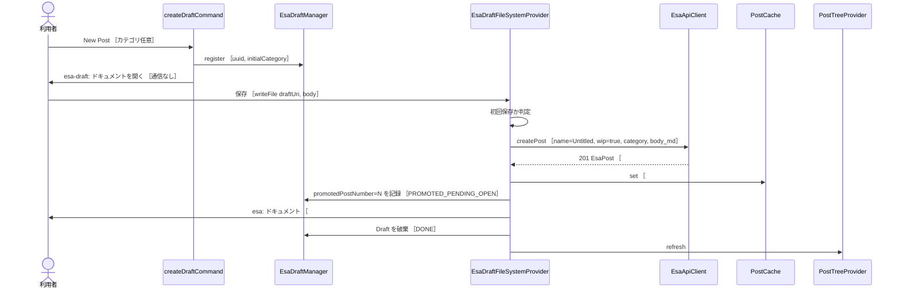
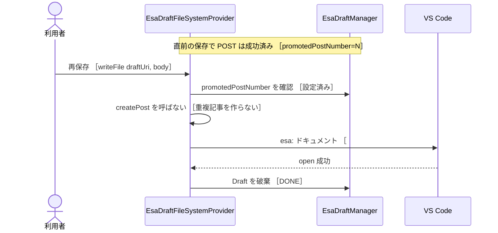
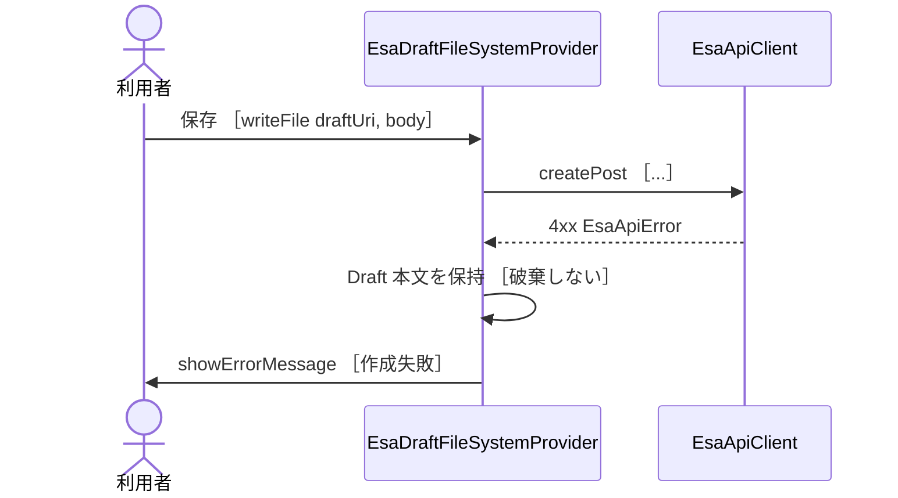
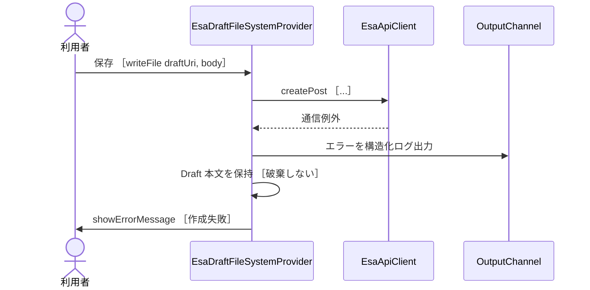
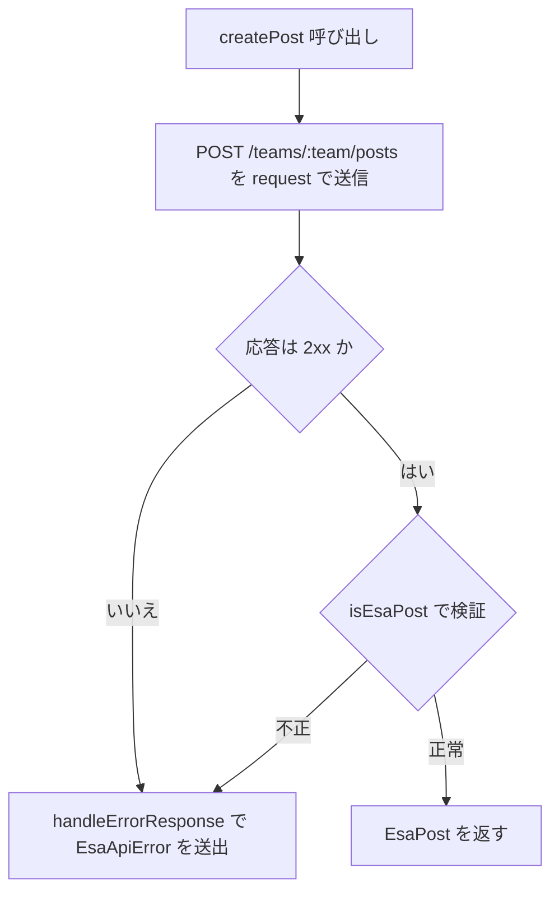
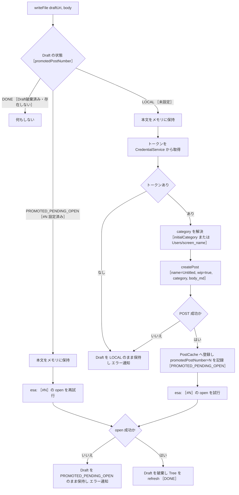
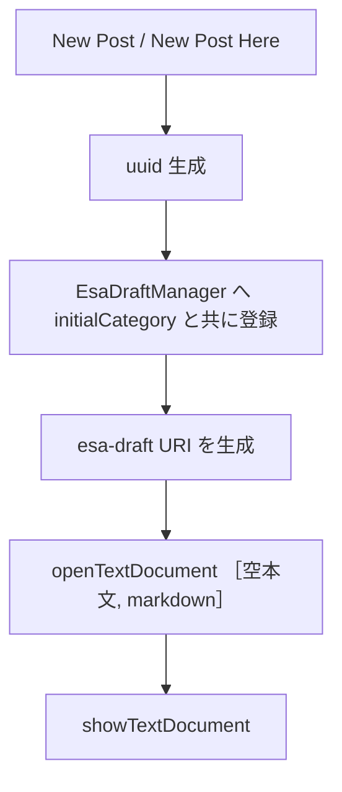
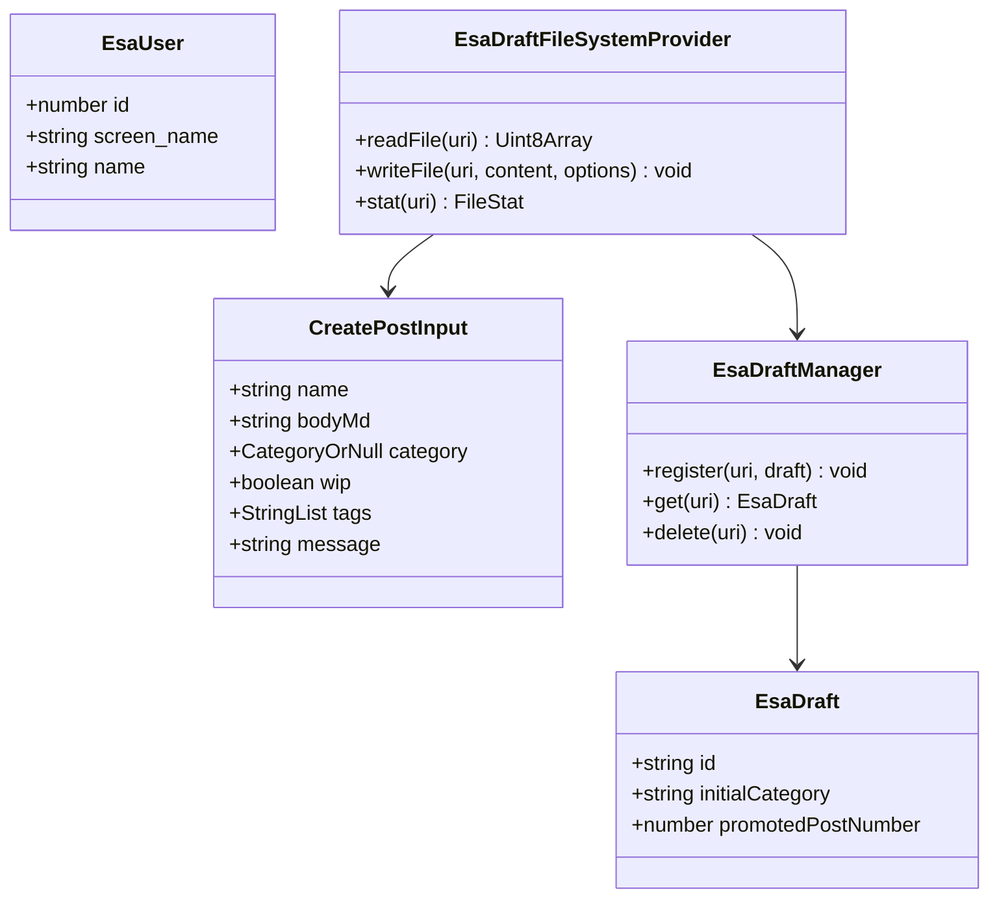

# 実装plan: 記事の新規作成（ローカルDraft → 初回保存で昇格）

> 本plan は `.github/copilot/80-templates/implementation-plan.md` に準拠する。
> 設計判断の根拠は [ADR-006 ローカルDraftと昇格モデル](../70-adr/ADR-006-local-draft-promotion.md) を参照する。

---

## 0. メタ情報

### 0.1 変更サマリ

| 対象                                           | 変更タイプ | 影響レベル | 互換性 | 概要                                                         |
| ---------------------------------------------- | ---------- | ---------- | ------ | ------------------------------------------------------------ |
| `src/constants.ts`                             | 変更       | S          | 非破壊 | `ESA_DRAFT_URI_SCHEME = "esa-draft"` を追加                  |
| `src/api/types.ts`                             | 変更       | S          | 非破壊 | `CreatePostInput` / `EsaUser` 型を追加                       |
| `src/api/EsaApiClient.ts`                      | 変更       | M          | 非破壊 | `createPost` / `getAuthenticatedUser` を追加                 |
| `src/filesystem/EsaDraftUri.ts`                | 追加       | S          | 非破壊 | `esa-draft:` URI の生成・解析                                |
| `src/filesystem/EsaDraftFileSystemProvider.ts` | 追加       | L          | 非破壊 | 書き込み可能な Draft 用 FileSystemProvider（初回保存で昇格） |
| `src/draft/EsaDraftManager.ts`                 | 追加       | M          | 非破壊 | Draft メタデータ（`id` / `initialCategory`）の管理           |
| `src/commands/createDraftCommand.ts`           | 追加       | M          | 非破壊 | New Post / New Post Here のコマンドハンドラ                  |
| `src/extension.ts`                             | 変更       | M          | 非破壊 | Draft Provider・コマンド登録、DI 配線                        |
| `package.json`                                 | 変更       | S          | 非破壊 | `contributes.commands` / `menus` / `activationEvents` 追記   |
| `src/test/**`                                  | 追加       | M          | 非破壊 | 単体・統合テスト追加                                         |

**方針の核心**: esa.io 本体の挙動に合わせ、New Post は即時にサーバへ記事を作らない。まずローカルの一時 Draft（`esa-draft:` スキーム）としてエディタを開き、**最初の保存（`Ctrl/Cmd+S`）でリモート記事へ昇格（`POST /teams/:team/posts`）** する。既存の `EsaFileSystemProvider.writeFile` による `create` 拒否（`:96-98`）は**変更しない**。

### 0.2 関連ドキュメント

| 種別         | パス / URL                                                | 参照理由                                         |
| ------------ | --------------------------------------------------------- | ------------------------------------------------ |
| ADR          | `.github/copilot/70-adr/ADR-006-local-draft-promotion.md` | 本planの設計判断の根拠                           |
| 要件         | `.github/copilot/10-requirements.md` §4.2                 | 記事の新規作成の要件                             |
| アーキ       | `.github/copilot/20-architecture.md`                      | レイヤ境界（UI / Provider・Service / ApiClient） |
| セキュリティ | `.github/copilot/50-security.md`                          | Personal Access Token の保管方針                 |
| API 仕様     | esa Public API v1 `POST /v1/teams/:team_name/posts`       | 記事作成エンドポイント                           |
| API 仕様     | esa Public API v1 `GET /v1/user`                          | 認証ユーザーの `screen_name` 取得                |

### 0.3 ADR 参照

| ADR                               | 状態     | 本planへの反映                                                                  |
| --------------------------------- | -------- | ------------------------------------------------------------------------------- |
| ADR-006 ローカルDraftと昇格モデル | Accepted | Draft-first フロー・`esa-draft:` スキーム・昇格トランザクション順序を全章に反映 |

---

## 1. 目的とゴール

### 1.1 目的

VS Code から esa.io チームへ新規記事を作成できるようにする。ただし esa.io 本体の編集体験（NEW POST 直後は未確定、書き始めてから一時保存で記事化）に合わせ、**新規作成の瞬間にサーバ記事を作らず、初回保存で昇格させる**フローを採用する。

### 1.2 ゴール（Doneの定義）

- [ ] Tree View 右上ボタン（New Post）／カテゴリ右クリック（New Post Here）／コマンドパレットから Draft を開始できる。
- [ ] Draft はローカルの `esa-draft:` ドキュメントとして開き、この時点ではネットワーク通信・記事番号を持たない。
- [ ] Draft の初回保存で `POST /teams/:team/posts`（`name="Untitled"`, `wip=true`, `category`, `body_md`）を実行し、リモート記事 `#N` に昇格する。
- [ ] 昇格成功後、リモート記事 `esa:` ドキュメントを開き、Draft ドキュメントは破棄する。以降の保存は既存の `updatePost`（PATCH）で `#N` を更新する。
- [ ] POST 成功後に `esa:` オープンが失敗した場合は Draft を破棄せず `promotedPostNumber` を保持し、再保存時は再 POST せず `esa:` オープンのみ再試行する（重複記事を作らない）。
- [ ] 昇格失敗時は Draft を破棄せず本文を保持し、エラーを通知する。
- [ ] lint / typecheck / test / security の CI 品質ゲートが全て緑。

### 1.3 非ゴール

- 記事の削除（別Issue）。
- タイトル変更 UI（Rename Post コマンドは別Issue、本planは扱わない）。
- WIP / 公開（ship）切替 UI（本planは初期値 `wip=true` の決定のみ）。
- 複数チーム同時接続。
- Draft のディスク永続化（VS Code 再起動をまたぐ保持）。

---

## 2. 前提条件

- 単一チーム接続前提（`10-requirements.md` §3）。
- Personal Access Token は `CredentialService`（`SecretStorage`）経由でのみ取得する（`50-security.md`）。
- `EsaApiClient` は `listAllPosts` / `getPost` / `updatePost` / `checkConnection` を持ち、`createPost` / `getAuthenticatedUser` は未実装。
- `EsaFileSystemProvider` は `esa:` スキームを担当し、`writeFile` の `options.create` を拒否する（`:96-98`）。
- Tree View（`esaExplorer.posts`）は `PostTreeProvider` が提供し、`refresh()` は Promise を返す。

---

## 3. 要件

### 3.1 機能要件（FR）

| ID     | 要件                                                                                                                                                              | 根拠                |
| ------ | ----------------------------------------------------------------------------------------------------------------------------------------------------------------- | ------------------- |
| FR-01  | New Post 操作で `esa-draft:` ドキュメントを開く。この時点でネットワーク通信を行わない。                                                                           | ADR-006 §決定       |
| FR-02  | Draft の初回保存を `EsaDraftFileSystemProvider.writeFile` が検知し、昇格処理を開始する。                                                                          | ADR-006 §決定       |
| FR-03  | 昇格は `POST /teams/:team/posts` を `{ post: { name, body_md, category, wip } }` 形式で送信する。                                                                 | esa API             |
| FR-04  | 昇格時の既定値は `name="Untitled"`、`wip=true`、`category` は入力元に応じて決定する。                                                                             | ADR-006 §決定       |
| FR-05  | 昇格トランザクションの順序は POST 成功 → `PostCache` 登録 → `promotedPostNumber=N` 記録 → `esa:` を開く → Draft 破棄、とする。                                    | ADR-006 §決定       |
| FR-05b | POST 成功後の `esa:` open 失敗時は Draft を破棄せず PROMOTED_PENDING_OPEN（`promotedPostNumber=N` 保持）とし、再保存では再 POST せず `esa:` open のみ再試行する。 | ADR-006 §確定8      |
| FR-06  | 昇格失敗時は Draft を破棄せず本文を保持し、`showErrorMessage` で通知する。                                                                                        | ADR-006 §決定       |
| FR-07  | タイトル入力を要求しない。Markdown 本文の先頭行をタイトルとして解釈しない。                                                                                       | ADR-006 §決定       |
| FR-08  | カテゴリは、右クリック起点なら当該カテゴリ、New Post 起点なら `Users/{screen_name}` を使う。                                                                      | ADR-006 §決定       |
| FR-09  | 昇格応答は `isEsaPost` で検証し、不正応答は `EsaApiError` として扱う。                                                                                            | 既存パターン        |
| FR-10  | 未認証（トークン無/失効）時は昇格せず、Draft を保持したままエラーを通知する。                                                                                     | ADR-006 §決定       |
| FR-11  | 既存 `EsaFileSystemProvider.writeFile` の `create` 拒否（`:96-98`）は変更しない。                                                                                 | ADR-006 §スコープ外 |

### 3.2 非機能要件（NFR）

| ID     | 要件                                                                                  | 根拠                 |
| ------ | ------------------------------------------------------------------------------------- | -------------------- |
| NFR-01 | トークンをログ・エラーメッセージ・ドキュメントに出力しない。                          | `50-security.md`     |
| NFR-02 | New Post はネットワーク通信を行わず即時にエディタを開く（UI をブロックしない）。      | `20-architecture.md` |
| NFR-03 | UI 層は `api/` の HTTP 実装を直接 import せず、`EsaApiError` と Provider 経由で扱う。 | `20-architecture.md` |

---

## 4. スコープ

### 4.1 In-Scope

- `esa-draft:` スキームと `EsaDraftFileSystemProvider`（書き込み可能）。
- `EsaDraftManager`（Draft メタデータ管理）。
- `createDraftCommand`（New Post / New Post Here）。
- `EsaApiClient.createPost` / `EsaApiClient.getAuthenticatedUser`。
- `package.json` の contributes（commands / menus / activationEvents）。

### 4.2 Out-of-Scope

| 対象                                     | 理由                                |
| ---------------------------------------- | ----------------------------------- |
| 記事の削除                               | 別Issue。                           |
| Rename Post（タイトル変更）              | 別Issue。昇格時は `Untitled` 固定。 |
| WIP / ship 切替 UI                       | 本planは初期値のみ扱う。            |
| `EsaFileSystemProvider` の `create` 対応 | Draft 昇格方式のため FS 層は不変。  |
| Draft のディスク永続化                   | メモリ保持のみ（再起動で破棄）。    |

---

## 5. アーキテクチャ

### 5.1 レイヤ配置

| レイヤ            | 追加/変更                                                              |
| ----------------- | ---------------------------------------------------------------------- |
| UI                | `createDraftCommand`（`showInputBox` を使わない）、`package.json` 導線 |
| Provider・Service | `EsaDraftFileSystemProvider`、`EsaDraftManager`、`EsaDraftUri`         |
| ApiClient         | `EsaApiClient.createPost`、`EsaApiClient.getAuthenticatedUser`         |

### 5.2 URI スキーム

- 既存: `esa://{team}/posts/{N}.md`（リモート記事、`EsaFileSystemProvider`）。
- 追加: `esa-draft://{team}/{uuid}.md`（ローカル Draft、`EsaDraftFileSystemProvider`）。
- Draft は記事番号を持たないため、識別子に UUID を用いる。昇格後は `esa:` へ切り替え、`esa-draft:` は破棄する。URI の同一性は変更できないため、昇格は「別ドキュメントを開いて Draft を閉じる」で表現する。

### 5.3 シーケンス図

#### SEQ-01 正常系（Draft 作成 → 初回保存で昇格）



#### SEQ-01b 中間状態系（POST成功・esa: open 失敗 → 再保存）



#### SEQ-02 業務エラー系（バリデーション・権限）



#### SEQ-03 システムエラー系（ネットワーク断）



### 5.4 フロー図

#### FLOW-01 EsaApiClient.createPost



#### FLOW-02 EsaDraftFileSystemProvider.writeFile（昇格・3状態）

昇格は `promotedPostNumber` により 3 状態（LOCAL / PROMOTED_PENDING_OPEN / DONE）で分岐する。`POST成功 → esa: open失敗` は独立分岐とし、この状態での再保存は再 POST せず記事番号 `#N` で open を再試行する。



#### FLOW-03 createDraftCommand



### 5.5 クラス図



> 注: `CategoryOrNull` は `string | null`、`StringList` は `string[]` の別名。Mermaid ラベルの制約を避けるためのエイリアス表記。`CreatePostInput` の `name` は必須、`bodyMd` / `category` / `wip` / `tags` / `message` と、`EsaDraft` の `initialCategory` / `promotedPostNumber` は optional。

---

## 6. インターフェース・型

### 6.1 型定義（`src/api/types.ts`）

```typescript
export interface CreatePostInput {
  name: string;
  bodyMd?: string;
  tags?: string[];
  category?: string | null;
  wip?: boolean;
  message?: string;
}

export interface EsaUser {
  id: number;
  screen_name: string;
  name: string;
}
```

### 6.2 Draft 型（`src/draft/EsaDraftManager.ts`）

```typescript
export interface EsaDraft {
  id: string;
  initialCategory?: string;
  /** POST 成功済みの記事番号。設定済みは PROMOTED_PENDING_OPEN（Remote open 未完了）を表す。 */
  promotedPostNumber?: number;
}
```

> Draft の本文（SSOT）は `esa-draft:` ドキュメントの内容であり、`EsaDraft` には複製しない。`EsaDraftManager` はメタデータ（`id` / `initialCategory` / `promotedPostNumber`）のみを保持し、本文は `EsaDraftFileSystemProvider` がメモリで保持する。`promotedPostNumber` は昇格の 3 状態（未設定=LOCAL、設定済み=PROMOTED_PENDING_OPEN、破棄済み=DONE）を判別する状態フラグであり、POST 成功後に記録して再保存時の再 POST を防ぐ。

### 6.3 ApiClient シグネチャ（`src/api/EsaApiClient.ts`）

```typescript
createPost(teamName: string, input: CreatePostInput, token: string): Promise<EsaPost>;
getAuthenticatedUser(token: string): Promise<EsaUser>;
```

- `createPost` は `POST /teams/:team/posts` を `{ post: { name, body_md, category, wip, tags, message } }` で送信し、`isEsaPost` で検証した `EsaPost` を返す。
- `getAuthenticatedUser` は `GET /user` を呼び、`screen_name` を含む `EsaUser` を返す。New Post 起点で `Users/{screen_name}` カテゴリを解決するために使う。

---

## 7. データ

- 永続化なし。作成結果は `PostCache`（メモリ）へ反映し、Tree を `refresh` する。
- Draft 本文は `EsaDraftFileSystemProvider` のメモリ Map（`uri → Uint8Array`）で保持。`esa:` open 成功（DONE）で破棄、POST 失敗・`esa:` open 失敗（LOCAL / PROMOTED_PENDING_OPEN）で保持継続。VS Code 再起動をまたぐ保持は行わない。
- Draft メタ（`id` / `initialCategory` / `promotedPostNumber`）は `EsaDraftManager` のメモリで保持。`promotedPostNumber` は POST 成功時に記録し、再保存時の再 POST 判定に用いる。

---

## 8. 実装手順

### 8.1 変更ファイル一覧

| ファイル                                       | 変更内容                                      |
| ---------------------------------------------- | --------------------------------------------- |
| `src/constants.ts`                             | `ESA_DRAFT_URI_SCHEME = "esa-draft"` を追加   |
| `src/api/types.ts`                             | `CreatePostInput` / `EsaUser` を追加          |
| `src/api/EsaApiClient.ts`                      | `createPost` / `getAuthenticatedUser` を追加  |
| `src/filesystem/EsaDraftUri.ts`                | `buildDraftUri` / `parseDraftUri` を実装      |
| `src/filesystem/EsaDraftFileSystemProvider.ts` | 書き込み可能 Provider（初回保存で昇格）を実装 |
| `src/draft/EsaDraftManager.ts`                 | Draft メタデータ管理を実装                    |
| `src/commands/createDraftCommand.ts`           | New Post / New Post Here ハンドラを実装       |
| `src/extension.ts`                             | Draft Provider・コマンドを登録、DI を配線     |
| `package.json`                                 | commands / menus / activationEvents を追記    |
| `src/test/**`                                  | 単体・統合テストを追加                        |

### 8.2 手順

1. `constants.ts` に `ESA_DRAFT_URI_SCHEME` を追加。
2. `types.ts` に `CreatePostInput` / `EsaUser` を追加。
3. `EsaApiClient` に `createPost` / `getAuthenticatedUser` を追加（既存 `request` / `handleErrorResponse` / `isEsaPost` を踏襲）。
4. `EsaDraftUri` を実装（scheme 検証・UUID パス・`.md` 拡張子）。
5. `EsaDraftManager` を実装（register/get/delete）。
6. `EsaDraftFileSystemProvider` を実装（readFile/writeFile/stat/watch/delete、昇格トランザクション）。
7. `createDraftCommand` を実装（UUID 生成 → Manager 登録 → Draft を開く）。
8. `extension.ts` で `registerFileSystemProvider("esa-draft", ...)` とコマンド登録、DI 配線。
9. `package.json` に commands（`esaExplorer.createDraft` / `esaExplorer.createDraftHere`）、menus（`view/title`、`view/item/context` when `viewItem == esaCategory`）、`activationEvents`（`onFileSystem:esa-draft`）を追記。
10. テストを追加。

### 8.3 昇格トランザクションの要点

- **破棄は必ず POST 成功かつ `esa:` open 成功後**。POST 前・POST 失敗時・`esa:` open 失敗時は Draft を破棄しない（本文喪失防止）。
- 昇格は「`esa:` を開く → `esa-draft:` を閉じる」。URI 同一性は変更しない。
- 昇格は `EsaDraft.promotedPostNumber` により 3 状態で管理する。
  - **LOCAL**（未設定）: `createPost` を実行する。
  - **PROMOTED_PENDING_OPEN**（`#N` 設定済み・`esa:` open 未完了）: 再 `writeFile` では `createPost` を実行せず、記事番号 `#N` の `esa:` open のみ再試行する（重複記事作成を防止）。
  - **DONE**（open 成功・Draft 破棄済み）: 以降は `esa:` の `updatePost` に委譲する。

---

## 9. テスト戦略

`@vscode/test-cli`（Mocha）。`fetch` と `SecretStorage` を差し替える。

| 分類           | ケース                    | 期待                                                                            |
| -------------- | ------------------------- | ------------------------------------------------------------------------------- |
| 正常           | New Post → Draft を開く   | ネットワーク未呼び出し、`esa-draft:` ドキュメントが開く                         |
| 正常           | 初回保存で昇格            | `createPost` が `{ post: {...} }` で呼ばれ `#N` に昇格                          |
| 正常           | 昇格順序                  | POST 成功後に Cache 登録 → `promotedPostNumber` 記録 → `esa:` open → Draft 破棄 |
| 中間状態       | POST成功・`esa:` open失敗 | Draft を破棄せず PROMOTED_PENDING_OPEN で保持、`promotedPostNumber=N` を記録    |
| 中間状態       | PENDING_OPEN で再保存     | `createPost` を再呼び出しせず、`#N` の `esa:` open のみ再試行                   |
| 正常           | カテゴリ解決              | 右クリック時は当該カテゴリ、New Post 時は `Users/{screen_name}`                 |
| 業務エラー     | 4xx 応答                  | `EsaApiError` を通知、Draft を破棄しない                                        |
| システムエラー | 通信例外                  | ログ出力・エラー通知、Draft を破棄しない                                        |
| 境界           | 未認証で保存              | 昇格せず Draft 保持、エラー通知                                                 |
| 境界           | 空本文で保存              | `body_md=""` で昇格（タイトル入力は不要）                                       |
| 境界           | 昇格後の再保存            | Draft 側 `writeFile` は no-op（以降は `esa:` の `updatePost`）                  |

---

## 10. オープン論点

### 10.1 未確定事項

| 論点                                                | 影響 | 決め方 | 根拠    |
| --------------------------------------------------- | ---- | ------ | ------- |
| なし（設計上のブロッキング論点はADR-006で解消済み） | -    | -      | ADR-006 |

### 10.2 ADR 参照

- 本planの設計判断は [ADR-006 ローカルDraftと昇格モデル](../70-adr/ADR-006-local-draft-promotion.md)（Accepted）に基づく。

---

## 11. 参考: コマンド登録テンプレート

```jsonc
// package.json contributes（追記イメージ）
{
  "commands": [
    {
      "command": "esaExplorer.createDraft",
      "title": "新規記事",
      "category": "esa Explorer",
      "icon": "$(add)",
    },
    {
      "command": "esaExplorer.createDraftHere",
      "title": "このカテゴリに新規記事",
      "category": "esa Explorer",
    },
  ],
  "menus": {
    "view/title": [
      {
        "command": "esaExplorer.createDraft",
        "when": "view == esaExplorer.posts",
        "group": "navigation",
      },
    ],
    "view/item/context": [
      {
        "command": "esaExplorer.createDraftHere",
        "when": "view == esaExplorer.posts && viewItem == esaCategory",
        "group": "inline",
      },
    ],
  },
}
```
