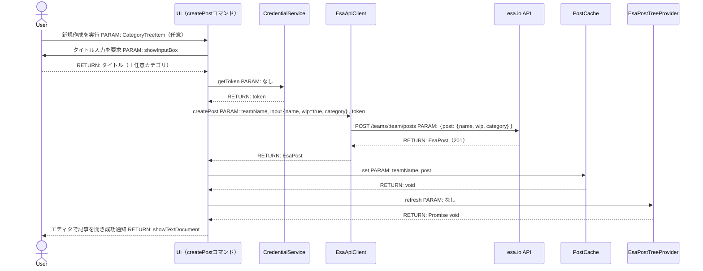
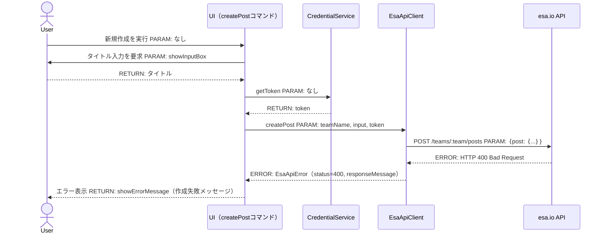
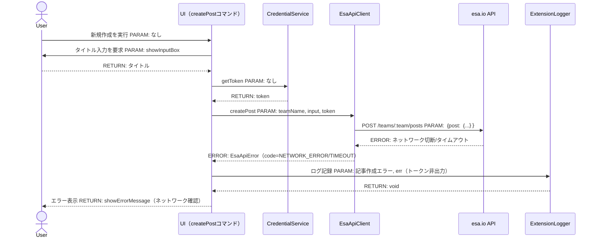
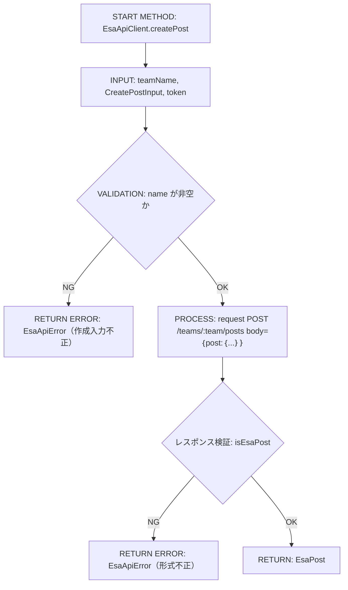
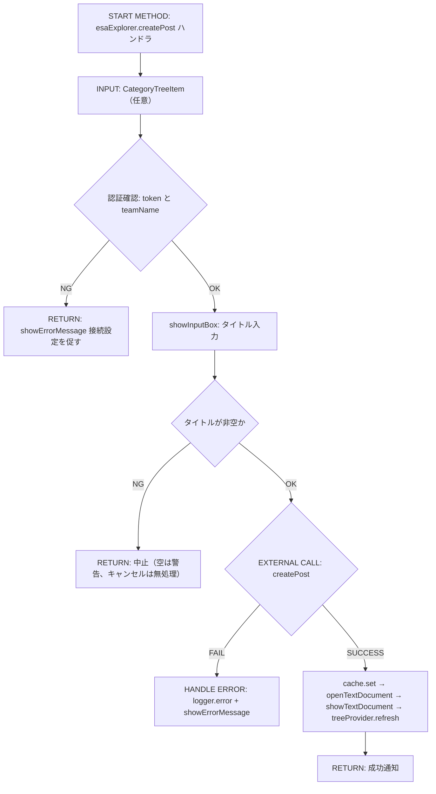
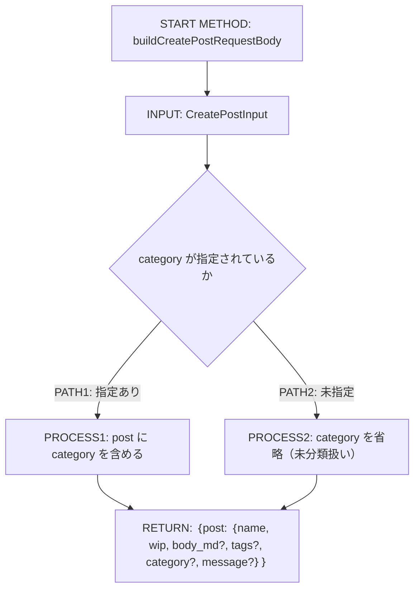
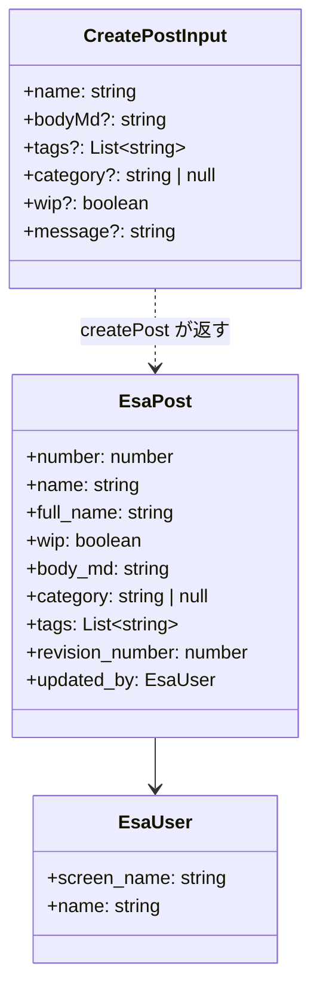

# Implementation Plan — 記事の新規作成（esaExplorer.createPost）

---

## 0. 実装入力コンテキスト

| 項目                             | 記入                                                                                   |
| -------------------------------- | -------------------------------------------------------------------------------------- |
| 対象Issue                        | #3 [DESIGN] 記事の新規作成（実装は本plan確定後の IMPLEMENT Issue で行う）              |
| 対象リポジトリ内パス（実装起点） | `src/`（`src/api/`, `src/commands/`, `src/tree/`, `src/extension.ts`, `package.json`） |

運用補足: Agent が実装時に直接参照する入力のみを記載する。未確定は `TBD（理由/決定条件/期限）` で記載する。

### 0.1 変更サマリ一覧（複数行）

| 区分（追加/修正/削除） | 対象（機能/コマンド/API）                     | 変更概要                                                                                              |
| ---------------------- | --------------------------------------------- | ----------------------------------------------------------------------------------------------------- |
| 追加                   | `EsaApiClient.createPost`                     | esa Public API v1 `POST /teams/:team/posts` を呼び出し新規記事を作成する公開メソッド                  |
| 追加                   | 型 `CreatePostInput`（`src/api/types.ts`）    | 記事作成リクエストの入力型（`name` 必須、他は Optional）                                              |
| 追加                   | コマンド `esaExplorer.createPost`             | タイトル（＋任意カテゴリ）を入力し記事を作成、成功後にエディタで開き Tree View を更新するハンドラ     |
| 追加                   | `src/commands/createPostCommand.ts`           | 上記コマンドの登録関数 `registerCreatePostCommand`                                                    |
| 修正                   | `src/extension.ts`                            | `registerCreatePostCommand` を `activate()` で DI 呼び出し                                            |
| 修正                   | `package.json` contributes                    | `commands` に `esaExplorer.createPost` を追加、`menus`（`view/title` / `view/item/context`）へ登録    |
| 追加                   | `src/test/api/EsaApiClient.test.ts`（追記）   | `createPost` の正常系/例外系/境界のテスト追加                                                         |
| 追加                   | `src/test/commands/createPostCommand.test.ts` | 入力バリデーション等、vscode API 非依存の純粋ロジックのテスト（該当ロジックを純粋関数へ切り出す場合） |

運用補足: 行数が不足する場合は同じ形式で行を追加する。

### 0.2 入力制約一覧（複数行）

| 制約区分（互換性/禁止事項/期限/その他） | 制約内容                                                                                     | 適用対象                                  |
| --------------------------------------- | -------------------------------------------------------------------------------------------- | ----------------------------------------- |
| 互換性                                  | 既存 `EsaPost` / `EsaPostsResponse` / `UpdatePostInput` を破壊的変更しない（新規型のみ追加） | `src/api/types.ts`                        |
| 互換性                                  | `EsaFileSystemProvider.writeFile` の `create` 拒否方針を維持する（FS層は変更しない）         | `src/filesystem/EsaFileSystemProvider.ts` |
| 互換性                                  | 単一チーム前提（`esaExplorer.teamName` 1件）を維持する。複数チーム同時接続は対象外           | `src/configuration.ts`                    |
| 禁止事項                                | Personal Access Token を SecretStorage 以外（ログ・設定・globalState）に書き込まない         | 全レイヤ                                  |
| 禁止事項                                | Extension Host のイベントループをブロックする同期的重い処理を書かない                        | コマンド/ApiClient                        |
| 期限                                    | なし（機能追加であり外部期限なし）                                                           | —                                         |
| その他                                  | 記事の削除・WIP切り替えUI・複数チーム対応は本planの対象外（別Issue）                         | スコープ境界                              |

運用補足: 行数が不足する場合は同じ形式で行を追加する。

### 0.3 関連機能・関連仕様一覧（複数行）

| 種別（要件/設計方針/ADR/調査/既存実装/外部仕様/その他） | パス/識別子                                         | この設計での利用目的                                             |
| ------------------------------------------------------- | --------------------------------------------------- | ---------------------------------------------------------------- |
| 要件                                                    | `.github/copilot/10-requirements.md` §4.2           | 将来追加候補「記事の新規作成・削除」「WIP初期値」の位置づけ確認  |
| 要件                                                    | `docs/roadmap.md`                                   | 「記事の新規作成・削除」候補の出所確認                           |
| 設計方針                                                | `.github/copilot/20-architecture.md`                | レイヤ構造・DI・二層構造の遵守                                   |
| 設計方針                                                | `.github/copilot/30-coding-standards.md`            | コーディング規約（型・例外・命名）                               |
| 設計方針                                                | `.github/copilot/40-testing-strategy.md`            | `@vscode/test-cli`（Mocha）テスト戦略                            |
| 設計方針                                                | `.github/copilot/50-security.md`                    | Secrets/SecretStorage・入力検証・型ガード                        |
| 設計方針                                                | `.github/copilot/60-ci-quality-gates.md`            | typecheck/lint/format:check/test/security の品質ゲート           |
| 既存実装                                                | `src/api/EsaApiClient.ts:214`（`updatePost`）       | POST/PATCH の `request` 呼び出し・`{ post: {...} }` ラップ流用   |
| 既存実装                                                | `src/commands/openPostCommand.ts:19`                | 作成後にエディタで開くフロー（`buildEsaUri`→`openTextDocument`） |
| 既存実装                                                | `src/filesystem/EsaFileSystemProvider.ts:96`        | `writeFile` の `create` 拒否方針（維持することを明記）           |
| 外部仕様                                                | esa Public API v1 `POST /v1/teams/:team_name/posts` | リクエスト `{ post: {...} }` ラップ・`name` 必須・レスポンス形状 |
| ADR                                                     | なし                                                | 本planでADR新規作成は行わない（10章のオープン課題で扱う）        |

運用補足: 行数が不足する場合は同じ形式で行を追加する。

---

## 1. 実装対象機能と機能ゴール

| 項目                                           | 内容                                                                                                                                                                            | 根拠                      |
| ---------------------------------------------- | ------------------------------------------------------------------------------------------------------------------------------------------------------------------------------- | ------------------------- |
| 実装対象詳細（機能/コマンド/View/API）         | コマンド `esaExplorer.createPost` と `EsaApiClient.createPost`。Tree View 右上ボタン／カテゴリ右クリックから起動し、esa.io へ新規記事を作成する                                 | Issue §1, §6              |
| 機能ゴール（実装後に観測できるユーザーユース） | ユーザーが Tree View から新規作成を選び、タイトル（任意でカテゴリ）を入力すると、esa.io に WIP 記事が作成され、作成された記事が Markdown エディタで開き、Tree View が更新される | Issue §1, §6.2            |
| 非ゴール（今回やらないこと）                   | 記事の削除、WIP/公開切り替えUI、複数チーム同時接続、`EsaFileSystemProvider` の `create` 対応、タグ入力UI、本文テンプレート入力UI                                                | Issue §3 非ゴール         |
| 完了条件（実装完了の判定）                     | ① `createPost` が `{ post: {...} }` でPOSTしレスポンスを型ガードで検証する ② コマンドがタイトル未入力/未認証/API障害を適切に処理する ③ `npm run check` と `npm test` が緑       | 9章テスト / 7章品質ゲート |
| 受入確認手順（1行で再現可能）                  | Extension Development Host で `esaExplorer.createPost` を実行→タイトル入力→記事作成・エディタ表示・Tree更新を確認し、`npm run check && npm test` を実行                         | —                         |

運用補足: 「完了条件」はテストまたは確認手順で判定可能な文で記載する。
運用補足: 「受入確認手順」はコマンド/操作を1行で再現できる形で記載する。

---

## 2. 前提・制約（SSOT）

| 種別                                                 | 内容                                                                                                                                        | 根拠（ファイル/ADR/Issue）            |
| ---------------------------------------------------- | ------------------------------------------------------------------------------------------------------------------------------------------- | ------------------------------------- |
| 参照したSSOT                                         | `00-index.md` / `copilot-instructions.md` / `10`〜`60` / `80-templates/implementation-plan.md`                                              | `.github/copilot/`                    |
| アーキテクチャ前提（UI/Provider・Service/ApiClient） | UI（tree/commands）→ Provider/Service → ApiClient（api/）→ Model/Type（api/types.ts）の単方向依存。DI 起点は `extension.ts activate()` のみ | `20-architecture.md`, Issue §4.1/§4.2 |
| VS Code バージョン要件                               | `^1.105.0`（`package.json` の `engines.vscode`）                                                                                            | package.json                          |
| 技術制約（互換性/期限/運用/セキュリティ）            | Personal Access Token は SecretStorage のみ。外部レスポンスは型ガードで検証。`async/await` で外部I/O。単一チーム前提                        | `50-security.md`, Issue §4.3/§4.4     |
| 未確定前提（TBD）                                    | なし（BLOCKERなし。残TBDは10.1でDEFAULT付き Non-blocking として管理）                                                                       | 10.1 TBD回収トラッキング              |

運用補足: 根拠は `ファイルパス` または `Issue/ADR` を必ず記載する。

---

## 3. 要件定義（実装受入条件）

### 3.1 機能要件

| ID    | 要件                                                            | 受入条件（テスト可能な形）                                                                                          |
| ----- | --------------------------------------------------------------- | ------------------------------------------------------------------------------------------------------------------- |
| FR-01 | `EsaApiClient.createPost` は `{ post: {...} }` でPOSTする       | mock fetch で `POST` かつ body に `post` キーが含まれ、`post.name` が入力タイトルと一致することを検証               |
| FR-02 | `createPost` はレスポンスを型ガード（`isEsaPost`）で検証する    | 不正な形状のレスポンス（`{ invalid: true }`）で `EsaApiError` を throw することを検証                               |
| FR-03 | コマンドはタイトル未入力（空/キャンセル）時に作成を中止する     | タイトルが空/`undefined` の場合、`createPost` が呼ばれないことを検証（純粋関数の入力バリデーションで判定）          |
| FR-04 | 作成成功後、記事をエディタで開き Tree View を更新する           | 成功時に `cache.set` → `buildEsaUri` → `openTextDocument` → `showTextDocument`、`treeProvider.refresh()` が呼ばれる |
| FR-05 | 未認証（トークン/チーム名なし）時はエラーメッセージを表示し中止 | トークンまたはチーム名が無い場合、`showErrorMessage` を表示し `createPost` を呼ばないことを検証                     |
| FR-06 | 作成時の初期 `wip` は `true`（DEFAULT）を送信する               | body の `post.wip === true` を検証（10.1 TBD-01 の DEFAULT に一致）                                                 |
| FR-07 | カテゴリ未指定時は `category` を送らず未分類（`未分類`）に分類  | カテゴリ未入力時 body に `category` が含まれない、または `null` であることを検証                                    |

運用補足: ID は `FR-01` 形式の連番（欠番禁止）。

### 3.2 非機能要件

| ID     | 要件                                                          | 受入条件（テスト可能な形）                                                                                        |
| ------ | ------------------------------------------------------------- | ----------------------------------------------------------------------------------------------------------------- |
| NFR-01 | Personal Access Token を SecretStorage 以外に出力しない       | エラーメッセージ・ログにトークン文字列が含まれないことを検証（既存 `EsaApiClient.test.ts` のパターン踏襲）        |
| NFR-02 | 外部I/O は `async/await` でイベントループをブロックしない     | `createPost` が `Promise<EsaPost>` を返し、`AbortController` タイムアウト（既存 `request`）を継承すること         |
| NFR-03 | UI層は `api/` 具象のHTTP詳細に依存せず `EsaApiError` のみ判定 | コマンドが `err instanceof EsaApiError` でメッセージ分岐し、生 `fetch` エラーを直接判定しないことをレビューで確認 |

運用補足: ID は `NFR-01` 形式の連番（欠番禁止）。

---

## 4. スコープ境界

運用補足: この章は「実装時の影響範囲」を記載する。設計 Agent の作業内容や設計書ファイル変更そのものは書かない。

### 4.0 スコープ境界の定義（機能単位）

| 区分（In-Scope/Out-of-Scope） | 対象機能/責務                                                   | 判定理由                                  |
| ----------------------------- | --------------------------------------------------------------- | ----------------------------------------- |
| In-Scope                      | `EsaApiClient.createPost`（HTTP POST・型検証）                  | 新規記事作成の中核責務                    |
| In-Scope                      | `esaExplorer.createPost` コマンド（入力受付・遷移・エラー表示） | UI起点とユースケース遂行                  |
| In-Scope                      | `package.json` contributes（commands/menus）への登録            | UI導線の露出                              |
| In-Scope                      | `CreatePostInput` 型の追加（`src/api/types.ts`）                | 入力契約の固定                            |
| Out-of-Scope                  | `EsaFileSystemProvider` の `create` 対応                        | コマンド＋API方式を採用しFS層は変更しない |
| Out-of-Scope                  | 記事削除／WIP切替UI／タグ入力UI／複数チーム対応                 | 別Issue・非ゴール                         |

運用補足: 対象機能/責務は「実装で変更される責務単位」を書く。
運用補足: ファイル列挙は `8.1 変更予定ファイル一覧` に一本化する。

### 4.2 実装時の影響範囲・互換性リスク

| 影響対象                                                   | 結論（影響あり/なし/未確定） | 影響内容                                                                                     |
| ---------------------------------------------------------- | ---------------------------- | -------------------------------------------------------------------------------------------- |
| UI（Tree View/コマンド/QuickPick等）                       | 影響あり                     | Tree View 右上に新規作成ボタン、カテゴリ右クリックに「このカテゴリに新規作成」を追加         |
| API/外部通信（esa Public API v1）                          | 影響あり                     | `POST /teams/:team/posts` を新規に呼び出す（既存 `request` ヘルパを流用）                    |
| データモデル（`api/types.ts`）                             | 影響あり                     | `CreatePostInput` を追加（Optional中心、既存型は非破壊）                                     |
| 外部依存（npm）                                            | 影響なし                     | 新規依存の追加なし                                                                           |
| CI/運用                                                    | 影響なし                     | 既存 `ci.yml` の `check` / `test` ジョブで検証（ワークフロー変更なし）                       |
| `package.json` contributes（commands/views/configuration） | 影響あり                     | `commands` 1件、`menus`（`view/title`・`view/item/context`）追加。`configuration` は変更なし |

運用補足: 結論は `影響あり` / `影響なし` / `未確定` のいずれかを記載する。

### 4.3 外部依存・Secrets の扱い

| 項目                                        | 内容                                                              | リスク/対応                                                      |
| ------------------------------------------- | ----------------------------------------------------------------- | ---------------------------------------------------------------- |
| 外部依存の追加/更新（npm）                  | なし                                                              | `npm audit` は既存どおり実行（新規依存なしのため増分リスクなし） |
| Secrets 利用有無（Personal Access Token等） | あり（作成API呼び出し時に `CredentialService.getToken()` を使用） | トークンは呼び出し直前に `Authorization` を組み立て、保持しない  |
| ログ/設定への機密混入対策                   | `ExtensionLogger` へトークンを出力しない。既存の非出力方針を踏襲  | エラーメッセージにトークンを含めない（NFR-01）                   |

### 4.4 4章の自己検証（必須）

| チェック項目                   | 合格条件                                                                                                    |
| ------------------------------ | ----------------------------------------------------------------------------------------------------------- |
| Design PR 差分を書いていないか | `.github/copilot/plans/*.md` や「設計ドキュメントのみ変更」を記載していない（本章はコード実装差分のみ記載） |
| 実装責務を書いているか         | In-Scope に実装責務が2件以上ある（`createPost` / コマンド / contributes / 型）                              |
| 実装影響を書いているか         | 4.2 で `影響あり` が複数あり、影響内容が具体記述されている                                                  |

---

## 5. アーキテクチャ設計

### 5.0 依存の組み立て（DI）経路

本プロジェクトは `src/extension.ts` の `activate(context)` を唯一のDIルートとし、コンストラクタ引数（または登録関数の引数）による依存注入を採用する。UI層（コマンドハンドラ）は具象クラスを直接 `new` せず、`activate()` から渡されたインスタンスを利用する。

| 区分（記載例/追記No） | 提供主体                  | 提供する依存                                            | 受け取る側                                    | 入力（型/値）                                        | 出力（型/値）       | 境界制約（禁止事項を含む）                                            |
| --------------------- | ------------------------- | ------------------------------------------------------- | --------------------------------------------- | ---------------------------------------------------- | ------------------- | --------------------------------------------------------------------- |
| 記載例                | `extension.ts activate()` | `EsaApiClient` インスタンス                             | `EsaPostTreeProvider`（コンストラクタ引数）   | なし                                                 | `EsaApiClient`      | Provider/コマンド内で `new EsaApiClient()` を直接呼ばない             |
| 記載例                | `extension.ts activate()` | `CredentialService` インスタンス                        | `EsaFileSystemProvider`（コンストラクタ引数） | `context.secrets`, `EsaApiClient`, `ExtensionLogger` | `CredentialService` | SecretStorageへのアクセスは `CredentialService` 経由に限定する        |
| 01                    | `extension.ts activate()` | `EsaApiClient` インスタンス                             | `registerCreatePostCommand`（登録関数引数）   | `apiClient`                                          | 登録済みコマンド    | コマンド内で `new EsaApiClient()` しない（`activate()` 生成分を使用） |
| 02                    | `extension.ts activate()` | `CredentialService` インスタンス                        | `registerCreatePostCommand`（登録関数引数）   | `credentialService`                                  | 登録済みコマンド    | SecretStorage は `CredentialService.getToken()` 経由のみ              |
| 03                    | `extension.ts activate()` | `PostCache` / `EsaPostTreeProvider` / `ExtensionLogger` | `registerCreatePostCommand`（登録関数引数）   | `cache`, `treeProvider`, `logger`                    | 登録済みコマンド    | Tree更新は `treeProvider.refresh()` 経由、直接描画しない              |

運用補足: 記載例の行は削除せず参照用に残す。
運用補足: 新規クラスを追加する場合、それがどこで生成され、どこへ渡されるかを明記する。本planは新規クラスを追加せず、既存 `openPostCommand` と同じ「登録関数へ依存注入」パターンに合わせる。
運用補足: 未確定値は `TBD（理由/決定条件/期限）` を使用し、空欄を禁止する。

#### 5.0.1 最小固定セット（TBD禁止）

| 最小固定項目 | 必須記載内容                                                                                                             | 対応セクション          |
| ------------ | ------------------------------------------------------------------------------------------------------------------------ | ----------------------- |
| DI 経路      | `extension.ts activate() -> registerCreatePostCommand(apiClient, cache, credentialService, logger, treeProvider)` で固定 | `5.0`, `5.7.0`, `5.7.2` |
| 非同期境界   | コマンド・`createPost` は `async/await`。`request` の `AbortController` でタイムアウトし、同期重処理を書かない           | `5.5.1`, `8.3`          |
| 外部I/O境界  | esa.io へのHTTPは `EsaApiClient.createPost`（`api/`層）に閉じ、UI層は `EsaApiError` のみ判定                             | `8.3`, `8.4`            |

運用補足: 上記3項目は `TBD（理由/決定条件/期限）` を禁止する。
運用補足: 上記3項目の記述が未確定の場合は設計未完了として扱い、実装へ進めない。

### 5.1 設計判断

#### 5.1.1 責務分離 / データフロー（詳細）

| 記載形式        | 選択（A/B） |
| --------------- | ----------- |
| 形式A: 箇条書き | 不採用      |
| 形式B: テーブル | 採用        |

形式B（テーブル）

| No. | 決定事項（実装責務単位）                                                                                                             | 根拠                                                                 | 未確定（あれば）            |
| --- | ------------------------------------------------------------------------------------------------------------------------------------ | -------------------------------------------------------------------- | --------------------------- |
| 1   | UI起点は Tree View 右上（`view/title`）＋カテゴリ右クリック（`view/item/context`, `viewItem == esaCategory`）の両方                  | Issue §6.2「UI起点」、既存 `refreshPosts`/`openInBrowser` のUXに準拠 | なし                        |
| 2   | 最小入力はタイトル（必須 `showInputBox`）＋カテゴリ（任意 `showInputBox`）。カテゴリ右クリック時は当該カテゴリを初期値に補完         | Issue §6.2「入力方法」、`configure` の `showInputBox` 実装に準拠     | なし                        |
| 3   | 作成はコマンド＋API方式。作成成功後は既存 `openPost` フロー（`cache.set`→`buildEsaUri`→`openTextDocument`→`showTextDocument`）で開く | Issue §6.2「FileSystemProviderの扱い/作成後の遷移」                  | なし                        |
| 4   | `EsaFileSystemProvider.writeFile` の `create` 拒否は維持し、FS層は一切変更しない                                                     | Issue §6.2、`EsaFileSystemProvider.ts:96`                            | なし                        |
| 5   | レイヤ分離は既存 `openPostCommand` パターン（コマンドが `EsaApiClient` を DI で受け取り呼び出す）に合わせる                          | Issue §6.2「レイヤ分離の既存の実態」、`openPostCommand.ts:3,38`      | 10.1 TBD-02（Non-blocking） |
| 6   | 初期 `wip` は `true`（下書き扱い）を送信する                                                                                         | Issue §6.2「WIP初期値」                                              | なし                        |
| 7   | カテゴリ未指定時は `category` を送信せず、未分類（`UNCATEGORIZED_LABEL = 未分類`）配下に表示                                         | Issue §6.2「カテゴリ未指定時の扱い」、`constants.ts:12`              | なし                        |

#### 5.1.2 エッジケース / 例外系 / リトライ方針（詳細）

| 記載形式        | 選択（A/B） |
| --------------- | ----------- |
| 形式A: 箇条書き | 不採用      |
| 形式B: テーブル | 採用        |

形式B（テーブル）

| No. | ケース                               | 方針（戻り値/表示/再試行）                                                                        | 根拠                         | 未確定（あれば） |
| --- | ------------------------------------ | ------------------------------------------------------------------------------------------------- | ---------------------------- | ---------------- |
| 1   | タイトル未入力（空文字/`undefined`） | `createPost` を呼ばず中止。空文字は警告 `showWarningMessage`、キャンセルは無処理で return         | `configure` の入力扱いに準拠 | なし             |
| 2   | 未認証（トークンなし/チーム名なし）  | `showErrorMessage`（接続設定を促す文言）を表示し中止。再試行しない                                | `openPostCommand.ts:20-34`   | なし             |
| 3   | バリデーションエラー（HTTP 400）     | `EsaApiError`（status=400, responseMessage 付与）を `showErrorMessage` で表示。自動再試行しない   | `EsaApiClient.ts:91-95`      | なし             |
| 4   | 認証/権限エラー（HTTP 401/403）      | `EsaApiError` のメッセージをそのまま表示。トークン再設定/権限確認を促す                           | `EsaApiClient.ts:96-105`     | なし             |
| 5   | レート制限（HTTP 429）               | `EsaApiError`（retryAfterSeconds 付き）を表示。ユーザー操作による再試行に委ねる（自動再試行なし） | `EsaApiClient.ts:108-117`    | なし             |
| 6   | ネットワーク/タイムアウト            | `EsaApiError`（code=NETWORK_ERROR / TIMEOUT）を表示。自動再試行しない                             | `EsaApiClient.ts:160-168`    | なし             |
| 7   | レスポンス形状不正                   | `EsaApiError`（形式不正メッセージ）を throw し、UIで表示                                          | `EsaApiClient.ts:208-211`    | なし             |

#### 5.1.3 VS Code UI部品一覧

| 種別     | 部品名（設計上の候補）                                      | 主責務                                     | 対応機能     |
| -------- | ----------------------------------------------------------- | ------------------------------------------ | ------------ |
| View     | Tree View（`esaExplorer.posts`、既存）                      | 記事一覧表示と作成導線の起点               | FR-04        |
| Item     | `CategoryTreeItem`（`contextValue: esaCategory`、既存）     | 右クリック「このカテゴリに新規作成」の対象 | FR-01/FR-07  |
| Command  | `esaExplorer.createPost`                                    | 入力受付→作成→エディタ表示→Tree更新        | FR-01〜FR-07 |
| Input    | `showInputBox`（タイトル必須／カテゴリ任意）                | ユーザーからのタイトル・カテゴリ入力       | FR-01/FR-03  |
| Feedback | `showInformationMessage`（成功）/`showErrorMessage`（失敗） | 作成結果の通知                             | FR-04/FR-05  |

運用補足: View は `contributes.views`/`createTreeView` 単位、Item はTree/QuickPickの各項目、Command は `contributes.commands` 登録コマンド、Input はユーザー入力UI、Feedback は通知を指す。

#### 5.1.4 ログと観測性（漏洩防止を含む / 詳細）

| 記載形式        | 選択（A/B） |
| --------------- | ----------- |
| 形式A: 箇条書き | 不採用      |
| 形式B: テーブル | 採用        |

形式B（テーブル）

| No. | 観点                  | 方針                                                                                     | 根拠                     | 未確定（あれば） |
| --- | --------------------- | ---------------------------------------------------------------------------------------- | ------------------------ | ---------------- |
| 1   | ログ出力内容          | 作成開始（タイトル/カテゴリの概要）・作成完了（記事番号 `#number`）を `logger.info`      | `openPostCommand.ts:37`  | なし             |
| 2   | マスキング/非出力項目 | Personal Access Token・`Authorization` ヘッダーは一切出力しない                          | `50-security.md`, NFR-01 | なし             |
| 3   | エラー記録粒度        | 失敗時 `logger.error("記事作成エラー", err)`。ユーザー通知にはスタックトレースを含めない | `openPostCommand.ts:46`  | なし             |

### 5.2 トレードオフ

| 判断テーマ     | 案A                                                             | 案B                                                    | 採用案 | 採用理由                                                                    | 不採用理由                                                                  |
| -------------- | --------------------------------------------------------------- | ------------------------------------------------------ | ------ | --------------------------------------------------------------------------- | --------------------------------------------------------------------------- |
| 作成の実装方式 | コマンド＋API作成後に既存フローで開く                           | `EsaFileSystemProvider.writeFile(create)` をFS層で対応 | 案A    | FS層の `create` 拒否・新URIスキーム運用が不要で影響が局所化、既存フロー流用 | 未確定の新URI採番（記事番号がAPIレスポンスで確定するため事前URIを作れない） |
| レイヤ分離     | 既存 `openPostCommand` 同様コマンドが直接 `EsaApiClient` を呼ぶ | Service層を新設し `EsaApiClient` を隠蔽                | 案A    | 既存コマンド群と一貫、最小差分、単純なCRUD1操作にService新設は過剰          | 一貫性が崩れ、抽象追加コストが便益を上回る（SSOT理想との差分は10.1で追跡）  |
| 入力項目の範囲 | タイトルのみ                                                    | タイトル＋カテゴリ（任意）                             | 案B    | カテゴリ右クリック起点を活かせ、未分類回避の実用性が高い                    | タイトルのみは右クリック起点のカテゴリ補完を活かせない                      |

### 5.3 UI導線方針

| 項目                                                                    | 決定内容                                                                                             | 根拠                          |
| ----------------------------------------------------------------------- | ---------------------------------------------------------------------------------------------------- | ----------------------------- |
| 導線方式（Tree View項目/コマンドパレット/コンテキストメニュー/WebView） | Tree View 右上ボタン（`view/title`）＋カテゴリ右クリック（`view/item/context`）＋コマンドパレット    | Issue §6.2, `package.json:91` |
| 操作の起点（誰がどこから呼び出すか）                                    | ユーザーが Tree View から起動。カテゴリ右クリック時は `CategoryTreeItem` を引数として受け取る        | `EsaTreeItem.ts:5-13`         |
| `package.json` contributes への登録要否（commands/menus/views）         | 要（`commands` に1件、`menus.view/title` と `menus.view/item/context`（`viewItem == esaCategory`）） | `package.json:53-115`         |
| 状態受け渡し方式（Tree Item引数/QuickPick選択結果等）                   | カテゴリ起点は `CategoryTreeItem.label` を初期カテゴリとして受け渡し、`showInputBox` の初期値に設定  | `EsaTreeItem.ts:6-11`         |

### 5.4 アーキテクチャレイヤー方針

| レイヤ                                             | 定義                       | 許可する依存方向       | 禁止する依存                                 |
| -------------------------------------------------- | -------------------------- | ---------------------- | -------------------------------------------- |
| UI（tree/commands）                                | ユーザー操作の受付・表示   | Service/Provider層のみ | `api/` の具象クライアントを直接 `new` しない |
| Provider/Service（tree/filesystem/authentication） | 状態管理・VS Code API連携  | `api/`・`cache/`       | UI層のimportを持たない                       |
| ApiClient（api/）                                  | esa.io APIとのHTTP通信     | 外部HTTP（fetch）      | UI/Provider層をimportしない                  |
| Model/Type（api/types.ts）                         | データ構造（TypeScript型） | なし                   | 他レイヤに依存しない                         |

運用補足: 本planは既存 `openPostCommand` と同様、コマンドが DI 経由で受け取った `EsaApiClient` を呼ぶ。`new EsaApiClient()` はコマンド内で行わない（`activate()` 生成分を注入）。SSOT理想（UI→Service経由）との差分は 10.1 TBD-02 で Non-blocking 課題として追跡する。

### 5.5 データ取得ライフサイクル

| データ種別                     | 取得タイミング                                     | 取得場所                          | 理由                                                         |
| ------------------------------ | -------------------------------------------------- | --------------------------------- | ------------------------------------------------------------ |
| 初期表示必須データ（記事一覧） | Tree View初回展開時/`refresh()`                    | `EsaPostTreeProvider`             | 既存挙動を維持                                               |
| ユーザー操作後データ           | コマンド実行時（作成→レスポンスの `EsaPost`）      | `esaExplorer.createPost` ハンドラ | 作成結果をキャッシュ格納しエディタで即時表示するため         |
| バックグラウンド更新           | 明示的な更新コマンドのみ（作成成功後 `refresh()`） | コマンドハンドラ                  | 作成直後に一覧へ反映するため `treeProvider.refresh()` を呼ぶ |

| キャッシュ方針                      | 採用有無 | ルール                                                                     |
| ----------------------------------- | -------- | -------------------------------------------------------------------------- |
| インメモリキャッシュ（`PostCache`） | 採用     | 作成成功後 `cache.set(teamName, post)` し、`readFile` で本文を即時提供する |
| ディスクキャッシュ                  | 不採用   | 既存方針を踏襲（仮想FS・メモリキャッシュのみ）                             |

#### 5.5.1 非同期処理とイベントループ境界

| 対象処理                          | 実行コンテキスト                                | 実装場所                              | 禁止事項                                         |
| --------------------------------- | ----------------------------------------------- | ------------------------------------- | ------------------------------------------------ |
| UI更新（Tree View再描画）         | Extension Host（`_onDidChangeTreeData.fire()`） | `EsaPostTreeProvider.refresh()`       | 同期的な重い処理でイベントループをブロックしない |
| ネットワーク通信（esa.io API）    | Extension Host（`async/await`）                 | `api/EsaApiClient.ts`（`createPost`） | 呼び出し元をブロックする同期APIを使わない        |
| ファイルI/O（`esa:` 仮想FS）      | Extension Host（`async/await`）                 | `filesystem/EsaFileSystemProvider.ts` | 本planでは変更しない（`create` 拒否を維持）      |
| 認証情報アクセス（SecretStorage） | Extension Host（`async/await`）                 | `authentication/CredentialService.ts` | トークンをモジュールスコープに長期保持しない     |

運用補足: VS Code拡張機能はExtension Host（単一のNode.jsプロセス）上で動作するため、「イベントループをブロックしないこと」「`async/await`で外部I/Oを行うこと」を境界として扱う。
運用補足: 境界違反は `8.3 実装禁止事項` と `8.4 モジュール/アクセス制御方針` に同じ内容で反映する。

### 5.6 エラーハンドリング標準形

| 分類（network/unauthorized/notfound/validation/unknown） | エラー型      | UI 表示ルール                                       | 再試行ルール   |
| -------------------------------------------------------- | ------------- | --------------------------------------------------- | -------------- |
| network                                                  | `EsaApiError` | `showErrorMessage`（ネットワーク確認を促す）        | 自動再試行なし |
| unauthorized                                             | `EsaApiError` | `showErrorMessage`（トークン再設定/権限確認を促す） | 自動再試行なし |
| notfound                                                 | `EsaApiError` | `showErrorMessage`（チーム/記事が見つからない）     | 自動再試行なし |
| validation                                               | `EsaApiError` | `showErrorMessage`（400のresponseMessageを併記）    | 自動再試行なし |
| unknown                                                  | `Error`       | `showErrorMessage`（汎用「作成時にエラー」文言）    | 自動再試行なし |

| ログ方針                      | 内容                                                                    |
| ----------------------------- | ----------------------------------------------------------------------- |
| 出力する情報                  | 作成開始/完了（記事番号 `#number`）・エラー種別と概要（`logger.error`） |
| 出力しない情報（Secrets/PII） | Personal Access Token・`Authorization` ヘッダー・生のトークン文字列     |

#### 5.6.1 エラー変換責務（例外 → 構造化エラー）

| 変換対象                        | 例外発生層            | 構造化エラーへ変換する層                       | 上位層へ渡す型                              | 禁止事項                                              |
| ------------------------------- | --------------------- | ---------------------------------------------- | ------------------------------------------- | ----------------------------------------------------- |
| ネットワーク例外（fetch失敗等） | `api/EsaApiClient.ts` | `api/EsaApiClient.ts`                          | `EsaApiError`（code=NETWORK_ERROR/TIMEOUT） | UI/コマンド層で生の`fetch`エラーを直接判定しない      |
| APIエラーレスポンス（4xx/5xx）  | `api/EsaApiClient.ts` | `api/EsaApiClient.ts`（`handleErrorResponse`） | `EsaApiError`（status/code/レート制限情報） | コマンド層に変換ロジックを持たせない                  |
| バリデーションエラー（入力値）  | コマンドハンドラ      | コマンドハンドラ（発生層）                     | なし（`showWarningMessage`で早期return）    | 空タイトルのままAPIを呼ばない                         |
| 予期せぬ例外                    | 任意層                | 呼び出し元（コマンド）                         | `Error`                                     | スタックトレース/機密情報をユーザー向け通知に含めない |

### 5.7 シーケンス図（Mermaid / 複数必須）

運用補足: 正常系・異常系で participant 名を統一し、図ごとに別名へ置換しない。
運用補足: `ログ責務` / `エラー変換責務` / `非同期処理の境界` は本文・表・図で同一結論に統一する（矛盾禁止）。

| 必須項目   | 記載ルール                                                            |
| ---------- | --------------------------------------------------------------------- |
| DI 経路    | 必須（`extension.ts activate() -> registerCreatePostCommand` を明記） |
| 正常系     | 必須（最低1本）                                                       |
| 異常系     | 必須（最低2本。業務エラー系/システムエラー系）                        |
| パラメータ | 各呼び出しメッセージに `PARAM` を明記                                 |
| 戻り値     | 各応答メッセージに `RETURN` を明記                                    |
| エラー返却 | 各異常系で `ERROR` の返却値とハンドリング先を明記                     |

#### 5.7.0 DI 経路（テキスト再掲 / 必須）

| No     | 開始主体                  | 終了主体                     | 提供する依存                                                                           | 受け渡し方法       | 経路文字列（`A -> B -> C`）                                         | 境界チェック観点                            | 対応シーケンス図ID |
| ------ | ------------------------- | ---------------------------- | -------------------------------------------------------------------------------------- | ------------------ | ------------------------------------------------------------------- | ------------------------------------------- | ------------------ |
| 記載例 | `extension.ts activate()` | `EsaPostTreeProvider`        | `EsaApiClient`                                                                         | コンストラクタ引数 | `activate() -> EsaPostTreeProvider -> Tree View`                    | 具象APIクライアントがUI層に漏れていないこと | SEQ-01             |
| 01     | `extension.ts activate()` | `createPostCommand` ハンドラ | `EsaApiClient`,`PostCache`,`CredentialService`,`ExtensionLogger`,`EsaPostTreeProvider` | 登録関数引数       | `activate() -> registerCreatePostCommand -> esaExplorer.createPost` | コマンドが `new EsaApiClient()` しないこと  | SEQ-01             |
| 02     | `esaExplorer.createPost`  | `EsaApiClient.createPost`    | 実行時引数（teamName/input/token）                                                     | メソッド引数       | `createPostCommand -> EsaApiClient.createPost -> esa.io API`        | HTTP詳細が `api/` に閉じていること          | SEQ-02             |

運用補足: 記載例の行は削除せず参照用に残す。
運用補足: 経路文字列は `主体名` を `->` で連結した1行形式で記載する。

#### 5.7.1 シーケンス対象一覧

| 図ID   | 種別（正常/異常） | 起点（コマンド/UI操作）                       | 終点（ApiClient/外部I/O）        | 対応要件ID（FR/NFR）    |
| ------ | ----------------- | --------------------------------------------- | -------------------------------- | ----------------------- |
| SEQ-01 | 正常（DI 経路）   | Tree View 新規作成ボタン/右クリック           | `EsaApiClient.createPost`→esa.io | FR-01/FR-04/FR-06/FR-07 |
| SEQ-02 | 異常（業務）      | 新規作成コマンド（400 バリデーション）        | `EsaApiClient.createPost`→esa.io | FR-02, 5.1.2 No.3       |
| SEQ-03 | 異常（システム）  | 新規作成コマンド（ネットワーク/タイムアウト） | `EsaApiClient.createPost`→esa.io | NFR-02, 5.1.2 No.6      |

#### 5.7.1.1 境界整合チェック（必須）

| 境界テーマ                     | 文章セクション | 表セクション | 図セクション | 整合判定（OK/NG） |
| ------------------------------ | -------------- | ------------ | ------------ | ----------------- |
| ログ責務（どの層で出力するか） | `5.1.4`        | `5.6`        | `5.7.4`      | OK                |
| エラー変換責務                 | `5.1.2`        | `5.6.1`      | `5.7.3`      | OK                |
| 非同期処理の境界               | `5.5.1`        | `8.3`        | `5.7.2`      | OK                |

運用補足: 3行すべて `OK` になるまで設計を確定しない。

#### 5.7.1.2 最小固定セット具体化チェック（必須）

| 最小固定項目                                 | 文章セクション | 表セクション | 図セクション     | TBD残存数（0のみ可） |
| -------------------------------------------- | -------------- | ------------ | ---------------- | -------------------- |
| DI 経路（`activate() -> Provider/コマンド`） | `5.0.1`        | `5.0`        | `5.7.0`, `5.7.2` | 0                    |
| 非同期処理の境界（イベントループ非ブロック） | `5.5.1`        | `5.5.1`      | `5.7.2`          | 0                    |
| 外部I/O境界（`api/`層への閉じ込め）          | `8.3`          | `8.4`        | `5.7.2`          | 0                    |

運用補足: `TBD残存数` は各項目で `0` 以外を禁止する。

#### 5.7.2 正常系シーケンス（必須）

運用補足: Mermaid のラベルでは半角括弧/半角カギ括弧を使わず、全角の `（ ）［ ］｛ ｝` を使用する。バッククォートはラベル内で使用しない。

#### 5.7.3 異常系シーケンス（業務エラー）

#### 5.7.4 異常系シーケンス（システムエラー）

### 5.8 処理フロー図（メソッドレベル / 複数必須）

| 必須項目       | 記載ルール                       |
| -------------- | -------------------------------- |
| 対象メソッド数 | 必須（最低3メソッド）            |
| 分岐           | 各メソッドで正常/異常分岐を明記  |
| 入出力         | 各メソッドの入力/出力を明記      |
| 例外処理       | 例外時の戻り値または伝播先を明記 |

#### 5.8.1 メソッド一覧

| 図ID    | メソッド名                                           | 層（UI/Provider/ApiClient） | 対応要件ID（FR/NFR）    |
| ------- | ---------------------------------------------------- | --------------------------- | ----------------------- |
| FLOW-01 | `EsaApiClient.createPost`                            | ApiClient                   | FR-01/FR-02/FR-06/FR-07 |
| FLOW-02 | `esaExplorer.createPost` ハンドラ                    | UI（commands）              | FR-03/FR-04/FR-05       |
| FLOW-03 | `buildCreatePostRequestBody`（純粋関数・任意切出し） | ApiClient/純粋関数          | FR-06/FR-07             |

運用補足: メソッド名の全件 `<<unknown>>` は禁止する。最低3件は具体メソッド名を記載する。

#### メソッドフロー（FLOW-01）

#### メソッドフロー（FLOW-02）

#### メソッドフロー（FLOW-03）

---

## 6. 契約仕様（インターフェース / 型契約）

### 6.0 契約の固定前提

| 項目                      | 固定方針                                                                                                                      |
| ------------------------- | ----------------------------------------------------------------------------------------------------------------------------- |
| DI 起点                   | `extension.ts activate()` のみで依存を組み立てる                                                                              |
| 外部I/Oを持つクラスの責務 | `EsaApiClient` はコンストラクタで `FetchFn` を受け取り、モジュールスコープの可変状態を持たない（既存どおり）                  |
| 型ガードの配置            | 作成レスポンスは `api/` 層の `isEsaPost` で `unknown` から絞り込む                                                            |
| UI 層の責務               | コマンドは DI で受けた `EsaApiClient` の公開メソッド `createPost` を呼び、HTTP詳細に依存しない（既存 `openPostCommand` 同様） |

運用補足: 型・インターフェース定義が曖昧な場合は実装を開始しない。先にこの章を確定させる。

### 6.1 入出力契約（コマンド/関数/API呼び出し）

| ID     | 入口（コマンド/操作/関数） | 入力                                                          | 出力                                 | エラー                                                            | 備考                                                   |
| ------ | -------------------------- | ------------------------------------------------------------- | ------------------------------------ | ----------------------------------------------------------------- | ------------------------------------------------------ |
| IFC-01 | `esaExplorer.createPost`   | `item?: CategoryTreeItem`（右クリック時のみ）＋対話入力       | `Promise<void>`（副作用: 作成/表示） | 未認証/入力不正/`EsaApiError` を `showErrorMessage`               | カテゴリ起点時は `item.label` を初期カテゴリに使用     |
| IFC-02 | `EsaApiClient.createPost`  | `teamName: string`, `input: CreatePostInput`, `token: string` | `Promise<EsaPost>`                   | `EsaApiError`（400/401/403/404/429/5xx/形式不正/network/timeout） | body は `{ post: {...} }` でラップ、`isEsaPost` で検証 |

運用補足: ID は `IFC-01` 形式の連番。入口ごとに採番する。

### 6.2 型/モデル/スキーマ

| ID      | 対象                                | 変更内容（追加/変更/削除）       | 後方互換         |
| ------- | ----------------------------------- | -------------------------------- | ---------------- |
| TYPE-01 | `CreatePostInput`（`api/types.ts`） | 追加                             | 影響なし（新規） |
| TYPE-02 | `EsaPost`（`api/types.ts`）         | 変更なし（作成レスポンスに流用） | 互換維持         |

運用補足: ID は `TYPE-01` 形式の連番。変更内容は `追加` / `変更` / `削除` のみ。

### 6.3 インターフェース定義（実装エンジニア向け固定案）

#### 6.3.1 公開関数/クラスメソッド一覧

| No. | 対象（クラス名/関数名）      | メソッド署名（TypeScript形式）                                                                                                                                                                                   | 配置ファイル候補                            | 備考                                        |
| --- | ---------------------------- | ---------------------------------------------------------------------------------------------------------------------------------------------------------------------------------------------------------------- | ------------------------------------------- | ------------------------------------------- |
| 1   | `EsaApiClient.createPost`    | `async createPost(teamName: string, input: CreatePostInput, token: string): Promise<EsaPost>`                                                                                                                    | `src/api/EsaApiClient.ts`                   | `request(token, "POST", path, body)` を利用 |
| 2   | `registerCreatePostCommand`  | `registerCreatePostCommand(context: vscode.ExtensionContext, apiClient: EsaApiClient, cache: PostCache, credentialService: CredentialService, logger: ExtensionLogger, treeProvider: EsaPostTreeProvider): void` | `src/commands/createPostCommand.ts`         | 既存 `registerOpenPostCommand` に準拠       |
| 3   | `buildCreatePostRequestBody` | `buildCreatePostRequestBody(input: CreatePostInput): { post: Record<string, unknown> }`                                                                                                                          | `src/api/EsaApiClient.ts`（module private） | 純粋関数、テスト容易化のため任意で切り出し  |

#### 6.3.2 型/インターフェース図（Mermaid classDiagram）

| 図ID   | 対象領域           | 対応する型/クラス                       | 対応要件ID（FR/NFR） |
| ------ | ------------------ | --------------------------------------- | -------------------- |
| CLS-01 | 記事作成の入出力型 | `CreatePostInput`, `EsaPost`, `EsaUser` | FR-01/FR-06/FR-07    |

##### 型レベルのクラス図（CLS-01）

#### 6.3.3 型別モデル定義（省略不可）

運用補足: 論理名ではなく、コード上の物理名（実際の型名/プロパティ名）で記載する。
運用補足: 全プロパティを行単位で列挙する。

##### 6.3.3.1 モデル一覧

| 対象領域       | 型名              | 区分（interface/type/enum） | 用途                    |
| -------------- | ----------------- | --------------------------- | ----------------------- |
| 記事作成入力   | `CreatePostInput` | interface                   | `createPost` の入力契約 |
| 記事レスポンス | `EsaPost`         | interface（既存・流用）     | `createPost` の戻り値   |

##### 6.3.3.2 プロパティ詳細定義（全項目を行で列挙）

| 対象領域     | 型名              | プロパティ名 | TypeScript 型（完全表記） | 必須（Y/N） | Optional（Y/N） | 説明                                       | 例                       |
| ------------ | ----------------- | ------------ | ------------------------- | ----------- | --------------- | ------------------------------------------ | ------------------------ |
| 記事作成入力 | `CreatePostInput` | `name`       | `string`                  | Y           | N               | 記事タイトル。esa APIで必須                | `"新しい記事"`           |
| 記事作成入力 | `CreatePostInput` | `bodyMd`     | `string`                  | N           | Y               | 本文Markdown。省略時は空記事               | `"# 見出し"`             |
| 記事作成入力 | `CreatePostInput` | `tags`       | `string[]`                | N           | Y               | タグ一覧。本planのUIでは未入力（将来拡張） | `["draft"]`              |
| 記事作成入力 | `CreatePostInput` | `category`   | `string \| null`          | N           | Y               | カテゴリ。未指定/`null`は未分類扱い        | `"日報/2026"`            |
| 記事作成入力 | `CreatePostInput` | `wip`        | `boolean`                 | N           | Y               | WIPフラグ。未指定時はDEFAULT `true` を送信 | `true`                   |
| 記事作成入力 | `CreatePostInput` | `message`    | `string`                  | N           | Y               | 変更メッセージ。省略可                     | `"Created from VS Code"` |

##### 6.3.3.3 リテラル型/Union制約

| No. | 型名                       | 値一覧           | 用途                         |
| --- | -------------------------- | ---------------- | ---------------------------- |
| 1   | `CreatePostInput.category` | `string \| null` | 未分類を `null`/未送信で表現 |

#### 6.3.4 互換性ルール

| 項目                         | ルール                                                                                 |
| ---------------------------- | -------------------------------------------------------------------------------------- |
| 破壊的変更の扱い             | 既存 `EsaPost`/`UpdatePostInput` を変更しない。新規型 `CreatePostInput` のみ追加       |
| Optionalプロパティ追加の扱い | `CreatePostInput` の `name` 以外は Optional として追加し、既存呼び出しへ影響を出さない |
| 型名変更/移動の扱い          | 既存型名の変更/移動は行わない                                                          |
| 実装側への影響確認手順       | `npm run typecheck` で `api/`・`commands/`・`extension.ts` の型整合を確認              |

---

## 7. データ設計（必要な場合のみ）

| 項目                                                         | 内容                                                                    | 互換性/移行          |
| ------------------------------------------------------------ | ----------------------------------------------------------------------- | -------------------- |
| 保存領域の変更（SecretStorage/globalState/workspaceState等） | なし（トークンは既存SecretStorage、記事本文はメモリキャッシュ）         | 変更なし             |
| マイグレーション方針                                         | 不要（データスキーマ変更なし）                                          | —                    |
| 既存データ影響                                               | なし（作成結果を `PostCache` に追加するのみ）                           | 既存キャッシュと互換 |
| ロールバック方針                                             | コマンド/メニュー登録の revert で無効化可能（副作用は外部記事作成のみ） | —                    |

---

## 8. 実装指示（製造 Agent 向け）

### 8.1 変更予定ファイル一覧（必須）

| No. | パス                                          | 区分（UI/Provider/ApiClient/Model/Test/Other） | 変更タイプ（追加/変更/削除） | 実装内容（具体）                                                                                                                                                                       | 完了条件                         |
| --- | --------------------------------------------- | ---------------------------------------------- | ---------------------------- | -------------------------------------------------------------------------------------------------------------------------------------------------------------------------------------- | -------------------------------- |
| 1   | `src/api/types.ts`                            | Model                                          | 変更（追加）                 | `CreatePostInput` インターフェースを追加                                                                                                                                               | typecheck 通過                   |
| 2   | `src/api/EsaApiClient.ts`                     | ApiClient                                      | 変更（追加）                 | `createPost` メソッドを追加。`{ post: {...} }` でPOSTし `isEsaPost` で検証                                                                                                             | 正常系/異常系テスト緑            |
| 3   | `src/commands/createPostCommand.ts`           | UI                                             | 追加                         | `registerCreatePostCommand` を実装（入力/認証確認/作成/表示/更新/エラー処理）                                                                                                          | コマンドが登録され受入手順が再現 |
| 4   | `src/extension.ts`                            | Other                                          | 変更                         | `registerCreatePostCommand(...)` を `activate()` で DI 呼び出し                                                                                                                        | 拡張が起動しコマンドが動作       |
| 5   | `package.json`                                | Other                                          | 変更                         | `contributes.commands` に `esaExplorer.createPost`、`menus.view/title`・`menus.view/item/context`（`viewItem == esaCategory`）を追加。`activationEvents` に必要なら `onCommand` を追加 | コマンドがUIに表示               |
| 6   | `src/test/api/EsaApiClient.test.ts`           | Test                                           | 変更（追加）                 | `createPost` の POST/body検証・型不正・4xx/5xx・ネットワーク/タイムアウトのテスト追加                                                                                                  | `npm test` 緑                    |
| 7   | `src/test/commands/createPostCommand.test.ts` | Test                                           | 追加                         | 入力バリデーション等 vscode API 非依存ロジック（切り出した純粋関数）のテスト                                                                                                           | `npm test` 緑                    |

運用補足: 区分は `UI` / `Provider` / `ApiClient` / `Model` / `Test` / `Other` のいずれか。
運用補足: `package.json` の `contributes` を変更するため、この表に `package.json` の行を含める。

### 8.2 実装手順（順序付き）

| 手順 | 作業内容                                                              | 対象ファイル/モジュール                       | 完了条件                           |
| ---- | --------------------------------------------------------------------- | --------------------------------------------- | ---------------------------------- |
| 1    | `CreatePostInput` 型を追加                                            | `src/api/types.ts`                            | typecheck 通過                     |
| 2    | `createPost` を実装（body ラップ・`isEsaPost` 検証・`wip` DEFAULT）   | `src/api/EsaApiClient.ts`                     | ApiClientテスト追加分が緑          |
| 3    | `createPost` のユニットテストを追加                                   | `src/test/api/EsaApiClient.test.ts`           | 正常/例外/境界が緑                 |
| 4    | `registerCreatePostCommand` を実装（入力→認証→作成→表示→更新→エラー） | `src/commands/createPostCommand.ts`           | コマンド登録・エラー分岐実装       |
| 5    | `activate()` に DI 呼び出しを追加                                     | `src/extension.ts`                            | 拡張起動でコマンド利用可           |
| 6    | `package.json` に commands/menus を追加                               | `package.json`                                | Tree Viewに導線表示                |
| 7    | コマンドの純粋ロジックテストを追加                                    | `src/test/commands/createPostCommand.test.ts` | `npm test` 緑                      |
| 8    | 品質ゲートを実行                                                      | リポジトリ全体                                | `npm run check` と `npm test` が緑 |

運用補足: 手順は実行順で記載し、各手順に完了条件を必ず設定する。

### 8.3 実装禁止事項（ガードレール）

| 項目       | 内容                                                                                             | 根拠                   |
| ---------- | ------------------------------------------------------------------------------------------------ | ---------------------- |
| 禁止事項-1 | UI（コマンド）層で `new EsaApiClient()` を行わない（`activate()` 生成分をDIで受け取る）          | レイヤ境界（5.4）      |
| 禁止事項-2 | Extension Host のイベントループをブロックする同期的重い処理を書かない（外部I/Oは `async/await`） | 非同期境界（5.5.1）    |
| 禁止事項-3 | Secrets/PII（Personal Access Token等）をコード・ログ・テストデータに含めない                     | 50-security.md         |
| 禁止事項-4 | `EsaFileSystemProvider` の `create`/`createDirectory` 拒否を変更しない（FS層で作成を実装しない） | Issue §6.2, 5.1.1 No.4 |
| 禁止事項-5 | 作成レスポンスを型ガード（`isEsaPost`）なしで `EsaPost` として扱わない                           | 50-security.md, FR-02  |

### 8.4 モジュール/アクセス制御方針

| 項目             | 設定内容                                                                                                | 検証方法                                     |
| ---------------- | ------------------------------------------------------------------------------------------------------- | -------------------------------------------- |
| アクセス制御方針 | `buildCreatePostRequestBody` 等の補助関数は `export` せずモジュール内 private とする                    | TypeScriptコンパイラ / ESLint                |
| レイヤ依存強制   | コマンド層は `EsaApiClient` の公開メソッドと `EsaApiError` 型のみに依存し、HTTP詳細に依存しない         | コードレビュー                               |
| 外部I/O境界      | esa.io へのHTTPは `EsaApiClient.createPost`（`api/`層）に閉じる。UI/コマンド層で `fetch` を直接呼ばない | コードレビュー / `npm run lint`              |
| CI での強制      | ESLint（`npm run lint`）・`tsc --noEmit`（`npm run typecheck`）をCIでPRブロックとして実行               | GitHub Actions（`.github/workflows/ci.yml`） |

---

## 9. テスト実装計画

### 9.1 テストケース

Unit テストを完全網羅すること

| 区分（正常/例外/境界/回帰） | パターン名                          | 対象                              | シナリオ                                           | 期待結果                                               |
| --------------------------- | ----------------------------------- | --------------------------------- | -------------------------------------------------- | ------------------------------------------------------ |
| 正常                        | POSTメソッドとbodyラップ            | `EsaApiClient.createPost`         | タイトル指定で作成                                 | `POST`・body に `post.name` が含まれ、`EsaPost` を返す |
| 正常                        | wip初期値の送信                     | `EsaApiClient.createPost`         | `wip` 未指定で作成                                 | body の `post.wip === true`（DEFAULT）                 |
| 正常                        | カテゴリ指定の送信                  | `EsaApiClient.createPost`         | `category` 指定で作成                              | body の `post.category` が入力値と一致                 |
| 例外                        | レスポンス形状不正                  | `EsaApiClient.createPost`         | `{ invalid: true }` が返る                         | `EsaApiError`（形式不正）を throw                      |
| 例外                        | HTTP 400 バリデーション             | `EsaApiClient.createPost`         | esa APIが400を返す                                 | `EsaApiError`（status=400）を throw                    |
| 例外                        | HTTP 401 未認証                     | `EsaApiClient.createPost`         | esa APIが401を返す                                 | `EsaApiError`（status=401）を throw                    |
| 例外                        | ネットワーク例外                    | `EsaApiClient.createPost`         | fetch が TypeError を throw                        | `EsaApiError`（code=NETWORK_ERROR）を throw            |
| 例外                        | トークン非漏洩                      | `EsaApiClient.createPost`         | 401発生時のエラーメッセージ                        | メッセージにトークン文字列を含まない                   |
| 境界                        | タイトル空文字のバリデーション      | コマンド純粋ロジック              | タイトルが空文字/`undefined`                       | 作成を中止し `createPost` を呼ばない                   |
| 境界                        | カテゴリ未指定                      | コマンド純粋ロジック/`createPost` | カテゴリ未入力で作成                               | body に `category` を含めない、または `null`           |
| 回帰                        | 既存getPost/updatePost/listAllPosts | `EsaApiClient`                    | 既存メソッドのテストを維持                         | 既存テストが引き続き緑                                 |
| 回帰                        | FS層 create 拒否維持                | `EsaFileSystemProvider`           | `writeFile` の `create=true`（該当テストがあれば） | `NoPermissions` を throw（挙動不変）                   |

| 網羅チェック               | 判定（Y/N） | 根拠                                                |
| -------------------------- | ----------- | --------------------------------------------------- |
| 正常パターンを網羅している | Y           | POST/body・wip初期値・カテゴリ送信の3系統をカバー   |
| 例外パターンを網羅している | Y           | 形式不正・400・401・network・トークン非漏洩をカバー |
| 境界パターンを網羅している | Y           | タイトル空・カテゴリ未指定をカバー                  |
| 回帰パターンを網羅している | Y           | 既存ApiClientテストとFS層 create 拒否の不変性を確認 |

---

## 10. オープン課題 / ADR

| 論点                                                   | 現状                                                               | 決定期限/担当              | ADR要否（要/不要/TBD） |
| ------------------------------------------------------ | ------------------------------------------------------------------ | -------------------------- | ---------------------- |
| WIP初期値を `true` 固定にするか設定化するか            | 本planは DEFAULT `true` で固定                                     | 将来の設定要望次第         | 不要                   |
| コマンドが `EsaApiClient` を直接呼ぶ既存パターンの是正 | 既存 `openPostCommand` に合わせて直接呼ぶ（SSOT理想はService経由） | 既存全コマンド一括見直し時 | TBD                    |
| タグ・本文テンプレート入力UIの追加                     | 本planでは未対応（`CreatePostInput` に Optional 枠のみ用意）       | 別Issue                    | 不要                   |

運用補足: ADR 要否は `要` / `不要` / `TBD`。

### 10.1 TBD 回収トラッキング（必須）

| TBD論点                                      | 現在の記載箇所（章/項目） | 解決ゲート（必須） | BLOCKER（Yes/No） | RESOLVE_IN（必須）                          | DEFAULT/ASSUMPTION（任意）                                    | ADR記録先（必要時）           |
| -------------------------------------------- | ------------------------- | ------------------ | ----------------- | ------------------------------------------- | ------------------------------------------------------------- | ----------------------------- |
| TBD-01: WIP初期値の最終決定                  | 5.1.1 No.6 / 3.1 FR-06    | GATE: 実装PR作成前 | BLOCKER: No       | RESOLVE_IN: 実装PRレビュー                  | DEFAULT/ASSUMPTION: `wip: true` を送信                        | 不要                          |
| TBD-02: コマンド→ApiClient直接呼び出しの是正 | 5.4 / 5.1.1 No.5          | GATE: マージ前     | BLOCKER: No       | RESOLVE_IN: 既存コマンド一括リファクタIssue | DEFAULT/ASSUMPTION: 既存 `openPostCommand` パターンに合わせる | `70-adr/`（是正決定時に作成） |
| TBD-03: タグ/本文テンプレート入力UI          | 6.3.3.2（tags/bodyMd）    | GATE: 実装PR作成前 | BLOCKER: No       | RESOLVE_IN: 別Issue（機能拡張）             | DEFAULT/ASSUMPTION: 本planでは未入力（型のOptional枠のみ）    | 不要                          |

運用補足: `BLOCKER: Yes` の項目は coding Agent の作業開始禁止。本planに `BLOCKER: Yes` は0件。
運用補足: ADR が必要な論点は `70-adr/` の記録先を明記する。

---

## 11. 新規コマンド/View追加テンプレ（設計規約）

### 11.1 docs 必須項目

| 項目                                   | 記載内容                                                                                                  |
| -------------------------------------- | --------------------------------------------------------------------------------------------------------- |
| `docs/` 配下の関連ドキュメント更新要否 | 要（実装PRで `docs/roadmap.md` の該当行更新、`README.md`/`10-requirements.md §4.1` へコマンド追記を検討） |
| 受入条件リンク（FR/NFR）               | FR-01〜FR-07 / NFR-01〜NFR-03（本plan 3章）                                                               |

### 11.2 Model/型 必須項目

| 項目                            | 記載内容                                                                |
| ------------------------------- | ----------------------------------------------------------------------- |
| `src/api/types.ts` へ追加する型 | `CreatePostInput`（`name` 必須、他 Optional）                           |
| 型ガード関数の要否              | 既存 `isEsaPost` を `createPost` レスポンス検証に再利用（新規追加不要） |

### 11.3 Provider/Service 必須項目

| 項目                                   | 記載内容                                                                           |
| -------------------------------------- | ---------------------------------------------------------------------------------- |
| 追加/変更するProvider・Serviceの責務   | 新規Serviceは追加しない。`EsaPostTreeProvider.refresh()` を作成成功後に呼び再描画  |
| 禁止事項（`api/`具象への直接依存など） | コマンドは DI で受けた `EsaApiClient` 公開メソッドのみ使用し、HTTP詳細に依存しない |

### 11.4 UI（コマンド/View） 必須項目

| 項目                                                                         | 記載内容                                                                                                                                                                                               |
| ---------------------------------------------------------------------------- | ------------------------------------------------------------------------------------------------------------------------------------------------------------------------------------------------------ |
| `package.json` contributes（commands/menus/views/configuration）への登録内容 | `commands`: `esaExplorer.createPost`（title「新規作成」/ icon `$(add)`）。`menus.view/title`（`view == esaExplorer.posts`, group navigation）と `menus.view/item/context`（`viewItem == esaCategory`） |
| 禁止事項（UI層にビジネスロジックを実装しない等）                             | 入力受付・遷移・エラー表示に限定し、HTTP組み立て/型検証は `EsaApiClient` に委譲する                                                                                                                    |

### 11.5 テスト必須項目

| 項目                                       | 記載内容                                                                                                              |
| ------------------------------------------ | --------------------------------------------------------------------------------------------------------------------- |
| `src/test/` 配下に追加する必須テストケース | `EsaApiClient.test.ts` に `createPost` 系、`createPostCommand.test.ts` に入力バリデーション系                         |
| モック/スタブの配置方針                    | `fetch` は既存 `makeMockFetch` パターンで差し替え、SecretStorage はコマンド純粋ロジック切出しで回避（`src/test/` 内） |

---
