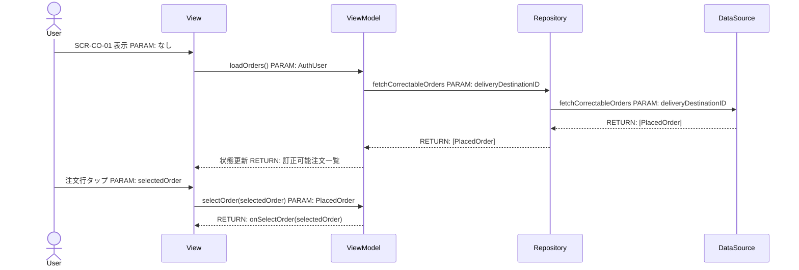
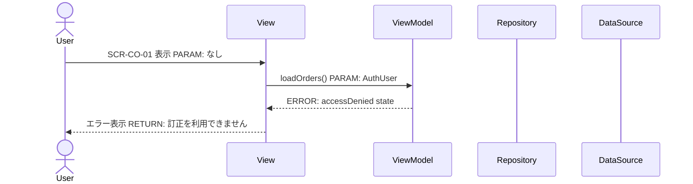
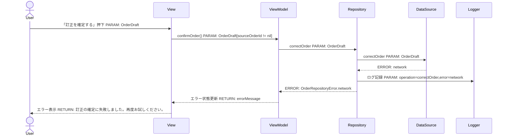
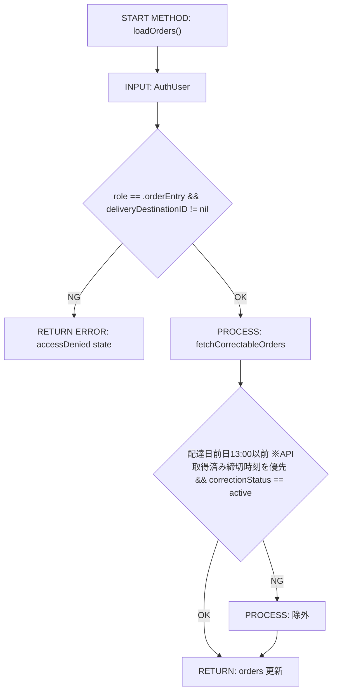
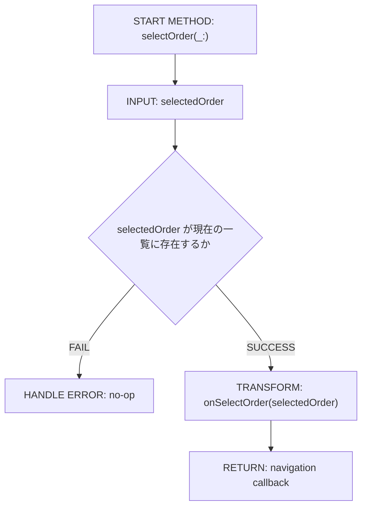
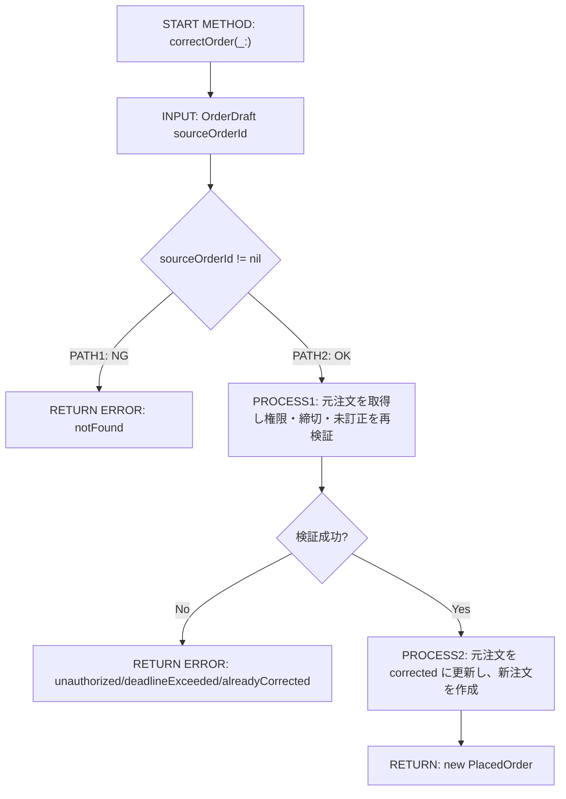
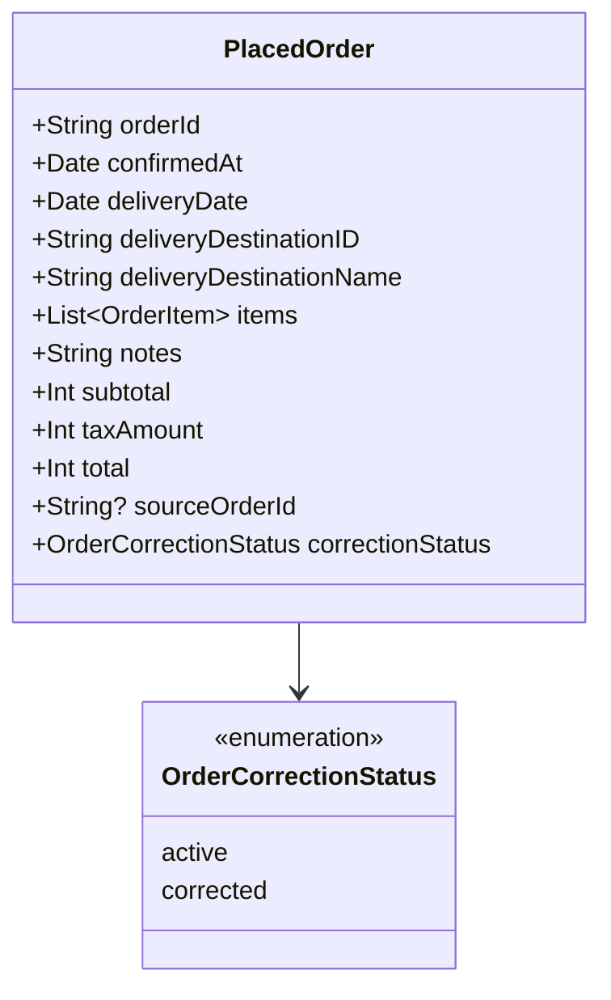
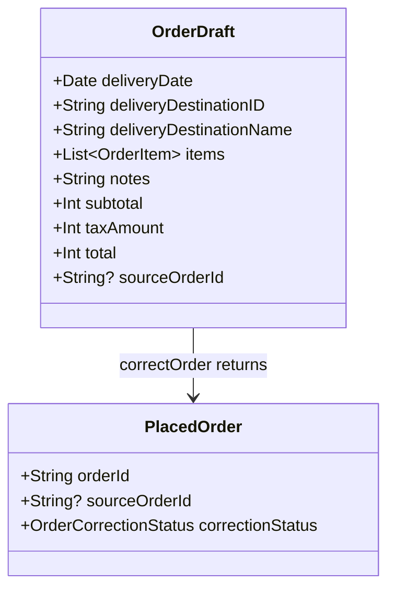

# Implementation Plan — 注文訂正フロー（MenuDestination.orderCorrection 本実装）

---

## 0. 実装入力コンテキスト

| 項目 | 記入 |
| --- | --- |
| 対象Issue | [DESIGN] 注文を訂正するフロー（MenuDestination.orderCorrection 本実装） |
| 対象リポジトリ内パス（実装起点） | `MilkOrder/Features/OrderCorrection/`, `MilkOrder/Domain/Order/`, `MilkOrder/App/` |
| 前提 plan | `scr-001-login.md`, `scr-002-menu.md`, `scr-003-order-input.md`, `scr-003-correction-delta.md`, `scr-004-order-confirmation.md`, `scr-005-order-complete.md` |

運用補足: 本 plan は `scr-003-correction-delta.md` で確定済みの `OrderInputMode` / `OrderDraft.sourceOrderId` / `MenuDestination.orderCorrectionInput(PlacedOrder)` を前提にし、再設計しない。

### 0.1 変更サマリ一覧

| 区分 | 対象 | 変更概要 |
| --- | --- | --- |
| 追加 | SCR-CO-01 訂正注文選択画面 | `MenuDestination.orderCorrection` の遷移先として `OrderCorrectionSelectionView` / `OrderCorrectionSelectionViewModel` を追加 |
| 追加 | `OrderCorrectionRepository（Protocol）` | 注文履歴画面（SCR-006）に依存しない、訂正可能注文一覧取得用の独立 Repository を追加 |
| 追加 | `MockOrderCorrectionRepository` | 自分の配達先・締切前（デフォルト: 前日 13:00）・未訂正のみを返すモック実装を追加 |
| 変更 | `AppEnvironment` | `orderCorrectionRepository: any OrderCorrectionRepository` を DI root に追加 |
| 変更 | `MenuView` / `MenuDestination` | `PlaceholderView` を `OrderCorrectionSelectionView` に置換し、`orderCorrection` → `orderCorrectionInput` の遷移を接続 |
| 変更 | `PlacedOrder` | `sourceOrderId: String?` と `correctionStatus: OrderCorrectionStatus` を追加し、訂正元/訂正済み状態を表現 |
| 変更 | `OrderRepository（Protocol）` | 新規注文用 `placeOrder(_:)` は維持し、訂正専用 `correctOrder(_:)` を追加 |
| 変更 | `OrderConfirmationViewModel` / `OrderConfirmationView` | `draft.sourceOrderId != nil` のとき訂正確認モードとして再利用し、`correctOrder(_:)` を呼ぶ |
| 変更 | `OrderCompleteViewModel` / `OrderCompleteView` | 訂正完了時は訂正向け文言で再利用し、`navigationPath = [.orderHistory]` へリセット |
| 追加 | XCTest | `OrderCorrectionSelectionViewModelTests` を追加し、`OrderConfirmationViewModelTests` / `OrderCompleteViewModelTests` を訂正フロー観点で拡張 |

### 0.2 入力制約一覧

| 制約区分 | 制約内容 | 適用対象 |
| --- | --- | --- |
| 互換性 | `scr-003-correction-delta.md` で確定済みの `OrderInputMode` / `OrderDraft.sourceOrderId` / `.orderCorrectionInput(PlacedOrder)` を変更しない | `OrderInputViewModel`, `OrderDraft`, `MenuDestination` |
| 禁止事項 | SCR-CO-01 の一覧取得に `OrderHistoryRepository`（SCR-006）を再利用しない。独立した `OrderCorrectionRepository` を使う | 訂正注文選択機能 |
| 禁止事項 | 訂正確定時に元注文を物理削除・上書きしない。元注文は `correctionStatus = .corrected` の論理削除、新注文は別レコード作成とする | `OrderRepository.correctOrder(_:)` |
| 禁止事項 | `AuthUser.role != .orderEntry` のユーザーに訂正フローを表示・実行させない | `MenuView`, `OrderCorrectionSelectionViewModel`, `OrderRepository` |
| その他 | 訂正対象は `PlacedOrder.deliveryDestinationID == AuthUser.deliveryDestinationID` かつ「配達日前日 13:00（デフォルト締切時刻）以前」の注文のみとし、締切超過注文は一覧に表示しない。デモ版・本番では `DeadlineCheckRepository` が返す締切時刻を優先する | `OrderCorrectionRepository`, `OrderCorrectionSelectionViewModel`, `DeadlineCheckRepository` |
| その他 | 配達先名・注文明細・金額をログに出力しない | ViewModel / Repository / テスト |
| その他 | 非同期処理は `async/await`、各 ViewModel は `@MainActor`、DI 起点は `AppEnvironment` のみ | 全実装 |

### 0.3 関連機能・関連仕様一覧

| 種別 | パス/識別子 | この設計での利用目的 |
| --- | --- | --- |
| 要件 | `.github/copilot/10-requirements.md` §4.1 No.7 / No.15 / §9 | 訂正時の再計算・締切チェック・入力チェック・論理削除要件の確認 |
| 設計方針 | `.github/copilot/20-architecture.md` | AppEnvironment DI root / Protocol 境界 / Infrastructure 命名規則の適用 |
| 設計方針 | `.github/copilot/30-coding-standards.md` | View は表示のみ、async/await、PII 非出力、Protocol 抽象化 |
| テスト戦略 | `.github/copilot/40-testing-strategy.md` | XCTest / モック分離 / 正常・例外・境界・回帰の整理 |
| セキュリティ | `.github/copilot/50-security.md` | PII 非出力、入力検証、エラー粒度 |
| CI | `.github/copilot/60-ci-quality-gates.md` | build / lint / test / security の必須品質ゲート |
| 前提 plan | `.github/copilot/plans/scr-002-menu.md` | `MenuDestination.orderCorrection` と `navigationPath` の既存責務を継承 |
| 前提 plan | `.github/copilot/plans/scr-003-correction-delta.md` | 訂正入力画面の再利用方式を固定 |
| 前提 plan | `.github/copilot/plans/scr-004-order-confirmation.md` | `OrderRepository` / `OrderConfirmationViewModel` 再利用パターンの継承 |
| 前提 plan | `.github/copilot/plans/scr-005-order-complete.md` | 完了後に `navigationPath = [.orderHistory]` へリセットする遷移パターンの継承 |
| 規範 | `.github/copilot/00-index.md`, `.github/copilot-instructions.md`, `.github/instructions/swift.instructions.md`, `.github/instructions/docs.instructions.md`, `.github/instructions/tests.instructions.md` | SSOT 参照順・日本語文書規約・品質ゲート・テスト規約の確認 |

---

## 1. 実装対象機能と機能ゴール

| 項目 | 内容 | 根拠 |
| --- | --- | --- |
| 実装対象詳細 | 注文入力者がメニューの「注文を訂正する」から過去の確定済み注文を選択し、入力・確認・再確定できる訂正フロー（SCR-CO-01〜SCR-CO-04） | Issue §1, §6.2 |
| 機能ゴール | `.orderEntry` ユーザーが自分の配達先に属する「締切前（デフォルト: 配達日前日 13:00）・未訂正」の注文のみを選び、既存の注文入力/確認/完了画面を再利用して訂正を完了できる | `10-requirements.md` No.7 / No.15 / No.13 |
| 非ゴール | SCR-006 購入履歴画面の本実装、運用側の注文編集（SCR-008）、一括訂正、Firebase 接続設定変更 | Issue §3 非ゴール |
| 完了条件 | ① SCR-CO-01 で自分の配達先の訂正可能注文のみ表示 ② 選択した注文が訂正モードの `OrderInputView` に初期表示 ③ 訂正確認で `correctOrder(_:)` が呼ばれ元注文が論理削除・新注文が作成 ④ 訂正完了後に `.orderHistory` へ遷移できる ⑤ 権限なし・締切超過・ネットワークエラーを Unit テストで担保 ⑥ `build` / `lint` / `test` / `security` 実行計画が定義されている | Issue §5, §7, §8 |
| 受入確認手順（1行で再現可能） | `orderEntry` ユーザーでログイン → 「注文を訂正する」 → 締切前（配達日前日 13:00 以前）の注文を1件選択 → 数量/備考を更新 → 「確認へ進む」 → 「訂正を確定する」 → 訂正完了画面から「履歴を見る」で `navigationPath = [.orderHistory]` を確認 | Issue §6.2, `scr-005-order-complete.md` |

---

## 2. 前提・制約（SSOT）

| 種別 | 内容 | 根拠（ファイル/ADR/Issue） |
| --- | --- | --- |
| 参照したSSOT | `.github/copilot/00-index.md`, `.github/copilot-instructions.md`, `.github/instructions/**/*.instructions.md`, `.github/copilot/10-requirements.md`, `20-architecture.md`, `30-coding-standards.md`, `40-testing-strategy.md`, `50-security.md`, `60-ci-quality-gates.md`, `80-templates/implementation-plan.md` | Issue §2.1 |
| アーキテクチャ前提（View/ViewModel/Repository） | View は `MilkOrder/Features/OrderCorrection/` で表示のみ、ViewModel は `@MainActor` で状態管理、Repository は `MilkOrder/Domain/Order/` で Protocol のみ、Mock 実装は `MilkOrder/Infrastructure/Order/` に配置する | Issue §4.1, `20-architecture.md`, `30-coding-standards.md` |
| iOS バージョン要件 | iOS Simulator `iPhone 17` を前提に `xcodebuild build/test` で検証する | `.github/copilot/60-ci-quality-gates.md` |
| 技術制約（互換性/期限/運用/セキュリティ） | `AppEnvironment` を唯一の DI 起点とし、View/ViewModel は具象 Repository を import しない。訂正時も締切再判定を行い、PII をログへ出力しない | Issue §4.2, §4.3, §6.3, `50-security.md` |
| 未確定前提（TBD） | **【解決済み】** 締切時刻ルール: デフォルト締切は「配達日前日 13:00」とする。締切を過ぎた場合は注文を変更できない。デモ版・本番では `DeadlineCheckRepository`（締切時間確認 API）が返す締切時刻を優先し、注文停止状態も API レスポンスで制御する。API はアプリがフォアグラウンドになった時点で非同期実行する。 | PR レビューコメント（@LevelCapTech 2026-06-21） |

---

## 3. 要件定義（実装受入条件）

### 3.1 機能要件

| ID | 要件 | 受入条件（テスト可能な形） |
| --- | --- | --- |
| FR-01 | `MenuDestination.orderCorrection` は SCR-CO-01「訂正注文選択画面」に遷移する | `MenuView` の `navigationDestination` で `PlaceholderView` ではなく `OrderCorrectionSelectionView` が表示される |
| FR-02 | SCR-CO-01 は `AuthUser.role == .orderEntry` かつ `deliveryDestinationID` を持つユーザーのみ利用できる | `.operator` / `.admin` または `deliveryDestinationID == nil` の場合、一覧取得を実行せずガード状態を表示する |
| FR-03 | SCR-CO-01 は自分の配達先に属する「締切前・未訂正」の注文のみ表示する | `fetchCorrectableOrders(deliveryDestinationID:)` の結果から「配達日前日 13:00（または API 取得済み締切時刻）以前」かつ `correctionStatus == .active` の注文のみ公開される |
| FR-04 | 注文選択時は `MenuDestination.orderCorrectionInput(PlacedOrder)` へ遷移し、SCR-CO-02 は `OrderInputView(mode: .correction(selectedOrder))` を再利用する | 行選択で `onSelectOrder(selectedOrder)` が1回呼ばれ、`OrderInputViewModel` が元注文の配達日・備考・数量を初期値に設定する |
| FR-05 | SCR-CO-03 は `OrderConfirmationView` を再利用し、訂正モードでは確定ボタン押下時に `OrderRepository.correctOrder(_:)` を呼ぶ | `draft.sourceOrderId != nil` で `confirmOrder()` を実行すると `correctOrderCalled == true` かつ `placeOrderCalled == false` |
| FR-06 | `correctOrder(_:)` は元注文を `correctionStatus = .corrected` に更新し、新しい注文を別 ID で作成して返す | 成功時に返る `PlacedOrder.orderId` が元注文と異なり、元注文の `correctionStatus == .corrected`、新注文の `sourceOrderId == 元注文ID` |
| FR-07 | SCR-CO-04 は `OrderCompleteView` を再利用し、訂正向け文言で表示したうえで「履歴を見る」で `.orderHistory` へ戻る | `placedOrder.sourceOrderId != nil` のときタイトル/メッセージ/ボタン文言が訂正向けに切り替わり、`onViewHistory()` で `navigationPath = [.orderHistory]` |
| FR-08 | 締切超過・権限不正・元注文未検出・既に訂正済みの注文は訂正できない | 対象ケースで選択不可またはエラーメッセージを表示し、`correctOrder(_:)` を実行しない |
| FR-09 | 訂正確定失敗時はインラインエラーを表示し、同じ画面から再試行できる | `OrderRepositoryError.network` で `errorMessage` が表示され、`isLoading` が `false` に戻る |
| FR-10 | デモ版・本番において、アプリがフォアグラウンドになった時点で締切時間確認 API を非同期で呼び出し、サーバー側の締切時刻・注文停止状態を取得する | アプリフォアグラウンド遷移時に `DeadlineCheckRepository.fetchDeadlineSettings()` が非同期実行され、取得結果が以降の訂正可否判定に反映される（UI はブロックしない）。取得失敗時はデフォルト締切（前日 13:00）を使用する |

### 3.2 非機能要件

| ID | 要件 | 受入条件（テスト可能な形） |
| --- | --- | --- |
| NFR-01 | 依存注入経路を `AppEnvironment -> ViewModel -> View` に固定し、View/ViewModel は Protocol 経由でのみ Repository にアクセスする | `AppEnvironment` から `OrderCorrectionRepository` / `OrderRepository` が注入され、View が具象 Mock を import しない |
| NFR-02 | 一覧取得・訂正確定は `async/await` で実行し、UI 更新は `@MainActor` で保護する | 対象 ViewModel が `@MainActor`、Repository 呼び出し中も Main スレッドをブロックしない |
| NFR-03 | ログには配達先名・注文明細・金額を含めない | エラーログ/デバッグ出力/テスト失敗メッセージに PII を含めないことをコードレビューで確認できる |
| NFR-04 | 必須品質ゲート `build` / `lint` / `test` / `security` を実装 PR で実行できる状態に保つ | `xcodebuild build`, `swiftlint lint --strict`, `xcodebuild test`, `swift package audit` を計画に明記し、追加依存を導入しない |

---

## 4. スコープ境界

### 4.0 スコープ境界の定義（機能単位）

| 区分（In-Scope/Out-of-Scope） | 対象機能/責務 | 判定理由 |
| --- | --- | --- |
| In-Scope | SCR-CO-01 `OrderCorrectionSelectionView` / `OrderCorrectionSelectionViewModel` 実装 | `MenuDestination.orderCorrection` の本実装が本 Issue の主目的 |
| In-Scope | `OrderCorrectionRepository` / `MockOrderCorrectionRepository` の追加 | SCR-006 を待たずに独立設計・実装するため |
| In-Scope | `AppEnvironment` / `MenuView` / `MenuDestination` の DI・ナビゲーション配線 | `orderCorrection` → `orderCorrectionInput` → `orderConfirmation` → `orderComplete` の接続に必要 |
| In-Scope | `PlacedOrder` の訂正状態表現と `OrderRepository.correctOrder(_:)` の契約拡張 | 元注文の論理削除と新注文作成を明示するため |
| In-Scope | `OrderConfirmationView` / `OrderCompleteView` の訂正モード再利用 | SCR-003〜005 の既存パターンを再利用し、新規画面追加を最小化するため |
| In-Scope | 訂正フロー ViewModel 群の XCTest | Issue §8 で必須 |
| Out-of-Scope | SCR-006 購入履歴画面の一覧/詳細 UI 実装 | Issue §2.2 注記 |
| Out-of-Scope | 運用側（`.operator` / `.admin`）の注文編集機能 | Issue §3 非ゴール |
| Out-of-Scope | 一括訂正・複数注文の同時訂正 | Issue §3 非ゴール |
| Out-of-Scope | Firebase/Firestore 実接続・権限ルール実装 | 本 plan は Mock 前提の設計引き継ぎ |

### 4.2 実装時の影響範囲・互換性リスク

| 影響対象 | 結論（影響あり/なし/未確定） | 影響内容 |
| --- | --- | --- |
| UI/画面 | 影響あり | `MenuDestination.orderCorrection` の遷移先が `PlaceholderView` から SCR-CO-01 に変わり、SCR-CO-02/03/04 は既存画面の訂正モードとして再利用される |
| API/外部通信 | 影響あり | `OrderCorrectionRepository` と `OrderRepository.correctOrder(_:)` の契約が追加され、将来 Firestore 実装で訂正 API/トランザクションが必要になる |
| データモデル | 影響あり | `PlacedOrder` に `sourceOrderId` / `correctionStatus` を追加し、既存テストフィクスチャ更新が必要 |
| 外部依存（SPM） | 影響なし | 新規依存追加なし |
| CI/運用 | 影響なし | 既存品質ゲートコマンドを継続利用し、チェック対象に訂正フローの Unit テストが追加される |

### 4.3 外部依存・Secrets の扱い

| 項目 | 内容 | リスク/対応 |
| --- | --- | --- |
| 外部依存の追加/更新（SPM） | なし | 既存依存のみで実装する |
| Secrets 利用有無 | なし | Mock 実装のみ。Firebase 認証情報は追加しない |
| ログ/設定への機密混入対策 | 配達先名・注文明細・金額・個人識別子をログに出さず、エラー区分のみを記録する | `50-security.md` に従う |

### 4.4 4章の自己検証（必須）

| チェック項目 | 合格条件 |
| --- | --- |
| Design PR 差分を書いていないか | `.github/copilot/plans/order-correction-flow.md` 自体の変更説明ではなく、将来の実装責務のみを記載している |
| 実装責務を書いているか | In-Scope に 2 件以上の実装責務がある |
| 実装影響を書いているか | 4.2 で `影響あり` が 1 件以上あり、具体影響を明記している |

---

## 5. アーキテクチャ設計

### 5.0 依存注入経路（DI）

本プロジェクトは Protocol ベースの依存注入を採用する。View は Protocol に依存し、具象実装を直接 import しない。

| 区分（記載例/追記No） | 提供主体 | Protocol 名 | 具象実装名 | 入力（型/値） | 出力（型/値） | 境界制約（禁止事項を含む） |
| --- | --- | --- | --- | --- | --- | --- |
| 記載例 | `AppEnvironment` | `MilkOrderRepository（Protocol）` | `MilkOrderRepositoryImpl` | 設定/環境値 | Repository インスタンス | View から具象を直接 import しない |
| 01 | `AppEnvironment` | `OrderCorrectionRepository（Protocol）` | `MockOrderCorrectionRepository` | なし | `orderCorrectionRepository` | `OrderCorrectionSelectionView` / `OrderCorrectionSelectionViewModel` から具象 Mock を直接 import しない |
| 02 | `AppEnvironment` | `OrderRepository（Protocol）` | `MockOrderRepository` | なし | `orderRepository` | `OrderConfirmationViewModel` は `correctOrder(_:)` / `placeOrder(_:)` を Protocol 経由でのみ呼ぶ |
| 03 | `MilkOrderApp` / `MenuView` | `OrderCorrectionRepository（Protocol）`, `OrderRepository（Protocol）` | `AppEnvironment` 保持インスタンス | `user`, `navigation callbacks` | `OrderCorrectionSelectionViewModel`, `OrderInputViewModel`, `OrderConfirmationViewModel` | DI 起点は `AppEnvironment`。ナビゲーション制御のみ `MenuViewModel.navigationPath` に委譲 |
| 04 | `MilkOrderApp` / `MenuView` | なし（Repository 不要） | なし | `placedOrder`, `onViewHistory` | `OrderCompleteViewModel` | 完了画面は Repository を持たず、表示文言と戻り先のみを扱う |

#### 5.0.1 最小固定セット（TBD禁止）

| 最小固定項目 | 必須記載内容 | 対応セクション |
| --- | --- | --- |
| DI 経路 | `AppEnvironment -> OrderCorrectionSelectionViewModel -> OrderCorrectionSelectionView`、`AppEnvironment -> OrderInputViewModel -> OrderInputView`、`AppEnvironment -> OrderConfirmationViewModel -> OrderConfirmationView` を固定し、完了画面は `MilkOrderApp -> OrderCompleteViewModel -> OrderCompleteView` とする | `5.0`, `5.7.0`, `5.7.2` |
| MainActor 境界 | `OrderCorrectionSelectionViewModel` / `OrderInputViewModel` / `OrderConfirmationViewModel` / `OrderCompleteViewModel` に `@MainActor` を付与し、UI 更新は MainActor でのみ行う | `5.5.1`, `8.3` |
| Protocol/具象 境界 | View/ViewModel は `OrderCorrectionRepository` / `OrderRepository` へ Protocol 経由でのみ依存し、具象 Mock/Firebase 実装は Infrastructure 層に限定する | `8.3`, `8.4` |

### 5.1 設計判断

#### 5.1.1 責務分離 / データフロー（詳細）

| No. | 決定事項（実装責務単位） | 根拠 | 未確定（あれば） |
| --- | --- | --- | --- |
| 1 | SCR-CO-01 は専用画面 `OrderCorrectionSelectionView` を追加し、SCR-006 の注文履歴画面からの起動にはしない | SCR-006 なしでも設計/実装可能にするため。Issue §6.2 の選択肢 A を採用 | なし |
| 2 | `OrderCorrectionSelectionViewModel` は権限ガード、配達先 ID ガード、一覧取得、締切前フィルタ（`DeadlineSettings` を参照）、行選択コールバックのみを担う | View へビジネスロジックを置かず、SCR-006 と独立にテスト可能にするため | なし |
| 3 | SCR-CO-02 は `OrderInputView(mode: .correction(selectedOrder))` を再利用し、初期値設定ロジックは `scr-003-correction-delta.md` に従う | 確定済み差分仕様の再利用 | なし |
| 4 | SCR-CO-03 は `OrderConfirmationView` を再利用し、`draft.sourceOrderId != nil` の場合のみ `correctOrder(_:)` を呼ぶ。新規注文の `placeOrder(_:)` は変更しない | `placeOrder(_:)` に訂正副作用を混在させず、`OrderDraft.sourceOrderId` を活用できるため | なし |
| 5 | 訂正確定時は元注文を `correctionStatus = .corrected` に更新し、新しい `PlacedOrder` を別 ID で返す。新注文には `sourceOrderId = 元注文ID` を保持する | 要件 §9 の論理削除・復元可能性と監査性を満たすため | なし |
| 6 | SCR-CO-04 は `OrderCompleteView` を再利用し、`placedOrder.sourceOrderId != nil` をもとに訂正向け文言へ切り替える | 新規完了画面を増やさず、SCR-005 のナビゲーションリセットをそのまま使えるため | なし |

#### 5.1.2 エッジケース / 例外系 / リトライ方針（詳細）

| No. | ケース | 方針（戻り値/表示/再試行） | 根拠 | 未確定（あれば） |
| --- | --- | --- | --- | --- |
| 1 | `role != .orderEntry` で訂正フローへ入ろうとする | 一覧取得を行わず `errorMessage` ではなくガード状態（アクセス不可メッセージ）を表示し、選択操作を無効化する | Issue §6.3 権限制約 | なし |
| 2 | `deliveryDestinationID == nil` | 権限不正と同様にガード状態にし、Repository を呼ばない | 自分の注文のみ取得の前提を満たせないため | なし |
| 3 | Repository が締切超過注文を返した | ViewModel 側で「配達日前日 13:00（または API 取得済み締切時刻）以降」を再フィルタし、一覧へ出さない | DataSource の時計ずれに対する防御的実装 | なし |
| 4 | 訂正可能注文が0件 | 空状態ビューを表示し、「訂正可能な注文はありません」を案内する。エラー扱いにはしない | UX 上の正常系 | なし |
| 5 | 訂正確定時にネットワークエラー | `errorMessage = "訂正の確定に失敗しました。再度お試しください。"` を表示し、同じ画面で再試行可能にする | Issue §8 テスト必須ケース | なし |
| 6 | 訂正確定時に締切超過/既訂正/元注文未検出 | `OrderRepositoryError.deadlineExceeded` / `.notFound` / `.unauthorized` に変換し、訂正不可メッセージを表示して確定処理を終了する | 再確認タイミングでサーバー側整合性を担保するため | なし |
| 7 | 「修正する」押下 | `onEdit()` により前画面へ戻る。`isLoading == true` 中は無効化して競合を防ぐ | `scr-004-order-confirmation.md` の既存パターンを継承 | なし |
| 8 | アプリフォアグラウンド時の `DeadlineCheckRepository.fetchDeadlineSettings()` 失敗 | 失敗時はデフォルト締切（前日 13:00）を使用し続ける。エラーをユーザーに表示しない（バックグラウンド処理のため） | FR-10, 非ブロッキング設計 | なし |

#### 5.1.3 SwiftUI View 部品一覧

| レイヤ | View/コンポーネント名（設計上の候補） | 主責務 | 対応機能 |
| --- | --- | --- | --- |
| Screen | `OrderCorrectionSelectionView` | SCR-CO-01 全体。注文一覧・空状態・ガード状態の表示 | FR-01〜FR-04 |
| Screen | `OrderInputView`（correction mode） | SCR-CO-02。元注文を初期値として再入力 | FR-04 |
| Screen | `OrderConfirmationView`（correction mode） | SCR-CO-03。訂正内容確認と再確定 | FR-05, FR-08, FR-09 |
| Screen | `OrderCompleteView`（correction mode） | SCR-CO-04。訂正完了メッセージと履歴遷移 | FR-07 |
| Section | `CorrectableOrdersSection` | 訂正可能注文リストのカード表示 | FR-03 |
| Component | `CorrectableOrderRowView` | 1注文分の配達日・注文番号・件数表示、選択ボタン | FR-03, FR-04 |
| Component | `OrderCorrectionEmptyStateView` | 訂正可能注文なし・アクセス不可の状態表示 | FR-02, FR-03 |
| Atom | `CorrectionStatusBadge` | 「訂正可能」ラベル表示（将来状態拡張に備える） | FR-03 |

#### 5.1.4 ログと観測性（漏洩防止を含む / 詳細）

| No. | 観点 | 方針 | 根拠 | 未確定（あれば） |
| --- | --- | --- | --- | --- |
| 1 | ログ出力内容 | 画面 ID（SCR-CO-01/03）・操作種別（load/correct）・エラー区分のみ記録する | `50-security.md` | なし |
| 2 | マスキング/非出力項目 | 配達先名・注文明細・金額・ユーザー名・メールアドレス・生の注文 ID はログへ出さない | Issue §6.3, `50-security.md` | なし |
| 3 | エラー記録粒度 | `OrderCorrectionRepositoryError` / `OrderRepositoryError` の case 名までに留め、元例外の詳細は Logger 層の内部情報とする | UI/ログ双方の情報漏洩防止 | なし |

### 5.2 トレードオフ

| 判断テーマ | 案A | 案B | 採用案 | 採用理由 | 不採用理由 |
| --- | --- | --- | --- | --- | --- |
| 画面数 | SCR-006 履歴画面から訂正起動（SCR-CO-01 省略） | SCR-CO-01 選択画面 + 既存 SCR-003/004/005 再利用 | 案B | SCR-006 完了待ちを避け、Issue の独立実装条件を満たせる | 案A は前提 plan が未確定の SCR-006 に結合する |
| 訂正対象の表示 | 締切超過注文をグレーアウト表示 | 締切超過注文を一覧から除外 | 案B | 訂正専用画面の目的は「訂正可能な注文の選択」に限定するため、非対象を混ぜない方が単純で誤操作が少ない | 案A は UI ノイズが増え、選択不可理由の説明も追加で必要 |
| 訂正確定 API | `placeOrder(_:)` が `sourceOrderId` を見て暗黙分岐 | `correctOrder(_:)` を明示追加 | 案B | 新規注文と訂正を API 契約で分離でき、論理削除 + 新規作成の副作用を隠さない | 案A は `placeOrder(_:)` の責務が不明瞭になり、回帰リスクが高い |
| 元注文の扱い | 元注文を上書き更新 | 元注文を `corrected` にして新注文を作成 | 案B | 要件 §9 の論理削除・監査性・復元可能性を満たせる | 案A は変更履歴が失われる |
| 完了後の遷移 | メニューへ戻る | `.orderHistory` へリセット遷移 | 案B | `scr-005-order-complete.md` の既存パターンと整合し、訂正結果確認の次アクションとして自然 | 案A は訂正結果の確認導線が弱い |

### 5.3 ナビゲーション方針

| 項目 | 決定内容 | 根拠 |
| --- | --- | --- |
| ナビゲーション方式（NavigationStack / TabView / Sheet） | `MenuViewModel.navigationPath` を使う既存 `NavigationStack` を継続利用する | `scr-002-menu.md` |
| 画面遷移の責務（誰が遷移を制御するか） | 画面遷移は `MenuView` / `MilkOrderApp` が `navigationPath` を操作し、各 ViewModel は選択/確定/戻るのコールバックを返す | ViewModel を SwiftUI ナビゲーション型へ依存させないため |
| ディープリンク対応 | Out-of-Scope | Issue §3 非ゴール |
| 遷移時のデータ受け渡し方式 | `orderCorrection` は state なし、`orderCorrectionInput(PlacedOrder)` は元注文を associated value で渡し、`orderConfirmation(OrderDraft)` は `sourceOrderId` 付き `OrderDraft` を渡し、`orderComplete(PlacedOrder)` は `sourceOrderId` 付き新注文を渡す | `scr-003-correction-delta.md`, `scr-004-order-confirmation.md`, `scr-005-order-complete.md` |
| 画面論理 ID | `SCR-CO-01 = OrderCorrectionSelectionView`, `SCR-CO-02 = OrderInputView（correction mode）`, `SCR-CO-03 = OrderConfirmationView（correction mode）`, `SCR-CO-04 = OrderCompleteView（correction mode）` | Issue §6.2 |

### 5.4 アーキテクチャレイヤー方針

| レイヤ | 定義 | 許可する依存方向 | 禁止する依存 |
| --- | --- | --- | --- |
| View | SwiftUI 表示のみ | ViewModel のみ | `OrderCorrectionRepository` / `OrderRepository` の具象実装を直接 import しない |
| ViewModel | 状態管理・UI ロジック・権限ガード・画面用整形 | Repository Protocol のみ | Infrastructure の Mock/Firebase 実装を直接 import しない |
| Repository | データアクセス抽象（Protocol） | DataSource/Repository 具象 | View/ViewModel を import しない |
| DataSource | Mock / Firestore 具象実装 | 外部SDK/フレームワーク | View/ViewModel を import しない |
| Model/Entity | `PlacedOrder`, `OrderDraft`, `OrderCorrectionStatus` | なし | 他レイヤに依存しない |

### 5.5 データ取得ライフサイクル

| データ種別 | 取得タイミング | 取得場所 | 理由 |
| --- | --- | --- | --- |
| 初期表示必須データ | SCR-CO-01 の `.task {}` / `onAppear` | `OrderCorrectionSelectionViewModel.loadOrders()` | 訂正可能注文一覧を初回表示で即取得するため |
| ユーザー操作後データ | 注文行タップ、訂正確定ボタン押下 | `OrderCorrectionSelectionViewModel.selectOrder(_:)`, `OrderConfirmationViewModel.confirmOrder()` | 選択と確定を明示イベントで分離するため |
| 締切設定（デモ/本番） | アプリがフォアグラウンドになった時点（`scenePhase == .active` 等）に非同期で1回 | `DeadlineCheckRepository.fetchDeadlineSettings()` | サーバー側の締切時刻・注文停止状態を最新化するため。UI はブロックしない。失敗時はデフォルト値（前日 13:00）を維持する |

| キャッシュ方針 | 採用有無 | ルール |
| --- | --- | --- |
| インメモリキャッシュ | なし | SCR-CO-01 表示ごとに最新一覧を取得し、締切チェックを再評価する |
| ディスクキャッシュ | なし | 訂正可否は時刻依存のためローカル保持しない |

#### 5.5.1 MainActor/BackgroundActor 境界

| 対象処理 | 実行コンテキスト（MainActor/background） | 実装場所 | 禁止事項 |
| --- | --- | --- | --- |
| SCR-CO-01 の `@Published` 更新（orders / isLoading / error state） | MainActor | `OrderCorrectionSelectionViewModel` | background から直接 `@Published` を更新しない |
| 訂正可能注文取得 | background（async/await） | `OrderCorrectionRepository` 具象実装 | Main スレッドをブロックしない |
| 訂正確定 (`correctOrder(_:)`) | background（async/await） | `OrderRepository` 具象実装 | UI ロジックを Repository に持ち込まない |
| 認証/権限判定 | MainActor（UI ガード） + background（最終再確認） | ViewModel / Repository | View で role 判定だけに依存し、Repository 再確認を省略しない |
| 締切設定取得 (`fetchDeadlineSettings()`) | background（async/await）、アプリフォアグラウンド時に Fire-and-forget | `DeadlineCheckRepository` 具象実装 | UI をブロックせず、結果は `AppEnvironment` 保持の共有状態に反映する |

### 5.6 エラーハンドリング標準形

| 分類（network/unauthorized/notfound/validation/unknown） | エラー型 | UI 表示ルール | 再試行ルール |
| --- | --- | --- | --- |
| network | `OrderCorrectionRepositoryError.network`, `OrderRepositoryError.network` | 「通信に失敗しました。再度お試しください。」または訂正画面用文言を表示 | 同一画面で再試行可能 |
| unauthorized | `OrderCorrectionRepositoryError.unauthorized`, `OrderRepositoryError.unauthorized` | 訂正不可ガード状態または「この注文は訂正できません。」を表示 | 再ログイン/権限修正まで不可 |
| notfound | `OrderRepositoryError.notFound` | 「元の注文が見つからないため訂正できません。」を表示 | 一覧へ戻って再選択 |
| validation | `OrderRepositoryError.deadlineExceeded`, `OrderRepositoryError.alreadyCorrected` | 「締切を過ぎたため訂正できません。」または「この注文はすでに訂正済みです。」を表示 | 再試行不可 |
| unknown | `OrderCorrectionRepositoryError.unknown`, `OrderRepositoryError.unknown` | 汎用エラー文言のみ表示し、内部詳細は表示しない | 再試行可能 |

| ログ方針 | 内容 |
| --- | --- |
| 出力する情報 | 操作種別、画面 ID、エラー区分、再試行有無 |
| 出力しない情報（Secrets/PII） | 配達先名、注文明細、数量、金額、メールアドレス、スタックトレースの生出力 |

#### 5.6.1 エラー変換責務（例外 → ドメインエラー）

| 変換対象 | 例外発生層 | ドメインエラーへ変換する層 | 上位層へ渡す型 | 禁止事項 |
| --- | --- | --- | --- | --- |
| ネットワーク例外 | DataSource / Firebase 実装 | `OrderCorrectionRepository` / `OrderRepository` 具象 | `OrderCorrectionRepositoryError.network`, `OrderRepositoryError.network` | View/ViewModel で `URLError` を直接判定しない |
| 認可/権限エラー | Repository 具象 | Repository 具象 | `.unauthorized` | View のボタン制御だけに依存しない |
| バリデーションエラー（締切超過/既訂正） | Repository 具象 or ViewModel | Repository 具象 / ViewModel | `.deadlineExceeded`, `.alreadyCorrected`, UI 用 `errorMessage` | DataSource の生レスポンスを UI にそのまま渡さない |
| 予期せぬ例外 | 任意層 | Repository 具象 | `.unknown(any Error & Sendable)` | stacktrace/機密情報を UI に渡さない |

### 5.7 シーケンス図（Mermaid / 複数必須）

| 必須項目 | 記載ルール |
| --- | --- |
| DI 経路 | 必須（`AppEnvironment -> ViewModel -> View` を明記） |
| 正常系 | 必須（最低1本） |
| 異常系 | 必須（最低2本。業務エラー系/システムエラー系） |
| パラメータ | 各呼び出しメッセージに `PARAM` を明記 |
| 戻り値 | 各応答メッセージに `RETURN` を明記 |
| エラー返却 | 各異常系で `ERROR` の返却値とハンドリング先を明記 |

#### 5.7.0 DI 経路（テキスト再掲 / 必須）

| No | 開始主体 | 終了主体 | Protocol 名 | 具象実装名 | 経路文字列（`A -> B -> C`） | 境界チェック観点 | 対応シーケンス図ID |
| --- | --- | --- | --- | --- | --- | --- | --- |
| 記載例 | `AppEnvironment` | `SomeScreen` | `MilkOrderRepository（Protocol）` | `MilkOrderRepositoryImpl` | `AppEnvironment -> SomeViewModel -> SomeScreen` | 具象が View/ViewModel に漏れていないこと | SEQ-01 |
| 01 | `AppEnvironment` | `OrderCorrectionSelectionView` | `OrderCorrectionRepository（Protocol）` | `MockOrderCorrectionRepository` | `AppEnvironment -> OrderCorrectionSelectionViewModel -> OrderCorrectionSelectionView` | View が Mock を直接 import しないこと | SEQ-01 |
| 02 | `AppEnvironment` | `OrderConfirmationView` | `OrderRepository（Protocol）` | `MockOrderRepository` | `AppEnvironment -> OrderConfirmationViewModel -> OrderConfirmationView` | 訂正確定が `correctOrder(_:)` を Protocol 経由で呼ぶこと | SEQ-02, SEQ-03 |

#### 5.7.1 シーケンス対象一覧

| 図ID | 種別（正常/異常） | 起点（画面/操作） | 終点（Repository/外部I/O） | 対応要件ID（FR/NFR） |
| --- | --- | --- | --- | --- |
| SEQ-01 | 正常 | SCR-CO-01 初期表示と注文選択 | `OrderCorrectionRepository.fetchCorrectableOrders` | FR-01〜FR-04, NFR-01 |
| SEQ-02 | 異常 | SCR-CO-01 権限なしで初期表示 | `OrderCorrectionRepository` 呼び出し抑止 | FR-02, FR-08 |
| SEQ-03 | 異常 | SCR-CO-03 訂正確定中のネットワーク失敗 | `OrderRepository.correctOrder(_:)` | FR-05, FR-09 |

#### 5.7.1.1 境界整合チェック（必須）

| 境界テーマ | 文章セクション | 表セクション | 図セクション | 整合判定（OK/NG） |
| --- | --- | --- | --- | --- |
| ログ責務（どの層で出力するか） | `5.1.4` | `5.6` | `5.7.4` | OK |
| エラー変換責務 | `5.1.2` | `5.6.1` | `5.7.3`, `5.7.4` | OK |
| MainActor/Background 境界 | `5.5.1` | `8.3` | `5.7.2` | OK |

#### 5.7.1.2 最小固定セット具体化チェック（必須）

| 最小固定項目 | 文章セクション | 表セクション | 図セクション | TBD残存数（0のみ可） |
| --- | --- | --- | --- | --- |
| DI 経路（`AppEnvironment -> ViewModel -> View`） | `5.0.1` | `5.0` | `5.7.0`, `5.7.2` | 0 |
| MainActor 境界（UI 更新箇所） | `5.5.1` | `5.5.1` | `5.7.2` | 0 |
| Protocol/具象 境界 | `8.3` | `8.4` | `5.7.2` | 0 |

#### 5.7.2 正常系シーケンス（必須）

#### 5.7.3 異常系シーケンス（業務エラー）

#### 5.7.4 異常系シーケンス（システムエラー）

### 5.8 処理フロー図（メソッドレベル / 複数必須）

| 必須項目 | 記載ルール |
| --- | --- |
| 対象メソッド数 | 必須（最低3メソッド） |
| 分岐 | 各メソッドで正常/異常分岐を明記 |
| 入出力 | 各メソッドの入力/出力を明記 |
| 例外処理 | 例外時の戻り値または伝播先を明記 |

#### 5.8.1 メソッド一覧

| 図ID | メソッド名 | 層（View/ViewModel/Repository/DataSource） | 対応要件ID（FR/NFR） |
| --- | --- | --- | --- |
| FLOW-01 | `OrderCorrectionSelectionViewModel.loadOrders()` | ViewModel | FR-02, FR-03 |
| FLOW-02 | `OrderCorrectionSelectionViewModel.selectOrder(_:)` | ViewModel | FR-04 |
| FLOW-03 | `OrderRepository.correctOrder(_:)` | Repository | FR-05, FR-06, FR-08 |

#### メソッドフロー（FLOW-01）

#### メソッドフロー（FLOW-02）

#### メソッドフロー（FLOW-03）

---

## 6. 契約仕様（Protocol Contract）

### 6.0 Protocol-DI 固定前提

| 項目 | 固定方針 |
| --- | --- |
| DI 起点 | `AppEnvironment` のみで依存解決する |
| Protocol の責務 | メソッド署名のみ定義し、具象実装を含めない |
| 具象実装の配置 | `MockOrderCorrectionRepository` / `MockOrderRepository` / 将来の `FirestoreOrderCorrectionRepository` は `MilkOrder/Infrastructure/Order/` に限定する |
| View / ViewModel の責務 | `OrderCorrectionRepository` / `OrderRepository` の Protocol に依存し、具象型を直接 import しない |

### 6.1 入出力契約（API/関数/UseCase）

| ID | 入口（画面/操作/関数） | 入力 | 出力 | エラー | 備考 |
| --- | --- | --- | --- | --- | --- |
| IFC-01 | `OrderCorrectionSelectionViewModel.loadOrders()` | `AuthUser` | `orders: [PlacedOrder]` / ガード状態 | `OrderCorrectionRepositoryError` 相当の UI 状態 | `.orderEntry` と `deliveryDestinationID` を必須条件とする |
| IFC-02 | `OrderCorrectionRepository.fetchCorrectableOrders(deliveryDestinationID:)` | `deliveryDestinationID: String` | `[PlacedOrder]` | `OrderCorrectionRepositoryError` | 返却対象は同一配達先・訂正可能注文。ViewModel 側でも再フィルタする |
| IFC-03 | `OrderRepository.correctOrder(_:)` | `OrderDraft`（`sourceOrderId != nil`） | `PlacedOrder` | `OrderRepositoryError` | 元注文論理削除 + 新注文作成を1操作として扱う |
| IFC-04 | `OrderCompleteViewModel.viewHistory()` | なし | なし（`onViewHistory` 呼び出し） | なし | `navigationPath = [.orderHistory]` へ戻す |
| IFC-05 | `DeadlineCheckRepository.fetchDeadlineSettings()` | なし | `DeadlineSettings`（締切時刻・注文停止フラグ等） | `DeadlineCheckRepositoryError` | アプリフォアグラウンド時に Fire-and-forget で呼び出す。失敗時はデフォルト値（前日 13:00）を維持 |

### 6.2 型/モデル/スキーマ

| ID | 対象 | 変更内容（追加/変更/削除） | 後方互換 |
| --- | --- | --- | --- |
| TYPE-01 | `PlacedOrder.sourceOrderId: String?` | 変更 | `Optional` 追加のため既存新規注文は `nil` で後方互換 |
| TYPE-02 | `PlacedOrder.correctionStatus: OrderCorrectionStatus` | 変更 | 既存データ/モックは `.active` を初期値にして後方互換 |
| TYPE-03 | `OrderCorrectionStatus` | 追加 | 新規 enum 追加のみ |
| TYPE-04 | `OrderRepositoryError` / `OrderCorrectionRepositoryError` | 変更/追加 | 既存 `network` / `unknown` は維持しつつ、`unauthorized` / `deadlineExceeded` / `alreadyCorrected` / `notFound` を追加 |
| TYPE-05 | `DeadlineSettings` | 追加 | `defaultDeadlineTime: DateComponents`（前日 13:00 がデフォルト値）、`overrides: [DeadlineOverride]`（日付別上書きリスト）、`isOrderingHalted: Bool`（注文停止フラグ）を保持する新規 struct |

### 6.3 Protocol インターフェース定義（実装エンジニア向け固定案）

#### 6.3.1 Repository/DataSource Protocol 一覧

| No. | Protocol 名 | メソッド署名（Swift 形式） | 配置ファイル候補 | 備考 |
| --- | --- | --- | --- | --- |
| 1 | `OrderCorrectionRepository` | `func fetchCorrectableOrders(deliveryDestinationID: String) async throws -> [PlacedOrder]` | `MilkOrder/Domain/Order/OrderCorrectionRepository.swift` | SCR-CO-01 専用。SCR-006 に依存しない |
| 2 | `OrderRepository` | `func placeOrder(_ draft: OrderDraft) async throws -> PlacedOrder` | `MilkOrder/Domain/Order/OrderRepository.swift` | 新規注文用の既存契約を維持 |
| 3 | `OrderRepository` | `func correctOrder(_ draft: OrderDraft) async throws -> PlacedOrder` | `MilkOrder/Domain/Order/OrderRepository.swift` | `draft.sourceOrderId` を必須とする訂正専用契約 |
| 4 | `DeadlineCheckRepository` | `func fetchDeadlineSettings() async throws -> DeadlineSettings` | `MilkOrder/Domain/Deadline/DeadlineCheckRepository.swift` | デモ版・本番のサーバー側締切設定を取得する。注文停止フラグ・配達日別締切時刻リストを含む |

#### 6.3.2 ドメインモデルクラス図（Mermaid classDiagram）

| 図ID | ドメイン | 対応 Protocol/実装 | 対応要件ID（FR/NFR） |
| --- | --- | --- | --- |
| CLS-01 | Order correction selection | `OrderCorrectionRepository`, `MockOrderCorrectionRepository` | FR-02, FR-03 |
| CLS-02 | Order correction confirmation | `OrderRepository`, `MockOrderRepository` | FR-05, FR-06 |

##### ドメインレベルのクラス図（CLS-01）

##### ドメインレベルのクラス図（CLS-02）

#### 6.3.3 ドメイン別モデル定義（省略不可）

##### 6.3.3.1 モデル一覧

| ドメイン | 型名 | 区分（struct/class/enum/actor） | 用途 |
| --- | --- | --- | --- |
| Order | `PlacedOrder` | `struct` | 確定済み注文。訂正元 ID と訂正状態を保持する |
| Order | `OrderDraft` | `struct` | 訂正/新規共通の確認画面入力モデル |
| Order | `OrderCorrectionStatus` | `enum` | 元注文が有効か訂正済みかを表す |

##### 6.3.3.2 プロパティ詳細定義（全項目を行で列挙）

| ドメイン | 型名 | プロパティ名 | Swift 型（完全表記） | 必須（Y/N） | Optional（Y/N） | 説明 | 例 |
| --- | --- | --- | --- | --- | --- | --- | --- |
| Order | `PlacedOrder` | `orderId` | `String` | Y | N | 注文 ID | `ORD-20260601-0002` |
| Order | `PlacedOrder` | `confirmedAt` | `Date` | Y | N | 注文確定日時 | `2026-06-01T10:00:00+09:00` |
| Order | `PlacedOrder` | `deliveryDate` | `Date` | Y | N | 配達日 | `2026-06-02` |
| Order | `PlacedOrder` | `deliveryDestinationID` | `String` | Y | N | 配達先 ID | `dest-001` |
| Order | `PlacedOrder` | `deliveryDestinationName` | `String` | Y | N | 配達先表示名 | `○○保育園` |
| Order | `PlacedOrder` | `items` | `[OrderItem]` | Y | N | 注文明細 | `[OrderItem(...)]` |
| Order | `PlacedOrder` | `notes` | `String` | Y | N | 備考 | `牛乳は玄関前希望` |
| Order | `PlacedOrder` | `subtotal` | `Int` | Y | N | 税抜合計 | `3600` |
| Order | `PlacedOrder` | `taxAmount` | `Int` | Y | N | 税額合計 | `288` |
| Order | `PlacedOrder` | `total` | `Int` | Y | N | 税込合計 | `3888` |
| Order | `PlacedOrder` | `sourceOrderId` | `String?` | N | Y | 訂正元注文 ID。新規注文は `nil` | `ORD-20260531-0007` |
| Order | `PlacedOrder` | `correctionStatus` | `OrderCorrectionStatus` | Y | N | 現在の訂正状態 | `.active` |
| Order | `OrderDraft` | `deliveryDate` | `Date` | Y | N | 配達日 | `2026-06-02` |
| Order | `OrderDraft` | `deliveryDestinationID` | `String` | Y | N | 配達先 ID | `dest-001` |
| Order | `OrderDraft` | `deliveryDestinationName` | `String` | Y | N | 配達先名 | `○○保育園` |
| Order | `OrderDraft` | `items` | `[OrderItem]` | Y | N | 注文明細 | `[OrderItem(...)]` |
| Order | `OrderDraft` | `notes` | `String` | Y | N | 備考 | `なし` |
| Order | `OrderDraft` | `subtotal` | `Int` | Y | N | 税抜合計 | `3600` |
| Order | `OrderDraft` | `taxAmount` | `Int` | Y | N | 税額合計 | `288` |
| Order | `OrderDraft` | `total` | `Int` | Y | N | 税込合計 | `3888` |
| Order | `OrderDraft` | `sourceOrderId` | `String?` | N | Y | 訂正元注文 ID | `ORD-20260531-0007` |

##### 6.3.3.3 列挙型/リテラル制約

| No. | 型名 | case 一覧 | 用途 |
| --- | --- | --- | --- |
| 1 | `OrderCorrectionStatus` | `.active`, `.corrected` | 訂正可否・元注文の論理削除状態 |
| 2 | `OrderRepositoryError` | `.network`, `.unauthorized`, `.deadlineExceeded`, `.alreadyCorrected`, `.notFound`, `.unknown(any Error & Sendable)` | 訂正確定・新規注文確定のドメインエラー |
| 3 | `OrderCorrectionRepositoryError` | `.network`, `.unauthorized`, `.unknown(any Error & Sendable)` | SCR-CO-01 一覧取得のドメインエラー |

#### 6.3.4 互換性ルール

| 項目 | ルール |
| --- | --- |
| 破壊的変更の扱い | `placeOrder(_:)` を削除・改名しない。新規注文フローへの破壊的変更は禁止 |
| Optional 追加の扱い | `sourceOrderId` は `Optional` で追加し、新規注文は `nil` を保持する |
| 型名変更/移動の扱い | `PlacedOrder`, `OrderDraft`, `MenuDestination` の既存型名は維持し、必要なプロパティのみ追加する |
| 実装側への影響確認手順 | `sourceOrderId` / `correctionStatus` 追加に伴う Preview・Mock・Tests の `PlacedOrder` / `OrderDraft` 生成箇所を検索し、全件更新する |

---

## 7. データ設計（必要な場合のみ）

| 項目 | 内容 | 互換性/移行 |
| --- | --- | --- |
| スキーマ変更（CoreData/UserDefaults 等） | 注文エンティティに `sourceOrderId` と `correctionStatus` を追加する前提で設計する（Mock ではインメモリ配列に保持） | 既存注文は `sourceOrderId = nil`, `correctionStatus = .active` を既定値として読み替える |
| マイグレーション方針 | 実装初期は Mock のみ。Firestore 実装時は既存ドキュメントに未設定時デフォルト値を適用する | 追加フィールドのため後方互換を保てる |
| 既存データ影響 | 既存の新規注文フローには影響なし。訂正時のみ元注文が `.corrected` へ遷移する | 元注文の履歴は保持される |
| ロールバック方針 | 訂正機能を無効化する場合は `MenuDestination.orderCorrection` を非表示化し、新規フィールドは無視して読み取る | 物理削除は行わない |

---

## 8. 実装指示（製造 Agent 向け）

### 8.1 変更予定ファイル一覧（必須）

| No. | パス | 区分（View/ViewModel/Repository/DataSource/Model/Test/Other） | 変更タイプ（追加/変更/削除） | 実装内容（具体） | 完了条件 |
| --- | --- | --- | --- | --- | --- |
| 1 | `MilkOrder/Domain/Order/OrderCorrectionRepository.swift` | Repository | 追加 | `OrderCorrectionRepository` / `OrderCorrectionRepositoryError` を定義 | コンパイル通過 |
| 2 | `MilkOrder/Infrastructure/Order/MockOrderCorrectionRepository.swift` | DataSource | 追加 | 訂正可能注文一覧のモック実装を追加 | XCTest で一覧取得成功 |
| 3 | `MilkOrder/Features/OrderCorrection/OrderCorrectionSelectionViewModel.swift` | ViewModel | 追加 | 権限ガード・一覧取得・選択コールバックを実装 | Unit テスト PASS |
| 4 | `MilkOrder/Features/OrderCorrection/OrderCorrectionSelectionView.swift` | View | 追加 | SCR-CO-01 一覧画面、空状態、ガード状態を実装 | シミュレータ表示確認 |
| 5 | `MilkOrder/App/AppEnvironment.swift` | Other | 変更 | `orderCorrectionRepository` / `deadlineCheckRepository` を追加し `.preview()` へ注入 | 既存 Preview を維持 |
| 6 | `MilkOrder/App/MenuDestination.swift` | Other | 変更 | `.orderCorrectionInput(PlacedOrder)` が未実装なら前提 plan に従って追加し、論理 ID コメントを補足 | コンパイル通過 |
| 7 | `MilkOrder/Features/Menu/MenuView.swift` | View | 変更 | `.orderCorrection` を `OrderCorrectionSelectionView` に接続し、選択時に `.orderCorrectionInput` へ遷移 | メニューから訂正フロー開始確認 |
| 8 | `MilkOrder/Domain/Order/PlacedOrder.swift` | Model | 変更 | `sourceOrderId` / `correctionStatus` を追加し init を更新 | 既存テストフィクスチャ更新完了 |
| 9 | `MilkOrder/Domain/Order/OrderRepository.swift` | Repository | 変更 | `correctOrder(_:)` と追加エラー case を定義 | コンパイル通過 |
| 10 | `MilkOrder/Infrastructure/Order/MockOrderRepository.swift` | DataSource | 変更 | `correctOrder(_:)` を実装し、元注文を `.corrected` に更新して新注文を返す | 訂正確定テスト PASS |
| 11 | `MilkOrder/Features/OrderConfirmation/OrderConfirmationViewModel.swift` | ViewModel | 変更 | 訂正モード分岐とエラーメッセージ切替を追加 | Unit テスト PASS |
| 12 | `MilkOrder/Features/OrderConfirmation/OrderConfirmationView.swift` | View | 変更 | 訂正モード時のタイトル/ボタン文言を切り替える | UI 表示確認 |
| 13 | `MilkOrder/Features/OrderComplete/OrderCompleteViewModel.swift` | ViewModel | 変更 | `placedOrder.sourceOrderId` を見て訂正文言を返すよう拡張 | Unit テスト PASS |
| 14 | `MilkOrder/Features/OrderComplete/OrderCompleteView.swift` | View | 変更 | 訂正完了メッセージ/ボタン文言の切替を追加 | UI 表示確認 |
| 15 | `MilkOrder/Domain/Deadline/DeadlineCheckRepository.swift` | Repository | 追加 | `DeadlineCheckRepository` / `DeadlineSettings` / `DeadlineOverride` / `DeadlineCheckRepositoryError` を定義。デフォルト締切は前日 13:00 | コンパイル通過 |
| 16 | `MilkOrder/Infrastructure/Deadline/MockDeadlineCheckRepository.swift` | DataSource | 追加 | デフォルト値（前日 13:00）を返すモック実装を追加 | XCTest で取得成功 |
| 17 | `MilkOrderTests/Features/OrderCorrection/OrderCorrectionSelectionViewModelTests.swift` | Test | 追加 | SCR-CO-01 の正常・例外・境界テストを追加 | `xcodebuild test` PASS |
| 18 | `MilkOrderTests/Features/OrderConfirmation/OrderConfirmationViewModelTests.swift` | Test | 変更 | 訂正確定成功/失敗/修正戻りテストを追加 | `xcodebuild test` PASS |
| 19 | `MilkOrderTests/Features/OrderComplete/OrderCompleteViewModelTests.swift` | Test | 変更 | 訂正完了時の文言/履歴遷移テストを追加 | `xcodebuild test` PASS |

### 8.2 実装手順（順序付き）

| 手順 | 作業内容 | 対象ファイル/モジュール | 完了条件 |
| --- | --- | --- | --- |
| 1 | `scr-003-correction-delta.md` の前提変更（`OrderInputMode`, `OrderDraft.sourceOrderId`, `.orderCorrectionInput(PlacedOrder)`）が実装済みか確認し、未実装なら先に適用する | `OrderDraft`, `OrderInputViewModel`, `MenuDestination`, `MenuView` | 訂正入力画面へ遷移できる状態 |
| 2 | `DeadlineCheckRepository` / `MockDeadlineCheckRepository` / `DeadlineSettings` を追加し、`AppEnvironment` に DI する。アプリフォアグラウンド時（`scenePhase == .active`）に `fetchDeadlineSettings()` を Fire-and-forget で呼び出す仕組みを実装する | Domain/Deadline, Infrastructure/Deadline, App | `DeadlineSettings` を取得でき、失敗時はデフォルト値（前日 13:00）を維持 |
| 3 | `OrderCorrectionRepository` / `MockOrderCorrectionRepository` / `AppEnvironment` を追加し、SCR-CO-01 の DI を成立させる | Domain / Infrastructure / App | `OrderCorrectionSelectionViewModel` を生成可能 |
| 4 | `OrderCorrectionSelectionViewModel` / `OrderCorrectionSelectionView` を実装し、`MenuDestination.orderCorrection` を本実装へ置換する。締切判定に `DeadlineSettings` を使用する | Features/OrderCorrection, Menu | メニューから一覧表示まで到達 |
| 5 | `PlacedOrder` / `OrderRepository` / `MockOrderRepository` を拡張し、`correctOrder(_:)` の論理削除 + 新規作成動作を実装する | Domain/Order, Infrastructure/Order | 訂正確定ユースケースが成立 |
| 6 | `OrderConfirmationView` / `OrderCompleteView` を訂正モードで再利用できるようにし、`navigationPath = [.orderHistory]` の遷移を確認する | Features/OrderConfirmation, Features/OrderComplete, Menu | SCR-CO-03 → SCR-CO-04 → `.orderHistory` の遷移成立 |
| 7 | ViewModel テストを追加/更新し、正常・例外・境界・回帰を網羅する | MilkOrderTests | 対象ケースが全て PASS |
| 8 | 品質ゲートを実行する | リポジトリ全体 | `build` / `lint` / `test` / `security` 実行結果を PR に記録 |

### 8.3 実装禁止事項（ガードレール）

| 項目 | 内容 | 根拠 |
| --- | --- | --- |
| 禁止事項-1 | View から DataSource 具象を直接 import しない | レイヤ境界（5.4） |
| 禁止事項-2 | background スレッドから UI を更新しない | MainActor 境界（5.5.1） |
| 禁止事項-3 | Secrets/PII をコード・ログ・テストに含めない | `50-security.md` |
| 禁止事項-4 | SCR-CO-01 の一覧取得を SCR-006 の Repository/画面に依存させない | Issue §6.4 |
| 禁止事項-5 | 元注文を物理削除または上書き更新しない。必ず `correctionStatus = .corrected` と新注文作成を分離する | Issue §6.2, §6.4 |
| 禁止事項-6 | `placeOrder(_:)` に訂正ロジックを暗黙分岐で埋め込まない | 5.2 トレードオフ |
| 禁止事項-7 | `.operator` / `.admin` や他配達先の注文を取得・訂正可能にしない | Issue §6.3 |

### 8.4 モジュール/アクセス制御方針

| 項目 | 設定内容 | 検証方法 |
| --- | --- | --- |
| アクセス制御方針 | ViewModel の callback は `private let`、内部ヘルパーは `private`、View から呼ぶ API のみ `internal` とする | Swift コンパイラ |
| Protocol 依存強制 | `OrderCorrectionSelectionViewModel` は `any OrderCorrectionRepository`、`OrderConfirmationViewModel` は `any OrderRepository` のみを保持する | コードレビュー |
| CI での強制 | `swiftlint lint --strict` と `xcodebuild test` で未使用 import・境界逸脱・テスト不足を検出する | GitHub Actions / ローカル CI |

---

## 9. テスト実装計画

### 9.1 テストケース

Unit テストを完全網羅すること。

| 区分（正常/例外/境界/回帰） | パターン名 | 対象 | シナリオ | 期待結果 |
| --- | --- | --- | --- | --- |
| 正常 | 訂正可能な注文一覧の取得成功 | `OrderCorrectionSelectionViewModel` | `fetchCorrectableOrders` が成功し、締切前（前日 13:00 以前）・自配達先・`active` の注文を返す | `orders` に表示対象のみが設定される |
| 正常 | 訂正注文の選択 | `OrderCorrectionSelectionViewModel` | 表示済み注文を選択する | `onSelectOrder(PlacedOrder)` が1回呼ばれる |
| 正常 | 訂正確定成功コールバック | `OrderConfirmationViewModel` | `draft.sourceOrderId != nil` で `correctOrder(_:)` 成功 | `onConfirmed(PlacedOrder)`（= 訂正確定コールバック）が1回呼ばれる |
| 正常 | 訂正キャンセル（修正する） | `OrderConfirmationViewModel` | 通常状態で `editOrder()` 実行 | 前画面へ戻るコールバックが1回呼ばれる |
| 正常 | 訂正完了画面の履歴遷移 | `OrderCompleteViewModel` | `placedOrder.sourceOrderId != nil` で `viewHistory()` 実行 | `onViewHistory()` が1回呼ばれ、UI 文言が訂正向け |
| 正常 | DeadlineSettings のデフォルト値 | `DeadlineCheckRepository` | モックがデフォルト `DeadlineSettings` を返す | `defaultDeadlineTime` が前日 13:00、`isOrderingHalted == false` |
| 例外 | 締切超過の注文を選択しようとする | `OrderCorrectionSelectionViewModel` | 配達日前日 13:00 を超過した注文を Repository が返す | 一覧に表示されない（非表示） |
| 例外 | 訂正確定時のネットワークエラー | `OrderConfirmationViewModel` | `correctOrder(_:)` が `.network` を throw | `errorMessage` 表示、`isLoading == false` |
| 例外 | 権限なしで訂正フローへ入る | `OrderCorrectionSelectionViewModel` | `role != .orderEntry` または `deliveryDestinationID == nil` | Repository 呼び出しなし、ガード状態表示 |
| 例外 | `fetchDeadlineSettings()` 失敗 | `DeadlineCheckRepository` / 呼び出し元 | API が失敗する | デフォルト締切（前日 13:00）を継続使用し、UI に影響しない |
| 例外 | 注文停止状態で注文を選択しようとする | `OrderCorrectionSelectionViewModel` | `DeadlineSettings.isOrderingHalted == true` | 一覧取得後に全件を「訂正不可」として扱い、注文停止メッセージを表示する |
| 境界 | 締切直前（前日 13:00 の1分前）の注文 | `OrderCorrectionSelectionViewModel` | `deliveryDate` が翌日かつ現在時刻が前日 12:59 の注文を返す | 訂正可能として表示される |
| 境界 | 締切直後（前日 13:00 の1分後）の注文 | `OrderCorrectionSelectionViewModel` | `deliveryDate` が翌日かつ現在時刻が前日 13:01 の注文を返す | 一覧に表示されない（非表示） |
| 境界 | API 上書きによる異なる締切時刻 | `OrderCorrectionSelectionViewModel` | `DeadlineSettings.overrides` に特定日の締切 12:00 が設定されている | その日の注文は 12:00 を締切として判定する |
| 境界 | 既に訂正済みの元注文 | `OrderCorrectionSelectionViewModel` / `OrderRepository` | `correctionStatus == .corrected` の注文を扱う | 一覧非表示、または `.alreadyCorrected` エラー |
| 回帰 | 新規注文フロー維持 | `OrderConfirmationViewModelTests`, `OrderCompleteViewModelTests` | `sourceOrderId == nil` で既存ケースを実行 | `placeOrder(_:)` / 新規注文文言の既存テストが PASS |
| 回帰 | 既存スクリーンテスト維持 | 既存テストスイート | SCR-001〜SCR-005 既存テストと、将来 SCR-006 追加後はそのテストも含めて実行 | リグレッションなし |

| 網羅チェック | 判定（Y/N） | 根拠 |
| --- | --- | --- |
| 正常パターンを網羅している | Y | 一覧取得・選択・訂正確定・戻る・履歴遷移・DeadlineSettings デフォルトを定義済み |
| 例外パターンを網羅している | Y | 締切超過・ネットワーク・権限不正・既訂正・API 失敗・注文停止を定義済み |
| 境界パターンを網羅している | Y | 締切直前・直後・API 上書き締切・既訂正注文を定義済み |
| 回帰パターンを網羅している | Y | 新規注文フローと既存スクリーンテスト維持を定義済み |

### 9.2 モック方針

| 項目 | 方針 |
| --- | --- |
| `OrderCorrectionRepository` | `MilkOrder/Infrastructure/Order/MockOrderCorrectionRepository.swift` に配置し、配達先 ID・配達日・`correctionStatus` をもとに結果を返す |
| `OrderRepository` | 既存 `MockOrderRepository` に `correctOrder(_:)` を追加し、元注文の `correctionStatus` 更新と新注文返却を模擬する |
| `DeadlineCheckRepository` | `MilkOrder/Infrastructure/Deadline/MockDeadlineCheckRepository.swift` に配置し、デフォルト値（前日 13:00, `isOrderingHalted: false`, `overrides: []`）を返す。テストでは `overrides` や `isOrderingHalted` を差し替え可能にする |
| 時刻依存 | 締切判定は `Calendar` / `Date` を注入可能にするか、固定 `Date` を使うヘルパーで決定性を担保する |

### 9.3 実行コマンド / 品質ゲート

| 種別 | コマンド | 目的 |
| --- | --- | --- |
| build | `xcodebuild build -scheme MilkOrder -destination 'platform=iOS Simulator,name=iPhone 17'` | コンパイル確認 |
| lint | `swiftlint lint --strict` | 規約違反検出 |
| test | `xcodebuild test -scheme MilkOrder -destination 'platform=iOS Simulator,name=iPhone 17'` | Unit テスト確認 |
| security | `swift package audit` | 依存脆弱性スキャン |

---

## 10. オープン課題 / ADR

| 論点 | 現状 | 決定期限/担当 | ADR要否（要/不要/TBD） |
| --- | --- | --- | --- |
| 締切時刻判定 | **【解決済み】** デフォルト締切 = 配達日前日 13:00。デモ版・本番では `DeadlineCheckRepository` が返す締切設定を優先する。注文停止フラグも API で制御。API はアプリフォアグラウンド時に非同期で呼び出す（PR レビューコメント @LevelCapTech 2026-06-21）| 解決済み | 不要（plan 内に確定記載済み） |
| SCR-006 実装時の corrected 注文の履歴表示方針 | TBD（理由: 本 plan は `.orderHistory` へ戻る導線まで固定し、履歴一覧内で元注文/訂正後注文をどう見せるかは SCR-006 スコープ / 決定条件: SCR-006 の UI 要件が確定すること / 期限: SCR-006 design 完了前） | SCR-006 design 担当 | 不要 |

### 10.1 TBD 回収トラッキング（必須）

| TBD論点 | 現在の記載箇所（章/項目） | 解決ゲート（必須） | BLOCKER（Yes/No） | RESOLVE_IN（必須） | DEFAULT/ASSUMPTION（任意） | ADR記録先（必要時） |
| --- | --- | --- | --- | --- | --- | --- |
| ~~厳密な締切時刻判定~~ **【解決済み】** | `2.前提・制約`, `5.1.2`, `5.6` | **解決済み**（PR レビューコメント @LevelCapTech 2026-06-21） | BLOCKER: No | RESOLVE_IN: 解決済み | DEFAULT/ASSUMPTION: デフォルト = 配達日前日 13:00。デモ/本番は API 優先 | なし（plan に確定記載） |
| corrected 注文の履歴表示 | `10.オープン課題` | GATE: SCR-006 実装PR作成前 | BLOCKER: No | RESOLVE_IN: SCR-006 plan | DEFAULT/ASSUMPTION: 本 flow は `.orderHistory` 遷移まで固定し、履歴画面側で表示を決める | なし |

---
