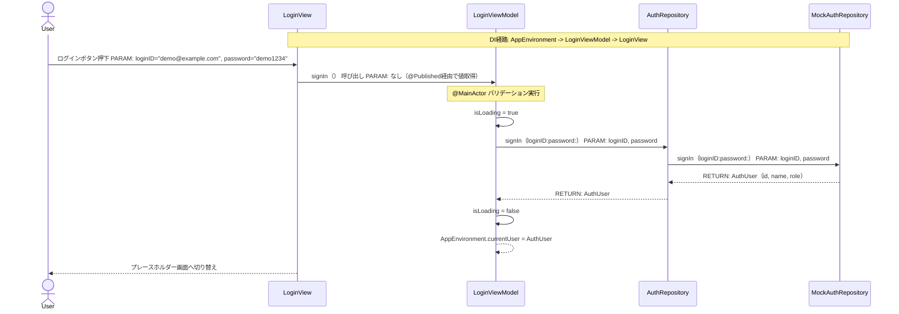
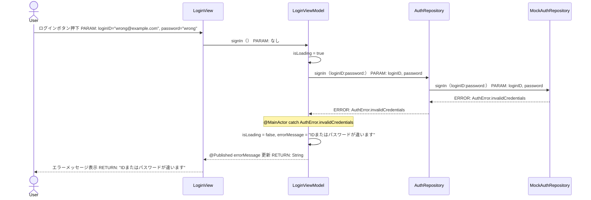
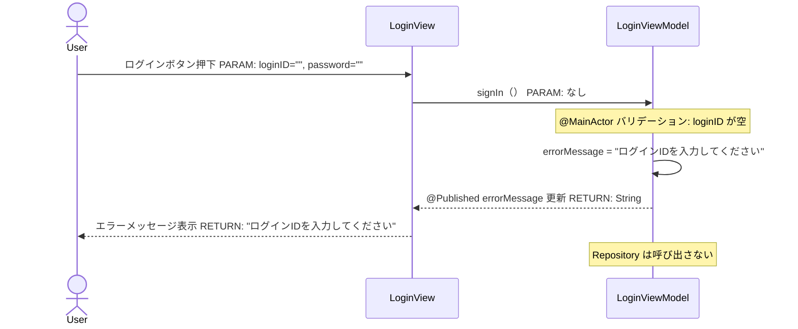
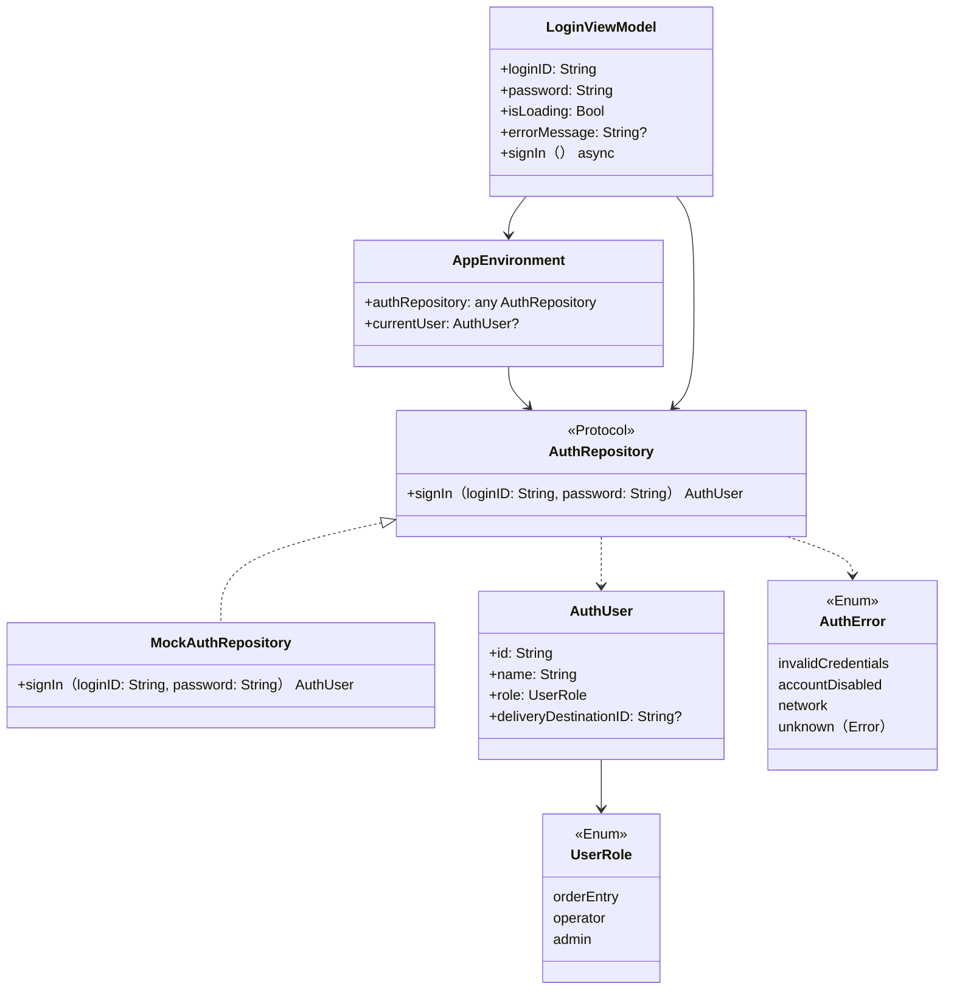

# Implementation Plan — SCR-001 ログイン画面

---

## 0. 実装入力コンテキスト

| 項目 | 記入 |
| --- | --- |
| 対象Issue | SCR-001 ログイン画面（初期実装） |
| 対象リポジトリ内パス（実装起点） | `MilkOrder/` |

### 0.1 変更サマリ一覧

| 区分 | 対象 | 変更概要 |
| --- | --- | --- |
| 追加 | LoginView | SwiftUI ログイン画面（ID・パスワード入力、エラー表示） |
| 追加 | LoginViewModel | 状態管理・バリデーション・認証呼び出し |
| 追加 | AuthRepository（Protocol） | 認証の抽象インターフェース |
| 追加 | AuthError | ドメインエラー型（認証失敗・停止・ネットワーク） |
| 追加 | AuthUser / UserRole | 認証済みユーザーモデルと権限区分 enum |
| 追加 | MockAuthRepository | 開発用モック（バックエンド未実装のため） |
| 追加 | AppEnvironment | DI ルート（AuthRepository を保持） |
| 修正 | MilkOrderApp | `AppEnvironment` を `@StateObject` で保持し LoginView を起点にする |
| 追加 | LoginViewModel | Staging（TestFlight 配布）ビルド時のみ一般ユーザー（注文入力者ロール）のデモ認証情報を初期入力し、Release/Production では空文字のまま維持する |
| 更新 | `Configurations/Staging.xcconfig` | `SWIFT_ACTIVE_COMPILATION_CONDITIONS` に `STAGING` を追加し、Swift コードから Staging ビルドをコンパイル時判定できるようにする |
| 削除 | ContentView | 初期テンプレートの不要ファイルを削除（LoginView 起点に変更したため不要） |
| 追加 | LoginViewModelTests | ViewModel のユニットテスト |
| 修正 | LoginViewModelTests | Staging 限定の初期入力と Release/Production 非影響を検証する回帰テストを追加する |

### 0.2 入力制約一覧

| 制約区分 | 制約内容 | 適用対象 |
| --- | --- | --- |
| 禁止事項 | Secrets・PII（パスワード文字列・ログインID）をログ出力しない | LoginViewModel, MockAuthRepository |
| 禁止事項 | View から Repository 具象を直接 import しない | LoginView |
| 禁止事項 | background スレッドから @Published を更新しない | LoginViewModel |
| 禁止事項 | 初期入力された値で自動的に `signIn()` を実行しない | LoginViewModel, LoginView |
| 互換性 | バックエンド API 未定のため、Mock を差し替え可能な構造にする | AuthRepository Protocol |
| 互換性 | Release/Production ビルドでは `loginID` / `password` の初期値を空文字のまま維持する | LoginViewModel |
| その他 | 初期入力対象は一般ユーザー（`MockAuthRepository` に定義済みの既存デモ認証情報、注文入力者ロール）のみとし、運用担当者・管理者は対象外にする | LoginViewModel |
| その他 | 本要件は TestFlight（Staging）版確認用の暫定処置とする。再評価トリガーは 2 経路とし、① FirebaseAuthRepository の live() 実装完了かつ正式な評価用アカウントが提供された時点、② それ以前でも発注者から正式な評価用アカウントが提示された時点、のいずれか早い方で「本初期入力を削除する」前提で再評価し、削除しない場合は正式要件へ置き換える理由を plan / PR に記録する | LoginViewModel, plan |
| その他 | SwiftLint --strict を通過させる | 全 Swift ファイル |

### 0.3 関連機能・関連仕様一覧

| 種別 | パス/識別子 | この設計での利用目的 |
| --- | --- | --- |
| 要件 | `.github/copilot/10-requirements.md` § 5（SCR-001） | 画面要件・入力チェック・遷移先の定義 |
| 設計方針 | `.github/copilot/20-architecture.md` | 2段階開発ループの確認 |
| 設計方針 | `.github/copilot/30-coding-standards.md` | Swift コーディング規約（@MainActor 等） |
| 設計方針 | `.github/copilot/40-testing-strategy.md` | XCTest テスト戦略 |
| セキュリティ | `.github/copilot/50-security.md` | PII・Secrets の扱い |
| 設計方針 | `.github/copilot/plans/xcode-staging-environment-separation.md` | 本 plan 着手前は Staging Build Configuration / Bundle ID 分離のみが実装済みで、Swift コード側の Staging 判定は未導入だったため、本 plan で STAGING コンパイル条件を追加する判断根拠として引き継ぐ |
| 既存実装 | `MilkOrder/MilkOrderApp.swift` | App エントリポイント修正対象 |
| 既存実装 | `MilkOrder/Features/Login/LoginViewModel.swift` | `loginID` / `password` の初期値が現状は空文字であることを確認する |
| 既存実装 | `MilkOrder/Infrastructure/Auth/MockAuthRepository.swift` | 一般ユーザー（注文入力者ロール）の既存デモ認証情報を初期入力値として再利用する |
| 既存実装 | `Configurations/Staging.xcconfig` | Staging 専用 Bundle ID が `com.levelcap.MilkOrder.stg` であること、および Staging 専用設定の追記先であることを確認する |
| その他 | Issue #28（認証セッションの永続化方式と再ログインが必要なケースの整理） | 本件が扱う「初回入力の手間」と、セッション永続化が扱う「再ログインの手間」を分離する |

---

## 1. 実装対象機能と機能ゴール

| 項目 | 内容 | 根拠 |
| --- | --- | --- |
| 実装対象詳細 | SCR-001 ログイン画面（LoginView + LoginViewModel + Auth ドメイン + Staging/TestFlight 限定の初期入力） | `10-requirements.md` § 5 |
| 機能ゴール | 利用者がログインID・パスワードを入力してログインでき、Staging（TestFlight 配布）ビルドでは確認用デモ認証情報が初期入力され、認証後にメニュー画面（プレースホルダー）へ遷移する | SCR-001 要件 |
| 非ゴール | メニュー画面・注文画面の実装、実際のバックエンド API 接続、パスワード再設定フロー、自動ログイン、セッション永続化（関連 Issue #28 で扱う） | 本設計のスコープ外 |
| 完了条件 | ① LoginView が iPhone 17 シミュレーターで表示される ② ID・パスワード空欄でログインボタン押下時にエラーメッセージが表示される ③ 正しい資格情報でログインするとプレースホルダーに遷移する ④ Staging ビルドでは `demo@example.com` / `demo1234` が初期入力される ⑤ Release/Production ビルドでは `loginID` / `password` が空文字のままである ⑥ `swiftlint lint --strict` が 0 violations ⑦ `xcodebuild test` が PASS | — |
| 受入確認手順 | Staging で起動して初期入力値を確認 → 値を編集せず/編集してログイン → Release/Production で起動して空欄のまま表示されることを確認 → 空欄ログイン時のエラー表示と既存ログイン成功遷移を確認 | — |

---

## 2. 前提・制約（SSOT）

| 種別 | 内容 | 根拠 |
| --- | --- | --- |
| 参照したSSOT | `10-requirements.md`, `20-architecture.md`, `30-coding-standards.md`, `50-security.md` | CLAUDE.md SSOT参照順 |
| アーキテクチャ前提 | View → ViewModel → Repository Protocol → Mock実装 の単方向依存 | `20-architecture.md`, `30-coding-standards.md` |
| iOS バージョン要件 | `MilkOrder.xcodeproj/project.pbxproj` の設定値（`IPHONEOS_DEPLOYMENT_TARGET = 26.4`, `SWIFT_VERSION = 5.0`）を SSOT とする | `MilkOrder.xcodeproj/project.pbxproj` |
| 技術制約 | async/await 必須、@MainActor で UI 更新を保護、コールバック禁止。環境固有判定は既存の `Configurations/Staging.xcconfig` を起点に追加し、Swift コードに Staging 用 Bundle ID 比較文字列を重複定義しない | `30-coding-standards.md`, `.github/copilot/50-security.md`, `.github/copilot/plans/xcode-staging-environment-separation.md` |
| 未確定前提 | バックエンド認証 API 未定 → MockAuthRepository で仮実装。API 確定後に FirebaseAuthRepository の live() 実装が完了し、正式な評価用アカウントが揃った時点、またはそれ以前でも発注者から正式な評価用アカウントが提示された時点で、本暫定初期入力を削除する前提で再評価し、削除しない場合は正式要件へ置き換える理由を記録する | API 設計フェーズ |

---

## 3. 要件定義（実装受入条件）

### 3.1 機能要件

| ID | 要件 | 受入条件（テスト可能な形） |
| --- | --- | --- |
| FR-01 | ログインIDとパスワードを入力してログインできる | `signIn(loginID:password:)` で AuthUser が返る |
| FR-02 | ログインID未入力時にエラーメッセージを表示する | `loginID` が空の場合 `errorMessage` が「ログインIDを入力してください」になる |
| FR-03 | パスワード未入力時にエラーメッセージを表示する | `password` が空の場合 `errorMessage` が「パスワードを入力してください」になる |
| FR-04 | 認証失敗時に「IDまたはパスワードが違います」を表示する | `AuthError.invalidCredentials` で `errorMessage` が対応文言になる |
| FR-05 | 利用停止ユーザーに「このアカウントは利用停止中です」を表示する | `AuthError.accountDisabled` で `errorMessage` が対応文言になる |
| FR-06 | ネットワークエラー時に「通信エラーが発生しました。再度お試しください。」を表示する | `AuthError.network` で `errorMessage` が対応文言になる |
| FR-07 | ログイン中はボタンを無効化し、ProgressView を表示する | `isLoading` が `true` の間 signIn ボタンが disabled になる |
| FR-08 | ログイン成功後にメニュー画面（プレースホルダー）へ遷移する | `loggedInUser` が非 nil になると AppEnvironment.currentUser が更新され画面が切り替わる |
| FR-09 | Staging（TestFlight 配布）ビルドではログイン画面初回表示時に loginID / password へ一般ユーザー（注文入力者ロール）の既存デモ認証情報を初期入力する | LoginViewModel.init が STAGING 条件で一般ユーザーの既存デモ認証情報（`MockAuthRepository` に定義済みの値）を設定し、画面表示直後に両フィールドへ値が表示される。ユーザーは既存の TextField / SecureField を通じて編集・削除でき、signIn() は自動実行されない |

本更新時点の追加機能要件 ID は FR-09 とする。将来、別の DESIGN/IMPLEMENT 作業が先に `scr-001-login.md` を更新して FR 採番が進んだ場合は、実装着手前に「その時点の最大値 + 1」へ再採番して重複を避ける。

### 3.2 非機能要件

| ID | 要件 | 受入条件（テスト可能な形） |
| --- | --- | --- |
| NFR-01 | パスワードフィールドは入力値をマスキングする | `SecureField` を使用する |
| NFR-02 | ログ・テストデータに loginID・password の実値を出力しない | swiftlint + コードレビューで確認 |
| NFR-03 | @MainActor で UI 更新が保護されている | `LoginViewModel` クラスに `@MainActor` を付与する |
| NFR-04 | Release/Production ビルドでは Staging 向け初期入力が混入せず、`loginID` / `password` は空文字のまま維持される | `LoginViewModel` の Release/Production ビルドでは `loginID == ""` かつ `password == ""` のまま初期化され、既存の空欄バリデーション・エラー表示・サインインフローが変わらない |

---

## 4. スコープ境界

### 4.0 スコープ境界の定義（機能単位）

| 区分 | 対象機能/責務 | 判定理由 |
| --- | --- | --- |
| In-Scope | LoginView の SwiftUI 実装 | SCR-001 画面要件 |
| In-Scope | LoginViewModel の状態管理・バリデーション・エラーハンドリング | @MainActor ViewModel 責務 |
| In-Scope | LoginViewModel 初期化時の Staging 限定デモ認証情報プリフィル | TestFlight（Staging）版の初回入力手間を削減するため |
| In-Scope | AuthRepository Protocol・AuthError・AuthUser・UserRole のドメイン定義 | バックエンド差し替え可能にするため |
| In-Scope | MockAuthRepository（開発用）の実装 | API 未定のため仮実装が必要 |
| In-Scope | AppEnvironment（DI ルート）の初期実装 | ViewModel への Protocol 注入 |
| In-Scope | `Configurations/Staging.xcconfig` への `STAGING` コンパイル条件追加 | Swift コードから Staging ビルドを明示判定するため |
| In-Scope | MilkOrderApp の更新（LoginView を起点に） | アプリエントリーポイント |
| In-Scope | LoginViewModelTests（Unit テスト）の実装 | `40-testing-strategy.md` 必須 |
| Out-of-Scope | メニュー画面・注文画面の実装 | 後続スコープ |
| Out-of-Scope | パスワード再設定フロー | SCR-001 備考「要確認」のまま |
| Out-of-Scope | 実際のバックエンド API 実装（FirebaseAuthRepository） | API 設計フェーズ |
| Out-of-Scope | 初期入力値による自動ログイン | ユーザー要望は「入力済み状態」までであり、確認ボタン押下フローは維持する |
| Out-of-Scope | 運用担当者・管理者ロールの初期入力対応 | 要望対象は一般ユーザー（注文入力者ロール）のみ |
| Out-of-Scope | セッション永続化・再ログイン削減 | 関連 Issue #28 が別スコープとして扱う |

### 4.2 実装時の影響範囲・互換性リスク

| 影響対象 | 結論 | 影響内容 |
| --- | --- | --- |
| UI/画面 | 影響あり | MilkOrderApp の WindowGroup が ContentView → LoginView/MainView に変わる。加えて Staging ビルドではログイン画面表示直後の `loginID` / `password` 初期表示値が変わるが、Release/Production は空欄のまま維持する |
| API/外部通信 | 影響なし | Mock のみ使用 |
| データモデル | 影響あり | AuthUser, UserRole, AuthError を新規追加 |
| 外部依存（SPM） | 影響なし | 追加パッケージなし |
| CI/運用 | 影響あり | `Configurations/Staging.xcconfig` に `SWIFT_ACTIVE_COMPILATION_CONDITIONS = $(inherited) STAGING` を追加するため、Staging と Release/Production の双方で初期値分岐が回帰しないことを確認する必要がある |

### 4.3 外部依存・Secrets の扱い

| 項目 | 内容 | リスク/対応 |
| --- | --- | --- |
| 外部依存の追加/更新 | なし | — |
| Secrets 利用有無 | なし（Mock のみ） | 初期入力に使う `demo@example.com` / `demo1234` は既に `MockAuthRepository` に平文で存在する公開済みデモ値を再利用し、新たな機密情報は追加しない |
| ログ/設定への機密混入対策 | loginID・password は `print` / `Logger` に出力しない。Staging 判定は `Staging.xcconfig` のコンパイル条件で行い、Secrets を設定ファイルへ追加しない | NFR-02, NFR-04 受入条件で検証 |

### 4.4 4章の自己検証

| チェック項目 | 合格条件 | 判定 |
| --- | --- | --- |
| Design PR 差分を書いていないか | plans/*.md や設計ドキュメントのみ変更を記載していない | OK |
| 実装責務を書いているか | In-Scope に実装責務が2件以上ある | OK（9件） |
| 実装影響を書いているか | 4.2 で「影響あり/未確定」が1件以上あり内容が具体的 | OK（UI・データモデル・CI/運用） |

---

## 5. アーキテクチャ設計

### 5.0 依存注入経路（DI）

| 区分 | 提供主体 | Protocol 名 | 具象実装名 | 入力 | 出力 | 境界制約 |
| --- | --- | --- | --- | --- | --- | --- |
| 記載例 | `AppEnvironment` | `MilkOrderRepository（Protocol）` | `MilkOrderRepositoryImpl` | 設定/環境値 | Repository インスタンス | View から具象を直接 import しない |
| 01 | `AppEnvironment` | `AuthRepository（Protocol）` | `MockAuthRepository` | — | AuthRepository インスタンス | LoginView から MockAuthRepository を直接 import しない |
| 02 | `LoginViewModel.init` | `AuthRepository（Protocol）` | — | authRepository | LoginViewModel 生成 | ViewModel は MockAuthRepository に依存しない |

#### 5.0.1 最小固定セット（TBD禁止）

| 最小固定項目 | 固定内容 |
| --- | --- |
| DI 経路 | `AppEnvironment -> LoginViewModel -> LoginView` |
| MainActor 境界 | `LoginViewModel` クラスに `@MainActor` を付与。`@Published` プロパティへの書き込みは MainActor 上で行う |
| Protocol/具象 境界 | `LoginView` と `LoginViewModel` は `AuthRepository`（Protocol）のみに依存。`MockAuthRepository` は `Infrastructure/Auth/` に限定 |

### 5.1 設計判断

#### 5.1.1 責務分離 / データフロー

| No. | 決定事項 | 根拠 | 未確定 |
| --- | --- | --- | --- |
| 1 | `LoginView` はフォーム表示・ボタン押下の UI のみ。バリデーション・認証は ViewModel に委譲する | `30-coding-standards.md`（View は表示のみ） | なし |
| 2 | `LoginViewModel` は `@MainActor` クラス。`signIn()` は `async` メソッドで Repository を呼び出す | Swift Concurrency 規約 | なし |
| 3 | `AuthRepository` は Protocol。実装は `MockAuthRepository`（後に `FirebaseAuthRepository` に差し替え） | バックエンド未定のため | API 仕様確定後に差し替え |
| 4 | `AppEnvironment` が `@Published var currentUser: AuthUser?` を持ち、MilkOrderApp でログイン状態の切り替えに使う | DI ルートの単一化 | なし |
| 5 | `LoginViewModel.init` でのみ Staging 判定を行い、`#if STAGING` のときだけ `loginID` / `password` に `demo@example.com` / `demo1234` を設定する | 初期入力は View ではなく ViewModel の状態初期化責務で扱うと既存の Protocol-based DI / Unit Test 構造と整合する | なし |
| 6 | 初期入力後も `TextField` / `SecureField` の binding は既存のままとし、ユーザーが値を編集・削除できるようにする | 要望は「初期入力」のみであり、入力 UI の編集可能性を壊さないため | なし |
| 7 | 初期入力は画面表示時の既定値設定に限定し、自動的な `signIn()` 呼び出しは行わない | ログインボタン押下による既存の確認フロー・バリデーション・エラー表示を維持するため | なし |

#### 5.1.2 初期表示バリエーション・エッジケース / 例外系

| No. | ケース | 方針 | 根拠 |
| --- | --- | --- | --- |
| 1 | loginID が空 | ViewModel でバリデーション → `errorMessage` に文言セット、Repository 呼び出しなし | FR-02 |
| 2 | password が空 | ViewModel でバリデーション → `errorMessage` に文言セット、Repository 呼び出しなし | FR-03 |
| 3 | 認証失敗（invalidCredentials） | Repository が `AuthError.invalidCredentials` を throw → ViewModel が catch → `errorMessage` =「IDまたはパスワードが違います」 | FR-04 |
| 4 | 利用停止（accountDisabled） | Repository が `AuthError.accountDisabled` を throw → ViewModel が catch → `errorMessage` = 「このアカウントは利用停止中です」 | FR-05 |
| 5 | ネットワークエラー | Repository が `AuthError.network` を throw → ViewModel が catch → `errorMessage` = 「通信エラーが発生しました。再度お試しください。」 | FR-06 |
| 6 | 予期せぬエラー | `AuthError.unknown(Error)` → 同上のネットワークエラー文言で統一（詳細は表示しない） | NFR-02 |
| 7 | 二重送信（ログイン中に再度タップ） | `isLoading` が `true` の間はボタンを `.disabled(true)` にする | FR-07 |
| 8 | Staging ビルドの初回表示 | `LoginViewModel.init` で一般ユーザー（注文入力者ロール）のデモ認証情報を初期入力し、ログイン画面表示時に入力欄へ反映する | FR-09 |
| 9 | Release/Production ビルドの初回表示 | `loginID` / `password` は空文字のままとし、既存の空欄バリデーションを維持する | NFR-04 |
| 10 | Staging でユーザーが初期入力値を変更した場合 | 変更後の値をそのまま保持し、ログイン時は編集後の入力値で既存 `signIn()` を実行する | FR-09 |

#### 5.1.3 SwiftUI View 部品一覧

| レイヤ | View/コンポーネント名 | 主責務 | 対応機能 |
| --- | --- | --- | --- |
| Screen | `LoginView` | ログイン画面全体 | SCR-001 |
| Section | `LoginFormSection` | ID・パスワード入力フォームのまとまり | FR-01〜FR-03 |
| Component | `LoginButton` | ログインボタン（ローディング状態対応） | FR-07 |
| Atom | `ErrorMessageText` | エラーメッセージ表示ラベル | FR-02〜FR-06 |

#### 5.1.4 ログと観測性

| No. | 観点 | 方針 |
| --- | --- | --- |
| 1 | ログ出力内容 | 認証エラー区分（`invalidCredentials` 等の enum ケース名）のみ出力可 |
| 2 | マスキング/非出力項目 | loginID・password の実値は一切ログに出力しない |
| 3 | エラー記録粒度 | `unknown(Error)` の詳細 Error は UI には渡さず、将来の Logger 層に委ねる（初期版ではログなし） |

### 5.2 トレードオフ

| 判断テーマ | 案A | 案B | 採用案 | 採用理由 | 不採用理由 |
| --- | --- | --- | --- | --- | --- |
| 認証状態管理 | `AppEnvironment` に `@Published currentUser` を持つ | `LoginViewModel` が外部から Combine で状態を伝播 | 案A | DI ルートが単一の AppEnvironment で画面切り替えができシンプル | Combine を追加すると複雑度が上がる |
| Mock vs Stub | `MockAuthRepository`（クラス） | `AuthRepositoryStub`（構造体） | `MockAuthRepository`（クラス） | テストから呼び出し回数・引数の検証が容易 | Stub は状態を持てない |
| Staging 判定方法 | `Configurations/Staging.xcconfig` に `SWIFT_ACTIVE_COMPILATION_CONDITIONS = $(inherited) STAGING` を追加し、Swift で `#if STAGING` 分岐する | 実行時に `Bundle.main.bundleIdentifier == "com.levelcap.MilkOrder.stg"` を比較する | 案A | コンパイル時判定により不要なコード分岐をビルド対象から除外でき、Swift コードへ Bundle ID 文字列を重複定義せずに済む | 案B は Swift コードに Bundle ID 文字列をハードコード比較するため、将来の Bundle ID 変更時に設定と実装が乖離しやすい |

### 5.3 ナビゲーション方針

| 項目 | 決定内容 | 根拠 |
| --- | --- | --- |
| ナビゲーション方式 | `AppEnvironment.currentUser` の nil チェックで `LoginView` / プレースホルダーを切り替える（NavigationStack は後続スコープ） | ログイン画面はルート画面のため push 遷移不要 |
| 遷移制御の責務 | `MilkOrderApp` の `WindowGroup` 内で `@StateObject var env` を参照して切り替える | DI ルートが AppEnvironment |
| ディープリンク対応 | Out-of-Scope | 初期版スコープ外 |
| 遷移時のデータ受け渡し | `AppEnvironment.currentUser` に `AuthUser` をセットして他画面から参照する | 後続画面が権限に応じた表示をするため |

### 5.4 アーキテクチャレイヤー方針

| レイヤ | 定義 | 許可する依存方向 | 禁止する依存 |
| --- | --- | --- | --- |
| View | SwiftUI 表示のみ | LoginViewModel のみ | Repository/DataSource 具象を直接 import しない |
| ViewModel | 状態管理・UI ロジック | AuthRepository Protocol のみ | MockAuthRepository 具象を直接 import しない |
| Repository | データアクセス抽象（Protocol） | — | 具象実装を Protocol ファイルに含めない |
| DataSource | ネットワーク/DB 具象実装（初期版は Mock） | 外部 SDK/フレームワーク | View/ViewModel を import しない |
| Model/Entity | AuthUser, UserRole, AuthError（Swift struct/enum） | なし | 他レイヤに依存しない |

### 5.5 データ取得ライフサイクル

| データ種別 | 取得タイミング | 取得場所 | 理由 |
| --- | --- | --- | --- |
| ログイン結果 | ログインボタン押下アクション | LoginViewModel.signIn() | ユーザー起点の操作 |

| キャッシュ方針 | 採用有無 | ルール |
| --- | --- | --- |
| インメモリキャッシュ | 不採用 | 認証結果は AppEnvironment.currentUser で保持 |
| ディスクキャッシュ | 不採用 | 初期版はセッション管理なし |

#### 5.5.1 MainActor/BackgroundActor 境界

| 対象処理 | 実行コンテキスト | 実装場所 | 禁止事項 |
| --- | --- | --- | --- |
| UI 更新（@Published 書き込み） | MainActor | LoginViewModel（@MainActor クラス） | background スレッドから @Published を直接更新しない |
| 認証 API 呼び出し | background（async/await） | MockAuthRepository.signIn() | Main スレッドをブロックしない |
| エラーメッセージ表示 | MainActor | LoginViewModel | — |

### 5.6 エラーハンドリング標準形

| 分類 | エラー型 | UI 表示ルール | 再試行ルール |
| --- | --- | --- | --- |
| unauthorized | `AuthError.invalidCredentials` | 「IDまたはパスワードが違います」インライン表示 | 手動再入力 |
| unauthorized | `AuthError.accountDisabled` | 「このアカウントは利用停止中です」インライン表示 | 再試行不可（運用側へ連絡） |
| network | `AuthError.network` | 「通信エラーが発生しました。再度お試しください。」インライン表示 | ボタン再押下で再試行可能 |
| unknown | `AuthError.unknown(Error)` | ネットワークエラーと同じ文言（内部エラーは非表示） | ボタン再押下で再試行可能 |

| ログ方針 | 内容 |
| --- | --- |
| 出力する情報 | エラー区分（enum case 名）のみ（将来の Logger 層で実装） |
| 出力しない情報 | loginID・password・stacktrace |

#### 5.6.1 エラー変換責務

| 変換対象 | 例外発生層 | ドメインエラーへ変換する層 | 上位層へ渡す型 | 禁止事項 |
| --- | --- | --- | --- | --- |
| ネットワーク例外（URLError 等） | DataSource（将来） | Repository | `AuthError.network` | View/ViewModel で URLError を直接判定しない |
| 認証失敗 | DataSource（将来） | Repository | `AuthError.invalidCredentials` | — |
| 利用停止 | DataSource（将来） | Repository | `AuthError.accountDisabled` | — |
| バリデーションエラー | ViewModel | ViewModel | errorMessage（String） | throw せず @Published に直接セット |
| 予期せぬ例外 | 任意層 | Repository | `AuthError.unknown(Error)` | stacktrace/機密情報を UI へ渡さない |

### 5.7 シーケンス図

#### 5.7.0 DI 経路

| No | 開始主体 | 終了主体 | Protocol 名 | 具象実装名 | 経路文字列 | 境界チェック観点 | 対応図ID |
| --- | --- | --- | --- | --- | --- | --- | --- |
| 記載例 | `AppEnvironment` | `SomeScreen` | `MilkOrderRepository（Protocol）` | `MilkOrderRepositoryImpl` | `AppEnvironment -> SomeViewModel -> SomeScreen` | 具象が View/ViewModel に漏れていないこと | SEQ-01 |
| 01 | `AppEnvironment` | `LoginView` | `AuthRepository（Protocol）` | `MockAuthRepository` | `AppEnvironment -> LoginViewModel -> LoginView` | MockAuthRepository が LoginView/LoginViewModel に漏れていないこと | SEQ-01 |

#### 5.7.1 シーケンス対象一覧

| 図ID | 種別 | 起点 | 終点 | 対応要件ID |
| --- | --- | --- | --- | --- |
| SEQ-01 | 正常（DI 経路・ログイン成功） | LoginView ログインボタン押下 | MockAuthRepository.signIn | FR-01, FR-08 |
| SEQ-02 | 異常（認証失敗） | LoginView ログインボタン押下 | LoginViewModel エラー表示 | FR-04 |
| SEQ-03 | 異常（バリデーションエラー） | LoginView ログインボタン押下 | LoginViewModel バリデーション | FR-02, FR-03 |

#### 5.7.1.1 境界整合チェック

| 境界テーマ | 文章セクション | 表セクション | 図セクション | 整合判定 |
| --- | --- | --- | --- | --- |
| ログ責務（どの層で出力するか） | 5.1.4 | 5.6 | 5.7.4 | OK |
| エラー変換責務 | 5.1.2 | 5.6.1 | 5.7.3 | OK |
| MainActor/Background 境界 | 5.5.1 | 8.3 | 5.7.2 | OK |

#### 5.7.1.2 最小固定セット具体化チェック

| 最小固定項目 | 文章セクション | 表セクション | 図セクション | TBD残存数 |
| --- | --- | --- | --- | --- |
| DI 経路 | 5.0.1 | 5.0, 5.7.0 | SEQ-01 | 0 |
| MainActor 境界 | 5.5.1 | 5.5.1, 8.3 | SEQ-01 | 0 |
| Protocol/具象 境界 | 5.0.1 | 8.4 | SEQ-01 | 0 |

#### 5.7.2 正常系シーケンス（SEQ-01）



#### 5.7.3 異常系シーケンス（SEQ-02 — 認証失敗）



#### 5.7.4 異常系シーケンス（SEQ-03 — バリデーションエラー）



### 5.8 処理フロー図

#### 5.8.1 メソッド一覧

| 図ID | メソッド名 | 層 | 対応要件ID |
| --- | --- | --- | --- |
| FLOW-01 | `LoginViewModel.signIn()` | ViewModel | FR-01〜FR-08 |
| FLOW-02 | `MockAuthRepository.signIn(loginID:password:)` | DataSource（Mock） | FR-01 |
| FLOW-03 | `LoginViewModel` バリデーション（signIn 内） | ViewModel | FR-02, FR-03 |

#### メソッドフロー（FLOW-01 — LoginViewModel.signIn）

```mermaid
flowchart TD
  A[START: signIn（）] --> B[INPUT: loginID, password（@Published）]
  B --> C{loginID が空か？}
  C -->|Yes| D[RETURN ERROR: errorMessage = "ログインIDを入力してください"]
  C -->|No| E{password が空か？}
  E -->|Yes| F[RETURN ERROR: errorMessage = "パスワードを入力してください"]
  E -->|No| G[isLoading = true, errorMessage = nil]
  G --> H[await authRepository.signIn（loginID:password:）]
  H --> I{Result}
  I -->|Success: AuthUser| J[AppEnvironment.currentUser = AuthUser]
  J --> K[isLoading = false]
  I -->|AuthError.invalidCredentials| L[errorMessage = "IDまたはパスワードが違います"]
  L --> K
  I -->|AuthError.accountDisabled| M[errorMessage = "このアカウントは利用停止中です"]
  M --> K
  I -->|AuthError.network または unknown| N[errorMessage = "通信エラーが発生しました。再度お試しください。"]
  N --> K
```

#### メソッドフロー（FLOW-02 — MockAuthRepository.signIn）

```mermaid
flowchart TD
  A[START: signIn（loginID:password:）] --> B[INPUT: loginID: String, password: String]
  B --> C{loginID == "demo@example.com" かつ password == "demo1234"？}
  C -->|Yes| D[RETURN: AuthUser（demo, orderEntry）]
  C -->|No| E{loginID == "operator@example.com" かつ password == "demo1234"？}
  E -->|Yes| F[RETURN: AuthUser（operator, operator）]
  E -->|No| G{loginID == "admin@example.com" かつ password == "demo1234"？}
  G -->|Yes| H[RETURN: AuthUser（admin, admin）]
  G -->|No| I[THROW: AuthError.invalidCredentials]
```

#### メソッドフロー（FLOW-03 — バリデーション）

```mermaid
flowchart TD
  A[START: バリデーション] --> B{loginID.isEmpty？}
  B -->|Yes| C[errorMessage = "ログインIDを入力してください"]
  C --> D[RETURN: バリデーション失敗]
  B -->|No| E{password.isEmpty？}
  E -->|Yes| F[errorMessage = "パスワードを入力してください"]
  F --> D
  E -->|No| G[RETURN: バリデーション通過]
```

---

## 6. 契約仕様（Protocol Contract）

### 6.0 Protocol-DI 固定前提

| 項目 | 固定方針 |
| --- | --- |
| DI 起点 | `AppEnvironment` のみで依存解決する |
| Protocol の責務 | `AuthRepository` はメソッド署名のみ定義し、具象実装を含めない |
| 具象実装の配置 | `MockAuthRepository` は `MilkOrder/Infrastructure/Auth/` に限定 |
| View / ViewModel の責務 | `LoginView` と `LoginViewModel` は `AuthRepository`（Protocol）のみに依存する |

### 6.1 入出力契約

| ID | 入口 | 入力 | 出力 | エラー |
| --- | --- | --- | --- | --- |
| IFC-01 | `AuthRepository.signIn(loginID:password:)` | `loginID: String`, `password: String` | `AuthUser` | `AuthError` |
| IFC-02 | `LoginViewModel.signIn()` | なし（@Published loginID/password を参照） | なし（@Published 更新） | なし（エラーは @Published errorMessage に反映） |

### 6.2 型/モデル/スキーマ

| ID | 対象 | 変更内容 | 後方互換 |
| --- | --- | --- | --- |
| TYPE-01 | `AuthUser` | 追加（新規） | 該当なし |
| TYPE-02 | `UserRole` | 追加（新規） | 該当なし |
| TYPE-03 | `AuthError` | 追加（新規） | 該当なし |
| TYPE-04 | `AppEnvironment` | 追加（新規） | 該当なし |

### 6.3 Protocol インターフェース定義

#### 6.3.1 Repository Protocol 一覧

| No. | Protocol 名 | メソッド署名（Swift 形式） | 配置ファイル候補 |
| --- | --- | --- | --- |
| 1 | `AuthRepository` | `func signIn(loginID: String, password: String) async throws -> AuthUser` | `MilkOrder/Domain/Auth/AuthRepository.swift` |

#### 6.3.2 ドメインモデルクラス図



#### 6.3.3 ドメイン別モデル定義

##### 6.3.3.1 モデル一覧

| ドメイン | 型名 | 区分 | 用途 |
| --- | --- | --- | --- |
| Auth | `AuthUser` | struct | 認証済みユーザー情報 |
| Auth | `UserRole` | enum | 権限区分（注文入力者/運用側/管理者） |
| Auth | `AuthError` | enum | 認証ドメインエラー型 |
| Auth | `AuthRepository` | protocol | 認証リポジトリ抽象 |

##### 6.3.3.2 プロパティ詳細定義

| ドメイン | 型名 | プロパティ名 | Swift 型 | 必須 | Optional | 説明 |
| --- | --- | --- | --- | --- | --- | --- |
| Auth | AuthUser | id | String | Y | N | ユーザー識別子 |
| Auth | AuthUser | name | String | Y | N | 表示名 |
| Auth | AuthUser | role | UserRole | Y | N | 権限区分 |
| Auth | AuthUser | deliveryDestinationID | String? | N | Y | 注文入力者の配達先ID |

##### 6.3.3.3 列挙型/リテラル制約

| No. | 型名 | case 一覧 | 用途 |
| --- | --- | --- | --- |
| 1 | `UserRole` | `orderEntry`, `operator`, `admin` | 権限に応じた画面表示切り替え |
| 2 | `AuthError` | `invalidCredentials`, `accountDisabled`, `network`, `unknown(Error)` | エラーメッセージ分岐 |

---

## 7. データ設計

| 項目 | 内容 | 互換性/移行 |
| --- | --- | --- |
| スキーマ変更 | なし（初期版は MockAuthRepository のみ） | — |
| マイグレーション方針 | 該当なし | — |
| 既存データ影響 | なし | — |
| ロールバック方針 | 該当なし | — |

---

## 8. 実装指示（製造 Agent 向け）

### 8.1 変更予定ファイル一覧

| No. | パス | 区分 | 変更タイプ | 実装内容 | 完了条件 |
| --- | --- | --- | --- | --- | --- |
| 1 | `MilkOrder/Domain/Auth/AuthRepository.swift` | Repository | 追加 | `AuthRepository` Protocol 定義 | コンパイル通過 |
| 2 | `MilkOrder/Domain/Auth/AuthUser.swift` | Model | 追加 | `AuthUser` struct + `UserRole` enum | コンパイル通過 |
| 3 | `MilkOrder/Domain/Auth/AuthError.swift` | Model | 追加 | `AuthError` enum（Error 準拠） | コンパイル通過 |
| 4 | `MilkOrder/Infrastructure/Auth/MockAuthRepository.swift` | DataSource | 追加 | `MockAuthRepository`（AuthRepository 準拠, demo/operator/admin 3アカウント） | コンパイル通過 |
| 5 | `MilkOrder/App/AppEnvironment.swift` | Other | 追加 | `AppEnvironment`（ObservableObject, authRepository + currentUser） | コンパイル通過 |
| 6 | `MilkOrder/Features/Login/LoginViewModel.swift` | ViewModel | 追加 | `@MainActor LoginViewModel`（signIn, バリデーション, エラーハンドリング, Staging 限定の初期入力） | コンパイル通過 |
| 7 | `MilkOrder/Features/Login/LoginView.swift` | View | 追加 | `LoginView`（フォーム, エラー表示, ProgressView） | シミュレーター表示確認 |
| 8 | `MilkOrder/MilkOrderApp.swift` | Other | 修正 | `@StateObject var env` を保持し `currentUser` で画面切り替え | ログイン前後の切り替え確認 |
| 9 | `MilkOrder/ContentView.swift` | Other | 削除 | LoginView 起点に変更したため不要（MilkOrderApp.swift から参照されないことを確認してから削除） | ファイルが存在しないこと |
| 10 | `MilkOrderTests/Features/Login/LoginViewModelTests.swift` | Test | 追加 | FR-01〜FR-09 / NFR-04 の Unit テスト（MockAuthRepository 使用、Staging/Release の初期値差分を含む） | `xcodebuild test` PASS |
| 11 | `Configurations/Staging.xcconfig` | Other | 修正 | `SWIFT_ACTIVE_COMPILATION_CONDITIONS = $(inherited) STAGING` を追加し、Staging ビルドだけで `#if STAGING` が有効になるようにする | Staging ビルド時のみ `STAGING` コンパイル条件が有効になる |

### 8.2 実装手順（順序付き）

| 手順 | 作業内容 | 対象ファイル | 完了条件 |
| --- | --- | --- | --- |
| 1 | Domain 層（Model・Protocol）を実装 | AuthRepository.swift, AuthUser.swift, AuthError.swift | コンパイル通過 |
| 2 | Infrastructure 層（Mock）を実装 | MockAuthRepository.swift | コンパイル通過 |
| 3 | App 層（DI ルート）を実装 | AppEnvironment.swift | コンパイル通過 |
| 4 | `Configurations/Staging.xcconfig` に `SWIFT_ACTIVE_COMPILATION_CONDITIONS = $(inherited) STAGING` を追加する | `Configurations/Staging.xcconfig` | `Staging` configuration のみ `STAGING` コンパイル条件を持つ |
| 5 | ViewModel を実装し、`LoginViewModel.init` で `#if STAGING` による初期入力を設定する | LoginViewModel.swift | Staging では demo 認証情報が初期入力され、Release/Production では空欄のまま |
| 6 | View は既存の `TextField` / `SecureField` の binding を維持し、初期入力後も編集可能な挙動を変えない | LoginView.swift | 初期入力後でもユーザーが値を編集・削除できる |
| 7 | App エントリポイントを修正 | MilkOrderApp.swift | LoginView が起動画面になる |
| 8 | ContentView.swift を削除 | MilkOrder/ContentView.swift | ファイルが存在しないこと・MilkOrderApp.swift から参照されていないこと |
| 9 | テストを実装・実行 | LoginViewModelTests.swift | `xcodebuild test` PASS |
| 10 | Lint を実行 | 全 Swift ファイル | `swiftlint lint --strict` 0 violations |
| 11 | xcodeproj に全新規ファイルを追加・削除ファイルを登録解除 | MilkOrder.xcodeproj/project.pbxproj | `xcodebuild build` が通ること |

### 8.3 実装禁止事項（ガードレール）

| 項目 | 内容 | 根拠 |
| --- | --- | --- |
| 禁止事項-1 | View から DataSource/Mock 具象を直接 import しない | レイヤ境界（5.4） |
| 禁止事項-2 | background スレッドから @Published を更新しない | MainActor 境界（5.5.1） |
| 禁止事項-3 | loginID・password の実値をログ・テストデータに含めない | NFR-02, `50-security.md` |
| 禁止事項-4 | ViewModel でバリデーションエラーを throw しない（@Published errorMessage に直接セット） | 5.6.1 エラー変換責務 |
| 禁止事項-5 | `AuthError.unknown(Error)` の内部 Error を UI に表示しない | NFR-02 |
| 禁止事項-6 | Staging 判定に `Bundle.main.bundleIdentifier == "com.levelcap.MilkOrder.stg"` の runtime 比較を採用しない | 5.2 の採用判断 |
| 禁止事項-7 | Release/Production ビルドへデモ認証情報の初期入力を混入させない | FR-09, NFR-04 |
| 禁止事項-8 | 初期入力を理由にログインボタン押下前の自動サインインを追加しない | FR-09, 非ゴール |

### 8.4 モジュール/アクセス制御方針

| 項目 | 設定内容 | 検証方法 |
| --- | --- | --- |
| アクセス制御方針 | `MockAuthRepository` は `internal`（アプリ外非公開）。ViewModel・View の `@Published` は `private(set)` で外部書き込みを禁止 | Swift コンパイラ |
| Protocol 依存強制 | `LoginView` と `LoginViewModel` は `any AuthRepository` のみ参照 | コードレビュー |

---

## 9. テスト実装計画

### 9.1 テストケース

| 区分 | パターン名 | 対象 | シナリオ | 期待結果 |
| --- | --- | --- | --- | --- |
| 正常 | ログイン成功（注文入力者） | LoginViewModel.signIn | loginID="demo@example.com", password="demo1234" | loggedInUser.role == .orderEntry |
| 正常 | ログイン成功（運用側） | LoginViewModel.signIn | loginID="operator@example.com", password="demo1234" | loggedInUser.role == .operator |
| 正常 | ログイン成功（管理者） | LoginViewModel.signIn | loginID="admin@example.com", password="demo1234" | loggedInUser.role == .admin |
| 正常 | Staging 初回表示で一般ユーザー認証情報が初期入力される | LoginViewModel.init | `STAGING` コンパイル条件で ViewModel を生成 | `loginID == "demo@example.com"` かつ `password == "demo1234"` |
| 例外 | loginID 空欄 | LoginViewModel.signIn | loginID="" | errorMessage == "ログインIDを入力してください" |
| 例外 | password 空欄 | LoginViewModel.signIn | loginID="a", password="" | errorMessage == "パスワードを入力してください" |
| 例外 | 認証失敗 | LoginViewModel.signIn | 誤った資格情報 | errorMessage == "IDまたはパスワードが違います" |
| 例外 | 利用停止 | LoginViewModel.signIn | accountDisabled を throw する Mock | errorMessage == "このアカウントは利用停止中です" |
| 例外 | ネットワークエラー | LoginViewModel.signIn | AuthError.network を throw する Mock | errorMessage == "通信エラーが発生しました。再度お試しください。" |
| 境界 | loginID が空白のみ | LoginViewModel.signIn | loginID=" " | errorMessage == "ログインIDを入力してください" （空白は空とみなす） |
| 回帰 | Release/Production 初回表示では空欄を維持する | LoginViewModel.init | `STAGING` なしで ViewModel を生成 | `loginID == ""` かつ `password == ""` |
| 回帰 | Staging の初期入力後もユーザーが値を編集できる | LoginView / LoginViewModel | Staging 初期化後に `loginID` / `password` を別値または空文字へ変更 | 変更後の値が保持され、既存の `signIn()` は編集後の入力値で実行される |
| 回帰 | ログイン成功後にerrorMessage がクリアされる | LoginViewModel.signIn | 失敗後に再度成功 | errorMessage == nil |

| 網羅チェック | 判定 | 根拠 |
| --- | --- | --- |
| 正常パターンを網羅している | Y | 3権限ログイン + Staging 初期入力をカバー |
| 例外パターンを網羅している | Y | FR-02〜FR-06 すべてカバー |
| 境界パターンを網羅している | Y | 空白のみの loginID + Staging/Release の初期値境界をカバー |
| 回帰パターンを網羅している | Y | Release/Production 非影響、初期入力の編集可能性、エラー後再ログイン成功を確認 |

---

## 10. オープン課題 / ADR

| 論点 | 現状 | 決定期限/担当 | ADR要否 |
| --- | --- | --- | --- |
| バックエンド認証 API 仕様 | 未定（Mock で仮実装） | API 設計フェーズ | 要（AuthRepository 実装確定時） |
| パスワード再設定フロー | Out-of-Scope | 後続スコープ | 不要（要件確定後に計画） |
| セッション永続化（ログイン状態の保持） | Out-of-Scope（関連 Issue #28 で継続整理） | 後続スコープ | 不要（現在は都度ログイン） |
| TestFlight（Staging）限定の初期入力の撤去条件 | 暫定処置。再評価トリガーは 2 経路とし、① FirebaseAuthRepository の live() 実装完了かつ正式な評価用アカウントが提供された時点、② それ以前でも発注者から正式な評価用アカウントが提示された時点、のいずれか早い方で「本初期入力を削除する」前提で再評価し、削除しない場合は正式要件へ置き換える理由を記録する | 認証実装着手時 / 発注者調整完了時 | 不要（plan に明記して運用する） |

### 10.1 TBD 回収トラッキング

| TBD論点 | 記載箇所 | 解決ゲート | BLOCKER | RESOLVE_IN | DEFAULT/ASSUMPTION |
| --- | --- | --- | --- | --- | --- |
| バックエンド API 仕様 | 5.2, 8.1 No.4 | 実装PR（FirebaseAuthRepository）作成前 | No | API 設計フェーズ | MockAuthRepository で代替 |

---

## 11. 新規画面追加（SCR-001 適用）

### 11.1 docs 必須項目

| 項目 | 記載内容 |
| --- | --- |
| 画面ドキュメント | `docs/screens/scr-001-login.md`（将来追加。初期版は本 plan で代替） |

### 11.2〜11.5 ファイル配置規約

| レイヤ | パス規約 |
| --- | --- |
| Model/Protocol | `MilkOrder/Domain/Auth/*.swift` |
| DataSource（Mock） | `MilkOrder/Infrastructure/Auth/Mock*.swift` |
| ViewModel | `MilkOrder/Features/Login/LoginViewModel.swift` |
| View | `MilkOrder/Features/Login/LoginView.swift` |
| DI ルート | `MilkOrder/App/AppEnvironment.swift` |
| テスト | `MilkOrderTests/Features/Login/LoginViewModelTests.swift` |
