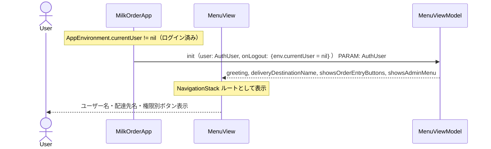
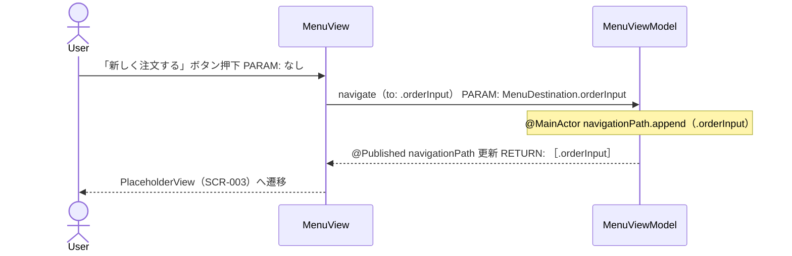
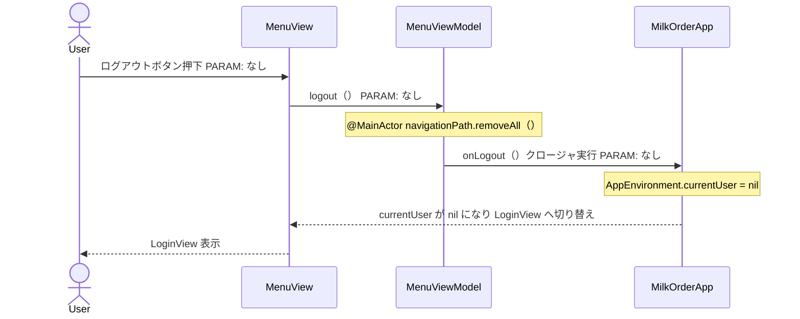
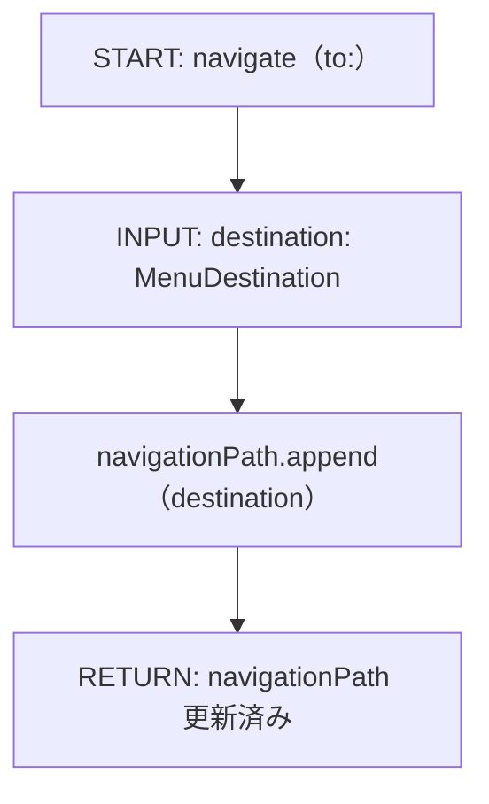
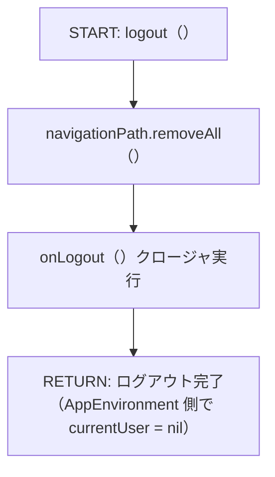
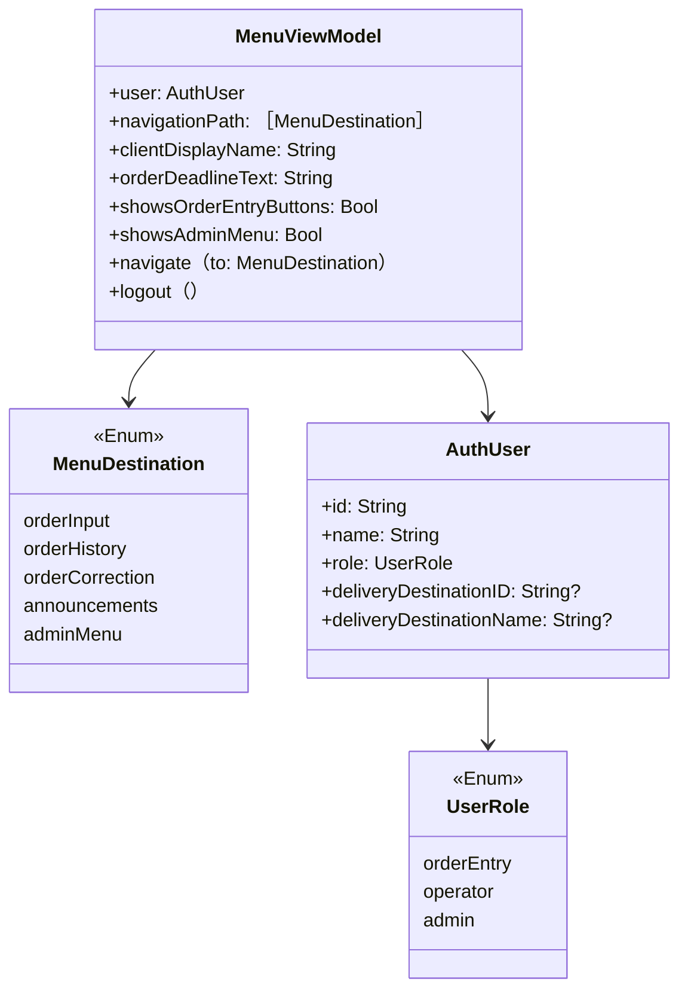

# Implementation Plan — SCR-002 メニュー画面

---

## 0. 実装入力コンテキスト

| 項目                             | 記入                                                                                                  |
| -------------------------------- | ----------------------------------------------------------------------------------------------------- |
| 対象Issue                        | SCR-002 メニュー画面（初期実装）                                                                      |
| 対象リポジトリ内パス（実装起点） | `MilkOrder/`                                                                                          |
| 前提 plan                        | `.github/copilot/plans/scr-001-login.md`（AppEnvironment / AuthUser / UserRole が実装済みであること） |

### 0.1 変更サマリ一覧

| 区分 | 対象               | 変更概要                                                                                                         |
| ---- | ------------------ | ---------------------------------------------------------------------------------------------------------------- |
| 追加 | MenuView           | SwiftUI メニュー画面（クライアント名・4ボタン・注文締切表示・権限別切替）                                        |
| 追加 | MenuViewModel      | クライアント名表示・注文締切表示・ログアウト・ナビゲーション制御                                                 |
| 追加 | MenuDestination    | NavigationStack で使う画面遷移先 enum（orderInput / orderHistory / orderCorrection / announcements / adminMenu） |
| 追加 | MenuItemButton     | 大きなアクションボタン共通コンポーネント                                                                         |
| 追加 | PlaceholderView    | SCR-003 / SCR-006 / SCR-007 / お知らせ / SCR-014 の仮実装（後続 plan で差し替え）                                |
| 修正 | AuthUser           | `deliveryDestinationName: String?` を追加                                                                        |
| 修正 | MockAuthRepository | 注文入力者の AuthUser に `deliveryDestinationName` をセット                                                      |
| 修正 | MilkOrderApp       | ログイン後に `NavigationStack` + `MenuView` を表示                                                               |
| 追加 | MenuViewModelTests | ViewModel のユニットテスト                                                                                       |

### 0.2 入力制約一覧

| 制約区分 | 制約内容                                                                                                | 適用対象                                                       |
| -------- | ------------------------------------------------------------------------------------------------------- | -------------------------------------------------------------- |
| 互換性   | SCR-001 で定義した `AuthUser` / `AppEnvironment` の破壊的変更を避ける                                   | AuthUser（deliveryDestinationName 追加は Optional で後方互換） |
| 禁止事項 | View から AppEnvironment を直接 import しない（ViewModel 経由で参照）                                   | MenuView                                                       |
| 禁止事項 | background スレッドから @Published を更新しない                                                         | MenuViewModel                                                  |
| 禁止事項 | ログアウト時に PII（ユーザー名 / loginID）をログに出力しない                                            | MenuViewModel                                                  |
| その他   | SCR-003 / SCR-006 / 注文訂正 / お知らせ / SCR-014 は PlaceholderView で仮実装し、後続 plan で差し替える | MenuView 遷移先                                                |

### 0.3 関連機能・関連仕様一覧

| 種別      | パス/識別子                                         | この設計での利用目的                                |
| --------- | --------------------------------------------------- | --------------------------------------------------- |
| 要件      | `.github/copilot/10-requirements.md` § 5（SCR-002） | 画面要件・ボタン一覧・遷移先の定義                  |
| 前提 plan | `.github/copilot/plans/scr-001-login.md`            | AuthUser / UserRole / AppEnvironment の型定義を参照 |
| 設計方針  | `.github/copilot/20-architecture.md`                | 2段階開発ループ                                     |
| 設計方針  | `.github/copilot/30-coding-standards.md`            | @MainActor / NavigationStack 規約                   |
| 設計方針  | `.github/copilot/40-testing-strategy.md`            | XCTest テスト戦略                                   |

---

## 1. 実装対象機能と機能ゴール

| 項目         | 内容                                                                                                                                                                                                                                                                     | 根拠                     |
| ------------ | ------------------------------------------------------------------------------------------------------------------------------------------------------------------------------------------------------------------------------------------------------------------------ | ------------------------ |
| 実装対象詳細 | SCR-002 メニュー画面（MenuView + MenuViewModel + NavigationStack）                                                                                                                                                                                                       | `10-requirements.md` § 5 |
| 機能ゴール   | ログイン後にクライアント名が表示され、注文入力者には「新しく注文する」「注文履歴を見る」「注文を訂正する」「お知らせを見る」の4ボタンと注文締切時刻が表示される。ログアウトするとログイン画面に戻る                                                                      | SCR-002 要件             |
| 非ゴール     | SCR-003（注文入力）/ SCR-006（購入履歴）/ 注文訂正 / お知らせ / SCR-014（管理メニュー）の本実装、注文締切時刻の動的取得                                                                                                                                                  | 後続スコープ             |
| 完了条件     | ① iPhone 17 シミュレーターでメニュー画面が表示される ② 注文入力者ログイン時に4ボタン＋注文締切が表示される ③ 運用側・管理者ログイン時に管理メニューボタンが表示される ④ ログアウトでログイン画面に戻る ⑤ `swiftlint lint --strict` 0 violations ⑥ `xcodebuild test` PASS | —                        |
| 受入確認手順 | `demo@example.com` でログイン → クライアント名・4ボタン・注文締切を確認 → 各ボタン押下でプレースホルダーへ遷移確認 → ログアウト確認 / `admin@example.com` でログイン → 管理メニューボタン確認                                                                            | —                        |

---

## 2. 前提・制約（SSOT）

| 種別               | 内容                                                                                                           | 根拠                            |
| ------------------ | -------------------------------------------------------------------------------------------------------------- | ------------------------------- |
| 参照したSSOT       | `10-requirements.md`, `20-architecture.md`, `30-coding-standards.md`                                           | CLAUDE.md SSOT参照順            |
| アーキテクチャ前提 | SCR-001 で確立した `AppEnvironment -> ViewModel -> View` の DI 経路を継続使用                                  | `scr-001-login.md` §5.0         |
| iOS バージョン要件 | iOS 18以上（NavigationStack は iOS 16以上で利用可能）                                                          | `60-ci-quality-gates.md`        |
| 技術制約           | `MenuViewModel` はリポジトリ不要（AppEnvironment.currentUser から情報を取得）。Repository は後続スコープで追加 | SCR-002 要件（データ取得なし）  |
| 未確定前提         | お知らせの動的取得・注文締切時刻の設定 → 初期版は静的表示で仮実装                                              | `10-requirements.md` 未確定事項 |

---

## 3. 要件定義（実装受入条件）

### 3.1 機能要件

| ID    | 要件                                                                                                    | 受入条件（テスト可能な形）                                                                                                              |
| ----- | ------------------------------------------------------------------------------------------------------- | --------------------------------------------------------------------------------------------------------------------------------------- |
| FR-01 | クライアント名（発注者名）を「〇〇 様」と表示する                                                       | `MenuViewModel.clientDisplayName` が `"${deliveryDestinationName} 様"` を返す（注文入力者）。運用側・管理者は `user.name` を表示        |
| FR-02 | 注文入力者には配達先名をクライアント名として表示する                                                    | `user.role == .orderEntry` かつ `deliveryDestinationName` 非 nil のとき `clientDisplayName` が `"${deliveryDestinationName} 様"` になる |
| FR-03 | 注文入力者に「新しく注文する」「注文履歴を見る」「注文を訂正する」「お知らせを見る」の4ボタンを表示する | `user.role == .orderEntry` のとき `showsOrderEntryButtons` が true                                                                      |
| FR-04 | 運用側担当者・管理者に「管理メニュー」ボタンを表示する                                                  | `user.role == .operator \|\| .admin` のとき `showsAdminMenu` が true                                                                    |
| FR-05 | 注文入力者には「管理メニュー」ボタンを表示しない                                                        | `user.role == .orderEntry` のとき `showsAdminMenu` が false                                                                             |
| FR-06 | ログアウトボタンで `AppEnvironment.currentUser = nil` になり LoginView に戻る                           | `logout()` 呼び出し後 `AppEnvironment.currentUser` が nil になる                                                                        |
| FR-07 | 各ボタン押下で対応する画面（プレースホルダー）へ遷移する                                                | `navigate(to:)` 呼び出しで `navigationPath` にターゲットが追加される                                                                    |
| FR-08 | 「注文を訂正する」ボタン押下で注文訂正プレースホルダーへ遷移する                                        | `navigate(to: .orderCorrection)` で `navigationPath == [.orderCorrection]`                                                              |
| FR-09 | 「お知らせを見る」ボタン押下でお知らせプレースホルダーへ遷移する                                        | `navigate(to: .announcements)` で `navigationPath == [.announcements]`                                                                  |
| FR-10 | 注文入力者メニューに注文締切時刻を表示する                                                              | `MenuViewModel.orderDeadlineText` が `"注文締切：毎日 15:00"` を返す（初期版は静的文字列）                                              |

### 3.2 非機能要件

| ID     | 要件                                                                | 受入条件（テスト可能な形）                                              |
| ------ | ------------------------------------------------------------------- | ----------------------------------------------------------------------- |
| NFR-01 | ボタンはスマートフォンで押しやすい大きさ（最低 height: 56pt）にする | `MenuItemButton` の `.frame(maxWidth: .infinity, minHeight: 56)`        |
| NFR-02 | 高齢者・IT 不慣れなユーザーを考慮しシンプルなレイアウトにする       | ボタン中心のレイアウト、不要な情報を排除                                |
| NFR-03 | ログアウト時に PII をログ出力しない                                 | `logout()` 実装にユーザー名・loginID の出力なし（コードレビューで確認） |

---

## 4. スコープ境界

### 4.0 スコープ境界の定義

| 区分         | 対象機能/責務                                                                 | 判定理由                       |
| ------------ | ----------------------------------------------------------------------------- | ------------------------------ |
| In-Scope     | MenuView の SwiftUI 実装                                                      | SCR-002 画面要件               |
| In-Scope     | MenuViewModel（ユーザー情報表示・ログアウト・ナビゲーション）                 | ViewModel 責務                 |
| In-Scope     | MenuDestination enum の定義（アプリ全体のナビゲーション基盤）                 | NavigationStack で使用         |
| In-Scope     | MenuItemButton 共通コンポーネント                                             | 再利用可能な大ボタン           |
| In-Scope     | PlaceholderView（SCR-003 / SCR-006 / 注文訂正 / お知らせ / SCR-014 の仮実装） | ナビゲーション動作確認のため   |
| In-Scope     | AuthUser への `deliveryDestinationName: String?` 追加（SCR-001 型修正）       | FR-02 実現に必要               |
| In-Scope     | MilkOrderApp の NavigationStack 追加                                          | ログイン後のナビゲーション基盤 |
| In-Scope     | MenuViewModelTests                                                            | テスト戦略必須                 |
| Out-of-Scope | SCR-003 / SCR-006 / SCR-014 の本実装                                          | 後続スコープ                   |
| Out-of-Scope | お知らせ（Announcement）の動的取得                                            | Repository 設計が未定          |
| Out-of-Scope | 注文締切時刻の動的設定                                                        | マスタ設計が未定               |

### 4.2 実装時の影響範囲・互換性リスク

| 影響対象        | 結論     | 影響内容                                                                                                                   |
| --------------- | -------- | -------------------------------------------------------------------------------------------------------------------------- |
| UI/画面         | 影響あり | MilkOrderApp にログイン後の NavigationStack が追加される                                                                   |
| API/外部通信    | 影響なし | データ取得なし                                                                                                             |
| データモデル    | 影響あり | `AuthUser` に `deliveryDestinationName: String?`（Optional）を追加。SCR-001 の既存コードへの影響は Optional なので後方互換 |
| 外部依存（SPM） | 影響なし | 追加パッケージなし                                                                                                         |
| CI/運用         | 影響なし | swiftlint / xcodebuild test は既存設定で動作                                                                               |

### 4.3 外部依存・Secrets の扱い

| 項目                      | 内容                                                   | リスク/対応 |
| ------------------------- | ------------------------------------------------------ | ----------- |
| 外部依存の追加/更新       | なし                                                   | —           |
| Secrets 利用有無          | なし                                                   | —           |
| ログ/設定への機密混入対策 | ユーザー名・loginID は `print` / `Logger` に出力しない | NFR-03      |

### 4.4 4章の自己検証

| チェック項目                   | 合格条件                          | 判定                   |
| ------------------------------ | --------------------------------- | ---------------------- |
| Design PR 差分を書いていないか | plans/*.md の変更を記載していない | OK                     |
| 実装責務を書いているか         | In-Scope に実装責務が2件以上ある  | OK（8件）              |
| 実装影響を書いているか         | 4.2 で影響あり/未確定が1件以上    | OK（UI・データモデル） |

---

## 5. アーキテクチャ設計

### 5.0 依存注入経路（DI）

| 区分   | 提供主体         | Protocol 名                       | 具象実装名                | 入力                                  | 出力                    | 境界制約                                    |
| ------ | ---------------- | --------------------------------- | ------------------------- | ------------------------------------- | ----------------------- | ------------------------------------------- |
| 記載例 | `AppEnvironment` | `MilkOrderRepository（Protocol）` | `MilkOrderRepositoryImpl` | 設定/環境値                           | Repository インスタンス | View から具象を直接 import しない           |
| 01     | `AppEnvironment` | —                                 | —                         | `currentUser: AuthUser`（@Published） | ユーザー情報            | MenuView は AppEnvironment を直接参照しない |
| 02     | `MilkOrderApp`   | —                                 | —                         | `onLogout: () -> Void`（クロージャ）  | MenuViewModel 生成      | ログアウト処理は AppEnvironment が所有      |

> SCR-002 は Repository 不要。`AppEnvironment.currentUser` を ViewModel 初期化時に渡すシンプルな構成。

#### 5.0.1 最小固定セット（TBD禁止）

| 最小固定項目       | 固定内容                                                                                         |
| ------------------ | ------------------------------------------------------------------------------------------------ |
| DI 経路            | `MilkOrderApp（AppEnvironment）-> MenuViewModel -> MenuView`                                     |
| MainActor 境界     | `MenuViewModel` クラスに `@MainActor` を付与。`logout()` / `navigate(to:)` は MainActor 上で実行 |
| Protocol/具象 境界 | SCR-002 では Repository を追加しない。MenuView は MenuViewModel のみに依存する                   |

### 5.1 設計判断

#### 5.1.1 責務分離 / データフロー

| No. | 決定事項                                                                                                                                   | 根拠                                                                                                         | 未確定                               |
| --- | ------------------------------------------------------------------------------------------------------------------------------------------ | ------------------------------------------------------------------------------------------------------------ | ------------------------------------ |
| 1   | `MenuViewModel` は Repository を持たない。ユーザー情報は初期化時に `AuthUser` として受け取る                                               | データ取得不要。AppEnvironment の @Published を直接 View に渡すと ViewModel 不要になりレイヤ境界が崩れるため | なし                                 |
| 2   | ログアウト処理は `onLogout: () -> Void` クロージャで AppEnvironment に委譲する                                                             | ViewModel が AppEnvironment に依存しないためテスト容易                                                       | なし                                 |
| 3   | ナビゲーションは `@Published var navigationPath: [MenuDestination]` で管理し、NavigationStack に bind する                                 | プログラマティックナビゲーション。後続画面の追加が容易                                                       | なし                                 |
| 4   | `MenuDestination` enum をアプリ共通の型として `MilkOrder/App/` に配置する                                                                  | 複数の ViewModel からも使えるようにするため                                                                  | なし                                 |
| 5   | `deliveryDestinationName` を `AuthUser` に Optional として追加する。operator / admin は nil                                                | DeliveryDestination リポジトリ追加を避け、認証レスポンスにまとめる                                           | API 確定後に見直し                   |
| 6   | `clientDisplayName` は注文入力者の場合 `deliveryDestinationName + " 様"`、運用側・管理者の場合 `user.name` を返す computed property にする | ヘッダー表示の責務を ViewModel に集約し、View は表示のみ                                                     | なし                                 |
| 7   | 注文締切時刻は `orderDeadlineText: String` として初期版は静的文字列（`"注文締切：毎日 15:00"`）にする                                      | マスタ管理（SCR-013）が未実装のため。差し替え可能な設計にする                                                | 通知設定マスタ実装時に動的取得へ変更 |
| 8   | 「お知らせを見る」は静的バナーではなくナビゲーションボタンとし、プレースホルダー画面へ遷移させる                                           | 将来のお知らせ一覧画面（動的）への差し替えを容易にするため                                                   | なし                                 |

#### 5.1.2 エッジケース / 例外系

| No. | ケース                                             | 方針                                                                                               |
| --- | -------------------------------------------------- | -------------------------------------------------------------------------------------------------- |
| 1   | `deliveryDestinationName` が nil（運用側・管理者） | 配達先名エリアを非表示にする（`if let` で条件表示）                                                |
| 2   | ログアウト中の多重タップ                           | ログアウトは `currentUser = nil` の1操作のみ。非同期処理なしのため二重実行は起きない               |
| 3   | プレースホルダー画面からのバック操作               | NavigationStack の標準バックボタンで戻る。`navigationPath` から最後の要素が自動除去される          |
| 4   | ログアウト後に navigationPath が残留する           | `onLogout` 実行時に `navigationPath.removeAll()` してから AppEnvironment.currentUser を nil にする |

#### 5.1.3 SwiftUI View 部品一覧

| レイヤ    | View/コンポーネント名 | 主責務                                                           | 対応機能     |
| --------- | --------------------- | ---------------------------------------------------------------- | ------------ |
| Screen    | `MenuView`            | メニュー画面全体・NavigationStack ルート                         | SCR-002      |
| Section   | `MenuHeaderSection`   | クライアント名（発注者名）表示                                   | FR-01, FR-02 |
| Section   | `MenuButtonsSection`  | 権限別アクションボタン群 + 注文締切表示                          | FR-03〜FR-10 |
| Component | `MenuItemButton`      | 大きなアクションボタン（アイコン + テキスト）                    | NFR-01       |
| Atom      | `OrderDeadlineLabel`  | 注文締切時刻表示（「注文締切：毎日 15:00」）                     | FR-10        |
| Atom      | `PlaceholderView`     | SCR-003 / SCR-006 / 注文訂正 / お知らせ / SCR-014 の遷移先仮画面 | FR-07〜FR-09 |

#### 5.1.4 ログと観測性

| No. | 観点                  | 方針                                                                       |
| --- | --------------------- | -------------------------------------------------------------------------- |
| 1   | ログ出力内容          | ナビゲーション遷移先（`MenuDestination` の case 名）のみ将来のログ対象候補 |
| 2   | マスキング/非出力項目 | ユーザー名・deliveryDestinationName は一切ログに出力しない                 |
| 3   | エラー記録粒度        | SCR-002 はエラーなし（非同期処理・Repository 呼び出しなし）                |

### 5.2 トレードオフ

| 判断テーマ               | 案A                                      | 案B                                      | 採用案              | 採用理由                                    | 不採用理由                                 |
| ------------------------ | ---------------------------------------- | ---------------------------------------- | ------------------- | ------------------------------------------- | ------------------------------------------ |
| ViewModel への情報渡し方 | `AppEnvironment` を直接 ViewModel に渡す | `AuthUser` + `onLogout` クロージャを渡す | 案B                 | AppEnvironment に依存しないためテストが容易 | 案A は AppEnvironment のモックが必要になる |
| ナビゲーション実装       | `NavigationPath`（型消去）               | `[MenuDestination]`（型付き配列）        | `[MenuDestination]` | 型安全。Hashable 準拠の enum で十分         | NavigationPath は型消去のため複雑          |
| お知らせ表示             | 動的取得（AnnouncementRepository）       | 静的テキスト                             | 静的テキスト        | 初期版スコープ外。後続で差し替え可能        | リポジトリ追加は後続スコープ               |

### 5.3 ナビゲーション方針

| 項目                   | 決定内容                                                                                        | 根拠                                                     |
| ---------------------- | ----------------------------------------------------------------------------------------------- | -------------------------------------------------------- |
| ナビゲーション方式     | `NavigationStack(path: $viewModel.navigationPath)`                                              | iOS 16以上。プログラマティックナビゲーションが必要なため |
| 画面遷移の責務         | `MenuViewModel.navigate(to:)` が `navigationPath` に追加。View はボタンアクションで呼び出すのみ | View はナビゲーション制御ロジックを持たない              |
| ディープリンク対応     | Out-of-Scope                                                                                    | 初期版スコープ外                                         |
| 遷移時のデータ受け渡し | `MenuDestination` enum の associated value で渡す（現時点では不要）                             | 後続画面で必要になったら拡張                             |

### 5.4 アーキテクチャレイヤー方針

| レイヤ       | 定義                                     | 許可する依存方向                          | 禁止する依存                                              |
| ------------ | ---------------------------------------- | ----------------------------------------- | --------------------------------------------------------- |
| View         | SwiftUI 表示のみ                         | MenuViewModel のみ                        | AppEnvironment を直接参照しない                           |
| ViewModel    | 状態管理・ナビゲーション・ログアウト委譲 | AuthUser（Model）, onLogout（クロージャ） | Repository 具象を持たない（SCR-002 では Repository 不要） |
| Model/Entity | AuthUser, UserRole, MenuDestination      | なし                                      | 他レイヤに依存しない                                      |

### 5.5 データ取得ライフサイクル

| データ種別                                            | 取得タイミング                                     | 取得場所           | 理由                                         |
| ----------------------------------------------------- | -------------------------------------------------- | ------------------ | -------------------------------------------- |
| ユーザー情報（name / role / deliveryDestinationName） | ViewModel 初期化時（SCR-001 の認証結果を引き継ぐ） | MenuViewModel.init | 認証後に AuthUser が確定済みのため再取得不要 |
| お知らせ                                              | 静的（初期版）                                     | MenuView 内の定数  | 動的取得は後続スコープ                       |

| キャッシュ方針       | 採用有無 | ルール                                |
| -------------------- | -------- | ------------------------------------- |
| インメモリキャッシュ | 不採用   | AppEnvironment.currentUser で保持済み |
| ディスクキャッシュ   | 不採用   | 初期版スコープ外                      |

#### 5.5.1 MainActor/BackgroundActor 境界

| 対象処理                       | 実行コンテキスト | 実装場所                           | 禁止事項                                            |
| ------------------------------ | ---------------- | ---------------------------------- | --------------------------------------------------- |
| UI 更新（@Published 書き込み） | MainActor        | MenuViewModel（@MainActor クラス） | background スレッドから @Published を直接更新しない |
| logout()                       | MainActor        | MenuViewModel                      | 非同期処理なし。同期実行のみ                        |
| navigate(to:)                  | MainActor        | MenuViewModel                      | 非同期処理なし。同期実行のみ                        |

### 5.6 エラーハンドリング標準形

SCR-002 は Repository 呼び出しなし・非同期処理なし。エラーハンドリング不要。

| 分類     | エラー型 | UI 表示ルール | 再試行ルール |
| -------- | -------- | ------------- | ------------ |
| （なし） | —        | —             | —            |

### 5.7 シーケンス図

#### 5.7.0 DI 経路

| No     | 開始主体         | 終了主体     | Protocol 名                       | 具象実装名                | 経路文字列                                                                    | 境界チェック観点                                | 対応図ID |
| ------ | ---------------- | ------------ | --------------------------------- | ------------------------- | ----------------------------------------------------------------------------- | ----------------------------------------------- | -------- |
| 記載例 | `AppEnvironment` | `SomeScreen` | `MilkOrderRepository（Protocol）` | `MilkOrderRepositoryImpl` | `AppEnvironment -> SomeViewModel -> SomeScreen`                               | 具象が View/ViewModel に漏れていないこと        | SEQ-01   |
| 01     | `MilkOrderApp`   | `MenuView`   | —                                 | —                         | `MilkOrderApp（AppEnvironment）-> MenuViewModel（user, onLogout）-> MenuView` | MenuView が AppEnvironment を直接参照しないこと | SEQ-01   |

#### 5.7.1 シーケンス対象一覧

| 図ID   | 種別                   | 起点                     | 終点                       | 対応要件ID                |
| ------ | ---------------------- | ------------------------ | -------------------------- | ------------------------- |
| SEQ-01 | 正常（初期表示）       | ログイン後 MenuView 表示 | MenuViewModel 初期化・表示 | FR-01, FR-02, FR-03/FR-04 |
| SEQ-02 | 正常（ナビゲーション） | ボタン押下               | PlaceholderView 表示       | FR-07                     |
| SEQ-03 | 正常（ログアウト）     | ログアウトボタン押下     | LoginView 復帰             | FR-06                     |

#### 5.7.1.1 境界整合チェック

| 境界テーマ                | 文章セクション | 表セクション | 図セクション | 整合判定         |
| ------------------------- | -------------- | ------------ | ------------ | ---------------- |
| ログ責務                  | 5.1.4          | 5.6          | 5.7.4        | OK（ログなし）   |
| エラー変換責務            | 5.1.2          | 5.6.1        | —            | OK（エラーなし） |
| MainActor/Background 境界 | 5.5.1          | 8.3          | 5.7.2        | OK               |

#### 5.7.1.2 最小固定セット具体化チェック

| 最小固定項目       | 文章セクション | 表セクション | 図セクション | TBD残存数 |
| ------------------ | -------------- | ------------ | ------------ | --------- |
| DI 経路            | 5.0.1          | 5.0, 5.7.0   | SEQ-01       | 0         |
| MainActor 境界     | 5.5.1          | 5.5.1, 8.3   | SEQ-01       | 0         |
| Protocol/具象 境界 | 5.0.1          | 8.4          | SEQ-01       | 0         |

#### 5.7.2 正常系シーケンス（SEQ-01 — 初期表示）



#### 5.7.3 正常系シーケンス（SEQ-02 — ナビゲーション）



#### 5.7.4 正常系シーケンス（SEQ-03 — ログアウト）



### 5.8 処理フロー図

#### 5.8.1 メソッド一覧

| 図ID    | メソッド名                           | 層        | 対応要件ID   |
| ------- | ------------------------------------ | --------- | ------------ |
| FLOW-01 | `MenuViewModel.init(user:onLogout:)` | ViewModel | FR-01〜FR-05 |
| FLOW-02 | `MenuViewModel.navigate(to:)`        | ViewModel | FR-07        |
| FLOW-03 | `MenuViewModel.logout()`             | ViewModel | FR-06        |

#### メソッドフロー（FLOW-01 — MenuViewModel.init）

```mermaid
flowchart TD
  A[START: init（user:onLogout:）] --> B[INPUT: user: AuthUser, onLogout: ｛｝]
  B --> C[self.user = user]
  C --> D[self.onLogout = onLogout]
  D --> E{user.role}
  E -->|.orderEntry| F[showsOrderEntryButtons = true, showsAdminMenu = false]
  E -->|.operator または .admin| G[showsOrderEntryButtons = false, showsAdminMenu = true]
  F --> H[greeting = "\（user.name）様"]
  G --> H
  H --> I{user.deliveryDestinationName != nil？}
  I -->|Yes| J[deliveryDestinationName = user.deliveryDestinationName]
  I -->|No| K[deliveryDestinationName = nil]
  J --> L[RETURN: MenuViewModel 初期化完了]
  K --> L
```

#### メソッドフロー（FLOW-02 — MenuViewModel.navigate）



#### メソッドフロー（FLOW-03 — MenuViewModel.logout）



---

## 6. 契約仕様（Protocol Contract）

### 6.0 Protocol-DI 固定前提

| 項目                    | 固定方針                                                                                    |
| ----------------------- | ------------------------------------------------------------------------------------------- |
| DI 起点                 | `MilkOrderApp` が `AppEnvironment` を保持し、`MenuViewModel` へ `user` と `onLogout` を渡す |
| Protocol の責務         | SCR-002 は新規 Protocol なし。SCR-001 の `AuthRepository` を継続使用                        |
| 具象実装の配置          | 変更なし（SCR-001 の `MockAuthRepository` を継続使用）                                      |
| View / ViewModel の責務 | `MenuView` は `MenuViewModel` のみに依存する                                                |

### 6.1 入出力契約

| ID     | 入口                                                   | 入力                                                                  | 出力                                                                         | エラー |
| ------ | ------------------------------------------------------ | --------------------------------------------------------------------- | ---------------------------------------------------------------------------- | ------ |
| IFC-01 | `MenuViewModel.init(user:orderDeadlineText:onLogout:)` | `user: AuthUser`, `orderDeadlineText: String`, `onLogout: () -> Void` | MenuViewModel インスタンス                                                   | なし   |
| IFC-02 | `MenuViewModel.navigate(to:)`                          | `destination: MenuDestination`                                        | なし（@Published navigationPath 更新）                                       | なし   |
| IFC-03 | `MenuViewModel.logout()`                               | なし                                                                  | なし（onLogout クロージャ経由で currentUser = nil）                          | なし   |
| IFC-04 | `MenuViewModel.clientDisplayName`                      | なし（computed property）                                             | `String`（注文入力者は deliveryDestinationName + " 様"、その他は user.name） | なし   |
| IFC-05 | `MenuViewModel.orderDeadlineText`                      | なし（stored property）                                               | `String`（初期版は静的文字列）                                               | なし   |

### 6.2 型/モデル/スキーマ

| ID      | 対象                            | 変更内容                                                                         | 後方互換                  |
| ------- | ------------------------------- | -------------------------------------------------------------------------------- | ------------------------- |
| TYPE-01 | `AuthUser`（SCR-001）           | `deliveryDestinationName: String?` を追加                                        | 後方互換（Optional 追加） |
| TYPE-02 | `MenuDestination`               | 追加（新規 enum）                                                                | 該当なし                  |
| TYPE-03 | `MockAuthRepository`（SCR-001） | `demo@example.com` の AuthUser に `deliveryDestinationName: "○○保育園"` をセット | 後方互換                  |

### 6.3 Protocol インターフェース定義

#### 6.3.1 SCR-002 で追加する Protocol

なし（Repository 不要）

#### 6.3.2 ドメインモデルクラス図



#### 6.3.3 ドメイン別モデル定義

##### 6.3.3.1 モデル一覧

| ドメイン     | 型名              | 区分   | 用途                                               |
| ------------ | ----------------- | ------ | -------------------------------------------------- |
| Navigation   | `MenuDestination` | enum   | NavigationStack で使う遷移先の型安全表現（5 case） |
| Auth（修正） | `AuthUser`        | struct | `deliveryDestinationName: String?` 追加            |

##### 6.3.3.2 プロパティ詳細定義（追加・変更分のみ）

| ドメイン   | 型名            | プロパティ名            | Swift 型 | 必須 | Optional | 説明                                                            |
| ---------- | --------------- | ----------------------- | -------- | ---- | -------- | --------------------------------------------------------------- |
| Auth       | AuthUser        | deliveryDestinationName | String?  | N    | Y        | 注文入力者の配達先表示名（運用側・管理者は nil）                |
| Navigation | MenuDestination | orderInput              | case     | —    | —        | 注文入力画面（SCR-003）への遷移先                               |
| Navigation | MenuDestination | orderHistory            | case     | —    | —        | 注文履歴画面（SCR-006）への遷移先                               |
| Navigation | MenuDestination | orderCorrection         | case     | —    | —        | 注文訂正画面への遷移先（後続スコープで SCR-007 相当と統合検討） |
| Navigation | MenuDestination | announcements           | case     | —    | —        | お知らせ一覧画面への遷移先（後続スコープで動的化）              |
| Navigation | MenuDestination | adminMenu               | case     | —    | —        | 管理メニュー画面（SCR-014）への遷移先                           |

##### 6.3.3.3 列挙型/リテラル制約

| No. | 型名              | case 一覧                                                                     | 用途                                 |
| --- | ----------------- | ----------------------------------------------------------------------------- | ------------------------------------ |
| 1   | `MenuDestination` | `orderInput`, `orderHistory`, `orderCorrection`, `announcements`, `adminMenu` | NavigationStack の型安全な遷移先指定 |

---

## 7. データ設計

| 項目                 | 内容                                                                 | 互換性/移行                                                                      |
| -------------------- | -------------------------------------------------------------------- | -------------------------------------------------------------------------------- |
| スキーマ変更         | `AuthUser` に `deliveryDestinationName: String?` を追加              | Optional のため既存コードへの影響なし                                            |
| マイグレーション方針 | 該当なし（in-memory のみ）                                           | —                                                                                |
| 既存データ影響       | `MockAuthRepository` の返却値を更新（`demo@example.com` のみ非 nil） | SCR-001 テストへの影響なし（deliveryDestinationName を参照するテストがないため） |

---

## 8. 実装指示（製造 Agent 向け）

### 8.1 変更予定ファイル一覧

| No. | パス                                                     | 区分       | 変更タイプ | 実装内容                                                                                                                     | 完了条件               |
| --- | -------------------------------------------------------- | ---------- | ---------- | ---------------------------------------------------------------------------------------------------------------------------- | ---------------------- |
| 1   | `MilkOrder/Domain/Auth/AuthUser.swift`                   | Model      | 変更       | `deliveryDestinationName: String?` を追加                                                                                    | コンパイル通過         |
| 2   | `MilkOrder/Infrastructure/Auth/MockAuthRepository.swift` | DataSource | 変更       | `demo@example.com` の AuthUser に `deliveryDestinationName: "○○保育園"` をセット                                             | コンパイル通過         |
| 3   | `MilkOrder/App/MenuDestination.swift`                    | Other      | 追加       | `MenuDestination` enum（Hashable 準拠, orderInput / orderHistory / orderCorrection / announcements / adminMenu）             | コンパイル通過         |
| 4   | `MilkOrder/Features/Menu/MenuViewModel.swift`            | ViewModel  | 追加       | `@MainActor MenuViewModel`（clientDisplayName, orderDeadlineText, showsOrderEntryButtons, showsAdminMenu, navigate, logout） | コンパイル通過         |
| 5   | `MilkOrder/Features/Menu/MenuView.swift`                 | View       | 追加       | `MenuView`（NavigationStack ルート, 権限別ボタン, ヘッダー）                                                                 | シミュレーター表示確認 |
| 6   | `MilkOrder/Features/Menu/MenuItemButton.swift`           | View       | 追加       | `MenuItemButton`（アイコン + テキスト, minHeight: 56）                                                                       | コンパイル通過         |
| 7   | `MilkOrder/Features/Shared/PlaceholderView.swift`        | View       | 追加       | `PlaceholderView`（画面名を表示するだけのスタブ）                                                                            | コンパイル通過         |
| 8   | `MilkOrder/MilkOrderApp.swift`                           | Other      | 変更       | ログイン後に `NavigationStack` + `MenuView` を表示。`onLogout` クロージャで `currentUser = nil`                              | 動作確認               |
| 9   | `MilkOrderTests/Features/Menu/MenuViewModelTests.swift`  | Test       | 追加       | FR-01〜FR-07 の Unit テスト                                                                                                  | `xcodebuild test` PASS |

### 8.2 実装手順（順序付き）

| 手順 | 作業内容                                                                 | 対象ファイル                                | 完了条件                               |
| ---- | ------------------------------------------------------------------------ | ------------------------------------------- | -------------------------------------- |
| 1    | AuthUser に `deliveryDestinationName` を追加し MockAuthRepository を更新 | AuthUser.swift, MockAuthRepository.swift    | コンパイル通過・SCR-001 テスト PASS    |
| 2    | MenuDestination enum を実装                                              | MenuDestination.swift                       | コンパイル通過                         |
| 3    | MenuViewModel を実装                                                     | MenuViewModel.swift                         | コンパイル通過                         |
| 4    | MenuItemButton・PlaceholderView を実装                                   | MenuItemButton.swift, PlaceholderView.swift | コンパイル通過                         |
| 5    | MenuView を実装                                                          | MenuView.swift                              | シミュレーター表示確認                 |
| 6    | MilkOrderApp を更新（NavigationStack + MenuView）                        | MilkOrderApp.swift                          | ログイン後メニュー表示確認             |
| 7    | テストを実装・実行                                                       | MenuViewModelTests.swift                    | `xcodebuild test` PASS                 |
| 8    | Lint を実行                                                              | 全 Swift ファイル                           | `swiftlint lint --strict` 0 violations |
| 9    | xcodeproj に全新規ファイルを追加                                         | MilkOrder.xcodeproj                         | ビルド対象に含まれる                   |

### 8.3 実装禁止事項（ガードレール）

| 項目       | 内容                                                                                          | 根拠                     |
| ---------- | --------------------------------------------------------------------------------------------- | ------------------------ |
| 禁止事項-1 | MenuView から AppEnvironment を直接参照しない                                                 | レイヤ境界（5.4）        |
| 禁止事項-2 | background スレッドから @Published を更新しない                                               | MainActor 境界（5.5.1）  |
| 禁止事項-3 | ユーザー名・deliveryDestinationName をログに出力しない                                        | NFR-03, `50-security.md` |
| 禁止事項-4 | `AuthUser` の `deliveryDestinationName` 追加で既存テストを壊さない（Optional なので影響なし） | 後方互換（4.2）          |
| 禁止事項-5 | PlaceholderView を最終実装と混在させない（後続 plan で差し替える）                            | スコープ管理             |

### 8.4 モジュール/アクセス制御方針

| 項目                       | 設定内容                                                                                            | 検証方法                   |
| -------------------------- | --------------------------------------------------------------------------------------------------- | -------------------------- |
| アクセス制御方針           | `MenuViewModel` の `navigationPath` は `private(set)` で外部書き込みを禁止。`onLogout` は `private` | Swift コンパイラ           |
| Protocol 依存強制          | SCR-002 では新規 Protocol なし                                                                      | —                          |
| `MenuDestination` の可視性 | `internal`（アプリ全体から参照可能）                                                                | 後続画面からも参照するため |

---

## 9. テスト実装計画

### 9.1 テストケース

| 区分 | パターン名                                   | 対象                                 | シナリオ                                                 | 期待結果                                                      |
| ---- | -------------------------------------------- | ------------------------------------ | -------------------------------------------------------- | ------------------------------------------------------------- |
| 正常 | クライアント名表示（注文入力者）             | MenuViewModel.clientDisplayName      | deliveryDestinationName = "○○保育園", role = .orderEntry | clientDisplayName == "○○保育園 様"                            |
| 正常 | クライアント名表示（運用側）                 | MenuViewModel.clientDisplayName      | user.name = "運用 太郎", role = .operator                | clientDisplayName == "運用 太郎"                              |
| 正常 | 注文締切テキスト表示                         | MenuViewModel.orderDeadlineText      | 初期値                                                   | orderDeadlineText == "注文締切：毎日 15:00"                   |
| 正常 | 注文入力者ボタン表示                         | MenuViewModel.showsOrderEntryButtons | user.role == .orderEntry                                 | showsOrderEntryButtons == true, showsAdminMenu == false       |
| 正常 | 運用側ボタン表示                             | MenuViewModel.showsAdminMenu         | user.role == .operator                                   | showsAdminMenu == true, showsOrderEntryButtons == false       |
| 正常 | 管理者ボタン表示                             | MenuViewModel.showsAdminMenu         | user.role == .admin                                      | showsAdminMenu == true                                        |
| 正常 | ナビゲーション（注文入力）                   | MenuViewModel.navigate               | navigate(to: .orderInput)                                | navigationPath == [.orderInput]                               |
| 正常 | ナビゲーション（注文履歴）                   | MenuViewModel.navigate               | navigate(to: .orderHistory)                              | navigationPath == [.orderHistory]                             |
| 正常 | ナビゲーション（注文訂正）                   | MenuViewModel.navigate               | navigate(to: .orderCorrection)                           | navigationPath == [.orderCorrection]                          |
| 正常 | ナビゲーション（お知らせ）                   | MenuViewModel.navigate               | navigate(to: .announcements)                             | navigationPath == [.announcements]                            |
| 正常 | ナビゲーション（管理メニュー）               | MenuViewModel.navigate               | navigate(to: .adminMenu)                                 | navigationPath == [.adminMenu]                                |
| 正常 | ログアウト                                   | MenuViewModel.logout                 | logout() 呼び出し                                        | onLogout クロージャが呼ばれる, navigationPath.isEmpty == true |
| 境界 | deliveryDestinationName が nil（注文入力者） | MenuViewModel.clientDisplayName      | deliveryDestinationName = nil, role = .orderEntry        | clientDisplayName が空文字または user.name にフォールバック   |
| 境界 | ログアウト前に navigationPath が空           | MenuViewModel.logout                 | navigationPath が空の状態でログアウト                    | クラッシュせず onLogout が呼ばれる                            |
| 回帰 | SCR-001 AuthUser 追加フィールド              | AuthUser 初期化                      | deliveryDestinationName を省略してデフォルト nil         | コンパイル通過・既存テスト PASS                               |

| 網羅チェック               | 判定          | 根拠                                          |
| -------------------------- | ------------- | --------------------------------------------- |
| 正常パターンを網羅している | Y             | 3権限・全ナビゲーション先・ログアウトをカバー |
| 例外パターンを網羅している | Y（例外なし） | SCR-002 はエラー系なし                        |
| 境界パターンを網羅している | Y             | navigationPath 空でのログアウト               |
| 回帰パターンを網羅している | Y             | SCR-001 AuthUser 変更の影響確認               |

---

## 10. オープン課題 / ADR

| 論点                               | 現状                               | 決定期限/担当            | ADR要否                                   |
| ---------------------------------- | ---------------------------------- | ------------------------ | ----------------------------------------- |
| お知らせの動的取得                 | 静的テキストで仮実装               | お知らせ機能設計フェーズ | 不要（後続スコープで判断）                |
| 注文締切時刻の動的設定             | 静的テキスト「毎日 15:00」で仮実装 | 通知設定マスタ実装時     | 不要（後続スコープで判断）                |
| `deliveryDestinationName` の取得元 | 初期版は AuthUser に含める         | API 仕様確定時           | 要（API 確定後にデータ取得戦略を ADR 化） |

### 10.1 TBD 回収トラッキング

| TBD論点                                                      | 記載箇所            | 解決ゲート         | BLOCKER | RESOLVE_IN       | DEFAULT/ASSUMPTION                |
| ------------------------------------------------------------ | ------------------- | ------------------ | ------- | ---------------- | --------------------------------- |
| deliveryDestinationName の取得元（API vs AuthUser 埋め込み） | 5.1.1 No.5, TYPE-03 | API 設計 PR 作成前 | No      | API 設計フェーズ | AuthUser に含める（初期版）で代替 |

---

## 11. 新規画面追加（SCR-002 適用）

### ファイル配置規約

| レイヤ            | パス規約                                                |
| ----------------- | ------------------------------------------------------- |
| Navigation        | `MilkOrder/App/MenuDestination.swift`                   |
| ViewModel         | `MilkOrder/Features/Menu/MenuViewModel.swift`           |
| View（Screen）    | `MilkOrder/Features/Menu/MenuView.swift`                |
| View（Component） | `MilkOrder/Features/Menu/MenuItemButton.swift`          |
| View（Shared）    | `MilkOrder/Features/Shared/PlaceholderView.swift`       |
| テスト            | `MilkOrderTests/Features/Menu/MenuViewModelTests.swift` |
