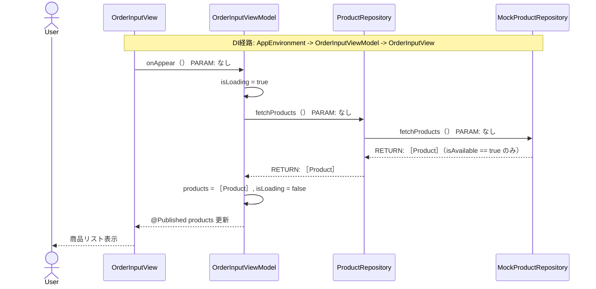
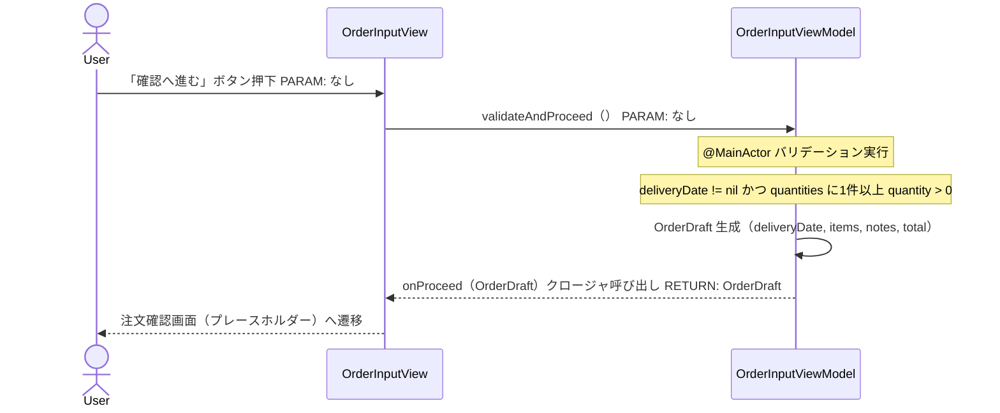
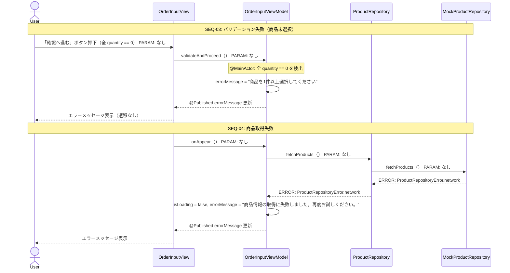
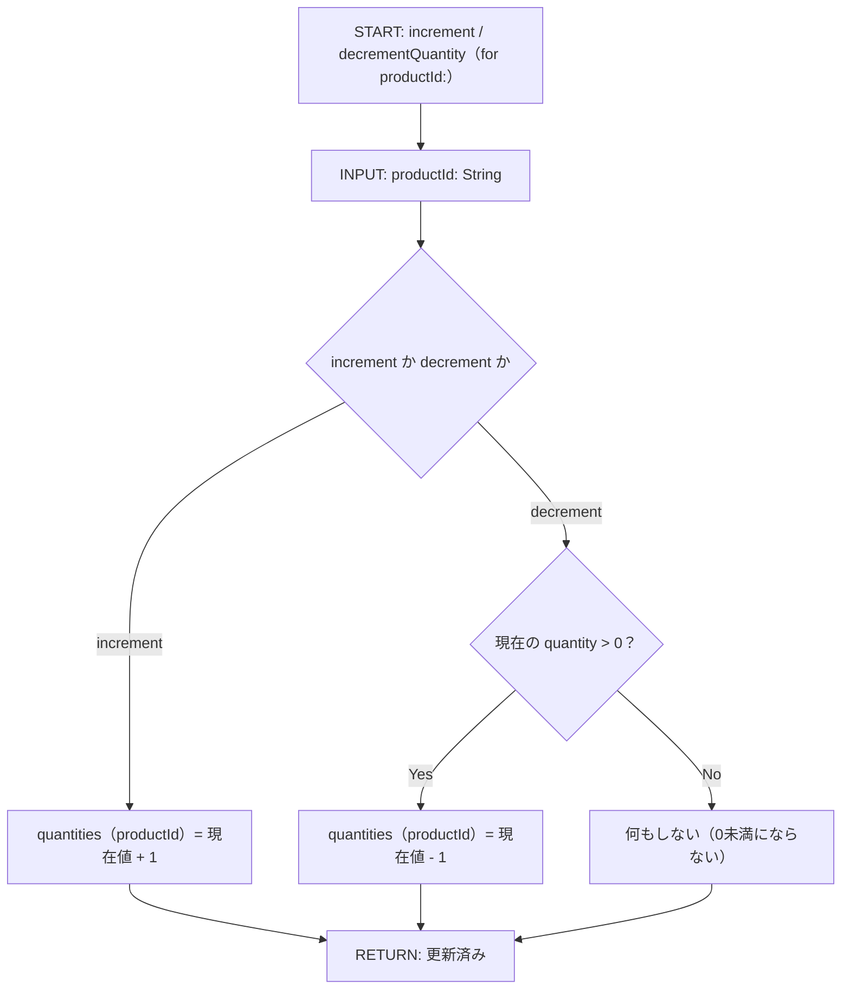
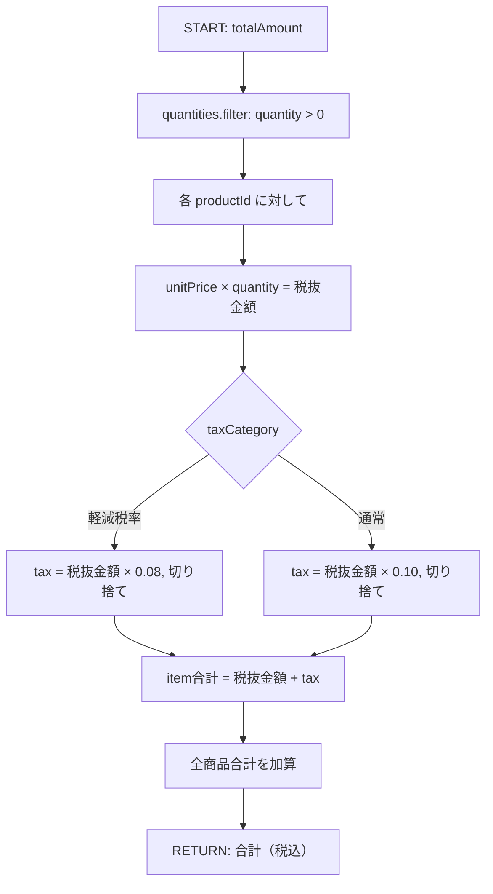
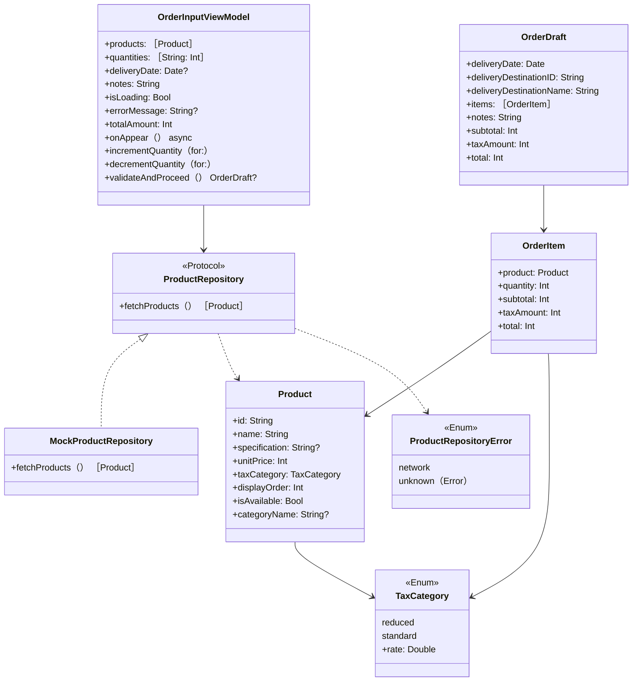

# Implementation Plan — SCR-003 注文入力画面

---

## 0. 実装入力コンテキスト

| 項目 | 記入 |
| --- | --- |
| 対象Issue | SCR-003 注文入力画面（初期実装） |
| 対象リポジトリ内パス（実装起点） | `MilkOrder/` |
| 前提 plan | `scr-001-login.md`（AuthUser / AppEnvironment 実装済み）、`scr-002-menu.md`（MenuDestination.orderInput 定義済み） |

### 0.1 変更サマリ一覧

| 区分 | 対象 | 変更概要 |
| --- | --- | --- |
| 追加 | Product / TaxCategory | 商品モデルと税区分 enum |
| 追加 | OrderItem | 注文明細モデル（商品 + 数量） |
| 追加 | OrderDraft | 確認画面へ渡す注文下書きモデル |
| 追加 | ProductRepository（Protocol） | 商品一覧取得の抽象インターフェース |
| 追加 | MockProductRepository | 開発用商品モック（3商品） |
| 追加 | OrderInputViewModel | 配達日・商品選択・数量・合計計算・バリデーション |
| 追加 | OrderInputView | 注文入力画面（配達日・商品リスト・備考・合計・確認ボタン） |
| 仕様追記 | DeadlineCountdownLabel | 注文締切カウントダウンの表示粒度と更新間隔を追記 |
| 追加 | ProductRowView | 商品行コンポーネント（商品名・単価・＋/－ボタン） |
| 修正 | AppEnvironment | `productRepository: any ProductRepository` を追加 |
| 修正 | MilkOrderApp | NavigationStack の `.orderInput` destination に `OrderInputView` を接続 |
| 追加 | OrderInputViewModelTests | ViewModel のユニットテスト |

### 0.2 入力制約一覧

| 制約区分 | 制約内容 | 適用対象 |
| --- | --- | --- |
| 禁止事項 | 単価・税額を注文者が手入力できる UI にしない | OrderInputView |
| 禁止事項 | View から MockProductRepository を直接 import しない | OrderInputView |
| 禁止事項 | background スレッドから @Published を更新しない | OrderInputViewModel |
| 互換性 | AppEnvironment への `productRepository` 追加は既存コード（SCR-001/002）の破壊的変更にならないよう Optional 初期値を設ける | AppEnvironment |
| その他 | 消費税端数処理は切り捨てで仮実装（未確定事項 No.5。API 確定後に差し替え） | OrderInputViewModel |
| その他 | 注文締切チェックは「配達日が今日より未来」で仮実装（SCR-013 マスタ確定後に 15:00 判定に置き換え） | OrderInputViewModel |

### 0.3 関連機能・関連仕様一覧

| 種別 | パス/識別子 | この設計での利用目的 |
| --- | --- | --- |
| 要件 | `10-requirements.md` § 4.1 No.5〜7, § 6.1, § 6.2 | 注文入力・商品マスタ・入力チェック・計算要件 |
| 前提 plan | `scr-001-login.md` | AuthUser（deliveryDestinationID / deliveryDestinationName）の型定義 |
| 前提 plan | `scr-002-menu.md` | MenuDestination.orderInput の定義 |
| ワイヤーフレーム | `docs/00_要件/画面イメージ_乳製品等受注集計管理アプリ.pptx` スライド5 | 商品行 UI・＋/－ボタン・合計表示レイアウト |
| 設計方針 | `30-coding-standards.md` | @MainActor / async/await |
| セキュリティ | `50-security.md` | PII・Secrets の非出力 |

---

## 1. 実装対象機能と機能ゴール

| 項目 | 内容 | 根拠 |
| --- | --- | --- |
| 実装対象詳細 | SCR-003 注文入力画面（OrderInputView + OrderInputViewModel + Order ドメイン） | `10-requirements.md` § 5 |
| 機能ゴール | 配達日を選択し、商品を＋/－ボタンで選択、備考を入力して、合計金額（税込）を確認しながら注文確認画面へ進める | SCR-003 要件 |
| 非ゴール | 注文確認画面（SCR-004）の本実装、商品マスタ管理画面（SCR-011）、配達先別商品制御、過去購入商品の上位表示 | 後続スコープ |
| 完了条件 | ① 商品一覧が表示される ② ＋/－ボタンで数量が変わり合計が自動更新される ③ 配達日未選択・商品未選択・締切超過で適切なエラーが出る ④ 「確認へ進む」押下でプレースホルダーへ遷移 ⑤ `swiftlint lint --strict` 0 violations ⑥ `xcodebuild test` PASS | — |
| 受入確認手順 | `demo@example.com` でログイン → メニュー「新しく注文する」 → 商品を選択・数量入力 → 合計変動確認 → 「確認へ進む」 | — |

---

## 2. 前提・制約（SSOT）

| 種別 | 内容 | 根拠 |
| --- | --- | --- |
| 参照したSSOT | `10-requirements.md`, `20-architecture.md`, `30-coding-standards.md`, `50-security.md` | CLAUDE.md SSOT参照順 |
| アーキテクチャ前提 | `AppEnvironment -> OrderInputViewModel -> OrderInputView` の DI 経路を確立 | `20-architecture.md` |
| iOS バージョン要件 | iOS 18以上（DatePicker / async/await 対応済み） | `60-ci-quality-gates.md` |
| 技術制約 | async/await で商品取得、@MainActor で UI 更新、Protocol で Repository 抽象化 | `30-coding-standards.md` |
| 未確定前提（TBD） | 消費税端数処理（切り捨て仮実装）/ 注文締切時刻（今日より未来で仮実装）/ 商品カテゴリ表示（初期版は単一リスト）/ 配達先別商品フィルタ（初期版は全商品表示） | `10-requirements.md` 未確定事項 No.3〜5 |

---

## 3. 要件定義（実装受入条件）

### 3.1 機能要件

| ID | 要件 | 受入条件（テスト可能な形） |
| --- | --- | --- |
| FR-01 | 画面表示時に商品マスタから販売中商品を取得して表示する | `onAppear()` 後 `products` が非空、`isAvailable == true` の商品のみ表示 |
| FR-02 | 配達日を日付選択（カレンダー）で入力できる | `DatePicker` で `deliveryDate` が更新される |
| FR-03 | 配達日は今日以降のみ選択可能（過去日・締切超過を選択不可） | `DatePicker` の `in: Date()...` で過去日を排除 |
| FR-04 | 各商品に＋/－ボタンがあり数量を変更できる | `increment/decrementQuantity(for:)` で quantity が増減する |
| FR-05 | 数量は 0 未満にならない（－ボタンが 0 のとき無効） | `decrementQuantity` で quantity > 0 のときのみ減算 |
| FR-06 | 合計金額（税込）が数量変更のたびに自動更新される | `totalAmount` computed property が `quantities` 変更で再計算される |
| FR-07 | 単価は商品マスタから自動表示し、注文者は変更できない | `ProductRowView` に単価を read-only で表示。入力フィールドなし |
| FR-08 | 備考は 50 文字以内で任意入力できる | `notes.count <= 50` バリデーションで 51 文字目は入力不可 |
| FR-09 | 配達日未入力（初期状態）で「確認へ進む」を押したときエラーを表示する | `validateAndProceed()` で `deliveryDate == nil` のとき `errorMessage` セット |
| FR-10 | 商品が 1 件も選択されていない状態で「確認へ進む」を押したときエラーを表示する | 全 quantity == 0 のとき `errorMessage` = 「商品を1件以上選択してください」 |
| FR-11 | バリデーション通過後「確認へ進む」で `OrderDraft` を生成し確認画面（プレースホルダー）へ遷移する | `validateAndProceed()` が `OrderDraft` を返し、`onProceed(OrderDraft)` クロージャを呼ぶ |
| FR-12 | 締切カウントダウン表示は、残り時間が24時間以上のときは時間/分、24時間未満のときは時間/分/秒で表示し、24時間未満の間は1秒ごとに自動更新する | - 残り時間がちょうど24時間のときは「締切（15:00）まであとX時間Y分」と表示され、秒が出ないこと<br>- 残り時間が23時間59分59秒のときは「締切（15:00）まであとX時間Y分Z秒」と表示され、1秒ごとに更新されること |

### 3.2 非機能要件

| ID | 要件 | 受入条件（テスト可能な形） |
| --- | --- | --- |
| NFR-01 | 数量入力ブロック内の全ボタン（[−][+] メイン2ボタン・一括増減の [-100][-10][-5][+5][+10][+100] 6ボタン・[注文キャンセル] 1ボタン）はスマートフォンでタップしやすいサイズ（最低 44×44pt）にする。メインの [−]/[+] は 72×72pt、一括増減6ボタンは minHeight: 64pt 以上、注文キャンセルは高さ約 64pt の横いっぱいでこの基準を上回る | XCUITest で各商品行の数量入力ブロック内の全 9 ボタンそれぞれに accessibilityIdentifier（`qty-decrease`, `qty-increase`, `qty-cancel`, `qty-quick-minus100`, `qty-quick-minus10`, `qty-quick-minus5`, `qty-quick-plus5`, `qty-quick-plus10`, `qty-quick-plus100`）を付与して一意に特定した上で、frame 幅・高さがそれぞれ 44pt 以上であることを確認できる |
| NFR-02 | 商品取得中は ProgressView を表示し、取得後に商品リストを表示する | `isLoading == true` の間 ProgressView, false で商品リスト |
| NFR-03 | 単価・数量・合計金額を `¥` 記号付きの整数フォーマットで表示する | `formattedPrice(Int) -> String` ヘルパーで「¥1,234」形式 |

---

## 4. スコープ境界

### 4.0 スコープ境界の定義

| 区分 | 対象機能/責務 | 判定理由 |
| --- | --- | --- |
| In-Scope | OrderInputView の SwiftUI 実装 | SCR-003 画面要件 |
| In-Scope | OrderInputViewModel（商品取得・数量管理・金額計算・バリデーション） | ViewModel 責務 |
| In-Scope | Product / TaxCategory / OrderItem / OrderDraft モデル定義 | 注文ドメインの基盤 |
| In-Scope | ProductRepository Protocol + MockProductRepository | API 未定のため Mock 必須 |
| In-Scope | ProductRowView（商品行コンポーネント） | 再利用可能な UI 部品 |
| In-Scope | AppEnvironment への `productRepository` 追加 | DI ルートへの組み込み |
| In-Scope | NavigationStack の `.orderInput` destination 接続 | SCR-002 の PlaceholderView を本実装に差し替え |
| In-Scope | OrderInputViewModelTests | テスト戦略必須 |
| Out-of-Scope | 注文確認画面（SCR-004）の本実装 | 後続スコープ |
| Out-of-Scope | 商品カテゴリ別グループ表示 | 初期版は単一リストで仮実装（将来拡張） |
| Out-of-Scope | 配達先別商品フィルタリング | マスタ設計未定 |
| Out-of-Scope | 過去購入商品の上位表示 | 第2段階候補（`10-requirements.md`） |
| Out-of-Scope | 注文締切時刻の動的判定（15:00チェック） | SCR-013 マスタ確定後 |

### 4.2 実装時の影響範囲・互換性リスク

| 影響対象 | 結論 | 影響内容 |
| --- | --- | --- |
| UI/画面 | 影響あり | MenuDestination.orderInput の遷移先が PlaceholderView → OrderInputView に変わる |
| API/外部通信 | 影響なし | MockProductRepository のみ使用 |
| データモデル | 影響あり | Product / OrderItem / OrderDraft / TaxCategory を新規追加 |
| AppEnvironment | 影響あり | `productRepository: any ProductRepository` を追加。既存フィールドへの影響なし |
| 外部依存（SPM） | 影響なし | 追加パッケージなし |
| CI/運用 | 影響なし | 既存 lint / test 設定で動作 |

### 4.3 外部依存・Secrets の扱い

| 項目 | 内容 | リスク/対応 |
| --- | --- | --- |
| 外部依存の追加/更新 | なし | — |
| Secrets 利用有無 | なし | — |
| ログ/設定への機密混入対策 | 配達先名・ユーザー名をログに出力しない | `50-security.md` |

### 4.4 4章の自己検証

| チェック項目 | 合格条件 | 判定 |
| --- | --- | --- |
| Design PR 差分を書いていないか | plans/*.md の変更を記載していない | OK |
| 実装責務を書いているか | In-Scope に実装責務が2件以上ある | OK（8件） |
| 実装影響を書いているか | 4.2 で影響あり/未確定が1件以上 | OK（UI・データモデル・AppEnvironment） |

---

## 5. アーキテクチャ設計

### 5.0 依存注入経路（DI）

| 区分 | 提供主体 | Protocol 名 | 具象実装名 | 入力 | 出力 | 境界制約 |
| --- | --- | --- | --- | --- | --- | --- |
| 記載例 | `AppEnvironment` | `MilkOrderRepository（Protocol）` | `MilkOrderRepositoryImpl` | 設定/環境値 | Repository インスタンス | View から具象を直接 import しない |
| 01 | `AppEnvironment` | `ProductRepository（Protocol）` | `MockProductRepository` | — | ProductRepository インスタンス | OrderInputView から MockProductRepository を直接 import しない |
| 02 | `OrderInputViewModel.init` | `ProductRepository（Protocol）` | — | productRepository, deliveryDestination | OrderInputViewModel | ViewModel は MockProductRepository に依存しない |
| 03 | `MilkOrderApp` | — | — | `onProceed: (OrderDraft) -> Void` | OrderInputView 生成 | 遷移先への OrderDraft 受け渡しをクロージャで行う |

#### 5.0.1 最小固定セット（TBD禁止）

| 最小固定項目 | 固定内容 |
| --- | --- |
| DI 経路 | `AppEnvironment -> OrderInputViewModel -> OrderInputView` |
| MainActor 境界 | `OrderInputViewModel` クラスに `@MainActor` を付与。`onAppear()` は Task で呼び出し、@Published 更新は MainActor で実行 |
| Protocol/具象 境界 | `OrderInputView` と `OrderInputViewModel` は `ProductRepository`（Protocol）のみに依存。`MockProductRepository` は `Infrastructure/Order/` に限定 |

### 5.1 設計判断

#### 5.1.1 責務分離 / データフロー

| No. | 決定事項 | 根拠 | 未確定 |
| --- | --- | --- | --- |
| 1 | 数量管理は `[String: Int]`（productId → quantity）の辞書で管理。products 配列とは分離する | 商品リストを immutable に保ちながら数量だけ可変にできる | なし |
| 2 | 合計金額（totalAmount）は `quantities` と `products` から derived な computed property にする | @Published の変更が自動で合計に反映されるため、別途 publish 不要 | なし |
| 3 | 消費税は商品単位で計算し切り捨て（初期版）。`taxAmount(for product: Product, quantity: Int) -> Int` を ViewModel の private メソッドで持つ | 端数処理が未確定のため実装を1箇所に集約して差し替えを容易にする | 端数処理（未確定事項 No.5） |
| 4 | 配達日の初期値は `nil`。DatePicker 表示前に「配達日を選択してください」のプレースホルダーを表示 | 未入力エラーを明示的に検出できるようにするため | なし |
| 5 | `validateAndProceed()` は `OrderDraft?` を返し、nil でなければ `onProceed` クロージャを呼ぶ。View はクロージャの結果でナビゲーション | ViewModel がナビゲーション状態を持たず、テスト可能な純粋な検証ロジックになる | なし |
| 6 | 商品リストは初期版でカテゴリ分けなし（単一 List）。`Product.categoryName` は定義するが表示は将来対応 | 初期版スコープ外（Out-of-Scope） | なし |

#### 5.1.2 エッジケース / 例外系

| No. | ケース | 方針 |
| --- | --- | --- |
| 1 | 配達日 nil で「確認へ進む」 | `errorMessage` = 「配達日を選択してください」。Repository 呼び出しなし |
| 2 | 全商品 quantity == 0 で「確認へ進む」 | `errorMessage` = 「商品を1件以上選択してください」 |
| 3 | 備考 51 文字以上の入力 | `TextField` の onChange で 50 文字に切り詰め（truncate）。エラー表示なし |
| 4 | 商品取得失敗（ネットワーク等） | `errorMessage` = 「商品情報の取得に失敗しました。再度お試しください。」。`isLoading = false` |
| 5 | 商品取得中に「確認へ進む」を押す | `isLoading == true` の間ボタンを `.disabled(true)` にして操作を防ぐ |
| 6 | 数量が 0 の商品の－ボタン | `.disabled(true)` にして押下不可。クラッシュなし |
| 7 | 配達日が今日と同じ日（過去か未来か） | 締切時刻が未定のため初期版は「今日を含む未来」を許可。`Date()...` で DatePicker を制限 |

#### 5.1.3 SwiftUI View 部品一覧

| レイヤ | View/コンポーネント名 | 主責務 | 対応機能 |
| --- | --- | --- | --- |
| Screen | `OrderInputView` | 注文入力画面全体 | SCR-003 |
| Section | `DeliveryDateSection` | 配達日 DatePicker | FR-02, FR-03 |
| Section | `ProductListSection` | 商品一覧（スクロール可能 List） | FR-01, FR-04〜FR-07 |
| Section | `NotesSection` | 備考入力 TextField（50文字制限） | FR-08 |
| Section | `OrderTotalSection` | 合計金額表示（税込）・確認ボタン | FR-06, FR-11 |
| Component | `ProductRowView` | 商品行（名称・規格・単価・＋/－・数量） | FR-04〜FR-07 |
| Atom | `QuantityStepperView` | ＋/－ボタン + 数量表示 | FR-04, FR-05 |

#### 5.1.4 ログと観測性

| No. | 観点 | 方針 |
| --- | --- | --- |
| 1 | ログ出力内容 | 商品取得失敗時のエラー区分のみ（将来 Logger 層で実装） |
| 2 | マスキング/非出力項目 | 配達先名・ユーザー名を一切ログに出力しない |
| 3 | エラー記録粒度 | `ProductRepositoryError.unknown(Error)` の詳細は UI に渡さない |

### 5.2 トレードオフ

| 判断テーマ | 案A | 案B | 採用案 | 採用理由 | 不採用理由 |
| --- | --- | --- | --- | --- | --- |
| 数量管理 | `@Published var items: [OrderItem]`（quantity 込みの配列） | `[String: Int]` 辞書（productId → quantity） | 辞書（案B） | 特定商品の quantity 更新が O(1)。products 配列を変更せずに済む | 案A は products 変更時に items も再構築が必要 |
| 合計計算 | @Published var totalAmount（手動更新） | computed property（自動 derived） | computed property（案B） | @Published の変更を監視して自動で再計算。手動更新忘れのバグが起きない | 案A は updateTotal() の呼び忘れリスクあり |
| バリデーション後の遷移 | ViewModel が navigationPath を持つ | `onProceed: (OrderDraft) -> Void` クロージャ | クロージャ（案B） | ViewModel が NavigationStack に依存せず、テストで OrderDraft の内容を直接検証できる | 案A は ViewModel が NavigationStack 型に依存する |

### 5.3 ナビゲーション方針

| 項目 | 決定内容 | 根拠 |
| --- | --- | --- |
| ナビゲーション方式 | SCR-002 の `NavigationStack(path: $menuViewModel.navigationPath)` から `.navigationDestination` で `OrderInputView` を接続 | MenuDestination.orderInput を SCR-002 で定義済み |
| 画面遷移の責務 | 「確認へ進む」で `onProceed(OrderDraft)` クロージャを呼び出す。MilkOrderApp 側で navigationPath に `.orderConfirmation(OrderDraft)` を追加 | View はクロージャ呼び出しのみ。ナビゲーション制御は MilkOrderApp |
| OrderDraft の受け渡し | `MenuDestination.orderConfirmation(OrderDraft)` に associated value として渡す（SCR-004 対応時に MenuDestination を拡張） | 型安全な受け渡し |
| ディープリンク対応 | Out-of-Scope | 初期版スコープ外 |

### 5.4 アーキテクチャレイヤー方針

| レイヤ | 定義 | 許可する依存方向 | 禁止する依存 |
| --- | --- | --- | --- |
| View | SwiftUI 表示のみ | OrderInputViewModel のみ | Repository/DataSource 具象を直接 import しない |
| ViewModel | 状態管理・計算・バリデーション | ProductRepository Protocol のみ | MockProductRepository 具象を直接 import しない |
| Repository | データアクセス抽象（Protocol） | DataSource Protocol | 具象実装を Protocol ファイルに含めない |
| DataSource | Mock（初期版） | — | View/ViewModel を import しない |
| Model/Entity | Product / TaxCategory / OrderItem / OrderDraft（Swift struct/enum） | なし | 他レイヤに依存しない |

### 5.5 データ取得ライフサイクル

| データ種別 | 取得タイミング | 取得場所 | 理由 |
| --- | --- | --- | --- |
| 商品一覧 | `.task {}` / onAppear 相当 | OrderInputViewModel.onAppear() | 画面表示時に確実に最新商品を取得するため |
| 合計金額 | quantities 変更のたびに自動 | computed property（ViewModel） | @Published 変更で View が自動再描画される |

| キャッシュ方針 | 採用有無 | ルール |
| --- | --- | --- |
| インメモリキャッシュ | 不採用 | 画面表示のたびに取得（初期版は Mock なので問題なし） |
| ディスクキャッシュ | 不採用 | 初期版スコープ外 |

#### 5.5.1 MainActor/BackgroundActor 境界

| 対象処理 | 実行コンテキスト | 実装場所 | 禁止事項 |
| --- | --- | --- | --- |
| 商品一覧取得（async） | background（async/await） | MockProductRepository.fetchProducts() | Main スレッドをブロックしない |
| @Published 更新（products / isLoading / errorMessage） | MainActor | OrderInputViewModel（@MainActor クラス） | background スレッドから直接更新しない |
| 数量変更（increment/decrement） | MainActor | OrderInputViewModel | 非同期処理なし |
| バリデーション・OrderDraft 生成 | MainActor | OrderInputViewModel.validateAndProceed() | 非同期処理なし |

### 5.6 エラーハンドリング標準形

| 分類 | エラー型 | UI 表示ルール | 再試行ルール |
| --- | --- | --- | --- |
| network | `ProductRepositoryError.network` | 「商品情報の取得に失敗しました。再度お試しください。」インライン表示 | 画面再表示（NavigationStack バック → 再遷移）で再試行 |
| validation | バリデーション失敗（配達日 nil / 商品未選択） | 「配達日を選択してください」「商品を1件以上選択してください」インライン表示 | ボタン再押下で再試行 |
| unknown | `ProductRepositoryError.unknown(Error)` | ネットワークエラーと同一文言 | ボタン再押下で再試行 |

| ログ方針 | 内容 |
| --- | --- |
| 出力する情報 | エラー区分のみ（将来 Logger 層） |
| 出力しない情報 | 配達先名・ユーザー名・stacktrace |

#### 5.6.1 エラー変換責務

| 変換対象 | 例外発生層 | 変換する層 | 上位層へ渡す型 | 禁止事項 |
| --- | --- | --- | --- | --- |
| ネットワーク例外（URLError 等） | DataSource（将来） | Repository | `ProductRepositoryError.network` | View/ViewModel で URLError を直接判定しない |
| 予期せぬ例外 | DataSource | Repository | `ProductRepositoryError.unknown(Error)` | stacktrace を UI に渡さない |
| バリデーションエラー | ViewModel | ViewModel | `@Published errorMessage: String?` | throw せず @Published に直接セット |

### 5.7 シーケンス図

#### 5.7.0 DI 経路

| No | 開始主体 | 終了主体 | Protocol 名 | 具象実装名 | 経路文字列 | 境界チェック観点 | 対応図ID |
| --- | --- | --- | --- | --- | --- | --- | --- |
| 記載例 | `AppEnvironment` | `SomeScreen` | `MilkOrderRepository（Protocol）` | `MilkOrderRepositoryImpl` | `AppEnvironment -> SomeViewModel -> SomeScreen` | 具象が View/ViewModel に漏れていないこと | SEQ-01 |
| 01 | `AppEnvironment` | `OrderInputView` | `ProductRepository（Protocol）` | `MockProductRepository` | `AppEnvironment -> OrderInputViewModel -> OrderInputView` | MockProductRepository が OrderInputView/ViewModel に漏れていないこと | SEQ-01 |

#### 5.7.1 シーケンス対象一覧

| 図ID | 種別 | 起点 | 終点 | 対応要件ID |
| --- | --- | --- | --- | --- |
| SEQ-01 | 正常（商品取得・表示） | OrderInputView onAppear | ProductRepository.fetchProducts | FR-01 |
| SEQ-02 | 正常（バリデーション通過・確認へ進む） | 「確認へ進む」ボタン押下 | onProceed(OrderDraft) クロージャ | FR-11 |
| SEQ-03 | 異常（バリデーション失敗） | 「確認へ進む」ボタン押下 | errorMessage 表示 | FR-09, FR-10 |
| SEQ-04 | 異常（商品取得失敗） | onAppear | errorMessage 表示 | NFR-02 |

#### 5.7.1.1 境界整合チェック

| 境界テーマ | 文章セクション | 表セクション | 図セクション | 整合判定 |
| --- | --- | --- | --- | --- |
| ログ責務 | 5.1.4 | 5.6 | 5.7.4 | OK |
| エラー変換責務 | 5.1.2 | 5.6.1 | 5.7.4 | OK |
| MainActor/Background 境界 | 5.5.1 | 8.3 | 5.7.2 | OK |

#### 5.7.1.2 最小固定セット具体化チェック

| 最小固定項目 | 文章セクション | 表セクション | 図セクション | TBD残存数 |
| --- | --- | --- | --- | --- |
| DI 経路 | 5.0.1 | 5.0, 5.7.0 | SEQ-01 | 0 |
| MainActor 境界 | 5.5.1 | 5.5.1, 8.3 | SEQ-01 | 0 |
| Protocol/具象 境界 | 5.0.1 | 8.4 | SEQ-01 | 0 |

#### 5.7.2 正常系シーケンス（SEQ-01 — 商品取得）



#### 5.7.3 正常系シーケンス（SEQ-02 — バリデーション通過）



#### 5.7.4 異常系シーケンス（SEQ-03 / SEQ-04）



### 5.8 処理フロー図

#### 5.8.1 メソッド一覧

| 図ID | メソッド名 | 層 | 対応要件ID |
| --- | --- | --- | --- |
| FLOW-01 | `OrderInputViewModel.validateAndProceed()` | ViewModel | FR-09, FR-10, FR-11 |
| FLOW-02 | `OrderInputViewModel.incrementQuantity(for:)` / `decrementQuantity(for:)` | ViewModel | FR-04, FR-05 |
| FLOW-03 | `OrderInputViewModel.totalAmount` （computed） | ViewModel | FR-06 |

#### メソッドフロー（FLOW-01 — validateAndProceed）

```mermaid
flowchart TD
  A[START: validateAndProceed（）] --> B{deliveryDate != nil？}
  B -->|No| C[errorMessage = "配達日を選択してください"]
  C --> D[RETURN: nil]
  B -->|Yes| E{quantity > 0 の商品が1件以上？}
  E -->|No| F[errorMessage = "商品を1件以上選択してください"]
  F --> D
  E -->|Yes| G[OrderDraft 生成]
  G --> H[items: quantity > 0 の OrderItem を収集]
  H --> I[subtotal / taxAmount / total を計算]
  I --> J[onProceed（OrderDraft）クロージャ呼び出し]
  J --> K[RETURN: OrderDraft]
```

#### メソッドフロー（FLOW-02 — 数量変更）



#### メソッドフロー（FLOW-03 — totalAmount computed property）



---

## 6. 契約仕様（Protocol Contract）

### 6.0 Protocol-DI 固定前提

| 項目 | 固定方針 |
| --- | --- |
| DI 起点 | `AppEnvironment` が `productRepository` を保持し、`OrderInputViewModel` へ注入 |
| Protocol の責務 | `ProductRepository` はメソッド署名のみ定義。具象実装を含めない |
| 具象実装の配置 | `MockProductRepository` は `MilkOrder/Infrastructure/Order/` に限定 |
| View / ViewModel の責務 | `OrderInputView` と `OrderInputViewModel` は `ProductRepository`（Protocol）のみに依存 |

### 6.1 入出力契約

| ID | 入口 | 入力 | 出力 | エラー |
| --- | --- | --- | --- | --- |
| IFC-01 | `ProductRepository.fetchProducts()` | なし | `[Product]` | `ProductRepositoryError` |
| IFC-02 | `OrderInputViewModel.validateAndProceed()` | なし（@Published 参照） | `OrderDraft?` | なし（エラーは @Published errorMessage） |
| IFC-03 | `OrderInputViewModel.incrementQuantity(for:)` | `productId: String` | なし（@Published quantities 更新） | なし |
| IFC-04 | `OrderInputViewModel.decrementQuantity(for:)` | `productId: String` | なし（@Published quantities 更新） | なし |
| IFC-05 | `OrderInputViewModel.totalAmount` | なし（computed） | `Int`（税込合計） | なし |

### 6.2 型/モデル/スキーマ

| ID | 対象 | 変更内容 | 後方互換 |
| --- | --- | --- | --- |
| TYPE-01 | `Product` | 追加（新規） | 該当なし |
| TYPE-02 | `TaxCategory` | 追加（新規） | 該当なし |
| TYPE-03 | `OrderItem` | 追加（新規） | 該当なし |
| TYPE-04 | `OrderDraft` | 追加（新規） | 該当なし |
| TYPE-05 | `ProductRepositoryError` | 追加（新規） | 該当なし |
| TYPE-06 | `AppEnvironment` | `productRepository: any ProductRepository` 追加 | 後方互換（既存フィールドへの影響なし） |

### 6.3 Protocol インターフェース定義

#### 6.3.1 Repository Protocol 一覧

| No. | Protocol 名 | メソッド署名（Swift 形式） | 配置ファイル候補 |
| --- | --- | --- | --- |
| 1 | `ProductRepository` | `func fetchProducts() async throws -> [Product]` | `MilkOrder/Domain/Order/ProductRepository.swift` |

#### 6.3.2 ドメインモデルクラス図



#### 6.3.3 ドメイン別モデル定義

##### 6.3.3.1 モデル一覧

| ドメイン | 型名 | 区分 | 用途 |
| --- | --- | --- | --- |
| Order | `Product` | struct | 商品マスタのクライアント側表現 |
| Order | `TaxCategory` | enum | 税区分（軽減/通常） |
| Order | `OrderItem` | struct | 注文明細（商品 + 数量 + 計算済み金額） |
| Order | `OrderDraft` | struct | バリデーション通過後に確認画面へ渡す注文下書き |
| Order | `ProductRepositoryError` | enum | 商品取得エラー型 |

##### 6.3.3.2 プロパティ詳細定義

| ドメイン | 型名 | プロパティ名 | Swift 型 | 必須 | Optional | 説明 |
| --- | --- | --- | --- | --- | --- | --- |
| Order | Product | id | String | Y | N | 商品識別子 |
| Order | Product | name | String | Y | N | 商品名（例：牛乳 200ml） |
| Order | Product | specification | String? | N | Y | 規格（例：200ml） |
| Order | Product | unitPrice | Int | Y | N | 単価（円）。注文者変更不可 |
| Order | Product | taxCategory | TaxCategory | Y | N | 税区分 |
| Order | Product | displayOrder | Int | Y | N | 表示順（小さい順に表示） |
| Order | Product | isAvailable | Bool | Y | N | 販売中フラグ（false は非表示） |
| Order | Product | categoryName | String? | N | Y | カテゴリ名（将来のグループ表示用） |
| Order | OrderItem | product | Product | Y | N | 対象商品 |
| Order | OrderItem | quantity | Int | Y | N | 注文数量（1以上） |
| Order | OrderItem | subtotal | Int | Y | N | 税抜金額（unitPrice × quantity） |
| Order | OrderItem | taxAmount | Int | Y | N | 税額（切り捨て） |
| Order | OrderItem | total | Int | Y | N | 税込金額（subtotal + taxAmount） |
| Order | OrderDraft | deliveryDate | Date | Y | N | 配達日 |
| Order | OrderDraft | deliveryDestinationID | String | Y | N | 配達先ID（AuthUser から） |
| Order | OrderDraft | deliveryDestinationName | String | Y | N | 配達先名（AuthUser から） |
| Order | OrderDraft | items | [OrderItem] | Y | N | 注文明細（quantity > 0 のみ） |
| Order | OrderDraft | notes | String | Y | N | 備考（空文字含む） |
| Order | OrderDraft | subtotal | Int | Y | N | 全明細の税抜合計 |
| Order | OrderDraft | taxAmount | Int | Y | N | 全明細の税額合計 |
| Order | OrderDraft | total | Int | Y | N | 全明細の税込合計 |

##### 6.3.3.3 列挙型/リテラル制約

| No. | 型名 | case 一覧 | 用途 |
| --- | --- | --- | --- |
| 1 | `TaxCategory` | `reduced`（8%）, `standard`（10%） | 商品単位の税率適用 |
| 2 | `ProductRepositoryError` | `network`, `unknown(Error)` | 商品取得エラー分岐 |

---

## 7. データ設計

| 項目 | 内容 | 互換性/移行 |
| --- | --- | --- |
| スキーマ変更 | なし（in-memory Mock のみ） | — |
| マイグレーション方針 | 該当なし | — |
| 既存データ影響 | なし | — |
| ロールバック方針 | 該当なし | — |

---

## 8. 実装指示（製造 Agent 向け）

### 8.1 変更予定ファイル一覧

| No. | パス | 区分 | 変更タイプ | 実装内容 | 完了条件 |
| --- | --- | --- | --- | --- | --- |
| 1 | `MilkOrder/Domain/Order/Product.swift` | Model | 追加 | `Product` struct + `TaxCategory` enum | コンパイル通過 |
| 2 | `MilkOrder/Domain/Order/OrderItem.swift` | Model | 追加 | `OrderItem` struct（subtotal / taxAmount / total computed） | コンパイル通過 |
| 3 | `MilkOrder/Domain/Order/OrderDraft.swift` | Model | 追加 | `OrderDraft` struct | コンパイル通過 |
| 4 | `MilkOrder/Domain/Order/ProductRepository.swift` | Repository | 追加 | `ProductRepository` Protocol + `ProductRepositoryError` enum | コンパイル通過 |
| 5 | `MilkOrder/Infrastructure/Order/MockProductRepository.swift` | DataSource | 追加 | `MockProductRepository`（牛乳/ヨーグルト/コーヒー牛乳 の3商品） | コンパイル通過 |
| 6 | `MilkOrder/App/AppEnvironment.swift` | Other | 変更 | `productRepository: any ProductRepository` を追加 | コンパイル通過・既存テスト PASS |
| 7 | `MilkOrder/Features/OrderInput/OrderInputViewModel.swift` | ViewModel | 追加 | `@MainActor OrderInputViewModel`（全メソッド実装） | コンパイル通過 |
| 8 | `MilkOrder/Features/OrderInput/ProductRowView.swift` | View | 追加 | `ProductRowView` + `QuantityStepperView` | コンパイル通過 |
| 9 | `MilkOrder/Features/OrderInput/OrderInputView.swift` | View | 追加 | `OrderInputView`（全 Section 実装） | シミュレーター表示確認 |
| 10 | `MilkOrder/MilkOrderApp.swift` | Other | 変更 | `.navigationDestination(for: MenuDestination.self)` に `.orderInput` → `OrderInputView` を接続 | ナビゲーション動作確認 |
| 11 | `MilkOrderTests/Features/OrderInput/OrderInputViewModelTests.swift` | Test | 追加 | FR-01〜FR-11 の Unit テスト | `xcodebuild test` PASS |

### 8.2 実装手順（順序付き）

| 手順 | 作業内容 | 対象ファイル | 完了条件 |
| --- | --- | --- | --- |
| 1 | Domain 層（モデル・Protocol）を実装 | Product.swift, OrderItem.swift, OrderDraft.swift, ProductRepository.swift | コンパイル通過 |
| 2 | Infrastructure 層（Mock）を実装 | MockProductRepository.swift | コンパイル通過 |
| 3 | AppEnvironment に productRepository を追加 | AppEnvironment.swift | コンパイル通過・既存テスト PASS |
| 4 | OrderInputViewModel を実装 | OrderInputViewModel.swift | コンパイル通過 |
| 5 | ProductRowView / QuantityStepperView を実装 | ProductRowView.swift | コンパイル通過 |
| 6 | OrderInputView を実装 | OrderInputView.swift | シミュレーター表示確認 |
| 7 | MilkOrderApp の navigationDestination に接続 | MilkOrderApp.swift | メニューから注文入力画面へ遷移確認 |
| 8 | テストを実装・実行 | OrderInputViewModelTests.swift | `xcodebuild test` PASS |
| 9 | Lint を実行 | 全 Swift ファイル | `swiftlint lint --strict` 0 violations |
| 10 | xcodeproj に全新規ファイルを追加 | MilkOrder.xcodeproj | ビルド対象に含まれる |

### 8.3 実装禁止事項（ガードレール）

| 項目 | 内容 | 根拠 |
| --- | --- | --- |
| 禁止事項-1 | OrderInputView から MockProductRepository を直接 import しない | レイヤ境界（5.4） |
| 禁止事項-2 | background スレッドから @Published を更新しない | MainActor 境界（5.5.1） |
| 禁止事項-3 | 単価を注文者が手入力できる UI にしない | FR-07, `10-requirements.md` § 6.1 |
| 禁止事項-4 | 消費税計算ロジックを View に置かない（ViewModel の private メソッドに集約） | 5.1.1 No.3 |
| 禁止事項-5 | 配達先名・ユーザー名をログに出力しない | `50-security.md` |

### 8.4 モジュール/アクセス制御方針

| 項目 | 設定内容 | 検証方法 |
| --- | --- | --- |
| アクセス制御方針 | `OrderInputViewModel` の `quantities` は `private(set)`. 税計算の private メソッド（`taxAmount(for:quantity:)`）は `private` | Swift コンパイラ |
| Protocol 依存強制 | `OrderInputView` と `OrderInputViewModel` は `any ProductRepository` のみ参照 | コードレビュー |
| `OrderDraft` の可視性 | `internal`（SCR-004 確認画面からも参照するため） | — |

---

## 9. テスト実装計画

### 9.1 テストケース

| 区分 | パターン名 | 対象 | シナリオ | 期待結果 |
| --- | --- | --- | --- | --- |
| 正常 | 商品取得成功 | OrderInputViewModel.onAppear | MockProductRepository が3商品を返す | products.count == 3, isLoading == false |
| 正常 | 数量インクリメント | incrementQuantity | quantity が 0 の商品を +1 | quantities[productId] == 1 |
| 正常 | 数量デクリメント | decrementQuantity | quantity が 1 の商品を -1 | quantities[productId] == 0 |
| 正常 | 合計金額計算 | totalAmount | 牛乳200ml (¥120, 軽減) × 2 | totalAmount == 258 (240 + floor(240×0.08) = 240+19=259, ※軽減8%) |
| 正常 | バリデーション通過 | validateAndProceed | 配達日セット・商品1件以上選択 | OrderDraft が返る（非 nil） |
| 正常 | 備考 50 文字まで入力可能 | notes 変更 | 50 文字の文字列をセット | notes.count == 50 |
| 例外 | 配達日 nil でバリデーション失敗 | validateAndProceed | deliveryDate == nil | errorMessage == "配達日を選択してください", 戻り値 nil |
| 例外 | 商品未選択でバリデーション失敗 | validateAndProceed | 全 quantity == 0 | errorMessage == "商品を1件以上選択してください", 戻り値 nil |
| 例外 | 商品取得失敗 | onAppear | ProductRepositoryError.network を throw する Mock | errorMessage == "商品情報の取得に失敗しました。再度お試しください。", products.isEmpty |
| 境界 | quantity が 0 のときデクリメント | decrementQuantity | quantities[productId] == 0 で呼び出し | quantities[productId] == 0（クラッシュなし） |
| 境界 | 備考 51 文字目を入力 | notes 変更 | 51 文字の文字列をセット | notes.count == 50（切り詰め） |
| 回帰 | AppEnvironment への productRepository 追加 | AppEnvironment 初期化 | 既存の authRepository も同時に保持 | SCR-001 テスト PASS |

| 網羅チェック | 判定 | 根拠 |
| --- | --- | --- |
| 正常パターンを網羅している | Y | 商品取得・数量変更・金額計算・バリデーション通過をカバー |
| 例外パターンを網羅している | Y | FR-09, FR-10, 商品取得失敗をカバー |
| 境界パターンを網羅している | Y | quantity 0 でのデクリメント・備考文字数上限 |
| 回帰パターンを網羅している | Y | AppEnvironment 変更が SCR-001 テストに影響しないことを確認 |

---

## 10. オープン課題 / ADR

| 論点 | 現状 | 決定期限/担当 | ADR要否 |
| --- | --- | --- | --- |
| 消費税端数処理（切り捨て/四捨五入/切り上げ） | 切り捨てで仮実装 | 開発前確定必須（未確定事項 No.5） | 要 |
| 注文締切時刻の動的判定（15:00 チェック） | 今日以降を許可で仮実装 | SCR-013 通知設定マスタ実装時 | 不要（後続スコープ） |
| 締切カウントダウンの表示粒度 | 残り24時間以上は時間/分、24時間未満は時間/分/秒で1秒更新とし、本PRで FR-12 として追記済み | 本PRで解決 | 不要 |
| 商品カテゴリ別グループ表示 | 初期版は単一リスト | 第2段階 | 不要（後続スコープ） |
| バックエンド商品取得 API 仕様 | MockProductRepository で仮実装 | API 設計フェーズ | 要（API 確定後） |
| クイック操作ボタンのタップ領域 | NFR-01 を数量入力ブロック内の全ボタンへ拡張し、本PRで明確化済み | 本PRで解決 | 不要 |

### 10.1 TBD 回収トラッキング

| TBD論点 | 記載箇所 | 解決ゲート | BLOCKER | RESOLVE_IN | DEFAULT/ASSUMPTION |
| --- | --- | --- | --- | --- | --- |
| 消費税端数処理 | 5.1.1 No.3, FLOW-03 | 本番リリース前 | No | 開発前確定 | 切り捨てで仮実装 |
| 注文締切時刻 | 5.1.2 No.7, FR-03 | SCR-013 実装時 | No | マスタ設計フェーズ | 今日以降を許可 |
| バックエンド商品 API | 0.2, 8.1 No.5 | ProductRepositoryImpl 実装前 | No | API 設計フェーズ | MockProductRepository で代替 |

---

## 11. 新規画面追加（SCR-003 適用）

### ファイル配置規約

| レイヤ | パス規約 |
| --- | --- |
| Domain（Model/Protocol） | `MilkOrder/Domain/Order/*.swift` |
| DataSource（Mock） | `MilkOrder/Infrastructure/Order/Mock*.swift` |
| ViewModel | `MilkOrder/Features/OrderInput/OrderInputViewModel.swift` |
| View（Screen） | `MilkOrder/Features/OrderInput/OrderInputView.swift` |
| View（Component） | `MilkOrder/Features/OrderInput/ProductRowView.swift` |
| テスト | `MilkOrderTests/Features/OrderInput/OrderInputViewModelTests.swift` |

---

## 12. UI/UX 設計詳細（追補）

### 12.1 商品カード構造

各商品行は以下の縦構造を持つ：

```
[商品カード]
├ (A) 商品情報ブロック  ← サムネイル画像 + 商品名 + 単価（別行）+ 税率バッジ（別行）
├ (C) アクション領域   ← 「注文する」ボタン or 数量入力ブロック（完全置換）
└ (D) 詳細リンク        ← アコーディオンで規格・カテゴリ・単位を展開
```

#### (A) 商品情報ブロック

- サムネイル画像（64×64pt, `RoundedRectangle` クリップ）：アセット名は `Product.imageName`
- 商品名：`font(.body).fontWeight(.medium)`
- 単価行（別行）：`¥XXX/本（10個単位）` 形式  ← 単価・単位ラベル・発注単位数を1行に収める
- 税率バッジ行（別行）：`TaxBadgeView`（単価行とは別の行）

#### (C) アクション領域（完全置換ルール）

| 状態 | 表示内容 |
| :--- | :--- |
| 初期（quantity == 0 かつ未操作） | 「注文する」ボタン（右寄せ） |
| 押下後（showsQuantityInput == true or quantity > 0） | 数量入力ブロック（カード横幅フル） |

**完了条件**: 「注文する」ボタンは完全に消え、同一位置に数量入力ブロックが表示されること。下に追加は禁止。

#### (C) 数量入力ブロック構成

```
[数量入力ブロック]（縦4ブロック構成）
├ (1) 数量変更エリア（横一列・3要素のみ）
│    ├ [−] ボタン（薄いグレー背景・角丸正方形・72×72pt）
│    ├ 数量表示（「注文数量」見出し + 大きな数字 + 右側に単位「本」をベースライン揃え）
│    └ [+] ボタン（Apple 標準ブルー背景・白アイコン・角丸正方形・72×72pt）
│
├ (2) 一括増減エリア（数量変更エリアの下）
│    ├ 見出し「まとめて増減」
│    ├ 1行目：[-100] [-10] [-5]（グレー背景・equalWidth）
│    └ 2行目：[+5] [+10] [+100]（ライトブルー背景・equalWidth）
│
├ (3) 注文キャンセル（カード最下部・横いっぱい）
│    └ 赤枠・白背景・ゴミ箱アイコン＋「注文をキャンセル」赤テキスト（Danger・高さ約64pt）
│
└ (4) 操作ヒント（左寄せ）
     └ ℹ️ まとめて増減できます（長押しで連続して増減）
```

- 注文キャンセルボタンは数量変更エリアには配置せず、カード最下部に横いっぱいで配置する
- 全ボタンのタップ領域は NFR-01 に従い最低 44×44pt を確保する（メインの [−]/[+] は 72pt、一括増減は最低高さ 64pt、注文キャンセルは高さ約 64pt）
- 一括増減ボタンは 2行3列の equalWidth グリッドで表示し、-100/+100 が余裕を持って表示できること
- クイック操作ボタンの文字サイズは `.appTypography(.appButtonLabel)` を使用する
- 注文キャンセルボタン押下時: `onSetQuantity(0)` → `showsQuantityInput = false` で「注文する」ボタンに戻る
- `QuantityInputBlock` は `unitLabel: String?` を受け取り、nil 以外の場合は数量の右側に単位ラベルをベースライン揃えで表示する
- 数量表示は `.appImportantHeading`（24pt bold）で最も目立つ表示にし、単位「本」は補助情報として `.appSupporting`・グレー系で控えめに表示する
- Dark Mode・Dynamic Type に対応し、Dynamic Type 拡大時もタップ領域が 44pt 未満にならないこと
- 各ボタンに `accessibilityIdentifier`（`qty-decrease`, `qty-increase`, `qty-cancel`, `qty-quick-minus100` 等）を付与して XCUITest での安定特定を保証する

#### (D) 詳細リンク（アコーディオン）

`DisclosureGroup` で規格・カテゴリ・単位（発注単位 > 1 のとき）を折りたたみ表示。

### 12.2 SKU・発注単位

B2B ユースケースでは1個単位以外の発注単位が存在する。`Product` に以下のフィールドを追加：

| フィールド | 型 | デフォルト | 説明 |
| --- | --- | --- | --- |
| `imageName` | `String?` | `nil` | アセットカタログ名（デモ用固定画像） |
| `unitQuantity` | `Int` | `1` | 発注単位数（例: 10 = 10本単位） |
| `unitLabel` | `String?` | `nil` | 単位ラベル（例: "本", "個", "パック"） |

デモ商品の単位設定：
- 牛乳 200ml: 10本/ケース（`unitQuantity: 10, unitLabel: "本"`）
- ヨーグルト 100g: 6個/パック（`unitQuantity: 6, unitLabel: "個"`）
- コーヒー牛乳 200ml: 10本/ケース（`unitQuantity: 10, unitLabel: "本"`）

### 12.3 商品画像（デモ用固定画像）

Unsplash から画像をダウンロードして `MilkOrder/Assets.xcassets/` に登録する。

| アセット名 | 対応商品 | 画像取得元 |
| --- | --- | --- |
| `product-milk` | 牛乳 200ml | `https://images.unsplash.com/photo-1550583724-b2692b85b150` |
| `product-yogurt` | ヨーグルト 100g | `https://images.unsplash.com/photo-1488477181946-6428a0291777` |
| `product-coffee-milk` | コーヒー牛乳 200ml | `https://images.unsplash.com/photo-1495474472287-4d71bcdd2085` |

画像は1xのみ登録（デモ用）。アップロード機能・外部API連携・実行時の画像取得処理は不要。

### 12.4 合計金額追従フッター

`List` の `.safeAreaInset(edge: .bottom)` に `OrderTotalBar` を設置し、スクロール位置に関係なく常に画面下部に表示する。

```
[OrderTotalBar] （画面固定）
├ 左：「合計（税込）」ラベル（caption） + 金額（title3 + bold + monospacedDigit）
└ 右：「確認へ進む」ボタン（borderedProminent）
```

背景: `.regularMaterial`（半透明ブラー）+ 上端に `Divider`。

### 12.5 DeadlineCountdownLabel（締切カウントダウン表示）

- `DeliveryDateSection` の先頭に `DeadlineCountdownLabel` を表示し、締切時刻の算出ロジックは既存仕様どおり「現在時刻が15:00:00未満であれば当日の15:00、15:00:00以上（ちょうど15:00:00を含む）であれば翌日の15:00」を使用する。本追補で変更するのは表示粒度と更新間隔のみとする
- 更新トリガーは `Timer.publish(every: 1, on: .main, in: .common).autoconnect()` を基準とし、残り時間を1秒ごとに再計算する（**24時間未満のケースに限定**）。24時間以上のケースは分単位での表示更新で十分とする
- 表示フォーマットは以下の境界で分岐する
  - 残り時間が24時間以上（ちょうど24時間を含む）: `締切（15:00）まであとX時間Y分`
  - 残り時間が24時間未満（23時間59分59秒以下）: `締切（15:00）まであとX時間Y分Z秒`
- 24時間以上のケースは将来 SCR-013 で締切ロジックが差し替わった場合でも表示が破綻しないよう維持する
- 実装時の最適化提案: 24時間以上のケースでは秒表示が不要なため、内部で1秒ごとに再計算してもユーザー向け表示の更新は分単位で十分とする
- 実装時の確認観点
  - システム時刻を当日15:00:00に設定したときに、残り24時間ちょうどとして時間/分表示になること
  - システム時刻を当日15:00:01に設定したときに、残り23時間59分59秒として時間/分/秒表示になり1秒ごとに減少すること
  - 秒表示中に1分以上表示し続けても、スクロールや数量入力操作が重くならないこと
  - 24時間以上のケースでは、分境界以外で表示文字列が不要に変化しないこと
