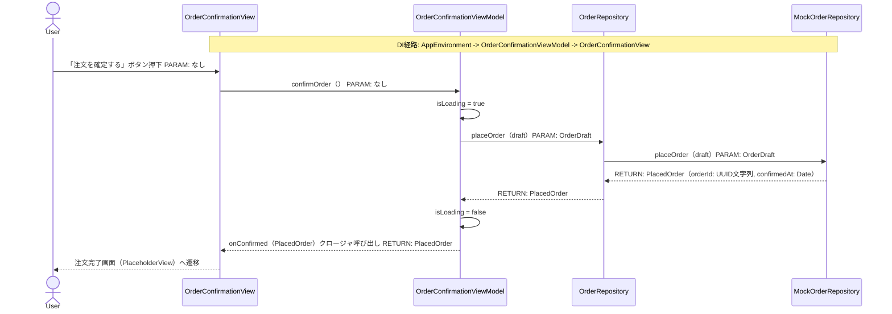
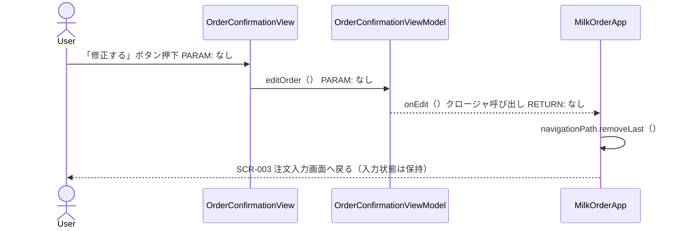
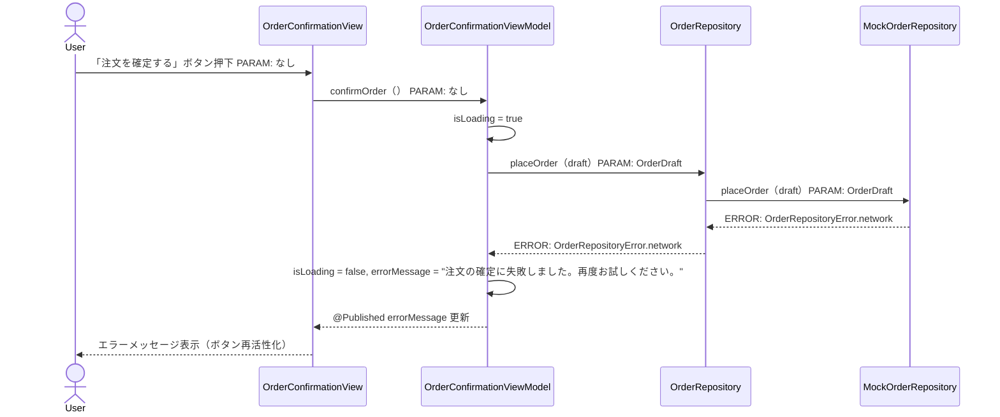
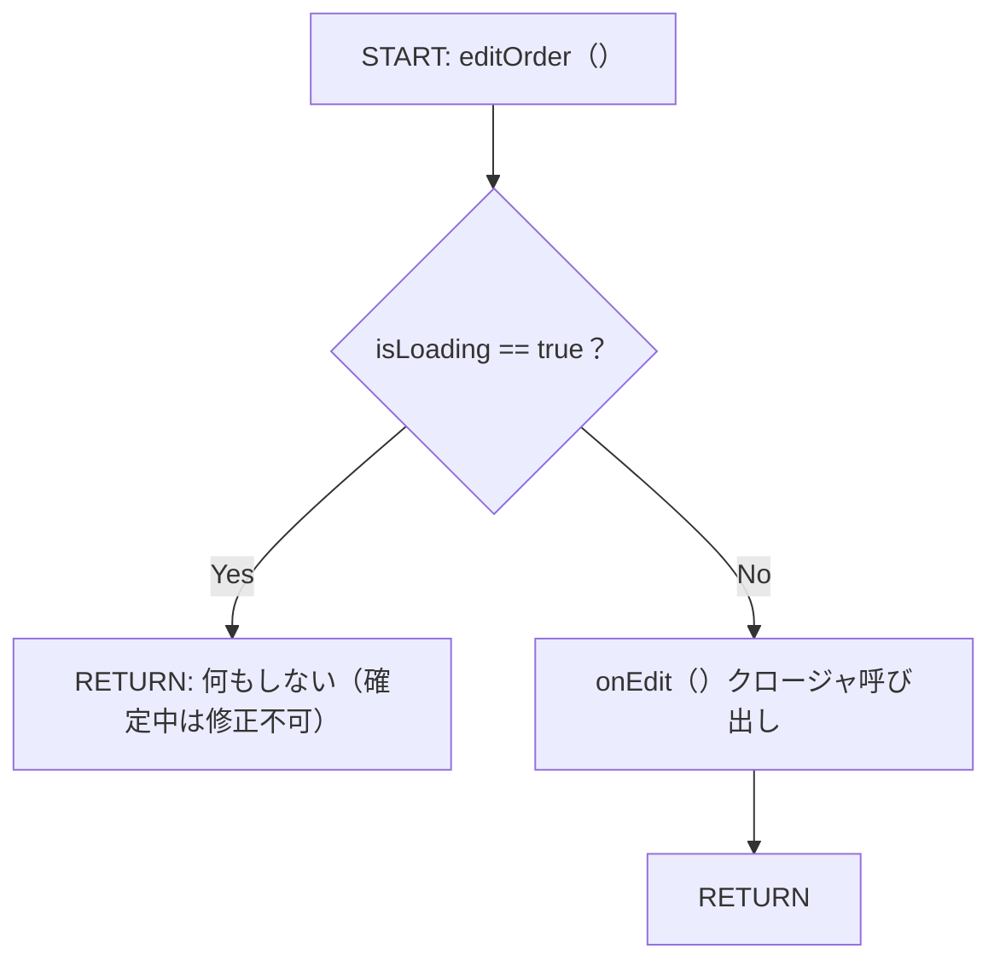
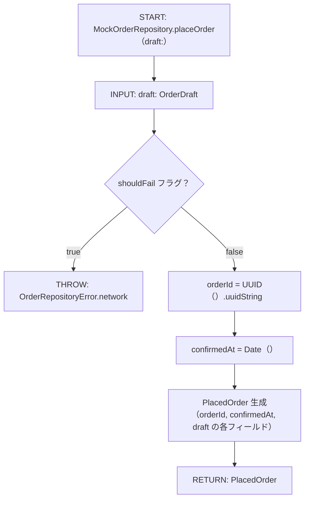
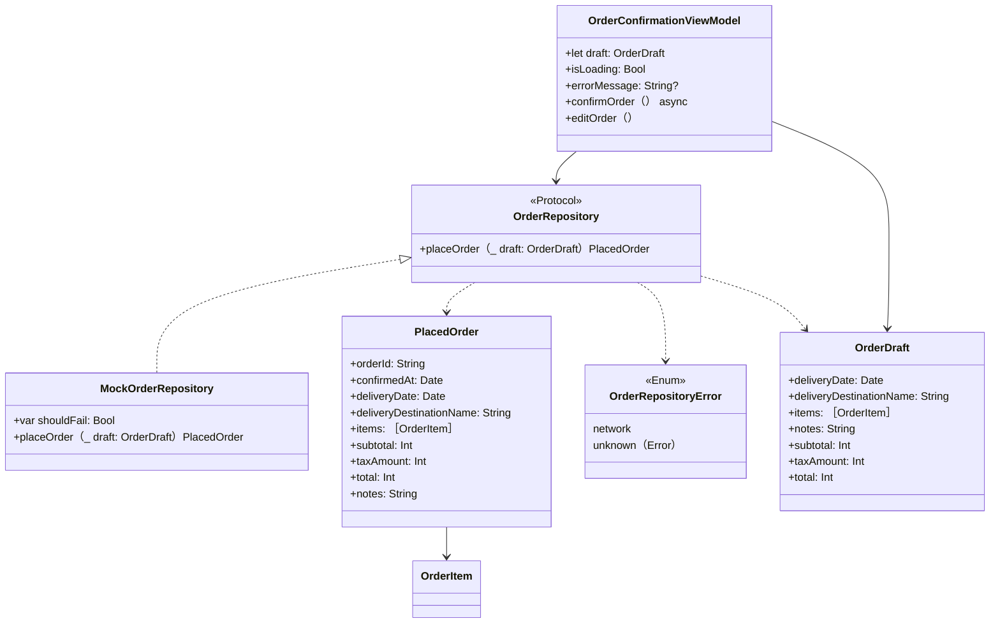

# Implementation Plan — SCR-004 注文確認画面

---

## 0. 実装入力コンテキスト

| 項目                             | 記入                                                                                                                                                                           |
| -------------------------------- | ------------------------------------------------------------------------------------------------------------------------------------------------------------------------------ |
| 対象Issue                        | SCR-004 注文確認画面（初期実装）                                                                                                                                               |
| 対象リポジトリ内パス（実装起点） | `MilkOrder/`                                                                                                                                                                   |
| 前提 plan                        | `scr-001-login.md`（AuthUser / AppEnvironment 実装済み）、`scr-002-menu.md`（MenuDestination 定義済み）、`scr-003-order-input.md`（OrderDraft / Product / OrderItem 定義済み） |

### 0.1 変更サマリ一覧

| 区分 | 対象                                           | 変更概要                                                                     |
| ---- | ---------------------------------------------- | ---------------------------------------------------------------------------- |
| 追加 | PlacedOrder                                    | 注文確定後に返却されるモデル（orderId・confirmedAt・OrderDraft フィールド）  |
| 追加 | OrderRepository（Protocol）                    | 注文確定の抽象インターフェース                                               |
| 追加 | OrderRepositoryError                           | 注文確定エラー型                                                             |
| 追加 | MockOrderRepository                            | 開発用モック（UUID 採番・固定遅延）                                          |
| 追加 | OrderConfirmationViewModel                     | OrderDraft 表示・注文確定・エラーハンドリング                                |
| 追加 | OrderConfirmationView                          | 注文確認画面（配達情報・明細・消費税・総額・確定/修正ボタン）                |
| 修正 | Product / TaxCategory / OrderItem / OrderDraft | Hashable 準拠追加（MenuDestination associated value に必要）                 |
| 修正 | AppEnvironment                                 | `orderRepository: any OrderRepository` を追加                                |
| 修正 | MenuDestination                                | `.orderConfirmation(OrderDraft)` / `.orderComplete(PlacedOrder)` case を追加 |
| 修正 | MilkOrderApp                                   | `.orderConfirmation` / `.orderComplete` destination を接続                   |
| 追加 | OrderConfirmationViewModelTests                | ViewModel のユニットテスト                                                   |

### 0.2 入力制約一覧

| 制約区分 | 制約内容                                                                                                                    | 適用対象                   |
| -------- | --------------------------------------------------------------------------------------------------------------------------- | -------------------------- |
| 禁止事項 | OrderConfirmationView から MockOrderRepository を直接 import しない                                                         | OrderConfirmationView      |
| 禁止事項 | background スレッドから @Published を更新しない                                                                             | OrderConfirmationViewModel |
| 禁止事項 | 「注文を確定する」ボタン押下中に二重送信させない（`isLoading == true` の間 disabled）                                       | OrderConfirmationView      |
| 互換性   | Product / OrderItem / OrderDraft への Hashable 追加は既存 SCR-003 テストに影響しない（struct に合成可）                     | Domain モデル              |
| 互換性   | AppEnvironment への `orderRepository` 追加は既存コード（SCR-001/002/003）の破壊的変更にならないよう Optional 初期値を設ける | AppEnvironment             |
| その他   | 注文確定後は注文完了画面（SCR-005）へ遷移するが、初期版は PlaceholderView で代替                                            | MilkOrderApp               |
| その他   | 配達先名・ユーザー名をログに出力しない                                                                                      | OrderConfirmationViewModel |

### 0.3 関連機能・関連仕様一覧

| 種別             | パス/識別子                                                                                      | この設計での利用目的                                    |
| ---------------- | ------------------------------------------------------------------------------------------------ | ------------------------------------------------------- |
| 要件             | `10-requirements.md` § 4.1 No.7, § 3 (業務フロー 7-8)                                            | 注文確認・確定要件                                      |
| 前提 plan        | `scr-003-order-input.md`                                                                         | OrderDraft / Product / OrderItem / TaxCategory の型定義 |
| 前提 plan        | `scr-002-menu.md`                                                                                | MenuDestination の定義・NavigationStack                 |
| ワイヤーフレーム | `docs/00_要件/画面イメージ_乳製品等受注集計管理アプリ.pptx` スライド「注文確定前後の利用者画面」 | 画面レイアウト（配達情報・明細・ボタン配置）            |
| 設計方針         | `30-coding-standards.md`                                                                         | @MainActor / async/await                                |
| セキュリティ     | `50-security.md`                                                                                 | PII・Secrets の非出力                                   |

---

## 1. 実装対象機能と機能ゴール

| 項目         | 内容                                                                                                                                                                                                                                                                                                                                | 根拠                     |
| ------------ | ----------------------------------------------------------------------------------------------------------------------------------------------------------------------------------------------------------------------------------------------------------------------------------------------------------------------------------- | ------------------------ |
| 実装対象詳細 | SCR-004 注文確認画面（OrderConfirmationView + OrderConfirmationViewModel + 注文確定ドメイン）                                                                                                                                                                                                                                       | `10-requirements.md` § 5 |
| 機能ゴール   | SCR-003 で入力した注文内容（配達日・配達先・商品明細・消費税・総額）を確認し「注文を確定する」で確定、または「修正する」でSCR-003 に戻れる                                                                                                                                                                                          | SCR-004 要件             |
| 非ゴール     | 注文完了画面（SCR-005）の本実装、注文一覧画面（SCR-008）、確定後のメール通知                                                                                                                                                                                                                                                        | 後続スコープ             |
| 完了条件     | ① 配達情報・商品明細・消費税・総額が OrderDraft から正しく表示される ② 「注文を確定する」押下で MockOrderRepository が呼ばれ PlacedOrder が返る ③ 確定中は二重送信防止（ボタン disabled）④ エラー発生時はインラインエラーを表示 ⑤ 「修正する」で SCR-003 に戻れる ⑥ `swiftlint lint --strict` 0 violations ⑦ `xcodebuild test` PASS | —                        |
| 受入確認手順 | `demo@example.com` でログイン → 「新しく注文する」 → 商品選択・配達日設定 → 「確認へ進む」 → 注文確認画面で内容確認 → 「注文を確定する」 → 注文完了画面（Placeholder）へ遷移                                                                                                                                                        | —                        |

---

## 2. 前提・制約（SSOT）

| 種別               | 内容                                                                                                                                                                  | 根拠                            |
| ------------------ | --------------------------------------------------------------------------------------------------------------------------------------------------------------------- | ------------------------------- |
| 参照したSSOT       | `10-requirements.md`, `20-architecture.md`, `30-coding-standards.md`, `50-security.md`                                                                                | CLAUDE.md SSOT参照順            |
| アーキテクチャ前提 | `AppEnvironment -> OrderConfirmationViewModel -> OrderConfirmationView` の DI 経路を確立                                                                              | `20-architecture.md`            |
| iOS バージョン要件 | iOS 18以上                                                                                                                                                            | `60-ci-quality-gates.md`        |
| 技術制約           | async/await で注文確定、@MainActor で UI 更新、Protocol で Repository 抽象化                                                                                          | `30-coding-standards.md`        |
| 未確定前提（TBD）  | バックエンド注文確定 API 仕様（Mock で代替）/ 確定後の注文完了画面（SCR-005）仕様（PlaceholderView で代替）/ 二重確定防止のサーバー側べき等制御（初期版は Mock のみ） | `10-requirements.md` 未確定事項 |

---

## 3. 要件定義（実装受入条件）

### 3.1 機能要件

| ID    | 要件                                                                          | 受入条件（テスト可能な形）                                                                               |
| ----- | ----------------------------------------------------------------------------- | -------------------------------------------------------------------------------------------------------- |
| FR-01 | 配達日を「配達日：YYYY/MM/dd」形式で表示する                                  | `OrderDraft.deliveryDate` を `yyyy/MM/dd` でフォーマットした文字列が表示される                           |
| FR-02 | 配達先名を「配達先：〇〇保育園」形式で表示する                                | `OrderDraft.deliveryDestinationName` が画面に表示される                                                  |
| FR-03 | 注文商品一覧を「商品名 × 数量 ¥小計（税抜）」形式で行表示する                 | `OrderDraft.items` の各 `OrderItem.product.name`, `quantity`, `subtotal` が正しく表示される              |
| FR-04 | 消費税合計を「消費税 ¥xxx」形式で表示する                                     | `OrderDraft.taxAmount` が `¥` 付きフォーマットで表示される                                               |
| FR-05 | 総額（税込）を「総額 ¥xxx」形式で表示する                                     | `OrderDraft.total` が `¥` 付きフォーマットで表示される                                                   |
| FR-06 | 「注文を確定する」ボタン押下で `OrderRepository.placeOrder(draft)` を呼び出す | `confirmOrder()` 実行後 `MockOrderRepository.placeOrderCalled == true`                                   |
| FR-07 | 注文確定中（非同期処理中）はボタンを無効化してインジケーターを表示する        | `isLoading == true` の間 `ProgressView` 表示、ボタン `.disabled(true)`                                   |
| FR-08 | 注文確定成功後に `onConfirmed(PlacedOrder)` クロージャを呼び出す              | `validateConfirm()` 後に `onConfirmed` が 1 回呼ばれ、引数が `PlacedOrder`                               |
| FR-09 | 「修正する」ボタン押下で `onEdit()` クロージャを呼び出す（SCR-003 へ戻る）    | ボタン押下で `onEdit` が 1 回呼ばれる                                                                    |
| FR-10 | 注文確定失敗時にインラインエラーメッセージを表示する                          | `OrderRepositoryError.network` の場合 `errorMessage == "注文の確定に失敗しました。再度お試しください。"` |

### 3.2 非機能要件

| ID     | 要件                                                                                                         | 受入条件（テスト可能な形）                                                     |
| ------ | ------------------------------------------------------------------------------------------------------------ | ------------------------------------------------------------------------------ |
| NFR-01 | 「注文を確定する」ボタンと「修正する」ボタンはスマートフォンでタップしやすいサイズ（最低 44pt 高さ）にする   | `.frame(maxWidth: .infinity)` `.padding(.vertical, 12)` 以上のサイズを確保     |
| NFR-02 | 金額は `¥` 記号付きカンマ区切り整数フォーマットで表示する                                                    | `formattedPrice(Int) -> String` ヘルパーで「¥1,234」形式（SCR-003 と同一形式） |
| NFR-03 | 注文確定ボタンはプライマリスタイル（濃い背景色）、修正するボタンはセカンダリスタイル（薄い背景色）で区別する | ワイヤーフレームのビジュアル仕様に準拠                                         |

---

## 4. スコープ境界

### 4.0 スコープ境界の定義

| 区分         | 対象機能/責務                                                                                   | 判定理由                                        |
| ------------ | ----------------------------------------------------------------------------------------------- | ----------------------------------------------- |
| In-Scope     | OrderConfirmationView の SwiftUI 実装                                                           | SCR-004 画面要件                                |
| In-Scope     | OrderConfirmationViewModel（表示・確定処理・エラーハンドリング）                                | ViewModel 責務                                  |
| In-Scope     | PlacedOrder モデル定義                                                                          | 注文確定後ドメインの基盤                        |
| In-Scope     | OrderRepository Protocol + OrderRepositoryError + MockOrderRepository                           | API 未定のため Mock 必須                        |
| In-Scope     | Product / TaxCategory / OrderItem / OrderDraft への Hashable 準拠追加                           | MenuDestination associated value 対応           |
| In-Scope     | MenuDestination への `.orderConfirmation(OrderDraft)` / `.orderComplete(PlacedOrder)` case 追加 | NavigationStack 型安全遷移                      |
| In-Scope     | AppEnvironment への `orderRepository: any OrderRepository` 追加                                 | DI ルートへの組み込み                           |
| In-Scope     | MilkOrderApp の navigationDestination 接続                                                      | SCR-003 → SCR-004 → SCR-005(Placeholder) の遷移 |
| In-Scope     | OrderConfirmationViewModelTests                                                                 | テスト戦略必須                                  |
| Out-of-Scope | 注文完了画面（SCR-005）の本実装                                                                 | 後続スコープ                                    |
| Out-of-Scope | 確定後のメール/アプリ内通知                                                                     | SCR-013 通知設定マスタ実装時                    |
| Out-of-Scope | 注文内容の修正（SCR-003 の特定フィールドへの戻り遷移）                                          | 初期版は一律 SCR-003 先頭へ戻る                 |

### 4.2 実装時の影響範囲・互換性リスク

| 影響対象        | 結論     | 影響内容                                                                                           |
| --------------- | -------- | -------------------------------------------------------------------------------------------------- |
| UI/画面         | 影響あり | SCR-003 の「確認へ進む」遷移先が PlaceholderView → OrderConfirmationView に変わる                  |
| API/外部通信    | 影響なし | MockOrderRepository のみ使用                                                                       |
| データモデル    | 影響あり | Product / TaxCategory / OrderItem / OrderDraft に Hashable 準拠を追加。PlacedOrder を新規追加      |
| MenuDestination | 影響あり | `.orderConfirmation(OrderDraft)` / `.orderComplete(PlacedOrder)` case 追加。既存 case への影響なし |
| AppEnvironment  | 影響あり | `orderRepository: any OrderRepository` を追加。既存フィールドへの影響なし                          |
| 外部依存（SPM） | 影響なし | 追加パッケージなし                                                                                 |
| CI/運用         | 影響なし | 既存 lint / test 設定で動作                                                                        |

### 4.3 外部依存・Secrets の扱い

| 項目                      | 内容                                             | リスク/対応      |
| ------------------------- | ------------------------------------------------ | ---------------- |
| 外部依存の追加/更新       | なし                                             | —                |
| Secrets 利用有無          | なし                                             | —                |
| ログ/設定への機密混入対策 | 配達先名・ユーザー名・注文明細をログに出力しない | `50-security.md` |

### 4.4 4章の自己検証

| チェック項目                   | 合格条件                          | 判定                                                    |
| ------------------------------ | --------------------------------- | ------------------------------------------------------- |
| Design PR 差分を書いていないか | plans/*.md の変更を記載していない | OK                                                      |
| 実装責務を書いているか         | In-Scope に実装責務が2件以上ある  | OK（9件）                                               |
| 実装影響を書いているか         | 4.2 で影響あり/未確定が1件以上    | OK（UI・データモデル・MenuDestination・AppEnvironment） |

---

## 5. アーキテクチャ設計

### 5.0 依存注入経路（DI）

| 区分   | 提供主体                          | Protocol 名                       | 具象実装名                | 入力                                                       | 出力                         | 境界制約                                                            |
| ------ | --------------------------------- | --------------------------------- | ------------------------- | ---------------------------------------------------------- | ---------------------------- | ------------------------------------------------------------------- |
| 記載例 | `AppEnvironment`                  | `MilkOrderRepository（Protocol）` | `MilkOrderRepositoryImpl` | 設定/環境値                                                | Repository インスタンス      | View から具象を直接 import しない                                   |
| 01     | `AppEnvironment`                  | `OrderRepository（Protocol）`     | `MockOrderRepository`     | —                                                          | OrderRepository インスタンス | OrderConfirmationView から MockOrderRepository を直接 import しない |
| 02     | `OrderConfirmationViewModel.init` | `OrderRepository（Protocol）`     | —                         | orderRepository, orderDraft, onConfirmed, onEdit           | OrderConfirmationViewModel   | ViewModel は MockOrderRepository に依存しない                       |
| 03     | `MilkOrderApp`                    | —                                 | —                         | `onConfirmed: (PlacedOrder) -> Void`, `onEdit: () -> Void` | OrderConfirmationView 生成   | 遷移制御は MilkOrderApp が担う                                      |

#### 5.0.1 最小固定セット（TBD禁止）

| 最小固定項目       | 固定内容                                                                                                                                                    |
| ------------------ | ----------------------------------------------------------------------------------------------------------------------------------------------------------- |
| DI 経路            | `AppEnvironment -> OrderConfirmationViewModel -> OrderConfirmationView`                                                                                     |
| MainActor 境界     | `OrderConfirmationViewModel` クラスに `@MainActor` を付与。`confirmOrder()` は `Task {}` で呼び出し、@Published 更新は MainActor で実行                     |
| Protocol/具象 境界 | `OrderConfirmationView` と `OrderConfirmationViewModel` は `OrderRepository`（Protocol）のみに依存。`MockOrderRepository` は `Infrastructure/Order/` に限定 |

### 5.1 設計判断

#### 5.1.1 責務分離 / データフロー

| No. | 決定事項                                                                                                                                    | 根拠                                                                                 | 未確定 |
| --- | ------------------------------------------------------------------------------------------------------------------------------------------- | ------------------------------------------------------------------------------------ | ------ |
| 1   | `OrderConfirmationViewModel` は `OrderDraft` を init で受け取り、`@Published` フィールドにコピーしない。表示は `draft` プロパティを直接参照 | OrderDraft は immutable struct。View が draft を直接参照すれば @Published 管理が不要 | なし   |
| 2   | 注文確定処理（`confirmOrder()`）は async func として定義し、View から `Task {}` 内で呼び出す                                                | @MainActor クラスの async 非同期メソッドを安全に呼ぶため                             | なし   |
| 3   | 確定成功後の遷移は `onConfirmed(PlacedOrder)` クロージャで MilkOrderApp に委譲                                                              | ViewModel が NavigationStack に依存せず、テストで PlacedOrder の内容を直接検証できる | なし   |
| 4   | 「修正する」は `onEdit()` クロージャで MilkOrderApp に委譲。MilkOrderApp 側で navigationPath の末尾要素を削除して SCR-003 へ戻す            | View はクロージャ呼び出しのみ。ナビゲーション制御は MilkOrderApp に集約              | なし   |
| 5   | 金額フォーマット（`formattedPrice`）は SCR-003 の OrderInputView と同一ロジックを使用。将来的に共通 helper に切り出すが初期版はコピー       | SCR-003 と SCR-004 の間に依存を作らない（初期版のスコープ制御）                      | なし   |

#### 5.1.2 エッジケース / 例外系

| No. | ケース                                                             | 方針                                                                                                         |
| --- | ------------------------------------------------------------------ | ------------------------------------------------------------------------------------------------------------ |
| 1   | `confirmOrder()` 実行中に再度ボタン押下                            | `isLoading == true` の間ボタンを `.disabled(true)` にして二重送信防止                                        |
| 2   | 注文確定失敗（ネットワークエラー）                                 | `errorMessage` = 「注文の確定に失敗しました。再度お試しください。」。ボタン再押下で再試行可能                |
| 3   | 注文確定失敗（未知エラー）                                         | ネットワークエラーと同一文言を表示。stacktrace は UI に渡さない                                              |
| 4   | `confirmOrder()` 成功後に onConfirmed を呼ばずに画面がポップされる | NavigationStack のバック操作で戻った場合は PlacedOrder が生成されない。MilkOrderApp はこの状態を許容         |
| 5   | OrderDraft.items が空（数量 0 の商品のみ）                         | SCR-003 のバリデーションで防ぐ。SCR-004 では items.isEmpty チェックを guard で行い、エラー表示（防御的処理） |

#### 5.1.3 SwiftUI View 部品一覧

| レイヤ    | View/コンポーネント名   | 主責務                                           | 対応機能            |
| --------- | ----------------------- | ------------------------------------------------ | ------------------- |
| Screen    | `OrderConfirmationView` | 注文確認画面全体                                 | SCR-004             |
| Section   | `DeliveryInfoSection`   | 配達日・配達先の表示カード                       | FR-01, FR-02        |
| Section   | `OrderItemsSection`     | 商品明細リスト（商品名×数量¥小計）・消費税・総額 | FR-03, FR-04, FR-05 |
| Component | `OrderItemRowView`      | 明細行（商品名・数量・小計）                     | FR-03               |
| Component | `ConfirmButtonsSection` | 「注文を確定する」「修正する」ボタン             | FR-06〜FR-09        |

#### 5.1.4 ログと観測性

| No. | 観点                  | 方針                                                         |
| --- | --------------------- | ------------------------------------------------------------ |
| 1   | ログ出力内容          | 注文確定失敗時のエラー区分のみ（将来 Logger 層で実装）       |
| 2   | マスキング/非出力項目 | 配達先名・商品明細・金額を一切ログに出力しない               |
| 3   | エラー記録粒度        | `OrderRepositoryError.unknown(Error)` の詳細は UI に渡さない |

### 5.2 トレードオフ

| 判断テーマ                          | 案A                                           | 案B                                                        | 採用案            | 採用理由                                                                                               | 不採用理由                                       |
| ----------------------------------- | --------------------------------------------- | ---------------------------------------------------------- | ----------------- | ------------------------------------------------------------------------------------------------------ | ------------------------------------------------ |
| ViewModel の OrderDraft 保持        | `@Published var draft: OrderDraft`（コピー）  | `let draft: OrderDraft`（init 受け取りのまま参照）         | let（案B）        | OrderDraft は immutable struct。@Published で保持しても再描画トリガーにはならない（itemsの変更はない） | 案A は不必要な @Published を増やすが利点がない   |
| 遷移制御                            | ViewModel が @Published navigationPath を持つ | クロージャ（`onConfirmed`/`onEdit`）で MilkOrderApp に委譲 | クロージャ（案B） | ViewModel が NavigationStack に依存せず、テストで PlacedOrder を直接検証できる                         | 案A は ViewModel が NavigationStack 型に依存する |
| MenuDestination の associated value | OrderDraft を直接保持                         | OrderDraft の ID(String)のみ保持しAppに状態を置く          | 直接保持（案A）   | SwiftUI の NavigationStack は型安全な associated value を推奨。OrderDraft が小さいモデルのため許容     | 案B は state 管理が複雑になる                    |

### 5.3 ナビゲーション方針

| 項目               | 決定内容                                                                                                                                                     | 根拠                                                    |
| ------------------ | ------------------------------------------------------------------------------------------------------------------------------------------------------------ | ------------------------------------------------------- |
| ナビゲーション方式 | SCR-002 の `NavigationStack(path: $menuViewModel.navigationPath)` から `.navigationDestination(for: MenuDestination.self)` で `OrderConfirmationView` を接続 | SCR-002 で定義済みの NavigationStack を継続利用         |
| データ受け渡し     | `MenuDestination.orderConfirmation(OrderDraft)` の associated value で OrderDraft を渡す（OrderDraft: Hashable 準拠が必要）                                  | 型安全な受け渡し。NavigationPath には Hashable 型が必要 |
| 確定後の遷移       | `onConfirmed(PlacedOrder)` クロージャ → MilkOrderApp が `.orderComplete(PlacedOrder)` を navigationPath に append → SCR-005 PlaceholderView                  | 型安全な遷移                                            |
| 修正時の遷移       | `onEdit()` クロージャ → MilkOrderApp が navigationPath の末尾要素（`.orderConfirmation`）を removeLast して SCR-003 に戻る                                   | SCR-003 の状態（入力内容）を保持したまま戻れる          |
| ディープリンク対応 | Out-of-Scope                                                                                                                                                 | 初期版スコープ外                                        |

### 5.4 アーキテクチャレイヤー方針

| レイヤ       | 定義                                                                | 許可する依存方向                | 禁止する依存                                   |
| ------------ | ------------------------------------------------------------------- | ------------------------------- | ---------------------------------------------- |
| View         | SwiftUI 表示のみ                                                    | OrderConfirmationViewModel のみ | Repository/DataSource 具象を直接 import しない |
| ViewModel    | 状態管理・確定処理                                                  | OrderRepository Protocol のみ   | MockOrderRepository 具象を直接 import しない   |
| Repository   | データアクセス抽象（Protocol）                                      | DataSource Protocol             | 具象実装を Protocol ファイルに含めない         |
| DataSource   | Mock（初期版）                                                      | —                               | View/ViewModel を import しない                |
| Model/Entity | PlacedOrder / OrderDraft / OrderItem / Product（Swift struct/enum） | なし                            | 他レイヤに依存しない                           |

### 5.5 データ取得ライフサイクル

| データ種別              | 取得タイミング                 | 取得場所                           | 理由                                                   |
| ----------------------- | ------------------------------ | ---------------------------------- | ------------------------------------------------------ |
| OrderDraft              | init 時                        | OrderConfirmationViewModel.init    | SCR-003 から渡される確定済みデータ。画面表示で取得不要 |
| 注文確定（PlacedOrder） | 「注文を確定する」ボタン押下時 | `confirmOrder()` → OrderRepository | ユーザー明示的操作のため push 型で実行                 |

| キャッシュ方針       | 採用有無 | ルール                            |
| -------------------- | -------- | --------------------------------- |
| インメモリキャッシュ | 不採用   | OrderDraft は確認表示用で変更なし |
| ディスクキャッシュ   | 不採用   | 初期版スコープ外                  |

#### 5.5.1 MainActor/BackgroundActor 境界

| 対象処理                                    | 実行コンテキスト          | 実装場所                                        | 禁止事項                              |
| ------------------------------------------- | ------------------------- | ----------------------------------------------- | ------------------------------------- |
| 注文確定処理（async）                       | background（async/await） | MockOrderRepository.placeOrder()                | Main スレッドをブロックしない         |
| @Published 更新（isLoading / errorMessage） | MainActor                 | OrderConfirmationViewModel（@MainActor クラス） | background スレッドから直接更新しない |
| onConfirmed / onEdit クロージャ呼び出し     | MainActor                 | OrderConfirmationViewModel.confirmOrder()       | 非同期完了後 MainActor で呼ぶ         |

### 5.6 エラーハンドリング標準形

| 分類    | エラー型                              | UI 表示ルール                                                    | 再試行ルール                           |
| ------- | ------------------------------------- | ---------------------------------------------------------------- | -------------------------------------- |
| network | `OrderRepositoryError.network`        | 「注文の確定に失敗しました。再度お試しください。」インライン表示 | 「注文を確定する」ボタン再押下で再試行 |
| unknown | `OrderRepositoryError.unknown(Error)` | ネットワークエラーと同一文言                                     | ボタン再押下で再試行                   |

| ログ方針       | 内容                               |
| -------------- | ---------------------------------- |
| 出力する情報   | エラー区分のみ（将来 Logger 層）   |
| 出力しない情報 | 配達先名・商品名・金額・stacktrace |

#### 5.6.1 エラー変換責務

| 変換対象                        | 例外発生層         | 変換する層 | 上位層へ渡す型                        | 禁止事項                                    |
| ------------------------------- | ------------------ | ---------- | ------------------------------------- | ------------------------------------------- |
| ネットワーク例外（URLError 等） | DataSource（将来） | Repository | `OrderRepositoryError.network`        | View/ViewModel で URLError を直接判定しない |
| 予期せぬ例外                    | DataSource         | Repository | `OrderRepositoryError.unknown(Error)` | stacktrace を UI に渡さない                 |

### 5.7 シーケンス図

#### 5.7.0 DI 経路

| No     | 開始主体         | 終了主体                | Protocol 名                       | 具象実装名                | 経路文字列                                                              | 境界チェック観点                                         | 対応図ID |
| ------ | ---------------- | ----------------------- | --------------------------------- | ------------------------- | ----------------------------------------------------------------------- | -------------------------------------------------------- | -------- |
| 記載例 | `AppEnvironment` | `SomeScreen`            | `MilkOrderRepository（Protocol）` | `MilkOrderRepositoryImpl` | `AppEnvironment -> SomeViewModel -> SomeScreen`                         | 具象が View/ViewModel に漏れていないこと                 | SEQ-01   |
| 01     | `AppEnvironment` | `OrderConfirmationView` | `OrderRepository（Protocol）`     | `MockOrderRepository`     | `AppEnvironment -> OrderConfirmationViewModel -> OrderConfirmationView` | MockOrderRepository が View/ViewModel に漏れていないこと | SEQ-01   |

#### 5.7.1 シーケンス対象一覧

| 図ID   | 種別                 | 起点                         | 終点                                 | 対応要件ID   |
| ------ | -------------------- | ---------------------------- | ------------------------------------ | ------------ |
| SEQ-01 | 正常（注文確定成功） | 「注文を確定する」ボタン押下 | onConfirmed（PlacedOrder）クロージャ | FR-06, FR-08 |
| SEQ-02 | 正常（修正する）     | 「修正する」ボタン押下       | onEdit（）クロージャ                 | FR-09        |
| SEQ-03 | 異常（注文確定失敗） | 「注文を確定する」ボタン押下 | errorMessage 表示                    | FR-10        |

#### 5.7.1.1 境界整合チェック

| 境界テーマ                | 文章セクション | 表セクション | 図セクション | 整合判定 |
| ------------------------- | -------------- | ------------ | ------------ | -------- |
| ログ責務                  | 5.1.4          | 5.6          | 5.7.3        | OK       |
| エラー変換責務            | 5.1.2          | 5.6.1        | 5.7.3        | OK       |
| MainActor/Background 境界 | 5.5.1          | 5.5.1, 8.3   | 5.7.2        | OK       |

#### 5.7.1.2 最小固定セット具体化チェック

| 最小固定項目       | 文章セクション | 表セクション | 図セクション | TBD残存数 |
| ------------------ | -------------- | ------------ | ------------ | --------- |
| DI 経路            | 5.0.1          | 5.0, 5.7.0   | SEQ-01       | 0         |
| MainActor 境界     | 5.5.1          | 5.5.1, 8.3   | SEQ-01       | 0         |
| Protocol/具象 境界 | 5.0.1          | 8.4          | SEQ-01       | 0         |

#### 5.7.2 正常系シーケンス（SEQ-01 — 注文確定成功）



#### 5.7.3 正常系シーケンス（SEQ-02 — 修正する）



#### 5.7.4 異常系シーケンス（SEQ-03 — 注文確定失敗）



### 5.8 処理フロー図

#### 5.8.1 メソッド一覧

| 図ID    | メソッド名                                    | 層         | 対応要件ID                 |
| ------- | --------------------------------------------- | ---------- | -------------------------- |
| FLOW-01 | `OrderConfirmationViewModel.confirmOrder（）` | ViewModel  | FR-06, FR-07, FR-08, FR-10 |
| FLOW-02 | `OrderConfirmationViewModel.editOrder（）`    | ViewModel  | FR-09                      |
| FLOW-03 | `MockOrderRepository.placeOrder（_:）`        | DataSource | FR-06, FR-08               |

#### メソッドフロー（FLOW-01 — confirmOrder）

```mermaid
flowchart TD
  A[START: confirmOrder（）] --> B{isLoading == true？}
  B -->|Yes| Z[RETURN: 何もしない（二重送信防止）]
  B -->|No| C[isLoading = true]
  C --> D{items.isEmpty？}
  D -->|Yes| E[errorMessage = "注文内容が不正です"]
  E --> F[isLoading = false]
  F --> G[RETURN]
  D -->|No| H[orderRepository.placeOrder（draft）を await]
  H --> I{成功？}
  I -->|Yes| J[isLoading = false]
  J --> K[onConfirmed（PlacedOrder）クロージャ呼び出し]
  K --> G
  I -->|No| L{エラー種別}
  L -->|network| M[errorMessage = "注文の確定に失敗しました。再度お試しください。"]
  L -->|unknown| M
  M --> N[isLoading = false]
  N --> G
```

#### メソッドフロー（FLOW-02 — editOrder）



#### メソッドフロー（FLOW-03 — MockOrderRepository.placeOrder）



---

## 6. 契約仕様（Protocol Contract）

### 6.0 Protocol-DI 固定前提

| 項目                    | 固定方針                                                                                           |
| ----------------------- | -------------------------------------------------------------------------------------------------- |
| DI 起点                 | `AppEnvironment` が `orderRepository` を保持し、`OrderConfirmationViewModel` へ注入                |
| Protocol の責務         | `OrderRepository` はメソッド署名のみ定義。具象実装を含めない                                       |
| 具象実装の配置          | `MockOrderRepository` は `MilkOrder/Infrastructure/Order/` に限定                                  |
| View / ViewModel の責務 | `OrderConfirmationView` と `OrderConfirmationViewModel` は `OrderRepository`（Protocol）のみに依存 |

### 6.1 入出力契約

| ID     | 入口                                          | 入力                    | 出力                                        | エラー                                   |
| ------ | --------------------------------------------- | ----------------------- | ------------------------------------------- | ---------------------------------------- |
| IFC-01 | `OrderRepository.placeOrder（_:）`            | `OrderDraft`            | `PlacedOrder`                               | `OrderRepositoryError`                   |
| IFC-02 | `OrderConfirmationViewModel.confirmOrder（）` | なし（self.draft 参照） | なし（クロージャ経由で PlacedOrder を渡す） | なし（エラーは @Published errorMessage） |
| IFC-03 | `OrderConfirmationViewModel.editOrder（）`    | なし                    | なし（onEdit クロージャ呼び出し）           | なし                                     |

### 6.2 型/モデル/スキーマ

| ID      | 対象                   | 変更内容                                                                       | 後方互換                               |
| ------- | ---------------------- | ------------------------------------------------------------------------------ | -------------------------------------- |
| TYPE-01 | `PlacedOrder`          | 追加（新規）                                                                   | 該当なし                               |
| TYPE-02 | `OrderRepositoryError` | 追加（新規）                                                                   | 該当なし                               |
| TYPE-03 | `Product`              | Hashable 準拠を追加                                                            | 後方互換（struct への合成は追加のみ）  |
| TYPE-04 | `TaxCategory`          | Hashable 準拠を追加                                                            | 後方互換（enum は自動合成可）          |
| TYPE-05 | `OrderItem`            | Hashable 準拠を追加                                                            | 後方互換（struct への合成は追加のみ）  |
| TYPE-06 | `OrderDraft`           | Hashable 準拠を追加                                                            | 後方互換（struct への合成は追加のみ）  |
| TYPE-07 | `MenuDestination`      | `.orderConfirmation（OrderDraft）` / `.orderComplete（PlacedOrder）` case 追加 | 後方互換（既存 case への影響なし）     |
| TYPE-08 | `AppEnvironment`       | `orderRepository: any OrderRepository` 追加                                    | 後方互換（既存フィールドへの影響なし） |

### 6.3 Protocol インターフェース定義

#### 6.3.1 Repository Protocol 一覧

| No. | Protocol 名       | メソッド署名（Swift 形式）                                         | 配置ファイル候補                               |
| --- | ----------------- | ------------------------------------------------------------------ | ---------------------------------------------- |
| 1   | `OrderRepository` | `func placeOrder(_ draft: OrderDraft) async throws -> PlacedOrder` | `MilkOrder/Domain/Order/OrderRepository.swift` |

#### 6.3.2 ドメインモデルクラス図



#### 6.3.3 ドメイン別モデル定義

##### 6.3.3.1 モデル一覧

| ドメイン | 型名                   | 区分   | 用途                                     |
| -------- | ---------------------- | ------ | ---------------------------------------- |
| Order    | `PlacedOrder`          | struct | 注文確定後に返却される完了済み注文モデル |
| Order    | `OrderRepositoryError` | enum   | 注文確定エラー型                         |

##### 6.3.3.2 プロパティ詳細定義

| ドメイン | 型名        | プロパティ名            | Swift 型    | 必須 | Optional | 説明                                       |
| -------- | ----------- | ----------------------- | ----------- | ---- | -------- | ------------------------------------------ |
| Order    | PlacedOrder | orderId                 | String      | Y    | N        | サーバー採番の注文ID（Mock は UUID文字列） |
| Order    | PlacedOrder | confirmedAt             | Date        | Y    | N        | 注文確定日時                               |
| Order    | PlacedOrder | deliveryDate            | Date        | Y    | N        | 配達日（OrderDraft から）                  |
| Order    | PlacedOrder | deliveryDestinationID   | String      | Y    | N        | 配達先ID（OrderDraft から）                |
| Order    | PlacedOrder | deliveryDestinationName | String      | Y    | N        | 配達先名（OrderDraft から）                |
| Order    | PlacedOrder | items                   | [OrderItem] | Y    | N        | 注文明細（OrderDraft から）                |
| Order    | PlacedOrder | subtotal                | Int         | Y    | N        | 税抜合計（OrderDraft から）                |
| Order    | PlacedOrder | taxAmount               | Int         | Y    | N        | 税額合計（OrderDraft から）                |
| Order    | PlacedOrder | total                   | Int         | Y    | N        | 税込合計（OrderDraft から）                |
| Order    | PlacedOrder | notes                   | String      | Y    | N        | 備考（OrderDraft から）                    |

##### 6.3.3.3 列挙型/リテラル制約

| No. | 型名                   | case 一覧                   | 用途               |
| --- | ---------------------- | --------------------------- | ------------------ |
| 1   | `OrderRepositoryError` | `network`, `unknown(Error)` | 注文確定エラー分岐 |

---

## 7. データ設計

| 項目                 | 内容                        | 互換性/移行 |
| -------------------- | --------------------------- | ----------- |
| スキーマ変更         | なし（in-memory Mock のみ） | —           |
| マイグレーション方針 | 該当なし                    | —           |
| 既存データ影響       | なし                        | —           |
| ロールバック方針     | 該当なし                    | —           |

---

## 8. 実装指示（製造 Agent 向け）

### 8.1 変更予定ファイル一覧

| No. | パス                                                                              | 区分       | 変更タイプ | 実装内容                                                                                                          | 完了条件                        |
| --- | --------------------------------------------------------------------------------- | ---------- | ---------- | ----------------------------------------------------------------------------------------------------------------- | ------------------------------- |
| 1   | `MilkOrder/Domain/Order/PlacedOrder.swift`                                        | Model      | 追加       | `PlacedOrder` struct（全フィールド定義）                                                                          | コンパイル通過                  |
| 2   | `MilkOrder/Domain/Order/OrderRepository.swift`                                    | Repository | 追加       | `OrderRepository` Protocol + `OrderRepositoryError` enum                                                          | コンパイル通過                  |
| 3   | `MilkOrder/Infrastructure/Order/MockOrderRepository.swift`                        | DataSource | 追加       | `MockOrderRepository`（`shouldFail` フラグ付き）                                                                  | コンパイル通過                  |
| 4   | `MilkOrder/Domain/Order/Product.swift`                                            | Model      | 変更       | `Product: Hashable`, `TaxCategory: Hashable` 準拠追加                                                             | コンパイル通過・既存テスト PASS |
| 5   | `MilkOrder/Domain/Order/OrderItem.swift`                                          | Model      | 変更       | `OrderItem: Hashable` 準拠追加                                                                                    | コンパイル通過・既存テスト PASS |
| 6   | `MilkOrder/Domain/Order/OrderDraft.swift`                                         | Model      | 変更       | `OrderDraft: Hashable` 準拠追加                                                                                   | コンパイル通過・既存テスト PASS |
| 7   | `MilkOrder/Features/Menu/MenuDestination.swift`                                   | Other      | 変更       | `.orderConfirmation（OrderDraft）` / `.orderComplete（PlacedOrder）` case 追加（PlacedOrder: Hashable 要）        | コンパイル通過                  |
| 8   | `MilkOrder/App/AppEnvironment.swift`                                              | Other      | 変更       | `orderRepository: any OrderRepository` を追加                                                                     | コンパイル通過・既存テスト PASS |
| 9   | `MilkOrder/Features/OrderConfirmation/OrderConfirmationViewModel.swift`           | ViewModel  | 追加       | `@MainActor OrderConfirmationViewModel`（confirmOrder / editOrder 実装）                                          | コンパイル通過                  |
| 10  | `MilkOrder/Features/OrderConfirmation/OrderConfirmationView.swift`                | View       | 追加       | `OrderConfirmationView`（DeliveryInfoSection / OrderItemsSection / ConfirmButtonsSection）                        | シミュレーター表示確認          |
| 11  | `MilkOrder/MilkOrderApp.swift`                                                    | Other      | 変更       | `.orderConfirmation` / `.orderComplete` の `.navigationDestination` 接続。`onConfirmed` / `onEdit` クロージャ実装 | ナビゲーション動作確認          |
| 12  | `MilkOrderTests/Features/OrderConfirmation/OrderConfirmationViewModelTests.swift` | Test       | 追加       | FR-01〜FR-10 の Unit テスト                                                                                       | `xcodebuild test` PASS          |

### 8.2 実装手順（順序付き）

| 手順 | 作業内容                                             | 対象ファイル                                     | 完了条件                                                                                                                  |
| ---- | ---------------------------------------------------- | ------------------------------------------------ | ------------------------------------------------------------------------------------------------------------------------- |
| 1    | Domain モデルに Hashable 準拠を追加                  | Product.swift, OrderItem.swift, OrderDraft.swift | コンパイル通過・既存テスト PASS                                                                                           |
| 2    | PlacedOrder モデルと OrderRepository Protocol を実装 | PlacedOrder.swift, OrderRepository.swift         | コンパイル通過                                                                                                            |
| 3    | MockOrderRepository を実装                           | MockOrderRepository.swift                        | コンパイル通過                                                                                                            |
| 4    | MenuDestination に新 case を追加                     | MenuDestination.swift                            | コンパイル通過（PlacedOrder: Hashable 要）                                                                                |
| 5    | AppEnvironment に orderRepository を追加             | AppEnvironment.swift                             | コンパイル通過・既存テスト PASS                                                                                           |
| 6    | OrderConfirmationViewModel を実装                    | OrderConfirmationViewModel.swift                 | コンパイル通過                                                                                                            |
| 7    | OrderConfirmationView を実装                         | OrderConfirmationView.swift                      | シミュレーター表示確認                                                                                                    |
| 8    | MilkOrderApp の navigationDestination に接続         | MilkOrderApp.swift                               | SCR-003「確認へ進む」→ SCR-004 遷移確認、「修正する」→ SCR-003 戻り確認、「注文を確定する」→ SCR-005 Placeholder 遷移確認 |
| 9    | テストを実装・実行                                   | OrderConfirmationViewModelTests.swift            | `xcodebuild test` PASS                                                                                                    |
| 10   | Lint を実行                                          | 全 Swift ファイル                                | `swiftlint lint --strict` 0 violations                                                                                    |
| 11   | xcodeproj に全新規ファイルを追加                     | MilkOrder.xcodeproj                              | ビルド対象に含まれる                                                                                                      |

### 8.3 実装禁止事項（ガードレール）

| 項目       | 内容                                                                     | 根拠                    |
| ---------- | ------------------------------------------------------------------------ | ----------------------- |
| 禁止事項-1 | OrderConfirmationView から MockOrderRepository を直接 import しない      | レイヤ境界（5.4）       |
| 禁止事項-2 | background スレッドから @Published を更新しない                          | MainActor 境界（5.5.1） |
| 禁止事項-3 | `isLoading == true` 中に `confirmOrder()` を再実行しない（二重送信防止） | FR-07, 5.1.2 No.1       |
| 禁止事項-4 | 配達先名・商品明細・金額をログに出力しない                               | `50-security.md`        |
| 禁止事項-5 | `OrderRepositoryError.unknown(Error)` の stacktrace を UI に渡さない     | `50-security.md`, 5.6.1 |

### 8.4 モジュール/アクセス制御方針

| 項目                   | 設定内容                                                                                                                                             | 検証方法         |
| ---------------------- | ---------------------------------------------------------------------------------------------------------------------------------------------------- | ---------------- |
| アクセス制御方針       | `OrderConfirmationViewModel` の `onConfirmed` / `onEdit` クロージャは `private`. `confirmOrder()` / `editOrder()` は `internal`（View から呼ぶため） | Swift コンパイラ |
| Protocol 依存強制      | `OrderConfirmationView` と `OrderConfirmationViewModel` は `any OrderRepository` のみ参照                                                            | コードレビュー   |
| `PlacedOrder` の可視性 | `internal`（SCR-005 完了画面からも参照するため）                                                                                                     | —                |

---

## 9. テスト実装計画

### 9.1 テストケース

| 区分 | パターン名                               | 対象                          | シナリオ                                               | 期待結果                                                                             |
| ---- | ---------------------------------------- | ----------------------------- | ------------------------------------------------------ | ------------------------------------------------------------------------------------ |
| 正常 | 注文確定成功                             | confirmOrder()                | MockOrderRepository が PlacedOrder を返す              | onConfirmed が 1 回呼ばれ、PlacedOrder.orderId が非空、isLoading == false            |
| 正常 | 配達日表示フォーマット                   | draft.deliveryDate            | `Date(2026, 5, 10)` をセット                           | 「2026/05/10」形式の文字列が formattedDeliveryDate から得られる                      |
| 正常 | 修正する                                 | editOrder()                   | 通常状態でボタン押下                                   | onEdit が 1 回呼ばれる                                                               |
| 正常 | 注文明細の表示                           | draft.items                   | 3 商品が入った OrderDraft を init に渡す               | items.count == 3, 各 item.product.name / quantity / subtotal が参照できる            |
| 正常 | 消費税・総額の表示                       | draft.taxAmount / draft.total | OrderDraft（taxAmount=312, total=4212）をセット        | taxAmount == 312, total == 4212 が ViewModel から参照できる                          |
| 例外 | 注文確定失敗（ネットワーク）             | confirmOrder()                | MockOrderRepository.shouldFail = true                  | errorMessage == "注文の確定に失敗しました。再度お試しください。", isLoading == false |
| 例外 | 確定中に再実行                           | confirmOrder()                | isLoading == true の状態で confirmOrder() を再呼び出し | orderRepository.placeOrder() が 1 回しか呼ばれない（二重送信なし）                   |
| 例外 | items 空の OrderDraft                    | confirmOrder()                | items.isEmpty == true の OrderDraft                    | errorMessage が非 nil、onConfirmed は呼ばれない                                      |
| 境界 | 確定中に editOrder 実行                  | editOrder()                   | isLoading == true 中に editOrder() 呼び出し            | onEdit が呼ばれない（確定中は修正不可）                                              |
| 回帰 | AppEnvironment への orderRepository 追加 | AppEnvironment 初期化         | 既存の authRepository / productRepository も同時に保持 | SCR-001〜003 テスト PASS                                                             |

| 網羅チェック               | 判定 | 根拠                                                            |
| -------------------------- | ---- | --------------------------------------------------------------- |
| 正常パターンを網羅している | Y    | 注文確定・表示・修正をカバー                                    |
| 例外パターンを網羅している | Y    | FR-10（確定失敗）・二重送信・空 items をカバー                  |
| 境界パターンを網羅している | Y    | 確定中の editOrder 実行をカバー                                 |
| 回帰パターンを網羅している | Y    | AppEnvironment 変更が SCR-001〜003 テストに影響しないことを確認 |

---

## 10. オープン課題 / ADR

| 論点                                   | 現状                                                       | 決定期限/担当        | ADR要否              |
| -------------------------------------- | ---------------------------------------------------------- | -------------------- | -------------------- |
| バックエンド注文確定 API 仕様          | MockOrderRepository で仮実装                               | API 設計フェーズ     | 要（API 確定後）     |
| 注文確定後の重複送信防止（べき等制御） | 初期版は Mock のため未実装。`isLoading` による UI 制御のみ | API 設計フェーズ     | 要（API 確定後）     |
| 注文完了画面（SCR-005）仕様            | PlaceholderView で代替                                     | SCR-005 設計フェーズ | 不要（後続スコープ） |

### 10.1 TBD 回収トラッキング

| TBD論点                  | 記載箇所          | 解決ゲート                 | BLOCKER | RESOLVE_IN              | DEFAULT/ASSUMPTION               |
| ------------------------ | ----------------- | -------------------------- | ------- | ----------------------- | -------------------------------- |
| バックエンド注文確定 API | 0.2, 8.1 No.3     | OrderRepositoryImpl 実装前 | No      | API 設計フェーズ        | MockOrderRepository で代替       |
| べき等制御               | 5.1.2 No.1, FR-07 | API 設計フェーズ           | No      | バックエンド API 確定後 | isLoading によるフロント制御のみ |

---

## 11. 新規画面追加（SCR-004 適用）

### ファイル配置規約

| レイヤ                   | パス規約                                                                          |
| ------------------------ | --------------------------------------------------------------------------------- |
| Domain（Model/Protocol） | `MilkOrder/Domain/Order/*.swift`                                                  |
| DataSource（Mock）       | `MilkOrder/Infrastructure/Order/Mock*.swift`                                      |
| ViewModel                | `MilkOrder/Features/OrderConfirmation/OrderConfirmationViewModel.swift`           |
| View（Screen）           | `MilkOrder/Features/OrderConfirmation/OrderConfirmationView.swift`                |
| テスト                   | `MilkOrderTests/Features/OrderConfirmation/OrderConfirmationViewModelTests.swift` |
