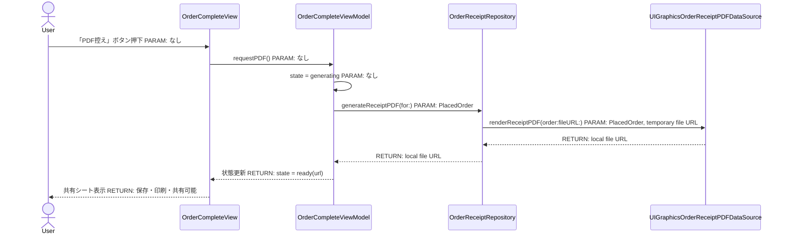
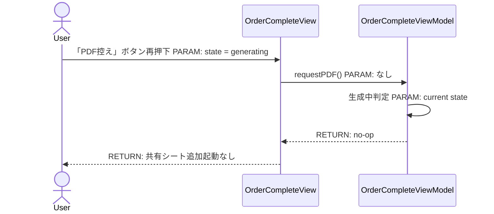
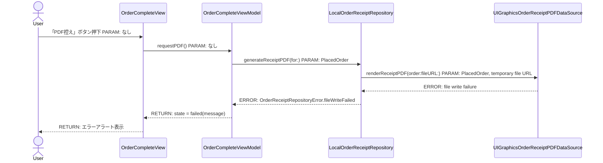
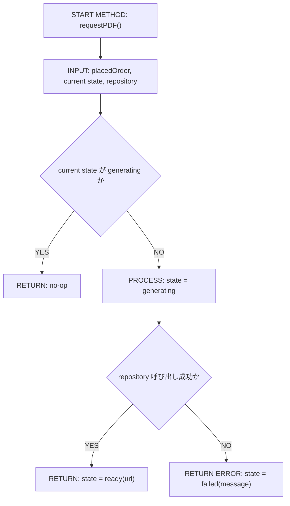
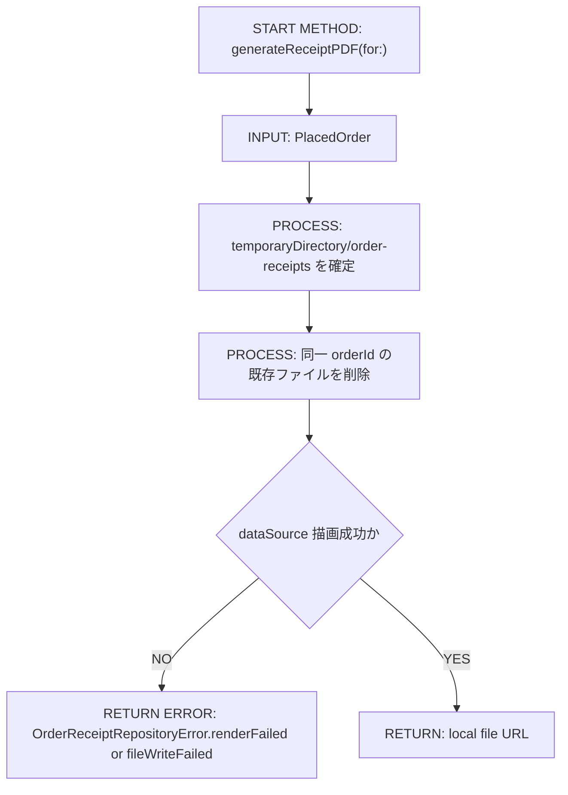
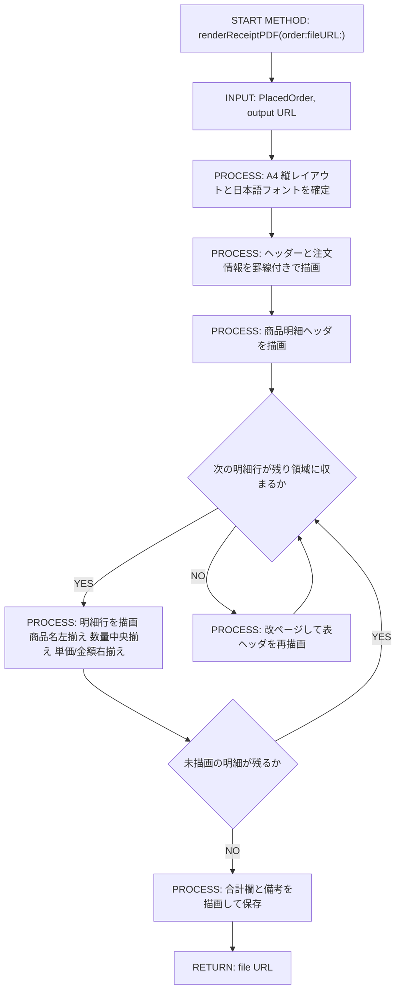
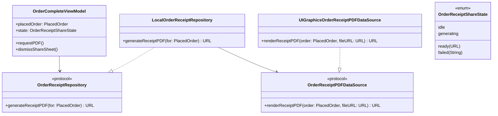

# Implementation Plan — SCR-005 注文完了画面 PDF控え生成

---

## 0. 実装入力コンテキスト

| 項目                             | 記入                                                                                                     |
| -------------------------------- | -------------------------------------------------------------------------------------------------------- |
| 対象Issue                        | SCR-005 注文完了画面 PDF控え生成（UIGraphicsPDFRenderer）                                                |
| 対象リポジトリ内パス（実装起点） | `MilkOrder/`                                                                                             |
| 前提 plan                        | `.github/copilot/plans/scr-004-order-confirmation.md`, `.github/copilot/plans/scr-005-order-complete.md` |

運用補足: 既存 `.github/copilot/plans/scr-005-order-complete.md` の FR-06 / SEQ-03 / FLOW-02 / 10.1「PDF 実装方式」の暫定結論は、本 plan の内容で置き換える。

### 0.1 変更サマリ一覧

| 区分      | 対象                                              | 変更概要                                                                                    |
| --------- | ------------------------------------------------- | ------------------------------------------------------------------------------------------- |
| 追加      | `OrderReceiptRepository`                          | 注文控え PDF 生成の副作用を抽象化する Protocol と Error 定義を追加する                      |
| 追加      | `LocalOrderReceiptRepository`                     | ローカル一時ファイルへ PDF を生成する Repository 具象実装を追加する                         |
| 追加      | `UIGraphicsOrderReceiptPDFDataSource`             | `UIGraphicsPDFRenderer` を用いて PDF 描画と一時ファイル書き出しを行う DataSource を追加する |
| 追加      | `OrderReceiptShareSheet`                          | `UIActivityViewController` を SwiftUI から起動する共有シートラッパーを追加する              |
| 修正      | `AppEnvironment`                                  | `orderReceiptRepository: any OrderReceiptRepository` を追加し、preview 経路にも注入する     |
| 修正      | `OrderCompleteViewModel`                          | `requestPDF()` を PDF 生成処理へ差し替え、未実装アラート状態を生成状態管理へ置き換える      |
| 修正      | `OrderCompleteView`                               | 「準備中」アラートを共有シート起動と失敗アラートへ置き換える                                |
| 追加      | `MockOrderReceiptRepository`                      | ViewModel Unit テスト用モックを追加する                                                     |
| 追加/修正 | `OrderCompleteViewModelTests` / Repository テスト | FR-06 回帰を本実装向けへ更新し、PDF バイト列検証テストを追加する                            |

### 0.2 入力制約一覧

| 制約区分 | 制約内容                                                                                                                                                                                                                                     | 適用対象                                      |
| -------- | -------------------------------------------------------------------------------------------------------------------------------------------------------------------------------------------------------------------------------------------- | --------------------------------------------- |
| 互換性   | `PlacedOrder` は既存定義を再利用し、型・プロパティは変更しない                                                                                                                                                                               | Domain/Order                                  |
| 禁止事項 | View / ViewModel は `UIGraphicsPDFRenderer` を直接 import しない                                                                                                                                                                             | `OrderCompleteView`, `OrderCompleteViewModel` |
| 禁止事項 | 共有シート起動前に PDF を永続領域へ保存しない                                                                                                                                                                                                | Repository / DataSource                       |
| 禁止事項 | 配達先名・金額・備考をログへ出力しない                                                                                                                                                                                                       | 全レイヤ                                      |
| 帳票要件 | PDF は A4 縦レイアウト前提とし、ヘッダー・注文情報・商品明細・合計金額を罫線で視覚的に区切る                                                                                                                                                 | PDF レイアウト                                |
| 帳票要件 | 商品明細は表形式で商品名・数量・単価・金額を配置し、数量は中央揃え、単価/金額は右揃えとする                                                                                                                                                  | PDF レイアウト                                |
| 帳票要件 | 日本語フォントは **Hiragino Sans** を固定使用し、見出し・タイトルは `UIFont(name: "HiraginoSans-W6", size: ...)` 、本文・明細は `UIFont(name: "HiraginoSans-W3", size: ...)` を使う。`UIFont.systemFont(...)` や Dynamic Type には依存しない | PDF レイアウト                                |
| その他   | Preview は `AppEnvironment.preview()` を起点とし、Firebase 接続なしで動作させる                                                                                                                                                              | Preview / Demo                                |
| その他   | ロゴ画像アセット未整備は BLOCKER 化せず、初期版は会社名文字列のみで要件を部分充足する                                                                                                                                                        | PDF レイアウト                                |

### 0.3 関連機能・関連仕様一覧

| 種別         | パス/識別子                                                     | この設計での利用目的                                             |
| ------------ | --------------------------------------------------------------- | ---------------------------------------------------------------- |
| 要件         | `.github/copilot/10-requirements.md` §4.1 No.12, §7             | PDF 出力要件の根拠                                               |
| 設計方針     | `.github/copilot/20-architecture.md`                            | `AppEnvironment` を DI root とする方針の根拠                     |
| 設計方針     | `.github/copilot/30-coding-standards.md`                        | 副作用の Protocol 抽象化とレイヤ分離の根拠                       |
| テスト方針   | `.github/copilot/40-testing-strategy.md`                        | XCTest と Mock 分離の根拠                                        |
| セキュリティ | `.github/copilot/50-security.md`                                | 一時ファイル運用・非ログ出力方針の根拠                           |
| CI           | `.github/copilot/60-ci-quality-gates.md`                        | build / lint / test / security 計画の根拠                        |
| ADR          | `.github/copilot/70-adr/ADR-002-firebase-backend.md`            | 将来 `OutputRepository` 系統へ統合可能にする命名・境界設計の根拠 |
| 前提 plan    | `.github/copilot/plans/scr-004-order-confirmation.md`           | `PlacedOrder` の入力データ契約の根拠                             |
| 前提 plan    | `.github/copilot/plans/scr-005-order-complete.md`               | 既存 FR-06 / SEQ-03 / FLOW-02 / TBD の置換元                     |
| 調査         | `.github/issues/design/scr-010-output.md`                       | SCR-010 の集計表 PDF と責務分離する根拠                          |
| 既存実装     | `MilkOrder/Features/OrderComplete/OrderCompleteViewModel.swift` | `requestPDF()` プレースホルダーの置換対象                        |

---

## 1. 実装対象機能と機能ゴール

| 項目         | 内容                                                                                                                                                                                                                                                                                                                                                                                         | 根拠                         |
| ------------ | -------------------------------------------------------------------------------------------------------------------------------------------------------------------------------------------------------------------------------------------------------------------------------------------------------------------------------------------------------------------------------------------- | ---------------------------- |
| 実装対象詳細 | SCR-005 注文完了画面における注文者本人向け単票 PDF 控え生成・共有導線                                                                                                                                                                                                                                                                                                                        | Issue 本文 §1, §3            |
| 機能ゴール   | 注文入力者が「PDF控え」ボタン押下後、注文内容を含む PDF をローカル生成し、そのまま OS 共有シートで保存・印刷・共有できる                                                                                                                                                                                                                                                                     | `10-requirements.md` §7      |
| 非ゴール     | サーバーサイド PDF 生成、Firebase Storage 保存・配信、SCR-010 の集計表 PDF、メール送信、専用印刷 UI、注文番号本番採番ルール                                                                                                                                                                                                                                                                  | Issue 本文 §3                |
| 完了条件     | ① `requestPDF()` が Repository 経由で PDF を生成する ② 生成成功時に共有シートが 1 回だけ開く ③ 生成失敗時に再試行可能なエラー UI が表示される ④ `PlacedOrder` の必要項目が PDF に含まれる ⑤ DI 経路が `AppEnvironment -> OrderCompleteViewModel -> OrderCompleteView` に固定される ⑥ `#Preview` が Firebase なしで動作する ⑦ build / lint / test / security の実行計画が実装 PR に明記される | Issue 本文 §5, §7, §8        |
| 受入確認手順 | シミュレータで注文完了画面を開く → 「PDF控え」を押す → 共有シート表示と PDF 内容確認 → 失敗モック時はエラーアラート確認                                                                                                                                                                                                                                                                      | FR-01〜FR-06, NFR-01〜NFR-04 |

---

## 2. 前提・制約（SSOT）

| 種別                                            | 内容                                                                                                                                                                                                                                                                  | 根拠（ファイル/ADR/Issue）                                 |
| ----------------------------------------------- | --------------------------------------------------------------------------------------------------------------------------------------------------------------------------------------------------------------------------------------------------------------------- | ---------------------------------------------------------- |
| 参照したSSOT                                    | `00-index.md`, `copilot-instructions.md`, `.github/instructions/*.instructions.md`, `10-requirements.md`, `20-architecture.md`, `30-coding-standards.md`, `40-testing-strategy.md`, `50-security.md`, `60-ci-quality-gates.md`, `80-templates/implementation-plan.md` | Issue 本文 §2.1                                            |
| アーキテクチャ前提（View/ViewModel/Repository） | View は表示と共有シート起動のみ、ViewModel は状態管理、Repository は PDF 生成副作用の抽象、DataSource は `UIGraphicsPDFRenderer` とファイル I/O を担当する                                                                                                            | Issue 本文 §4.1                                            |
| iOS バージョン要件                              | iOS 18+ 前提のため SwiftUI と `UIActivityViewController` ラッパーを併用可能                                                                                                                                                                                           | `swift.instructions.md`, Issue 本文 §6.2                   |
| 技術制約（互換性/期限/運用/セキュリティ）       | 会社名・ロゴのうちロゴは未整備、Preview は `AppEnvironment.preview()` 必須、一時ファイルは無期限保持しない                                                                                                                                                            | Issue 本文 §2.3, `swift.instructions.md`, `50-security.md` |
| 未確定前提（TBD）                               | TBD（ロゴ画像アセット未整備のため初期版は会社名文字列のみを表示し、ロゴ追加はアセット整備後に対応する / 決定条件: `Assets.xcassets` に正式ロゴ追加 / 期限: SCR-010 実装着手前）                                                                                       | Issue 本文 §6.2                                            |

---

## 3. 要件定義（実装受入条件）

### 3.1 機能要件

| ID    | 要件                                                                                       | 受入条件（テスト可能な形）                                                                                 |
| ----- | ------------------------------------------------------------------------------------------ | ---------------------------------------------------------------------------------------------------------- |
| FR-01 | 「PDF控え」ボタン押下で注文控え PDF 生成処理を開始する                                     | `OrderCompleteViewModel.requestPDF()` が `OrderReceiptRepository.generateReceiptPDF(for:)` を 1 回だけ呼ぶ |
| FR-02 | PDF 生成成功時に共有可能な一時ファイル URL を View へ渡す                                  | ViewModel 状態が `.ready(url)` になり、View が共有シートを表示する                                         |
| FR-03 | PDF には注文番号、確定日時、配達日、配達先名、明細、備考、小計、税額、総額、会社名を含める | 生成 PDF のテキスト抽出またはパースで該当文字列が確認できる                                                |
| FR-04 | 生成失敗時はユーザーが再試行可能なエラー UI を表示する                                     | ViewModel 状態が `.failed(message)` となり、View がアラートを表示する                                      |
| FR-05 | 生成中の連打では二重生成・二重共有シート起動を起こさない                                   | `requestPDF()` を連続呼び出ししても Repository 呼び出し回数と共有シート表示回数は 1 回のまま               |
| FR-06 | SCR-005 既存プレースホルダーを本実装へ置換し、既存 TBD「PDF実装方式」を解消する            | `showPDFUnavailableAlert` と「PDF出力機能は準備中です。」依存が削除され、本 plan を正とする                |
| FR-07 | PDF は一般的な日本の業務帳票として読みやすい A4 縦レイアウトで描画する                     | ヘッダー・注文情報・商品明細・合計金額が視覚的に区切られ、罫線でセクション境界を認識できる                 |
| FR-08 | 商品明細は表形式で列整列を固定する                                                         | 商品名・数量・単価・金額の列幅が固定され、数量は中央揃え、単価/金額は右揃えで描画される                    |
| FR-09 | 明細が複数ページにまたがる場合は自動改ページし、各ページで表ヘッダを再表示する             | 多数商品注文で生成した PDF が複数ページとしてパースでき、2 ページ目以降でも表ヘッダ文言を確認できる        |

### 3.2 非機能要件

| ID     | 要件                                                                                                                                                                                       | 受入条件（テスト可能な形）                                                                                                         |
| ------ | ------------------------------------------------------------------------------------------------------------------------------------------------------------------------------------------ | ---------------------------------------------------------------------------------------------------------------------------------- |
| NFR-01 | PDF 生成は UI をブロックせず、完了結果のみ MainActor で状態反映する                                                                                                                        | ViewModel は `@MainActor` を維持し、Repository / DataSource は async 経由で実行される                                              |
| NFR-02 | PDF は永続領域ではなく一時領域に保存し、再生成時に stale ファイルを残し続けない                                                                                                            | `FileManager.default.temporaryDirectory` 配下の専用サブディレクトリを使用し、既存同名ファイルを削除して上書きする                  |
| NFR-03 | Preview / Demo は Firebase なしで PDF 生成導線を確認できる                                                                                                                                 | `AppEnvironment.preview()` で `orderReceiptRepository` が注入され、`#Preview` から画面起動できる                                   |
| NFR-04 | 既存の必須品質ゲートを維持する                                                                                                                                                             | 実装 PR で `xcodebuild build`, `swiftlint lint --strict`, `xcodebuild test`, `swift package audit` または N/A 判定手順が実行される |
| NFR-05 | 日本語が文字化けせず、日本の一般的な日付・金額表記を用いる。フォントは `HiraginoSans-W6`（見出し）/ `HiraginoSans-W3`（本文）を固定使用し、`UIFont.systemFont` / Dynamic Type に依存しない | 日本語を含む PDF が Hiragino Sans で表示され、日付は `yyyy/MM/dd` 系、金額は `¥` + 3 桁区切りで確認できる                          |

---

## 4. スコープ境界

### 4.0 スコープ境界の定義（機能単位）

| 区分         | 対象機能/責務                                     | 判定理由                                              |
| ------------ | ------------------------------------------------- | ----------------------------------------------------- |
| In-Scope     | SCR-005 画面から起動する個人向け注文控え PDF 生成 | Issue 本文の主目的                                    |
| In-Scope     | `OrderReceiptRepository` とローカル具象実装の追加 | ViewModel から `UIGraphicsPDFRenderer` を隔離するため |
| In-Scope     | 共有シートによる保存・印刷・他アプリ共有          | Issue 本文 §5 ゴール 5                                |
| In-Scope     | PDF 生成状態管理（生成中/成功/失敗）と連打防止    | Issue 本文 §6.2, §8                                   |
| In-Scope     | Unit テスト（ViewModel / Repository 具象）        | Issue 本文 §8                                         |
| Out-of-Scope | Firebase Storage 保存・共有 URL 配信              | 将来フェーズ、ADR-002 の Storage 責務                 |
| Out-of-Scope | SCR-010 運用側の集計表 PDF                        | 画面責務が異なるため                                  |
| Out-of-Scope | メール送信、AirPrint 専用 UI                      | 非ゴールで明示                                        |
| Out-of-Scope | `PlacedOrder` モデルの拡張や注文番号ルール変更    | 前提契約固定のため                                    |

### 4.2 実装時の影響範囲・互換性リスク

| 影響対象        | 結論（影響あり/なし/未確定） | 影響内容                                                                                         |
| --------------- | ---------------------------- | ------------------------------------------------------------------------------------------------ |
| UI/画面         | 影響あり                     | 注文完了画面の「PDF控え」導線がアラートから共有シート起動へ変わる                                |
| API/外部通信    | 影響なし                     | ローカル生成のみで外部通信は増えない                                                             |
| データモデル    | 影響なし                     | `PlacedOrder` は既存のまま使用する                                                               |
| 外部依存（SPM） | 影響なし                     | 新規ライブラリ追加は行わない。`UIGraphicsPDFRenderer` / `PDFKit` は Apple 標準フレームワークのみ |
| CI/運用         | 影響あり                     | `swift package audit` は `Package.swift` 不在時に N/A 補足が必要                                 |

### 4.3 外部依存・Secrets の扱い

| 項目                       | 内容                                                                  | リスク/対応              |
| -------------------------- | --------------------------------------------------------------------- | ------------------------ |
| 外部依存の追加/更新（SPM） | なし                                                                  | 依存脆弱性の増加を避ける |
| Secrets 利用有無           | なし                                                                  | Firebase / API キー不要  |
| ログ/設定への機密混入対策  | PDF 生成成功/失敗は状態のみ扱い、配達先名・備考・金額はログへ出さない | `50-security.md` に準拠  |

### 4.4 4章の自己検証（必須）

| チェック項目                   | 合格条件                                                                  |
| ------------------------------ | ------------------------------------------------------------------------- |
| Design PR 差分を書いていないか | 実装対象責務のみを書いており、今回の design 変更作業自体は書いていない    |
| 実装責務を書いているか         | In-Scope が 2 件以上あり、画面・Repository・DataSource が具体化されている |
| 実装影響を書いているか         | 4.2 に `影響あり` が 1 件以上あり、UI と CI 影響を明記している            |

---

## 5. アーキテクチャ設計

### 5.0 依存注入経路（DI）

本プロジェクトは Protocol ベースの依存注入を採用する。既存 SCR-005 plan の「AppEnvironment 経由の Repository 注入は不要」という決定は、本機能追加により更新する。

| 区分   | 提供主体                      | Protocol 名                       | 具象実装名                    | 入力（型/値）                                                         | 出力（型/値）                | 境界制約（禁止事項を含む）                                     |
| ------ | ----------------------------- | --------------------------------- | ----------------------------- | --------------------------------------------------------------------- | ---------------------------- | -------------------------------------------------------------- |
| 記載例 | `AppEnvironment`              | `MilkOrderRepository（Protocol）` | `MilkOrderRepositoryImpl`     | 設定/環境値                                                           | Repository インスタンス      | View から具象を直接 import しない                              |
| 01     | `AppEnvironment`              | `OrderReceiptRepository`          | `LocalOrderReceiptRepository` | `OrderReceiptPDFDataSource`, `FileManager.default.temporaryDirectory` | `any OrderReceiptRepository` | View / ViewModel へ `LocalOrderReceiptRepository` を漏らさない |
| 02     | `OrderCompleteViewModel.init` | `OrderReceiptRepository`          | `LocalOrderReceiptRepository` | `placedOrder`, `onViewHistory`, `orderReceiptRepository`              | `OrderCompleteViewModel`     | ViewModel は Protocol のみに依存する                           |
| 03     | `OrderCompleteView`           | `OrderCompleteViewModel`          | なし                          | `OrderCompleteViewModel`                                              | 画面表示と共有シート起動     | View は Repository / DataSource を import しない               |

#### 5.0.1 最小固定セット（TBD禁止）

| 最小固定項目       | 必須記載内容                                                                                                                                                             | 対応セクション          |
| ------------------ | ------------------------------------------------------------------------------------------------------------------------------------------------------------------------ | ----------------------- |
| DI 経路            | `AppEnvironment -> OrderCompleteViewModel -> OrderCompleteView`                                                                                                          | `5.0`, `5.7.0`, `5.7.2` |
| MainActor 境界     | `OrderCompleteViewModel` は `@MainActor`、PDF 描画とファイル書き出しは Repository / DataSource 側で実行し、完了結果のみ MainActor に戻す                                 | `5.5.1`, `8.3`          |
| Protocol/具象 境界 | `OrderCompleteViewModel` は `OrderReceiptRepository` のみに依存し、`LocalOrderReceiptRepository` と `UIGraphicsOrderReceiptPDFDataSource` は Infrastructure に閉じ込める | `6.0`, `8.4`            |

### 5.1 設計判断

#### 5.1.1 責務分離 / データフロー（詳細）

| No. | 決定事項（実装責務単位）                                                                                                   | 根拠                                                                                                       | 未確定（あれば）                                                                                      |
| --- | -------------------------------------------------------------------------------------------------------------------------- | ---------------------------------------------------------------------------------------------------------- | ----------------------------------------------------------------------------------------------------- |
| 1   | 命名は既存規約に合わせて `OrderReceiptRepository` を採用し、`Generator` 層は新設しない                                     | 既存が副作用全般を `Repository` で抽象化しているため                                                       | なし                                                                                                  |
| 2   | 生成結果の戻り値は `URL` を採用する                                                                                        | 共有シートはファイル URL と親和性が高く、将来サーバー実装でもダウンロード後にローカル URL へ正規化しやすい | なし                                                                                                  |
| 3   | `LocalOrderReceiptRepository` は一時ファイル URL の確定とエラー変換を担当し、描画は `OrderReceiptPDFDataSource` へ委譲する | Repository と DataSource の責務分離を明確にするため                                                        | なし                                                                                                  |
| 4   | `OrderCompleteViewModel` は `OrderReceiptShareState` で `idle / generating / ready / failed` を管理する                    | `showPDFUnavailableAlert` より拡張性が高く、連打防止とエラー表示を 1 箇所に集約できるため                  | なし                                                                                                  |
| 5   | ユーザー提示は `UIActivityViewController` ラッパーを採用する                                                               | 非同期生成完了後に即座に共有シートを出すには `ShareLink` より制御しやすいため                              | なし                                                                                                  |
| 6   | 会社名は固定文字列 `MilkOrder` を描画し、ロゴは Open Issue とする                                                          | アセット未整備でも BLOCKER 化せず前進できるため                                                            | TBD（ロゴ画像アセット未整備のため初期版は文字列のみ / 決定条件: アセット追加 / 期限: SCR-010 実装前） |
| 7   | 明細が A4 1 ページを超える場合は追加ページを自動生成し、表ヘッダを各ページで再描画する                                     | 情報欠落や極端な縮小を避けるため                                                                           | なし                                                                                                  |
| 8   | 帳票は一般的な日本企業の注文書に近い可読性優先レイアウトとし、余白・フォントサイズ・列幅・行間は実装者が合理的に決めてよい | issue で細かな値は実装者判断可と明示されたため                                                             | なし                                                                                                  |

#### 5.1.1.1 帳票レイアウト固定事項

| No. | レイアウト項目  | 固定方針                                                                                                                                                                                      | 理由                                                                                     |
| --- | --------------- | --------------------------------------------------------------------------------------------------------------------------------------------------------------------------------------------- | ---------------------------------------------------------------------------------------- |
| 1   | 用紙サイズ/向き | A4 縦固定                                                                                                                                                                                     | 日本の業務帳票として最も一般的で、保存・印刷時の互換性が高い                             |
| 2   | セクション構成  | 上から順にヘッダー、注文情報、商品明細、合計金額、備考を配置し、各セクションを罫線で区切る                                                                                                    | 視線移動を単純化し、帳票としての判読性を優先する                                         |
| 3   | 商品明細列      | 商品名、数量、単価、金額の 4 列を固定し、ヘッダ行と本文行で同じ列幅を使う                                                                                                                     | ページをまたいでも読み位置を維持するため                                                 |
| 4   | 列揃え          | 商品名は左揃え、数量は中央揃え、単価/金額は右揃え                                                                                                                                             | 日本の帳票慣習と数値比較のしやすさを優先する                                             |
| 5   | 改ページ        | 明細行が残り描画領域を超える直前で改ページし、新ページ先頭に表ヘッダを再描画する                                                                                                              | 情報欠落や列意味の見失いを防ぐため                                                       |
| 6   | フォント        | 見出し・タイトルは `UIFont(name: "HiraginoSans-W6", size: ...)` 、本文・明細は `UIFont(name: "HiraginoSans-W3", size: ...)` を使用する。`UIFont.systemFont(...)` と Dynamic Type は使用しない | PDF 帳票として再現性のあるレイアウトを維持し、端末・実装者による見た目の差異を抑えるため |
| 7   | 表記            | 日付は日本の一般的な短い年月日表記、金額は円記号付き 3 桁区切りを採用する                                                                                                                     | 業務帳票として違和感のない表示に揃えるため                                               |
| 8   | 微調整裁量      | 余白、フォントサイズ、列幅、行間は実装時に合理的な値を採用してよい                                                                                                                            | issue で実装者判断が許可されているため                                                   |

#### 5.1.2 エッジケース / 例外系 / リトライ方針（詳細）

| No. | ケース                         | 方針（戻り値/表示/再試行）                                                                              | 根拠                                     | 未確定（あれば） |
| --- | ------------------------------ | ------------------------------------------------------------------------------------------------------- | ---------------------------------------- | ---------------- |
| 1   | 「PDF控え」ボタン連打          | `state == .generating` の間は `requestPDF()` を no-op とし、ボタンも disabled にする                    | 二重生成・二重共有シートを防ぐため       | なし             |
| 2   | 一時ファイル作成や書き込み失敗 | `OrderReceiptRepositoryError.fileWriteFailed` として ViewModel に返し、エラーアラートで再試行を案内する | ディスク容量不足などの復旧余地があるため | なし             |
| 3   | PDF 描画中に予期しない例外     | `OrderReceiptRepositoryError.renderFailed` または `.unknown` へ変換し、汎用失敗メッセージを表示する     | 低レイヤ例外を UI へ漏らさないため       | なし             |
| 4   | 配達先名や備考が長い           | テキストは複数行折り返し、明細テーブルより上位の情報は枠外へはみ出さないよう縦方向に伸長する            | PDF 可読性を維持するため                 | なし             |
| 5   | 明細件数が多い                 | 2 ページ目以降へ継続し、最終ページに小計/税額/総額/備考を配置する                                       | 1 ページ固定で情報欠落させないため       | なし             |

#### 5.1.3 SwiftUI View 部品一覧

| レイヤ    | View/コンポーネント名（設計上の候補） | 主責務                                       | 対応機能     |
| --------- | ------------------------------------- | -------------------------------------------- | ------------ |
| Screen    | `OrderCompleteView`                   | 画面全体表示、共有シートと失敗アラートの起動 | FR-01〜FR-06 |
| Section   | `ActionButtonsSection`                | 「履歴を見る」「PDF控え」ボタン表示          | FR-01, FR-05 |
| Component | `OrderReceiptShareSheet`              | `UIActivityViewController` ラッパー          | FR-02        |
| Atom      | `ProgressView`                        | 生成中の視覚フィードバック                   | NFR-01       |
| Atom      | `Alert`                               | 生成失敗メッセージ表示                       | FR-04        |

#### 5.1.4 ログと観測性（漏洩防止を含む / 詳細）

| No. | 観点                   | 方針                                                                                         | 根拠                          | 未確定（あれば） |
| --- | ---------------------- | -------------------------------------------------------------------------------------------- | ----------------------------- | ---------------- |
| 1   | ログ出力内容           | 実装初期版では PDF 内容や URL をログ出力しない                                               | `50-security.md`              | なし             |
| 2   | マスキング/非出力項目  | 注文番号・配達先名・備考・金額・一時ファイル URL をログに残さない                            | `50-security.md`              | なし             |
| 3   | エラー記録粒度         | UI にはユーザー向け文言のみ返し、低レイヤの元例外は Repository 内で握らず Error 型へ変換する | 例外の層分離                  | なし             |
| 4   | 帳票デザイン判断の記録 | 余白やフォントサイズなどの実装者裁量値はログではなく実装差分とレビューで確認する             | 帳票内容に PII を含みうるため | なし             |

### 5.2 トレードオフ

| 判断テーマ         | 案A                     | 案B                                 | 採用案 | 採用理由                                                                       | 不採用理由                                             |
| ------------------ | ----------------------- | ----------------------------------- | ------ | ------------------------------------------------------------------------------ | ------------------------------------------------------ |
| PDF 生成抽象の命名 | `OrderReceiptGenerator` | `OrderReceiptRepository`            | 案B    | 既存の Repository 命名と整合し、DI ルートへ自然に載せられる                    | 案A はこのリポジトリ固有の新命名となり一貫性を崩す     |
| 生成結果の戻り値   | `Data`                  | `URL`                               | 案B    | 共有シートが扱いやすく、将来のサーバー実装でもローカルファイル化して統一できる | 案A は共有前に再度ファイル化が必要                     |
| ユーザー提示方式   | `ShareLink`             | `UIActivityViewController` ラッパー | 案B    | 非同期完了直後に自動表示でき、既存ボタン UX を崩さない                         | 案A は事前生成済みアイテム前提で二段階 UI になりやすい |

### 5.3 ナビゲーション方針

| 項目                                                    | 決定内容                                                                                                                     | 根拠                             |
| ------------------------------------------------------- | ---------------------------------------------------------------------------------------------------------------------------- | -------------------------------- |
| ナビゲーション方式（NavigationStack / TabView / Sheet） | 画面遷移は既存 `NavigationStack` を維持し、共有導線のみ `sheet` を追加する                                                   | 既存 SCR-005 構成                |
| 画面遷移の責務（誰が遷移を制御するか）                  | 画面遷移は引き続き `MilkOrderApp` / `MenuDestination` が制御し、共有シート表示のみ `OrderCompleteView` が制御する            | 画面遷移と共有 UI を分離するため |
| ディープリンク対応                                      | Out-of-Scope                                                                                                                 | Issue 本文の非ゴール             |
| 遷移時のデータ受け渡し方式                              | `PlacedOrder` は既存 `MenuDestination.orderComplete(PlacedOrder)` を継続使用し、PDF 生成依存は ViewModel init で追加注入する | 既存遷移契約を壊さないため       |

### 5.4 アーキテクチャレイヤー方針

| レイヤ       | 定義                                                     | 許可する依存方向         | 禁止する依存                                        |
| ------------ | -------------------------------------------------------- | ------------------------ | --------------------------------------------------- |
| View         | SwiftUI 表示と共有シート起動                             | ViewModel のみ           | Repository/DataSource を直接 import しない          |
| ViewModel    | 状態管理・UI ロジック                                    | Repository Protocol のみ | `UIGraphicsPDFRenderer` や `FileManager` の直接操作 |
| Repository   | PDF 生成の抽象とエラー変換                               | DataSource Protocol      | View/ViewModel 依存、描画具象の埋め込み             |
| DataSource   | `UIGraphicsPDFRenderer` による描画・一時ファイル書き出し | Apple 標準フレームワーク | View/ViewModel import                               |
| Model/Entity | `PlacedOrder` と新設 Error / State                       | なし                     | 他レイヤへの依存                                    |

### 5.5 データ取得ライフサイクル

| データ種別           | 取得タイミング          | 取得場所                              | 理由                                       |
| -------------------- | ----------------------- | ------------------------------------- | ------------------------------------------ |
| 初期表示必須データ   | ViewModel init 時       | `OrderCompleteViewModel`              | `PlacedOrder` は既に確定済みで追加取得不要 |
| ユーザー操作後データ | 「PDF控え」ボタン押下時 | `OrderCompleteViewModel` → Repository | 副作用は明示的なユーザー操作時のみ実行する |
| バックグラウンド更新 | なし                    | なし                                  | 自動再生成は不要                           |

| キャッシュ方針       | 採用有無 | ルール                                                                                          |
| -------------------- | -------- | ----------------------------------------------------------------------------------------------- |
| インメモリキャッシュ | 不採用   | 共有シート表示用 URL は状態で一時保持し、dismiss 後は解放する                                   |
| ディスクキャッシュ   | 限定採用 | `temporaryDirectory/order-receipts/` のみを使い、同一注文 ID の既存ファイルを削除して再生成する |

#### 5.5.1 MainActor/BackgroundActor 境界

| 対象処理         | 実行コンテキスト（MainActor/background） | 実装場所                                   | 禁止事項                                  |
| ---------------- | ---------------------------------------- | ------------------------------------------ | ----------------------------------------- |
| UI 更新          | MainActor                                | `OrderCompleteViewModel`                   | background から `@Published` を更新しない |
| PDF 生成要求開始 | MainActor                                | `OrderCompleteViewModel.requestPDF()`      | View から Repository を直接叩かない       |
| PDF 描画         | background（async/await）                | `UIGraphicsOrderReceiptPDFDataSource`      | Main スレッドを長時間占有しない           |
| ファイル書き出し | background（async/await）                | `LocalOrderReceiptRepository` / DataSource | 永続領域へ保存しない                      |

### 5.6 エラーハンドリング標準形

| 分類         | エラー型                                                                   | UI 表示ルール                                                                         | 再試行ルール           |
| ------------ | -------------------------------------------------------------------------- | ------------------------------------------------------------------------------------- | ---------------------- |
| network      | 該当なし                                                                   | 該当なし                                                                              | 該当なし               |
| unauthorized | 該当なし                                                                   | 該当なし                                                                              | 該当なし               |
| notfound     | 該当なし                                                                   | 該当なし                                                                              | 該当なし               |
| validation   | 多重実行（ViewModel 内部）                                                 | 表示変更なし、処理を無視                                                              | ボタン有効化後に再押下 |
| unknown      | `OrderReceiptRepositoryError.renderFailed`, `.fileWriteFailed`, `.unknown` | 「PDFの生成に失敗しました。端末の空き容量を確認して、もう一度お試しください。」を表示 | ユーザー再押下で再試行 |

| ログ方針                      | 内容                                             |
| ----------------------------- | ------------------------------------------------ |
| 出力する情報                  | なし、または将来 Logger 導入時もエラー種別のみ   |
| 出力しない情報（Secrets/PII） | 注文番号、配達先名、備考、金額、一時ファイル URL |

#### 5.6.1 エラー変換責務（例外 → ドメインエラー）

| 変換対象          | 例外発生層              | ドメインエラーへ変換する層    | 上位層へ渡す型                                | 禁止事項                                         |
| ----------------- | ----------------------- | ----------------------------- | --------------------------------------------- | ------------------------------------------------ |
| 描画失敗          | DataSource              | `LocalOrderReceiptRepository` | `OrderReceiptRepositoryError.renderFailed`    | View/ViewModel で UIKit 例外を直接判定しない     |
| ファイル I/O 失敗 | DataSource / Repository | `LocalOrderReceiptRepository` | `OrderReceiptRepositoryError.fileWriteFailed` | `FileManager` 例外文字列を UI へそのまま出さない |
| 多重実行          | ViewModel               | ViewModel                     | なし（state guard で no-op）                  | Repository を無駄に呼ばない                      |
| 予期せぬ例外      | 任意層                  | `LocalOrderReceiptRepository` | `OrderReceiptRepositoryError.unknown`         | stacktrace や機微情報を UI へ渡さない            |

### 5.7 シーケンス図（Mermaid / 複数必須）

| 必須項目   | 記載ルール                                                                 |
| ---------- | -------------------------------------------------------------------------- |
| DI 経路    | `AppEnvironment -> OrderCompleteViewModel -> OrderCompleteView` を明記する |
| 正常系     | PDF 生成成功から共有シート表示までを記載する                               |
| 異常系     | 多重実行と描画失敗の 2 系統を記載する                                      |
| パラメータ | 各呼び出しに `PARAM` を付与する                                            |
| 戻り値     | 各応答に `RETURN` を付与する                                               |
| エラー返却 | 異常系で `ERROR` を明記する                                                |

#### 5.7.0 DI 経路（テキスト再掲 / 必須）

| No     | 開始主体                      | 終了主体                              | Protocol 名                       | 具象実装名                            | 経路文字列（`A -> B -> C`）                                          | 境界チェック観点                             | 対応シーケンス図ID |
| ------ | ----------------------------- | ------------------------------------- | --------------------------------- | ------------------------------------- | -------------------------------------------------------------------- | -------------------------------------------- | ------------------ |
| 記載例 | `AppEnvironment`              | `SomeScreen`                          | `MilkOrderRepository（Protocol）` | `MilkOrderRepositoryImpl`             | `AppEnvironment -> SomeViewModel -> SomeScreen`                      | 具象が View/ViewModel に漏れていないこと     | SEQ-01             |
| 01     | `AppEnvironment`              | `OrderCompleteView`                   | `OrderReceiptRepository`          | `LocalOrderReceiptRepository`         | `AppEnvironment -> OrderCompleteViewModel -> OrderCompleteView`      | ViewModel が Protocol のみに依存していること | SEQ-01             |
| 02     | `LocalOrderReceiptRepository` | `UIGraphicsOrderReceiptPDFDataSource` | `OrderReceiptPDFDataSource`       | `UIGraphicsOrderReceiptPDFDataSource` | `LocalOrderReceiptRepository -> UIGraphicsOrderReceiptPDFDataSource` | 描画具象が Infrastructure 内に閉じること     | SEQ-01             |

#### 5.7.1 シーケンス対象一覧

| 図ID   | 種別（正常/異常） | 起点（画面/操作）         | 終点（Repository/外部I/O）    | 対応要件ID（FR/NFR） |
| ------ | ----------------- | ------------------------- | ----------------------------- | -------------------- |
| SEQ-01 | 正常              | 「PDF控え」ボタン押下     | 共有シート表示                | FR-01〜FR-03         |
| SEQ-02 | 異常              | 生成中の「PDF控え」再押下 | no-op で終了                  | FR-05                |
| SEQ-03 | 異常              | 「PDF控え」ボタン押下     | 描画/書き込み失敗アラート表示 | FR-04                |

#### 5.7.1.1 境界整合チェック（必須）

| 境界テーマ                     | 文章セクション | 表セクション | 図セクション     | 整合判定（OK/NG） |
| ------------------------------ | -------------- | ------------ | ---------------- | ----------------- |
| ログ責務（どの層で出力するか） | `5.1.4`        | `5.6`        | `5.7.3`, `5.7.4` | OK                |
| エラー変換責務                 | `5.1.2`        | `5.6.1`      | `5.7.4`          | OK                |
| MainActor/Background 境界      | `5.5.1`        | `8.3`        | `5.7.2`          | OK                |

#### 5.7.1.2 最小固定セット具体化チェック（必須）

| 最小固定項目                                     | 文章セクション | 表セクション | 図セクション     | TBD残存数（0のみ可） |
| ------------------------------------------------ | -------------- | ------------ | ---------------- | -------------------- |
| DI 経路（`AppEnvironment -> ViewModel -> View`） | `5.0.1`        | `5.0`        | `5.7.0`, `5.7.2` | 0                    |
| MainActor 境界（UI 更新箇所）                    | `5.5.1`        | `5.5.1`      | `5.7.2`          | 0                    |
| Protocol/具象 境界                               | `5.0.1`        | `6.0`, `8.4` | `5.7.2`          | 0                    |

#### 5.7.2 正常系シーケンス（必須）

#### 5.7.3 異常系シーケンス（業務エラー）

#### 5.7.4 異常系シーケンス（システムエラー）

### 5.8 処理フロー図（メソッドレベル / 複数必須）

| 必須項目       | 記載ルール                                   |
| -------------- | -------------------------------------------- |
| 対象メソッド数 | 3 メソッド以上を具体名で記載する             |
| 分岐           | 正常/異常分岐を明記する                      |
| 入出力         | 入力/出力を明記する                          |
| 例外処理       | 失敗時の状態遷移またはエラー伝播先を明記する |

#### 5.8.1 メソッド一覧

| 図ID    | メソッド名                                                             | 層（View/ViewModel/Repository/DataSource） | 対応要件ID（FR/NFR）               |
| ------- | ---------------------------------------------------------------------- | ------------------------------------------ | ---------------------------------- |
| FLOW-01 | `OrderCompleteViewModel.requestPDF()`                                  | ViewModel                                  | FR-01, FR-04, FR-05                |
| FLOW-02 | `LocalOrderReceiptRepository.generateReceiptPDF(for:)`                 | Repository                                 | FR-02, NFR-02                      |
| FLOW-03 | `UIGraphicsOrderReceiptPDFDataSource.renderReceiptPDF(order:fileURL:)` | DataSource                                 | FR-03, FR-07, FR-08, FR-09, NFR-05 |

#### メソッドフロー（FLOW-01）

#### メソッドフロー（FLOW-02）

#### メソッドフロー（FLOW-03）

---

## 6. 契約仕様（Protocol Contract）

### 6.0 Protocol-DI 固定前提

| 項目                    | 固定方針                                                                                                               |
| ----------------------- | ---------------------------------------------------------------------------------------------------------------------- |
| DI 起点                 | `AppEnvironment` のみで依存解決する                                                                                    |
| Protocol の責務         | `OrderReceiptRepository` は PDF 控え生成の入口だけを定義し、具象描画ロジックを含めない                                 |
| 具象実装の配置          | `LocalOrderReceiptRepository` と `UIGraphicsOrderReceiptPDFDataSource` は `MilkOrder/Infrastructure/Order/` に配置する |
| View / ViewModel の責務 | View / ViewModel は Protocol と状態のみを扱い、`UIGraphicsPDFRenderer` と `FileManager` を直接扱わない                 |

### 6.1 入出力契約（API/関数/UseCase）

| ID     | 入口（画面/操作/関数）                                       | 入力                 | 出力                                                        | エラー                        | 備考                                      |
| ------ | ------------------------------------------------------------ | -------------------- | ----------------------------------------------------------- | ----------------------------- | ----------------------------------------- |
| IFC-01 | `OrderCompleteViewModel.requestPDF()`                        | なし                 | `OrderReceiptShareState.ready(URL)` または `failed(String)` | なし（内部で failed に変換）  | View は state 変化だけを監視する          |
| IFC-02 | `OrderReceiptRepository.generateReceiptPDF(for:)`            | `PlacedOrder`        | `URL`                                                       | `OrderReceiptRepositoryError` | 共有可能なローカル一時ファイル URL を返す |
| IFC-03 | `OrderReceiptPDFDataSource.renderReceiptPDF(order:fileURL:)` | `PlacedOrder`, `URL` | `URL`                                                       | 下位例外                      | Repository がエラー変換する               |

### 6.2 型/モデル/スキーマ

| ID      | 対象                          | 変更内容（追加/変更/削除） | 後方互換                                                        |
| ------- | ----------------------------- | -------------------------- | --------------------------------------------------------------- |
| TYPE-01 | `OrderReceiptRepository`      | 追加                       | 既存契約へ影響なし                                              |
| TYPE-02 | `OrderReceiptRepositoryError` | 追加                       | 既存画面に新規責務を閉じ込める                                  |
| TYPE-03 | `OrderReceiptShareState`      | 追加                       | 既存 `showPDFUnavailableAlert` を置換するが他画面には波及しない |

### 6.3 Protocol インターフェース定義（実装エンジニア向け固定案）

#### 6.3.1 Repository/DataSource Protocol 一覧

| No. | Protocol 名                 | メソッド署名（Swift 形式）                                                    | 配置ファイル候補                                                           | 備考                         |
| --- | --------------------------- | ----------------------------------------------------------------------------- | -------------------------------------------------------------------------- | ---------------------------- |
| 1   | `OrderReceiptRepository`    | `func generateReceiptPDF(for order: PlacedOrder) async throws -> URL`         | `MilkOrder/Domain/Order/OrderReceiptRepository.swift`                      | ViewModel 依存先             |
| 2   | `OrderReceiptPDFDataSource` | `func renderReceiptPDF(order: PlacedOrder, fileURL: URL) async throws -> URL` | `MilkOrder/Infrastructure/Order/UIGraphicsOrderReceiptPDFDataSource.swift` | Infrastructure 内部 Protocol |

#### 6.3.2 ドメインモデルクラス図（Mermaid classDiagram）

| 図ID   | ドメイン     | 対応 Protocol/実装                                                                             | 対応要件ID（FR/NFR） |
| ------ | ------------ | ---------------------------------------------------------------------------------------------- | -------------------- |
| CLS-01 | 注文控え PDF | `OrderReceiptRepository`, `LocalOrderReceiptRepository`, `UIGraphicsOrderReceiptPDFDataSource` | FR-01〜FR-05         |

##### ドメインレベルのクラス図（CLS-01）

#### 6.3.3 ドメイン別モデル定義（省略不可）

##### 6.3.3.1 モデル一覧

| ドメイン | 型名                          | 区分（struct/class/enum/actor） | 用途                             |
| -------- | ----------------------------- | ------------------------------- | -------------------------------- |
| Order    | `PlacedOrder`                 | struct                          | PDF 帳票に出力する注文確定データ |
| Order    | `OrderItem`                   | struct                          | PDF 明細行に展開する商品行データ |
| Order    | `OrderCorrectionStatus`       | enum                            | 注文の訂正状態管理               |
| Order    | `OrderReceiptRepositoryError` | enum                            | PDF 生成失敗理由の抽象化         |
| Order    | `OrderReceiptShareState`      | enum                            | SCR-005 の PDF 生成状態管理      |

##### 6.3.3.2 プロパティ詳細定義（全項目を行で列挙）

| ドメイン | 型名          | プロパティ名              | Swift 型（完全表記）    | 必須（Y/N） | Optional（Y/N） | 説明                              | 例                          |
| -------- | ------------- | ------------------------- | ----------------------- | ----------- | --------------- | --------------------------------- | --------------------------- |
| Order    | `PlacedOrder` | `orderId`                 | `String`                | Y           | N               | PDF の注文番号                    | `ORD-20260529-0001`         |
| Order    | `PlacedOrder` | `confirmedAt`             | `Date`                  | Y           | N               | 注文確定日時                      | `2026-06-29 12:34:56 +0900` |
| Order    | `PlacedOrder` | `deliveryDate`            | `Date`                  | Y           | N               | 配達日                            | `2026-07-01`                |
| Order    | `PlacedOrder` | `deliveryDestinationID`   | `String`                | Y           | N               | 配達先 ID                         | `dest-001`                  |
| Order    | `PlacedOrder` | `deliveryDestinationName` | `String`                | Y           | N               | 配達先名                          | `○○保育園`                  |
| Order    | `PlacedOrder` | `items`                   | `[OrderItem]`           | Y           | N               | 注文明細                          | `商品A x 2`                 |
| Order    | `PlacedOrder` | `notes`                   | `String`                | Y           | N               | 備考                              | `玄関受け渡し`              |
| Order    | `PlacedOrder` | `subtotal`                | `Int`                   | Y           | N               | 税抜小計                          | `240`                       |
| Order    | `PlacedOrder` | `taxAmount`               | `Int`                   | Y           | N               | 税額                              | `19`                        |
| Order    | `PlacedOrder` | `total`                   | `Int`                   | Y           | N               | 税込総額                          | `259`                       |
| Order    | `PlacedOrder` | `sourceOrderId`           | `String?`               | N           | Y               | 訂正元注文 ID（新規注文は `nil`） | `ORD-20260520-0007`         |
| Order    | `PlacedOrder` | `correctionStatus`        | `OrderCorrectionStatus` | Y           | N               | 現在の訂正状態                    | `active`                    |

##### 6.3.3.3 列挙型/リテラル制約

| No. | 型名                          | case 一覧                                            | 用途             |
| --- | ----------------------------- | ---------------------------------------------------- | ---------------- |
| 1   | `OrderReceiptRepositoryError` | `renderFailed`, `fileWriteFailed`, `unknown`         | 下位例外の抽象化 |
| 2   | `OrderReceiptShareState`      | `idle`, `generating`, `ready(URL)`, `failed(String)` | UI 状態管理      |

#### 6.3.4 互換性ルール

| 項目                   | ルール                                                                                      |
| ---------------------- | ------------------------------------------------------------------------------------------- |
| 破壊的変更の扱い       | `PlacedOrder` と既存 `MenuDestination.orderComplete(PlacedOrder)` は変更しない              |
| Optional 追加の扱い    | 既存モデルへの Optional 追加は行わない。新規状態は ViewModel 内の enum で閉じる             |
| 型名変更/移動の扱い    | SCR-005 既存型は維持し、新規型のみ追加する                                                  |
| 実装側への影響確認手順 | `git diff --name-only` で `PlacedOrder.swift` 非変更を確認し、SCR-001〜SCR-006 テストを回す |

---

## 7. データ設計（必要な場合のみ）

| 項目                                     | 内容                                                             | 互換性/移行                            |
| ---------------------------------------- | ---------------------------------------------------------------- | -------------------------------------- |
| スキーマ変更（CoreData/UserDefaults 等） | なし                                                             | 永続データへの変更なし                 |
| マイグレーション方針                     | 不要                                                             | 一時ファイルのみ利用                   |
| 既存データ影響                           | なし                                                             | `PlacedOrder` は入力として参照するだけ |
| ロールバック方針                         | PDF 生成導線を元のプレースホルダーへ戻せば機能的ロールバック可能 | データ移行不要                         |

---

## 8. 実装指示（製造 Agent 向け）

### 8.1 変更予定ファイル一覧（必須）

| No. | パス                                                                         | 区分           | 変更タイプ | 実装内容                                                         | 完了条件                                  |
| --- | ---------------------------------------------------------------------------- | -------------- | ---------- | ---------------------------------------------------------------- | ----------------------------------------- |
| 1   | `MilkOrder/Domain/Order/OrderReceiptRepository.swift`                        | Domain         | 追加       | `OrderReceiptRepository` と `OrderReceiptRepositoryError` を追加 | ViewModel が Protocol を import できる    |
| 2   | `MilkOrder/Infrastructure/Order/LocalOrderReceiptRepository.swift`           | Infrastructure | 追加       | 一時ファイル URL 管理とエラー変換を実装                          | `generateReceiptPDF(for:)` が URL を返す  |
| 3   | `MilkOrder/Infrastructure/Order/UIGraphicsOrderReceiptPDFDataSource.swift`   | Infrastructure | 追加       | `UIGraphicsPDFRenderer` による描画・改ページ・書き出しを実装     | PDF が生成される                          |
| 4   | `MilkOrder/App/AppEnvironment.swift`                                         | App            | 修正       | `orderReceiptRepository` を追加し preview にも注入               | DI 経路が成立する                         |
| 5   | `MilkOrder/Features/OrderComplete/OrderCompleteViewModel.swift`              | ViewModel      | 修正       | `OrderReceiptShareState` と `requestPDF()` 非同期処理を実装      | 連打防止と成功/失敗状態が動作する         |
| 6   | `MilkOrder/Features/OrderComplete/OrderCompleteView.swift`                   | View           | 修正       | 共有シート・生成中 UI・失敗アラートへ置換                        | アラートプレースホルダーが消える          |
| 7   | `MilkOrder/Features/OrderComplete/OrderReceiptShareSheet.swift`              | View           | 追加       | `UIActivityViewController` ラッパーを実装                        | 共有シートが表示できる                    |
| 8   | `MilkOrderTests/Mocks/MockOrderReceiptRepository.swift`                      | Test           | 追加       | 成功/失敗/遅延制御可能なモックを追加                             | ViewModel テストで実 PDF 生成に依存しない |
| 9   | `MilkOrderTests/Features/OrderComplete/OrderCompleteViewModelTests.swift`    | Test           | 修正       | FR-06 を本実装向けへ更新                                         | Unit テスト PASS                          |
| 10  | `MilkOrderTests/Infrastructure/Order/LocalOrderReceiptRepositoryTests.swift` | Test           | 追加       | PDF バイト列・パース・本文確認テストを追加                       | Repository 具象テスト PASS                |

補足: `MilkOrder.xcodeproj/project.pbxproj` は `PBXFileSystemSynchronizedRootGroup` を使用しているため、通常は新規 `.swift` 追加のための手動編集を不要とする。ただし実装 PR ではビルドで自動認識を必ず確認する。

### 8.2 実装手順（順序付き）

| 手順 | 作業内容                                                          | 対象ファイル                                | 完了条件                                    |
| ---- | ----------------------------------------------------------------- | ------------------------------------------- | ------------------------------------------- |
| 1    | Domain に Protocol / Error を追加                                 | `OrderReceiptRepository.swift`              | コンパイル通過                              |
| 2    | DataSource と Repository 具象を追加                               | Infrastructure 2 ファイル                   | PDF URL 返却まで動作                        |
| 2a   | DataSource に帳票レイアウト定数・列揃え・表ヘッダ再描画処理を実装 | `UIGraphicsOrderReceiptPDFDataSource.swift` | A4 縦・罫線・表形式・自動改ページが成立する |
| 3    | `AppEnvironment` に DI を追加し preview を更新                    | `AppEnvironment.swift`                      | `AppEnvironment.preview()` が動作           |
| 4    | `OrderCompleteViewModel` を状態機械へ更新                         | `OrderCompleteViewModel.swift`              | `showPDFUnavailableAlert` 依存が消える      |
| 5    | `OrderCompleteView` と共有シートラッパーを実装                    | View 2 ファイル                             | 共有シート表示と失敗アラートが動作          |
| 6    | Mock / Unit テスト / Repository テストを追加                      | Test ファイル群                             | `xcodebuild test` PASS                      |
| 7    | 品質ゲートを実行し証跡を PR に記載                                | 変更一式                                    | build / lint / test / security 方針を満たす |

### 8.3 実装禁止事項（ガードレール）

| 項目       | 内容                                                                                                                                                                                     | 根拠                             |
| ---------- | ---------------------------------------------------------------------------------------------------------------------------------------------------------------------------------------- | -------------------------------- |
| 禁止事項-1 | View / ViewModel で `UIGraphicsPDFRenderer` を直接呼ばない                                                                                                                               | Issue 本文 §4.1                  |
| 禁止事項-2 | PDF ファイルを Documents など永続領域へ保存しない                                                                                                                                        | `50-security.md`, NFR-02         |
| 禁止事項-3 | `requestPDF()` 実行中に再度 Repository を呼ばない                                                                                                                                        | FR-05                            |
| 禁止事項-4 | 共有シート表示のために `ShareLink` 用の二段階 UI へ変更しない                                                                                                                            | 既存ボタン押下 UX を維持するため |
| 禁止事項-5 | Preview で `AppEnvironment.live()` を使わない                                                                                                                                            | `swift.instructions.md`          |
| 禁止事項-6 | 配達先名・備考・金額・ファイル URL をログ出力しない                                                                                                                                      | `50-security.md`                 |
| 禁止事項-7 | iOS 標準外フォントや外部フォントアセットを前提にしない                                                                                                                                   | issue 追加要件                   |
| 禁止事項-8 | `UIFont.systemFont(...)` や Dynamic Type を PDF 帳票の描画に使用しない。`UIFont(name: "HiraginoSans-W6", ...)` （見出し）/ `UIFont(name: "HiraginoSans-W3", ...)` （本文）を固定使用する | レビューコメント `3489372650`    |

### 8.4 モジュール/アクセス制御方針

| 項目              | 設定内容                                                                                           | 検証方法            |
| ----------------- | -------------------------------------------------------------------------------------------------- | ------------------- |
| Protocol 依存強制 | `OrderCompleteViewModel` は `any OrderReceiptRepository` を受け取る                                | init シグネチャ確認 |
| 具象閉じ込め      | `LocalOrderReceiptRepository` / `UIGraphicsOrderReceiptPDFDataSource` は Infrastructure にのみ置く | ファイル配置確認    |
| View の責務制限   | `OrderCompleteView` は state 監視と sheet / alert 表示のみ行う                                     | コードレビュー      |
| Test 分離         | ViewModel テストは Mock、Repository テストのみ実 PDF を生成する                                    | テストコード確認    |

---

## 9. テスト実装計画

### 9.1 テストケース

| 区分 | パターン名                    | 対象                          | シナリオ                               | 期待結果                                                           |
| ---- | ----------------------------- | ----------------------------- | -------------------------------------- | ------------------------------------------------------------------ |
| 正常 | PDF 生成成功                  | `OrderCompleteViewModel`      | Mock Repository が URL を返す          | state が `ready(url)` になる                                       |
| 正常 | PDF ヘッダ妥当性              | `LocalOrderReceiptRepository` | 実 PDF を生成する                      | 先頭バイトが `%PDF` で始まる                                       |
| 正常 | PDF パース妥当性              | `LocalOrderReceiptRepository` | 実 PDF を `PDFDocument` などで開く     | 少なくとも 1 ページとしてパースできる                              |
| 正常 | PDF 本文に主要項目を含む      | `LocalOrderReceiptRepository` | 注文番号・総額・商品名を含む注文で生成 | 抽出テキストに各値が含まれる                                       |
| 正常 | 日本語表記の文字化けなし      | `LocalOrderReceiptRepository` | 日本語の商品名・配達先名・備考で生成   | 抽出テキストに日本語文字列が欠損なく含まれる                       |
| 正常 | Preview 経路で依存解決可能    | `AppEnvironment.preview()`    | preview 環境を生成                     | `orderReceiptRepository` が非 nil 相当で画面初期化できる           |
| 例外 | PDF 生成失敗                  | `OrderCompleteViewModel`      | Mock Repository が失敗を投げる         | state が `failed(message)` になる                                  |
| 例外 | 連打防止                      | `OrderCompleteViewModel`      | 生成中に `requestPDF()` を複数回呼ぶ   | Repository 呼び出し回数が 1 回                                     |
| 例外 | 書き込み失敗                  | `LocalOrderReceiptRepository` | 書き込み失敗 DataSource を注入する     | `fileWriteFailed` が返る                                           |
| 境界 | 多数商品                      | `LocalOrderReceiptRepository` | 明細数が多い注文で生成                 | 例外なく完了し、複数ページでもパースできる                         |
| 境界 | 複数ページ時の表ヘッダ再表示  | `LocalOrderReceiptRepository` | 2 ページ以上になる注文で生成           | 各ページの抽出テキストで商品名・数量・単価・金額ヘッダを確認できる |
| 回帰 | `AppEnvironment` 新規依存追加 | 既存テスト群                  | SCR-001〜SCR-006 テストを実行          | 既存テストが PASS する                                             |

| 網羅チェック               | 判定 | 根拠                                                     |
| -------------------------- | ---- | -------------------------------------------------------- |
| 正常パターンを網羅している | Y    | 成功状態、PDF 形式、内容確認を含む                       |
| 例外パターンを網羅している | Y    | Repository 失敗、I/O 失敗、連打を含む                    |
| 境界パターンを網羅している | Y    | 多数商品での改ページと各ページの表ヘッダ再表示を確認する |
| 回帰パターンを網羅している | Y    | `AppEnvironment` 変更の波及確認を含む                    |

### 9.2 実行コマンド

- `xcodebuild build -scheme MilkOrder -destination 'platform=iOS Simulator,name=iPhone 17'`
- `swiftlint lint --strict`
- `xcodebuild test -scheme MilkOrder -destination 'platform=iOS Simulator,name=iPhone 17'`
- `swift package audit`

補足: リポジトリ直下に `Package.swift` が存在しない現状では、実装 PR で `swift package audit` 実行結果と `git diff --name-only` による依存定義未変更を記録し、`N/A（依存追加・更新なし）` として扱ってよい。

---

## 10. オープン課題 / ADR

| 論点                     | 現状                                                                                                                | 決定期限/担当               | ADR要否                  |
| ------------------------ | ------------------------------------------------------------------------------------------------------------------- | --------------------------- | ------------------------ |
| ロゴ画像アセット         | 初期版は会社名 `MilkOrder` の文字表示のみ。ロゴは未表示                                                             | ロゴアセット整備時 / Design | 不要                     |
| 将来のサーバーサイド統合 | 現在は `OrderReceiptRepository` をローカル実装し、将来 `OutputRepository` 系統への統合または adapter 追加で吸収する | SCR-010 以降 / Architecture | 要（統合方針変更時のみ） |

### 10.1 TBD 回収トラッキング（必須）

| TBD論点          | 記載箇所                                                      | 解決ゲート     | BLOCKER | RESOLVE_IN        | DEFAULT/ASSUMPTION                                                                                                                                 |
| ---------------- | ------------------------------------------------------------- | -------------- | ------- | ----------------- | -------------------------------------------------------------------------------------------------------------------------------------------------- |
| PDF 実装方式     | 既存 `scr-005-order-complete.md` FR-06, SEQ-03, FLOW-02, 10.1 | 解決済み       | No      | 本 plan           | `OrderReceiptRepository` + `LocalOrderReceiptRepository` + `UIGraphicsOrderReceiptPDFDataSource` によりローカル PDF を生成し、共有シートで提示する |
| ロゴ画像アセット | `2`, `5.1.1 No.6`                                             | アセット整備時 | No      | 後続デザイン/実装 | 初期版は会社名文字列のみを描画する                                                                                                                 |

---

## 11. コードレビューフィードバック対応

### 11.1 追記（今回分）

| コメントID   | フィードバック（要約）                                                                                                                                                                                | 対応内容                                                                                                                                              | 反映箇所                                                            |
| ------------ | ----------------------------------------------------------------------------------------------------------------------------------------------------------------------------------------------------- | ----------------------------------------------------------------------------------------------------------------------------------------------------- | ------------------------------------------------------------------- |
| `3489310506` | 日本向け業務帳票としての A4 縦レイアウト、表形式、罫線、列揃え、日本語フォント、自動改ページを明文化してほしい                                                                                        | FR/NFR と設計判断へ帳票レイアウト固定事項を追加し、FLOW-03・実装手順・禁止事項・テスト計画まで整合させた                                              | `0.2`, `3.1`, `3.2`, `5.1.1.1`, `5.1.4`, `5.8`, `8.2`, `8.3`, `9.1` |
| `3489335971` | IFC-01 のエラー欄が `OrderReceiptRepositoryError` になっており、`requestPDF()` が throw するように読める                                                                                              | `requestPDF()` は ViewModel 内でエラーを state へ変換し外部へ throw しない設計を明確化。IFC-01 のエラー欄を「なし（内部で failed に変換）」に修正     | `6.1`                                                               |
| `3489335981` | 多重実行防止を ViewModel state guard で no-op にする方針と `alreadyGenerating` エラー型定義が混在し責務が曖昧                                                                                         | `alreadyGenerating` を `OrderReceiptRepositoryError` から削除し、5.6 / 5.6.1 で ViewModel 内部 state guard として明記                                 | `5.6`, `5.6.1`, `6.3.3.3`                                           |
| `3489335993` | 5.6.1 多重実行行で `alreadyGenerating` 相当と書かれているが state guard で到達させない説明の方が整合する                                                                                              | 5.6.1 多重実行行の「上位層へ渡す型」を「なし（state guard で no-op）」に修正し Repository を呼ばないことを明確化                                      | `5.6.1`                                                             |
| `3489336009` | CLS-01 の `generateReceiptPDF` 引数ラベルが `order:` で本文の `for order:` / `for:` と揺れている。`OrderReceiptShareState` の case に関連値がない                                                     | CLS-01 クラス図の引数ラベルを `for:` に統一。`ready` → `ready(URL)`、`failed` → `failed(String)` に修正                                               | `6.3.2`                                                             |
| `3489336020` | `OrderReceiptRepositoryError` の case に `alreadyGenerating` があると Repository がこのエラーを返す可能性があるように読める                                                                           | `alreadyGenerating` を `OrderReceiptRepositoryError` の case 一覧から削除                                                                             | `6.3.3.3`                                                           |
| `3489372650` | PDF で使用する日本語フォントを `HiraginoSans-W6`（見出し）/ `HiraginoSans-W3`（本文）に固定し、`UIFont.systemFont` / Dynamic Type に依存しないことを仕様として明示してほしい                          | `0.2` 帳票要件・`3.2` NFR-05・`5.1.1.1` フォント行を Hiragino Sans 固定仕様に更新し、禁止事項-8 として `systemFont` / Dynamic Type 使用禁止を追加した | `0.2`, `3.2`, `5.1.1.1`, `8.3`                                      |
| `3489399762` | 6.3.3 省略不可ルールに対し、モデル一覧に `PlacedOrder` / `OrderItem` / `OrderCorrectionStatus` がなく、`PlacedOrder` の `deliveryDestinationID` / `sourceOrderId` / `correctionStatus` も欠落している | 6.3.3.1 のモデル一覧へ 3 型を追加し、6.3.3.2 の `PlacedOrder` プロパティ行へ不足 3 項目を補完して既存実装と整合させた                                 | `6.3.3.1`, `6.3.3.2`                                                |
| `3489399772` | 5.7 記載ルール「各呼び出しに PARAM 付与」に対し、正常系シーケンス内の自己呼び出し（state 更新）にも `PARAM: なし` を付けて統一してほしい                                                              | 5.7.2 正常系シーケンスの `ViewModel->>ViewModel: state = generating` に `PARAM: なし` を追記し、表記ルールを統一した                                  | `5.7.2`                                                             |
