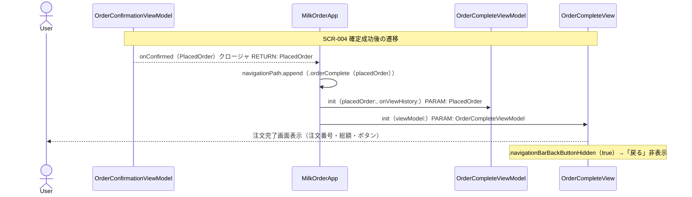
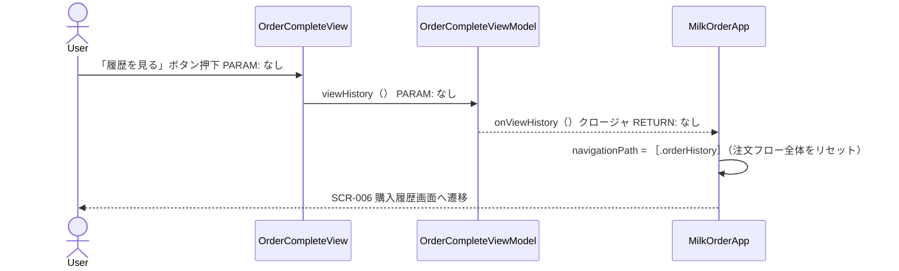
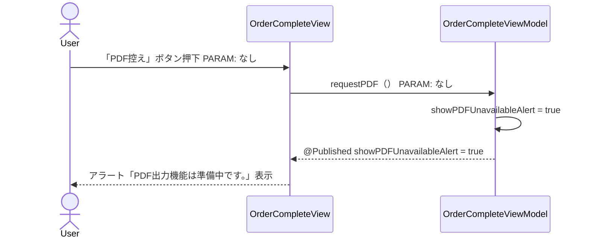
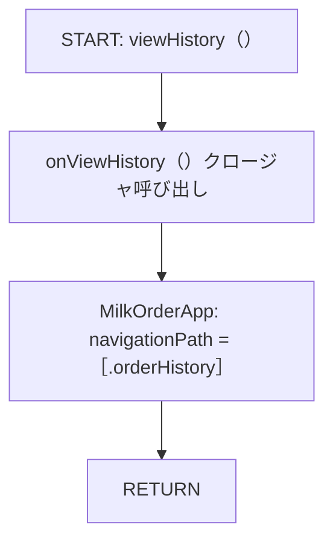
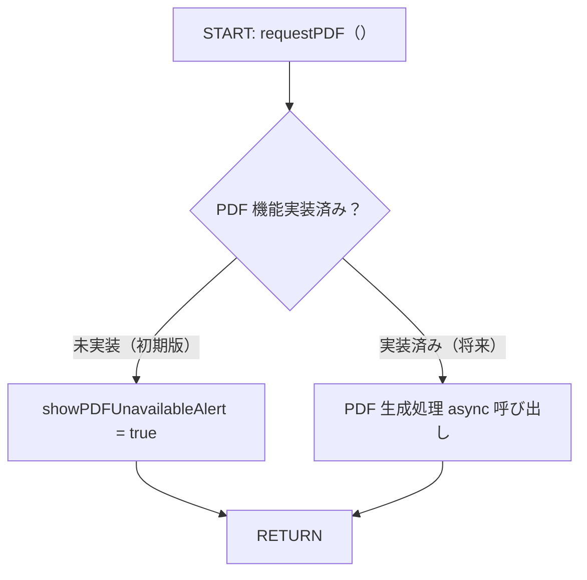
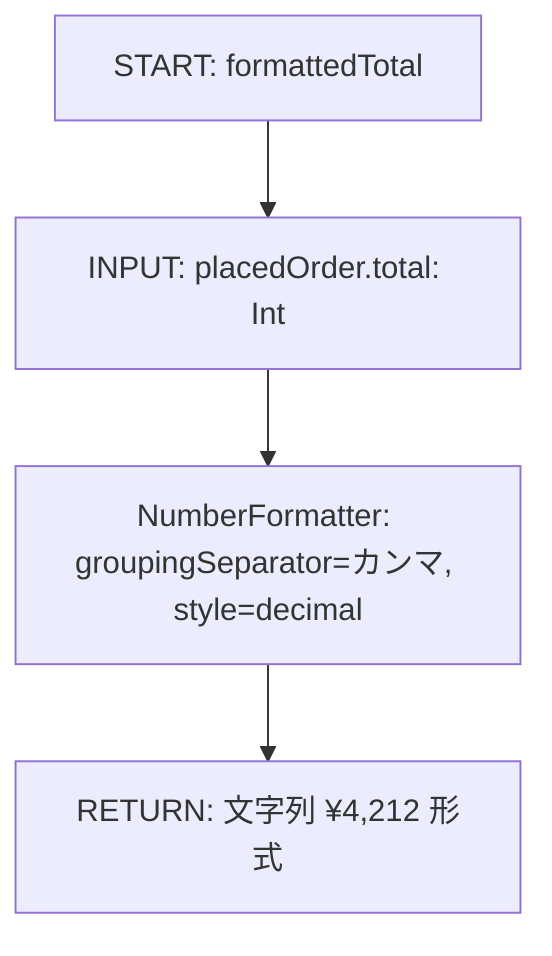
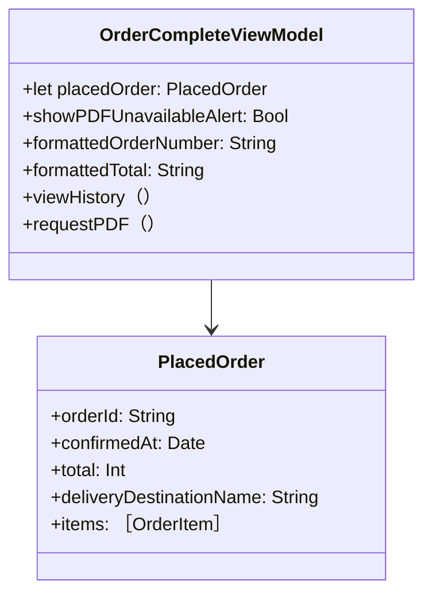

# Implementation Plan — SCR-005 注文完了画面

---

## 0. 実装入力コンテキスト

| 項目                             | 記入                                                                                                      |
| -------------------------------- | --------------------------------------------------------------------------------------------------------- |
| 対象Issue                        | SCR-005 注文完了画面（初期実装）                                                                          |
| 対象リポジトリ内パス（実装起点） | `MilkOrder/`                                                                                              |
| 前提 plan                        | `scr-004-order-confirmation.md`（PlacedOrder / OrderRepository / MenuDestination.orderComplete 定義済み） |

### 0.1 変更サマリ一覧

| 区分 | 対象                        | 変更概要                                                                       |
| ---- | --------------------------- | ------------------------------------------------------------------------------ |
| 追加 | OrderCompleteViewModel      | PlacedOrder 表示・「履歴を見る」「PDF控え」アクション制御                      |
| 追加 | OrderCompleteView           | 注文完了画面（受付メッセージ・注文番号・総額・履歴/PDF ボタン）                |
| 修正 | MilkOrderApp                | `.orderComplete` destination を PlaceholderView → OrderCompleteView に差し替え |
| 修正 | MockOrderRepository         | `orderId` 採番を UUID 文字列 → `ORD-YYYYMMDD-0001` 形式に変更                  |
| 追加 | OrderCompleteViewModelTests | ViewModel のユニットテスト                                                     |

### 0.2 入力制約一覧

| 制約区分 | 制約内容                                                                                                              | 適用対象               |
| -------- | --------------------------------------------------------------------------------------------------------------------- | ---------------------- |
| 禁止事項 | 注文完了画面でシステムの「戻る」ボタンを表示しない（二重確定防止）。`.navigationBarBackButtonHidden(true)` を必ず付与 | OrderCompleteView      |
| 禁止事項 | 注文番号・総額をログに出力しない                                                                                      | OrderCompleteViewModel |
| 禁止事項 | background スレッドから @Published を更新しない                                                                       | OrderCompleteViewModel |
| 互換性   | MockOrderRepository の orderId 形式変更は PlacedOrder 型定義（String）に影響しない                                    | MockOrderRepository    |
| その他   | PDF出力機能は初期版 Out-of-Scope。ボタン押下時は「PDF出力機能は準備中です。」アラートを表示                           | OrderCompleteView      |

### 0.3 関連機能・関連仕様一覧

| 種別             | パス/識別子                                                                          | この設計での利用目的                                        |
| ---------------- | ------------------------------------------------------------------------------------ | ----------------------------------------------------------- |
| 要件             | `10-requirements.md` § 4.1 No.12 (PDF出力), § 4.1 No.13 (購入履歴)                   | PDF 出力・履歴遷移の要件確認                                |
| 前提 plan        | `scr-004-order-confirmation.md`                                                      | PlacedOrder モデル / MenuDestination.orderComplete の型定義 |
| 前提 plan        | `scr-002-menu.md`                                                                    | MenuDestination.orderHistory / NavigationStack 制御         |
| ワイヤーフレーム | `docs/00_要件/画面イメージ_乳製品等受注集計管理アプリ.pptx` スライド「注文完了画面」 | 画面レイアウト（緑カード・注文番号・ボタン配置）            |
| 設計方針         | `30-coding-standards.md`                                                             | @MainActor / async/await                                    |
| セキュリティ     | `50-security.md`                                                                     | PII・Secrets の非出力                                       |

---

## 1. 実装対象機能と機能ゴール

| 項目         | 内容                                                                                                                                                                                                                                                                                                                                                  | 根拠                     |
| ------------ | ----------------------------------------------------------------------------------------------------------------------------------------------------------------------------------------------------------------------------------------------------------------------------------------------------------------------------------------------------- | ------------------------ |
| 実装対象詳細 | SCR-005 注文完了画面（OrderCompleteView + OrderCompleteViewModel）                                                                                                                                                                                                                                                                                    | `10-requirements.md` § 5 |
| 機能ゴール   | SCR-004 で確定した注文の受付完了（注文番号・総額）をユーザーに伝え、「履歴を見る」で SCR-006 へ遷移、「PDF控え」でアラートを表示（初期版）                                                                                                                                                                                                            | SCR-005 要件             |
| 非ゴール     | PDF出力機能の本実装（SCR-010）、注文控えメール送信、注文詳細画面（SCR-007）への遷移                                                                                                                                                                                                                                                                   | 後続スコープ             |
| 完了条件     | ① 「注文を受け付けました」メッセージが緑カードで表示される ② 注文番号（ORD-YYYYMMDD-NNNN 形式）と総額（¥ 付き）が表示される ③ システムの「戻る」ボタンが表示されない ④ 「履歴を見る」押下で SCR-006 へ遷移する ⑤ 「PDF控え」押下で「PDF出力機能は準備中です。」アラートが表示される ⑥ `swiftlint lint --strict` 0 violations ⑦ `xcodebuild test` PASS | —                        |
| 受入確認手順 | `demo@example.com` でログイン → 「新しく注文する」 → 商品選択・日付設定 → 「確認へ進む」 → 「注文を確定する」 → 注文完了画面が表示 → 注文番号・総額を確認 → 「履歴を見る」で SCR-006 へ遷移                                                                                                                                                           | —                        |

---

## 2. 前提・制約（SSOT）

| 種別               | 内容                                                                                                                                                                                                             | 根拠                            |
| ------------------ | ---------------------------------------------------------------------------------------------------------------------------------------------------------------------------------------------------------------- | ------------------------------- |
| 参照したSSOT       | `10-requirements.md`, `20-architecture.md`, `30-coding-standards.md`, `50-security.md`                                                                                                                           | CLAUDE.md SSOT参照順            |
| アーキテクチャ前提 | 新規 Repository 不要。`PlacedOrder` を init で受け取り表示するだけ。DI 経路は `OrderConfirmationViewModel（呼び出し元）-> onConfirmed クロージャ -> MilkOrderApp -> OrderCompleteViewModel -> OrderCompleteView` | `20-architecture.md`            |
| iOS バージョン要件 | iOS 18以上                                                                                                                                                                                                       | `60-ci-quality-gates.md`        |
| 技術制約           | 非同期処理なし（表示のみ）。@MainActor 付与は将来の非同期拡張（PDF生成等）への備え                                                                                                                               | `30-coding-standards.md`        |
| 未確定前提（TBD）  | PDF出力機能の実装方式（初期版は Out-of-Scope）/ 注文番号のサーバー側採番ルール（初期版は MockOrderRepository の形式を採用）                                                                                      | `10-requirements.md` 未確定事項 |

---

## 3. 要件定義（実装受入条件）

### 3.1 機能要件

| ID    | 要件                                                              | 受入条件（テスト可能な形）                                                                                 |
| ----- | ----------------------------------------------------------------- | ---------------------------------------------------------------------------------------------------------- |
| FR-01 | 「注文を受け付けました」メッセージを緑背景カードで表示する        | `OrderCompleteView` に `SuccessMessageSection` が含まれ、指定文言が表示される                              |
| FR-02 | 注文番号を「注文番号」ラベルと共に表示する                        | `PlacedOrder.orderId` が画面に表示される（例：ORD-20260503-0001）                                          |
| FR-03 | 総額を「総額：¥xxx」形式で表示する                                | `PlacedOrder.total` が `¥` 付きカンマ区切りフォーマットで表示される                                        |
| FR-04 | システムの「戻る」ボタンを非表示にする                            | `.navigationBarBackButtonHidden(true)` が付与されており、SCR-004 に戻れない                                |
| FR-05 | 「履歴を見る」ボタン押下で `onViewHistory()` クロージャを呼び出す | ボタン押下で ViewModel の `viewHistory()` が呼ばれ `onViewHistory` が 1 回実行される                       |
| FR-06 | 「PDF控え」ボタン押下で PDF 機能未実装アラートを表示する          | ボタン押下で `showPDFUnavailableAlert == true` になり、アラートに「PDF出力機能は準備中です。」が表示される |

### 3.2 非機能要件

| ID     | 要件                                                                                                            | 受入条件（テスト可能な形）                                           |
| ------ | --------------------------------------------------------------------------------------------------------------- | -------------------------------------------------------------------- |
| NFR-01 | 「履歴を見る」ボタンはプライマリスタイル（濃い紺色）、「PDF控え」はセカンダリスタイル（やや薄い青色）で区別する | ワイヤーフレームのビジュアル仕様に準拠                               |
| NFR-02 | 両ボタンは最低 44pt 高さを確保する                                                                              | `.frame(maxWidth: .infinity)` `.padding(.vertical, 12)` 以上のサイズ |
| NFR-03 | 金額は SCR-003/004 と同一形式（`¥` 付きカンマ区切り整数）で表示する                                             | `formattedPrice(Int) -> String` と同一ロジック                       |

---

## 4. スコープ境界

### 4.0 スコープ境界の定義

| 区分         | 対象機能/責務                                                    | 判定理由                                                       |
| ------------ | ---------------------------------------------------------------- | -------------------------------------------------------------- |
| In-Scope     | OrderCompleteView の SwiftUI 実装                                | SCR-005 画面要件                                               |
| In-Scope     | OrderCompleteViewModel（表示・アクション制御）                   | ViewModel 責務                                                 |
| In-Scope     | MockOrderRepository の orderId 形式変更（ORD-YYYYMMDD-0001）     | 注文番号の表示仕様対応                                         |
| In-Scope     | MilkOrderApp の `.orderComplete` destination 本実装への差し替え  | SCR-004 で PlaceholderView を仮置きしていた destination の完成 |
| In-Scope     | OrderCompleteViewModelTests                                      | テスト戦略必須                                                 |
| Out-of-Scope | PDF出力機能の本実装                                              | SCR-010 出力画面スコープ                                       |
| Out-of-Scope | 注文控えメール送信                                               | SCR-013 通知設定マスタ実装時                                   |
| Out-of-Scope | 注文詳細画面（SCR-007）への遷移                                  | 初期版スコープ外                                               |
| Out-of-Scope | 注文完了後のメニューへのリセット導線（「メニューに戻る」ボタン） | 初期版は「履歴を見る」のみ提供                                 |

### 4.2 実装時の影響範囲・互換性リスク

| 影響対象        | 結論     | 影響内容                                                                                                                          |
| --------------- | -------- | --------------------------------------------------------------------------------------------------------------------------------- |
| UI/画面         | 影響あり | `.orderComplete` の destination が PlaceholderView → OrderCompleteView に変わる                                                   |
| API/外部通信    | 影響なし | 既存の MockOrderRepository の orderId 採番ロジックのみ変更                                                                        |
| データモデル    | 影響なし | PlacedOrder 型定義（orderId: String）は変更しない。Mock の生成値のみ変更                                                          |
| SCR-004 テスト  | 影響あり | MockOrderRepository.placeOrder が返す orderId の値が変わるため、SCR-004 テストで orderId の形式チェックをしている場合は修正が必要 |
| 外部依存（SPM） | 影響なし | 追加パッケージなし                                                                                                                |
| CI/運用         | 影響なし | 既存 lint / test 設定で動作                                                                                                       |

### 4.3 外部依存・Secrets の扱い

| 項目                      | 内容                                       | リスク/対応      |
| ------------------------- | ------------------------------------------ | ---------------- |
| 外部依存の追加/更新       | なし                                       | —                |
| Secrets 利用有無          | なし                                       | —                |
| ログ/設定への機密混入対策 | 注文番号・総額・配達先名をログに出力しない | `50-security.md` |

### 4.4 4章の自己検証

| チェック項目                   | 合格条件                          | 判定                     |
| ------------------------------ | --------------------------------- | ------------------------ |
| Design PR 差分を書いていないか | plans/*.md の変更を記載していない | OK                       |
| 実装責務を書いているか         | In-Scope に実装責務が2件以上ある  | OK（5件）                |
| 実装影響を書いているか         | 4.2 で影響あり/未確定が1件以上    | OK（UI・SCR-004 テスト） |

---

## 5. アーキテクチャ設計

### 5.0 依存注入経路（DI）

| 区分   | 提供主体         | Protocol 名                       | 具象実装名                | 入力                                                    | 出力                    | 境界制約                                                     |
| ------ | ---------------- | --------------------------------- | ------------------------- | ------------------------------------------------------- | ----------------------- | ------------------------------------------------------------ |
| 記載例 | `AppEnvironment` | `MilkOrderRepository（Protocol）` | `MilkOrderRepositoryImpl` | 設定/環境値                                             | Repository インスタンス | View から具象を直接 import しない                            |
| 01     | `MilkOrderApp`   | なし（Repository 不要）           | なし                      | `placedOrder: PlacedOrder`, `onViewHistory: () -> Void` | OrderCompleteViewModel  | ViewModel は PlacedOrder を表示するのみ。Repository 依存なし |

#### 5.0.1 最小固定セット（TBD禁止）

| 最小固定項目       | 固定内容                                                                                                          |
| ------------------ | ----------------------------------------------------------------------------------------------------------------- |
| DI 経路            | `MilkOrderApp -> OrderCompleteViewModel -> OrderCompleteView`（AppEnvironment 経由の Repository 注入は不要）      |
| MainActor 境界     | `OrderCompleteViewModel` クラスに `@MainActor` を付与。現在は非同期処理なし。将来の PDF 生成 async 追加時に備える |
| Protocol/具象 境界 | SCR-005 は Repository を使用しないため、レイヤ境界制約は View が ViewModel のみ参照する点のみ                     |

### 5.1 設計判断

#### 5.1.1 責務分離 / データフロー

| No. | 決定事項                                                                                                                                                                          | 根拠                                                                                                      | 未確定                                       |
| --- | --------------------------------------------------------------------------------------------------------------------------------------------------------------------------------- | --------------------------------------------------------------------------------------------------------- | -------------------------------------------- |
| 1   | `OrderCompleteViewModel` は Repository を持たない。`PlacedOrder` を init で受け取り `let` で保持する                                                                              | 表示専用画面。非同期データ取得が不要なため ViewModel を薄く保つ                                           | なし                                         |
| 2   | 「履歴を見る」の遷移方式は `onViewHistory()` クロージャで MilkOrderApp に委譲。MilkOrderApp は navigationPath を `[.orderHistory]` にリセット（注文フロー全体をスタックから除去） | 注文完了後に「戻る」で SCR-004 に戻ることを防ぎ、クリーンなナビゲーション状態を保つ                       | なし                                         |
| 3   | 「PDF控え」は `showPDFUnavailableAlert: Bool` @Published で ViewModel が管理し、View はアラート表示のみ行う                                                                       | PDF 機能実装時に ViewModel の `requestPDF()` を async に昇格させるため、将来の変更点を ViewModel 内に集約 | PDF 実装方式（Out-of-Scope）                 |
| 4   | システムの「戻る」ボタンは `.navigationBarBackButtonHidden(true)` で非表示にする。SCR-004（注文確認）は注文確定済みのため戻れてはいけない                                         | 二重確定防止の UX 制約                                                                                    | なし                                         |
| 5   | 注文番号のフォーマットは `PlacedOrder.orderId` をそのまま表示する。Mock は `ORD-YYYYMMDD-0001` 形式で採番。将来 API が返す形式に依存する                                          | `orderId` の表示変換ロジックを ViewModel に持たない（サーバー採番形式を信頼）                             | 本番の注文番号採番ルール（API 設計フェーズ） |

#### 5.1.2 エッジケース / 例外系

| No. | ケース                           | 方針                                                                                                                                  |
| --- | -------------------------------- | ------------------------------------------------------------------------------------------------------------------------------------- |
| 1   | `PlacedOrder.items` が空         | SCR-003/004 で防ぐ。SCR-005 は受け取った PlacedOrder を表示するだけで再検証しない                                                     |
| 2   | 「PDF控え」ボタン押下            | `showPDFUnavailableAlert = true` を設定し「PDF出力機能は準備中です。」アラートを表示。非同期処理なし                                  |
| 3   | システムの「戻る」操作           | `.navigationBarBackButtonHidden(true)` で防止。SwiftUI の `@Environment(\.dismiss)` も呼ばれないよう View での dismiss 操作を行わない |
| 4   | 「履歴を見る」押下後の二重タップ | `onViewHistory()` は navigation path のリセットを行う。SwiftUI のタップ処理で二重実行されても NavigationStack のリセットは冪等        |

#### 5.1.3 SwiftUI View 部品一覧

| レイヤ  | View/コンポーネント名   | 主責務                           | 対応機能     |
| ------- | ----------------------- | -------------------------------- | ------------ |
| Screen  | `OrderCompleteView`     | 注文完了画面全体                 | SCR-005      |
| Section | `SuccessMessageSection` | 「注文を受け付けました」緑カード | FR-01        |
| Section | `OrderSummarySection`   | 注文番号・総額の表示カード       | FR-02, FR-03 |
| Section | `ActionButtonsSection`  | 「履歴を見る」「PDF控え」ボタン  | FR-05, FR-06 |

#### 5.1.4 ログと観測性

| No. | 観点                  | 方針                                                   |
| --- | --------------------- | ------------------------------------------------------ |
| 1   | ログ出力内容          | 非同期処理なし。エラーログ不要                         |
| 2   | マスキング/非出力項目 | 注文番号・総額・配達先名を一切ログに出力しない         |
| 3   | エラー記録粒度        | PDF ボタンのアラート表示はエラーではなく通知。ログなし |

### 5.2 トレードオフ

| 判断テーマ                        | 案A                                          | 案B                                                                        | 採用案                                    | 採用理由                                                                                             | 不採用理由                                                                                    |
| --------------------------------- | -------------------------------------------- | -------------------------------------------------------------------------- | ----------------------------------------- | ---------------------------------------------------------------------------------------------------- | --------------------------------------------------------------------------------------------- |
| 「履歴を見る」後の navigationPath | `.orderHistory` を append してスタックに積む | `[.orderHistory]` にリセットして注文フローを除去                           | リセット（案B）                           | 注文完了画面に戻る「戻る」導線が残らない。スタックが際限なく積まれない                               | 案A だと注文完了→履歴→戻る で注文完了画面に戻り、「戻る」で確認画面（確定済み）に戻れてしまう |
| PDF ボタンのハンドリング          | View の `@State` でアラートを直接管理        | ViewModel の `@Published showPDFUnavailableAlert` で管理                   | ViewModel（案B）                          | PDF 機能実装時の変更点が ViewModel に集約される。テスト可能                                          | 案A は presentation ロジックが View に散在し、将来の async 化で書き直しが生じる               |
| 戻るボタン抑制                    | navigationBarBackButtonHidden のみ           | SwipeBack ジェスチャーも含めて `interactiveDismissDisabled(true)` 等で抑制 | navigationBarBackButtonHidden のみ（案A） | NavigationStack の push 型遷移でスワイプバック無効化は不要（Sheet ではないため）。過剰な制御を避ける | 案B は NavigationStack + push 型では効果がなく不要                                            |

### 5.3 ナビゲーション方針

| 項目               | 決定内容                                                                                                     | 根拠                                                                                                |
| ------------------ | ------------------------------------------------------------------------------------------------------------ | --------------------------------------------------------------------------------------------------- |
| ナビゲーション方式 | SCR-002 の `NavigationStack(path: $menuViewModel.navigationPath)` に `.orderComplete` destination として接続 | SCR-004 で MenuDestination.orderComplete(PlacedOrder) を定義済み                                    |
| データ受け渡し     | `MenuDestination.orderComplete(PlacedOrder)` の associated value から PlacedOrder を受け取る                 | SCR-004 設計済み                                                                                    |
| 「戻る」ボタン     | `.navigationBarBackButtonHidden(true)` で非表示                                                              | 注文確定済みのため SCR-004 へ戻ることを禁止                                                         |
| 「履歴を見る」遷移 | `onViewHistory()` クロージャ → MilkOrderApp が `menuViewModel.navigationPath = [.orderHistory]` にリセット   | 注文フロー（orderInput → orderConfirmation → orderComplete）を全て除去し、クリーンに SCR-006 へ遷移 |
| ディープリンク対応 | Out-of-Scope                                                                                                 | 初期版スコープ外                                                                                    |

### 5.4 アーキテクチャレイヤー方針

| レイヤ       | 定義                        | 許可する依存方向            | 禁止する依存                                |
| ------------ | --------------------------- | --------------------------- | ------------------------------------------- |
| View         | SwiftUI 表示のみ            | OrderCompleteViewModel のみ | Repository/DataSource を直接 import しない  |
| ViewModel    | 表示状態・アクション制御    | PlacedOrder（Model）のみ    | Repository を直接参照しない（現時点は不要） |
| Model/Entity | PlacedOrder（Swift struct） | なし                        | 他レイヤに依存しない                        |

### 5.5 データ取得ライフサイクル

| データ種別  | 取得タイミング | 取得場所                    | 理由                                                       |
| ----------- | -------------- | --------------------------- | ---------------------------------------------------------- |
| PlacedOrder | init 時        | OrderCompleteViewModel.init | SCR-004 から渡される確定済みデータ。画面表示で追加取得不要 |

| キャッシュ方針       | 採用有無 | ルール                           |
| -------------------- | -------- | -------------------------------- |
| インメモリキャッシュ | 不採用   | PlacedOrder は表示専用で変更なし |
| ディスクキャッシュ   | 不採用   | 初期版スコープ外                 |

#### 5.5.1 MainActor/BackgroundActor 境界

| 対象処理                                   | 実行コンテキスト | 実装場所                                    | 禁止事項                              |
| ------------------------------------------ | ---------------- | ------------------------------------------- | ------------------------------------- |
| @Published 更新（showPDFUnavailableAlert） | MainActor        | OrderCompleteViewModel（@MainActor クラス） | background スレッドから直接更新しない |
| onViewHistory クロージャ呼び出し           | MainActor        | OrderCompleteViewModel.viewHistory()        | 非同期処理なし                        |
| requestPDF()                               | MainActor        | OrderCompleteViewModel.requestPDF()         | 現在は同期。将来 async に変更予定     |

### 5.6 エラーハンドリング標準形

| 分類       | エラー型                   | UI 表示ルール                             | 再試行ルール         |
| ---------- | -------------------------- | ----------------------------------------- | -------------------- |
| PDF 未実装 | なし（エラーではなく通知） | 「PDF出力機能は準備中です。」アラート表示 | なし（機能実装待ち） |

| ログ方針       | 内容                           |
| -------------- | ------------------------------ |
| 出力する情報   | なし（非同期処理・エラーなし） |
| 出力しない情報 | 注文番号・総額・配達先名       |

#### 5.6.1 エラー変換責務

本画面は Repository を使用しないため、エラー変換責務は発生しない。

### 5.7 シーケンス図

#### 5.7.0 DI 経路

| No     | 開始主体         | 終了主体            | Protocol 名                       | 具象実装名                | 経路文字列                                                    | 境界チェック観点                         | 対応図ID |
| ------ | ---------------- | ------------------- | --------------------------------- | ------------------------- | ------------------------------------------------------------- | ---------------------------------------- | -------- |
| 記載例 | `AppEnvironment` | `SomeScreen`        | `MilkOrderRepository（Protocol）` | `MilkOrderRepositoryImpl` | `AppEnvironment -> SomeViewModel -> SomeScreen`               | 具象が View/ViewModel に漏れていないこと | SEQ-01   |
| 01     | `MilkOrderApp`   | `OrderCompleteView` | なし（Repository 不要）           | なし                      | `MilkOrderApp -> OrderCompleteViewModel -> OrderCompleteView` | View が ViewModel のみ参照していること   | SEQ-01   |

#### 5.7.1 シーケンス対象一覧

| 図ID   | 種別               | 起点                                                  | 終点                   | 対応要件ID   |
| ------ | ------------------ | ----------------------------------------------------- | ---------------------- | ------------ |
| SEQ-01 | 正常（画面表示）   | SCR-004 「注文を確定する」成功 → orderComplete へ遷移 | OrderCompleteView 表示 | FR-01〜FR-04 |
| SEQ-02 | 正常（履歴を見る） | 「履歴を見る」ボタン押下                              | SCR-006 へ遷移         | FR-05        |
| SEQ-03 | 正常（PDF控え）    | 「PDF控え」ボタン押下                                 | アラート表示           | FR-06        |

#### 5.7.1.1 境界整合チェック

| 境界テーマ                | 文章セクション | 表セクション | 図セクション           | 整合判定             |
| ------------------------- | -------------- | ------------ | ---------------------- | -------------------- |
| ログ責務                  | 5.1.4          | 5.6          | SEQ-01〜03（ログなし） | OK                   |
| エラー変換責務            | 5.6.1          | —            | —                      | OK（エラー変換なし） |
| MainActor/Background 境界 | 5.5.1          | 5.5.1, 8.3   | SEQ-02                 | OK                   |

#### 5.7.1.2 最小固定セット具体化チェック

| 最小固定項目       | 文章セクション | 表セクション | 図セクション | TBD残存数 |
| ------------------ | -------------- | ------------ | ------------ | --------- |
| DI 経路            | 5.0.1          | 5.0, 5.7.0   | SEQ-01       | 0         |
| MainActor 境界     | 5.5.1          | 5.5.1, 8.3   | SEQ-02       | 0         |
| Protocol/具象 境界 | 5.0.1          | 8.4          | SEQ-01       | 0         |

#### 5.7.2 正常系シーケンス（SEQ-01 — 画面表示）

#### 5.7.3 正常系シーケンス（SEQ-02 — 履歴を見る）

#### 5.7.4 正常系シーケンス（SEQ-03 — PDF控え）

### 5.8 処理フロー図

#### 5.8.1 メソッド一覧

| 図ID    | メソッド名                               | 層        | 対応要件ID |
| ------- | ---------------------------------------- | --------- | ---------- |
| FLOW-01 | `OrderCompleteViewModel.viewHistory（）` | ViewModel | FR-05      |
| FLOW-02 | `OrderCompleteViewModel.requestPDF（）`  | ViewModel | FR-06      |
| FLOW-03 | `OrderCompleteViewModel.formattedTotal`  | ViewModel | FR-03      |

#### メソッドフロー（FLOW-01 — viewHistory）

#### メソッドフロー（FLOW-02 — requestPDF）

#### メソッドフロー（FLOW-03 — formattedTotal computed property）

---

## 6. 契約仕様（Protocol Contract）

### 6.0 Protocol-DI 固定前提

| 項目                    | 固定方針                                                                                             |
| ----------------------- | ---------------------------------------------------------------------------------------------------- |
| DI 起点                 | `MilkOrderApp` が `OrderCompleteViewModel` を直接生成（AppEnvironment 経由の Repository 注入は不要） |
| Protocol の責務         | SCR-005 は Repository Protocol を使用しない                                                          |
| 具象実装の配置          | 該当なし                                                                                             |
| View / ViewModel の責務 | `OrderCompleteView` は `OrderCompleteViewModel` のみ参照                                             |

### 6.1 入出力契約

| ID     | 入口                                     | 入力                                                    | 出力                                              | エラー |
| ------ | ---------------------------------------- | ------------------------------------------------------- | ------------------------------------------------- | ------ |
| IFC-01 | `OrderCompleteViewModel.init`            | `placedOrder: PlacedOrder`, `onViewHistory: () -> Void` | OrderCompleteViewModel                            | なし   |
| IFC-02 | `OrderCompleteViewModel.viewHistory（）` | なし                                                    | なし（onViewHistory クロージャ呼び出し）          | なし   |
| IFC-03 | `OrderCompleteViewModel.requestPDF（）`  | なし                                                    | なし（@Published showPDFUnavailableAlert = true） | なし   |

### 6.2 型/モデル/スキーマ

| ID      | 対象                  | 変更内容                                                        | 後方互換                                                                                                  |
| ------- | --------------------- | --------------------------------------------------------------- | --------------------------------------------------------------------------------------------------------- |
| TYPE-01 | `MockOrderRepository` | `orderId` 採番を UUID 文字列 → `"ORD-YYYYMMDD-0001"` 形式に変更 | PlacedOrder.orderId の型（String）は不変。SCR-004 テストで UUID 形式の exact match をしている場合は修正要 |

### 6.3 Protocol インターフェース定義

#### 6.3.1 Repository Protocol 一覧

SCR-005 は新規 Repository Protocol を導入しない。

#### 6.3.2 ドメインモデルクラス図

#### 6.3.3 ドメイン別モデル定義

##### 6.3.3.1 モデル一覧

| ドメイン | 型名          | 区分   | 用途                                   |
| -------- | ------------- | ------ | -------------------------------------- |
| Order    | `PlacedOrder` | struct | SCR-004 定義済み。SCR-005 では表示のみ |

##### 6.3.3.2 プロパティ詳細定義（SCR-005 で参照するフィールド）

| ドメイン | 型名        | プロパティ名 | Swift 型 | 用途                                         |
| -------- | ----------- | ------------ | -------- | -------------------------------------------- |
| Order    | PlacedOrder | orderId      | String   | 注文番号として表示（ORD-YYYYMMDD-0001 形式） |
| Order    | PlacedOrder | total        | Int      | 総額として表示                               |

---

## 7. データ設計

| 項目                 | 内容                                      | 互換性/移行 |
| -------------------- | ----------------------------------------- | ----------- |
| スキーマ変更         | なし（in-memory の PlacedOrder 表示のみ） | —           |
| マイグレーション方針 | 該当なし                                  | —           |
| 既存データ影響       | なし                                      | —           |
| ロールバック方針     | 該当なし                                  | —           |

---

## 8. 実装指示（製造 Agent 向け）

### 8.1 変更予定ファイル一覧

| No. | パス                                                                      | 区分       | 変更タイプ | 実装内容                                                                                                                                                               | 完了条件                                               |
| --- | ------------------------------------------------------------------------- | ---------- | ---------- | ---------------------------------------------------------------------------------------------------------------------------------------------------------------------- | ------------------------------------------------------ |
| 1   | `MilkOrder/Features/OrderComplete/OrderCompleteViewModel.swift`           | ViewModel  | 追加       | `@MainActor final class OrderCompleteViewModel`（viewHistory / requestPDF / formattedOrderNumber / formattedTotal）                                                    | コンパイル通過                                         |
| 2   | `MilkOrder/Features/OrderComplete/OrderCompleteView.swift`                | View       | 追加       | `OrderCompleteView`（SuccessMessageSection / OrderSummarySection / ActionButtonsSection）、`.navigationBarBackButtonHidden(true)`                                      | シミュレーター表示確認                                 |
| 3   | `MilkOrder/App/MilkOrderApp.swift`                                        | Other      | 変更       | `.orderComplete(PlacedOrder)` の destination を PlaceholderView → OrderCompleteView に差し替え。`onViewHistory` クロージャで `navigationPath = [.orderHistory]` を実装 | SCR-004→005 遷移確認・「履歴を見る」→ SCR-006 遷移確認 |
| 4   | `MilkOrder/Infrastructure/Order/MockOrderRepository.swift`                | DataSource | 変更       | `placeOrder()` の `orderId` 採番を `"ORD-" + DateFormatter(yyyyMMdd).string(from: Date()) + "-0001"` 形式に変更                                                        | コンパイル通過                                         |
| 5   | `MilkOrderTests/Features/OrderComplete/OrderCompleteViewModelTests.swift` | Test       | 追加       | FR-01〜FR-06 の Unit テスト                                                                                                                                            | `xcodebuild test` PASS                                 |

### 8.2 実装手順（順序付き）

| 手順 | 作業内容                                                                                  | 対象ファイル                      | 完了条件                                                                       |
| ---- | ----------------------------------------------------------------------------------------- | --------------------------------- | ------------------------------------------------------------------------------ |
| 1    | MockOrderRepository の orderId 形式を変更                                                 | MockOrderRepository.swift         | コンパイル通過。SCR-004 テストで UUID exact match をしている場合は合わせて修正 |
| 2    | OrderCompleteViewModel を実装                                                             | OrderCompleteViewModel.swift      | コンパイル通過                                                                 |
| 3    | OrderCompleteView を実装                                                                  | OrderCompleteView.swift           | シミュレーター表示確認。「戻る」ボタン非表示確認                               |
| 4    | MilkOrderApp の `.orderComplete` destination を差し替え、`onViewHistory` クロージャを実装 | MilkOrderApp.swift                | SCR-004→005 遷移確認・「履歴を見る」で SCR-006 Placeholder へ遷移確認          |
| 5    | テストを実装・実行                                                                        | OrderCompleteViewModelTests.swift | `xcodebuild test` PASS                                                         |
| 6    | Lint を実行                                                                               | 全 Swift ファイル                 | `swiftlint lint --strict` 0 violations                                         |
| 7    | xcodeproj に全新規ファイルを追加                                                          | MilkOrder.xcodeproj               | ビルド対象に含まれる                                                           |

### 8.3 実装禁止事項（ガードレール）

| 項目       | 内容                                                                                                       | 根拠                              |
| ---------- | ---------------------------------------------------------------------------------------------------------- | --------------------------------- |
| 禁止事項-1 | `OrderCompleteView` に `.navigationBarBackButtonHidden(true)` を付け忘れない                               | FR-04、二重確定防止（5.1.1 No.4） |
| 禁止事項-2 | 「履歴を見る」で navigationPath に `.orderHistory` を append しない。必ず `[.orderHistory]` にリセットする | 5.1.1 No.2、5.3（注文フロー除去） |
| 禁止事項-3 | 注文番号・総額をログに出力しない                                                                           | `50-security.md`                  |
| 禁止事項-4 | background スレッドから @Published を更新しない                                                            | MainActor 境界（5.5.1）           |

### 8.4 モジュール/アクセス制御方針

| 項目              | 設定内容                                                                                                        | 検証方法         |
| ----------------- | --------------------------------------------------------------------------------------------------------------- | ---------------- |
| アクセス制御方針  | `onViewHistory` クロージャは `private let`。`viewHistory()` / `requestPDF()` は `internal`（View から呼ぶため） | Swift コンパイラ |
| Protocol 依存強制 | `OrderCompleteView` は `OrderCompleteViewModel` のみ参照                                                        | コードレビュー   |

---

## 9. テスト実装計画

### 9.1 テストケース

| 区分 | パターン名                          | 対象                           | シナリオ                                            | 期待結果                                                 |
| ---- | ----------------------------------- | ------------------------------ | --------------------------------------------------- | -------------------------------------------------------- |
| 正常 | 注文番号の表示                      | formattedOrderNumber           | PlacedOrder（orderId: "ORD-20260503-0001"）をセット | formattedOrderNumber == "ORD-20260503-0001"              |
| 正常 | 総額フォーマット                    | formattedTotal                 | PlacedOrder（total: 4212）をセット                  | formattedTotal == "¥4,212"                               |
| 正常 | 履歴を見る                          | viewHistory()                  | 通常状態でボタン呼び出し                            | onViewHistory クロージャが 1 回呼ばれる                  |
| 正常 | PDF 未実装アラート                  | requestPDF()                   | 通常状態で呼び出し                                  | showPDFUnavailableAlert == true                          |
| 正常 | 総額ゼロのフォーマット              | formattedTotal                 | PlacedOrder（total: 0）をセット                     | formattedTotal == "¥0"                                   |
| 例外 | PDF ボタン連打                      | requestPDF()                   | requestPDF() を 2 回呼び出し                        | showPDFUnavailableAlert は true のまま（クラッシュなし） |
| 境界 | 総額大きな値                        | formattedTotal                 | PlacedOrder（total: 1000000）をセット               | formattedTotal == "¥1,000,000"（カンマ区切り正常）       |
| 回帰 | MockOrderRepository の orderId 形式 | MockOrderRepository.placeOrder | MockOrderRepository.placeOrder() を呼ぶ             | orderId が "ORD-" で始まる形式                           |

| 網羅チェック               | 判定 | 根拠                                                                     |
| -------------------------- | ---- | ------------------------------------------------------------------------ |
| 正常パターンを網羅している | Y    | 注文番号・総額表示・ボタンアクションをカバー                             |
| 例外パターンを網羅している | Y    | PDF 連打をカバー                                                         |
| 境界パターンを網羅している | Y    | 総額の大きな値（カンマ区切り）・ゼロ値をカバー                           |
| 回帰パターンを網羅している | Y    | MockOrderRepository の orderId 形式変更が SCR-005 で参照できることを確認 |

---

## 10. オープン課題 / ADR

| 論点                     | 現状                                  | 決定期限/担当                | ADR要否                                                   |
| ------------------------ | ------------------------------------- | ---------------------------- | --------------------------------------------------------- |
| PDF出力機能の実装方式    | requestPDF() がアラートを表示するのみ | SCR-010 出力画面設計フェーズ | 要（PDF ライブラリ選定）                                  |
| 本番の注文番号採番ルール | Mock は ORD-YYYYMMDD-0001 形式で固定  | API 設計フェーズ             | 不要（API 実装時に MockOrderRepository の採番を合わせる） |

### 10.1 TBD 回収トラッキング

| TBD論点            | 記載箇所                   | 解決ゲート       | BLOCKER | RESOLVE_IN                   | DEFAULT/ASSUMPTION                    |
| ------------------ | -------------------------- | ---------------- | ------- | ---------------------------- | ------------------------------------- |
| PDF 実装方式       | 5.1.1 No.3, FR-06, FLOW-02 | SCR-010 設計前   | No      | SCR-010 出力画面設計フェーズ | requestPDF() でアラート表示（準備中） |
| 注文番号採番ルール | 5.1.1 No.5, TYPE-01        | API 設計フェーズ | No      | API 確定後                   | ORD-YYYYMMDD-0001 形式で仮実装        |

---

## 11. 新規画面追加（SCR-005 適用）

### ファイル配置規約

| レイヤ         | パス規約                                                                  |
| -------------- | ------------------------------------------------------------------------- |
| ViewModel      | `MilkOrder/Features/OrderComplete/OrderCompleteViewModel.swift`           |
| View（Screen） | `MilkOrder/Features/OrderComplete/OrderCompleteView.swift`                |
| テスト         | `MilkOrderTests/Features/OrderComplete/OrderCompleteViewModelTests.swift` |
