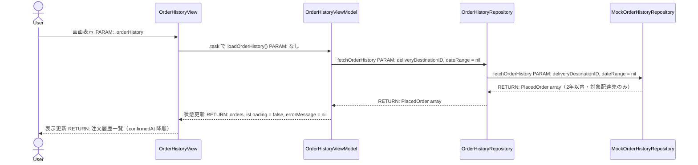
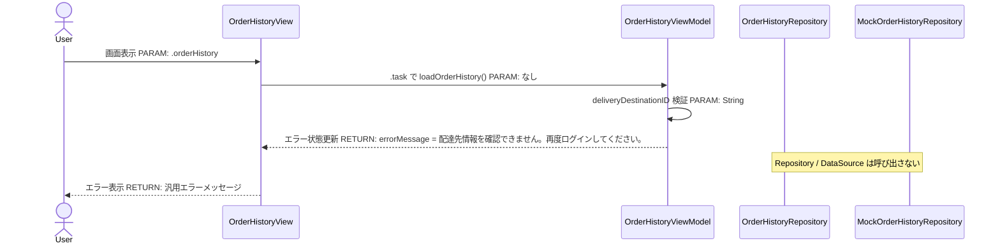
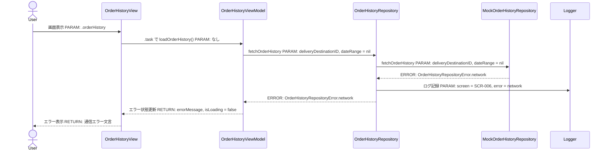
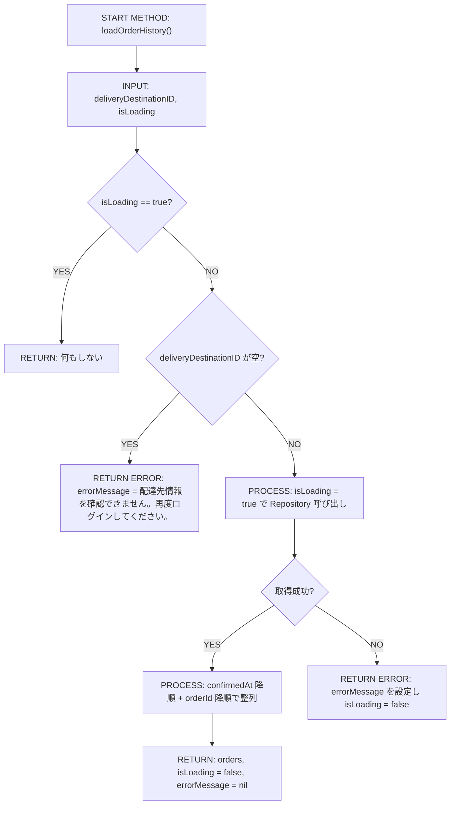
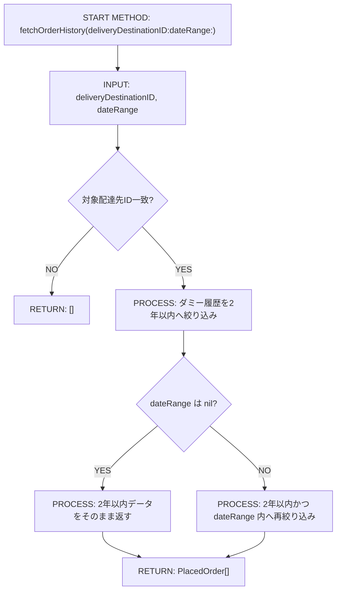
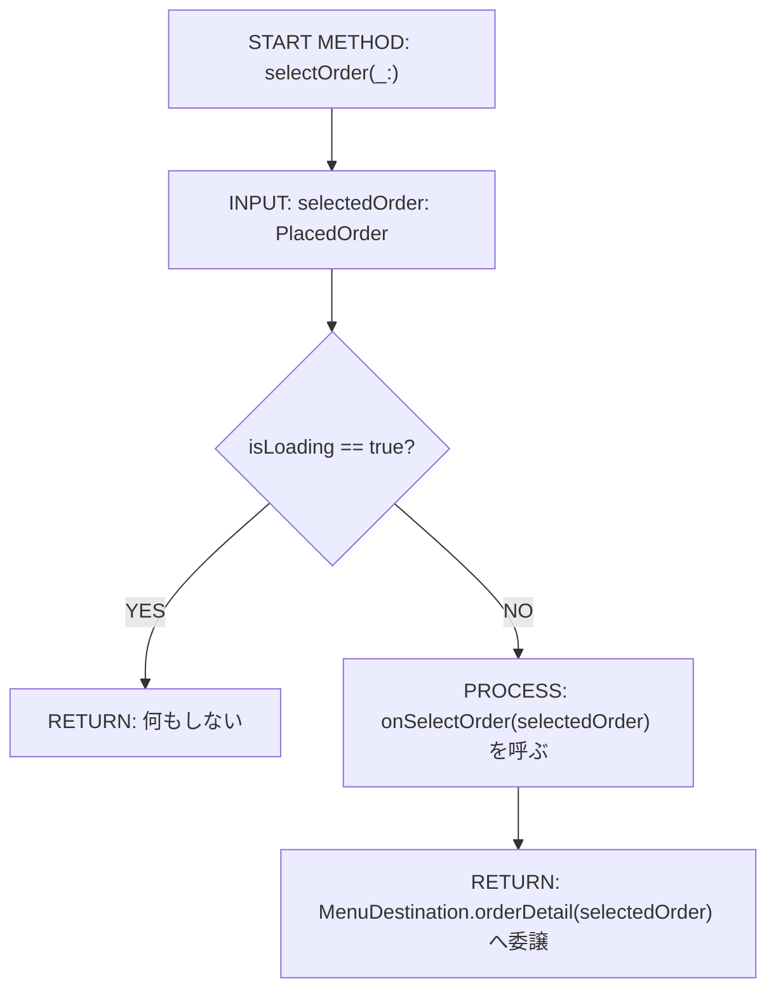
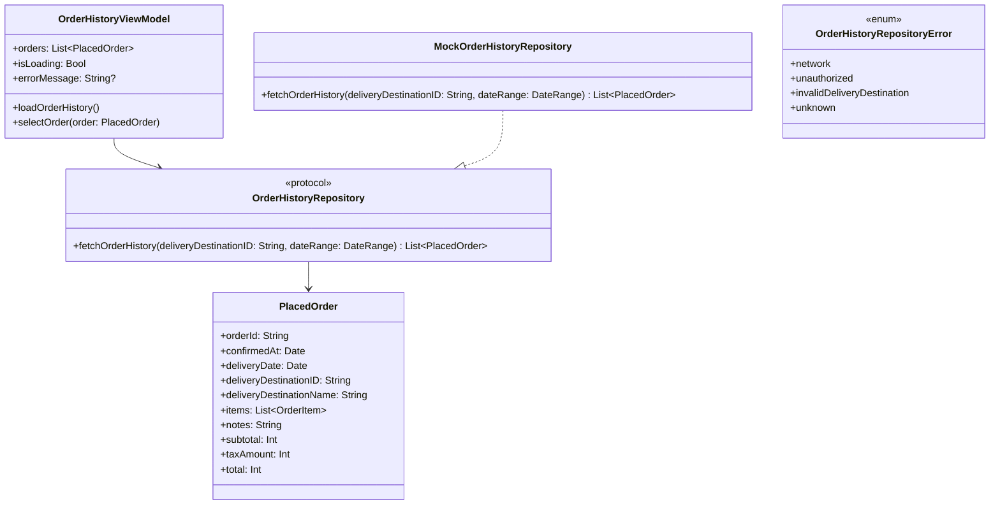

# Implementation Plan — SCR-006 注文履歴画面

---

## 0. 実装入力コンテキスト

| 項目                             | 記入                                                                                                                                                                                                                                                                                                                                                                                 |
| -------------------------------- | ------------------------------------------------------------------------------------------------------------------------------------------------------------------------------------------------------------------------------------------------------------------------------------------------------------------------------------------------------------------------------------ |
| 対象Issue                        | `[DESIGN] SCR-006 注文履歴画面`                                                                                                                                                                                                                                                                                                                                                      |
| 対象リポジトリ内パス（実装起点） | `MilkOrder/`                                                                                                                                                                                                                                                                                                                                                                         |
| 前提 plan                        | `scr-001-login.md`（AuthUser / AppEnvironment / AuthRepository）、`scr-002-menu.md`（MenuDestination / NavigationStack）、`scr-003-order-input.md`（Product / OrderItem / OrderDraft / ProductRepository）、`scr-004-order-confirmation.md`（PlacedOrder / OrderRepository / Hashable モデル群）、`scr-005-order-complete.md`（`navigationPath = [.orderHistory]` でのリセット遷移） |

### 0.1 変更サマリ一覧

| 区分 | 対象                                     | 変更概要                                                                                                                                       |
| ---- | ---------------------------------------- | ---------------------------------------------------------------------------------------------------------------------------------------------- |
| 追加 | `OrderHistoryRepository`（Protocol）     | 注文履歴取得の抽象インターフェースを `MilkOrder/Domain/Order/` に追加                                                                          |
| 追加 | `OrderHistoryRepositoryError`            | 履歴取得失敗時のドメインエラー型を追加                                                                                                         |
| 追加 | `MockOrderHistoryRepository`             | 過去2年以内・3件以上のダミー履歴を返す Mock 実装を `MilkOrder/Infrastructure/Order/` に追加                                                    |
| 追加 | `OrderHistoryViewModel`                  | 履歴取得・降順整列・空状態/エラー状態管理・行タップ委譲を担う                                                                                  |
| 追加 | `OrderHistoryView`                       | 注文履歴画面（履歴一覧・空状態・エラー表示・ローディング表示）を追加                                                                           |
| 修正 | `AppEnvironment`                         | `orderHistoryRepository: any OrderHistoryRepository` を追加し DI 起点を固定                                                                    |
| 修正 | `MenuDestination`                        | `.orderDetail(PlacedOrder)` case を追加し SCR-006 → SCR-007 プレースホルダー遷移を型安全にする                                                 |
| 修正 | `MilkOrder/Features/Menu/MenuView.swift` | 既存 `NavigationStack` の `.orderHistory` destination を `OrderHistoryView` に差し替え、`.orderDetail(PlacedOrder)` → `PlaceholderView` を追加 |
| 追加 | `OrderHistoryViewModelTests`             | ViewModel の Unit テスト（正常/例外/境界/回帰）を追加                                                                                          |

### 0.2 入力制約一覧

| 制約区分 | 制約内容                                                                                                        | 適用対象                                                              |
| -------- | --------------------------------------------------------------------------------------------------------------- | --------------------------------------------------------------------- |
| 禁止事項 | `PlacedOrder` は SCR-004 定義済みのため変更しない                                                               | `MilkOrder/Domain/Order/PlacedOrder.swift`                            |
| 禁止事項 | 初期版で検索・絞り込み UI を追加しない。`dateRange` は Protocol にのみ定義し、呼び出し時は `nil` を渡す         | `OrderHistoryView`, `OrderHistoryViewModel`, `OrderHistoryRepository` |
| 禁止事項 | `OrderHistoryView` / `OrderHistoryViewModel` から Mock/Firebase 具象を直接 import しない                        | `MilkOrder/Features/OrderHistory/`                                    |
| 禁止事項 | `SCR-007` の本実装を始めない。`.orderDetail(PlacedOrder)` の遷移先は `PlaceholderView` のまま固定する           | `MenuDestination`, `MenuView`                                         |
| 互換性   | `AppEnvironment` への `orderHistoryRepository` 追加後も SCR-001〜005 の既存テストが PASS すること               | `AppEnvironment`, `MilkOrderApp`, 既存 Tests                          |
| 互換性   | `MenuDestination` への `.orderDetail(PlacedOrder)` 追加で既存 case の振る舞いを変えない                         | `MenuDestination`, `MenuViewModel`, `MenuView`                        |
| その他   | 注文入力者（`UserRole.orderEntry`）は `AuthUser.deliveryDestinationID` に紐づく自分の配達先分のみ取得対象とする | `OrderHistoryViewModel`, `OrderHistoryRepository`                     |
| その他   | `#Preview` / Demo では Firebase を使わず `AppEnvironment.preview()` の Mock で動作させる                        | `OrderHistoryView`, `AppEnvironment`                                  |

### 0.3 関連機能・関連仕様一覧

| 種別         | パス/識別子                                           | この設計での利用目的                                             |
| ------------ | ----------------------------------------------------- | ---------------------------------------------------------------- |
| 要件         | `.github/copilot/10-requirements.md` § 4.1 No.13      | 過去2年分の注文履歴確認、自配達先のみ閲覧可の要件確認            |
| 要件         | `.github/copilot/10-requirements.md` § 5              | SCR-006 / SCR-007 の画面遷移確認                                 |
| 要件         | `.github/copilot/10-requirements.md` § 9              | 注文履歴2年保存の非機能要件確認                                  |
| 設計方針     | `.github/copilot/20-architecture.md`                  | DI root・Firebase 命名規則・環境分離確認                         |
| 設計方針     | `.github/copilot/30-coding-standards.md`              | `@MainActor` / async/await / View-ViewModel 分離確認             |
| 設計方針     | `.github/copilot/40-testing-strategy.md`              | XCTest 前提・モック分離・テスト粒度確認                          |
| セキュリティ | `.github/copilot/50-security.md`                      | PII 非出力、権限境界、Preview での Firebase 不使用確認           |
| 品質ゲート   | `.github/copilot/60-ci-quality-gates.md`              | build / lint / test / security コマンド固定                      |
| 前提 plan    | `.github/copilot/plans/scr-004-order-confirmation.md` | `PlacedOrder` と `MenuDestination.orderComplete` の定義参照      |
| 前提 plan    | `.github/copilot/plans/scr-005-order-complete.md`     | `navigationPath = [.orderHistory]` の遷移前提を引き継ぐ          |
| 既存実装     | `MilkOrder/App/AppEnvironment.swift`                  | Repository DI 追加対象の確認                                     |
| 既存実装     | `MilkOrder/App/MenuDestination.swift`                 | `.orderDetail(PlacedOrder)` 追加対象の確認                       |
| 既存実装     | `MilkOrder/Features/Menu/MenuView.swift`              | 現行 `NavigationStack` / `.navigationDestination` の実装位置確認 |

---

## 1. 実装対象機能と機能ゴール

| 項目         | 内容                                                                                                                                                                                                                                                                                                                                                                                                                                                                                                                     | 根拠                                                           |
| ------------ | ------------------------------------------------------------------------------------------------------------------------------------------------------------------------------------------------------------------------------------------------------------------------------------------------------------------------------------------------------------------------------------------------------------------------------------------------------------------------------------------------------------------------ | -------------------------------------------------------------- |
| 実装対象詳細 | SCR-006 注文履歴画面（`OrderHistoryView` + `OrderHistoryViewModel` + `OrderHistoryRepository` + `MockOrderHistoryRepository`）                                                                                                                                                                                                                                                                                                                                                                                           | `.github/copilot/10-requirements.md` § 5                       |
| 機能ゴール   | 注文入力者がメニューまたは注文完了画面から注文履歴画面を開くと、自分の配達先に属する過去2年以内の注文履歴が `confirmedAt` 降順で表示され、任意行タップで SCR-007 の PlaceholderView へ遷移できる                                                                                                                                                                                                                                                                                                                         | `.github/copilot/10-requirements.md` § 4.1 No.13、画面遷移定義 |
| 非ゴール     | SCR-007 注文詳細画面の本実装、検索・絞り込み UI、注文履歴の編集/削除、Firestore への実接続、Staging/Production 設定変更                                                                                                                                                                                                                                                                                                                                                                                                  | Issue 本文 3章・非ゴール                                       |
| 完了条件     | ① `AppEnvironment -> OrderHistoryViewModel -> OrderHistoryView` の DI 経路で実装される ② `fetchOrderHistory(deliveryDestinationID:dateRange:)` が `deliveryDestinationID` と `nil` の `dateRange` で呼ばれる ③ 一覧は `confirmedAt` 降順で表示される ④ 0件時は「注文履歴はありません」を表示する ⑤ 取得失敗時は `errorMessage` を表示する ⑥ 行タップで `.orderDetail(PlacedOrder)` に遷移し `PlaceholderView` を表示する ⑦ `#Preview` が Firebase なしで動作する ⑧ build/lint/test/security の品質ゲート計画が満たされる | Issue 本文 5章・7章・8章・9章                                  |
| 受入確認手順 | `demo@example.com` でログイン → メニュー「注文履歴を見る」または注文完了画面「履歴を見る」 → 履歴一覧が新しい順で表示されることを確認 → 任意行タップで「注文詳細」PlaceholderView を確認                                                                                                                                                                                                                                                                                                                                 | `.github/copilot/10-requirements.md` § 5、Issue 本文 6.2       |

---

## 2. 前提・制約（SSOT）

| 種別               | 内容                                                                                                                                                                                                                                                                                                                                                                                                                                                                                                         | 根拠                                                           |
| ------------------ | ------------------------------------------------------------------------------------------------------------------------------------------------------------------------------------------------------------------------------------------------------------------------------------------------------------------------------------------------------------------------------------------------------------------------------------------------------------------------------------------------------------ | -------------------------------------------------------------- |
| 参照したSSOT       | `.github/copilot/00-index.md`, `.github/copilot-instructions.md`, `.github/instructions/docs.instructions.md`, `.github/instructions/swift.instructions.md`, `.github/instructions/tests.instructions.md`, `.github/copilot/10-requirements.md`, `.github/copilot/20-architecture.md`, `.github/copilot/30-coding-standards.md`, `.github/copilot/40-testing-strategy.md`, `.github/copilot/50-security.md`, `.github/copilot/60-ci-quality-gates.md`, `.github/copilot/80-templates/implementation-plan.md` | SSOT 参照順 / Issue 本文 2.1                                   |
| アーキテクチャ前提 | `AppEnvironment -> OrderHistoryViewModel -> OrderHistoryView` を固定し、View は表示のみ、ViewModel は UI 状態管理のみ、Repository は抽象、Mock DataSource は Infrastructure 配置とする                                                                                                                                                                                                                                                                                                                       | Issue 本文 4.1, 4.2                                            |
| iOS バージョン要件 | iOS 18 以上を前提に `NavigationStack` / Swift Concurrency を使用する                                                                                                                                                                                                                                                                                                                                                                                                                                         | 既存 plan の共通前提、`.github/copilot/60-ci-quality-gates.md` |
| 技術制約           | `OrderHistoryViewModel` に `@MainActor` を付与し、履歴取得は async/await で Main スレッドをブロックせず実行する。`dateRange` は初期版で常に `nil` を渡す                                                                                                                                                                                                                                                                                                                                                     | Issue 本文 4.4, 6.2, 6.3                                       |
| 未確定前提（TBD）  | TBD（Firestore 実装時のクエリ詳細・Index・例外マッピングは API 設計フェーズで確定する。SCR-006 実装は Mock と Protocol 契約のみで開始可能 / Firestore API 仕様確定 / API 設計フェーズ）                                                                                                                                                                                                                                                                                                                      | Issue 本文 4.3, 6.2                                            |

---

## 3. 要件定義（実装受入条件）

### 3.1 機能要件

| ID    | 要件                                                                         | 受入条件（テスト可能な形）                                                                                                                                                                                         |
| ----- | ---------------------------------------------------------------------------- | ------------------------------------------------------------------------------------------------------------------------------------------------------------------------------------------------------------------ |
| FR-01 | 画面表示時に注文入力者の `deliveryDestinationID` を用いて注文履歴を取得する  | `OrderHistoryView` の初期表示で `OrderHistoryViewModel.loadOrderHistory()` が実行され、`OrderHistoryRepository.fetchOrderHistory(deliveryDestinationID: user.deliveryDestinationID, dateRange: nil)` が1回呼ばれる |
| FR-02 | 注文履歴一覧は `confirmedAt` 降順で表示する                                  | 2件以上の `PlacedOrder` を返すと、`orders` が新しい `confirmedAt` → 古い `confirmedAt` の順に整列される                                                                                                            |
| FR-03 | 各リスト行に配達日・注文番号・総額を1行で表示する                            | `OrderHistoryRowView` に `deliveryDate`, `orderId`, `total` が表示され、商品明細は表示しない                                                                                                                       |
| FR-04 | 注文履歴が0件の場合は空状態ビューを表示する                                  | `orders.isEmpty == true` かつ `errorMessage == nil` のとき「注文履歴はありません」が表示される                                                                                                                     |
| FR-05 | 履歴取得失敗時はエラーメッセージを表示する                                   | `OrderHistoryRepositoryError.network` または `.unknown` で `errorMessage` が非 nil になり、一覧の代わりにエラー状態が表示される                                                                                    |
| FR-06 | `isLoading == true` 中の再ロード呼び出しは無視し二重取得しない               | `loadOrderHistory()` 実行中に再度 `loadOrderHistory()` を呼んでも Repository 呼び出し回数が増えない                                                                                                                |
| FR-07 | 注文入力者は自分の配達先分のみ閲覧対象とする                                 | `AuthUser.role == .orderEntry` かつ `deliveryDestinationID` がある場合のみ取得を行い、別配達先のダミーデータは表示されない                                                                                         |
| FR-08 | 履歴行タップで SCR-007 へ遷移するため `.orderDetail(PlacedOrder)` を使用する | 行タップ時に `MenuDestination.orderDetail(selectedOrder)` が `navigationPath` に追加され、遷移先は `PlaceholderView(screenName: "注文詳細")` になる                                                                |
| FR-09 | 注文完了画面からの既存導線 `navigationPath = [.orderHistory]` を壊さない     | SCR-005 からの遷移後も `OrderHistoryView` が同一 destination で表示される                                                                                                                                          |
| FR-10 | `#Preview` / Demo は Firebase 初期化なしで表示できる                         | `OrderHistoryView` の Preview で `AppEnvironment.preview().orderHistoryRepository` を使い、Firebase SDK import なしでプレビュー表示できる                                                                          |

### 3.2 非機能要件

| ID     | 要件                                                                                 | 受入条件（テスト可能な形）                                                                                   |
| ------ | ------------------------------------------------------------------------------------ | ------------------------------------------------------------------------------------------------------------ |
| NFR-01 | 履歴取得は Main スレッドをブロックしない                                             | `OrderHistoryViewModel` は `@MainActor`、Repository は async/await、View は `.task { await ... }` で起動する |
| NFR-02 | ログ/エラー表示に注文番号・配達先名・商品明細・総額などの機微情報を出さない          | エラーログはエラー区分のみとし、UI には汎用文言のみ表示する                                                  |
| NFR-03 | Preview / Demo / Unit Test は Firebase なしで決定的に実行できる                      | `MockOrderHistoryRepository` を利用し、ネットワークや現在時刻依存をテストから制御できる                      |
| NFR-04 | 品質ゲートとして `build` / `lint` / `test` / `security` の実行計画を plan に固定する | 9.2 に指定コマンドと判定条件が明記されている                                                                 |

---

## 4. スコープ境界

### 4.0 スコープ境界の定義（機能単位）

| 区分         | 対象機能/責務                                                               | 判定理由                                |
| ------------ | --------------------------------------------------------------------------- | --------------------------------------- |
| In-Scope     | `OrderHistoryView` の SwiftUI 実装                                          | SCR-006 画面要件                        |
| In-Scope     | `OrderHistoryViewModel`（履歴取得・状態管理・整列・エラー表示）             | ViewModel 責務                          |
| In-Scope     | `OrderHistoryRepository` Protocol / `OrderHistoryRepositoryError`           | Firestore 差し替え可能な抽象境界の固定  |
| In-Scope     | `MockOrderHistoryRepository`（3件以上のダミー履歴・2年制約）                | Demo / Preview / Unit Test の成立に必須 |
| In-Scope     | `AppEnvironment` への `orderHistoryRepository` 追加                         | DI root 固定要件                        |
| In-Scope     | `MenuDestination.orderDetail(PlacedOrder)` と `.navigationDestination` 更新 | SCR-006 → SCR-007 遷移契約の固定        |
| In-Scope     | `OrderHistoryViewModelTests`                                                | Issue 本文 8章のテスト要件              |
| Out-of-Scope | SCR-007 注文詳細画面の本実装                                                | 後続スコープ。PlaceholderView のみ      |
| Out-of-Scope | 検索・絞り込み UI / `dateRange` 入力 UI                                     | 初期版は全履歴リストのみ                |
| Out-of-Scope | 注文履歴の修正・削除                                                        | SCR-008 運用側スコープ                  |
| Out-of-Scope | Firestore への実接続・Staging/Production 環境設定                           | API 設計 / 実装フェーズで対応           |

### 4.2 実装時の影響範囲・互換性リスク

| 影響対象        | 結論（影響あり/なし/未確定） | 影響内容                                                                                                                                                              |
| --------------- | ---------------------------- | --------------------------------------------------------------------------------------------------------------------------------------------------------------------- |
| UI/画面         | 影響あり                     | `.orderHistory` destination が `PlaceholderView` → `OrderHistoryView` に差し替わる。SCR-006 画面から行タップで `PlaceholderView(screenName: "注文詳細")` が追加される |
| API/外部通信    | 影響なし                     | 初期版は `MockOrderHistoryRepository` のみ利用し、Firestore 通信は実装しない                                                                                          |
| データモデル    | 影響なし                     | `PlacedOrder` は参照のみで変更しない。新規は Repository Error 型のみ                                                                                                  |
| ナビゲーション  | 影響あり                     | `MenuDestination` に `.orderDetail(PlacedOrder)` が追加される                                                                                                         |
| AppEnvironment  | 影響あり                     | `orderHistoryRepository` の追加により初期化シグネチャと Preview 注入が増える                                                                                          |
| 外部依存（SPM） | 影響なし                     | パッケージ追加なし                                                                                                                                                    |
| CI/運用         | 影響あり                     | SCR-001〜005 既存テストの回帰確認と、SCR-006 ViewModel テスト追加が必要                                                                                               |

### 4.3 外部依存・Secrets の扱い

| 項目                       | 内容                                                          | リスク/対応                                                   |
| -------------------------- | ------------------------------------------------------------- | ------------------------------------------------------------- |
| 外部依存の追加/更新（SPM） | なし                                                          | 追加の脆弱性リスクを持ち込まない                              |
| Secrets 利用有無           | なし                                                          | Preview / Demo / Unit Test は Mock のみ利用する               |
| ログ/設定への機密混入対策  | 注文番号・配達先名・商品明細・総額・配達先ID をログ出力しない | `.github/copilot/50-security.md` に従い、エラー区分のみを扱う |

### 4.4 4章の自己検証（必須）

| チェック項目                       | 合格条件                                                             | 判定                                      |
| ---------------------------------- | -------------------------------------------------------------------- | ----------------------------------------- |
| アプリ実装コードを変更していないか | `MilkOrder/` 配下のソースコードを変更していない                      | OK                                        |
| 実装責務を書いているか             | In-Scope に実装責務が2件以上ある                                     | OK（7件）                                 |
| 実装影響を書いているか             | 4.2 で `影響あり/未確定` が1件以上あり、影響内容が具体記述されている | OK（UI/ナビゲーション/AppEnvironment/CI） |

---

## 5. アーキテクチャ設計

### 5.0 依存注入経路（DI）

| 区分   | 提供主体                         | Protocol 名                          | 具象実装名                   | 入力                                                               | 出力                         | 境界制約                                                                        |
| ------ | -------------------------------- | ------------------------------------ | ---------------------------- | ------------------------------------------------------------------ | ---------------------------- | ------------------------------------------------------------------------------- |
| 記載例 | `AppEnvironment`                 | `MilkOrderRepository（Protocol）`    | `MilkOrderRepositoryImpl`    | 設定/環境値                                                        | Repository インスタンス      | View から具象を直接 import しない                                               |
| 01     | `AppEnvironment`                 | `OrderHistoryRepository（Protocol）` | `MockOrderHistoryRepository` | —                                                                  | `any OrderHistoryRepository` | `OrderHistoryView` / `OrderHistoryViewModel` から Mock 具象を直接 import しない |
| 02     | `OrderHistoryViewModel.init`     | `OrderHistoryRepository（Protocol）` | —                            | `orderHistoryRepository`, `deliveryDestinationID`, `onSelectOrder` | `OrderHistoryViewModel`      | ViewModel は Protocol のみに依存し、`AuthUser` 全体を保持しない                 |
| 03     | `MenuView.navigationDestination` | —                                    | —                            | `OrderHistoryViewModel`                                            | `OrderHistoryView`           | 画面遷移制御は `NavigationStack` ホスト側が担い、View は表示のみ                |

#### 5.0.1 最小固定セット（TBD禁止）

| 最小固定項目       | 固定内容                                                                                                                                                                                                                   |
| ------------------ | -------------------------------------------------------------------------------------------------------------------------------------------------------------------------------------------------------------------------- |
| DI 経路            | `AppEnvironment -> OrderHistoryViewModel -> OrderHistoryView`                                                                                                                                                              |
| MainActor 境界     | `OrderHistoryViewModel` クラスに `@MainActor` を付与し、`orders` / `isLoading` / `errorMessage` 更新は MainActor 上でのみ行う                                                                                              |
| Protocol/具象 境界 | `OrderHistoryView` と `OrderHistoryViewModel` は `OrderHistoryRepository`（Protocol）のみに依存し、`MockOrderHistoryRepository` / 将来の `FirestoreOrderHistoryRepository` は `MilkOrder/Infrastructure/Order/` に限定する |

### 5.1 設計判断

#### 5.1.1 責務分離 / データフロー（詳細）

| No. | 決定事項（実装責務単位）                                                                                                                                          | 根拠                                                                                   | 未確定（あれば）                                       |
| --- | ----------------------------------------------------------------------------------------------------------------------------------------------------------------- | -------------------------------------------------------------------------------------- | ------------------------------------------------------ |
| 1   | `OrderHistoryViewModel` は `deliveryDestinationID` と `OrderHistoryRepository` を init で受け取り、画面表示時に `loadOrderHistory()` で履歴を取得する             | 注文入力者の閲覧範囲を ViewModel で固定し、View が Auth 情報に依存しないようにするため | なし                                                   |
| 2   | `OrderHistoryRepository` の署名は `func fetchOrderHistory(deliveryDestinationID: String, dateRange: ClosedRange<Date>?) async throws -> [PlacedOrder]` に固定する | Issue 本文 6.3 で明示されているため                                                    | なし                                                   |
| 3   | 初期版は `dateRange = nil` を ViewModel から渡し、Repository 実装側で「全期間（ただしデータソースは過去2年分のみ保持）」として扱う                                | 将来の検索・絞り込み拡張に備えつつ、初期版仕様追加を避けるため                         | なし                                                   |
| 4   | 一覧の表示順は ViewModel で `confirmedAt` 降順に統一する                                                                                                          | Mock / Firestore どちらの実装でも UI の並び順契約を一定に保つため                      | なし                                                   |
| 5   | 行タップの遷移は `onSelectOrder: (PlacedOrder) -> Void` クロージャで `NavigationStack` ホストへ委譲し、`MenuDestination.orderDetail(PlacedOrder)` を追加する      | ViewModel が `navigationPath` 型へ直接依存しない構造にしてテスト容易性を保つため       | なし                                                   |
| 6   | `MockOrderHistoryRepository` は 3件以上のダミー履歴を内包し、`deliveryDestinationID` 一致かつ現在日から2年以内のデータだけを返す                                  | Issue 本文 6.2, 9章の Done 条件を満たすため                                            | なし                                                   |
| 7   | 空状態・ローディング・エラー表示は `OrderHistoryView` が `ViewModel` の状態に応じて描画し、履歴行の表示項目は配達日・注文番号・総額のみに絞る                     | ワイヤーフレーム未入手のため要求された最小表示契約に留めるため                         | ワイヤーフレーム入手時は 5.1.3 / 1章の受入確認のみ更新 |

#### 5.1.2 エッジケース / 例外系 / リトライ方針（詳細）

| No. | ケース                                        | 方針（戻り値/表示/再試行）                                                                                                   | 根拠                                                                | 未確定（あれば） |
| --- | --------------------------------------------- | ---------------------------------------------------------------------------------------------------------------------------- | ------------------------------------------------------------------- | ---------------- |
| 1   | `deliveryDestinationID` が空または不正        | Repository を呼ばず `errorMessage = "配達先情報を確認できません。再度ログインしてください。"` を設定し、`orders = []` にする | `AuthUser.deliveryDestinationID` は Optional のため防御的実装が必要 | なし             |
| 2   | 履歴が0件                                     | エラー扱いにせず `orders = []`、空状態ビュー「注文履歴はありません」を表示する                                               | Issue 本文 6.2                                                      |
| 3   | `loadOrderHistory()` 実行中に再度呼び出される | `guard !isLoading else { return }` で無視し、二重取得しない                                                                  | Issue 本文 8章テストケース                                          |
| 4   | Repository が `network` を返す                | `errorMessage` に汎用文言を設定し、UI には詳細例外を出さない。再試行は画面再表示または将来の再読込導線に委ねる               | セキュリティ・テスト要件                                            |
| 5   | Repository が `unauthorized` を返す           | `errorMessage = "閲覧権限を確認できません。再度ログインしてください。"` として一覧を表示しない                               | 権限境界の明示                                                      |
| 6   | `confirmedAt` が同一の履歴が複数ある          | 二次キーを `orderId` 降順にして決定的な順序を保つ                                                                            | Unit Test の決定性確保                                              | なし             |
| 7   | 2年超過データが Mock に含まれる               | 返却対象から除外する。UI 側で特別表示はしない                                                                                | Issue 本文 6.2                                                      |

#### 5.1.3 SwiftUI View 部品一覧

| レイヤ    | View/コンポーネント名（設計上の候補） | 主責務                              | 対応機能      |
| --------- | ------------------------------------- | ----------------------------------- | ------------- |
| Screen    | `OrderHistoryView`                    | 注文履歴画面全体・状態分岐描画      | FR-01〜FR-10  |
| Section   | `OrderHistoryListSection`             | 履歴一覧の描画                      | FR-02, FR-03  |
| Section   | `OrderHistoryEmptyStateSection`       | 空状態メッセージ表示                | FR-04         |
| Section   | `OrderHistoryErrorSection`            | 取得失敗時のエラーメッセージ表示    | FR-05         |
| Component | `OrderHistoryRowView`                 | 配達日・注文番号・総額の1行表示     | FR-03, FR-08  |
| Component | `OrderHistoryLoadingView`             | 初期取得中の `ProgressView` 表示    | FR-01, NFR-01 |
| Atom      | `OrderHistoryDateText`                | `deliveryDate` の表示フォーマット   | FR-03         |
| Atom      | `OrderHistoryTotalText`               | `total` の `¥` 付きフォーマット表示 | FR-03         |

#### 5.1.4 ログと観測性（漏洩防止を含む / 詳細）

| No. | 観点                  | 方針                                                                                                                     | 根拠                             | 未確定（あれば）                              |
| --- | --------------------- | ------------------------------------------------------------------------------------------------------------------------ | -------------------------------- | --------------------------------------------- |
| 1   | ログ出力内容          | 成功時ログは不要。失敗時も `orderHistory fetch failed` とエラー区分のみを扱う                                            | `.github/copilot/50-security.md` | 将来 Logger 実装方法は API 設計フェーズで確定 |
| 2   | マスキング/非出力項目 | `deliveryDestinationID`, `deliveryDestinationName`, `orderId`, `items`, `total`, `notes` をログ・UI エラー文言に含めない | PII / 業務情報の漏洩防止         | なし                                          |
| 3   | エラー記録粒度        | ViewModel ではドメインエラーに変換済みの区分だけを扱い、生例外や stacktrace を UI に渡さない                             | エラー変換責務の分離             | なし                                          |

### 5.2 トレードオフ

| 判断テーマ           | 案A                                         | 案B                                                                    | 採用案 | 採用理由                                                                                    | 不採用理由                                                      |
| -------------------- | ------------------------------------------- | ---------------------------------------------------------------------- | ------ | ------------------------------------------------------------------------------------------- | --------------------------------------------------------------- |
| 履歴の並び順責務     | Repository 実装ごとにソートする             | ViewModel で `confirmedAt` 降順へ統一する                              | 案B    | UI 契約を 1 箇所で固定でき、Mock / Firestore 実装差を吸収できる                             | 案A は実装ごとに並び順がぶれる                                  |
| 詳細画面への受け渡し | `orderId` のみ渡して SCR-007 側で再取得する | `PlacedOrder` を `MenuDestination.orderDetail(PlacedOrder)` で直接渡す | 案B    | SCR-004 で `PlacedOrder: Hashable` が前提化済みで、PlaceholderView まで最小差分で接続できる | 案A は SCR-007 前提の再取得設計を先取りし、初期版の責務を増やす |
| 絞り込み拡張の設計   | 初期版から日付入力 UI を追加する            | Protocol に `dateRange` だけ持たせ、UI は追加しない                    | 案B    | 将来拡張点を残しつつ、Issue の「初期版は全履歴リスト表示のみ」を厳守できる                  | 案A は仕様追加禁止に抵触する                                    |

### 5.3 ナビゲーション方針

| 項目                                                    | 決定内容                                                                                                                                            | 根拠                                                        |
| ------------------------------------------------------- | --------------------------------------------------------------------------------------------------------------------------------------------------- | ----------------------------------------------------------- |
| ナビゲーション方式（NavigationStack / TabView / Sheet） | 既存 `MenuView` の `NavigationStack(path: $viewModel.navigationPath)` を継続利用する                                                                | `MilkOrder/Features/Menu/MenuView.swift` が現行ホストのため |
| 画面遷移の責務（誰が遷移を制御するか）                  | `MenuViewModel.navigationPath` を `MenuView` が保持し、`OrderHistoryViewModel` からは `onSelectOrder` クロージャで遷移を委譲する                    | ViewModel をナビゲーション実装から分離するため              |
| ディープリンク対応                                      | Out-of-Scope                                                                                                                                        | 初期版スコープ外                                            |
| 遷移時のデータ受け渡し方式                              | SCR-005 → SCR-006 は既存の `navigationPath = [.orderHistory]` を継続し、SCR-006 → SCR-007 は `.orderDetail(PlacedOrder)` の associated value を使う | Issue 本文 6.2, 6.4                                         |

### 5.4 アーキテクチャレイヤー方針

| レイヤ       | 定義                                                                    | 許可する依存方向                       | 禁止する依存                                     |
| ------------ | ----------------------------------------------------------------------- | -------------------------------------- | ------------------------------------------------ |
| View         | `MilkOrder/Features/OrderHistory/` の SwiftUI 表示のみ                  | `OrderHistoryViewModel` のみ           | Repository / DataSource 具象を直接 import しない |
| ViewModel    | 注文履歴取得・整列・UI 状態管理                                         | `OrderHistoryRepository` Protocol のみ | DataSource 具象を直接 import しない              |
| Repository   | 履歴取得抽象（Protocol + Error 型）                                     | DataSource/Infrastructure 具象         | View / ViewModel 依存を持たない                  |
| DataSource   | `MockOrderHistoryRepository` / 将来の `FirestoreOrderHistoryRepository` | Foundation / Firebase SDK（将来）      | View / ViewModel を import しない                |
| Model/Entity | `PlacedOrder` などのデータ構造                                          | なし                                   | 他レイヤに依存しない                             |

### 5.5 データ取得ライフサイクル

| データ種別           | 取得タイミング                   | 取得場所                                   | 理由                                        |
| -------------------- | -------------------------------- | ------------------------------------------ | ------------------------------------------- |
| 初期表示必須データ   | `OrderHistoryView` の `.task {}` | `OrderHistoryViewModel.loadOrderHistory()` | 画面表示時に履歴一覧が必要なため            |
| ユーザー操作後データ | 履歴行タップ時                   | `OrderHistoryViewModel.selectOrder(_:)`    | 詳細画面へ選択中の `PlacedOrder` を渡すため |
| バックグラウンド更新 | 不採用                           | —                                          | 初期版に自動更新要件はない                  |

| キャッシュ方針       | 採用有無 | ルール                                                       |
| -------------------- | -------- | ------------------------------------------------------------ |
| インメモリキャッシュ | 不採用   | 画面表示ごとに Repository から取得し、画面離脱時に保持しない |
| ディスクキャッシュ   | 不採用   | 注文履歴の永続キャッシュは初期版スコープ外                   |

#### 5.5.1 MainActor/BackgroundActor 境界

| 対象処理                                     | 実行コンテキスト（MainActor/background） | 実装場所                                                                        | 禁止事項                                                                                   |
| -------------------------------------------- | ---------------------------------------- | ------------------------------------------------------------------------------- | ------------------------------------------------------------------------------------------ |
| `orders` / `isLoading` / `errorMessage` 更新 | MainActor                                | `OrderHistoryViewModel`                                                         | background スレッドから直接 `@Published` を更新しない                                      |
| `fetchOrderHistory` 呼び出し                 | background（async/await）                | `OrderHistoryRepository` / `MockOrderHistoryRepository` / 将来の Firestore 実装 | Main スレッドをブロックしない                                                              |
| 日付絞り込み評価・2年制約適用                | background（async/await）                | Repository / DataSource                                                         | View / ViewModel でデータソース固有のフィルタを重複実装しない                              |
| 認証/権限判定                                | MainActor                                | `OrderHistoryViewModel.init` / `loadOrderHistory()` 冒頭                        | Repository 呼び出し前に `deliveryDestinationID` 不正を検知し、具象実装へ無効入力を流さない |

### 5.6 エラーハンドリング標準形

| 分類（network/unauthorized/notfound/validation/unknown） | エラー型                                                 | UI 表示ルール                                                                  | 再試行ルール         |
| -------------------------------------------------------- | -------------------------------------------------------- | ------------------------------------------------------------------------------ | -------------------- |
| network                                                  | `OrderHistoryRepositoryError.network`                    | 「注文履歴の取得に失敗しました。通信環境を確認して再度お試しください。」を表示 | 画面再表示で再取得   |
| unauthorized                                             | `OrderHistoryRepositoryError.unauthorized`               | 「閲覧権限を確認できません。再度ログインしてください。」を表示                 | 再ログイン後に再表示 |
| notfound                                                 | エラーにしない（`[]` を返す）                            | 空状態「注文履歴はありません」を表示                                           | 再試行不要           |
| validation                                               | `OrderHistoryRepositoryError.invalidDeliveryDestination` | 「配達先情報を確認できません。再度ログインしてください。」を表示               | 再ログイン後に再表示 |
| unknown                                                  | `OrderHistoryRepositoryError.unknown`                    | 「注文履歴の取得に失敗しました。しばらくしてから再度お試しください。」を表示   | 画面再表示で再取得   |

| ログ方針                      | 内容                                                                                                       |
| ----------------------------- | ---------------------------------------------------------------------------------------------------------- |
| 出力する情報                  | 画面識別子（`SCR-006`）とエラー区分のみ                                                                    |
| 出力しない情報（Secrets/PII） | `deliveryDestinationID`, `deliveryDestinationName`, `orderId`, `items`, `total`, `notes`, 生例外メッセージ |

#### 5.6.1 エラー変換責務（例外 → ドメインエラー）

| 変換対象             | 例外発生層                        | ドメインエラーへ変換する層 | 上位層へ渡す型                                                          | 禁止事項                                              |
| -------------------- | --------------------------------- | -------------------------- | ----------------------------------------------------------------------- | ----------------------------------------------------- |
| ネットワーク例外     | 将来の Firestore / API DataSource | Repository                 | `OrderHistoryRepositoryError.network`                                   | View / ViewModel で SDK 例外を直接判定しない          |
| 認可/権限エラー      | 将来の Firestore / API DataSource | Repository                 | `OrderHistoryRepositoryError.unauthorized`                              | View に Firebase 例外文字列を渡さない                 |
| バリデーションエラー | ViewModel                         | ViewModel                  | `OrderHistoryRepositoryError.invalidDeliveryDestination` 相当の UI 状態 | 空の `deliveryDestinationID` で Repository を呼ばない |
| 予期せぬ例外         | 任意層                            | Repository                 | `OrderHistoryRepositoryError.unknown`                                   | stacktrace / 機密情報を UI へ渡さない                 |

### 5.7 シーケンス図（Mermaid / 複数必須）

| 必須項目   | 記載ルール                                                           |
| ---------- | -------------------------------------------------------------------- |
| DI 経路    | `AppEnvironment -> OrderHistoryViewModel -> OrderHistoryView` を明記 |
| 正常系     | 1本（履歴表示）                                                      |
| 異常系     | 2本（業務エラー / システムエラー）                                   |
| パラメータ | 各呼び出しに `PARAM` を明記                                          |
| 戻り値     | 各応答に `RETURN` を明記                                             |
| エラー返却 | 各異常系で `ERROR` とハンドリング先を明記                            |

#### 5.7.0 DI 経路（テキスト再掲 / 必須）

| No     | 開始主体         | 終了主体           | Protocol 名                          | 具象実装名                   | 経路文字列（`A -> B -> C`）                                                | 境界チェック観点                                                | 対応シーケンス図ID |
| ------ | ---------------- | ------------------ | ------------------------------------ | ---------------------------- | -------------------------------------------------------------------------- | --------------------------------------------------------------- | ------------------ |
| 記載例 | `AppEnvironment` | `SomeScreen`       | `MilkOrderRepository（Protocol）`    | `MilkOrderRepositoryImpl`    | `AppEnvironment -> SomeViewModel -> SomeScreen`                            | 具象が View/ViewModel に漏れていないこと                        | SEQ-01             |
| 01     | `AppEnvironment` | `OrderHistoryView` | `OrderHistoryRepository（Protocol）` | `MockOrderHistoryRepository` | `AppEnvironment -> OrderHistoryViewModel -> OrderHistoryView`              | 具象が Features 層に漏れていないこと                            | SEQ-01             |
| 02     | `MenuView`       | `PlaceholderView`  | —                                    | —                            | `MenuView -> OrderHistoryViewModel -> OrderHistoryView -> PlaceholderView` | `MenuDestination.orderDetail(PlacedOrder)` が型安全に流れること | SEQ-02             |

#### 5.7.1 シーケンス対象一覧

| 図ID   | 種別（正常/異常） | 起点（画面/操作）                    | 終点（Repository/外部I/O）                      | 対応要件ID（FR/NFR） |
| ------ | ----------------- | ------------------------------------ | ----------------------------------------------- | -------------------- |
| SEQ-01 | 正常              | SCR-006 初期表示                     | `OrderHistoryRepository.fetchOrderHistory`      | FR-01〜FR-04, NFR-01 |
| SEQ-02 | 異常              | SCR-006 初期表示（配達先ID欠落）     | Repository 呼び出し前に打ち切り                 | FR-05, FR-07         |
| SEQ-03 | 異常              | SCR-006 初期表示（ネットワーク失敗） | `OrderHistoryRepository.fetchOrderHistory` 失敗 | FR-05, NFR-02        |

#### 5.7.1.1 境界整合チェック（必須）

| 境界テーマ                     | 文章セクション | 表セクション | 図セクション     | 整合判定（OK/NG） |
| ------------------------------ | -------------- | ------------ | ---------------- | ----------------- |
| ログ責務（どの層で出力するか） | `5.1.4`        | `5.6`        | `5.7.4`          | OK                |
| エラー変換責務                 | `5.1.2`        | `5.6.1`      | `5.7.3`, `5.7.4` | OK                |
| MainActor/Background 境界      | `5.5.1`        | `8.3`        | `5.7.2`, `5.7.4` | OK                |

#### 5.7.1.2 最小固定セット具体化チェック（必須）

| 最小固定項目                                     | 文章セクション | 表セクション | 図セクション     | TBD残存数（0のみ可） |
| ------------------------------------------------ | -------------- | ------------ | ---------------- | -------------------- |
| DI 経路（`AppEnvironment -> ViewModel -> View`） | `5.0.1`        | `5.0`        | `5.7.0`, `5.7.2` | 0                    |
| MainActor 境界（UI 更新箇所）                    | `5.5.1`        | `5.5.1`      | `5.7.2`, `5.7.4` | 0                    |
| Protocol/具象 境界                               | `5.0.1`        | `8.3`, `8.4` | `5.7.2`          | 0                    |

#### 5.7.2 正常系シーケンス（必須）

#### 5.7.3 異常系シーケンス（業務エラー）

#### 5.7.4 異常系シーケンス（システムエラー）

### 5.8 処理フロー図（メソッドレベル / 複数必須）

#### 5.8.1 メソッド一覧

| 図ID    | メソッド名                                                                       | 層（View/ViewModel/Repository/DataSource） | 対応要件ID（FR/NFR）              |
| ------- | -------------------------------------------------------------------------------- | ------------------------------------------ | --------------------------------- |
| FLOW-01 | `OrderHistoryViewModel.loadOrderHistory()`                                       | ViewModel                                  | FR-01, FR-02, FR-04, FR-05, FR-06 |
| FLOW-02 | `MockOrderHistoryRepository.fetchOrderHistory(deliveryDestinationID:dateRange:)` | DataSource                                 | FR-01, FR-07                      |
| FLOW-03 | `OrderHistoryViewModel.selectOrder(_:)`                                          | ViewModel                                  | FR-08                             |

#### メソッドフロー（FLOW-01）

#### メソッドフロー（FLOW-02）

#### メソッドフロー（FLOW-03）

---

## 6. 契約仕様（Protocol Contract）

### 6.0 Protocol-DI 固定前提

| 項目                    | 固定方針                                                                                                                |
| ----------------------- | ----------------------------------------------------------------------------------------------------------------------- |
| DI 起点                 | `AppEnvironment` のみで依存解決する                                                                                     |
| Protocol の責務         | `OrderHistoryRepository` はメソッド署名とエラー契約のみ定義し、具象実装を含めない                                       |
| 具象実装の配置          | `MockOrderHistoryRepository` / 将来の `FirestoreOrderHistoryRepository` を `MilkOrder/Infrastructure/Order/` に配置する |
| View / ViewModel の責務 | View / ViewModel は `OrderHistoryRepository` Protocol に依存し、具象型を直接 import しない                              |

### 6.1 入出力契約（API/関数/UseCase）

| ID     | 入口（画面/操作/関数）                     | 入力                                                        | 出力                                             | エラー                                                                                      | 備考                                                |
| ------ | ------------------------------------------ | ----------------------------------------------------------- | ------------------------------------------------ | ------------------------------------------------------------------------------------------- | --------------------------------------------------- |
| IFC-01 | `OrderHistoryView` 初期表示                | なし（ViewModel が保持する `deliveryDestinationID` を使用） | `orders: [PlacedOrder]`                          | `OrderHistoryRepositoryError.network / unauthorized / invalidDeliveryDestination / unknown` | `dateRange` は常に `nil`                            |
| IFC-02 | `OrderHistoryViewModel.loadOrderHistory()` | `deliveryDestinationID: String`                             | `orders`, `isLoading`, `errorMessage` の状態更新 | 同上                                                                                        | View からは `.task` または将来の再読込導線で呼ぶ    |
| IFC-03 | 履歴行タップ                               | `selectedOrder: PlacedOrder`                                | `onSelectOrder(selectedOrder)`                   | なし                                                                                        | `MenuDestination.orderDetail(selectedOrder)` へ委譲 |

### 6.2 型/モデル/スキーマ

| ID      | 対象                          | 変更内容（追加/変更/削除） | 後方互換                                                                                    |
| ------- | ----------------------------- | -------------------------- | ------------------------------------------------------------------------------------------- |
| TYPE-01 | `AppEnvironment`              | 変更                       | `orderHistoryRepository: any OrderHistoryRepository` を追加。既存 Repository には影響しない |
| TYPE-02 | `MenuDestination`             | 変更                       | `.orderDetail(PlacedOrder)` case を追加。既存 case の意味は維持する                         |
| TYPE-03 | `OrderHistoryRepositoryError` | 追加                       | 新規 Error enum の追加のみで既存モデルを壊さない                                            |

### 6.3 Protocol インターフェース定義（実装エンジニア向け固定案）

#### 6.3.1 Repository/DataSource Protocol 一覧

| No. | Protocol 名              | メソッド署名（Swift 形式）                                                                                           | 配置ファイル候補                                      | 備考                            |
| --- | ------------------------ | -------------------------------------------------------------------------------------------------------------------- | ----------------------------------------------------- | ------------------------------- |
| 1   | `OrderHistoryRepository` | `func fetchOrderHistory(deliveryDestinationID: String, dateRange: ClosedRange<Date>?) async throws -> [PlacedOrder]` | `MilkOrder/Domain/Order/OrderHistoryRepository.swift` | 初期版は `dateRange = nil` 固定 |

#### 6.3.2 ドメインモデルクラス図（Mermaid classDiagram）

| 図ID   | ドメイン      | 対応 Protocol/実装                                      | 対応要件ID（FR/NFR）         |
| ------ | ------------- | ------------------------------------------------------- | ---------------------------- |
| CLS-01 | Order History | `OrderHistoryRepository` / `MockOrderHistoryRepository` | FR-01〜FR-08, NFR-01〜NFR-03 |

##### ドメインレベルのクラス図（CLS-01）

`DateRange` は `ClosedRange<Date>?` を表す省略名とし、`nil` は「全期間」を意味する。

#### 6.3.3 ドメイン別モデル定義（省略不可）

##### 6.3.3.1 モデル一覧

| ドメイン | 型名                          | 区分（struct/class/enum/actor） | 用途                                   |
| -------- | ----------------------------- | ------------------------------- | -------------------------------------- |
| Order    | `PlacedOrder`                 | struct                          | 注文履歴一覧の1件分を表す既存モデル    |
| Order    | `OrderHistoryRepositoryError` | enum                            | 注文履歴取得失敗時のドメインエラー分類 |

##### 6.3.3.2 プロパティ詳細定義（全項目を行で列挙）

| ドメイン | 型名          | プロパティ名              | Swift 型（完全表記） | 必須（Y/N） | Optional（Y/N） | 説明         | 例                     |
| -------- | ------------- | ------------------------- | -------------------- | ----------- | --------------- | ------------ | ---------------------- |
| Order    | `PlacedOrder` | `orderId`                 | `String`             | Y           | N               | 注文番号     | `ORD-20260601-0001`    |
| Order    | `PlacedOrder` | `confirmedAt`             | `Date`               | Y           | N               | 注文確定日時 | `2026-06-01T10:00:00Z` |
| Order    | `PlacedOrder` | `deliveryDate`            | `Date`               | Y           | N               | 配達日       | `2026-06-05T00:00:00Z` |
| Order    | `PlacedOrder` | `deliveryDestinationID`   | `String`             | Y           | N               | 配達先ID     | `dest-001`             |
| Order    | `PlacedOrder` | `deliveryDestinationName` | `String`             | Y           | N               | 配達先名     | `ひまわり保育園`       |
| Order    | `PlacedOrder` | `items`                   | `[OrderItem]`        | Y           | N               | 注文明細     | `[OrderItem(...)]`     |
| Order    | `PlacedOrder` | `notes`                   | `String`             | Y           | N               | 備考         | `牛乳は午前納品希望`   |
| Order    | `PlacedOrder` | `subtotal`                | `Int`                | Y           | N               | 税抜合計     | `1200`                 |
| Order    | `PlacedOrder` | `taxAmount`               | `Int`                | Y           | N               | 税額合計     | `96`                   |
| Order    | `PlacedOrder` | `total`                   | `Int`                | Y           | N               | 税込合計     | `1296`                 |

##### 6.3.3.3 列挙型/リテラル制約

| No. | 型名                          | case 一覧                                                              | 用途                                           |
| --- | ----------------------------- | ---------------------------------------------------------------------- | ---------------------------------------------- |
| 1   | `OrderHistoryRepositoryError` | `.network`, `.unauthorized`, `.invalidDeliveryDestination`, `.unknown` | 履歴取得失敗時の分類                           |
| 2   | `MenuDestination`             | `.orderHistory`, `.orderDetail(PlacedOrder)`                           | 履歴画面と詳細プレースホルダーのナビゲーション |

#### 6.3.4 互換性ルール

| 項目                   | ルール                                                                                                                                                                      |
| ---------------------- | --------------------------------------------------------------------------------------------------------------------------------------------------------------------------- |
| 破壊的変更の扱い       | `PlacedOrder` のプロパティ変更・削除は禁止。必要な追加要件は後続 ADR / plan で扱う                                                                                          |
| Optional 追加の扱い    | `AppEnvironment` に Repository を追加しても既存画面の初期化引数順・意味を崩さない                                                                                           |
| 型名変更/移動の扱い    | `OrderHistoryRepository` / `MockOrderHistoryRepository` / `OrderHistoryViewModel` / `OrderHistoryView` の物理名を plan どおり固定し、別名の `Impl` / `Service` を導入しない |
| 実装側への影響確認手順 | `AppEnvironment` の初期化箇所、`MenuDestination` の switch、SCR-001〜005 テスト、Preview のコンパイルを確認する                                                             |

---

## 7. データ設計（必要な場合のみ）

| 項目                                     | 内容                                                                                                     | 互換性/移行                    |
| ---------------------------------------- | -------------------------------------------------------------------------------------------------------- | ------------------------------ |
| スキーマ変更（CoreData/UserDefaults 等） | なし。初期版は in-memory Mock データのみ                                                                 | 既存永続化に影響なし           |
| マイグレーション方針                     | 該当なし                                                                                                 | —                              |
| 既存データ影響                           | なし。`PlacedOrder` 既存モデルを参照するだけ                                                             | —                              |
| ロールバック方針                         | `.orderHistory` destination を PlaceholderView に戻し、`orderHistoryRepository` を外せばロールバック可能 | 既存画面への影響を局所化できる |

---

## 8. 実装指示（製造 Agent 向け）

### 8.1 変更予定ファイル一覧（必須）

| No. | パス                                                                    | 区分（View/ViewModel/Repository/DataSource/Model/Test/Other） | 変更タイプ（追加/変更/削除） | 実装内容（具体）                                                                                                                | 完了条件                                     |
| --- | ----------------------------------------------------------------------- | ------------------------------------------------------------- | ---------------------------- | ------------------------------------------------------------------------------------------------------------------------------- | -------------------------------------------- |
| 1   | `MilkOrder/Domain/Order/OrderHistoryRepository.swift`                   | Repository                                                    | 追加                         | `OrderHistoryRepository` Protocol と `OrderHistoryRepositoryError` を追加                                                       | 署名が plan と一致しコンパイル通過           |
| 2   | `MilkOrder/Infrastructure/Order/MockOrderHistoryRepository.swift`       | DataSource                                                    | 追加                         | 3件以上のダミー履歴・2年制約・配達先フィルタを持つ Mock 実装を追加                                                              | Preview / Tests で利用可能                   |
| 3   | `MilkOrder/Features/OrderHistory/OrderHistoryViewModel.swift`           | ViewModel                                                     | 追加                         | `@MainActor` ViewModel（`orders`, `isLoading`, `errorMessage`, `loadOrderHistory()`, `selectOrder(_:)`）を追加                  | 正常/例外/境界テストが書ける                 |
| 4   | `MilkOrder/Features/OrderHistory/OrderHistoryView.swift`                | View                                                          | 追加                         | 履歴一覧・空状態・エラー状態・ローディング状態・`#Preview` を実装                                                               | iPhone 17 シミュレータ想定で表示可能         |
| 5   | `MilkOrder/App/AppEnvironment.swift`                                    | Other                                                         | 変更                         | `orderHistoryRepository` を追加し `preview()` で `MockOrderHistoryRepository` を注入                                            | DI 経路が plan どおり成立                    |
| 6   | `MilkOrder/App/MenuDestination.swift`                                   | Other                                                         | 変更                         | `.orderDetail(PlacedOrder)` case を追加                                                                                         | `NavigationStack` の switch がコンパイル通過 |
| 7   | `MilkOrder/Features/Menu/MenuView.swift`                                | Other                                                         | 変更                         | `.orderHistory` destination を `OrderHistoryView` に差し替え、`.orderDetail` → `PlaceholderView(screenName: "注文詳細")` を追加 | SCR-006 / SCR-007 プレースホルダー遷移確認   |
| 8   | `MilkOrderTests/Features/OrderHistory/OrderHistoryViewModelTests.swift` | Test                                                          | 追加                         | Issue 指定の正常/例外/境界/回帰テストを追加                                                                                     | `xcodebuild test` PASS                       |

### 8.2 実装手順（順序付き）

| 手順 | 作業内容                                                                         | 対象ファイル/モジュール                                             | 完了条件                                                               |
| ---- | -------------------------------------------------------------------------------- | ------------------------------------------------------------------- | ---------------------------------------------------------------------- |
| 1    | Repository 契約と Error 型を追加し、`AppEnvironment` に DI を通す                | `OrderHistoryRepository.swift`, `AppEnvironment.swift`              | `AppEnvironment -> OrderHistoryViewModel -> OrderHistoryView` が組める |
| 2    | Mock DataSource を追加し、3件以上の過去2年ダミーデータと配達先フィルタを実装する | `MockOrderHistoryRepository.swift`                                  | Preview / Test で決定的に利用できる                                    |
| 3    | ViewModel を実装し、取得・整列・空状態・エラー状態・二重取得防止を実装する       | `OrderHistoryViewModel.swift`                                       | Unit テストが書ける                                                    |
| 4    | View とメニュー遷移を実装し、`.orderHistory` / `.orderDetail` を接続する         | `OrderHistoryView.swift`, `MenuDestination.swift`, `MenuView.swift` | 履歴一覧表示と Placeholder 遷移が成立する                              |
| 5    | Unit テストを追加し、SCR-001〜005 回帰を含めて確認する                           | `OrderHistoryViewModelTests.swift`, 既存 Tests                      | 指定テストケースを満たす                                               |
| 6    | 品質ゲートを実行する                                                             | リポジトリ全体                                                      | `build` / `lint` / `test` / `security` が plan のコマンドで確認される  |

### 8.3 実装禁止事項（ガードレール）

| 項目       | 内容                                                                                           | 根拠                             |
| ---------- | ---------------------------------------------------------------------------------------------- | -------------------------------- |
| 禁止事項-1 | `PlacedOrder` の型・プロパティを変更しない                                                     | Issue 本文 6.2                   |
| 禁止事項-2 | View / ViewModel から `MockOrderHistoryRepository` や Firebase SDK を直接 import しない        | レイヤ境界（5.4）                |
| 禁止事項-3 | `loadOrderHistory()` 内で `dateRange` に2年範囲を組み立てない。初期版は必ず `nil` を渡す       | Issue 本文 6.2, 6.3              |
| 禁止事項-4 | `.orderDetail(PlacedOrder)` の遷移先を SCR-007 本実装にしない。`PlaceholderView` のままにする  | Issue 本文 6.2, 6.4              |
| 禁止事項-5 | `deliveryDestinationID` / 注文番号 / 総額 / 商品明細をログ・テスト失敗メッセージに埋め込まない | `.github/copilot/50-security.md` |

### 8.4 モジュール/アクセス制御方針

| 項目              | 設定内容                                                                                                                                                   | 検証方法                          |
| ----------------- | ---------------------------------------------------------------------------------------------------------------------------------------------------------- | --------------------------------- |
| アクセス制御方針  | `onSelectOrder` は `private let`、整列・フォーマット補助メソッドは `private`、View から使う状態のみ `@Published private(set)` または `internal` で公開する | Swift コンパイラ / コードレビュー |
| Protocol 依存強制 | `OrderHistoryViewModel` 初期化引数は `any OrderHistoryRepository` を受け取り、具象型を型注釈に書かない                                                     | コードレビュー                    |
| Preview 方針      | `OrderHistoryView` の Preview は `AppEnvironment.preview()` の `orderHistoryRepository` を使う                                                             | Preview 表示確認                  |
| CI での強制       | `swiftlint lint --strict`、`xcodebuild build/test`、`swift package audit` を実行し、規約違反や回帰を検出する                                               | GitHub Actions / ローカル実行     |

---

## 9. テスト実装計画

### 9.0 テスト方針

| 項目         | 内容                                                                                                                                                                                                                         |
| ------------ | ---------------------------------------------------------------------------------------------------------------------------------------------------------------------------------------------------------------------------- |
| 対象         | `OrderHistoryViewModel`                                                                                                                                                                                                      |
| 方式         | Unit（XCTest）                                                                                                                                                                                                               |
| モック方針   | `MockOrderHistoryRepository` を基本とし、失敗分岐は `shouldFail: Bool` または同等の注入値で制御する。配置は `MilkOrder/Infrastructure/Order/` を正とし、必要に応じて `MilkOrderTests/Mocks/` にテスト専用 Spy を補助追加する |
| 実行コマンド | `xcodebuild test -scheme MilkOrder -destination 'platform=iOS Simulator,name=iPhone 17'`                                                                                                                                     |

### 9.1 テストケース

Unit テストを完全網羅すること

| 区分（正常/例外/境界/回帰） | パターン名                    | 対象                                           | シナリオ                                                        | 期待結果                                                      |
| --------------------------- | ----------------------------- | ---------------------------------------------- | --------------------------------------------------------------- | ------------------------------------------------------------- |
| 正常                        | 履歴取得成功                  | `OrderHistoryViewModel.loadOrderHistory()`     | `MockOrderHistoryRepository` が2件以上の履歴を返す              | `orders` に結果が反映され、`errorMessage == nil`              |
| 正常                        | 空履歴表示                    | `OrderHistoryViewModel.loadOrderHistory()`     | `MockOrderHistoryRepository` が `[]` を返す                     | `orders.isEmpty == true`、空状態ビュー表示条件が成立する      |
| 正常                        | 行タップ委譲                  | `OrderHistoryViewModel.selectOrder(_:)`        | `orders` に存在する `PlacedOrder` を選択する                    | `onSelectOrder` が1回呼ばれ、引数が選択行と一致する           |
| 例外                        | ネットワーク失敗              | `OrderHistoryViewModel.loadOrderHistory()`     | `MockOrderHistoryRepository(shouldFail: true)` を使う           | `errorMessage` が表示用文言に変換される                       |
| 例外                        | 配達先ID欠落                  | `OrderHistoryViewModel.loadOrderHistory()`     | `deliveryDestinationID = ""` で呼び出す                         | Repository を呼ばず `errorMessage` が設定される               |
| 境界                        | 二重取得防止                  | `OrderHistoryViewModel.loadOrderHistory()`     | `isLoading == true` 中に再度 `loadOrderHistory()` を呼ぶ        | Repository 呼び出しが1回のまま増えない                        |
| 境界                        | 降順整列                      | `OrderHistoryViewModel.loadOrderHistory()`     | `confirmedAt` の異なる2件以上を返す                             | `orders` が `confirmedAt` 降順、同値時は `orderId` 降順になる |
| 境界                        | 2年超過データ除外             | `MockOrderHistoryRepository.fetchOrderHistory` | 2年を超えるダミーデータを混在させる                             | 返却結果に2年超過データが含まれない                           |
| 回帰                        | `AppEnvironment` 追加の互換性 | `AppEnvironment` / 既存画面                    | `orderHistoryRepository` 追加後に SCR-001〜005 テストを実行する | 既存テストが PASS する                                        |
| 回帰                        | Preview の Firebase 非依存    | `OrderHistoryView` Preview                     | `AppEnvironment.preview()` を使う                               | Firebase なしで Preview / Demo が成立する                     |

| 網羅チェック               | 判定（Y/N） | 根拠                                             |
| -------------------------- | ----------- | ------------------------------------------------ |
| 正常パターンを網羅している | Y           | 成功・空履歴・行タップをカバー                   |
| 例外パターンを網羅している | Y           | ネットワーク失敗・配達先ID欠落をカバー           |
| 境界パターンを網羅している | Y           | 二重取得防止・降順整列・2年制約をカバー          |
| 回帰パターンを網羅している | Y           | AppEnvironment 追加影響と Preview 非依存をカバー |

### 9.2 CI品質ゲート実行計画

| ゲート   | コマンド                                                                                  | 判定基準                                            |
| -------- | ----------------------------------------------------------------------------------------- | --------------------------------------------------- |
| build    | `xcodebuild build -scheme MilkOrder -destination 'platform=iOS Simulator,name=iPhone 17'` | 新規画面・既存画面を含めてビルド成功                |
| lint     | `swiftlint lint --strict`                                                                 | 0 violations                                        |
| test     | `xcodebuild test -scheme MilkOrder -destination 'platform=iOS Simulator,name=iPhone 17'`  | SCR-006 新規テストと SCR-001〜005 既存テストが PASS |
| security | `swift package audit`                                                                     | 既知の依存脆弱性が検出されない                      |

---

## 10. オープン課題 / ADR

| 論点                              | 現状                                                                                                                                                                                                                   | 決定期限/担当                     | ADR要否（要/不要/TBD） |
| --------------------------------- | ---------------------------------------------------------------------------------------------------------------------------------------------------------------------------------------------------------------------- | --------------------------------- | ---------------------- |
| Firestore 履歴取得のクエリ詳細    | 初期版は `MockOrderHistoryRepository` のみ実装。将来の `FirestoreOrderHistoryRepository` で `deliveryDestinationID` + 2年制約 + `dateRange` をクエリへ反映する必要がある                                               | API 設計フェーズ / 実装担当       | 要                     |
| Navigation destination の実装位置 | Issue 文面では `MilkOrderApp.swift` 記載だが、現行コードでは `NavigationStack` / `.navigationDestination` のホストが `MilkOrder/Features/Menu/MenuView.swift` にあるため、本 plan では現行実装位置へ読み替えて固定する | SCR-006 実装着手時 / 実装担当     | 不要                   |
| ワイヤーフレーム未入手            | 現時点は `.github/copilot/10-requirements.md` の画面要件のみを正として設計済み。ワイヤーフレーム入手時は 5.1.3 と 1章の受入確認手順だけ更新対象                                                                        | ワイヤーフレーム入手時 / 設計担当 | 不要                   |

### 10.1 TBD 回収トラッキング（必須）

| TBD論点                                                                     | 現在の記載箇所（章/項目）            | 解決ゲート（必須）         | BLOCKER（Yes/No） | RESOLVE_IN（必須）     | DEFAULT/ASSUMPTION（任意）                                                            | ADR記録先（必要時）                                   |
| --------------------------------------------------------------------------- | ------------------------------------ | -------------------------- | ----------------- | ---------------------- | ------------------------------------------------------------------------------------- | ----------------------------------------------------- |
| Firestore クエリ詳細（Index / permission mapping / `dateRange` の実DB適用） | 2.前提・制約, 5.6.1, 10.オープン課題 | GATE: Firestore 実装開始前 | No                | API 設計フェーズ       | 初期版は `MockOrderHistoryRepository` で `deliveryDestinationID` と2年制約のみ満たす  | `.github/copilot/70-adr/` に別 ADR を作成する場合のみ |
| Navigation destination 記述の読み替え                                       | 0.3, 5.3, 10.オープン課題            | GATE: SCR-006 実装PR作成前 | No                | SCR-006 実装フェーズ   | 現行コードの `MenuView.swift` をホストとして実装し、振る舞い契約は Issue と同じに保つ | 不要                                                  |
| ワイヤーフレーム反映有無                                                    | 5.1.3, 10.オープン課題               | GATE: 実装前UIレビュー     | No                | ワイヤーフレーム入手時 | 形状合わせのみ更新し、DI / Protocol 契約は変更しない                                  | 不要                                                  |

---

## 11. 新規画面追加（SCR-006 適用）

### 11.1 docs 必須項目

| 項目                     | 記載内容                                                                           |
| ------------------------ | ---------------------------------------------------------------------------------- |
| plan の必須見出し        | `0. 実装入力コンテキスト` 〜 `10. オープン課題 / ADR` をテンプレート準拠で記載する |
| 受入条件リンク（FR/NFR） | SCR-006 の FR / NFR を `OrderHistoryViewModelTests` と品質ゲートへ紐付ける         |

### 11.2 Model 必須項目

| 項目                               | 記載内容                                                |
| ---------------------------------- | ------------------------------------------------------- |
| `MilkOrder/Domain/Order/` の必須型 | `OrderHistoryRepository`, `OrderHistoryRepositoryError` |
| Protocol 定義ファイル              | `MilkOrder/Domain/Order/OrderHistoryRepository.swift`   |

### 11.3 ViewModel 必須項目

| 項目                                                                 | 記載内容                                                     |
| -------------------------------------------------------------------- | ------------------------------------------------------------ |
| `MilkOrder/Features/OrderHistory/OrderHistoryViewModel.swift` の責務 | 履歴取得、降順整列、空/エラー/ローディング状態、行タップ委譲 |
| 禁止事項（DataSource 直接依存など）                                  | Mock/Firebase 具象依存、UI 描画、`navigationPath` 直接操作   |

### 11.4 View 必須項目

| 項目                                                            | 記載内容                                              |
| --------------------------------------------------------------- | ----------------------------------------------------- |
| `MilkOrder/Features/OrderHistory/OrderHistoryView.swift` の責務 | 履歴一覧・空状態・エラー状態・ローディング状態の表示  |
| 禁止事項（ビジネスロジック実装など）                            | Repository 呼び出し、ソート処理、権限判定、エラー変換 |

### 11.5 テスト必須項目

| 項目                                                                                       | 記載内容                                                                                                                   |
| ------------------------------------------------------------------------------------------ | -------------------------------------------------------------------------------------------------------------------------- |
| `MilkOrderTests/Features/OrderHistory/OrderHistoryViewModelTests.swift` の必須テストケース | 成功、空履歴、失敗、二重取得防止、降順整列、2年制約、既存画面回帰、Preview 非依存                                          |
| モック実装の配置先                                                                         | `MilkOrder/Infrastructure/Order/MockOrderHistoryRepository.swift`（必要に応じてテスト専用 Spy は `MilkOrderTests/Mocks/`） |

---

## コードレビューフィードバック対応

### 追記（今回分）

- フィードバック（要約）：5.8 処理フロー図の Mermaid が `Unable to render rich display` で描画失敗する　対応（何を変えた）：FLOW-01〜03 のノードラベルから Mermaid が誤解釈する記法（インラインコード/型注釈を含む生ラベル）を外し、引用符付きのプレーンテキストへ統一　対象（見出し/ADR/Commit）：`5.8 処理フロー図`, `.github/copilot/plans/scr-006-order-history.md`　状態（対応済/保留/却下）：対応済
- フィードバック（要約）：レビュー対応履歴の追記先を明示してほしい　対応（何を変えた）：plan 末尾に `コードレビューフィードバック対応` セクションを追加し、以後の対応履歴を追記管理できる形にした　対象（見出し/ADR/Commit）：`コードレビューフィードバック対応`, `.github/copilot/plans/scr-006-order-history.md`　状態（対応済/保留/却下）：対応済
- フィードバック（要約）：4.4 自己検証のチェック条件が「`.github/copilot/plans/*.md` の変更自体を書いていない」となっており、このドキュメント自体が対象ファイルであるため矛盾　対応（何を変えた）：チェック項目を「アプリ実装コードを変更していないか」に変更し、合格条件を「`MilkOrder/` 配下のソースコードを変更していない」に修正　対象（見出し/ADR/Commit）：`4.4 4章の自己検証`, `.github/copilot/plans/scr-006-order-history.md`　状態（対応済/保留/却下）：対応済
- フィードバック（要約）：クラス図の `OrderHistoryViewModel.errorMessage` が `String` となっており、本文中の `errorMessage == nil` 前提・既存 plan との契約ズレがある　対応（何を変えた）：`classDiagram` の `errorMessage` 型を `String?` に修正　対象（見出し/ADR/Commit）：`5.9 ドメインレベルのクラス図（CLS-01）`, `.github/copilot/plans/scr-006-order-history.md`　状態（対応済/保留/却下）：対応済
- フィードバック（要約）：`コードレビューフィードバック対応` セクションの「対象」にローカル絶対パス（`/tmp/workspace/...`）が記載されており、環境依存情報になっている　対応（何を変えた）：既存エントリの絶対パスをリポジトリ相対パス（`.github/copilot/plans/scr-006-order-history.md`）に統一　対象（見出し/ADR/Commit）：`コードレビューフィードバック対応`, `.github/copilot/plans/scr-006-order-history.md`　状態（対応済/保留/却下）：対応済
- フィードバック（要約）：classDiagram の `dateRange: DateRange` が Optional 契約（`ClosedRange<Date>?` / `nil = 全期間`）を読み手に伝えきれていない　対応（何を変えた）：`6.3.2` の classDiagram 直前に `DateRange` の意味（`ClosedRange<Date>?`、`nil = 全期間`）を注記し、`6.3.1` との契約を明文化　対象（見出し/ADR/Commit）：`6.3.2 ドメインモデルクラス図（Mermaid classDiagram）`, `.github/copilot/plans/scr-006-order-history.md`　状態（対応済/保留/却下）：対応済
