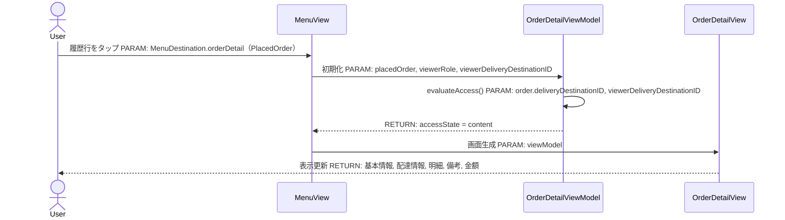
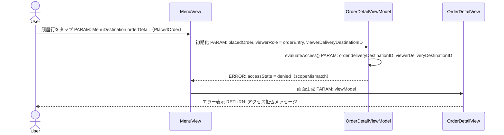
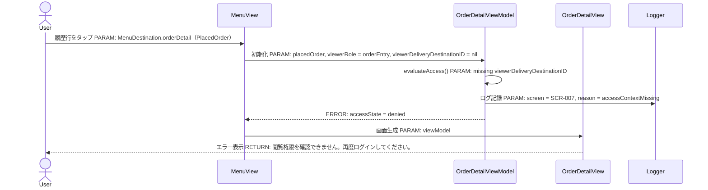
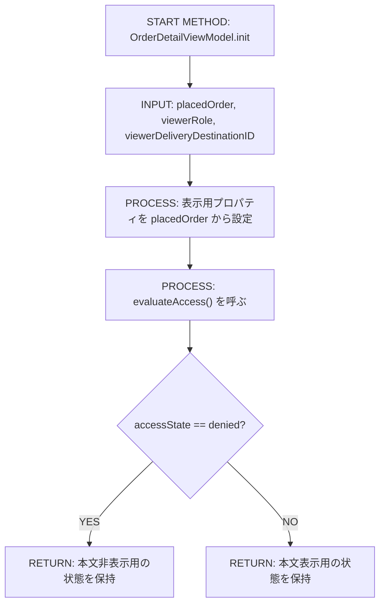
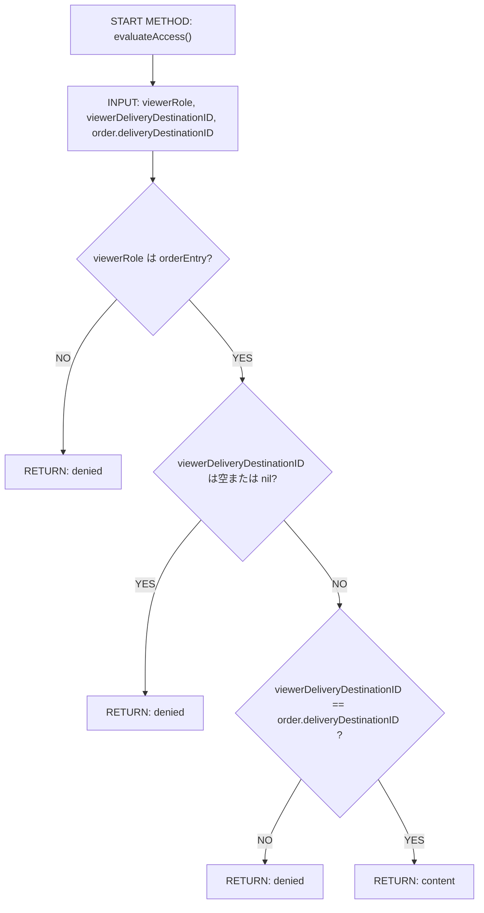
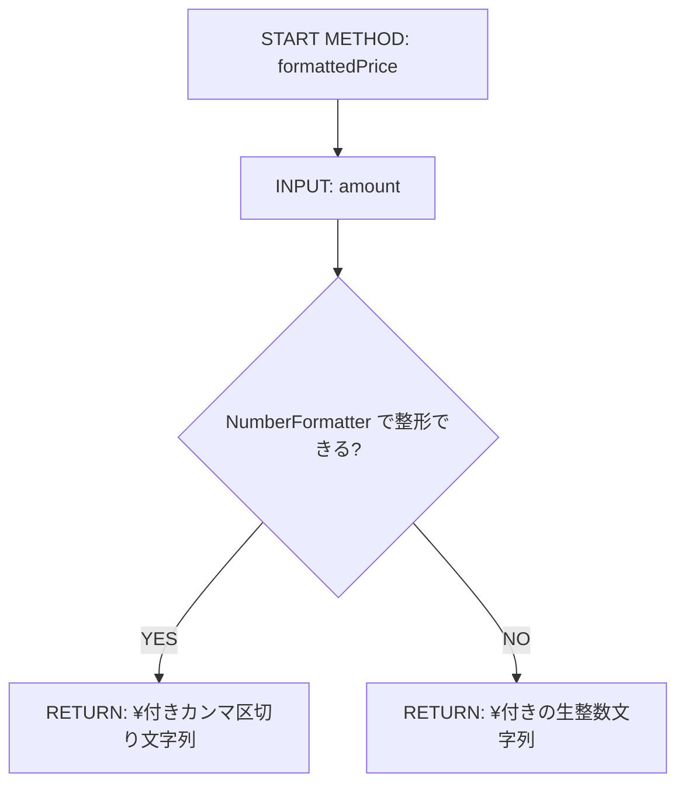
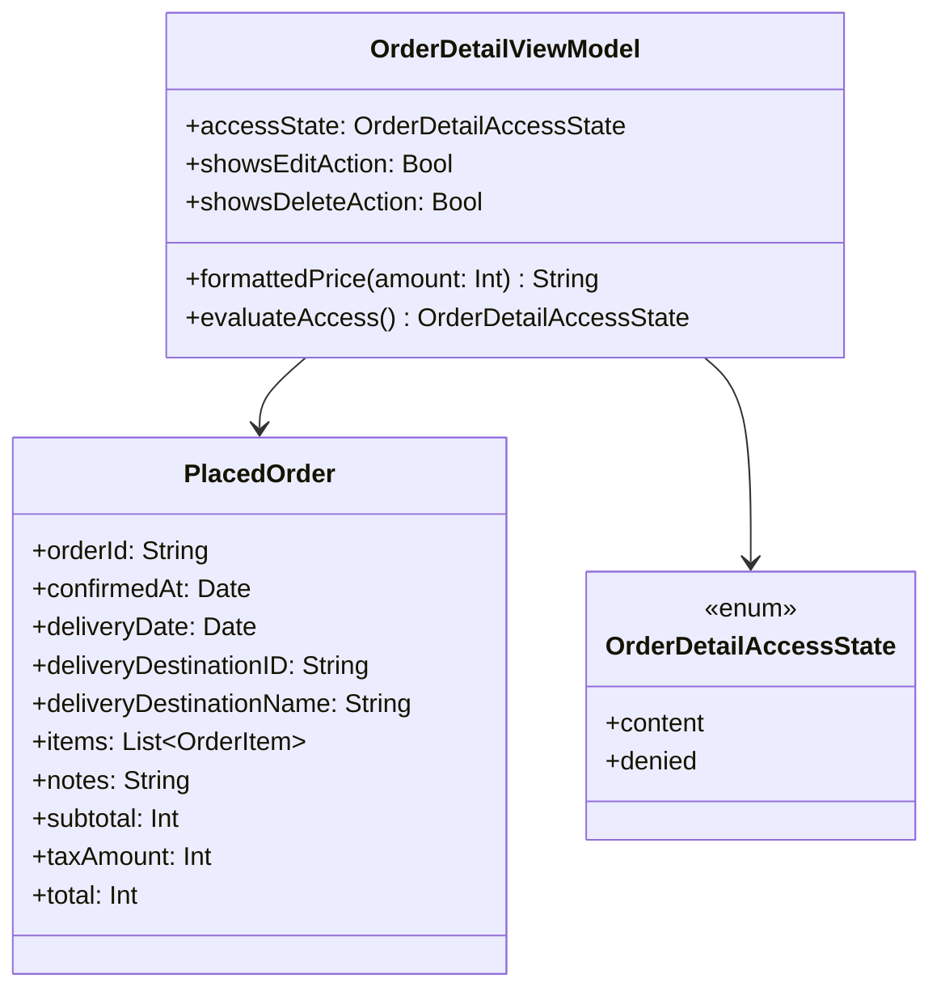

# Implementation Plan — SCR-007 注文詳細画面 iOS実装アーキテクチャ（注文入力者・参照専用スコープ）

---

## 0. 実装入力コンテキスト

| 項目 | 記入 |
| --- | --- |
| 対象Issue | `[DESIGN] SCR-007 注文詳細画面 iOS実装アーキテクチャ（注文入力者・参照専用スコープ）` |
| 対象リポジトリ内パス（実装起点） | `MilkOrder/` |
| 前提 plan | `.github/copilot/plans/scr-004-order-confirmation.md`, `.github/copilot/plans/scr-006-order-history.md`, `.github/copilot/plans/scr-007-order-detail.md` |

### 0.1 変更サマリ一覧

| 区分 | 対象 | 変更概要 |
| --- | --- | --- |
| 追加 | `OrderDetailViewModel` | `PlacedOrder` と閲覧者情報を受け取り、参照専用の表示状態と閲覧可否を管理する |
| 追加 | `OrderDetailView` | 注文詳細画面の SwiftUI 実装を追加し、閲覧可否に応じて詳細表示またはアクセス拒否表示を行う |
| 追加 | `OrderDetailViewModelTests` | 表示内容・参照専用制約・閲覧スコープ再検証の Unit テストを追加する |
| 修正 | `MilkOrder/Features/Menu/MenuView.swift` | `.orderDetail` destination を `PlaceholderView` から `OrderDetailView` へ差し替える |

### 0.2 入力制約一覧

| 制約区分 | 制約内容 | 適用対象 |
| --- | --- | --- |
| 互換性 | `MenuDestination.orderDetail(PlacedOrder)` の associated value 契約は維持する | `MenuDestination`, `MenuView`, `OrderHistoryViewModel` |
| 互換性 | `PlacedOrder` は既存フィールドを再利用し、新規モデル定義や既存項目変更を行わない | `MilkOrder/Domain/Order/PlacedOrder.swift` |
| 禁止事項 | 本スコープでは新規 Repository / DataSource / Firestore 接続を追加しない | `MilkOrder/Domain/Order/`, `MilkOrder/Infrastructure/` |
| 禁止事項 | 注文入力者向け詳細画面に編集・削除導線を追加しない | `MilkOrder/Features/OrderDetail/` |
| その他 | 閲覧可否は SCR-006 の既存フィルタに加え、SCR-007 側でも `viewerDeliveryDestinationID == order.deliveryDestinationID` を防御的に再検証する | `OrderDetailViewModel` |
| その他 | `#Preview` は `AppEnvironment.preview()` を利用し、Firebase なしで表示できるようにする | `OrderDetailView` |

### 0.3 関連機能・関連仕様一覧

| 種別 | パス/識別子 | この設計での利用目的 |
| --- | --- | --- |
| 要件 | `.github/copilot/10-requirements.md` § 4.1 No.8 | 運用側スコープが今回の対象外であることを確認する |
| 要件 | `.github/copilot/10-requirements.md` § 4.1 No.13 | 注文入力者は自分の配達先分のみ閲覧可であることを確認する |
| 要件 | `.github/copilot/10-requirements.md` § 5 | SCR-006 → SCR-007 の画面遷移契約を確認する |
| 設計方針 | `.github/copilot/20-architecture.md` | `AppEnvironment` を DI root とする方針、Preview 非Firebase方針を確認する |
| 設計方針 | `.github/copilot/30-coding-standards.md` | View と ViewModel の責務分離、`@MainActor` 方針を確認する |
| テスト方針 | `.github/copilot/40-testing-strategy.md` | XCTest による正常/例外/境界/回帰テスト方針を確認する |
| セキュリティ | `.github/copilot/50-security.md` | フェイルセーフと PII 非出力方針を確認する |
| 品質ゲート | `.github/copilot/60-ci-quality-gates.md` | build / lint / test / security の固定コマンドを確認する |
| 前提 plan | `.github/copilot/plans/scr-004-order-confirmation.md` | `PlacedOrder` の既存フィールド契約を確認する |
| 前提 plan | `.github/copilot/plans/scr-006-order-history.md` | `OrderHistoryView` / `OrderHistoryViewModel` / `MenuDestination.orderDetail(PlacedOrder)` の既存レイヤパターンを踏襲する |
| 前提 plan | `.github/copilot/plans/scr-007-order-detail.md` | 表示項目、閲覧ルール、参照専用制約、FR-01/02/04/07/10・NFR-02/03 を iOS 実装へ具体化する |
| 既存実装 | `MilkOrder/Features/Menu/MenuView.swift` | `.orderDetail` の実装置換位置を固定する |
| 既存実装 | `MilkOrder/Features/OrderHistory/OrderHistoryView.swift` | `@StateObject` の `init(viewModel:)` パターンを踏襲する |

---

## 1. 実装対象機能と機能ゴール

| 項目 | 内容 | 根拠 |
| --- | --- | --- |
| 実装対象詳細 | SCR-007 注文詳細画面の iOS 実装アーキテクチャ（注文入力者・参照専用） | Issue 1章, 3章 |
| 機能ゴール | 注文入力者が SCR-006 から注文詳細を開くと、既存の `PlacedOrder` をそのまま利用して詳細を参照でき、閲覧スコープ不一致または権限情報欠落時はフェイルセーフで詳細本文を表示しない | `.github/copilot/plans/scr-007-order-detail.md` § 5.1, § 5.4.1 |
| 非ゴール | 運用側の編集・削除導線、`orderId` ベースの再取得、Repository 追加、Firebase 接続、SCR-008 権限マトリクスの iOS 実装 | Issue 1章, 3章, 6.2 |
| 完了条件 | ① `OrderDetailViewModel` と `OrderDetailView` の責務が固定される ② Repository を採用しない理由が明記される ③ `MenuView.swift` の `.orderDetail` 差し替え内容が明記される ④ 閲覧スコープ再検証の方式が明記される ⑤ XCTest と CI 品質ゲートの実行計画が固定される | Issue 5章, 7章, 8章, 9章 |
| 受入確認手順 | 注文入力者で SCR-006 の履歴行をタップし、対象配達先一致時は注文詳細が表示され、不一致または閲覧者情報欠落時はアクセス拒否表示になることを確認する | `.github/copilot/plans/scr-007-order-detail.md` § 5.4.1 |

---

## 2. 前提・制約（SSOT）

| 種別 | 内容 | 根拠 |
| --- | --- | --- |
| 参照したSSOT | `.github/copilot/00-index.md`, `.github/copilot-instructions.md`, `.github/instructions/docs.instructions.md`, `.github/instructions/swift.instructions.md`, `.github/instructions/tests.instructions.md`, `.github/copilot/10-requirements.md`, `.github/copilot/20-architecture.md`, `.github/copilot/30-coding-standards.md`, `.github/copilot/40-testing-strategy.md`, `.github/copilot/50-security.md`, `.github/copilot/60-ci-quality-gates.md`, `.github/copilot/80-templates/implementation-plan.md` | Issue 2.1 |
| アーキテクチャ前提 | View は表示のみ、ViewModel は状態管理のみを担い、本スコープでは Repository を導入せず `PlacedOrder` と閲覧者情報だけで完結させる | Issue 4.1, 4.2, 4.4 |
| iOS バージョン要件 | 既存実装と同じく iOS 18 以上、SwiftUI と Swift Concurrency を前提とする | `.github/copilot/60-ci-quality-gates.md`, 既存実装 |
| 技術制約 | `OrderDetailViewModel` は `@MainActor` とし、初期化時に同期的に閲覧可否を決定する。非同期取得は追加しない | Issue 4.4, 6.2 |
| セキュリティ制約 | `viewerDeliveryDestinationID` 欠落時・不一致時は詳細本文を表示しない。エラー文言やログに配達先名・注文番号・備考・金額・明細を含めない | `.github/copilot/50-security.md`, `.github/copilot/plans/scr-007-order-detail.md` § 5.4.1 |
| 未確定前提（TBD） | なし。本スコープは `PlacedOrder` 直接受け渡し + 参照専用 + 防御的スコープ再検証で確定する | Issue 6.2 |

---

## 3. 要件定義（実装受入条件）

### 3.1 機能要件

| ID | 要件 | 受入条件（テスト可能な形） |
| --- | --- | --- |
| FR-01 | 注文詳細画面は `PlacedOrder` の `orderId`, `confirmedAt`, `deliveryDate`, `deliveryDestinationName`, `items`, `notes`, `subtotal`, `taxAmount`, `total` を表示する | `OrderDetailViewModel` に `PlacedOrder` を渡すと、各表示用値が入力内容と一致し、`OrderDetailView` が基本情報・配達情報・明細・備考・金額の各セクションを表示する |
| FR-02 | 注文入力者は `viewerDeliveryDestinationID == order.deliveryDestinationID` を満たす場合のみ詳細を閲覧できる | `viewerRole == .orderEntry` かつ一致時は `accessState == .content`、不一致時は `accessState == .denied` になる |
| FR-03 | SCR-006 からの既存遷移契約 `MenuDestination.orderDetail(PlacedOrder)` を維持したまま、`.orderDetail` destination を `OrderDetailView` に置き換える | `MenuView.swift` で `.orderDetail(let order)` が `OrderDetailView(viewModel:)` を返し、`OrderHistoryViewModel` や `MenuDestination` の契約を変更しない |
| FR-04 | 注文入力者向け注文詳細は常に参照専用で、編集・削除導線を表示しない | `OrderDetailViewModel` が `showsEditAction == false` と `showsDeleteAction == false` を固定で返し、View に該当ボタンが存在しない |
| FR-05 | 表示コンポーネントは基本情報・配達情報・明細・備考・金額・アクセス拒否の責務単位に分割する | `OrderDetailView` が `OrderDetailBasicInfoSection`, `OrderDetailDeliveryInfoSection`, `OrderDetailItemsSection`, `OrderDetailNotesSection`, `OrderDetailAmountSection`, `OrderDetailAccessDeniedSection` を用いて構成される |
| FR-06 | 権限情報が取得できない場合はフェイルセーフで詳細本文を表示しない | `viewerRole == .orderEntry` かつ `viewerDeliveryDestinationID == nil` の場合、`OrderDetailView` は本文セクションを描画せずアクセス拒否ビューのみ表示する |
| FR-07 | `#Preview` は Firebase なしで注文詳細を表示できる | `OrderDetailView` の Preview が `AppEnvironment.preview()` とローカルの `PlacedOrder` フィクスチャだけで成立し、Repository 注入を必要としない |

### 3.2 非機能要件

| ID | 要件 | 受入条件（テスト可能な形） |
| --- | --- | --- |
| NFR-01 | 注文詳細画面の状態管理は MainActor 上で完結する | `OrderDetailViewModel` が `@MainActor` で宣言され、View からは同期初期化のみで利用できる |
| NFR-02 | エラー表示・ログに機微情報を含めない | アクセス拒否文言は汎用文言のみとし、`deliveryDestinationName`, `orderId`, `items`, `notes`, `subtotal`, `taxAmount`, `total` を含めない |
| NFR-03 | Preview と Unit Test は Firebase なしで決定的に実行できる | `OrderDetailViewModelTests` は `PlacedOrder` フィクスチャのみで成立し、Preview は `AppEnvironment.preview()` を使う |

---

## 4. スコープ境界

### 4.0 スコープ境界の定義（機能単位）

| 区分 | 対象機能/責務 | 判定理由 |
| --- | --- | --- |
| In-Scope | `OrderDetailViewModel` による表示状態組み立て | iOS 参照専用詳細画面の中核責務 |
| In-Scope | `OrderDetailView` とそのセクション分割 | 表示項目一覧を SwiftUI に落とし込むため |
| In-Scope | `viewerDeliveryDestinationID` の防御的再検証 | FR-02 / FR-06 / FR-10 を iOS 側で担保するため |
| In-Scope | `MenuView.swift` の `.orderDetail` 差し替え | 既存 PlaceholderView を本画面へ置換するため |
| In-Scope | `OrderDetailViewModelTests` の追加 | Issue 8章のテスト要件を満たすため |
| Out-of-Scope | 運用側の編集・削除導線 | SCR-008 の権限マトリクス確定後に別設計とするため |
| Out-of-Scope | `orderId` による再取得 Repository | 参照専用スコープでは不要であり、Issue 4.3 でも新規 Firestore 接続を想定しないため |
| Out-of-Scope | `AppEnvironment` への新規 Repository 注入 | 本スコープは `PlacedOrder` 直接受け渡しで完結するため |
| Out-of-Scope | `PlacedOrder` の型変更 | 既存 plan からの再利用が前提のため |

### 4.2 実装時の影響範囲・互換性リスク

| 影響対象 | 結論（影響あり/なし/未確定） | 影響内容 |
| --- | --- | --- |
| UI/画面 | 影響あり | `.orderDetail` destination が `PlaceholderView(screenName: "注文詳細")` から `OrderDetailView` へ置き換わる |
| API/外部通信 | 影響なし | 本スコープでは外部通信や Repository を追加しない |
| データモデル | 影響なし | `PlacedOrder` は参照のみで変更しない |
| 外部依存（SPM） | 影響なし | 依存追加なし |
| CI/運用 | 影響あり | 新規 Unit テスト追加と SCR-001〜006 既存テスト回帰確認が必要 |

### 4.3 外部依存・Secrets の扱い

| 項目 | 内容 | リスク/対応 |
| --- | --- | --- |
| 外部依存の追加/更新（SPM） | なし | 依存脆弱性の新規流入を避ける |
| Secrets 利用有無 | なし | Preview / Test / 画面遷移だけで完結する |
| ログ/設定への機密混入対策 | アクセス拒否時も汎用文言のみ表示し、注文内容をログ出力しない | `.github/copilot/50-security.md` に従う |

### 4.4 4章の自己検証（必須）

| チェック項目 | 合格条件 | 判定 |
| --- | --- | --- |
| Design PR 差分を書いていないか | 実装時に変更される責務だけを書いている | OK |
| 実装責務を書いているか | In-Scope に実装責務が2件以上ある | OK |
| 実装影響を書いているか | 4.2 に `影響あり` が1件以上ある | OK |

---

## 5. アーキテクチャ設計

### 5.0 依存注入経路（DI）

本スコープでは新規 Repository を導入しない。`AppEnvironment` が保持するログインユーザー文脈から `MenuViewModel.user` を構成し、その値と `PlacedOrder` を `OrderDetailViewModel` に渡す。

| 区分 | 提供主体 | Protocol 名 | 具象実装名 | 入力 | 出力 | 境界制約 |
| --- | --- | --- | --- | --- | --- | --- |
| 記載例 | `AppEnvironment` | `MilkOrderRepository（Protocol）` | `MilkOrderRepositoryImpl` | 設定/環境値 | Repository インスタンス | View から具象を直接 import しない |
| 01 | `AppEnvironment` | — | — | `currentUser` | `MenuViewModel.user` | `AppEnvironment` に新規 Repository を追加しない |
| 02 | `MenuView.navigationDestination` | — | — | `PlacedOrder`, `viewModel.user.role`, `viewModel.user.deliveryDestinationID` | `OrderDetailViewModel` | `OrderDetailViewModel` は `PlacedOrder` と閲覧者情報だけに依存し、Repository を受け取らない |
| 03 | `OrderDetailView.init` | — | — | `OrderDetailViewModel` | `OrderDetailView` | View は `@StateObject` + `init(viewModel:)` パターンを踏襲する |

#### 5.0.1 最小固定セット（TBD禁止）

| 最小固定項目 | 固定内容 |
| --- | --- |
| DI 経路 | `AppEnvironment -> MenuViewModel.user -> OrderDetailViewModel -> OrderDetailView` |
| MainActor 境界 | `OrderDetailViewModel` に `@MainActor` を付与し、閲覧可否と表示用値の確定を MainActor 上で行う |
| Protocol/具象 境界 | 本スコープでは新規 Protocol/具象を導入しない。View / ViewModel は Repository / DataSource / Firebase SDK を import しない |

### 5.1 設計判断

#### 5.1.1 責務分離 / データフロー（詳細）

| No. | 決定事項（実装責務単位） | 根拠 | 未確定（あれば） |
| --- | --- | --- | --- |
| 1 | `OrderDetailViewModel` は `PlacedOrder`, `viewerRole`, `viewerDeliveryDestinationID` を init で受け取り、同期的に `accessState` と表示用プロパティを確定する | 参照専用スコープであり、非同期再取得を導入しない方が最小差分で既存契約と整合するため | なし |
| 2 | Repository は採用しない | SCR-006 経路が既に `PlacedOrder` を渡しており、本スコープは参照専用で Firestore 再取得が不要なため | なし |
| 3 | 閲覧スコープ検証は SCR-006 の既存フィルタに加えて SCR-007 ViewModel 側でも再検証する | FR-10 のフェイルセーフを iOS 単体でも満たすため | なし |
| 4 | `OrderDetailView` は `accessState == .content` のときのみ本文セクションを描画し、`accessState == .denied` のときはアクセス拒否ビューだけを描画する | 権限情報欠落時に詳細情報を表示しない要件を明確にするため | なし |
| 5 | 参照専用スコープでは `showsEditAction` / `showsDeleteAction` を `false` 固定で公開し、View 側に編集・削除ボタンを持ち込まない | 将来拡張に備えて表示フラグの形だけそろえつつ、現スコープの責務を超えないため | なし |
| 6 | `MenuView.swift` の `.orderDetail` case で `OrderDetailViewModel` を生成し、`PlaceholderView` を撤去する | 既存 `NavigationStack` ホストが `MenuView.swift` にあるため | なし |

#### 5.1.2 エッジケース / 例外系 / リトライ方針（詳細）

| No. | ケース | 方針（戻り値/表示/再試行） | 根拠 | 未確定（あれば） |
| --- | --- | --- | --- | --- |
| 1 | `viewerDeliveryDestinationID` が `nil` または空 | `accessState = .denied` とし、詳細本文を表示しない | FR-10, NFR-02 | なし |
| 2 | `viewerDeliveryDestinationID` と `order.deliveryDestinationID` が不一致 | `accessState = .denied` とし、詳細本文を表示しない | FR-02 | なし |
| 3 | `items` が空 | 既存 `PlacedOrder` をそのまま表示し、明細セクションは空状態メッセージではなく空リスト扱いにする | 既存モデル再利用のため | なし |
| 4 | `notes` が空文字 | 備考セクションは「備考なし」等の汎用表示に正規化する | 表示揺れ防止 | なし |
| 5 | 表示中に再取得要求が発生する | 本スコープでは再取得手段を持たず、再表示は遷移元の SCR-006 に委ねる | Repository 非採用のため | なし |

#### 5.1.3 SwiftUI View 部品一覧

| レイヤ | View/コンポーネント名（設計上の候補） | 主責務 | 対応機能 |
| --- | --- | --- | --- |
| Screen | `OrderDetailView` | 注文詳細画面全体と `accessState` に応じた状態分岐描画 | FR-01〜FR-07 |
| Section | `OrderDetailBasicInfoSection` | 注文番号・注文確定日時の表示 | FR-01 |
| Section | `OrderDetailDeliveryInfoSection` | 配達日・配達先名の表示 | FR-01 |
| Section | `OrderDetailItemsSection` | 注文明細一覧の表示 | FR-01 |
| Section | `OrderDetailNotesSection` | 備考表示 | FR-01 |
| Section | `OrderDetailAmountSection` | 税抜合計・税額・税込合計の表示 | FR-01 |
| Section | `OrderDetailAccessDeniedSection` | 閲覧不可時の汎用メッセージ表示 | FR-02, FR-06 |
| Atom | `OrderDetailDateText` | `confirmedAt` / `deliveryDate` の表示フォーマット | FR-01 |
| Atom | `OrderDetailPriceText` | 金額の `¥` 付きフォーマット | FR-01 |

#### 5.1.4 ログと観測性（漏洩防止を含む / 詳細）

| No. | 観点 | 方針 | 根拠 | 未確定（あれば） |
| --- | --- | --- | --- | --- |
| 1 | ログ出力内容 | 本スコープでは成功時ログは不要。アクセス拒否を記録する場合も画面 ID と拒否種別だけを扱う | `.github/copilot/50-security.md` | 将来 Logger 実装方式は別スコープで確定 |
| 2 | マスキング/非出力項目 | `deliveryDestinationName`, `deliveryDestinationID`, `orderId`, `items`, `notes`, `subtotal`, `taxAmount`, `total` をログ・エラー文言に含めない | NFR-02 | なし |
| 3 | エラー記録粒度 | View には「閲覧権限を確認できません。再度ログインしてください。」等の汎用文言だけを渡す | `.github/copilot/plans/scr-007-order-detail.md` § 5.4.1 | なし |

### 5.2 トレードオフ

| 判断テーマ | 案A | 案B | 採用案 | 採用理由 | 不採用理由 |
| --- | --- | --- | --- | --- | --- |
| Repository 要否 | `orderId` で再取得する Repository を先行追加する | `PlacedOrder` 直接受け渡しで完結させる | 案B | 参照専用スコープに必要な責務だけで完結し、Issue 4.3 の「新規 Firestore 接続を想定しない」と整合する | 案A は過剰設計であり、未確定の運用側経路を先取りする |
| 閲覧スコープ検証 | SCR-006 側フィルタのみに委ねる | SCR-007 ViewModel 側でも再検証する | 案B | FR-10 のフェイルセーフを詳細画面単体で担保できる | 案A は誤った呼び出し経路や将来導線に弱い |
| 将来拡張への配慮 | 今から運用側 capability flags まで受け取る | 注文入力者スコープに必要な最小入力だけに限定する | 案B | 現スコープの責務を超えず、将来は initializer 追加で拡張できる | 案A は SCR-008 未確定論点を詳細画面へ持ち込む |

### 5.3 ナビゲーション方針

| 項目 | 決定内容 | 根拠 |
| --- | --- | --- |
| ナビゲーション方式（NavigationStack / TabView / Sheet） | 既存 `MenuView` の `NavigationStack(path: $viewModel.navigationPath)` を継続利用する | `MilkOrder/Features/Menu/MenuView.swift` |
| 画面遷移の責務（誰が遷移を制御するか） | `MenuViewModel.navigationPath` を `MenuView` が保持し、`.orderDetail` destination 内で `OrderDetailViewModel` を組み立てる | 既存画面と同じ責務分担を維持するため |
| ディープリンク対応 | Out-of-Scope | 本 Issue の対象外 |
| 遷移時のデータ受け渡し方式 | `MenuDestination.orderDetail(PlacedOrder)` を維持し、追加の閲覧者情報は `MenuViewModel.user` から補完する | SCR-006 既存契約維持 |

### 5.4 アーキテクチャレイヤー方針

| レイヤ | 定義 | 許可する依存方向 | 禁止する依存 |
| --- | --- | --- | --- |
| View | `MilkOrder/Features/OrderDetail/` の SwiftUI 表示のみ | `OrderDetailViewModel` のみ | Repository / DataSource / Firebase SDK を直接 import しない |
| ViewModel | 参照専用の状態管理・閲覧可否判定・表示フォーマット | `PlacedOrder`, `UserRole` など既存 Domain 型のみ | Repository / DataSource 具象を直接 import しない |
| Repository | 本スコープでは採用しない | 該当なし | 新規追加しない |
| DataSource | 本スコープでは採用しない | 該当なし | 新規追加しない |
| Model/Entity | `PlacedOrder`, `OrderItem`, `UserRole` など既存データ構造 | なし | 他レイヤに依存しない |

### 5.5 データ取得ライフサイクル

| データ種別 | 取得タイミング | 取得場所 | 理由 |
| --- | --- | --- | --- |
| 初期表示必須データ | `.orderDetail` 遷移時 | `MenuView.navigationDestination` | SCR-006 から既に `PlacedOrder` を受け取れているため |
| ユーザー操作後データ | なし | — | 参照専用であり、画面内操作で再取得しないため |
| バックグラウンド更新 | 不採用 | — | 本スコープに自動更新要件がないため |

| キャッシュ方針 | 採用有無 | ルール |
| --- | --- | --- |
| インメモリキャッシュ | 不採用 | 遷移引数の `PlacedOrder` だけを利用し、別キャッシュを持たない |
| ディスクキャッシュ | 不採用 | 参照専用詳細画面のため不要 |

#### 5.5.1 MainActor/BackgroundActor 境界

| 対象処理 | 実行コンテキスト（MainActor/background） | 実装場所 | 禁止事項 |
| --- | --- | --- | --- |
| `accessState` と表示用プロパティの確定 | MainActor | `OrderDetailViewModel.init` | background から `@Published` を更新しない |
| 日付・金額フォーマット | MainActor | `OrderDetailViewModel` | View 側でビジネス判断をしない |
| 認証/権限判定 | MainActor | `OrderDetailViewModel.evaluateAccess()` | View で `viewerDeliveryDestinationID` 比較を重複実装しない |
| ネットワーク通信 | 該当なし | — | 非同期取得を追加しない |

### 5.6 エラーハンドリング標準形

| 分類（network/unauthorized/notfound/validation/unknown） | エラー型 | UI 表示ルール | 再試行ルール |
| --- | --- | --- | --- |
| network | 該当なし | 本スコープでは外部通信なし | 該当なし |
| unauthorized | `OrderDetailAccessState.denied` | 「閲覧権限を確認できません。再度ログインしてください。」を表示し、本文は描画しない | SCR-006 へ戻って再導線 |
| notfound | 該当なし | `PlacedOrder` が遷移引数で存在する前提 | 該当なし |
| validation | `OrderDetailAccessState.denied` | `viewerDeliveryDestinationID` 欠落時は unauthorized と同じ汎用文言 | 再ログイン後に再試行 |
| unknown | `OrderDetailAccessState.denied` | 想定外でも詳細本文は表示せず汎用文言を表示する | 再導線時に再評価 |

| ログ方針 | 内容 |
| --- | --- |
| 出力する情報 | 画面識別子 `SCR-007` と拒否種別のみ |
| 出力しない情報（Secrets/PII） | `deliveryDestinationName`, `deliveryDestinationID`, `orderId`, `items`, `notes`, `subtotal`, `taxAmount`, `total` |

#### 5.6.1 エラー変換責務（例外 → ドメインエラー）

| 変換対象 | 例外発生層 | ドメインエラーへ変換する層 | 上位層へ渡す型 | 禁止事項 |
| --- | --- | --- | --- | --- |
| 閲覧スコープ不一致 | ViewModel | ViewModel | `OrderDetailAccessState.denied` | View で不一致判定を直接持たない |
| 閲覧者情報欠落 | ViewModel | ViewModel | `OrderDetailAccessState.denied` | `nil` のまま本文描画に進まない |
| 想定外の入力不整合 | ViewModel | ViewModel | `OrderDetailAccessState.denied` | 詳細情報をエラー文言へ埋め込まない |

### 5.7 シーケンス図（Mermaid / 複数必須）

| 必須項目 | 記載ルール |
| --- | --- |
| DI 経路 | `AppEnvironment -> MenuViewModel.user -> OrderDetailViewModel -> OrderDetailView` を明記 |
| 正常系 | 1本（詳細表示） |
| 異常系 | 2本（閲覧スコープ不一致 / 閲覧者情報欠落） |
| パラメータ | 各呼び出しに `PARAM` を明記 |
| 戻り値 | 各応答に `RETURN` を明記 |
| エラー返却 | 各異常系で `ERROR` とハンドリング先を明記 |

#### 5.7.0 DI 経路（テキスト再掲 / 必須）

| No | 開始主体 | 終了主体 | Protocol 名 | 具象実装名 | 経路文字列（`A -> B -> C`） | 境界チェック観点 | 対応シーケンス図ID |
| --- | --- | --- | --- | --- | --- | --- | --- |
| 記載例 | `AppEnvironment` | `SomeScreen` | `MilkOrderRepository（Protocol）` | `MilkOrderRepositoryImpl` | `AppEnvironment -> SomeViewModel -> SomeScreen` | 具象が View/ViewModel に漏れていないこと | SEQ-01 |
| 01 | `AppEnvironment` | `OrderDetailView` | — | — | `AppEnvironment -> MenuViewModel.user -> OrderDetailViewModel -> OrderDetailView` | `AppEnvironment` に新規 Repository を追加せず、既存ユーザー文脈だけを流用していること | SEQ-01 |
| 02 | `MenuView` | `OrderDetailView` | — | — | `MenuView -> OrderDetailViewModel -> OrderDetailView` | `PlacedOrder` 契約を壊さず `PlaceholderView` を置換していること | SEQ-02 |

#### 5.7.1 シーケンス対象一覧

| 図ID | 種別（正常/異常） | 起点（画面/操作） | 終点（Repository/外部I/O） | 対応要件ID（FR/NFR） |
| --- | --- | --- | --- | --- |
| SEQ-01 | 正常 | SCR-006 の履歴行タップ | `OrderDetailView` 描画完了 | FR-01, FR-03, FR-05, FR-07 |
| SEQ-02 | 異常 | SCR-006 の履歴行タップ（配達先不一致） | `OrderDetailAccessDeniedSection` 表示 | FR-02, FR-06, NFR-02 |
| SEQ-03 | 異常 | SCR-006 の履歴行タップ（閲覧者情報欠落） | `OrderDetailAccessDeniedSection` 表示 | FR-06, NFR-02, NFR-03 |

#### 5.7.1.1 境界整合チェック（必須）

| 境界テーマ | 文章セクション | 表セクション | 図セクション | 整合判定（OK/NG） |
| --- | --- | --- | --- | --- |
| ログ責務（どの層で出力するか） | `5.1.4` | `5.6` | `5.7.4` | OK |
| エラー変換責務 | `5.1.2` | `5.6.1` | `5.7.3`, `5.7.4` | OK |
| MainActor/Background 境界 | `5.5.1` | `8.3` | `5.7.2` | OK |

#### 5.7.1.2 最小固定セット具体化チェック（必須）

| 最小固定項目 | 文章セクション | 表セクション | 図セクション | TBD残存数（0のみ可） |
| --- | --- | --- | --- | --- |
| DI 経路（`AppEnvironment -> ViewModel -> View`） | `5.0.1` | `5.0` | `5.7.0`, `5.7.2` | 0 |
| MainActor 境界（UI 更新箇所） | `5.5.1` | `5.5.1` | `5.7.2`, `5.7.4` | 0 |
| Protocol/具象 境界 | `5.0.1` | `8.3`, `8.4` | `5.7.2` | 0 |

#### 5.7.2 正常系シーケンス（必須）

#### 5.7.3 異常系シーケンス（業務エラー）

#### 5.7.4 異常系シーケンス（システムエラー）

### 5.8 処理フロー図（メソッドレベル / 複数必須）

#### 5.8.1 メソッド一覧

| 図ID | メソッド名 | 層（View/ViewModel/Repository/DataSource） | 対応要件ID（FR/NFR） |
| --- | --- | --- | --- |
| FLOW-01 | `OrderDetailViewModel.init(placedOrder:viewerRole:viewerDeliveryDestinationID:)` | ViewModel | FR-01, FR-02, FR-04, FR-06 |
| FLOW-02 | `OrderDetailViewModel.evaluateAccess()` | ViewModel | FR-02, FR-06, NFR-02 |
| FLOW-03 | `OrderDetailViewModel.formattedPrice(_:)`（diagram 上は可読性のため `amount:` 表記） | ViewModel | FR-01, NFR-03 |

#### メソッドフロー（FLOW-01）

#### メソッドフロー（FLOW-02）

#### メソッドフロー（FLOW-03）

---

## 6. 契約仕様（Protocol Contract）

### 6.0 Protocol-DI 固定前提

| 項目 | 固定方針 |
| --- | --- |
| DI 起点 | `AppEnvironment` のみで依存解決する |
| Protocol の責務 | 本スコープでは新規 Protocol を追加しない |
| 具象実装の配置 | 本スコープでは Repository / DataSource 具象を追加しない |
| View / ViewModel の責務 | `PlacedOrder` と閲覧者情報だけに依存し、具象インフラ実装を直接 import しない |

### 6.1 入出力契約（API/関数/UseCase）

| ID | 入口（画面/操作/関数） | 入力 | 出力 | エラー | 備考 |
| --- | --- | --- | --- | --- | --- |
| IFC-01 | `MenuView` の `.orderDetail` destination | `placedOrder: PlacedOrder`, `viewerRole: UserRole`, `viewerDeliveryDestinationID: String?` | `OrderDetailViewModel` | なし | `viewerRole` は `viewModel.user.role` から渡す |
| IFC-02 | `OrderDetailViewModel.init` | `placedOrder`, `viewerRole`, `viewerDeliveryDestinationID` | 表示用プロパティ、`accessState`、`showsEditAction = false`、`showsDeleteAction = false` | `OrderDetailAccessState.denied` | 同期初期化のみで完結する |
| IFC-03 | `OrderDetailView` 表示 | `OrderDetailViewModel` | 本文表示またはアクセス拒否表示 | なし | `.task` や再取得処理を持たない |

### 6.2 型/モデル/スキーマ

| ID | 対象 | 変更内容（追加/変更/削除） | 後方互換 |
| --- | --- | --- | --- |
| TYPE-01 | `OrderDetailAccessState` | 追加 | `content` / `denied` のみを持つ軽量 enum。既存モデルを壊さない |
| TYPE-02 | `OrderDetailViewModel` | 追加 | 既存 `PlacedOrder` を包む ViewModel 追加のみで既存画面に後方互換あり |
| TYPE-03 | `MenuView.swift` | 変更 | `.orderDetail` の描画先差し替えのみで `MenuDestination` の契約は維持する |

### 6.3 Protocol インターフェース定義（実装エンジニア向け固定案）

#### 6.3.1 画面入力一覧

| No. | 入力名 | Swift 形式 | 配置ファイル候補 | 備考 |
| --- | --- | --- | --- | --- |
| 1 | `placedOrder` | `PlacedOrder` | `MilkOrder/Features/OrderDetail/OrderDetailViewModel.swift` | SCR-006 既存契約の associated value |
| 2 | `viewerRole` | `UserRole` | `MilkOrder/Features/OrderDetail/OrderDetailViewModel.swift` | 本スコープでは `.orderEntry` のみを許可 |
| 3 | `viewerDeliveryDestinationID` | `String?` | `MilkOrder/Features/OrderDetail/OrderDetailViewModel.swift` | `nil` / 空文字はアクセス拒否扱い |

#### 6.3.2 ドメインモデルクラス図（Mermaid classDiagram）

#### 6.3.3 ドメイン別モデル定義（省略不可）

##### 6.3.3.1 モデル一覧

| ドメイン | 型名 | 区分（struct/class/enum/actor） | 用途 |
| --- | --- | --- | --- |
| OrderDetail | `OrderDetailViewModel` | class | 注文詳細の表示状態と閲覧可否を管理する |
| OrderDetail | `OrderDetailAccessState` | enum | 本文表示可否を `content` / `denied` で表す |
| Order | `PlacedOrder` | struct | 注文詳細の元データとして再利用する既存モデル |

##### 6.3.3.2 プロパティ詳細定義（全項目を行で列挙）

| ドメイン | 型名 | プロパティ名 | Swift 型（完全表記） | 必須（Y/N） | Optional（Y/N） | 説明 | 例 |
| --- | --- | --- | --- | --- | --- | --- | --- |
| OrderDetail | `OrderDetailViewModel` | `accessState` | `OrderDetailAccessState` | Y | N | 詳細本文を描画できるかどうか | `.content` |
| OrderDetail | `OrderDetailViewModel` | `showsEditAction` | `Bool` | Y | N | 参照専用のため `false` 固定 | `false` |
| OrderDetail | `OrderDetailViewModel` | `showsDeleteAction` | `Bool` | Y | N | 参照専用のため `false` 固定 | `false` |
| Order | `PlacedOrder` | `deliveryDestinationID` | `String` | Y | N | 閲覧スコープ再検証に使用する | `dest-001` |
| Order | `PlacedOrder` | `notes` | `String` | Y | N | 備考表示に使用する | `牛乳は午前納品希望` |

##### 6.3.3.3 列挙型/リテラル制約

| No. | 型名 | case 一覧 | 用途 |
| --- | --- | --- | --- |
| 1 | `OrderDetailAccessState` | `.content`, `.denied` | 注文詳細本文の表示可否 |
| 2 | `MenuDestination` | `.orderDetail(PlacedOrder)` | SCR-006 からの遷移契約 |

#### 6.3.4 互換性ルール

| 項目 | ルール |
| --- | --- |
| 破壊的変更の扱い | `PlacedOrder` のプロパティ変更・削除は禁止 |
| Optional 追加の扱い | `viewerDeliveryDestinationID` は `MenuView` から補完するだけで既存 Domain 型へ追加しない |
| 型名変更/移動の扱い | `OrderDetailView`, `OrderDetailViewModel`, `OrderDetailAccessState` の物理名を固定し、`Service` や `Repository` 名にしない |
| 実装側への影響確認手順 | `MenuView.swift` の `.orderDetail` 置換、SCR-006 回帰、Preview の非Firebase表示を確認する |

---

## 7. データ設計（必要な場合のみ）

| 項目 | 内容 | 互換性/移行 |
| --- | --- | --- |
| スキーマ変更（CoreData/UserDefaults 等） | なし | 既存永続化に影響なし |
| マイグレーション方針 | 該当なし | — |
| 既存データ影響 | なし。`PlacedOrder` をそのまま参照する | — |
| ロールバック方針 | `.orderDetail` destination を `PlaceholderView` に戻せば機能ロールバック可能 | 変更箇所が `MenuView.swift` と新規画面に局所化される |

---

## 8. 実装指示（製造 Agent 向け）

### 8.1 変更予定ファイル一覧（必須）

| No. | パス | 区分（View/ViewModel/Repository/DataSource/Model/Test/Other） | 変更タイプ（追加/変更/削除） | 実装内容（具体） | 完了条件 |
| --- | --- | --- | --- | --- | --- |
| 1 | `MilkOrder/Features/OrderDetail/OrderDetailViewModel.swift` | ViewModel | 追加 | `PlacedOrder` と閲覧者情報を受け取り、`accessState` と表示用値を提供する `@MainActor` ViewModel を追加する | FR-01〜FR-06 を Unit テストで検証できる |
| 2 | `MilkOrder/Features/OrderDetail/OrderDetailView.swift` | View | 追加 | 本文セクション群とアクセス拒否ビュー、`#Preview` を持つ SwiftUI 画面を追加する | `@StateObject` の `init(viewModel:)` パターンで表示できる |
| 3 | `MilkOrder/Features/Menu/MenuView.swift` | Other | 変更 | `.orderDetail` case を `OrderDetailView(viewModel:)` に差し替え、`viewModel.user` から閲覧者情報を注入する | `PlaceholderView` ではなく注文詳細画面へ遷移する |
| 4 | `MilkOrderTests/Features/OrderDetail/OrderDetailViewModelTests.swift` | Test | 追加 | 表示内容一致、参照専用、閲覧スコープ一致/不一致/欠落、Preview 非依存、既存遷移回帰の Unit テストを追加する | Issue 8章のケースを満たす |

### 8.2 実装手順（順序付き）

| 手順 | 作業内容 | 対象ファイル/モジュール | 完了条件 |
| --- | --- | --- | --- |
| 1 | `OrderDetailViewModel` を追加し、`accessState` と表示用プロパティを実装する | `OrderDetailViewModel.swift` | 参照専用制約と閲覧スコープ再検証がコード化される |
| 2 | `OrderDetailView` と各 Section/Atom を実装し、本文表示とアクセス拒否表示を分岐する | `OrderDetailView.swift` | `PlacedOrder` の全表示項目が描画できる |
| 3 | `MenuView.swift` の `.orderDetail` を差し替え、`PlaceholderView` を撤去する | `MenuView.swift` | SCR-006 から注文詳細へ遷移できる |
| 4 | `OrderDetailViewModelTests` を追加し、正常/例外/境界/回帰テストを実装する | `OrderDetailViewModelTests.swift` | Unit テストで FR/NFR を担保できる |
| 5 | 品質ゲートを実行する | リポジトリ全体 | build / lint / test / security の結果を確認する |

### 8.3 実装禁止事項（ガードレール）

| 項目 | 内容 | 根拠 |
| --- | --- | --- |
| 禁止事項-1 | `PlacedOrder` のプロパティ追加・削除・意味変更をしない | Issue 2.2 |
| 禁止事項-2 | `OrderDetailView` / `OrderDetailViewModel` から Repository / DataSource / Firebase SDK を直接 import しない | Issue 4.1, 4.3 |
| 禁止事項-3 | 参照専用スコープで編集・削除ボタンを追加しない | `.github/copilot/plans/scr-007-order-detail.md` § 5.2 |
| 禁止事項-4 | `MenuDestination.orderDetail(PlacedOrder)` を `orderId` 専用契約へ変更しない | SCR-006 既存遷移契約維持 |
| 禁止事項-5 | 配達先名・注文番号・備考・金額・明細をアクセス拒否文言やログへ出力しない | `.github/copilot/50-security.md` |

### 8.4 モジュール/アクセス制御方針

| 項目 | 設定内容 | 検証方法 |
| --- | --- | --- |
| アクセス制御方針 | ViewModel 内部の判定ヘルパーとフォーマッタは `private`、View から参照する状態のみ `private(set)` または読み取り専用で公開する | コードレビュー |
| 依存強制 | `OrderDetailViewModel` は `PlacedOrder` と既存 Domain 型以外を初期化引数に持たない | コードレビュー |
| Preview 方針 | `OrderDetailView` の Preview は `AppEnvironment.preview()` とローカル `PlacedOrder` フィクスチャのみを使う | Preview 表示確認 |
| CI での強制 | `swiftlint lint --strict`, `xcodebuild build`, `xcodebuild test`, `swift package audit` を実行する | GitHub Actions / ローカル実行 |

---

## 9. テスト実装計画

### 9.0 テスト方針

| 項目 | 内容 |
| --- | --- |
| 対象 | `OrderDetailViewModel` |
| 方式 | Unit（XCTest） |
| モック方針 | Repository を採用しないため、`PlacedOrder` のテストフィクスチャだけで検証する |
| 実行コマンド | `xcodebuild test -scheme MilkOrder -destination 'platform=iOS Simulator,name=iPhone 17'` |

### 9.1 テストケース

| 区分（正常/例外/境界/回帰） | パターン名 | 対象 | シナリオ | 期待結果 |
| --- | --- | --- | --- | --- |
| 正常 | 表示項目一致 | `OrderDetailViewModel` | `PlacedOrder` を渡して初期化する | 表示用値が `PlacedOrder` の内容と一致する |
| 正常 | 参照専用導線 | `OrderDetailViewModel` | 任意の `PlacedOrder` で初期化する | `showsEditAction == false` かつ `showsDeleteAction == false` |
| 正常 | 閲覧スコープ一致 | `OrderDetailViewModel` | `viewerDeliveryDestinationID == order.deliveryDestinationID` | `accessState == .content` |
| 例外 | 閲覧スコープ不一致 | `OrderDetailViewModel` | 異なる `viewerDeliveryDestinationID` を渡す | `accessState == .denied` |
| 例外 | 閲覧者情報欠落 | `OrderDetailViewModel` | `viewerDeliveryDestinationID = nil` | `accessState == .denied` |
| 境界 | 備考空文字 | `OrderDetailViewModel` | `notes = ""` の `PlacedOrder` を渡す | 備考表示が空白崩れせず汎用表示になる |
| 境界 | 明細空配列 | `OrderDetailViewModel` | `items = []` の `PlacedOrder` を渡す | ViewModel がクラッシュせず表示状態を返す |
| 回帰 | `.orderDetail` 既存契約維持 | `MenuView.swift` | `MenuDestination.orderDetail(PlacedOrder)` を使って遷移する | `OrderHistoryViewModel` 側のクロージャ契約を変更せず詳細画面へ遷移できる |
| 回帰 | Preview 非Firebase | `OrderDetailView` Preview | `AppEnvironment.preview()` を使う | Firebase なしで Preview が成立する |
| 回帰 | SCR-001〜006 既存テスト | リポジトリ全体 | 注文詳細実装後に既存テストを再実行する | 既存テストが PASS する |

| 網羅チェック | 判定（Y/N） | 根拠 |
| --- | --- | --- |
| 正常パターンを網羅している | Y | 表示項目・参照専用・一致ケースをカバー |
| 例外パターンを網羅している | Y | 不一致・欠落ケースをカバー |
| 境界パターンを網羅している | Y | 備考空文字・明細空配列をカバー |
| 回帰パターンを網羅している | Y | `.orderDetail` 契約維持・Preview 非依存・既存テスト再実行を含む |

### 9.2 CI品質ゲート実行計画

| ゲート | コマンド | 判定基準 |
| --- | --- | --- |
| build | `xcodebuild build -scheme MilkOrder -destination 'platform=iOS Simulator,name=iPhone 17'` | 注文詳細画面追加後もビルド成功 |
| lint | `swiftlint lint --strict` | 0 violations |
| test | `xcodebuild test -scheme MilkOrder -destination 'platform=iOS Simulator,name=iPhone 17'` | 新規 `OrderDetailViewModelTests` と SCR-001〜006 既存テストが PASS |
| security | `swift package audit` | 既知の依存脆弱性が検出されない |

---

## 10. オープン課題 / ADR

| 論点 | 現状 | 決定期限/担当 | ADR要否（要/不要/TBD） |
| --- | --- | --- | --- |
| 運用側 capability flags の iOS 取り込み | 本スコープでは扱わない。SCR-008 権限マトリクス確定後に別 Issue で設計する | SCR-008 設計確定後 / 設計担当 | 不要 |
| `orderId` ベース再取得経路の追加 | 本スコープでは不要。運用側 iOS 実装が必要になった時点で Repository 導入を再評価する | 運用側 iOS 実装着手前 / 設計担当 | 不要 |

### 10.1 TBD 回収トラッキング（必須）

| TBD論点 | 現在の記載箇所（章/項目） | 解決ゲート（必須） | BLOCKER（Yes/No） | RESOLVE_IN（必須） | DEFAULT/ASSUMPTION（任意） | ADR記録先（必要時） |
| --- | --- | --- | --- | --- | --- | --- |
| なし | — | — | No | — | 本 plan は注文入力者・参照専用スコープとして確定済み | 不要 |

