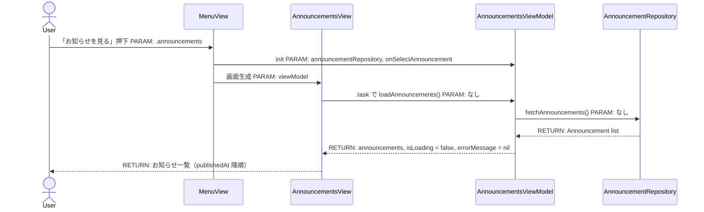
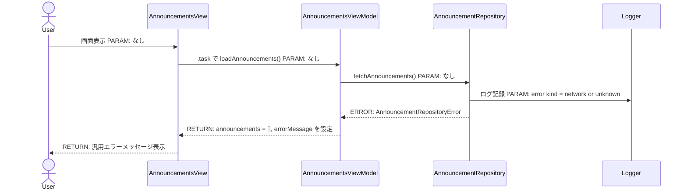
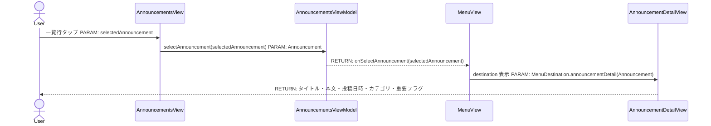
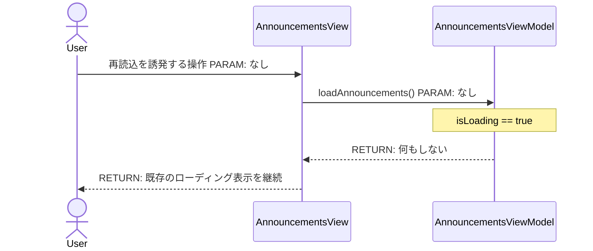
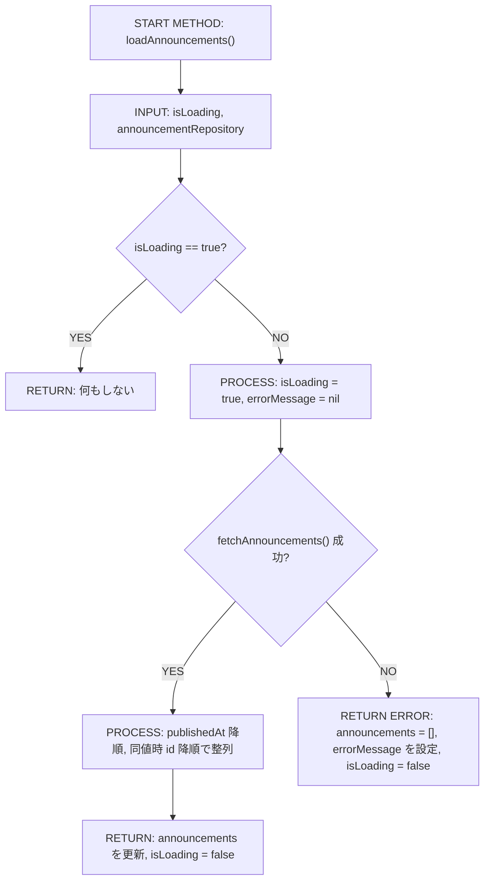
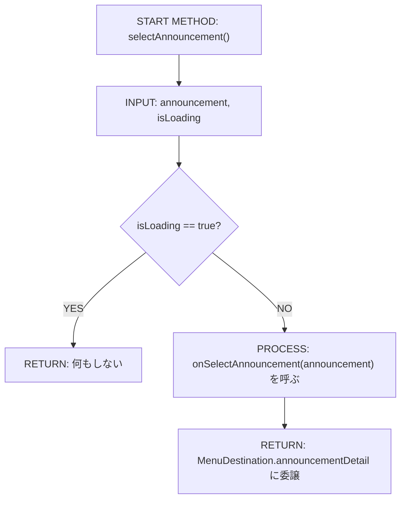
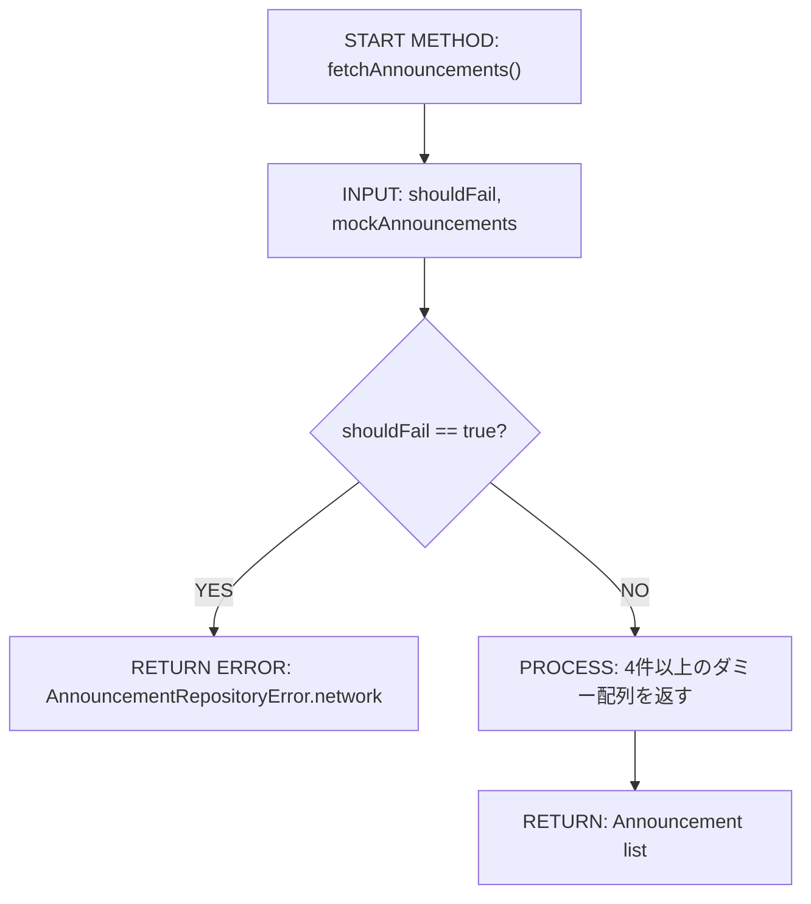
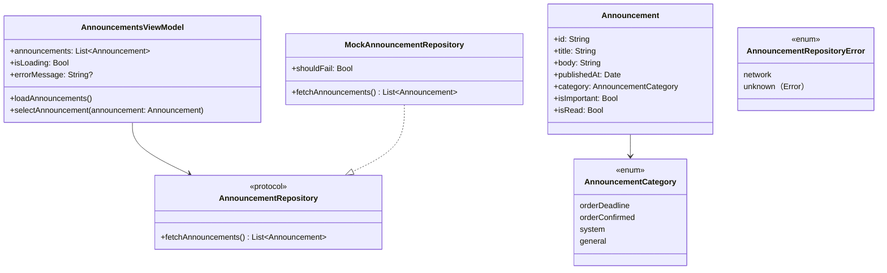

# Implementation Plan — SCR-016 / SCR-017 お知らせ一覧画面・お知らせ詳細画面

---

## 0. 実装入力コンテキスト

| 項目 | 記入 |
| --- | --- |
| 対象Issue | `[DESIGN] SCR-016 お知らせ一覧画面 / SCR-017 お知らせ詳細画面` |
| 対象リポジトリ内パス（実装起点） | `MilkOrder/` |
| 前提 plan | `.github/copilot/plans/scr-001-login.md`（`AuthUser`, `AppEnvironment`）, `.github/copilot/plans/scr-002-menu.md`（`MenuDestination.announcements`, `NavigationStack`）, `.github/copilot/plans/scr-006-order-history.md`（一覧取得画面の `@StateObject` / `@MainActor` / 行選択委譲パターン） |

### 0.1 変更サマリ一覧

| 区分 | 対象 | 変更概要 |
| --- | --- | --- |
| 追加 | `Announcement` | お知らせ本体モデルを `MilkOrder/Domain/Announcement/Announcement.swift` に追加する |
| 追加 | `AnnouncementCategory` | お知らせ種別 enum を `Announcement.swift` 内に追加する |
| 追加 | `AnnouncementRepository` | お知らせ取得抽象を `MilkOrder/Domain/Announcement/AnnouncementRepository.swift` に追加する |
| 追加 | `AnnouncementRepositoryError` | お知らせ取得失敗時のドメインエラー型を追加する |
| 追加 | `MockAnnouncementRepository` | 4件以上・全 category 含む・重要件名を1件以上含むダミーデータを返す Mock 実装を追加する |
| 追加 | `AnnouncementsViewModel` | お知らせ取得・降順整列・空状態/エラー状態管理・詳細遷移委譲を担う |
| 追加 | `AnnouncementsView` | お知らせ一覧画面（ローディング・空状態・エラー・一覧表示）を追加する |
| 追加 | `AnnouncementRowView` | タイトル・日付・カテゴリ・重要フラグを表示する一覧行を追加する |
| 追加 | `AnnouncementDetailView` | タイトル・本文・投稿日時・カテゴリ・重要フラグを表示する詳細画面を追加する |
| 修正 | `AppEnvironment` | `announcementRepository: any AnnouncementRepository` を追加し DI 起点を固定する |
| 修正 | `MenuDestination` | `.announcementDetail(Announcement)` を追加し一覧→詳細の push 遷移を型安全にする |
| 修正 | `MilkOrder/Features/Menu/MenuView.swift` | `.announcements` destination を `AnnouncementsView` に差し替え、`.announcementDetail(Announcement)` destination を追加する |
| 修正 | `MilkOrder/MilkOrderApp.swift` | `MockAnnouncementRepository` を `AppEnvironment` 初期化へ追加し、MenuRootView へ新しい Repository を渡せるようにする |
| 追加 | `AnnouncementsViewModelTests` | ViewModel の Unit テスト（正常/例外/境界/回帰）を追加する |

### 0.2 入力制約一覧

| 制約区分 | 制約内容 | 適用対象 |
| --- | --- | --- |
| 禁止事項 | お知らせの作成・編集・削除機能を追加しない | `MilkOrder/Features/Announcements/`, `MilkOrder/Domain/Announcement/` |
| 禁止事項 | プッシュ通知・メール通知・既読更新処理を実装しない | `Announcement`, `AnnouncementsViewModel`, `AnnouncementRepository` |
| 禁止事項 | `AnnouncementsView` / `AnnouncementsViewModel` から Mock/Firebase 具象を直接 import しない | `MilkOrder/Features/Announcements/` |
| 禁止事項 | `AnnouncementDetailView` 専用 ViewModel を追加しない | `MilkOrder/Features/Announcements/AnnouncementDetailView.swift` |
| 禁止事項 | `AnnouncementCategory` に UI 依存型（`Color`, `Image` など）を持ち込まない | `MilkOrder/Domain/Announcement/Announcement.swift` |
| 互換性 | `AppEnvironment` に Repository を追加しても SCR-001〜006 の既存テストを壊さない | `AppEnvironment`, `MilkOrderApp`, 既存 Tests |
| 互換性 | `MenuDestination` への `.announcementDetail(Announcement)` 追加で既存 case の振る舞いを変えない | `MenuDestination`, `MenuViewModel`, `MenuView` |
| その他 | Issue 本文中の `MilkOrderApp.swift` による destination 接続記載は、現行実装の `MenuView.swift` が `NavigationStack` ホストであるため読み替えて扱う | `MilkOrder/Features/Menu/MenuView.swift`, `MilkOrder/MilkOrderApp.swift` |
| その他 | 閲覧対象は全ロールだが未認証ユーザーは画面に到達できない前提とする | `MilkOrderApp`, `MenuRootView`, `AnnouncementsView` |
| その他 | ワイヤーフレーム未入手のため、画面形状は要件本文と既存一覧画面パターンを正とする。後日ワイヤーフレーム入手時は 5.1.3 と 1章の受入確認のみ更新対象 | `AnnouncementsView`, `AnnouncementDetailView` |
| その他 | `#Preview` / Demo では Firebase を使わず `AppEnvironment.preview()` の Mock で動作させる | `AnnouncementsView`, `AnnouncementDetailView`, `AppEnvironment` |

### 0.3 関連機能・関連仕様一覧

| 種別 | パス/識別子 | この設計での利用目的 |
| --- | --- | --- |
| 要件 | `.github/copilot/10-requirements.md` § 4.1 No.14 | 初期版はアプリ内通知閲覧を対象とする要件確認 |
| 要件 | `.github/copilot/10-requirements.md` § 5 | SCR-016 / SCR-017 の画面一覧と遷移確認 |
| 設計方針 | `.github/copilot/20-architecture.md` | `AppEnvironment` DI root、Firebase 命名規則、Preview 分離確認 |
| 設計方針 | `.github/copilot/30-coding-standards.md` | View / ViewModel / Repository 分離、`async/await`, `@MainActor` の確認 |
| 設計方針 | `.github/copilot/40-testing-strategy.md` | XCTest 前提・モック隔離・正常/例外/境界/回帰の粒度確認 |
| セキュリティ | `.github/copilot/50-security.md` | PII 非出力、ログの取り扱い、未認証アクセス禁止の確認 |
| 品質ゲート | `.github/copilot/60-ci-quality-gates.md` | build / lint / test / security コマンド固定 |
| 前提 plan | `.github/copilot/plans/scr-001-login.md` | `AuthUser.role`, `AppEnvironment`, `currentUser` 前提の確認 |
| 前提 plan | `.github/copilot/plans/scr-002-menu.md` | `MenuDestination.announcements` と `NavigationStack` 前提の確認 |
| 前提 plan | `.github/copilot/plans/scr-006-order-history.md` | 一覧取得画面の `onSelect` 委譲と `@StateObject init(viewModel:)` パターン参照 |
| 既存実装 | `MilkOrder/App/AppEnvironment.swift` | Repository DI 追加対象の確認 |
| 既存実装 | `MilkOrder/App/MenuDestination.swift` | `.announcementDetail(Announcement)` 追加対象の確認 |
| 既存実装 | `MilkOrder/Features/Menu/MenuView.swift` | 現行 `NavigationStack` / `.navigationDestination` の実装位置確認 |
| 既存実装 | `MilkOrder/Features/OrderHistory/OrderHistoryView.swift` | 一覧画面の状態分岐と `@StateObject` 保持パターン確認 |
| 既存実装 | `MilkOrder/Features/OrderHistory/OrderHistoryViewModel.swift` | `@MainActor`, 二重取得防止, エラー表示パターン確認 |

---

## 1. 実装対象機能と機能ゴール

| 項目 | 内容 | 根拠 |
| --- | --- | --- |
| 実装対象詳細 | SCR-016 お知らせ一覧画面（`AnnouncementsView` + `AnnouncementsViewModel` + `AnnouncementRepository` + `MockAnnouncementRepository`）と SCR-017 お知らせ詳細画面（`AnnouncementDetailView`） | `.github/copilot/10-requirements.md` § 5 |
| 機能ゴール | 認証済みユーザーがメニューの「お知らせを見る」から一覧画面を開くと、運用側が配信したお知らせを `publishedAt` 降順で閲覧でき、任意行タップで詳細画面へ push 遷移して本文を確認できる | Issue 本文 1章, 5章, 6.2 |
| 非ゴール | お知らせ配信管理、通知設定、プッシュ通知、メール通知、既読更新、Firestore 実接続、Staging/Production 設定変更 | Issue 本文 3章・非ゴール |
| 完了条件 | ① `AppEnvironment -> AnnouncementsViewModel -> AnnouncementsView -> AnnouncementDetailView` の DI / 表示経路で実装される ② `Announcement` の全プロパティと `AnnouncementCategory` / `AnnouncementRepository` 契約が固定される ③ 一覧は `publishedAt` 降順で表示される ④ 0件時は「お知らせはありません」の空状態を表示する ⑤ 行タップで `.announcementDetail(Announcement)` に遷移する ⑥ 詳細画面にタイトル・本文・投稿日時・カテゴリ・重要フラグを表示する ⑦ `#Preview` が Firebase なしで動作する ⑧ build / lint / test / security の品質ゲート計画が満たされる | Issue 本文 5章, 7章, 8章 |
| 受入確認手順 | `demo@example.com` でログイン → メニュー「お知らせを見る」 → 一覧が新しい順で表示されることを確認 → 重要バッジ付き行を含む任意行をタップ → 詳細画面でタイトル・本文・カテゴリ・投稿日時を確認 | `.github/copilot/10-requirements.md` § 5、Issue 本文 6.2 |

---

## 2. 前提・制約（SSOT）

| 種別 | 内容 | 根拠（ファイル/ADR/Issue） |
| --- | --- | --- |
| 参照したSSOT | `.github/copilot/00-index.md`, `.github/copilot-instructions.md`, `.github/instructions/docs.instructions.md`, `.github/instructions/swift.instructions.md`, `.github/instructions/tests.instructions.md`, `.github/copilot/10-requirements.md`, `.github/copilot/20-architecture.md`, `.github/copilot/30-coding-standards.md`, `.github/copilot/40-testing-strategy.md`, `.github/copilot/50-security.md`, `.github/copilot/60-ci-quality-gates.md`, `.github/copilot/80-templates/implementation-plan.md` | SSOT 参照順 / Issue 本文 2.1 |
| アーキテクチャ前提（View/ViewModel/Repository） | `AppEnvironment` を DI root とし、`AnnouncementsViewModel` は `AnnouncementRepository` Protocol のみに依存、`AnnouncementDetailView` は `Announcement` を直接保持する。現行コードで `NavigationStack` ホストは `MenuView` のため destination 接続はそこへ追加する | Issue 本文 4.1, 4.2, 6.3、既存実装 `MilkOrder/Features/Menu/MenuView.swift` |
| iOS バージョン要件 | iOS 18 以上を前提に `NavigationStack` / Swift Concurrency を使用する | 既存 plan の共通前提、`.github/copilot/60-ci-quality-gates.md` |
| 技術制約（互換性/期限/運用/セキュリティ） | `AnnouncementsViewModel` に `@MainActor` を付与し、取得は `async/await` で Main スレッドをブロックせず実行する。詳細画面は専用 ViewModel を作らず表示専用とする。本文・ユーザー名はログ出力しない | Issue 本文 4.4, 6.3, 6.7 |
| 未確定前提（TBD） | TBD（将来の `FirestoreAnnouncementRepository` におけるクエリ条件・Index・例外マッピング詳細は API 設計フェーズで確定する。SCR-016/017 実装は Mock と Protocol 契約のみで開始可能 / Firestore 実装要件確定 / API 設計フェーズ） | Issue 本文 4.3, 6.4 |

---

## 3. 要件定義（実装受入条件）

### 3.1 機能要件

| ID | 要件 | 受入条件（テスト可能な形） |
| --- | --- | --- |
| FR-01 | メニューの「お知らせを見る」押下で SCR-016 を表示する | `MenuDestination.announcements` の destination が `AnnouncementsView` に接続される |
| FR-02 | 画面表示時にお知らせ一覧を取得し `publishedAt` 降順で表示する | `AnnouncementsView` の初期表示で `AnnouncementsViewModel.loadAnnouncements()` が1回実行され、`announcements` が `publishedAt` 降順、同値時は `id` 降順で整列される |
| FR-03 | 各一覧行にタイトル・投稿日・カテゴリ・重要フラグを表示する | `AnnouncementRowView` に `title`, `publishedAt`, `category`, `isImportant` が表示される |
| FR-04 | お知らせが0件の場合は空状態ビューを表示する | `announcements.isEmpty == true` かつ `errorMessage == nil` のとき「お知らせはありません」が表示される |
| FR-05 | 一覧行タップで SCR-017 へ push 遷移する | `AnnouncementsViewModel.selectAnnouncement(_:)` が `onSelectAnnouncement` を呼び、`MenuDestination.announcementDetail(selectedAnnouncement)` が `navigationPath` に追加される |
| FR-06 | 詳細画面にタイトル・本文・投稿日時・カテゴリ・重要フラグを表示する | `AnnouncementDetailView(announcement:)` が `announcement.title`, `body`, `publishedAt`, `category`, `isImportant` を表示する |
| FR-07 | カテゴリごとに視覚的に区別する | `AnnouncementCategory` ごとに SF Symbol と色を切り替えつつ、カテゴリ名のテキストも併記する |
| FR-08 | `isImportant == true` のお知らせは強調表示する | 一覧行と詳細画面の両方で赤系の「重要」カプセルバッジを表示する |
| FR-09 | `MockAnnouncementRepository` は 4件以上・全 category・重要件名1件以上を返す | 返却配列に `orderDeadline`, `orderConfirmed`, `system`, `general` がすべて含まれ、`isImportant == true` が1件以上ある |
| FR-10 | お知らせ取得失敗時は一覧の代わりにエラーメッセージを表示する | `AnnouncementRepositoryError.network` または `.unknown(Error)` 時に `errorMessage` が非 nil になり、ローディング/一覧/空状態より優先表示される |
| FR-11 | `isLoading == true` 中の再ロード呼び出しは無視し二重取得しない | `loadAnnouncements()` 実行中に再度 `loadAnnouncements()` を呼んでも Repository 呼び出し回数が増えない |
| FR-12 | `Announcement.isRead` は初期版で保持のみ行い表示/更新動作には使わない | 生成される Mock データは `isRead = false` で固定し、ViewModel / View は既読状態を分岐条件に使わない |
| FR-13 | `#Preview` / Demo は Firebase 初期化なしで一覧・詳細を表示できる | `AnnouncementsView` と `AnnouncementDetailView` の Preview が `AppEnvironment.preview()` 由来の Mock データのみで成立する |

### 3.2 非機能要件

| ID | 要件 | 受入条件（テスト可能な形） |
| --- | --- | --- |
| NFR-01 | お知らせ取得は Main スレッドをブロックしない | `AnnouncementsViewModel` は `@MainActor`、Repository は `async/await`、View は `.task { await ... }` で起動する |
| NFR-02 | ログ/エラー表示にお知らせ本文・ユーザー名などの機微情報を出さない | ログ出力はエラー種別のみとし、UI には汎用文言のみを表示する |
| NFR-03 | 未認証ユーザーはお知らせ画面へ到達できない | `MilkOrderApp` の `if let user = environment.currentUser` 分岐配下でのみ `MenuRootView` が表示される |
| NFR-04 | Preview / Demo / Unit Test は Firebase なしで決定的に実行できる | `MockAnnouncementRepository` を利用し、ネットワーク依存なしで画面とテストが成立する |
| NFR-05 | 品質ゲートとして `build` / `lint` / `test` / `security` の実行計画を plan に固定する | 9.2 に指定コマンドと判定基準が明記されている |

---

## 4. スコープ境界

### 4.0 スコープ境界の定義（機能単位）

| 区分（In-Scope/Out-of-Scope） | 対象機能/責務 | 判定理由 |
| --- | --- | --- |
| In-Scope | `Announcement` / `AnnouncementCategory` モデル定義 | Issue 本文 6.4 の契約固定 |
| In-Scope | `AnnouncementRepository` / `AnnouncementRepositoryError` | Firestore 差し替え可能な抽象境界の固定 |
| In-Scope | `MockAnnouncementRepository` | Demo / Preview / Unit Test 成立に必須 |
| In-Scope | `AnnouncementsViewModel`（取得・整列・状態管理・詳細遷移委譲） | ViewModel 責務 |
| In-Scope | `AnnouncementsView` / `AnnouncementRowView` | SCR-016 画面要件 |
| In-Scope | `AnnouncementDetailView` | SCR-017 画面要件 |
| In-Scope | `AppEnvironment` への `announcementRepository` 追加 | DI root 固定要件 |
| In-Scope | `MenuDestination.announcementDetail(Announcement)` と destination 更新 | SCR-016 → SCR-017 遷移契約の固定 |
| In-Scope | `AnnouncementsViewModelTests` | Issue 本文 8章テスト要件 |
| Out-of-Scope | お知らせの作成・編集・削除 | 管理側スコープ（SCR-013） |
| Out-of-Scope | プッシュ通知・メール通知送信 | Issue 本文 非ゴール |
| Out-of-Scope | `isRead` の更新・既読UI・バッジカウント | 初期版 Out-of-Scope |
| Out-of-Scope | Firestore 実接続・Firebase 設定変更 | API 設計 / 実装フェーズで対応 |

### 4.2 実装時の影響範囲・互換性リスク

| 影響対象 | 結論（影響あり/なし/未確定） | 影響内容 |
| --- | --- | --- |
| UI/画面 | 影響あり | `.announcements` destination が `PlaceholderView` から `AnnouncementsView` に差し替わり、SCR-017 の詳細画面が追加される |
| API/外部通信 | 影響なし | 初期版は `MockAnnouncementRepository` のみ利用し、Firestore 通信は実装しない |
| データモデル | 影響あり | `Announcement` / `AnnouncementCategory` / `AnnouncementRepositoryError` が新規追加される |
| ナビゲーション | 影響あり | `MenuDestination` に `.announcementDetail(Announcement)` が追加される |
| AppEnvironment | 影響あり | `announcementRepository` 追加により初期化シグネチャと Preview 注入が増える |
| 外部依存（SPM） | 影響なし | パッケージ追加なし |
| CI/運用 | 影響あり | SCR-001〜006 回帰確認と SCR-016 新規 ViewModel テスト追加が必要 |

### 4.3 外部依存・Secrets の扱い

| 項目 | 内容 | リスク/対応 |
| --- | --- | --- |
| 外部依存の追加/更新（SPM） | なし | 新たな脆弱性リスクを持ち込まない |
| Secrets 利用有無 | なし | Preview / Demo / Unit Test は Mock のみ利用する |
| ログ/設定への機密混入対策 | お知らせ本文・ユーザー名・配達先名をログ出力しない | `.github/copilot/50-security.md` に従い、エラー区分のみ扱う |

### 4.4 4章の自己検証（必須）

| チェック項目 | 合格条件 | 判定 |
| --- | --- | --- |
| Design PR 差分を書いていないか | `plans/*.md` の変更自体ではなく、実装時の責務のみを書いている | OK |
| 実装責務を書いているか | In-Scope に実装責務が2件以上ある | OK（9件） |
| 実装影響を書いているか | 4.2 で `影響あり/未確定` が1件以上あり、影響内容が具体記述されている | OK（UI/データモデル/ナビゲーション/AppEnvironment/CI） |

---

## 5. アーキテクチャ設計

### 5.0 依存注入経路（DI）

本プロジェクトは Protocol ベースの依存注入を採用する。View は Protocol に依存し、具象実装を直接 import しない。

| 区分（記載例/追記No） | 提供主体 | Protocol 名 | 具象実装名 | 入力（型/値） | 出力（型/値） | 境界制約（禁止事項を含む） |
| --- | --- | --- | --- | --- | --- | --- |
| 記載例 | `AppEnvironment` | `MilkOrderRepository（Protocol）` | `MilkOrderRepositoryImpl` | 設定/環境値 | Repository インスタンス | View から具象を直接 import しない |
| 01 | `AppEnvironment` | `AnnouncementRepository（Protocol）` | `MockAnnouncementRepository` | — | `any AnnouncementRepository` | `AnnouncementsView` / `AnnouncementsViewModel` から Mock 具象を直接 import しない |
| 02 | `AnnouncementsViewModel.init` | `AnnouncementRepository（Protocol）` | — | `announcementRepository`, `onSelectAnnouncement` | `AnnouncementsViewModel` | ViewModel は Protocol のみに依存し、`MenuViewModel` や `NavigationPath` を保持しない |
| 03 | `MenuView.navigationDestination` | — | — | `AnnouncementsViewModel` | `AnnouncementsView` | 現行 `NavigationStack` ホストは `MenuView`。destination 接続は既存ホスト側へ追加する |
| 04 | `AnnouncementDetailView.init` | — | — | `announcement: Announcement` | `AnnouncementDetailView` | 詳細画面は専用 ViewModel を作らず表示専用とする |

#### 5.0.1 最小固定セット（TBD禁止）

| 最小固定項目 | 必須記載内容 | 対応セクション |
| --- | --- | --- |
| DI 経路 | `AppEnvironment -> AnnouncementsViewModel -> AnnouncementsView -> AnnouncementDetailView` | `5.0`, `5.7.0`, `5.7.2` |
| MainActor 境界 | `AnnouncementsViewModel` クラスに `@MainActor` を付与し、`announcements` / `isLoading` / `errorMessage` 更新は MainActor 上でのみ行う | `5.5.1`, `8.3` |
| Protocol/具象 境界 | `AnnouncementsView` と `AnnouncementsViewModel` は `AnnouncementRepository` のみに依存し、`MockAnnouncementRepository` / 将来の `FirestoreAnnouncementRepository` は `MilkOrder/Infrastructure/Announcement/` に限定する | `5.0`, `8.3`, `8.4` |

### 5.1 設計判断

#### 5.1.1 責務分離 / データフロー（詳細）

| No. | 決定事項（実装責務単位） | 根拠 | 未確定（あれば） |
| --- | --- | --- | --- |
| 1 | `AnnouncementsViewModel` は `AnnouncementRepository` と `onSelectAnnouncement: (Announcement) -> Void` を init で受け取り、初期表示時に `loadAnnouncements()` で一覧を取得する | View を表示専用に保ち、詳細遷移を NavigationStack ホストへ委譲するため | なし |
| 2 | `AnnouncementDetailView` は `let announcement: Announcement` を直接保持し、専用 ViewModel は作らない | SCR-017 は表示専用で Repository 不要のため | なし |
| 3 | `AnnouncementRepository` の署名は `func fetchAnnouncements() async throws -> [Announcement]` に固定する | Issue 本文 6.4 で明示されているため | なし |
| 4 | 一覧の表示順は ViewModel で `publishedAt` 降順、同値時は `id` 降順に統一する | Mock / Firestore どちらの実装でも UI 並び順契約を一定に保つため | なし |
| 5 | カテゴリの視覚差分は View 層の private helper で `AnnouncementCategory` を SF Symbol 名と tint 色へマッピングし、Domain enum は UI 非依存に保つ | Domain 層へ SwiftUI 依存を持ち込まないため | なし |
| 6 | `isImportant == true` は一覧行と詳細画面の両方で赤系の「重要」カプセルバッジで強調する | 文字＋色で視認性を担保でき、ワイヤーフレーム未入手でも解釈がぶれにくいため | なし |
| 7 | `MockAnnouncementRepository` は 4件以上のダミーお知らせを内包し、4 category をすべて含み、`isImportant == true` を最低1件含める | Issue 本文 6.3, 8章, 9章の Done 条件を満たすため | なし |
| 8 | 空状態・ローディング・エラー表示は `AnnouncementsView` が `ViewModel` の状態に応じて描画する | 一覧画面の状態管理責務を `AnnouncementsViewModel` と `AnnouncementsView` に閉じるため | なし |
| 9 | `isRead` は将来の既読管理用フィールドとして `Announcement` に定義するが、初期版では常に `false` を返し、表示・更新ロジックには使わない | 将来拡張の余地を残しつつ現スコープを増やさないため | なし |
| 10 | Issue 文面に `MilkOrderApp.swift` の destination 接続記載があるが、現行実装では `NavigationStack` ホストが `MenuView` のため、destination 追加は `MenuView.swift` に固定し、`MilkOrderApp.swift` は Repository 注入のみを担う | 既存コードの責務境界へ整合させ、不要な Navigation 再配置を避けるため | なし |

#### 5.1.2 エッジケース / 例外系 / リトライ方針（詳細）

| No. | ケース | 方針（戻り値/表示/再試行） | 根拠 | 未確定（あれば） |
| --- | --- | --- | --- | --- |
| 1 | Repository が `[]` を返す | エラー扱いにせず `announcements = []`, `errorMessage = nil` とし、「お知らせはありません」を表示する | Issue 本文 6.2 |
| 2 | `fetchAnnouncements()` が `AnnouncementRepositoryError.network` を投げる | `announcements = []`, `errorMessage` に汎用文言を設定し一覧の代わりにエラー表示する。自動リトライは行わない | Issue 本文 8章 |
| 3 | `fetchAnnouncements()` が予期せぬ例外を投げる | `AnnouncementRepositoryError.unknown(Error)` 相当の汎用文言へ変換し、本文や内部例外文字列を UI に出さない | `.github/copilot/50-security.md` |
| 4 | `loadAnnouncements()` 実行中に再度呼ばれる | `guard !isLoading else { return }` で無視し、二重取得を防ぐ | Issue 本文 8章 |
| 5 | `publishedAt` が同値のお知らせが複数ある | `id` 降順を二次キーにしてテスト可能な決定的順序にする | Unit テストの決定性確保 |
| 6 | 未認証状態 | 画面側で分岐せず、`MilkOrderApp` の `currentUser != nil` ガード配下にのみメニューを置くため到達不可とする | Issue 本文 6.7、既存 `MilkOrderApp.swift` |

#### 5.1.3 SwiftUI View 部品一覧

| レイヤ | View/コンポーネント名（設計上の候補） | 主責務 | 対応機能 |
| --- | --- | --- | --- |
| Screen | `AnnouncementsView` | 一覧画面全体・`.task` 起動・状態分岐表示 | FR-01〜FR-05, FR-10, FR-11 |
| Section | `AnnouncementsLoadingView` | 取得中インジケーター表示 | FR-02, NFR-01 |
| Section | `AnnouncementsErrorSection` | エラー文言表示 | FR-10, NFR-02 |
| Section | `AnnouncementsEmptyStateSection` | 0件時の空状態表示 | FR-04 |
| Component | `AnnouncementRowView` | タイトル・日付・カテゴリ・重要フラグを1行で表示 | FR-03, FR-07, FR-08 |
| Screen | `AnnouncementDetailView` | タイトル・本文・投稿日時・カテゴリ・重要フラグの詳細表示 | FR-05, FR-06, FR-07, FR-08 |
| Atom | `AnnouncementCategoryBadge` | カテゴリ名 + アイコン + 色の表示 | FR-07 |
| Atom | `AnnouncementImportantBadge` | 「重要」カプセルバッジ表示 | FR-08 |

#### 5.1.4 ログと観測性（漏洩防止を含む / 詳細）

| No. | 観点 | 方針 | 根拠 | 未確定（あれば） |
| --- | --- | --- | --- | --- |
| 1 | ログ出力内容 | ログが必要な場合は `network` / `unknown` などのエラー種別のみを扱う | `.github/copilot/50-security.md` | なし |
| 2 | マスキング/非出力項目 | お知らせタイトル・本文・ユーザー名・配達先名・Mock 文面をログ出力しない | Issue 本文 6.7 | なし |
| 3 | エラー記録粒度 | UI には汎用文言のみ表示し、内部例外文字列は UI に流さない | `.github/copilot/50-security.md` | なし |

### 5.2 トレードオフ

| 判断テーマ | 案A | 案B | 採用案 | 採用理由 | 不採用理由 |
| --- | --- | --- | --- | --- | --- |
| SCR-017 の設計 | 専用 `AnnouncementDetailViewModel` を作る | `AnnouncementDetailView` が `Announcement` を直接保持する | 案B | 表示専用で十分、DI とテストが最小になる | 案A は責務過剰 |
| カテゴリ表示 | テキストのみ | テキスト + アイコン + 色 | 案B | 4種別の判別性を確保しつつワイヤーフレーム不在でも実装判断が明確 | 案A は視認性が弱い |
| 重要フラグ表示 | 先頭アイコンのみ | 赤系の「重要」バッジを明示表示 | 案B | 一覧・詳細とも強調意図が読み取りやすい | 案A はカテゴリ表現と混同しやすい |
| destination 接続位置 | `MilkOrderApp.swift` に NavigationStack を移す | 現行ホスト `MenuView.swift` に destination を追加する | 案B | 既存ナビゲーション責務を崩さず最小変更で実装できる | 案A は不要な責務移動になる |

### 5.3 ナビゲーション方針

| 項目 | 決定内容 | 根拠 |
| --- | --- | --- |
| ナビゲーション方式（NavigationStack / TabView / Sheet） | `NavigationStack` push 遷移を使用し、Sheet は使わない | Issue 本文 6.2 |
| 画面遷移の責務（誰が遷移を制御するか） | `MenuViewModel.navigationPath` を `MenuView` が保持し、`AnnouncementsViewModel` からは `onSelectAnnouncement` クロージャで遷移を委譲する | ViewModel をナビゲーション実装から分離するため |
| ディープリンク対応 | Out-of-Scope | 初期版スコープ外 |
| 遷移時のデータ受け渡し方式 | `MenuDestination.announcementDetail(Announcement)` の associated value で `Announcement` を詳細画面へ渡す | Issue 本文 5章, 6.2, 6.5 |

### 5.4 アーキテクチャレイヤー方針

| レイヤ | 定義 | 許可する依存方向 | 禁止する依存 |
| --- | --- | --- | --- |
| View | `MilkOrder/Features/Announcements/` の SwiftUI 表示のみ | `AnnouncementsViewModel` または `Announcement` | Repository / DataSource 具象を直接 import しない |
| ViewModel | 状態管理・UI ロジック・選択委譲 | `AnnouncementRepository` Protocol, `Announcement` | DataSource 具象を直接 import しない |
| Repository | データアクセス抽象（Protocol） | DataSource 具象 | View / ViewModel を import しない |
| DataSource | Mock / 将来の Firestore 具象実装 | Foundation, 外部 SDK | View / ViewModel を import しない |
| Model/Entity | `Announcement`, `AnnouncementCategory` | なし | 他レイヤや UI 型に依存しない |

### 5.5 データ取得ライフサイクル

| データ種別 | 取得タイミング | 取得場所 | 理由 |
| --- | --- | --- | --- |
| 初期表示必須データ | `AnnouncementsView` の `.task {}` | `AnnouncementsViewModel.loadAnnouncements()` | 一覧表示にお知らせデータが必須なため |
| ユーザー操作後データ | お知らせ行タップ時 | `AnnouncementsViewModel.selectAnnouncement(_:)` | 詳細画面へ選択中の `Announcement` を渡すため |
| バックグラウンド更新 | 不採用 | なし | Push / 自動更新は初期版スコープ外 |

| キャッシュ方針 | 採用有無 | ルール |
| --- | --- | --- |
| インメモリキャッシュ | 不採用 | 一覧取得結果は `AnnouncementsViewModel` の `announcements` にのみ保持し、共有キャッシュは持たない |
| ディスクキャッシュ | 不採用 | 初期版スコープ外 |

#### 5.5.1 MainActor/BackgroundActor 境界

| 対象処理 | 実行コンテキスト（MainActor/background） | 実装場所 | 禁止事項 |
| --- | --- | --- | --- |
| `announcements` / `isLoading` / `errorMessage` 更新 | MainActor | `AnnouncementsViewModel` | background スレッドから `@Published` を直接更新しない |
| お知らせ取得 | background（async/await） | `AnnouncementRepository` / `MockAnnouncementRepository` | Main スレッドをブロックしない |
| 詳細画面表示 | MainActor | `AnnouncementDetailView` | Repository 呼び出しを行わない |
| 認証/権限判定 | MainActor | `MilkOrderApp` / `MenuRootView` | 未認証分岐を `AnnouncementsView` 側で二重実装しない |

### 5.6 エラーハンドリング標準形

| 分類（network/unauthorized/notfound/validation/unknown） | エラー型 | UI 表示ルール | 再試行ルール |
| --- | --- | --- | --- |
| network | `AnnouncementRepositoryError.network` | 「お知らせの取得に失敗しました。通信環境を確認して再度お試しください。」を表示 | 自動リトライなし。将来の手動再読込導線で再実行可能にする |
| unauthorized | なし（未認証到達不可） | 画面に入れないため対象外 | 対象外 |
| notfound | なし（0件は空状態扱い） | エラーではなく空状態を表示 | 対象外 |
| validation | なし | 初期版で入力バリデーション対象なし | 対象外 |
| unknown | `AnnouncementRepositoryError.unknown(Error)` | 「お知らせの取得に失敗しました。しばらくしてから再度お試しください。」を表示 | 自動リトライなし |

| ログ方針 | 内容 |
| --- | --- |
| 出力する情報 | `network` / `unknown` の区分のみ |
| 出力しない情報（Secrets/PII） | お知らせタイトル・本文・ユーザー名・配達先名・内部例外文字列 |

#### 5.6.1 エラー変換責務（例外 → ドメインエラー）

| 変換対象 | 例外発生層 | ドメインエラーへ変換する層 | 上位層へ渡す型 | 禁止事項 |
| --- | --- | --- | --- | --- |
| ネットワーク例外（将来の URLError 等） | DataSource | Repository | `AnnouncementRepositoryError.network` | View / ViewModel で `URLError` を直接判定しない |
| 認可/権限エラー | 画面到達前 | `MilkOrderApp` / 認証フロー | 画面到達不可 | Repository に認可 UI 責務を持たせない |
| バリデーションエラー | 該当なし | 該当なし | 該当なし | ダミーの validation error 型を追加しない |
| 予期せぬ例外 | DataSource / Repository | Repository | `AnnouncementRepositoryError.unknown(Error)` | stacktrace や機密情報を UI へ渡さない |

### 5.7 シーケンス図（Mermaid / 複数必須）

| 必須項目 | 記載ルール |
| --- | --- |
| DI 経路 | 必須（`AppEnvironment -> AnnouncementsViewModel -> AnnouncementsView -> AnnouncementDetailView` を明記） |
| 正常系 | 必須（最低1本） |
| 異常系 | 必須（最低2本。業務エラー系/システムエラー系） |
| パラメータ | 各呼び出しメッセージに `PARAM` を明記 |
| 戻り値 | 各応答メッセージに `RETURN` を明記 |
| エラー返却 | 各異常系で `ERROR` の返却値とハンドリング先を明記 |

#### 5.7.0 DI 経路（テキスト再掲 / 必須）

| No | 開始主体 | 終了主体 | Protocol 名 | 具象実装名 | 経路文字列（`A -> B -> C`） | 境界チェック観点 | 対応シーケンス図ID |
| --- | --- | --- | --- | --- | --- | --- | --- |
| 記載例 | `AppEnvironment` | `SomeScreen` | `MilkOrderRepository（Protocol）` | `MilkOrderRepositoryImpl` | `AppEnvironment -> SomeViewModel -> SomeScreen` | 具象が View/ViewModel に漏れていないこと | SEQ-01 |
| 01 | `AppEnvironment` | `AnnouncementsView` | `AnnouncementRepository（Protocol）` | `MockAnnouncementRepository` | `AppEnvironment -> AnnouncementsViewModel -> AnnouncementsView` | 具象が Features 層に漏れていないこと | SEQ-01 |
| 02 | `AnnouncementsView` | `AnnouncementDetailView` | — | — | `AppEnvironment -> AnnouncementsViewModel -> AnnouncementsView -> AnnouncementDetailView` | 詳細画面が `Announcement` 値のみで表示できること | SEQ-02 |

#### 5.7.1 シーケンス対象一覧

| 図ID | 種別（正常/異常） | 起点（画面/操作） | 終点（Repository/外部I/O） | 対応要件ID（FR/NFR） |
| --- | --- | --- | --- | --- |
| SEQ-01 | 正常 | メニューからお知らせ一覧画面を表示 | `AnnouncementRepository.fetchAnnouncements()` | FR-01, FR-02, NFR-01 |
| SEQ-02 | 正常 | 一覧行タップ | `AnnouncementDetailView` 表示 | FR-05, FR-06 |
| SEQ-03 | 異常 | 一覧表示時の取得失敗 | `AnnouncementRepositoryError.network` 返却 | FR-10, NFR-02 |
| SEQ-04 | 異常 | `isLoading == true` 中の再呼び出し | 早期 return | FR-11 |

#### 5.7.1.1 境界整合チェック（必須）

| 境界テーマ | 文章セクション | 表セクション | 図セクション | 整合判定（OK/NG） |
| --- | --- | --- | --- | --- |
| ログ責務（どの層で出力するか） | `5.1.4` | `5.6` | `5.7.3` | OK |
| エラー変換責務 | `5.1.2` | `5.6.1` | `5.7.3` | OK |
| MainActor/Background 境界 | `5.5.1` | `8.3` | `5.7.2`, `5.7.5` | OK |

#### 5.7.1.2 最小固定セット具体化チェック（必須）

| 最小固定項目 | 文章セクション | 表セクション | 図セクション | TBD残存数（0のみ可） |
| --- | --- | --- | --- | --- |
| DI 経路（`AppEnvironment -> ViewModel -> View`） | `5.0.1` | `5.0`, `5.7.0` | `5.7.2`, `5.7.4` | 0 |
| MainActor 境界（UI 更新箇所） | `5.5.1` | `5.5.1`, `8.3` | `5.7.2`, `5.7.5` | 0 |
| Protocol/具象 境界 | `5.0.1` | `5.0`, `8.4` | `5.7.2`, `5.7.3` | 0 |

#### 5.7.2 正常系シーケンス（SEQ-01 — 一覧初期表示）

#### 5.7.3 異常系シーケンス（SEQ-03 — 取得失敗）

#### 5.7.4 正常系シーケンス（SEQ-02 — 詳細遷移）

#### 5.7.5 異常系シーケンス（SEQ-04 — 二重取得防止）

### 5.8 処理フロー図（メソッドレベル / 複数必須）

| 必須項目 | 記載ルール |
| --- | --- |
| 対象メソッド数 | 必須（最低3メソッド） |
| 分岐 | 各メソッドで正常/異常分岐を明記 |
| 入出力 | 各メソッドの入力/出力を明記 |
| 例外処理 | 例外時の戻り値または伝播先を明記 |

#### 5.8.1 メソッド一覧

| 図ID | メソッド名 | 層（View/ViewModel/Repository/DataSource） | 対応要件ID（FR/NFR） |
| --- | --- | --- | --- |
| FLOW-01 | `AnnouncementsViewModel.loadAnnouncements()` | ViewModel | FR-02, FR-04, FR-10, FR-11 |
| FLOW-02 | `AnnouncementsViewModel.selectAnnouncement(_:)` | ViewModel | FR-05 |
| FLOW-03 | `MockAnnouncementRepository.fetchAnnouncements()` | DataSource | FR-09, NFR-04 |

#### メソッドフロー（FLOW-01）

#### メソッドフロー（FLOW-02）

#### メソッドフロー（FLOW-03）

---

## 6. 契約仕様（Protocol Contract）

### 6.0 Protocol-DI 固定前提

| 項目 | 固定方針 |
| --- | --- |
| DI 起点 | `AppEnvironment` のみで依存解決する |
| Protocol の責務 | メソッド署名のみ定義し、具象実装を含めない |
| 具象実装の配置 | `MockAnnouncementRepository` / 将来の `FirestoreAnnouncementRepository` を `MilkOrder/Infrastructure/Announcement/` に限定する |
| View / ViewModel の責務 | `AnnouncementsView` / `AnnouncementsViewModel` は `AnnouncementRepository` に依存し、`AnnouncementDetailView` は `Announcement` 値だけに依存する |

### 6.1 入出力契約（API/関数/UseCase）

| ID | 入口（画面/操作/関数） | 入力 | 出力 | エラー | 備考 |
| --- | --- | --- | --- | --- | --- |
| IFC-01 | `AnnouncementsViewModel.init(announcementRepository:onSelectAnnouncement:)` | `announcementRepository: any AnnouncementRepository`, `onSelectAnnouncement: (Announcement) -> Void` | `AnnouncementsViewModel` | なし | 一覧画面専用 ViewModel |
| IFC-02 | `AnnouncementsViewModel.loadAnnouncements()` | なし | `announcements`, `isLoading`, `errorMessage` の状態更新 | `AnnouncementRepositoryError` を UI 文言へ変換 | `.task` 起動専用 |
| IFC-03 | `AnnouncementsViewModel.selectAnnouncement(_:)` | `announcement: Announcement` | `onSelectAnnouncement` 呼び出し | なし | ローディング中は無視する |
| IFC-04 | `AnnouncementRepository.fetchAnnouncements()` | なし | `[Announcement]` | `AnnouncementRepositoryError` | 一覧取得契約 |
| IFC-05 | `AnnouncementDetailView.init(announcement:)` | `announcement: Announcement` | `AnnouncementDetailView` | なし | 専用 ViewModel を持たない |

### 6.2 型/モデル/スキーマ

| ID | 対象 | 変更内容（追加/変更/削除） | 後方互換 |
| --- | --- | --- | --- |
| TYPE-01 | `Announcement` | 追加 | 該当なし |
| TYPE-02 | `AnnouncementCategory` | 追加 | 該当なし |
| TYPE-03 | `AnnouncementRepository` / `AnnouncementRepositoryError` | 追加 | 該当なし |
| TYPE-04 | `AppEnvironment` | `announcementRepository: any AnnouncementRepository` を追加 | 後方互換を保つため既存初期化箇所をすべて更新する |
| TYPE-05 | `MenuDestination` | `.announcementDetail(Announcement)` を追加 | 既存 case は変更しない |

### 6.3 Protocol インターフェース定義（実装エンジニア向け固定案）

#### 6.3.1 Repository/DataSource Protocol 一覧

| No. | Protocol 名 | メソッド署名（Swift 形式） | 配置ファイル候補 | 備考 |
| --- | --- | --- | --- | --- |
| 1 | `AnnouncementRepository` | `func fetchAnnouncements() async throws -> [Announcement]` | `MilkOrder/Domain/Announcement/AnnouncementRepository.swift` | 一覧取得の単一契約 |

#### 6.3.2 ドメインモデルクラス図（Mermaid classDiagram）

| 図ID | ドメイン | 対応 Protocol/実装 | 対応要件ID（FR/NFR） |
| --- | --- | --- | --- |
| CLS-01 | Announcement | `AnnouncementRepository`, `MockAnnouncementRepository`, `AnnouncementsViewModel` | FR-02, FR-05, FR-09 |

##### ドメインレベルのクラス図（CLS-01）

#### 6.3.3 ドメイン別モデル定義（省略不可）

##### 6.3.3.1 モデル一覧

| ドメイン | 型名 | 区分（struct/class/enum/actor） | 用途 |
| --- | --- | --- | --- |
| Announcement | `Announcement` | struct | 一覧・詳細で共通利用するお知らせ本体 |
| Announcement | `AnnouncementCategory` | enum | お知らせ種別を表現する |
| Announcement | `AnnouncementRepositoryError` | enum | 取得失敗時のドメインエラー |

##### 6.3.3.2 プロパティ詳細定義（全項目を行で列挙）

| ドメイン | 型名 | プロパティ名 | Swift 型（完全表記） | 必須（Y/N） | Optional（Y/N） | 説明 | 例 |
| --- | --- | --- | --- | --- | --- | --- | --- |
| Announcement | `Announcement` | `id` | `String` | Y | N | お知らせ識別子 | `announcement-001` |
| Announcement | `Announcement` | `title` | `String` | Y | N | 一覧と詳細に表示する件名 | `6月30日 注文締切のお知らせ` |
| Announcement | `Announcement` | `body` | `String` | Y | N | 詳細画面に表示する本文 | `6月30日分のご注文は本日15時までです。` |
| Announcement | `Announcement` | `publishedAt` | `Date` | Y | N | 配信日時 | `2026-06-22T09:00:00+09:00` |
| Announcement | `Announcement` | `category` | `AnnouncementCategory` | Y | N | 種別 | `orderDeadline` |
| Announcement | `Announcement` | `isImportant` | `Bool` | Y | N | 重要表示の有無 | `true` |
| Announcement | `Announcement` | `isRead` | `Bool` | Y | N | 将来の既読管理用。初期版は常に `false` | `false` |

##### 6.3.3.3 列挙型/リテラル制約

| No. | 型名 | case 一覧 | 用途 |
| --- | --- | --- | --- |
| 1 | `AnnouncementCategory` | `orderDeadline`, `orderConfirmed`, `system`, `general` | 一覧・詳細・Mock データの種別表現 |
| 2 | `AnnouncementRepositoryError` | `network`, `unknown(Error)` | 取得失敗を UI へ伝える |

#### 6.3.4 互換性ルール

| 項目 | ルール |
| --- | --- |
| 破壊的変更の扱い | `MenuDestination` の既存 case と既存画面導線を維持し、新規追加のみで対応する |
| Optional 追加の扱い | 本スコープでは Optional 追加を行わず、`Announcement` は全項目必須で固定する |
| 型名変更/移動の扱い | `Announcement`, `AnnouncementRepository`, `MockAnnouncementRepository`, `AnnouncementsViewModel`, `AnnouncementsView`, `AnnouncementDetailView` の物理名を plan どおり固定し、別名の `Service` / `Impl` は導入しない |
| 実装側への影響確認手順 | `AppEnvironment` 初期化箇所、`MenuView` destination、Preview、SCR-001〜006 テストを確認し、追加 Repository と新規 destination の影響が局所化されていることを検証する |

---

## 7. データ設計（必要な場合のみ）

| 項目 | 内容 | 互換性/移行 |
| --- | --- | --- |
| スキーマ変更（CoreData/UserDefaults 等） | なし | マイグレーション不要 |
| マイグレーション方針 | なし | 既存永続データに影響しない |
| 既存データ影響 | なし。Mock データのみ追加 | 本番データ互換性に影響しない |
| ロールバック方針 | お知らせ機能を差し戻す場合は `announcementRepository` 注入と destination 追加を元に戻す | ソース差分の巻き戻しのみで対応可能 |

---

## 8. 実装指示（製造 Agent 向け）

### 8.1 変更予定ファイル一覧（必須）

| No. | パス | 区分（View/ViewModel/Repository/DataSource/Model/Test/Other） | 変更タイプ（追加/変更/削除） | 実装内容（具体） | 完了条件 |
| --- | --- | --- | --- | --- | --- |
| 1 | `MilkOrder/Domain/Announcement/Announcement.swift` | Model | 追加 | `Announcement` と `AnnouncementCategory` を追加 | `Hashable` / `Identifiable` を満たす |
| 2 | `MilkOrder/Domain/Announcement/AnnouncementRepository.swift` | Repository | 追加 | `AnnouncementRepository` と `AnnouncementRepositoryError` を追加 | Protocol 署名が plan と一致する |
| 3 | `MilkOrder/Infrastructure/Announcement/MockAnnouncementRepository.swift` | DataSource | 追加 | 4件以上・全 category 含む Mock 実装を追加 | 成功/失敗切替とダミーデータ要件を満たす |
| 4 | `MilkOrder/App/AppEnvironment.swift` | Other | 変更 | `announcementRepository` を追加し Preview へ Mock を注入 | `AppEnvironment.preview()` が成立する |
| 5 | `MilkOrder/Features/Announcements/AnnouncementsViewModel.swift` | ViewModel | 追加 | `@MainActor` ViewModel（取得・整列・状態管理・選択委譲）を追加 | 正常/例外/境界テストが書ける |
| 6 | `MilkOrder/Features/Announcements/AnnouncementsView.swift` | View | 追加 | 一覧画面本体、ローディング・空状態・エラー状態を追加 | 初期表示と `.task` が成立する |
| 7 | `MilkOrder/Features/Announcements/AnnouncementRowView.swift` | View | 追加 | タイトル・投稿日・カテゴリ・重要フラグの行表示を追加 | 一覧情報が1行に収まる |
| 8 | `MilkOrder/Features/Announcements/AnnouncementDetailView.swift` | View | 追加 | 詳細画面表示を追加 | タイトル・本文・カテゴリ・重要フラグを表示できる |
| 9 | `MilkOrder/App/MenuDestination.swift` | Other | 変更 | `.announcementDetail(Announcement)` を追加 | 既存 case を壊さない |
| 10 | `MilkOrder/Features/Menu/MenuView.swift` | Other | 変更 | `.announcements` destination を `AnnouncementsView` に差し替え、`.announcementDetail` を追加 | 一覧→詳細遷移がつながる |
| 11 | `MilkOrder/MilkOrderApp.swift` | Other | 変更 | `AppEnvironment` 初期化へ `MockAnnouncementRepository` を追加 | アプリ起動時 DI が成立する |
| 12 | `MilkOrderTests/Features/Announcements/AnnouncementsViewModelTests.swift` | Test | 追加 | 指定された正常/例外/境界/回帰テストを追加 | `xcodebuild test` PASS |

### 8.2 実装手順（順序付き）

| 手順 | 作業内容 | 対象ファイル/モジュール | 完了条件 |
| --- | --- | --- | --- |
| 1 | `Announcement` / `AnnouncementCategory` / `AnnouncementRepository` / `AnnouncementRepositoryError` を追加する | `MilkOrder/Domain/Announcement/` | 型契約が plan と一致する |
| 2 | `MockAnnouncementRepository` と `AppEnvironment` への注入を実装する | `MilkOrder/Infrastructure/Announcement/`, `MilkOrder/App/AppEnvironment.swift`, `MilkOrder/MilkOrderApp.swift` | Preview とアプリ起動時 DI が成立する |
| 3 | `AnnouncementsViewModel` を実装し、取得・整列・二重取得防止・選択委譲を追加する | `MilkOrder/Features/Announcements/AnnouncementsViewModel.swift` | Unit テスト可能な状態になる |
| 4 | `AnnouncementsView` / `AnnouncementRowView` / `AnnouncementDetailView` を実装する | `MilkOrder/Features/Announcements/` | 一覧・詳細 UI が表示できる |
| 5 | `MenuDestination` と `MenuView` の destination を更新する | `MilkOrder/App/MenuDestination.swift`, `MilkOrder/Features/Menu/MenuView.swift` | メニュー→一覧→詳細導線が成立する |
| 6 | `AnnouncementsViewModelTests` を追加し、回帰を含めて検証する | `MilkOrderTests/Features/Announcements/AnnouncementsViewModelTests.swift`, 既存 Tests | 指定テストケースを満たす |
| 7 | `build` / `lint` / `test` / `security` を実行する | リポジトリ全体 | 品質ゲートがすべて緑になる |

### 8.3 実装禁止事項（ガードレール）

| 項目 | 内容 | 根拠 |
| --- | --- | --- |
| 禁止事項-1 | `AnnouncementsView` / `AnnouncementDetailView` から DataSource 具象を直接 import しない | レイヤ境界（5.4） |
| 禁止事項-2 | background スレッドから `announcements` / `isLoading` / `errorMessage` を更新しない | MainActor 境界（5.5.1） |
| 禁止事項-3 | お知らせ本文・ユーザー名・配達先名をコード・ログ・テストに機密情報として扱わず出力しない | `.github/copilot/50-security.md`, Issue 本文 6.7 |
| 禁止事項-4 | `AnnouncementDetailViewModel` や `AnnouncementService` など、plan にない中間レイヤを追加しない | 設計固定（5.1.1） |
| 禁止事項-5 | `isRead` を更新したり、既読バッジ・件数表示を追加しない | Out-of-Scope（4.0） |

### 8.4 モジュール/アクセス制御方針

| 項目 | 設定内容 | 検証方法 |
| --- | --- | --- |
| アクセス制御方針 | `AnnouncementsViewModel` の `announcements`, `isLoading`, `errorMessage` は `private(set)`、選択クロージャは `private` とする | Swift コンパイラ |
| Protocol 依存強制 | `AnnouncementsViewModel` 初期化引数は `any AnnouncementRepository` を受け取り、具象型を型注釈に書かない | コードレビュー |
| CI での強制 | `swiftlint lint --strict` とテストで新規画面・既存画面の回帰を確認する | GitHub Actions / ローカル実行 |

---

## 9. テスト実装計画

### 9.0 テスト方針

| 項目 | 内容 |
| --- | --- |
| 対象 | `AnnouncementsViewModel` |
| 方式 | Unit（XCTest） |
| モック方針 | `MockAnnouncementRepository` を基本とし、失敗分岐は `shouldFail: Bool` で制御する。必要に応じてテスト専用 Spy で戻り順序と呼び出し回数を検証する |
| 実行コマンド | `xcodebuild test -scheme MilkOrder -destination 'platform=iOS Simulator,name=iPhone 17'` |

### 9.1 テストケース

Unit テストを完全網羅すること

| 区分（正常/例外/境界/回帰） | パターン名 | 対象 | シナリオ | 期待結果 |
| --- | --- | --- | --- | --- |
| 正常 | お知らせ取得成功 | `AnnouncementsViewModel.loadAnnouncements()` | `MockAnnouncementRepository` が4件以上を返す | `announcements` に結果が反映され、`errorMessage == nil` |
| 正常 | `publishedAt` 降順整列 | `AnnouncementsViewModel.loadAnnouncements()` | 時刻の異なる2件以上を返す | `announcements` が `publishedAt` 降順になる |
| 正常 | 空状態 | `AnnouncementsViewModel.loadAnnouncements()` | Spy Repository が `[]` を返す | `announcements.isEmpty == true`、空状態表示条件が成立する |
| 正常 | 重要フラグ件数 | `AnnouncementsViewModel.loadAnnouncements()` | 重要件名を含む Mock を返す | `isImportant == true` の件数が期待どおり |
| 正常 | 全カテゴリ取得 | `AnnouncementsViewModel.loadAnnouncements()` | Mock が4 category を返す | 返却結果に4 category がすべて含まれる |
| 正常 | 詳細遷移委譲 | `AnnouncementsViewModel.selectAnnouncement(_:)` | 一覧中の `Announcement` を選択する | `onSelectAnnouncement` が1回呼ばれ、引数が一致する |
| 例外 | ネットワーク失敗 | `AnnouncementsViewModel.loadAnnouncements()` | `MockAnnouncementRepository(shouldFail: true)` を使う | `errorMessage` が表示用文言に変換される |
| 例外 | 予期せぬ失敗 | `AnnouncementsViewModel.loadAnnouncements()` | Spy Repository が `AnnouncementRepositoryError.unknown(Error)` を投げる | 汎用文言が設定される |
| 境界 | 二重取得防止 | `AnnouncementsViewModel.loadAnnouncements()` | `isLoading == true` 中に再度呼び出す | Repository 呼び出し回数が1回のまま増えない |
| 境界 | 同一 `publishedAt` の並び順 | `AnnouncementsViewModel.loadAnnouncements()` | `publishedAt` が同じ2件以上を返す | `id` 降順で決定的に整列される |
| 回帰 | `AppEnvironment` 追加の互換性 | `AppEnvironment.preview()` / 既存画面 | `announcementRepository` 追加後に SCR-001〜006 テストを実行する | 既存テストが PASS する |
| 回帰 | Preview の Firebase 非依存 | `AnnouncementsView` / `AnnouncementDetailView` Preview | `AppEnvironment.preview()` を使う | Firebase なしで Preview / Demo が成立する |

| 網羅チェック | 判定（Y/N） | 根拠 |
| --- | --- | --- |
| 正常パターンを網羅している | Y | 成功・整列・空状態・重要件数・全カテゴリ・選択委譲をカバー |
| 例外パターンを網羅している | Y | ネットワーク失敗・予期せぬ失敗をカバー |
| 境界パターンを網羅している | Y | 二重取得防止・同時刻整列をカバー |
| 回帰パターンを網羅している | Y | `AppEnvironment` 追加影響と Preview 非依存をカバー |

### 9.2 CI品質ゲート実行計画

| ゲート | コマンド | 判定基準 |
| --- | --- | --- |
| build | `xcodebuild build -scheme MilkOrder -destination 'platform=iOS Simulator,name=iPhone 17'` | 新規画面・既存画面を含めてビルド成功 |
| lint | `swiftlint lint --strict` | 0 violations |
| test | `xcodebuild test -scheme MilkOrder -destination 'platform=iOS Simulator,name=iPhone 17'` | SCR-016 新規テストと SCR-001〜006 既存テストが PASS |
| security | `swift package audit` | 既知の依存脆弱性が検出されない |

---

## 10. オープン課題 / ADR

| 論点 | 現状 | 決定期限/担当 | ADR要否（要/不要/TBD） |
| --- | --- | --- | --- |
| Firestore お知らせ取得のクエリ詳細 | 初期版は `MockAnnouncementRepository` のみ実装。将来の `FirestoreAnnouncementRepository` で並び順・例外マッピング・権限制御を反映する必要があり、ADR 候補は `ADR-004-firestore-announcement-query.md` とする | API 設計フェーズ / 実装担当 | 要 |
| destination 接続位置 | Issue 文面では `MilkOrderApp.swift` 記載だが、現行コードでは `NavigationStack` / `.navigationDestination` のホストが `MilkOrder/Features/Menu/MenuView.swift` にあるため、本 plan では現行実装位置へ読み替えて固定する | SCR-016 実装着手時 / 実装担当 | 不要 |
| ワイヤーフレーム未入手 | 現時点は要件本文と既存一覧画面パターンのみを正として設計済み。ワイヤーフレーム入手時は 5.1.3 と 1章の受入確認手順のみ更新対象 | ワイヤーフレーム入手時 / 設計担当 | 不要 |

### 10.1 TBD 回収トラッキング（必須）

| TBD論点 | 現在の記載箇所（章/項目） | 解決ゲート（必須） | BLOCKER（Yes/No） | RESOLVE_IN（必須） | DEFAULT/ASSUMPTION（任意） | ADR記録先（必要時） |
| --- | --- | --- | --- | --- | --- | --- |
| Firestore 取得詳細（Index / 並び順 / 例外マッピング） | 2.前提・制約, 5.6.1, 10.オープン課題 | GATE: Firestore 実装開始前 | No | API 設計フェーズ | 初期版は `MockAnnouncementRepository` と ViewModel ソートで要件を満たす | `.github/copilot/70-adr/ADR-004-firestore-announcement-query.md` |
| destination 接続位置の読み替え | 2.前提・制約, 5.1.1 No.10, 10.オープン課題 | GATE: SCR-016 実装PR作成前 | No | SCR-016 実装フェーズ | 現行コードの `MenuView.swift` をホストとして実装し、導線契約は Issue と同じに保つ | 不要 |
| ワイヤーフレーム反映有無 | 0.2, 5.1.3, 10.オープン課題 | GATE: 実装前UIレビュー | No | ワイヤーフレーム入手時 | View 部品一覧と受入確認手順のみ更新し、DI / Protocol 契約は変更しない | 不要 |

---

## 11. 新規画面追加（SCR-016 / SCR-017 適用）

### 11.1 docs 必須項目

| 項目 | 記載内容 |
| --- | --- |
| plan の必須見出し | `0. 実装入力コンテキスト` 〜 `10. オープン課題 / ADR` をテンプレート準拠で記載する |
| 受入条件リンク（FR/NFR） | SCR-016 / SCR-017 の FR / NFR を `AnnouncementsViewModelTests` と品質ゲートへ紐付ける |

### 11.2 Model 必須項目

| 項目 | 記載内容 |
| --- | --- |
| `MilkOrder/Domain/Announcement/` の必須型 | `Announcement`, `AnnouncementCategory`, `AnnouncementRepository`, `AnnouncementRepositoryError` |
| Protocol 定義ファイル | `MilkOrder/Domain/Announcement/AnnouncementRepository.swift` |

### 11.3 ViewModel 必須項目

| 項目 | 記載内容 |
| --- | --- |
| `MilkOrder/Features/Announcements/AnnouncementsViewModel.swift` の責務 | 一覧取得、降順整列、空/エラー/ローディング状態、詳細遷移委譲 |
| 禁止事項（DataSource 直接依存など） | Mock/Firebase 具象依存、UI 描画、既読更新、`navigationPath` 直接操作 |

### 11.4 View 必須項目

| 項目 | 記載内容 |
| --- | --- |
| `MilkOrder/Features/Announcements/` の責務 | 一覧画面・一覧行・詳細画面の表示、カテゴリ/重要バッジ描画 |
| 禁止事項（ビジネスロジック実装など） | Repository 呼び出し、ソート処理、エラー変換、既読更新 |

### 11.5 テスト必須項目

| 項目 | 記載内容 |
| --- | --- |
| `MilkOrderTests/Features/Announcements/AnnouncementsViewModelTests.swift` の必須テストケース | 成功、空状態、重要件数、全カテゴリ、失敗、二重取得防止、同時刻整列、既存画面回帰、Preview 非依存 |
| モック実装の配置先 | `MilkOrder/Infrastructure/Announcement/MockAnnouncementRepository.swift`（必要に応じてテスト専用 Spy は `MilkOrderTests/Features/Announcements/` 内へ補助追加） |

---

## コードレビューフィードバック対応（Review Feedback Response）

このセクションは「追記」で管理します。

### 追記（今回分）

* フィードバック（要約）：FR-10（行109）で `AnnouncementRepositoryError` の unknown ケースが `.unknown` とだけ記載され、本文の `unknown(Error)` 契約と不整合　対応（何を変えた）：`.unknown` を `.unknown(Error)` に修正し、enum 契約を統一　対象（見出し/ADR/Commit）：`3.1 FR-10`, `fix: AnnouncementRepositoryError.unknown を unknown(Error) に統一`　状態（対応済/保留/却下）：対応済
* フィードバック（要約）：5.1.2 エッジケース表（行221）で `unknown` 相当と記載し、本文の `unknown(Error)` 契約と不整合　対応（何を変えた）：`unknown` 相当を `unknown(Error)` 相当に修正し、例外→ドメインエラー変換の設計意図を明確化　対象（見出し/ADR/Commit）：`5.1.2`, `fix: AnnouncementRepositoryError.unknown を unknown(Error) に統一`　状態（対応済/保留/却下）：対応済
* フィードバック（要約）：classDiagram（行575）で `AnnouncementRepositoryError` の unknown ケースが `unknown` のみで、本文の `unknown(Error)` と不整合　対応（何を変えた）：`unknown` を `unknown（Error）`（全角括弧）に修正し、既存 plan の表記規則に合わせて統一　対象（見出し/ADR/Commit）：`6.3.2 classDiagram`, `fix: AnnouncementRepositoryError.unknown を unknown(Error) に統一`　状態（対応済/保留/却下）：対応済
* フィードバック（要約）：テストケース表（行708）で Spy が投げる例外を `AnnouncementRepositoryError.unknown` と記載し、契約の `unknown(Error)` と矛盾　対応（何を変えた）：`unknown` を `unknown(Error)` に修正し、テスト観点の記述を契約に整合させた　対象（見出し/ADR/Commit）：`9. テスト計画`, `fix: AnnouncementRepositoryError.unknown を unknown(Error) に統一`　状態（対応済/保留/却下）：対応済
