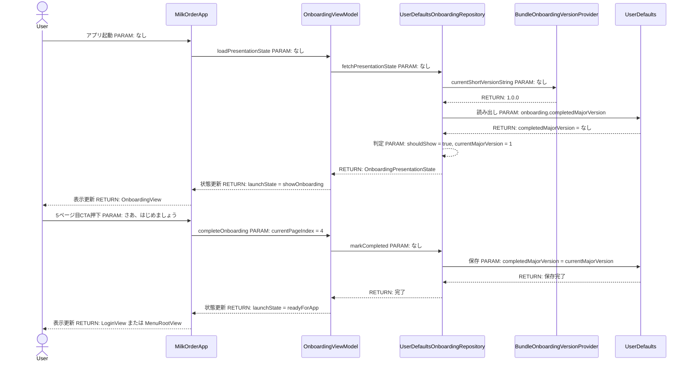
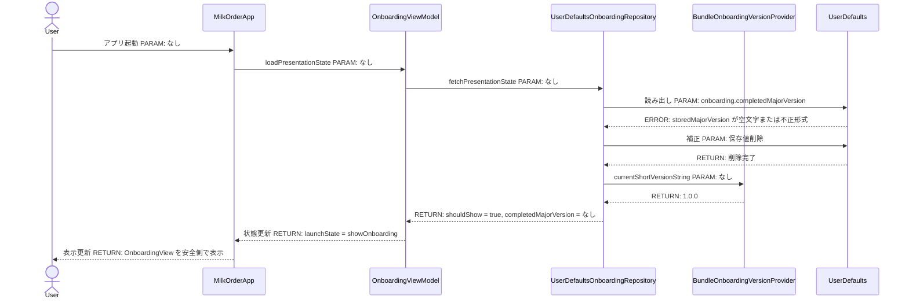
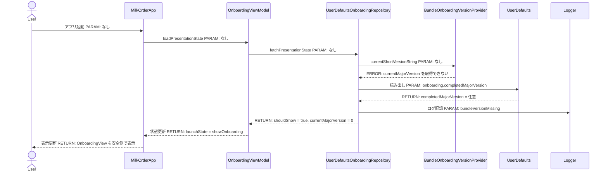
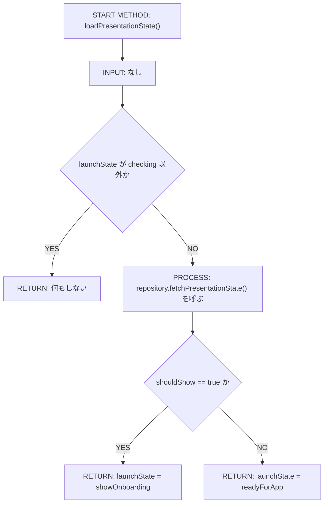
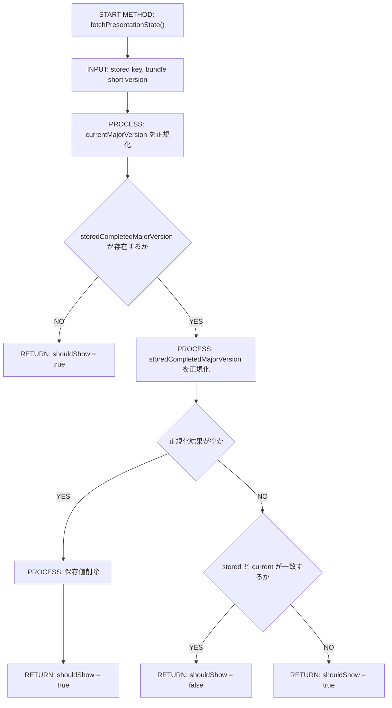
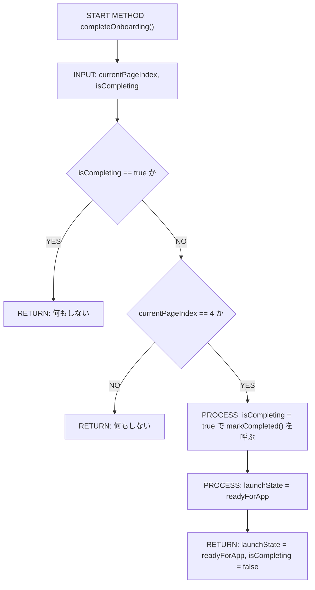
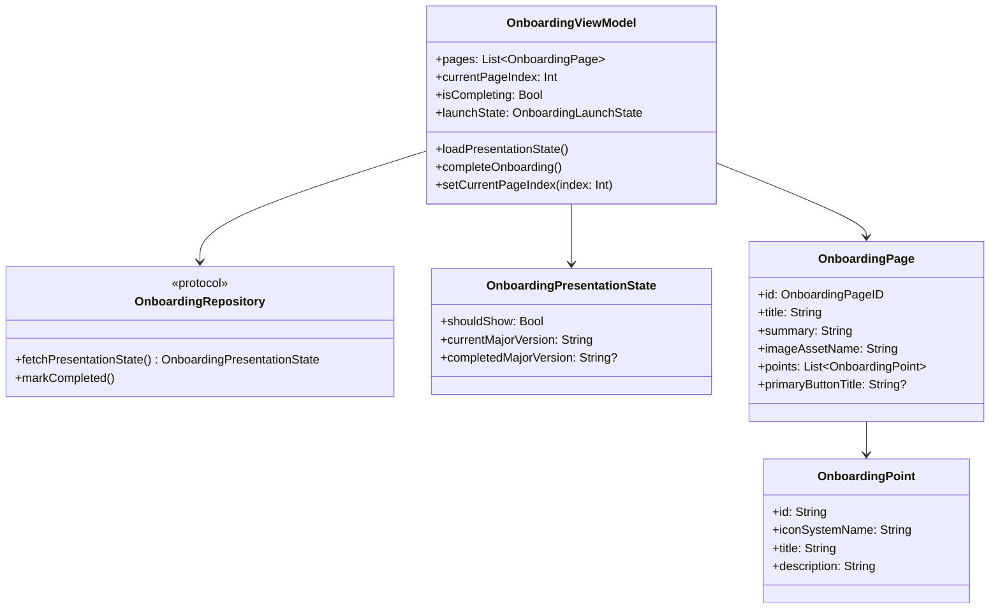
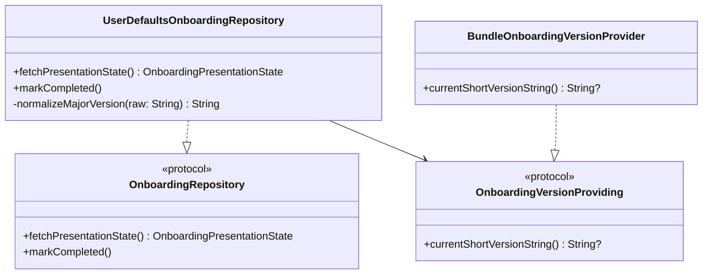

# Implementation Plan — SCR-018 オンボーディング画面

---

## 0. 実装入力コンテキスト

| 項目                             | 記入                                                                                                                                                                                                                                                                                                  |
| -------------------------------- | ----------------------------------------------------------------------------------------------------------------------------------------------------------------------------------------------------------------------------------------------------------------------------------------------------- |
| 対象Issue                        | `[DESIGN] オンボーディング画面（初回起動時説明、SCR-018）`                                                                                                                                                                                                                                            |
| 対象リポジトリ内パス（実装起点） | `MilkOrder/`                                                                                                                                                                                                                                                                                          |
| 前提 plan                        | `.github/copilot/plans/scr-001-login.md`（`AppEnvironment`, `AuthUser`, `LoginView`）, `.github/copilot/plans/scr-002-menu.md`（認証後に `MenuRootView` でメニューへ接続する既存導線）, `.github/copilot/plans/scr-016-announcements.md`（`AppEnvironment.preview()` と `@StateObject` 注入パターン） |

運用補足: Agent が実装時に直接参照する入力のみを記載する。未確定は `TBD（理由/決定条件/期限）` で記載する。

### 0.1 変更サマリ一覧

| 区分 | 対象                                    | 変更概要                                                                                                                                             |
| ---- | --------------------------------------- | ---------------------------------------------------------------------------------------------------------------------------------------------------- |
| 追加 | `OnboardingPage`                        | 5ページ固定の表示内容を保持するモデルを追加する                                                                                                      |
| 追加 | `OnboardingPoint`                       | 1ページ目の3ポイント表示を表す小要素モデルを追加する                                                                                                 |
| 追加 | `OnboardingPresentationState`           | 初回起動 / 同一メジャー / メジャー更新時の表示可否判定結果を保持する                                                                                 |
| 追加 | `OnboardingRepository`                  | オンボーディング表示状態の取得・完了記録を担う Protocol を追加する                                                                                   |
| 追加 | `UserDefaultsOnboardingRepository`      | `UserDefaults` と `CFBundleShortVersionString` を用いたローカル永続化実装を追加する                                                                  |
| 追加 | `MockOnboardingRepository`              | Preview / Unit Test 用の Mock 実装を追加する                                                                                                         |
| 追加 | `OnboardingViewModel`                   | 起動時判定・ページ状態・完了処理・多重実行防止を担う `@MainActor` ViewModel を追加する                                                               |
| 追加 | `OnboardingView`                        | 5ページの `TabView` と最終ページ CTA を表示する新規画面を追加する                                                                                    |
| 追加 | オンボーディング画像 Assets             | Issue #38 で固定された既存ファイル名 `.github/copilot/image/onboardingImage_1page.png`〜`onboardingImage_5page.png` をアプリ表示用アセットへ登録する |
| 修正 | `AppEnvironment`                        | `onboardingRepository` を保持し `preview()` へ Mock を注入する                                                                                       |
| 修正 | `MilkOrderApp`                          | 既存の `currentUser` 分岐より手前にオンボーディング表示判定を組み込む                                                                                |
| 追加 | `UserDefaultsOnboardingRepositoryTests` | 初回起動 / 同一メジャー / メジャー更新 / 異常値補正を検証する Unit テストを追加する                                                                  |
| 追加 | `OnboardingViewModelTests`              | 画面表示判定・完了処理・多重実行防止・既存導線復帰を検証する Unit テストを追加する                                                                   |
| 追加 | `OnboardingFlowUITests`                 | 5ページスワイプ・完了・再起動時非表示・メジャー更新時再表示を検証する UI テストを追加する                                                            |

### 0.2 入力制約一覧

| 制約区分 | 制約内容                                                                                                                                                 | 適用対象                                                                                |
| -------- | -------------------------------------------------------------------------------------------------------------------------------------------------------- | --------------------------------------------------------------------------------------- |
| 互換性   | オンボーディング完了後は既存の `currentUser` 判定による `LoginView` / `MenuRootView` 分岐へそのまま復帰する                                              | `MilkOrder/MilkOrderApp.swift`                                                          |
| 互換性   | 既存のログイン後画面遷移ロジック・認証ロジックは変更しない                                                                                               | `MilkOrder/MilkOrderApp.swift`, `MilkOrder/Features/Login/`, `MilkOrder/Features/Menu/` |
| 禁止事項 | View / ViewModel から `UserDefaults` や `Bundle.main` を直接参照しない                                                                                   | `OnboardingView`, `OnboardingViewModel`                                                 |
| 禁止事項 | オンボーディング内容の動的配信、Push 権限要求、Remote Config 連携を追加しない                                                                            | オンボーディング機能全体                                                                |
| 禁止事項 | `.github/copilot/10-requirements.md` の画面一覧や他 SSOT を本実装で編集しない                                                                            | ドキュメント全体                                                                        |
| その他   | 5ページ目にのみ「さあ、はじめましょう」ボタンを表示し、見た目は既存の `.buttonStyle(.borderedProminent)` 系プライマリボタンに合わせる                    | `OnboardingView`                                                                        |
| その他   | 「メジャーバージョン変更時」の再表示判定は `CFBundleShortVersionString` のメジャーバージョン比較で自動判定する                                           | `UserDefaultsOnboardingRepository`                                                      |
| その他   | `#Preview` と Unit Test は Firebase なしで決定的に動作させる                                                                                             | `AppEnvironment.preview()`, `MockOnboardingRepository`                                  |
| その他   | UI テストでは同一 `UserDefaults` suite を使った再起動・疑似メジャー更新を launch environment（ONBOARDING_TEST_SUITE, ONBOARDING_TEST_VERSION）で制御する | `MilkOrderApp`, `OnboardingFlowUITests`                                                 |
| その他   | launch environment のキー名は ONBOARDING_TEST_SUITE / ONBOARDING_TEST_VERSION を固定値として実装・テストで共通利用する                                   | `MilkOrderApp`, `OnboardingFlowUITests`                                                 |

### 0.3 関連機能・関連仕様一覧

| 種別         | パス/識別子                                                                    | この設計での利用目的                                                             |
| ------------ | ------------------------------------------------------------------------------ | -------------------------------------------------------------------------------- |
| 要件         | Issue #38 本文 1章〜8章                                                        | SCR-018 の5ページ内容、完了条件、表示制御、非ゴールを固定する                    |
| 要件         | `.github/copilot/image/onboardingImage_1page.png`〜`onboardingImage_5page.png` | 各ページの画像・構図・テキスト配置の正とする                                     |
| 設計方針     | `.github/copilot/00-index.md`                                                  | SSOT 参照順と Design → Implement の流れを固定する                                |
| 設計方針     | `.github/copilot/20-architecture.md`                                           | `AppEnvironment` DI root と Preview 分離方針を確認する                           |
| 設計方針     | `.github/copilot/30-coding-standards.md`                                       | View / ViewModel / Repository 分離、`@MainActor`、副作用分離を確認する           |
| 設計方針     | `.github/copilot/40-testing-strategy.md`                                       | XCTest / XCUITest の方針とモック隔離を確認する                                   |
| セキュリティ | `.github/copilot/50-security.md`                                               | `UserDefaults` キー、ログ、launch environment に機微情報を含めないことを固定する |
| 品質ゲート   | `.github/copilot/60-ci-quality-gates.md`                                       | build / lint / test / security コマンドを固定する                                |
| テンプレート | `.github/copilot/80-templates/implementation-plan.md`                          | 章立てと新規画面追加テンプレを満たす                                             |
| 既存実装     | `MilkOrder/MilkOrderApp.swift`                                                 | `currentUser` 判定の手前にオンボーディング分岐を追加する対象                     |
| 既存実装     | `MilkOrder/App/AppEnvironment.swift`                                           | `onboardingRepository` を追加する DI root                                        |
| 既存実装     | `MilkOrder/Features/Login/LoginView.swift`                                     | 5ページ目 CTA の見た目を既存プライマリボタンに寄せる基準                         |
| 既存実装     | `MilkOrder/Features/Menu/MenuItemButton.swift`                                 | 押しやすいボタンサイズと `appTypography(.appButtonLabel)` の基準                 |
| 既存実装     | `MilkOrder/Features/Announcements/AnnouncementsView.swift`                     | `@StateObject` 注入と `AppEnvironment.preview()` の既存パターン参照              |

---

## 1. 実装対象機能と機能ゴール

| 項目         | 内容                                                                                                                                                                                                                                                                                                                                                                                      | 根拠                         |
| ------------ | ----------------------------------------------------------------------------------------------------------------------------------------------------------------------------------------------------------------------------------------------------------------------------------------------------------------------------------------------------------------------------------------- | ---------------------------- |
| 実装対象詳細 | SCR-018 オンボーディング画面（`OnboardingView` + `OnboardingViewModel` + `OnboardingRepository` + `UserDefaultsOnboardingRepository` + `MilkOrderApp` 起動分岐組み込み）                                                                                                                                                                                                                  | Issue #38 1章, 5章           |
| 機能ゴール   | アプリ起動時に、未完了またはメジャー更新直後のユーザーへ5ページのオンボーディングを表示し、5ページ目の「さあ、はじめましょう」押下で完了を永続化した後、既存のログイン画面 / メニュー画面分岐へ遷移させる                                                                                                                                                                                 | Issue #38 1章                |
| 非ゴール     | オンボーディング内容の動的配信、Push 許可ダイアログ表示、ログイン後導線の変更、Firebase / 外部 API 実接続、`.github/copilot/10-requirements.md` への SCR-018 追記                                                                                                                                                                                                                         | Issue #38 3章                |
| 完了条件     | ① 初回起動時に5ページのオンボーディングが表示される ② 1〜5ページを横スワイプできる ③ 5ページ目だけに CTA ボタンが表示される ④ CTA 押下で完了が保存され、同一メジャーの再起動では表示されない ⑤ メジャーバージョン変更相当の状態では再表示される ⑥ 完了後は既存の `currentUser` 分岐に復帰する ⑦ `#Preview` が Firebase なしで動く ⑧ build / lint / test / security の計画が固定されている | Issue #38 5章, 6章, 7章, 8章 |
| 受入確認手順 | UI テスト用 launch environment（ONBOARDING_TEST_SUITE, ONBOARDING_TEST_VERSION）を指定して起動 → 1〜5ページをスワイプ → 5ページ目で「さあ、はじめましょう」を押下 → 同一 suite / 同一バージョンで再起動して非表示確認 → バージョンだけ変更して再起動し再表示確認                                                                                                                          | Issue #38 7章                |

---

## 2. 前提・制約（SSOT）

| 種別                                            | 内容                                                                                                                                                                                                                                                                                                                                                                                                                                                                                                                                                                                                                 | 根拠（ファイル/ADR/Issue）                                                      |
| ----------------------------------------------- | -------------------------------------------------------------------------------------------------------------------------------------------------------------------------------------------------------------------------------------------------------------------------------------------------------------------------------------------------------------------------------------------------------------------------------------------------------------------------------------------------------------------------------------------------------------------------------------------------------------------- | ------------------------------------------------------------------------------- |
| 参照したSSOT                                    | `.github/copilot/00-index.md`, `.github/copilot-instructions.md`, `.github/instructions/docs.instructions.md`, `.github/instructions/mermaid.instructions.md`, `.github/instructions/swift.instructions.md`, `.github/instructions/tests.instructions.md`, `.github/instructions/commit-messages.instructions.md`, `.github/copilot/10-requirements.md`, `.github/copilot/20-architecture.md`, `.github/copilot/30-coding-standards.md`, `.github/copilot/40-testing-strategy.md`, `.github/copilot/50-security.md`, `.github/copilot/60-ci-quality-gates.md`, `.github/copilot/80-templates/implementation-plan.md` | SSOT 参照順 / Issue #38 2.1                                                     |
| アーキテクチャ前提（View/ViewModel/Repository） | `OnboardingView` は表示のみ、`OnboardingViewModel` は起動状態・完了状態を管理、`OnboardingRepository` は表示判定と完了記録を抽象化し、具象実装は `Infrastructure/Onboarding/` に閉じ込める                                                                                                                                                                                                                                                                                                                                                                                                                           | Issue #38 4.1, 4.2                                                              |
| iOS バージョン要件                              | `TabView` のページング、`Swift Concurrency`, `NavigationStack` は既存プロジェクトの deployment target と同一前提で利用する                                                                                                                                                                                                                                                                                                                                                                                                                                                                                           | `MilkOrder.xcodeproj/project.pbxproj`, `.github/copilot/60-ci-quality-gates.md` |
| 技術制約（互換性/期限/運用/セキュリティ）       | `CFBundleShortVersionString` のメジャー部を比較し、同一メジャーでは非表示、差異があれば再表示とする。`UserDefaults` キーは名前空間付きで1件のみ使い、機微情報・認証情報は保存しない                                                                                                                                                                                                                                                                                                                                                                                                                                  | Issue #38 1章, `.github/copilot/50-security.md`                                 |
| 未確定前提（TBD）                               | なし。Issue 本文とモック画像で実装開始に必要な仕様は足りており、BLOCKER となる未確定事項は存在しない                                                                                                                                                                                                                                                                                                                                                                                                                                                                                                                 | Issue #38 8章                                                                   |

---

## 3. 要件定義（実装受入条件）

### 3.1 機能要件

| ID    | 要件                                                                                                | 受入条件（テスト可能な形）                                                                                                                        |
| ----- | --------------------------------------------------------------------------------------------------- | ------------------------------------------------------------------------------------------------------------------------------------------------- |
| FR-01 | 初回起動時にオンボーディングを表示する                                                              | 永続化値が未保存の状態で起動すると `MilkOrderApp` が `OnboardingView` を表示する                                                                  |
| FR-02 | オンボーディングは5ページ固定で表示する                                                             | `OnboardingViewModel.pages.count == 5` であり、各ページのタイトル・画像アセット名が Issue の5ページ定義と一致する                                 |
| FR-03 | 1〜5ページは横スワイプで移動でき、下部に5点のページインジケーターを表示する                         | `OnboardingView` が `TabView` + `PageTabViewStyle(indexDisplayMode: .always)` を使用し、左右スワイプで `currentPageIndex` が更新される            |
| FR-04 | 1ページ目に「注文はカンタン」「履歴でらくらく管理」「大切なお知らせ」の3ポイントを表示する          | `OnboardingPage.points` に3要素が入り、1ページ目だけ `ForEach` で表示される                                                                       |
| FR-05 | 2〜4ページは各モック画像と要約説明を表示する                                                        | 2〜4ページに対応する `imageAssetName`, `title`, `summary` が Issue 本文の表と一致する                                                             |
| FR-06 | 5ページ目のみに「さあ、はじめましょう」ボタンを表示する                                             | `currentPageIndex == 4` のときだけ CTA が描画され、それ以前のページでは非表示になる                                                               |
| FR-07 | 5ページ目の CTA 押下でオンボーディング完了を保存する                                                | CTA 押下で `OnboardingViewModel.completeOnboarding()` が呼ばれ、`UserDefaults` に現在メジャーバージョンが保存される                               |
| FR-08 | オンボーディング完了後は既存の `currentUser` 判定による `LoginView` / `MenuRootView` 分岐へ接続する | `OnboardingViewModel.launchState == .readyForApp` になった後、`MilkOrderApp` は従来どおり `environment.currentUser` を評価する                    |
| FR-09 | 同一メジャーバージョンの2回目以降の起動ではオンボーディングを表示しない                             | 保存済みメジャーと現在メジャーが一致する場合、起動直後に `OnboardingView` を表示しない                                                            |
| FR-10 | メジャーバージョンが変わった起動ではオンボーディングを再表示する                                    | 保存済みメジャーと現在メジャーが異なる場合、完了済みでも `OnboardingView` を再表示する                                                            |
| FR-11 | 起動直後の判定中にログイン画面が一瞬表示されないようにする                                          | 初期状態は `launchState == .checking` とし、判定完了まで `ProgressView` などの中間表示を行う                                                      |
| FR-12 | `#Preview` / Demo は Firebase なしでオンボーディングを表示できる                                    | `AppEnvironment.preview()` の `onboardingRepository` に `MockOnboardingRepository` を注入し、`OnboardingView` Preview が成立する                  |
| FR-13 | UI テストで初回起動 / 再起動 / メジャー更新を再現できる                                             | `MilkOrderApp` が launch environment（ONBOARDING_TEST_SUITE, ONBOARDING_TEST_VERSION）を受け取れるようにし、同一 suite の再起動で状態が再現できる |

### 3.2 非機能要件

| ID     | 要件                                                                 | 受入条件（テスト可能な形）                                                                                         |
| ------ | -------------------------------------------------------------------- | ------------------------------------------------------------------------------------------------------------------ |
| NFR-01 | View / ViewModel は `UserDefaults` と `Bundle.main` を直接参照しない | `OnboardingViewModel` は `any OnboardingRepository` のみに依存し、永続化やバージョン参照は Repository 側に閉じる   |
| NFR-02 | UI 更新は `@MainActor` で保護する                                    | `OnboardingViewModel` に `@MainActor` を付与し、`@Published` 状態の更新を ViewModel 内に限定する                   |
| NFR-03 | ログや永続化に Secrets / PII を含めない                              | 保存する値はメジャーバージョン文字列のみで、ログには画面表示理由と補正結果だけを構造化して出す                     |
| NFR-04 | CTA は既存画面と同系統のプライマリボタン見た目にする                 | `Text("さあ、はじめましょう")` + `.appTypography(.appButtonLabel)` + `.buttonStyle(.borderedProminent)` を使用する |
| NFR-05 | 品質ゲートとして build / lint / test / security の実行計画を持つ     | 9.2 に4つのコマンドと判定基準が明記されている                                                                      |

---

## 4. スコープ境界

### 4.0 スコープ境界の定義（機能単位）

| 区分（In-Scope/Out-of-Scope） | 対象機能/責務                                                                   | 判定理由                                                     |
| ----------------------------- | ------------------------------------------------------------------------------- | ------------------------------------------------------------ |
| In-Scope                      | `OnboardingPage`, `OnboardingPoint`, `OnboardingPresentationState` のモデル定義 | 5ページ内容と表示判定を型で固定するため                      |
| In-Scope                      | `OnboardingRepository` と `UserDefaultsOnboardingRepository`                    | 初回起動 / メジャー更新判定を Protocol 越しに扱うため        |
| In-Scope                      | `MockOnboardingRepository`                                                      | Preview / Unit Test / UI Test で決定的に差し替えるため       |
| In-Scope                      | `OnboardingViewModel`                                                           | 判定中 / 表示 / 完了済みの状態管理と多重実行防止の責務       |
| In-Scope                      | `OnboardingView`                                                                | 5ページ UI、ページング、CTA 表示の責務                       |
| In-Scope                      | 画像アセット登録                                                                | モック画像をアプリ内表示可能にするため                       |
| In-Scope                      | `AppEnvironment` への `onboardingRepository` 追加                               | DI root を維持するため                                       |
| In-Scope                      | `MilkOrderApp` の起動分岐更新                                                   | `currentUser` 分岐の手前へオンボーディング判定を差し込むため |
| In-Scope                      | Unit Test / XCUITest 追加                                                       | Issue #38 7章の受入条件を自動検証するため                    |
| Out-of-Scope                  | オンボーディング文言の動的配信・A/B テスト                                      | Issue #38 非ゴール                                           |
| Out-of-Scope                  | Push 通知権限要求やシステムダイアログ制御                                       | Issue #38 の要件外                                           |
| Out-of-Scope                  | `LoginView` / `MenuRootView` 以降の遷移変更                                     | 完了後は既存ロジックへ復帰するだけでよい                     |
| Out-of-Scope                  | `.github/copilot/10-requirements.md` 画面一覧への SCR-018 追記                  | Issue #38 非ゴール                                           |

### 4.2 実装時の影響範囲・互換性リスク

| 影響対象        | 結論（影響あり/なし/未確定） | 影響内容                                                                                 |
| --------------- | ---------------------------- | ---------------------------------------------------------------------------------------- |
| UI/画面         | 影響あり                     | アプリ起動直後に `OnboardingView` が追加され、ログイン画面より前に新規ルートが挿入される |
| API/外部通信    | 影響なし                     | Firebase / 外部 API との通信追加は行わない                                               |
| データモデル    | 影響あり                     | `OnboardingPage`, `OnboardingPoint`, `OnboardingPresentationState` が新規追加される      |
| ローカル永続化  | 影響あり                     | `UserDefaults` にメジャーバージョン保存キーを1つ追加する                                 |
| 外部依存（SPM） | 影響なし                     | 新規パッケージ追加なし                                                                   |
| CI/運用         | 影響あり                     | Unit Test と UI Test が増え、起動時表示制御の回帰確認が必須になる                        |

### 4.3 外部依存・Secrets の扱い

| 項目                       | 内容                                                                                  | リスク/対応                                                             |
| -------------------------- | ------------------------------------------------------------------------------------- | ----------------------------------------------------------------------- |
| 外部依存の追加/更新（SPM） | なし                                                                                  | 新たな脆弱性リスクを持ち込まない                                        |
| Secrets 利用有無           | なし                                                                                  | 保存値はメジャーバージョンのみで認証情報を扱わない                      |
| ログ/設定への機密混入対策  | `launchEnvironment` には suite 名と擬似バージョンだけを使い、PII や認証情報は渡さない | `.github/copilot/50-security.md` に従い非機密なテスト制御値のみ許可する |

### 4.4 4章の自己検証（必須）

| チェック項目                   | 合格条件                                                     | 判定                                    |
| ------------------------------ | ------------------------------------------------------------ | --------------------------------------- |
| Design PR 差分を書いていないか | 実装責務だけを書き、設計ドキュメントの差分説明を書いていない | OK                                      |
| 実装責務を書いているか         | In-Scope に実装責務が2件以上ある                             | OK（9件）                               |
| 実装影響を書いているか         | 4.2 で `影響あり` が1件以上あり、影響内容が具体的            | OK（UI/データモデル/ローカル永続化/CI） |

---

## 5. アーキテクチャ設計

### 5.0 依存注入経路（DI）

本プロジェクトは Protocol ベースの依存注入を採用する。View は Protocol に依存し、具象実装を直接 import しない。

| 区分（記載例/追記No） | 提供主体                   | Protocol 名                        | 具象実装名                         | 入力（型/値）                                                             | 出力（型/値）                                        | 境界制約（禁止事項を含む）                                                            |
| --------------------- | -------------------------- | ---------------------------------- | ---------------------------------- | ------------------------------------------------------------------------- | ---------------------------------------------------- | ------------------------------------------------------------------------------------- |
| 記載例                | `AppEnvironment`           | `MilkOrderRepository（Protocol）`  | `MilkOrderRepositoryImpl`          | 設定/環境値                                                               | Repository インスタンス                              | View から具象を直接 import しない                                                     |
| 01                    | `AppEnvironment`           | `OnboardingRepository（Protocol）` | `UserDefaultsOnboardingRepository` | `UserDefaults`, `CFBundleShortVersionString`, launch environment 上書き値 | `any OnboardingRepository`                           | `OnboardingViewModel` から `UserDefaults` / `Bundle.main` を直接参照しない            |
| 02                    | `OnboardingViewModel.init` | `OnboardingRepository（Protocol）` | —                                  | `onboardingRepository`                                                    | `OnboardingViewModel`                                | ViewModel は具象実装や `UserDefaults` キー名を知らない                                |
| 03                    | `MilkOrderApp`             | —                                  | —                                  | `OnboardingViewModel`, `AppEnvironment.currentUser`                       | `OnboardingView` または `LoginView` / `MenuRootView` | 起動分岐は `MilkOrderApp` にのみ置き、`OnboardingView` から既存画面へ直接 push しない |

#### 5.0.1 最小固定セット（TBD禁止）

| 最小固定項目       | 必須記載内容                                                                                                                                                        | 対応セクション          |
| ------------------ | ------------------------------------------------------------------------------------------------------------------------------------------------------------------- | ----------------------- |
| DI 経路            | `AppEnvironment -> OnboardingViewModel -> OnboardingView` を固定し、完了後は `MilkOrderApp` が既存の `currentUser` 分岐へ戻す                                       | `5.0`, `5.7.0`, `5.7.2` |
| MainActor 境界     | `OnboardingViewModel` を `@MainActor` とし、`launchState`, `currentPageIndex`, `isCompleting` の更新を ViewModel に限定する                                         | `5.5.1`, `8.3`          |
| Protocol/具象 境界 | View / ViewModel は `OnboardingRepository` のみに依存し、`UserDefaultsOnboardingRepository` / `MockOnboardingRepository` は `Infrastructure/Onboarding/` に限定する | `8.3`, `8.4`, `5.7.2`   |

### 5.1 設計判断

#### 5.1.1 責務分離 / データフロー（詳細）

| No. | 決定事項（実装責務単位）                                                                                                                                                     | 根拠                                                                           | 未確定（あれば） |
| --- | ---------------------------------------------------------------------------------------------------------------------------------------------------------------------------- | ------------------------------------------------------------------------------ | ---------------- |
| 1   | `OnboardingView` はページ UI、ページング、CTA レイアウトのみを担当し、表示判定や保存処理は持たない                                                                           | `.github/copilot/30-coding-standards.md` の View 責務分離                      | なし             |
| 2   | `OnboardingViewModel` は `launchState`、`currentPageIndex`、`isCompleting`、`pages` を保持し、起動判定と完了処理を仲介する                                                   | 起動直後の分岐と CTA 多重タップ防止を UI から分離するため                      | なし             |
| 3   | `OnboardingRepository` は「現在表示すべきか」と「完了記録」の2責務に限定する                                                                                                 | ViewModel が `UserDefaults` キーやバージョン文字列解析を知らないようにするため | なし             |
| 4   | `UserDefaultsOnboardingRepository` は `UserDefaults` と `CFBundleShortVersionString` のメジャー部比較を1箇所に閉じ込める                                                     | Issue #38 1章の案B採用要件                                                     | なし             |
| 5   | 保存値は `completedMajorVersion` 1件のみとし、Bool フラグは別途持たない                                                                                                      | 同一メジャー非表示とメジャー更新再表示を1つの値で満たせるため                  | なし             |
| 6   | `MilkOrderApp` の root `Group` で `launchState` を評価し、`.checking` → `ProgressView`, `.showOnboarding` → `OnboardingView`, `.readyForApp` → 既存 `currentUser` 分岐とする | 既存の起動ロジックに最小差分で組み込めるため                                   | なし             |
| 7   | UI テスト用に suite 名と擬似バージョンを launch environment から受け取れるようにする                                                                                         | 2回目起動時非表示とメジャー更新時再表示を自動化するため                        | なし             |
| 8   | 5ページ目 CTA は既存の `LoginButton` と同系統の `.borderedProminent` を採用し、`MenuItemButton` の行型 UI は使わない                                                         | モック画像の構図上、フル幅 CTA が適切であり既存プライマリボタンに整合するため  | なし             |

#### 5.1.2 エッジケース / 例外系 / リトライ方針（詳細）

| No. | ケース                                          | 方針（戻り値/表示/再試行）                                                                              | 根拠                                   | 未確定（あれば） |
| --- | ----------------------------------------------- | ------------------------------------------------------------------------------------------------------- | -------------------------------------- | ---------------- |
| 1   | `UserDefaults` に保存値がない                   | `shouldShow = true` を返し、初回起動としてオンボーディングを表示する                                    | FR-01                                  | なし             |
| 2   | 保存値が空文字・余分な小数部付き・不正文字列    | Repository 側でメジャー部に正規化し、空になった場合は保存値削除 + `shouldShow = true` とする            | 再表示漏れより安全側に倒すため         | なし             |
| 3   | `CFBundleShortVersionString` が空または取得不能 | 現在メジャーを `"0"` にフォールバックし、`shouldShow = true` を返す。UI にはエラーを出さない            | 起動不能にせず安全側表示を優先するため | なし             |
| 4   | CTA 多重タップ                                  | `isCompleting == true` の間はボタンを disabled にし、2回目以降の `completeOnboarding()` を no-op にする | 二重保存と画面ブレを防ぐため           | なし             |
| 5   | 5ページ目以外で完了処理が呼ばれる               | View 側で CTA を描画しない。防御的に ViewModel でも `currentPageIndex == 4` 以外は no-op とする         | UI バグ時の誤記録防止                  | なし             |
| 6   | 完了直後に再起動する                            | 保存済みメジャーと現在メジャーが一致するため次回起動では非表示となる                                    | FR-09                                  | なし             |

#### 5.1.3 SwiftUI View 部品一覧

| レイヤ    | View/コンポーネント名（設計上の候補）       | 主責務                                      | 対応機能             |
| --------- | ------------------------------------------- | ------------------------------------------- | -------------------- |
| Screen    | `OnboardingView`                            | 5ページの `TabView` と最終 CTA を束ねる     | FR-01〜FR-08         |
| Section   | `OnboardingPageContentView`                 | 各ページの画像・タイトル・説明を描画する    | FR-02〜FR-05         |
| Section   | `OnboardingHighlightsSection`               | 1ページ目の3ポイントを表示する              | FR-04                |
| Component | `OnboardingIllustrationView`                | ページ画像の表示・フィット・余白を統一する  | FR-02〜FR-05         |
| Component | `OnboardingPrimaryActionButton`             | 5ページ目 CTA の既存プライマリボタン準拠 UI | FR-06, FR-07, NFR-04 |
| Atom      | `PageTabViewStyle` のシステムインジケーター | 5点のページインジケーターを表示する         | FR-03                |
| Atom      | `ProgressView`                              | 判定中の中間表示                            | FR-11                |

#### 5.1.4 ログと観測性（漏洩防止を含む / 詳細）

| No. | 観点                  | 方針                                                                                                   | 根拠                                             | 未確定（あれば） |
| --- | --------------------- | ------------------------------------------------------------------------------------------------------ | ------------------------------------------------ | ---------------- |
| 1   | ログ出力内容          | `displayReason`, `storedMajorVersion`, `currentMajorVersion` のみを `Logger` で記録可能とする          | バージョン比較の理由追跡に必要で、PII を含まない | なし             |
| 2   | マスキング/非出力項目 | `currentUser`, loginID, password, 配達先名、ページ画像の内容そのものはログに出さない                   | `.github/copilot/50-security.md`                 | なし             |
| 3   | エラー記録粒度        | `bundleVersionMissing`, `storedVersionMalformed` などの分類名だけを記録し、UI は無言フォールバックする | 起動時 UX を阻害せず診断可能性だけ残すため       | なし             |

### 5.2 トレードオフ

| 判断テーマ               | 案A                                                         | 案B                                                              | 採用案 | 採用理由                                                                                        | 不採用理由                                                             |
| ------------------------ | ----------------------------------------------------------- | ---------------------------------------------------------------- | ------ | ----------------------------------------------------------------------------------------------- | ---------------------------------------------------------------------- |
| 再表示判定方式           | 表示済み Bool のみ保存し、大規模更新時は手動リセット        | 完了時のメジャーバージョンを保存し、起動時に現在メジャーと比較   | 案B    | 運用手順なしで自動判定でき、Issue #38 推奨案に一致する                                          | 案A は運用依存でリセット漏れが起こりうる                               |
| 起動ルーティング実装場所 | `OnboardingRootView` を新設してそこで既存分岐まで抱える     | `MilkOrderApp` の既存 `Group` へオンボーディング判定を直挿入する | 案B    | 既存の `currentUser` 分岐に最小差分で組み込め、責務の増分も小さい                               | 案A は新たなルート View 追加で差分が広がる                             |
| 永続化 API 形状          | 同期 API にして `UserDefaults` の軽量アクセスをそのまま扱う | `async` API に統一し他 Repository と同じ呼び出し形に寄せる       | 案A    | I/O が軽量であり、起動判定・完了保存をシンプルに保てる。`@MainActor` ViewModel でも処理量は微小 | 案B は suspension point のない擬似非同期になり、実装の複雑さだけ増える |

### 5.3 ナビゲーション方針

| 項目                                                    | 決定内容                                                                                                        | 根拠                                                                      |
| ------------------------------------------------------- | --------------------------------------------------------------------------------------------------------------- | ------------------------------------------------------------------------- |
| ナビゲーション方式（NavigationStack / TabView / Sheet） | オンボーディング内部は `TabView` のページングを採用し、完了後の画面切替は `MilkOrderApp` の root 分岐で制御する | Issue #38 に「横スライド」と「既存起動フローへ進む」とあるため            |
| 画面遷移の責務（誰が遷移を制御するか）                  | `OnboardingViewModel` が `launchState` を更新し、`MilkOrderApp` がそれを見て root 表示を切り替える              | `OnboardingView` から `LoginView` / `MenuRootView` へ直接遷移させないため |
| ディープリンク対応                                      | なし。初期版では起動時の root 画面切替のみ対象とする                                                            | Issue #38 非ゴール                                                        |
| 遷移時のデータ受け渡し方式                              | オンボーディング完了後は追加データを渡さず、既存の `AppEnvironment.currentUser` 判定を再利用する                | 既存導線を変更しないため                                                  |

### 5.4 アーキテクチャレイヤー方針

| レイヤ       | 定義                                            | 許可する依存方向         | 禁止する依存                                                              |
| ------------ | ----------------------------------------------- | ------------------------ | ------------------------------------------------------------------------- |
| View         | SwiftUI 表示のみ                                | ViewModel のみ           | Repository / `UserDefaults` / `Bundle.main` を直接参照しない              |
| ViewModel    | 状態管理・UI ロジック                           | Repository Protocol のみ | `UserDefaultsOnboardingRepository` 具象や `UserDefaults` を直接参照しない |
| Repository   | 表示判定と完了保存の抽象（Protocol）            | Infrastructure 具象      | View / ViewModel の import                                                |
| DataSource   | `UserDefaults` とバージョン文字列取得の具象実装 | Foundation / OSLog       | View / ViewModel を import しない                                         |
| Model/Entity | ページ内容・判定結果データ                      | なし                     | 他レイヤに依存しない                                                      |

### 5.5 データ取得ライフサイクル

| データ種別           | 取得タイミング                    | 取得場所                                      | 理由                                                                 |
| -------------------- | --------------------------------- | --------------------------------------------- | -------------------------------------------------------------------- |
| 初期表示必須データ   | `MilkOrderApp` root の `.task {}` | `OnboardingViewModel.loadPresentationState()` | ログイン画面表示前にオンボーディング表示可否を確定する必要があるため |
| ユーザー操作後データ | 5ページ目 CTA 押下時              | `OnboardingViewModel.completeOnboarding()`    | 完了保存後に root 分岐を切り替えるため                               |
| バックグラウンド更新 | なし                              | なし                                          | 起動時判定だけで成立するため                                         |

| キャッシュ方針       | 採用有無 | ルール                                                                 |
| -------------------- | -------- | ---------------------------------------------------------------------- |
| インメモリキャッシュ | あり     | `OnboardingViewModel` が `pages` と最新 `launchState` を保持する       |
| ディスクキャッシュ   | あり     | `UserDefaults` に `onboarding.completedMajorVersion` を1件だけ保存する |

#### 5.5.1 MainActor/BackgroundActor 境界

| 対象処理               | 実行コンテキスト（MainActor/background）    | 実装場所                                | 禁止事項                                                                |
| ---------------------- | ------------------------------------------- | --------------------------------------- | ----------------------------------------------------------------------- |
| UI 更新                | MainActor                                   | `OnboardingViewModel`, `OnboardingView` | background スレッドから `launchState` / `currentPageIndex` を更新しない |
| ローカル永続化アクセス | Repository コンテキスト（同期・短時間処理） | `UserDefaultsOnboardingRepository`      | View / ViewModel から `UserDefaults` を直接触らない                     |
| バージョン文字列取得   | Repository コンテキスト（同期・短時間処理） | `UserDefaultsOnboardingRepository`      | View / ViewModel から `Bundle.main.infoDictionary` を直接参照しない     |
| 起動分岐評価           | MainActor                                   | `MilkOrderApp`                          | 判定完了前に `LoginView` / `MenuRootView` を先に表示しない              |

運用補足: `@MainActor` を ViewModel クラスに付与し、UI 更新の安全性を保証する。

### 5.6 エラーハンドリング標準形

| 分類（network/unauthorized/notfound/validation/unknown） | エラー型                                      | UI 表示ルール                                       | 再試行ルール                                      |
| -------------------------------------------------------- | --------------------------------------------- | --------------------------------------------------- | ------------------------------------------------- |
| network                                                  | 該当なし                                      | 表示しない                                          | 該当なし                                          |
| unauthorized                                             | 該当なし                                      | 表示しない                                          | 該当なし                                          |
| notfound                                                 | 該当なし                                      | 表示しない                                          | 該当なし                                          |
| validation                                               | `currentPageIndex != 4` での完了要求          | 無視して現ページを維持する                          | CTA 自体を5ページ目に限定するため通常は発生しない |
| unknown                                                  | `CFBundleShortVersionString` 欠落、保存値異常 | UI エラーは出さず安全側でオンボーディングを表示する | 次回起動で再判定                                  |

| ログ方針                      | 内容                                                                                          |
| ----------------------------- | --------------------------------------------------------------------------------------------- |
| 出力する情報                  | `displayReason`, `storedMajorVersion`, `currentMajorVersion`, `malformedStoredValue` の分類名 |
| 出力しない情報（Secrets/PII） | `currentUser`, loginID, password, 配達先名、注文情報                                          |

#### 5.6.1 エラー変換責務（例外 → ドメインエラー）

| 変換対象             | 例外発生層                         | ドメインエラーへ変換する層         | 上位層へ渡す型                                         | 禁止事項                          |
| -------------------- | ---------------------------------- | ---------------------------------- | ------------------------------------------------------ | --------------------------------- |
| 保存値異常           | `UserDefaultsOnboardingRepository` | `UserDefaultsOnboardingRepository` | `OnboardingPresentationState` へ正規化して返す         | ViewModel へ生の保存値を渡さない  |
| バージョン文字列欠落 | `UserDefaultsOnboardingRepository` | `UserDefaultsOnboardingRepository` | `OnboardingPresentationState` へフォールバックして返す | UI にシステム内部状態を露出しない |
| 完了多重実行         | `OnboardingViewModel`              | `OnboardingViewModel`              | no-op                                                  | Repository を二重に呼ばない       |
| 想定外の実装バグ     | 任意層                             | 該当層                             | 起動不能にせず `shouldShow = true` 側へ寄せる          | クラッシュを優先しない            |

### 5.7 シーケンス図（Mermaid / 複数必須）

| 必須項目   | 記載ルール                                                               |
| ---------- | ------------------------------------------------------------------------ |
| DI 経路    | 必須（`AppEnvironment -> OnboardingViewModel -> OnboardingView` を明記） |
| 正常系     | 必須（最低1本）                                                          |
| 異常系     | 必須（最低2本。業務エラー系/システムエラー系）                           |
| パラメータ | 各呼び出しメッセージに `PARAM` を明記                                    |
| 戻り値     | 各応答メッセージに `RETURN` を明記                                       |
| エラー返却 | 各異常系で `ERROR` の返却値とハンドリング先を明記                        |

#### 5.7.0 DI 経路（テキスト再掲 / 必須）

| No     | 開始主体                   | 終了主体         | Protocol 名                        | 具象実装名                         | 経路文字列（`A -> B -> C`）                                         | 境界チェック観点                                           | 対応シーケンス図ID |
| ------ | -------------------------- | ---------------- | ---------------------------------- | ---------------------------------- | ------------------------------------------------------------------- | ---------------------------------------------------------- | ------------------ |
| 記載例 | `AppEnvironment`           | `SomeScreen`     | `MilkOrderRepository（Protocol）`  | `MilkOrderRepositoryImpl`          | `AppEnvironment -> SomeViewModel -> SomeScreen`                     | 具象が View/ViewModel に漏れていないこと                   | SEQ-01             |
| 01     | `AppEnvironment`           | `OnboardingView` | `OnboardingRepository（Protocol）` | `UserDefaultsOnboardingRepository` | `AppEnvironment -> OnboardingViewModel -> OnboardingView`           | ViewModel が `UserDefaults` / `Bundle.main` を知らないこと | SEQ-01             |
| 02     | `AppEnvironment.preview()` | `OnboardingView` | `OnboardingRepository（Protocol）` | `MockOnboardingRepository`         | `AppEnvironment.preview() -> OnboardingViewModel -> OnboardingView` | Preview が Firebase なしで成立すること                     | SEQ-02             |

#### 5.7.1 シーケンス対象一覧

| 図ID   | 種別（正常/異常） | 起点（画面/操作）                  | 終点（Repository/外部I/O）         | 対応要件ID（FR/NFR）       |
| ------ | ----------------- | ---------------------------------- | ---------------------------------- | -------------------------- |
| SEQ-01 | 正常（DI 経路）   | アプリ起動 + 5ページ目 CTA 押下    | `UserDefaultsOnboardingRepository` | FR-01, FR-07, FR-08, FR-09 |
| SEQ-02 | 異常              | アプリ起動時の保存値異常           | `UserDefaultsOnboardingRepository` | FR-01, FR-10, NFR-03       |
| SEQ-03 | 異常              | アプリ起動時のバージョン文字列欠落 | `UserDefaultsOnboardingRepository` | FR-01, FR-10, NFR-03       |

#### 5.7.1.1 境界整合チェック（必須）

| 境界テーマ                     | 文章セクション | 表セクション | 図セクション | 整合判定（OK/NG） |
| ------------------------------ | -------------- | ------------ | ------------ | ----------------- |
| ログ責務（どの層で出力するか） | `5.1.4`        | `5.6`        | `5.7.4`      | OK                |
| エラー変換責務                 | `5.1.2`        | `5.6.1`      | `5.7.3`      | OK                |
| MainActor/Background 境界      | `5.5.1`        | `8.3`        | `5.7.2`      | OK                |

#### 5.7.1.2 最小固定セット具体化チェック（必須）

| 最小固定項目                                     | 文章セクション | 表セクション | 図セクション     | TBD残存数（0のみ可） |
| ------------------------------------------------ | -------------- | ------------ | ---------------- | -------------------- |
| DI 経路（`AppEnvironment -> ViewModel -> View`） | `5.0.1`        | `5.0`        | `5.7.0`, `5.7.2` | 0                    |
| MainActor 境界（UI 更新箇所）                    | `5.5.1`        | `5.5.1`      | `5.7.2`          | 0                    |
| Protocol/具象 境界                               | `8.3`          | `8.4`        | `5.7.2`          | 0                    |

#### 5.7.2 正常系シーケンス（必須）

#### 5.7.3 異常系シーケンス（業務エラー）

#### 5.7.4 異常系シーケンス（システムエラー）

### 5.8 処理フロー図（メソッドレベル / 複数必須）

| 必須項目       | 記載ルール                       |
| -------------- | -------------------------------- |
| 対象メソッド数 | 必須（最低3メソッド）            |
| 分岐           | 各メソッドで正常/異常分岐を明記  |
| 入出力         | 各メソッドの入力/出力を明記      |
| 例外処理       | 例外時の戻り値または伝播先を明記 |

#### 5.8.1 メソッド一覧

| 図ID    | メソッド名                 | 層（View/ViewModel/Repository/DataSource） | 対応要件ID（FR/NFR）        |
| ------- | -------------------------- | ------------------------------------------ | --------------------------- |
| FLOW-01 | `loadPresentationState()`  | ViewModel                                  | FR-01, FR-09, FR-10, FR-11  |
| FLOW-02 | `fetchPresentationState()` | Repository                                 | FR-01, FR-09, FR-10, NFR-03 |
| FLOW-03 | `completeOnboarding()`     | ViewModel                                  | FR-07, FR-08                |

#### メソッドフロー（FLOW-01）

#### メソッドフロー（FLOW-02）

#### メソッドフロー（FLOW-03）

---

## 6. 契約仕様（Protocol Contract）

### 6.0 Protocol-DI 固定前提

| 項目                    | 固定方針                                                                          |
| ----------------------- | --------------------------------------------------------------------------------- |
| DI 起点                 | `AppEnvironment` のみで依存解決する                                               |
| Protocol の責務         | メソッド署名のみ定義し、具象実装を含めない                                        |
| 具象実装の配置          | `Infrastructure/Onboarding/` に限定する                                           |
| View / ViewModel の責務 | `OnboardingRepository` に依存し、`UserDefaults` や `Bundle.main` の知識を持たない |

### 6.1 入出力契約（API/関数/UseCase）

| ID     | 入口（画面/操作/関数）                          | 入力               | 出力                                                        | エラー                           | 備考                                        |
| ------ | ----------------------------------------------- | ------------------ | ----------------------------------------------------------- | -------------------------------- | ------------------------------------------- |
| IFC-01 | `MilkOrderApp` 起動時 `loadPresentationState()` | なし               | `OnboardingPresentationState` をもとに `launchState` を更新 | なし。異常値は Repository が補正 | 起動判定専用                                |
| IFC-02 | 5ページ目 CTA `completeOnboarding()`            | `currentPageIndex` | 永続化完了、`launchState = readyForApp`                     | なし。多重実行は no-op           | 5ページ目以外では no-op                     |
| IFC-03 | `OnboardingRepository.fetchPresentationState()` | なし               | `OnboardingPresentationState`                               | なし。常に安全側の値を返す       | `UserDefaults` とバージョン文字列を内部参照 |
| IFC-04 | `OnboardingRepository.markCompleted()`          | なし               | なし                                                        | なし                             | 現在メジャーバージョン保存のみ              |

### 6.2 型/モデル/スキーマ

| ID      | 対象                          | 変更内容（追加/変更/削除） | 後方互換                                                  |
| ------- | ----------------------------- | -------------------------- | --------------------------------------------------------- |
| TYPE-01 | `OnboardingPage`              | 追加                       | 新規画面専用型のため影響なし                              |
| TYPE-02 | `OnboardingPoint`             | 追加                       | 新規画面専用型のため影響なし                              |
| TYPE-03 | `OnboardingPresentationState` | 追加                       | 新規画面専用型のため影響なし                              |
| TYPE-04 | `AppEnvironment`              | 変更                       | `onboardingRepository` 追加。既存初期化箇所は追従更新する |

### 6.3 Protocol インターフェース定義（実装エンジニア向け固定案）

#### 6.3.1 Repository/DataSource Protocol 一覧

| No. | Protocol 名                  | メソッド署名（Swift 形式）                                     | 配置ファイル候補                                                             | 備考                                                          |
| --- | ---------------------------- | -------------------------------------------------------------- | ---------------------------------------------------------------------------- | ------------------------------------------------------------- |
| 1   | `OnboardingRepository`       | `func fetchPresentationState() -> OnboardingPresentationState` | `MilkOrder/Domain/Onboarding/OnboardingRepository.swift`                     | 起動時の表示判定を返す                                        |
| 2   | `OnboardingRepository`       | `func markCompleted()`                                         | `MilkOrder/Domain/Onboarding/OnboardingRepository.swift`                     | 現在メジャーバージョンを保存する                              |
| 3   | `OnboardingVersionProviding` | `func currentShortVersionString() -> String?`                  | `MilkOrder/Infrastructure/Onboarding/UserDefaultsOnboardingRepository.swift` | Repository 内部のテスト容易化用途。公開範囲は `internal` まで |

#### 6.3.2 ドメインモデルクラス図（Mermaid classDiagram）

| 図ID   | ドメイン                  | 対応 Protocol/実装                                                                       | 対応要件ID（FR/NFR） |
| ------ | ------------------------- | ---------------------------------------------------------------------------------------- | -------------------- |
| CLS-01 | Onboarding UI state       | `OnboardingViewModel`, `OnboardingRepository`                                            | FR-01〜FR-12         |
| CLS-02 | Onboarding infrastructure | `OnboardingRepository`, `UserDefaultsOnboardingRepository`, `OnboardingVersionProviding` | FR-09, FR-10, NFR-03 |

注記（CLS-01 / CLS-02 共通）: `OnboardingViewModel.launchState` は View が監視する `@Published private(set)` 状態として公開し、View から直接書き換えさせない。クラス図の可視性記号は契約理解のための簡略表記であり、実装時のアクセス制御は `8.4` の方針（`private(set)` / `@Published private(set)`）を優先する。凡例として `+` は「外部から参照される契約要素」を示し、Swift の厳密な access level を表す記号としては扱わない。

##### ドメインレベルのクラス図（CLS-01）

##### ドメインレベルのクラス図（CLS-02）

#### 6.3.3 ドメイン別モデル定義（省略不可）

##### 6.3.3.1 モデル一覧

| ドメイン   | 型名                          | 区分（struct/class/enum/actor） | 用途                                                 |
| ---------- | ----------------------------- | ------------------------------- | ---------------------------------------------------- |
| Onboarding | `OnboardingPage`              | struct                          | 1ページ分の表示内容を保持する                        |
| Onboarding | `OnboardingPoint`             | struct                          | 1ページ目の3ポイントを表現する                       |
| Onboarding | `OnboardingPresentationState` | struct                          | 表示可否判定結果を保持する                           |
| Onboarding | `OnboardingLaunchState`       | enum                            | `checking` / `showOnboarding` / `readyForApp` を表す |
| Onboarding | `OnboardingPageID`            | enum                            | `page1`〜`page5` を識別する                          |

##### 6.3.3.2 プロパティ詳細定義（全項目を行で列挙）

| ドメイン   | 型名                          | プロパティ名            | Swift 型（完全表記） | 必須（Y/N） | Optional（Y/N） | 説明                                        | 例                                                 |
| ---------- | ----------------------------- | ----------------------- | -------------------- | ----------- | --------------- | ------------------------------------------- | -------------------------------------------------- |
| Onboarding | `OnboardingPage`              | `id`                    | `OnboardingPageID`   | Y           | N               | 5ページの識別子                             | `.page1`                                           |
| Onboarding | `OnboardingPage`              | `title`                 | `String`             | Y           | N               | ページ見出し                                | `"注文はスマホでカンタン操作"`                     |
| Onboarding | `OnboardingPage`              | `summary`               | `String`             | Y           | N               | ページ要約文                                | `"商品選択から数量入力までスマホで完結します。"`   |
| Onboarding | `OnboardingPage`              | `imageAssetName`        | `String`             | Y           | N               | 表示画像の Asset 名                         | `"onboardingImage_2page"`                          |
| Onboarding | `OnboardingPage`              | `points`                | `[OnboardingPoint]`  | Y           | N               | 1ページ目のポイント一覧。2〜5ページは空配列 | `[]`                                               |
| Onboarding | `OnboardingPage`              | `primaryButtonTitle`    | `String?`            | N           | Y               | 5ページ目 CTA 文言                          | `"さあ、はじめましょう"`                           |
| Onboarding | `OnboardingPoint`             | `id`                    | `String`             | Y           | N               | ポイント識別子                              | `"easy-order"`                                     |
| Onboarding | `OnboardingPoint`             | `iconSystemName`        | `String`             | Y           | N               | SF Symbols 名                               | `"cart"`                                           |
| Onboarding | `OnboardingPoint`             | `title`                 | `String`             | Y           | N               | ポイント見出し                              | `"注文はカンタン"`                                 |
| Onboarding | `OnboardingPoint`             | `description`           | `String`             | Y           | N               | 補足文                                      | `"商品選択から数量入力までまとめて操作できます。"` |
| Onboarding | `OnboardingPresentationState` | `shouldShow`            | `Bool`               | Y           | N               | 起動時に表示するか                          | `true`                                             |
| Onboarding | `OnboardingPresentationState` | `currentMajorVersion`   | `String`             | Y           | N               | 現在のメジャーバージョン                    | `"2"`                                              |
| Onboarding | `OnboardingPresentationState` | `completedMajorVersion` | `String?`            | N           | Y               | 前回完了したメジャーバージョン              | `"1"`                                              |

##### 6.3.3.3 列挙型/リテラル制約

| No. | 型名                    | case 一覧                                   | 用途                  |
| --- | ----------------------- | ------------------------------------------- | --------------------- |
| 1   | `OnboardingLaunchState` | `checking`, `showOnboarding`, `readyForApp` | 起動時 root 分岐状態  |
| 2   | `OnboardingPageID`      | `page1`, `page2`, `page3`, `page4`, `page5` | 5ページの固定順序管理 |

#### 6.3.4 互換性ルール

| 項目                   | ルール                                                                                                     |
| ---------------------- | ---------------------------------------------------------------------------------------------------------- |
| 破壊的変更の扱い       | 既存の `LoginView` / `MenuRootView` 分岐条件は変更せず、オンボーディング判定を前段に追加するだけに留める   |
| Optional 追加の扱い    | 新規モデルの Optional は `primaryButtonTitle`, `completedMajorVersion` のみに限定する                      |
| 型名変更/移動の扱い    | `Onboarding` ドメイン配下に新規追加し、既存型の名前変更は行わない                                          |
| 実装側への影響確認手順 | `AppEnvironment` 初期化箇所3か所、既存 Preview、既存 Unit Test を更新後に `xcodebuild test` で回帰確認する |

---

## 7. データ設計（必要な場合のみ）

| 項目                                     | 内容                                                                                       | 互換性/移行                                |
| ---------------------------------------- | ------------------------------------------------------------------------------------------ | ------------------------------------------ |
| スキーマ変更（CoreData/UserDefaults 等） | `UserDefaults` に `onboarding.completedMajorVersion` キーを追加する                        | 既存キーと衝突しない名前空間付きキーを使う |
| マイグレーション方針                     | 既存データがない前提。保存値が空文字・不正形式なら削除して初回起動扱いへ寄せる             | 明示的な移行処理不要                       |
| 既存データ影響                           | 認証状態や既存画面データに影響しない。オンボーディング表示制御だけが変わる                 | ローカル1キーのみ追加                      |
| ロールバック方針                         | 実装差し戻し時は root 分岐と新規キー利用を削除する。保存キーが残っても他機能には影響しない | 次回の再導入時に再利用可能                 |

---

## 8. 実装指示（製造 Agent 向け）

### 8.1 変更予定ファイル一覧（必須）

| No. | パス                                                                                   | 区分（View/ViewModel/Repository/DataSource/Model/Test/Other） | 変更タイプ（追加/変更/削除） | 実装内容（具体）                                                     | 完了条件                                               |
| --- | -------------------------------------------------------------------------------------- | ------------------------------------------------------------- | ---------------------------- | -------------------------------------------------------------------- | ------------------------------------------------------ |
| 1   | `MilkOrder/Domain/Onboarding/OnboardingPage.swift`                                     | Model                                                         | 追加                         | `OnboardingPage`, `OnboardingPoint`, `OnboardingPageID` を追加       | 5ページ内容を型で保持できる                            |
| 2   | `MilkOrder/Domain/Onboarding/OnboardingPresentationState.swift`                        | Model                                                         | 追加                         | `OnboardingPresentationState`, `OnboardingLaunchState` を追加        | 起動分岐状態を表現できる                               |
| 3   | `MilkOrder/Domain/Onboarding/OnboardingRepository.swift`                               | Repository                                                    | 追加                         | `OnboardingRepository` Protocol を追加                               | `fetchPresentationState`, `markCompleted` が定義される |
| 4   | `MilkOrder/Infrastructure/Onboarding/UserDefaultsOnboardingRepository.swift`           | DataSource                                                    | 追加                         | `UserDefaults` + バージョン取得の具象実装を追加                      | 初回 / 同一メジャー / メジャー更新判定ができる         |
| 5   | `MilkOrder/Infrastructure/Onboarding/MockOnboardingRepository.swift`                   | DataSource                                                    | 追加                         | Preview / Unit Test 用 Mock を追加                                   | 任意の `OnboardingPresentationState` を返せる          |
| 6   | `MilkOrder/Features/Onboarding/OnboardingViewModel.swift`                              | ViewModel                                                     | 追加                         | `@MainActor` ViewModel を追加                                        | 判定・ページ移動・完了処理を管理できる                 |
| 7   | `MilkOrder/Features/Onboarding/OnboardingView.swift`                                   | View                                                          | 追加                         | `TabView`, 画像, 3ポイント, 5ページ目 CTA を追加                     | 5ページ UI とページングが表示できる                    |
| 8   | `MilkOrder/Assets.xcassets/Onboarding/`（新規作成）                                    | Other                                                         | 追加                         | 5枚のモック画像をアプリ表示用アセットへ登録する                      | `Image(assetName)` で表示できる                        |
| 9   | `MilkOrder/App/AppEnvironment.swift`                                                   | Other                                                         | 変更                         | `onboardingRepository` を追加し `preview()` を更新する               | Preview / Unit Test 注入が成立する                     |
| 10  | `MilkOrder/MilkOrderApp.swift`                                                         | Other                                                         | 変更                         | `OnboardingViewModel` 初期化、launch environment 反映、root 分岐更新 | 起動時にオンボーディング判定が働く                     |
| 11  | `MilkOrderTests/Infrastructure/Onboarding/UserDefaultsOnboardingRepositoryTests.swift` | Test                                                          | 追加                         | Repository の表示判定ロジックを検証                                  | 初回 / 同一メジャー / 差異 / 異常値補正をカバー        |
| 12  | `MilkOrderTests/Features/Onboarding/OnboardingViewModelTests.swift`                    | Test                                                          | 追加                         | ViewModel の判定・完了・多重実行防止を検証                           | 正常 / 境界 / 回帰をカバー                             |
| 13  | `MilkOrderUITests/Onboarding/OnboardingFlowUITests.swift`                              | Test                                                          | 追加                         | 5ページスワイプ・CTA・再起動・メジャー更新を検証                     | Issue の UI 受入条件を自動化                           |
| 14  | `MilkOrderTests/Features/Login/LoginViewModelTests.swift`                              | Test                                                          | 変更                         | `AppEnvironment` 初期化引数追加へ追従                                | 既存テストが壊れない                                   |
| 15  | `MilkOrderTests/Features/OrderInput/OrderInputViewModelTests.swift`                    | Test                                                          | 変更                         | `AppEnvironment` 初期化引数追加へ追従                                | 既存回帰テストが壊れない                               |

### 8.2 実装手順（順序付き）

| 手順 | 作業内容                                                                                         | 対象ファイル/モジュール                                                   | 完了条件                                             |
| ---- | ------------------------------------------------------------------------------------------------ | ------------------------------------------------------------------------- | ---------------------------------------------------- |
| 1    | `Onboarding` ドメイン型と `OnboardingRepository` を追加する                                      | `MilkOrder/Domain/Onboarding/`                                            | 5ページ内容と起動判定結果を型で表現できる            |
| 2    | `UserDefaultsOnboardingRepository` と `MockOnboardingRepository` を追加する                      | `MilkOrder/Infrastructure/Onboarding/`                                    | 初回 / 同一メジャー / メジャー更新判定を実装できる   |
| 3    | `AppEnvironment` に `onboardingRepository` を追加し、既存初期化箇所を更新する                    | `MilkOrder/App/AppEnvironment.swift`, `MilkOrderTests/...`                | Preview / Unit Test / App 起動の DI が通る           |
| 4    | `OnboardingViewModel` を実装し、起動判定・完了保存・多重実行防止を追加する                       | `MilkOrder/Features/Onboarding/OnboardingViewModel.swift`                 | `launchState` と `currentPageIndex` が管理できる     |
| 5    | `OnboardingView` と画像アセットを追加し、5ページ UI と CTA を実装する                            | `MilkOrder/Features/Onboarding/`, `MilkOrder/Assets.xcassets/Onboarding/` | モック画像と文言が表示される                         |
| 6    | `MilkOrderApp` の root 分岐を更新し、launch environment で UI テスト制御値を受け取れるようにする | `MilkOrder/MilkOrderApp.swift`                                            | オンボーディング → 既存導線復帰が成立する            |
| 7    | Repository / ViewModel / UI テストを追加する                                                     | `MilkOrderTests/...`, `MilkOrderUITests/...`                              | 初回 / 再起動 / メジャー更新受入条件を自動検証できる |
| 8    | build / lint / test / security を実行して最終確認する                                            | リポジトリ全体                                                            | 品質ゲートがすべて緑になる                           |

### 8.3 実装禁止事項（ガードレール）

| 項目       | 内容                                                                                                             | 根拠                             |
| ---------- | ---------------------------------------------------------------------------------------------------------------- | -------------------------------- |
| 禁止事項-1 | `OnboardingView` / `OnboardingViewModel` から `UserDefaults`, `Bundle.main`, launch environment を直接参照しない | レイヤ境界（5.4）                |
| 禁止事項-2 | 5ページ目 CTA から `LoginView` / `MenuRootView` へ直接 push / sheet / fullScreenCover しない                     | root 分岐責務（5.3）             |
| 禁止事項-3 | `completedMajorVersion` 以外の認証情報・PII を `UserDefaults` に保存しない                                       | `.github/copilot/50-security.md` |
| 禁止事項-4 | Bool フラグだけで再表示制御を実装しない                                                                          | 5.2 で案B採用済み                |
| 禁止事項-5 | Remote Config、Push 許可、分析 SDK など plan にない追加要素を持ち込まない                                        | Out-of-Scope（4.0）              |

### 8.4 モジュール/アクセス制御方針

| 項目              | 設定内容                                                                                                                                                                             | 検証方法                          |
| ----------------- | ------------------------------------------------------------------------------------------------------------------------------------------------------------------------------------ | --------------------------------- |
| アクセス制御方針  | `OnboardingViewModel` の `pages`, `currentPageIndex`, `launchState`, `isCompleting` は `private(set)` または `@Published private(set)` を基本とし、補助メソッドは `private` に閉じる | Swift コンパイラ / コードレビュー |
| Protocol 依存強制 | `OnboardingViewModel` 初期化引数は `any OnboardingRepository` を受け取り、具象型名を型注釈に出さない                                                                                 | コードレビュー                    |
| Preview 方針      | `OnboardingView` Preview は `AppEnvironment.preview().onboardingRepository` を使う                                                                                                   | Preview 表示確認                  |
| CI での強制       | `swiftlint lint --strict`, `xcodebuild build/test`, `swift package audit` を実行し、UI テストも含めた回帰を確認する                                                                  | GitHub Actions / ローカル実行     |

---

## 9. テスト実装計画

### 9.0 テスト方針

| 項目         | 内容                                                                                                                                                                                                                                                                                                        |
| ------------ | ----------------------------------------------------------------------------------------------------------------------------------------------------------------------------------------------------------------------------------------------------------------------------------------------------------- |
| 対象         | `UserDefaultsOnboardingRepository`, `OnboardingViewModel`, `OnboardingView` の起動フロー                                                                                                                                                                                                                    |
| 方式         | Unit（XCTest） + UI テスト（XCUITest）                                                                                                                                                                                                                                                                      |
| モック方針   | - Repository 契約は `MockOnboardingRepository` で差し替える - Repository 実装は `UserDefaults(suiteName:)` と `OnboardingVersionProviding` のテストダブルで検証する - 共通ヘルパーは `MilkOrderTests/Mocks/` へ肥大化させず、各テストファイル内の小規模 Spy / Stub に閉じてテスト独立性と可読性を保つ |
| 実行コマンド | `xcodebuild test -scheme MilkOrder -destination 'platform=iOS Simulator,name=iPhone 17'`                                                                                                                                                                                                                    |

### 9.1 テストケース

Unit テストと UI テストを完全網羅すること

| 区分（正常/例外/境界/回帰） | パターン名                        | 対象                                                        | シナリオ                                             | 期待結果                                                                      |
| --------------------------- | --------------------------------- | ----------------------------------------------------------- | ---------------------------------------------------- | ----------------------------------------------------------------------------- |
| 正常                        | 初回起動で表示                    | `UserDefaultsOnboardingRepository.fetchPresentationState()` | suite が空の状態で呼ぶ                               | `shouldShow == true`                                                          |
| 正常                        | 同一メジャーで非表示              | `UserDefaultsOnboardingRepository.fetchPresentationState()` | 保存値 `1`, 現在メジャー `1`                         | `shouldShow == false`                                                         |
| 正常                        | メジャー更新で再表示              | `UserDefaultsOnboardingRepository.fetchPresentationState()` | 保存値 `1`, 現在メジャー `2`                         | `shouldShow == true`                                                          |
| 正常                        | 完了保存                          | `UserDefaultsOnboardingRepository.markCompleted()`          | 現在メジャー `3`                                     | 保存値が `3` になる                                                           |
| 正常                        | 起動判定から画面表示              | `OnboardingViewModel.loadPresentationState()`               | Mock が `shouldShow = true` を返す                   | `launchState == .showOnboarding`                                              |
| 正常                        | 完了で既存導線復帰                | `OnboardingViewModel.completeOnboarding()`                  | `currentPageIndex = 4` で呼ぶ                        | `launchState == .readyForApp`                                                 |
| 正常                        | UI 5ページスワイプ                | `OnboardingFlowUITests`                                     | 初回起動で左スワイプを4回行う                        | 1〜5ページのタイトルが順に表示される                                          |
| 正常                        | UI 5ページ目 CTA                  | `OnboardingFlowUITests`                                     | 5ページ目で CTA を押す                               | ログイン画面または既存 root が表示される                                      |
| 例外                        | 保存値異常補正                    | `UserDefaultsOnboardingRepository.fetchPresentationState()` | 保存値が空文字または `1.0.0`                         | 空文字は保存値削除、`1.0.0` は `1` に正規化したうえで `shouldShow` を判定する |
| 例外                        | バージョン文字列欠落              | `UserDefaultsOnboardingRepository.fetchPresentationState()` | `currentShortVersionString()` が `nil` を返す        | `currentMajorVersion == "0"`, `shouldShow == true`                            |
| 境界                        | 5ページ目以外で完了要求           | `OnboardingViewModel.completeOnboarding()`                  | `currentPageIndex = 0...3`                           | 保存せず state を変えない                                                     |
| 境界                        | 完了多重タップ                    | `OnboardingViewModel.completeOnboarding()`                  | `isCompleting == true` 中に再度呼ぶ                  | Repository 呼び出し回数が増えない                                             |
| 境界                        | UI 同一 suite 再起動              | `OnboardingFlowUITests`                                     | 1回目で完了後、同一 suite / 同一メジャーで再起動     | オンボーディングが表示されない                                                |
| 回帰                        | UI メジャー更新再表示             | `OnboardingFlowUITests`                                     | 同一 suite のまま擬似バージョンだけ `1` → `2` へ変更 | オンボーディングが再表示される                                                |
| 回帰                        | `AppEnvironment.preview()` 互換性 | `AppEnvironment.preview()`                                  | `onboardingRepository` 追加後に呼ぶ                  | Preview が生成できる                                                          |
| 回帰                        | 既存テスト互換性                  | `LoginViewModelTests`, `OrderInputViewModelTests`           | `AppEnvironment` 追加後に既存テストを実行            | 既存テストが PASS する                                                        |

| 網羅チェック               | 判定（Y/N） | 根拠                                                                   |
| -------------------------- | ----------- | ---------------------------------------------------------------------- |
| 正常パターンを網羅している | Y           | 初回 / 同一メジャー / メジャー更新 / 完了 / UI スワイプ / CTA をカバー |
| 例外パターンを網羅している | Y           | 保存値異常とバージョン文字列欠落をカバー                               |
| 境界パターンを網羅している | Y           | 5ページ目以外完了要求・多重タップ・同一 suite 再起動をカバー           |
| 回帰パターンを網羅している | Y           | メジャー更新再表示・Preview・既存テスト互換性をカバー                  |

### 9.2 CI品質ゲート実行計画

| ゲート   | コマンド                                                                                  | 判定基準                                                                                     |
| -------- | ----------------------------------------------------------------------------------------- | -------------------------------------------------------------------------------------------- |
| build    | `xcodebuild build -scheme MilkOrder -destination 'platform=iOS Simulator,name=iPhone 17'` | オンボーディング追加後もアプリ全体がビルド成功する                                           |
| lint     | `swiftlint lint --strict`                                                                 | 0 violations                                                                                 |
| test     | `xcodebuild test -scheme MilkOrder -destination 'platform=iOS Simulator,name=iPhone 17'`  | 新規 Unit / UI テストと既存テストが PASS する                                                |
| security | `swift package audit`（`Package.swift` が存在する場合のみ）                               | リポジトリ直下に `Package.swift` がない場合は N/A（ゲート PASS）とし、`test -f Package.swift |     | echo N/A`と`git diff --name-only | grep -E '^Package\\.swift$' |     | true` の CI ログで依存定義変更なし（`Package.swift`追加なし）を証跡化する。存在する場合は既知の依存脆弱性が検出されない。実行方針は`.github/copilot/60-ci-quality-gates.md` に準拠する |

---

## 10. オープン課題 / ADR

| 論点         | 現状                                                           | 決定期限/担当 | ADR要否（要/不要/TBD） |
| ------------ | -------------------------------------------------------------- | ------------- | ---------------------- |
| オープン課題 | なし。この plan の実装着手をブロックする未確定事項は存在しない | —             | 不要                   |
| ADR          | 不要。既存 SSOT と Issue 本文の範囲で設計判断が完結している    | —             | 不要                   |

### 10.1 TBD 回収トラッキング（必須）

| TBD論点 | 現在の記載箇所（章/項目） | 解決ゲート（必須） | BLOCKER（Yes/No） | RESOLVE_IN（必須） | DEFAULT/ASSUMPTION（任意）           | ADR記録先（必要時） |
| ------- | ------------------------- | ------------------ | ----------------- | ------------------ | ------------------------------------ | ------------------- |
| なし    | —                         | —                  | No                | 本 plan で解消済み | Issue #38 本文とモック画像を正とする | 不要                |

---

## 11. 新規画面追加（SCR-018 適用）

### 11.1 docs 必須項目

| 項目                     | 記載内容                                                                                                                                  |
| ------------------------ | ----------------------------------------------------------------------------------------------------------------------------------------- |
| plan の必須見出し        | `0. 実装入力コンテキスト` 〜 `10. オープン課題 / ADR` をテンプレート準拠で記載する                                                        |
| 受入条件リンク（FR/NFR） | SCR-018 の FR / NFR を `UserDefaultsOnboardingRepositoryTests`, `OnboardingViewModelTests`, `OnboardingFlowUITests`, 品質ゲートへ紐付ける |

### 11.2 Model 必須項目

| 項目                                    | 記載内容                                                                                                                                |
| --------------------------------------- | --------------------------------------------------------------------------------------------------------------------------------------- |
| `MilkOrder/Domain/Onboarding/` の必須型 | `OnboardingPage`, `OnboardingPoint`, `OnboardingPageID`, `OnboardingPresentationState`, `OnboardingLaunchState`, `OnboardingRepository` |
| Protocol 定義ファイル                   | `MilkOrder/Domain/Onboarding/OnboardingRepository.swift`                                                                                |

### 11.3 ViewModel 必須項目

| 項目                                                             | 記載内容                                                                             |
| ---------------------------------------------------------------- | ------------------------------------------------------------------------------------ |
| `MilkOrder/Features/Onboarding/OnboardingViewModel.swift` の責務 | 起動時表示判定、ページ index 管理、完了保存、多重実行防止、root 分岐復帰             |
| 禁止事項（DataSource 直接依存など）                              | `UserDefaults` / `Bundle.main` 直接参照、既存ログイン画面への直接遷移、Push 権限要求 |

### 11.4 View 必須項目

| 項目                                                        | 記載内容                                                                         |
| ----------------------------------------------------------- | -------------------------------------------------------------------------------- |
| `MilkOrder/Features/Onboarding/OnboardingView.swift` の責務 | 5ページ UI、横スワイプ、ページインジケーター、最終 CTA、アクセシビリティ ID 付与 |
| 禁止事項（ビジネスロジック実装など）                        | 永続化保存、メジャーバージョン比較、既存 root 分岐、認証状態変更                 |

### 11.5 テスト必須項目

| 項目                                                                                                      | 記載内容                                                                                                                                                                 |
| --------------------------------------------------------------------------------------------------------- | ------------------------------------------------------------------------------------------------------------------------------------------------------------------------ |
| `MilkOrderTests/Infrastructure/Onboarding/UserDefaultsOnboardingRepositoryTests.swift` の必須テストケース | 初回起動、同一メジャー非表示、メジャー更新再表示、保存値異常補正、バージョン欠落フォールバック                                                                           |
| `MilkOrderTests/Features/Onboarding/OnboardingViewModelTests.swift` の必須テストケース                    | 起動時表示判定、5ページ目以外 no-op、完了保存、多重タップ防止、既存導線復帰                                                                                              |
| `MilkOrderUITests/Onboarding/OnboardingFlowUITests.swift` の必須テストケース                              | 全5ページスワイプ、5ページ目 CTA、2回目起動時非表示、メジャーアップデート相当で再表示                                                                                    |
| モック実装の配置先                                                                                        | `MilkOrder/Infrastructure/Onboarding/MockOnboardingRepository.swift`、UI テスト用の suite / 擬似バージョン制御は `MilkOrderApp` の launch environment 読み取りで吸収する |
