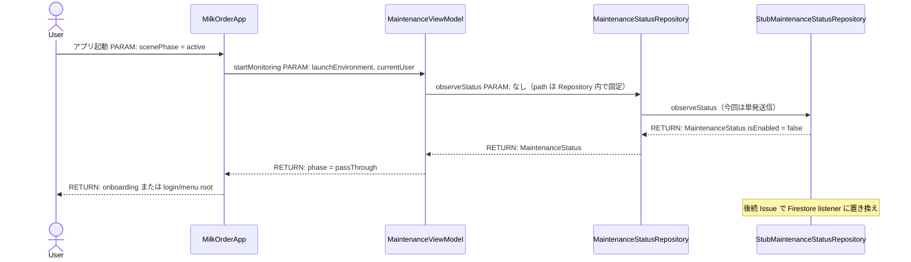
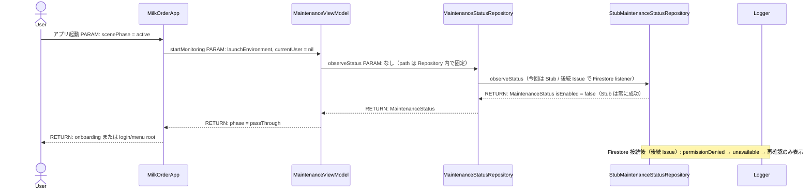
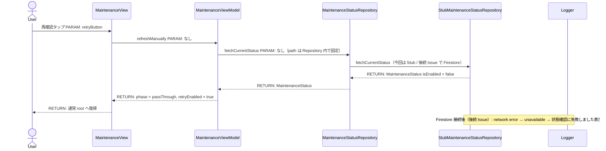
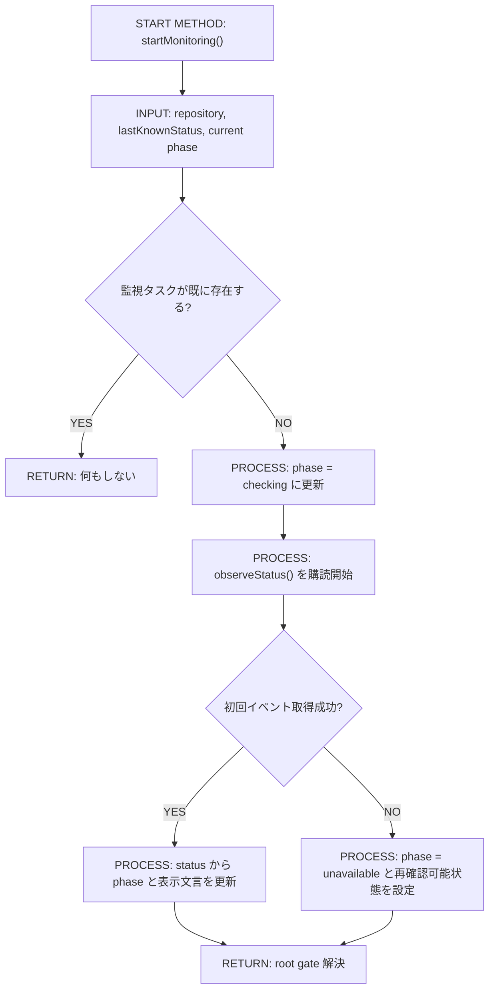
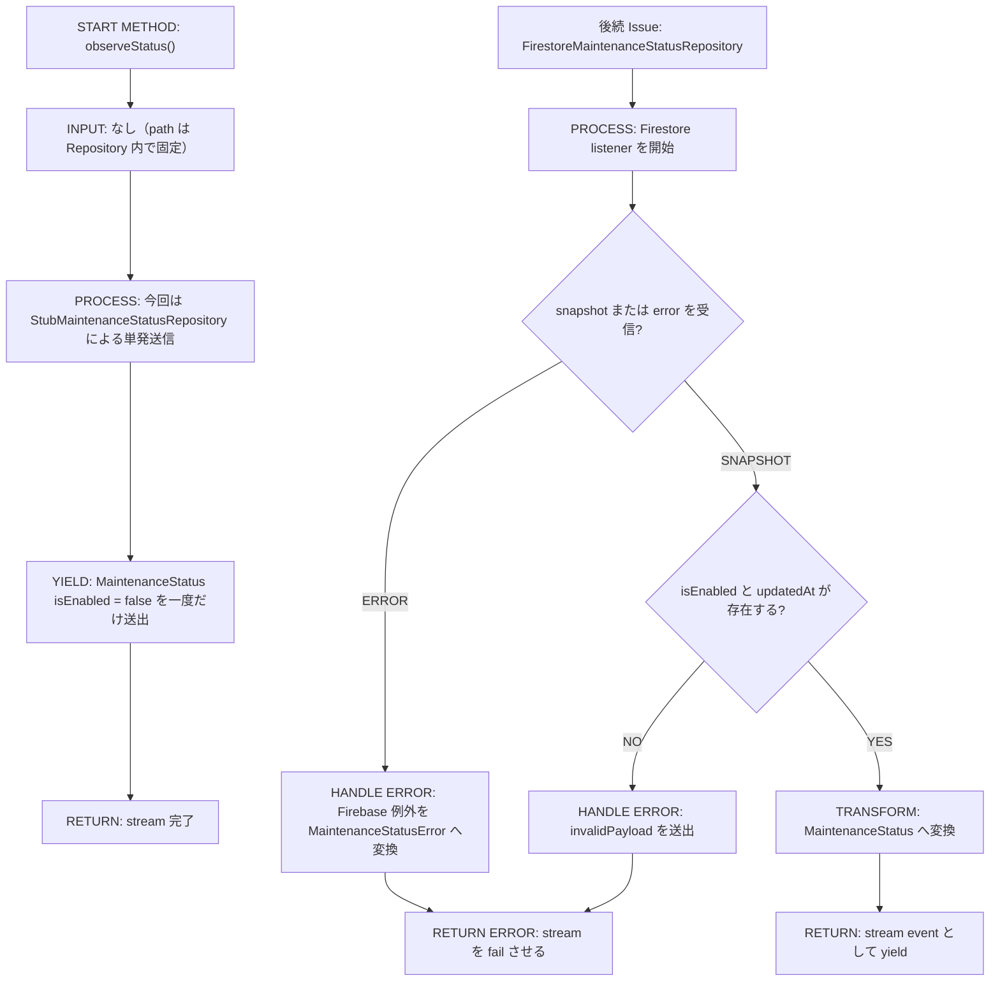
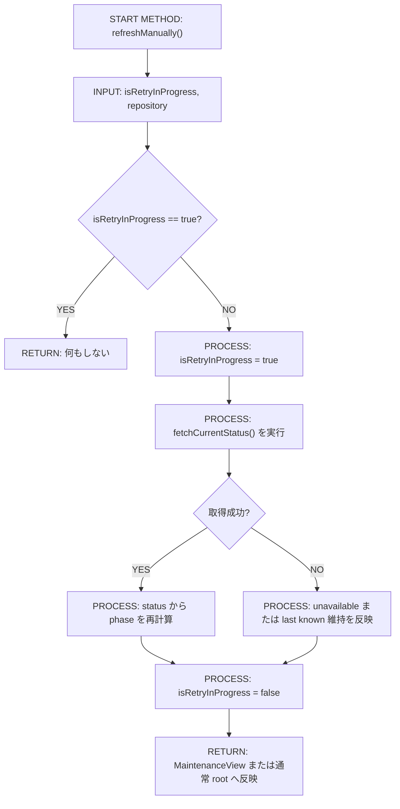
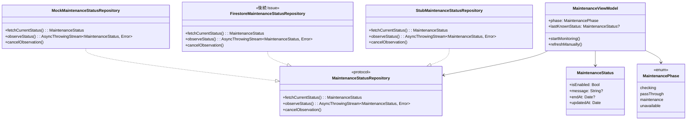
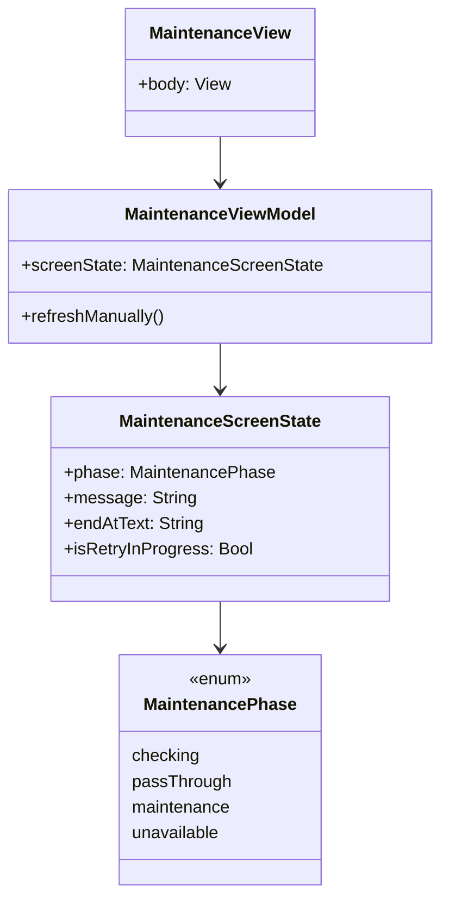

# Implementation Plan — SCR-019 システムメンテナンス画面

---

## 0. 実装入力コンテキスト

| 項目 | 記入 |
| --- | --- |
| 対象Issue | `[DESIGN] システムメンテナンス画面（SCR-019）` |
| 対象リポジトリ内パス（実装起点） | `MilkOrder/` |
| 前提 plan | `.github/copilot/plans/scr-001-login.md`（未ログイン root 導線）, `.github/copilot/plans/scr-002-menu.md`（ログイン後 root 導線）, `.github/copilot/plans/scr-018-onboarding.md`（起動時の先行判定と `MilkOrderApp` 組み込みパターン） |

運用補足: Agent が実装時に直接参照する入力のみを記載する。未確定は `TBD（理由/決定条件/期限）` で記載する。

### 0.1 変更サマリ一覧

| 区分 | 対象 | 変更概要 |
| --- | --- | --- |
| 追加 | `MaintenanceStatus` | Firestore のメンテナンス状態ドキュメントをアプリで扱うドメインモデルを追加する |
| 追加 | `MaintenancePhase` / `MaintenanceScreenState` / `MaintenanceStatusError` | root 分岐と画面表示に必要な状態モデル・エラー型を追加する |
| 追加 | `MaintenanceStatusRepository` | メンテナンス状態の単発取得と状態ストリームを抽象化する Protocol を追加する |
| 追加 | `StubMaintenanceStatusRepository` | Firebase 未導入でも動作する Stub 実装を追加する（常に `isEnabled = false` を返す） |
| 追加 | `MockMaintenanceStatusRepository` | Preview / Unit Test / UI Test 用の決定的なモック実装を追加する |
| 追加 | `MaintenanceViewModel` | 起動時判定・常時監視・再確認・メッセージ整形・root 復帰条件を担う `@MainActor` ViewModel を追加する |
| 追加 | `MaintenanceView` | メンテナンス中メッセージ、終了予定時刻、再確認ボタンのみを表示する新規画面を追加する |
| 修正 | `AppEnvironment` | `maintenanceStatusRepository` を保持し `preview()` に Mock を注入し、本体には `StubMaintenanceStatusRepository` を注入する |
| 修正 | `MilkOrderApp` | メンテナンス判定をオンボーディング・ログイン判定より先に組み込み、利用中も root で強制表示できるようにする |
| 追加 | `MaintenanceViewModelTests` | 起動時判定、phase 遷移、再確認、未保存データ破棄前提の回帰を Stub ベースで検証する Unit テストを追加する |
| 追加 | `MaintenanceFlowUITests` | 未ログイン時表示、利用中の強制遷移、再確認での復帰を検証する UI テストを追加する |

### 0.2 入力制約一覧

| 制約区分 | 制約内容 | 適用対象 |
| --- | --- | --- |
| 互換性 | メンテナンス解除後は既存のオンボーディング判定と `currentUser` 判定へ復帰し、ログインセッション自体は破棄しない | `MilkOrder/MilkOrderApp.swift` |
| 互換性 | 既存の `LoginView` / `MenuRootView` / 注文系 ViewModel の責務は変更せず、root 分岐のみで遮断する | `MilkOrder/Features/Login/`, `MilkOrder/Features/Menu/`, `MilkOrder/MilkOrderApp.swift` |
| 禁止事項 | 管理者だけを通常画面へ通すバイパスを実装しない | メンテナンス機能全体 |
| 禁止事項 | `MaintenanceView` にログアウト、戻る、通常画面へ遷移するボタンを置かない | `MilkOrder/Features/Maintenance/` |
| 禁止事項 | View / ViewModel から Firebase SDK を直接 import しない | `MaintenanceView`, `MaintenanceViewModel` |
| 禁止事項 | Firestore ドキュメントの書き込み UI や管理画面側のトグル操作を本実装に含めない | iOS アプリ全体 |
| その他 | 起動時判定はメンテナンス判定を最優先とし、オンボーディング・ログイン状態判定より先に評価する | `MilkOrder/MilkOrderApp.swift` |
| その他 | 利用中にメンテナンスが有効化された場合は警告ダイアログなしで即時 root をメンテナンス画面へ切り替え、途中入力は破棄する | `MilkOrder/MilkOrderApp.swift`, `MaintenanceViewModel` |
| その他 | `#Preview` と Unit Test は Firebase なしで決定的に動作させる | `AppEnvironment.preview()`, `MockMaintenanceStatusRepository` |
| その他 | UI テストは launch environment によるモックシナリオ切り替えで実施し、実 Firestore を前提にしない | `MilkOrderApp`, `MockMaintenanceStatusRepository`, `MaintenanceFlowUITests` |
| その他 | 現行 clone では `MilkOrderApp.init()` が `AppEnvironment(...)` を直接生成しているため、少なくとも当該初期化経路と `AppEnvironment.preview()` の両方へ DI 追加を反映する | `MilkOrder/MilkOrderApp.swift`, `MilkOrder/App/AppEnvironment.swift` |
| その他 | 今回は `StubMaintenanceStatusRepository` のみ実装し、Firestore 接続・SDK 導入・Rules 定義・リアルタイム監視はすべて後続 Issue とする | `MilkOrder/Infrastructure/Maintenance/` |

### 0.3 関連機能・関連仕様一覧

| 種別 | パス/識別子 | この設計での利用目的 |
| --- | --- | --- |
| 要件 | Issue #43 本文 1章〜8章 | SCR-019 の表示条件、論点 A〜E、非ゴール、Done 条件を固定する |
| 設計方針 | `.github/copilot/00-index.md` | SSOT 参照順と Design → Implement の流れを固定する |
| 設計方針 | `.github/copilot-instructions.md` | plan を SSOT として実装へ引き継ぐ前提を固定する |
| 実務ルール | `.github/instructions/docs.instructions.md` | plan 記述ルールを固定する |
| 実務ルール | `.github/instructions/mermaid.instructions.md` | Mermaid 図の構文制約を固定する |
| 実務ルール | `.github/instructions/swift.instructions.md` | `@MainActor`、Protocol 依存、Preview 方針を固定する |
| 実務ルール | `.github/instructions/tests.instructions.md` | XCTest / XCUITest の粒度とモック分離を固定する |
| 実務ルール | `.github/instructions/commit-messages.instructions.md` | 実装PRのコミットメッセージ規約を参照させる |
| 要件 | `.github/copilot/10-requirements.md` | 全利用者区分・ログイン必須・可用性要求の根拠にする |
| 設計方針 | `.github/copilot/20-architecture.md` | `AppEnvironment` DI root、環境分離、Firebase 共有契約を固定する |
| 設計方針 | `.github/copilot/30-coding-standards.md` | View / ViewModel / Repository 分離と互換性維持を固定する |
| テスト方針 | `.github/copilot/40-testing-strategy.md` | Unit / UI テストとモック戦略を固定する |
| セキュリティ | `.github/copilot/50-security.md` | Firestore Rules、Secrets 非混入、入力検証を固定する |
| 品質ゲート | `.github/copilot/60-ci-quality-gates.md` | build / lint / test / security コマンドを固定する |
| テンプレート | `.github/copilot/80-templates/implementation-plan.md` | 章立てと新規画面追加テンプレを満たす |
| 既存実装 | `MilkOrder/MilkOrderApp.swift` | オンボーディング判定と `currentUser` 分岐の手前に root メンテナンス gate を追加する対象 |
| 既存実装 | `MilkOrder/App/AppEnvironment.swift` | Repository 注入の DI root |
| 既存実装 | `MilkOrder/Features/Login/LoginView.swift` | 未ログイン通常導線の復帰先 |
| 既存実装 | `MilkOrder/Features/Menu/MenuView.swift` | ログイン後通常導線の復帰先 |
| 既存実装 | `MilkOrder/Domain/Auth/AuthUser.swift` | 管理者バイパスを採用しない判断で参照する権限モデル |
| 既存実装 | `MilkOrder/Infrastructure/Onboarding/UserDefaultsOnboardingRepository.swift` | Mock / Preview / launch environment を使う既存のテスト制御パターン参照 |
| 既存実装 | `MilkOrder/Features/Announcements/AnnouncementsView.swift` | `@StateObject` 注入と Preview 構成の既存パターン参照 |

---

## 1. 実装対象機能と機能ゴール

| 項目 | 内容 | 根拠 |
| --- | --- | --- |
| 実装対象詳細 | SCR-019 システムメンテナンス画面（`MaintenanceView` + `MaintenanceViewModel` + `MaintenanceStatusRepository` Protocol + `StubMaintenanceStatusRepository` + `MilkOrderApp` root 分岐組み込み） | Issue #43 1章, 5章 |
| 機能ゴール | 未ログイン時はアプリ起動直後にメンテナンス状態を判定し、メンテナンス中ならログイン画面を出さず SCR-019 のみを表示する。今回は Stub 実装によりメンテナンス画面・root 制御・DI 構成の基本構造を確立する。状態変化の即時検知（リアルタイム監視）は後続 Issue（Firestore 接続 PR）で実装する。 | Issue #43 1章, comment #3490119581 |
| 非ゴール | 管理者向け ON/OFF 切替 UI、通知配信、Requirements 画面一覧更新、Staging / Production の実運用設定変更、Firestore ドキュメントの手動作成代行、管理メニュー連携、Firestore SDK 導入、Firestore Rules 定義、Firebase SPM 追加、Firestore Repository 実装、Snapshot Listener、Firestore 通信 | Issue #43 3章, comment #3490119581 |
| 完了条件 | ① メンテナンス画面（SCR-019）を実装する ② root 切替を実装する ③ Repository を Protocol 化する ④ StubRepository を実装する（常に `isEnabled = false` を返す） ⑤ AppEnvironment へ DI する ⑥ Unit Test・Preview が Firebase なしで動作する ⑦ `#Preview` が Firebase なしで動く ⑧ build / lint / test / security 計画が固定されている | Issue #43 5章, comment #3490119581 |
| 受入確認手順 | UI テストの launch environment で active-on-launch / inactive-then-active / active-then-inactive-on-refresh の 3 シナリオを起動し、未ログイン表示・利用中の強制遷移・再確認復帰を確認したうえで build / lint / test（Firebase なし） を実行する | Issue #43 7章 |

---

## 2. 前提・制約（SSOT）

| 種別 | 内容 | 根拠（ファイル/ADR/Issue） |
| --- | --- | --- |
| 参照したSSOT | `.github/copilot/00-index.md`, `.github/copilot/05-structure/monorepo.md`, `.github/copilot-instructions.md`, `.github/instructions/docs.instructions.md`, `.github/instructions/mermaid.instructions.md`, `.github/instructions/swift.instructions.md`, `.github/instructions/tests.instructions.md`, `.github/instructions/commit-messages.instructions.md`, `.github/copilot/10-requirements.md`, `.github/copilot/20-architecture.md`, `.github/copilot/30-coding-standards.md`, `.github/copilot/40-testing-strategy.md`, `.github/copilot/50-security.md`, `.github/copilot/60-ci-quality-gates.md`, `.github/copilot/80-templates/implementation-plan.md` | SSOT 参照順 / Issue #43 2.1 |
| アーキテクチャ前提（View/ViewModel/Repository） | `MaintenanceView` は表示のみ、`MaintenanceViewModel` は root のメンテナンス phase 管理とメッセージ整形を担い、`MaintenanceStatusRepository` は状態取得・監視を抽象化し、今回の具象実装は `StubMaintenanceStatusRepository` のみとする。Firebase SDK は将来の `FirestoreMaintenanceStatusRepository` に閉じ込める（今回は対象外） | Issue #43 4章, `.github/copilot/20-architecture.md`, `.github/copilot/30-coding-standards.md`, comment #3490119581 |
| iOS バージョン要件 | `Swift Concurrency`, `NavigationStack`, `@StateObject`, `AsyncStream` を既存アプリと同一 deployment target 前提で利用する | `MilkOrder.xcodeproj/project.pbxproj`, `.github/copilot/60-ci-quality-gates.md` |
| 技術制約（互換性/期限/運用/セキュリティ） | 今回は Firestore 接続なし。`StubMaintenanceStatusRepository` で常に `isEnabled = false` を返す。管理者バイパスは採用しない。Firebase 採用決定後に `FirestoreMaintenanceStatusRepository` へ差し替えるだけで動作する構造を維持する。 | Issue #43 論点B, comment #3490119581 |
| 技術制約（現行実装との差分） | 現行 clone には `firebase/` ディレクトリと Firebase SDK が存在しない。実装では `MilkOrderApp.init()` と `AppEnvironment.preview()` に `StubMaintenanceStatusRepository` を DI 追加する。Rules 定義・Firestore 接続は後続 Issue。 | `MilkOrder/MilkOrderApp.swift`, `MilkOrder/App/AppEnvironment.swift`, comment #3490119581 |
| 未確定前提（TBD） | Firebase 採用可否が未確定のため、今回は Firestore 接続なしの実装とする。Firebase 採用決定後、`StubMaintenanceStatusRepository` を `FirestoreMaintenanceStatusRepository` に置き換えるだけで完成する構造とする。 | comment #3490119581 |

---

## 3. 要件定義（実装受入条件）

### 3.1 機能要件

| ID | 要件 | 受入条件（テスト可能な形） | 備考 |
| --- | --- | --- | --- |
| FR-01 | アプリ起動直後にメンテナンス状態を最優先で判定する | `MilkOrderApp` がメンテナンス phase の解決前に `OnboardingView` / `LoginView` / `MenuRootView` を描画しない | |
| FR-02 | メンテナンス中の未ログインユーザーには SCR-019 のみを表示する | 初期状態で `isEnabled == true` のとき、ログイン画面の入力欄やボタンが存在せず、SCR-019 の文言・再確認ボタンのみが表示される | |
| FR-03 | ログイン後利用中にメンテナンスが開始したら即時に SCR-019 へ切り替える | 通常画面表示後に監視ストリームが `isEnabled == true` を返すと root がメンテナンス画面へ切り替わり、注文入力 UI へ戻れない | |
| FR-04 | SCR-019 は Firestore の任意メッセージを優先表示し、未設定時は固定既定文言を表示する | `message` が空文字または `nil` のとき既定文言を表示し、非空文字列ならその値を表示する | |
| FR-05 | 終了予定時刻がある場合は表示し、ない場合は代替文言を表示する | `endAt != nil` なら日本語日時を表示し、`endAt == nil` なら「終了時刻は未定です」を表示する | |
| FR-06 | SCR-019 には通常画面へ遷移しうる操作を置かない | 画面上にログアウト、戻る、閉じる、メニュー遷移ボタンが存在しない | |
| FR-07 | 再確認ボタン押下で単発取得を行い、解除済みなら通常 root へ復帰する | `isEnabled == false` を再取得すると `MaintenancePhase.passThrough` へ遷移し、オンボーディングまたはログイン/メニュー root が再表示される | |
| FR-08 | 管理者を含む全利用者区分が同一のメンテナンス制約を受ける | `UserRole.orderEntry`, `operator`, `admin` のいずれでも `isEnabled == true` 中は同じ SCR-019 が表示される | |
| FR-09 | メンテナンス監視は状態ストリームを通じて反映する。今回は Stub による単発送信のみを実装し、状態変化の即時反映は後続 Issue で実装する | `observeStatus()` が `AsyncThrowingStream` を返す Protocol を定義。今回の Stub は一度だけ `isEnabled = false` を送出して完了する | 後続 Issue にて Firestore Snapshot Listener で即時反映に置き換え |
| FR-10 | メンテナンス中に途中入力が存在しても警告なしで即時遷移し、復帰時に以前の編集中状態を再利用しない | 注文入力中シナリオでメンテナンス開始後、復帰先は `MenuRootView` から再構築され、以前の draft が保持されない | |
| FR-11 | Firestore ドキュメント path とフィールド定義を将来実装のために設計として固定する（今回は接続しない） | 将来の `FirestoreMaintenanceStatusRepository` 実装時に `publicSystemStatus/maintenance` を読み、`isEnabled: Bool`, `message: String?`, `endAt: Timestamp?`, `updatedAt: Timestamp` を契約として扱う | 後続 Issue（Firestore 接続 PR） |
| FR-12 | `#Preview` / Demo / UI Test は Firebase 非依存で動作する | `AppEnvironment.preview()` と launch environment シナリオで `MockMaintenanceStatusRepository` が注入される | |

### 3.2 非機能要件

| ID | 要件 | 受入条件（テスト可能な形） |
| --- | --- | --- |
| NFR-01 | UI 更新は `@MainActor` で保護する | `MaintenanceViewModel` に `@MainActor` を付与し、phase と表示文字列更新を ViewModel に限定する |
| NFR-02 | View / ViewModel は Firebase SDK と Firestore 型を直接参照しない | `import FirebaseFirestore` は将来の `MilkOrder/Infrastructure/Maintenance/` のみで完結する。今回の Stub 実装でも同じレイヤ境界を維持する |
| NFR-03 | Firestore の未認証アクセス制御は後続 Issue で定義する（今回は Stub のみ） | 後続 Issue にて `firebase/firestore.rules` で `match /publicSystemStatus/{docId}` に対し `allow get: if docId == "maintenance"`, `allow list, create, update, delete: if false` 相当を定義する |
| NFR-04 | ログや UI に Secrets / PII を出さない | ログは phase、path、エラー分類、`updatedAt` の有無だけを出し、自由文メッセージ全文や認証情報を出さない |
| NFR-05 | 品質ゲートとして build / lint / test / security の実行計画を持つ | 9.2 に 4 つのコマンドと判定基準が明記されている |
| NFR-06 | `#Preview` は Firebase なしでメンテナンス画面と通常画面の両方を再現できる | `MockMaintenanceStatusRepository` の状態差し替えで active / inactive の Preview が成立する |

---

## 4. スコープ境界

### 4.0 スコープ境界の定義（機能単位）

| 区分（In-Scope/Out-of-Scope） | 対象機能/責務 | 判定理由 |
| --- | --- | --- |
| In-Scope | `MaintenanceStatus` と関連状態型の追加 | Firestore 契約と root 表示条件を型で固定するため |
| In-Scope | `MaintenanceStatusRepository` Protocol の追加 | 単発取得とストリームを Protocol 越しに扱うため |
| In-Scope | `StubMaintenanceStatusRepository` の追加 | Firebase 未導入でも製造可能にするため。常に `isEnabled = false` を返す |
| In-Scope | `MockMaintenanceStatusRepository` の追加 | Preview / Unit Test / UI Test 用の決定的なモック実装 |
| In-Scope | `MaintenanceViewModel` | 起動時判定、監視開始、再確認、終了時刻整形、即時遷移の責務を持たせるため |
| In-Scope | `MaintenanceView` | 画面表示、再確認ボタン、アクセシビリティ ID 付与の責務を持たせるため |
| In-Scope | `MilkOrderApp` root 分岐更新 | オンボーディング / ログイン判定より手前でメンテナンス gate を設置するため |
| In-Scope | `AppEnvironment` DI 追加 | `StubMaintenanceStatusRepository` を注入し、将来 `FirestoreMaintenanceStatusRepository` へ差し替えるだけで動作する構造を維持するため |
| In-Scope | Unit Test / UI Test 追加 | 未ログイン表示、利用中強制遷移、再確認復帰を Stub ベースで自動検証するため |
| Out-of-Scope | `FirestoreMaintenanceStatusRepository` 実装 | Firebase 採用未確定のため後続 Issue |
| Out-of-Scope | Firestore SDK（Firebase SPM）追加 | Firebase 採用未確定のため後続 Issue |
| Out-of-Scope | Firestore Snapshot Listener | Firebase 未導入のため後続 Issue |
| Out-of-Scope | Firestore 通信・権限エラー・ネットワークエラーの実装 | Firebase 未導入のため後続 Issue |
| Out-of-Scope | `firebase/firestore.rules` 定義 | Firebase 未導入のため後続 Issue |
| Out-of-Scope | Firestore 関連 Unit Test（`FirestoreMaintenanceStatusRepositoryTests`） | Firebase 未導入のため後続 Issue |
| Out-of-Scope | Firebase コンソールでのドキュメント作成・運用手順書 | 本 Issue の非ゴールであり、設計では path と fields だけを固定すればよい |
| Out-of-Scope | 管理者向けトグル UI、管理メニュー連携、React admin 実装 | 別 Issue 想定であり、本 feature の読み取り側と遮断制御だけを対象にする |
| Out-of-Scope | メンテナンス開始前の警告ダイアログや draft 保存復元 | 論点E で MVP は即時遷移・破棄を採用するため |
| Out-of-Scope | Push 通知・メール通知との連携 | SCR-013 連携は対象外 |

### 4.2 実装時の影響範囲・互換性リスク

| 影響対象 | 結論（影響あり/なし/未確定） | 影響内容 |
| --- | --- | --- |
| UI/画面 | 影響あり | アプリ root に SCR-019 が挿入され、通常画面より高優先で表示される |
| API/外部通信 | **今回なし**（後続 Issue） | 今回は Stub 実装のみ。Firestore 通信は後続 Issue で追加する |
| データモデル | 影響あり | `MaintenanceStatus` などの新規ドメイン型が追加される |
| ローカル状態 | 影響あり | メンテナンス開始時に既存の NavigationStack / `@StateObject` が破棄され、入力途中状態が再利用されない |
| 外部依存（SPM） | **今回なし**（後続 Issue） | Firebase 採用未確定のため今回は SPM 追加なし |
| CI/運用 | 影響あり | UI テストに起動シナリオ制御が追加される（Stub ベース） |

### 4.3 外部依存・Secrets の扱い

| 項目 | 内容 | リスク/対応 |
| --- | --- | --- |
| 外部依存の追加/更新（SPM） | **今回なし** | Firebase 採用未確定のため今回は SPM 追加なし。後続 Issue（Firestore 接続 PR）にて Firebase 導入を判断する |
| Secrets 利用有無 | なし | Firestore path・公開メッセージのみを扱い、認証情報や鍵は扱わない |
| ログ/設定への機密混入対策 | launch environment は UI テスト用のシナリオ文字列だけを扱い、メンテナンス文面全文やアカウント情報を渡さない | `.github/copilot/50-security.md` に従い非機密テスト制御値のみ許可する |

### 4.4 4章の自己検証（必須）

| チェック項目 | 合格条件 | 判定 |
| --- | --- | --- |
| Design PR 差分を書いていないか | 実装責務だけを書き、設計ドキュメント差分の説明を書いていない | OK |
| 実装責務を書いているか | In-Scope に実装責務が2件以上ある | OK（8件） |
| 実装影響を書いているか | 4.2 で `影響あり` が1件以上あり、影響内容が具体的 | OK（UI/データモデル/ローカル状態/CI）|

---

## 5. アーキテクチャ設計

### 5.0 依存注入経路（DI）

本プロジェクトは Protocol ベースの依存注入を採用する。View は Protocol に依存し、具象実装を直接 import しない。

| 区分（記載例/追記No） | 提供主体 | Protocol 名 | 具象実装名 | 入力（型/値） | 出力（型/値） | 境界制約（禁止事項を含む） |
| --- | --- | --- | --- | --- | --- | --- |
| 記載例 | `AppEnvironment` | `MilkOrderRepository（Protocol）` | `MilkOrderRepositoryImpl` | 設定/環境値 | Repository インスタンス | View から具象を直接 import しない |
| 01 | `AppEnvironment` | `MaintenanceStatusRepository（Protocol）` | `StubMaintenanceStatusRepository`（今回）/ `FirestoreMaintenanceStatusRepository`（後続 Issue） | 時刻フォーマッタ、launch environment の UI テストシナリオ | `any MaintenanceStatusRepository` | View / ViewModel から Firebase SDK と Firestore path 文字列を直接参照しない |
| 02 | `MaintenanceViewModel.init` | `MaintenanceStatusRepository（Protocol）` | — | `any MaintenanceStatusRepository` | `MaintenanceViewModel` | ViewModel は `AuthUser.role` によるバイパス判定や Firestore 型判定を持たない |
| 03 | `MilkOrderApp` | — | — | `MaintenanceViewModel`, `OnboardingViewModel`, `AppEnvironment.currentUser` | `MaintenanceView` または既存 root | メンテナンス root 切替は `MilkOrderApp` に限定し、個別画面から通常 root を直接 push しない |

#### 5.0.1 最小固定セット（TBD禁止）

| 最小固定項目 | 必須記載内容 | 対応セクション |
| --- | --- | --- |
| DI 経路 | `AppEnvironment -> MaintenanceViewModel -> MaintenanceView` を固定し、`MilkOrderApp` が最終 root 表示責務を持つ | `5.0`, `5.7.0`, `5.7.2` |
| MainActor 境界 | `MaintenanceViewModel` が `@MainActor` で phase と表示文字列を更新し、Firestore 監視そのものは background 側で行う | `5.5.1`, `8.3` |
| Protocol/具象 境界 | `MaintenanceView` / `MaintenanceViewModel` は `MaintenanceStatusRepository` だけに依存し、`StubMaintenanceStatusRepository` / `FirestoreMaintenanceStatusRepository` は `Infrastructure/Maintenance/` に閉じ込める | `8.3`, `8.4` |

### 5.1 設計判断

#### 5.1.1 責務分離 / データフロー（詳細）

| 記載形式 | 選択（A/B） |
| --- | --- |
| 形式A: 箇条書き |  |
| 形式B: テーブル | 採用 |

形式B（テーブル）
| No. | 決定事項（実装責務単位） | 根拠 | 未確定（あれば） |
| --- | --- | --- | --- |
| 1 | 論点A: 今回の状態取得方式は `StubMaintenanceStatusRepository` による決定的な値（常に `isEnabled = false`）で実装する。`observeStatus()` は一度だけ `isEnabled = false` を返し、`fetchCurrentStatus()` も常に `isEnabled = false` を返す。Firestore Snapshot Listener を用いたリアルタイム更新は後続 Issue とする。 | 今回は Firebase 採用未確定のため Stub でメンテナンス画面・root 制御・DI を先行実装する。将来 `FirestoreMaintenanceStatusRepository` に差し替えるだけで動作する構造を維持する。 | なし |
| 2 | 論点B: 管理者バイパスは採用しない。`orderEntry` / `operator` / `admin` の全ロールで同一の root 遮断を適用する。 | Issue の機能概要が全利用者区分対象であり、バイパスを入れるとテスト行列・セキュリティ説明・運用整合が複雑化するため。 | なし |
| 3 | 論点C: 未認証読み取りは `publicSystemStatus/maintenance` のみへ限定し、`allow get` のみ許可する。公開可能な運用状態だけを専用コレクションへ分離し、既存の認証必須コレクションとは rules を分ける。 | `.github/copilot/50-security.md` の「Firestore Security Rules でアクセス制御」を守りつつ、未認証 login 前表示を成立させるため。 | なし |
| 4 | 論点D: 起動順序は `maintenance gate -> onboarding gate -> currentUser gate` で固定する。メンテナンス phase が解決するまで他の root 分岐は評価しない。 | Issue が「他のあらゆる起動時判定より先」を要求しており、現行 app にはオンボーディング判定もあるため。 | なし |
| 5 | 論点E: 利用中にメンテナンスが開始した場合、未保存データは警告なしで破棄し、復帰後は root から再構築する。 | MVP で実装範囲を最小に保ちつつ、操作継続を確実に遮断できるため。 | なし |
| 6 | 起動時の初回取得に失敗した場合は fail-closed とし、通常画面へ通さず SCR-019 レイアウト上で「状態確認に失敗しました」系の汎用文言と再確認ボタンを表示する。 | maintenance 中の誤通過を避ける方が優先度が高く、再確認導線も要件に含まれるため。 | なし |
| 7 | 監視開始後に一度 `passThrough` へ到達した後の一時的な監視失敗では last known state を維持し、アプリ利用中のネットワーク瞬断だけで即遮断しない。 | 非 maintenance 時に過剰な誤遮断を避けつつ、次の正常イベントまたは手動再確認で復帰可能にするため。 | なし |

#### 5.1.2 エッジケース / 例外系 / リトライ方針（詳細）

| 記載形式 | 選択（A/B） |
| --- | --- |
| 形式A: 箇条書き |  |
| 形式B: テーブル | 採用 |

形式B（テーブル）
| No. | ケース | 方針（戻り値/表示/再試行） | 根拠 | 未確定（あれば） |
| --- | --- | --- | --- | --- |
| 1 | `message` が `nil` または空文字 | 既定文言「ただいまシステムメンテナンス中です。ご不便をおかけしております。」を表示する | Firestore 上書きは任意であり、空でも画面成立が必要 | なし |
| 2 | `endAt` が未設定 | 「終了時刻は未定です」を表示する | Issue 明示要件 | なし |
| 3 | 初回取得で permission denied / not found / invalid payload | `MaintenancePhase.unavailable` とし、通常画面へ進めず再確認ボタンを表示する | fail-closed 採用 | なし |
| 4 | 監視中の一時的な network error | 直前が `passThrough` なら phase を維持し logger に記録、再接続継続。直前が `maintenance` ならメンテナンス画面を維持したまま再確認可能にする | 利用中の誤遮断と maintenance 誤解除を両方避けるため | なし |
| 5 | `updatedAt` 欠落 | `invalidPayload` として扱い unavailable へ遷移する | 管理者編集ミスを早期検知し、曖昧な状態で通過しないため | なし |
| 6 | 再確認ボタン連打 | `isRetryInProgress == true` 中は追加実行を無視し、ボタンを disable する | 二重取得防止 | なし |
| 7 | 利用中に `isEnabled` が `false -> true -> false` と短時間で変化 | stream の最新イベントだけを反映し、`MaintenanceViewModel` が phase を上書きする。復帰後は `MilkOrderApp` が新しい root を再生成する。 | snapshot listener の順序保証と root 再構築方針に依存する | なし |

#### 5.1.3 SwiftUI View 部品一覧

| レイヤ | View/コンポーネント名（設計上の候補） | 主責務 | 対応機能 |
| --- | --- | --- | --- |
| Screen | `MaintenanceView` | メンテナンス画面全体のレイアウト表示 | FR-02, FR-04, FR-05, FR-06, FR-07 |
| Section | `MaintenanceMessageSection` | メッセージ本文と補足表示 | FR-04 |
| Section | `MaintenanceScheduleSection` | 終了予定時刻または代替文言表示 | FR-05 |
| Component | `MaintenanceRetryButton` | 再確認操作と disable 状態表示 | FR-07 |
| Component | `MaintenanceUnavailableCaption` | unavailable 時の汎用説明文表示 | 5.1.1-6 |
| Atom | `MaintenanceStatusIcon` | 画面先頭の status icon 表示 | 視認性 |
| Atom | `MaintenanceUpdatedAtText` | `updatedAt` に基づく補助情報表示 | 運用確認補助 |

#### 5.1.4 ログと観測性（漏洩防止を含む / 詳細）

| 記載形式 | 選択（A/B） |
| --- | --- |
| 形式A: 箇条書き |  |
| 形式B: テーブル | 採用 |

形式B（テーブル）
| No. | 観点 | 方針 | 根拠 | 未確定（あれば） |
| --- | --- | --- | --- | --- |
| 1 | ログ出力内容 | `phase`, `isEnabled`, `path`, `error category`, `updatedAt` の有無のみを構造化して出力する | 監視成否を追える最小限の情報にする | なし |
| 2 | マスキング/非出力項目 | Firestore の自由文 `message` 全文、認証状態詳細、ユーザーID、ログインID、draft 内容を出力しない | `.github/copilot/50-security.md` | なし |
| 3 | エラー記録粒度 | Repository で外部 I/O 例外を分類し、ViewModel ではユーザー向けの phase 変換だけを行う | 例外変換責務を一箇所に集約するため | なし |

### 5.2 トレードオフ

| 判断テーマ | 案A | 案B | 採用案 | 採用理由 | 不採用理由 |
| --- | --- | --- | --- | --- | --- |
| 今回の実装方式 | Firestore 接続まで実装を延期する | Stub 実装で先行製造し、後続 Issue で Firestore に差し替える | 案B（今回） | Firebase 採用未確定でも DI 構造・画面・root 制御を先行確立できる | 延期すると Firebase 採用決定後の全部作りになりリードタイム増大 |
| 将来の状態取得方式（後続 Issue） | 起動時 / 再確認時の単発取得のみ | snapshot listener + 再確認時単発取得 | 案B（後続 Issue） | 利用中の開始を即時検知できるため | 単発取得のみでは利用中の遮断要件を満たせない |
| 管理者向け例外 | 管理者バイパスあり | 全ロール共通で遮断 | 案B | 要件とセキュリティ説明が最も単純 | 例外を入れるとロール別の起動 / 監視 / UI テストが増える |
| 公開ドキュメント配置（後続 Issue） | 既存 protected collection に 1 ドキュメント追加 | 専用公開 collection `publicSystemStatus` を追加 | 案B（後続 Issue） | 未認証 read 範囲を明示的に隔離できる | 既存コレクションを公開すると rules 誤設定リスクが上がる |
| 取得失敗時の扱い（初回） | fail-open で通常画面へ進める | fail-closed で unavailable 表示に留める | 案B | maintenance 中の誤通過を避ける方が重要 | fail-open は要件の「通常機能を提供しない」を破り得る |
| 途中入力の扱い | ローカル保存して復元 | 即時破棄して root 再構築 | 案B | MVP として実装範囲が最小で、強制遮断を簡潔に保証できる | 復元は状態保存・互換性・テスト範囲を大きく増やす |

### 5.3 ナビゲーション方針

| 項目 | 決定内容 | 根拠 |
| --- | --- | --- |
| ナビゲーション方式（NavigationStack / TabView / Sheet） | `MilkOrderApp.WindowGroup` の root switch を優先し、メンテナンス中は `MaintenanceView` を単独表示する | Issue #43 論点D |
| 画面遷移の責務（誰が遷移を制御するか） | `MilkOrderApp` が `maintenanceViewModel.phase` を見て root を切り替える。`MaintenanceView` 自体は push / pop を持たない | View は表示専用に保つため |
| ディープリンク対応 | なし。メンテナンス phase 中はディープリンク解決より先に遮断する | 今回の要件外 |
| 遷移時のデータ受け渡し方式 | `AppEnvironment` が Repository を保持し、`MaintenanceViewModel` を `@StateObject` で root に保持する | 既存 `OnboardingViewModel` パターンと整合 |

### 5.4 アーキテクチャレイヤー方針

| レイヤ | 定義 | 許可する依存方向 | 禁止する依存 |
| --- | --- | --- | --- |
| View | SCR-019 の SwiftUI 表示のみ | `MaintenanceViewModel` のみ | Firestore SDK / Repository 具象を直接 import しない |
| ViewModel | phase 管理・UI 文字列整形・再確認操作 | `MaintenanceStatusRepository` のみ | Firebase SDK / `AuthUser.role` バイパス分岐を直接持たない |
| Repository | メンテナンス状態取得・監視の抽象 | Firestore DataSource 相当の具象または SDK ラッパ | View / ViewModel を import しない |
| DataSource | Firestore document `publicSystemStatus/maintenance` の get / listener 具象 | FirebaseFirestore | View / ViewModel を import しない |
| Model/Entity | `MaintenanceStatus`, `MaintenanceScreenState`, `MaintenancePhase`, `MaintenanceStatusError` | なし | 他レイヤに依存しない |

### 5.5 データ取得ライフサイクル

| データ種別 | 取得タイミング | 取得場所 | 理由 |
| --- | --- | --- | --- |
| 初期表示必須データ | `MilkOrderApp` root の `.task { await maintenanceViewModel.startMonitoring() }` | `MaintenanceViewModel` | 他の root 判定より先にメンテナンス state を解決する必要があるため |
| ユーザー操作後データ | 再確認ボタン押下時 | `MaintenanceViewModel.refreshManually()` | 解除直後の即時復帰を担保するため |
| 初回状態取得のみ（今回） | `MaintenanceViewModel.startMonitoring()` 起動時 / `refreshManually()` 再確認時 | `StubMaintenanceStatusRepository`（今回） | Stub は単発送信のみ。バックグラウンド継続監視は後続 Issue で追加する |
| バックグラウンド更新（後続 Issue） | Firestore snapshot listener による継続監視 / `scenePhase == .active` で再接続 | `FirestoreMaintenanceStatusRepository`（後続 Issue） | 利用中の開始を即時検知しつつ、アプリ復帰時にも最新化するため |

| キャッシュ方針 | 採用有無 | ルール |
| --- | --- | --- |
| インメモリキャッシュ | 採用 | `MaintenanceViewModel` が `lastKnownStatus` を 1 件だけ保持し、監視失敗時の表示判定に使う |
| ディスクキャッシュ | 不採用 | メンテナンス状態は運用が即時更新し得るため、永続キャッシュで stale state を残さない |

#### 5.5.1 MainActor/BackgroundActor 境界

| 対象処理 | 実行コンテキスト（MainActor/background） | 実装場所 | 禁止事項 |
| --- | --- | --- | --- |
| UI 更新 | MainActor | `MaintenanceViewModel`, `MilkOrderApp` | background スレッドから SwiftUI state を更新しない |
| ネットワーク通信 | background（async/await） | `StubMaintenanceStatusRepository`（今回）/ 将来 `FirestoreMaintenanceStatusRepository` | Main スレッドをブロックしない |
| DB アクセス | background（Stub 単発 / 後続 Issue で Firestore listener） | `StubMaintenanceStatusRepository`（今回） | Firestore の raw snapshot を ViewModel へそのまま渡さない（後続 Issue で適用） |
| 認証/権限判定 | background（Security Rules に委譲） | Firestore / Repository | View / ViewModel で未認証許可可否を独自判定しない |

### 5.6 エラーハンドリング標準形

| 分類（network/unauthorized/notfound/validation/unknown） | エラー型 | UI 表示ルール | 再試行ルール |
| --- | --- | --- | --- |
| network | `MaintenanceStatusError.network` | 初回取得前なら unavailable、監視中で `passThrough` 済みなら last known phase 維持 | 再確認ボタン（今回は Stub のため発生しない。後続 Issue で Firestore 接続時に検証） |
| unauthorized | `MaintenanceStatusError.permissionDenied` | unavailable を表示し通常画面へ進めない | rules 修正まで継続不可（後続 Issue で Firestore 接続時に検証） |
| notfound | `MaintenanceStatusError.invalidPayload` | unavailable を表示し path / document misconfiguration とみなす | Firestore ドキュメント作成後に再確認（後続 Issue） |
| validation | `MaintenanceStatusError.invalidPayload` または ViewModel の no-op | 画面は unavailable または現在表示維持 | payload 修正、ボタン多重押下は no-op |
| unknown | `MaintenanceStatusError.unknown` | unavailable へ遷移または last known 維持 | 再確認と自動再接続 |

| ログ方針 | 内容 |
| --- | --- |
| 出力する情報 | `publicSystemStatus/maintenance` path、phase 変化、エラー分類、`updatedAt` の存在、再確認実行結果 |
| 出力しない情報（Secrets/PII） | 文言全文、ユーザー識別子、入力途中の注文情報、認証情報 |

#### 5.6.1 エラー変換責務（例外 → ドメインエラー）

| 変換対象 | 例外発生層 | ドメインエラーへ変換する層 | 上位層へ渡す型 | 禁止事項 |
| --- | --- | --- | --- | --- |
| ネットワーク例外（今回は Stub のため発生しない / 後続 Issue で Firestore 接続時に実装） | DataSource | `FirestoreMaintenanceStatusRepository`（後続 Issue） | `MaintenanceStatusError.network` | View / ViewModel で Firebase 例外型を直接判定しない |
| Firestore permission denied（後続 Issue） | DataSource | `FirestoreMaintenanceStatusRepository`（後続 Issue） | `MaintenanceStatusError.permissionDenied` | Repository 以外で rules 失敗理由の分岐をしない |
| ドキュメント欠落 / payload 不正（後続 Issue） | DataSource | `FirestoreMaintenanceStatusRepository`（後続 Issue） | `MaintenanceStatusError.invalidPayload` | `isEnabled` や `updatedAt` 欠落を暗黙 default で通さない |
| UI 多重押下 | ViewModel | `MaintenanceViewModel` | 例外を投げず no-op | Repository へ重複呼び出ししない |
| 予期せぬ例外 | 任意層 | Repository 実装（今回は Stub / 後続 Issue で Firestore） | `MaintenanceStatusError.unknown` | stacktrace や機密情報を UI へ渡さない |

### 5.7 シーケンス図（Mermaid / 複数必須）

| 必須項目 | 記載ルール |
| --- | --- |
| DI 経路 | 必須（`AppEnvironment -> ViewModel -> View` を明記） |
| 正常系 | 必須（最低1本） |
| 異常系 | 必須（最低2本。業務エラー系/システムエラー系） |
| パラメータ | 各呼び出しメッセージに `PARAM` を明記 |
| 戻り値 | 各応答メッセージに `RETURN` を明記 |
| エラー返却 | 各異常系で `ERROR` の返却値とハンドリング先を明記 |

#### 5.7.0 DI 経路（テキスト再掲 / 必須）

| No | 開始主体 | 終了主体 | Protocol 名 | 具象実装名 | 経路文字列（`A -> B -> C`） | 境界チェック観点 | 対応シーケンス図ID |
| --- | --- | --- | --- | --- | --- | --- | --- |
| 記載例 | `AppEnvironment` | `SomeScreen` | `MilkOrderRepository（Protocol）` | `MilkOrderRepositoryImpl` | `AppEnvironment -> SomeViewModel -> SomeScreen` | 具象が View/ViewModel に漏れていないこと | SEQ-01 |
| 01 | `AppEnvironment` | `MaintenanceView` | `MaintenanceStatusRepository（Protocol）` | `StubMaintenanceStatusRepository`（今回） / `FirestoreMaintenanceStatusRepository`（後続 Issue） | `AppEnvironment -> MaintenanceViewModel -> MaintenanceView` | Firebase SDK が View/ViewModel に漏れていないこと | SEQ-01 |
| 02 | `AppEnvironment` | 既存 root | `MaintenanceStatusRepository（Protocol）` | `MockMaintenanceStatusRepository` | `AppEnvironment -> MaintenanceViewModel -> MilkOrderApp root switch` | Preview / UI Test で具象差し替えができること | SEQ-02 |

#### 5.7.1 シーケンス対象一覧

| 図ID | 種別（正常/異常） | 起点（画面/操作） | 終点（Repository/外部I/O） | 対応要件ID（FR/NFR） |
| --- | --- | --- | --- | --- |
| SEQ-01 | 正常（DI 経路） | アプリ起動と利用中監視 | StubMaintenanceStatusRepository（今回） / Firestore listener（後続 Issue） | FR-01, FR-02, FR-03, FR-09 |
| SEQ-02 | 異常 | 初回起動時の権限 / payload 不正 | Stub（今回は成功のみ） / Firestore get / listener（後続 Issue） | FR-01, NFR-03 |
| SEQ-03 | 異常 | 再確認ボタン押下時の通信失敗 | Stub（今回は成功のみ） / Firestore get（後続 Issue） | FR-07, NFR-04 |

#### 5.7.1.1 境界整合チェック（必須）

| 境界テーマ | 文章セクション | 表セクション | 図セクション | 整合判定（OK/NG） |
| --- | --- | --- | --- | --- |
| ログ責務（どの層で出力するか） | `5.1.4` | `5.6` | `5.7.3`, `5.7.4` | OK |
| エラー変換責務 | `5.1.2` | `5.6.1` | `5.7.3`, `5.7.4` | OK |
| MainActor/Background 境界 | `5.5.1` | `8.3` | `5.7.2` | OK |

#### 5.7.1.2 最小固定セット具体化チェック（必須）

| 最小固定項目 | 文章セクション | 表セクション | 図セクション | TBD残存数（0のみ可） |
| --- | --- | --- | --- | --- |
| DI 経路（`AppEnvironment -> ViewModel -> View`） | `5.0.1` | `5.0` | `5.7.0`, `5.7.2` | 0 |
| MainActor 境界（UI 更新箇所） | `5.5.1` | `5.5.1` | `5.7.2` | 0 |
| Protocol/具象 境界 | `8.3` | `8.4` | `5.7.2` | 0 |

#### 5.7.2 正常系シーケンス（必須）

#### 5.7.3 異常系シーケンス（業務エラー）

#### 5.7.4 異常系シーケンス（システムエラー）

### 5.8 処理フロー図（メソッドレベル / 複数必須）

| 必須項目 | 記載ルール |
| --- | --- |
| 対象メソッド数 | 必須（最低3メソッド） |
| 分岐 | 各メソッドで正常/異常分岐を明記 |
| 入出力 | 各メソッドの入力/出力を明記 |
| 例外処理 | 例外時の戻り値または伝播先を明記 |

#### 5.8.1 メソッド一覧

| 図ID | メソッド名 | 層（View/ViewModel/Repository/DataSource） | 対応要件ID（FR/NFR） |
| --- | --- | --- | --- |
| FLOW-01 | `MaintenanceViewModel.startMonitoring()` | ViewModel | FR-01, FR-02, FR-03, FR-09 |
| FLOW-02 | `StubMaintenanceStatusRepository.observeStatus()`（今回）/ 将来 `FirestoreMaintenanceStatusRepository.observeStatus()` | Repository/DataSource | FR-03, FR-09, NFR-02 |
| FLOW-03 | `MaintenanceViewModel.refreshManually()` | ViewModel | FR-07, NFR-01 |

#### メソッドフロー（FLOW-01）

#### メソッドフロー（FLOW-02）

#### メソッドフロー（FLOW-03）

---

## 6. 契約仕様（Protocol Contract）

### 6.0 Protocol-DI 固定前提

| 項目 | 固定方針 |
| --- | --- |
| DI 起点 | `AppEnvironment` のみで依存解決する |
| Protocol の責務 | 取得 / 監視のメソッド署名だけを定義し、Firebase 具象実装を含めない |
| 具象実装の配置 | `StubMaintenanceStatusRepository`（今回）と `MockMaintenanceStatusRepository` を `Infrastructure/Maintenance/` に限定する。`FirestoreMaintenanceStatusRepository` は後続 Issue で同じ場所に追加する |
| View / ViewModel の責務 | `MaintenanceStatusRepository` に依存し、具象型・Firestore path・Rules 条件を直接 import しない |

### 6.1 入出力契約（API/関数/UseCase）

| ID | 入口（画面/操作/関数） | 入力 | 出力 | エラー | 備考 |
| --- | --- | --- | --- | --- | --- |
| IFC-01 | `MilkOrderApp` root `.task` → `MaintenanceViewModel.startMonitoring()` | `launchEnvironment`, `lastKnownStatus = nil` | `MaintenancePhase` の継続更新 | `MaintenanceStatusError` を内部で phase へ変換 | 起動時の最優先判定 |
| IFC-02 | `MaintenanceView` 再確認ボタン → `MaintenanceViewModel.refreshManually()` | なし | `MaintenancePhase` 更新、`isRetryInProgress` 更新 | `MaintenanceStatusError` を unavailable または lastKnown 維持へ変換 | 二重実行防止あり |
| IFC-03 | `MaintenanceStatusRepository.observeStatus()` | なし | `AsyncThrowingStream<MaintenanceStatus, Error>` | `MaintenanceStatusError.*` を `Error` として送出 | リアルタイム監視の単一入口 |
| IFC-04 | `MaintenanceStatusRepository.fetchCurrentStatus()` | なし | `MaintenanceStatus` | `MaintenanceStatusError.*` | 再確認用の単発取得 |

### 6.2 型/モデル/スキーマ

| ID | 対象 | 変更内容（追加/変更/削除） | 後方互換 |
| --- | --- | --- | --- |
| TYPE-01 | `MaintenanceStatus` | 追加 | 新規型のため既存互換性影響なし |
| TYPE-02 | `MaintenancePhase` | 追加 | root 表示制御専用のため既存画面 API 非破壊 |
| TYPE-03 | `MaintenanceScreenState` | 追加 | SCR-019 専用 |
| TYPE-04 | `MaintenanceStatusError` | 追加 | 既存エラー型へ影響なし |
| TYPE-05 | Firestore schema `publicSystemStatus/maintenance` | 追加 | 新規 collection / document のため既存 collection を破壊しない |

### 6.3 Protocol インターフェース定義（実装エンジニア向け固定案）

#### 6.3.1 Repository/DataSource Protocol 一覧

| No. | Protocol 名 | メソッド署名（Swift 形式） | 配置ファイル候補 | 備考 |
| --- | --- | --- | --- | --- |
| 1 | `MaintenanceStatusRepository` | `func fetchCurrentStatus() async throws -> MaintenanceStatus` | `MilkOrder/Domain/Maintenance/MaintenanceStatusRepository.swift` | 再確認用単発取得 |
| 2 | `MaintenanceStatusRepository` | `func observeStatus() -> AsyncThrowingStream<MaintenanceStatus, Error>` | `MilkOrder/Domain/Maintenance/MaintenanceStatusRepository.swift` | 起動時 / 利用中監視の共通入口 |
| 3 | `MaintenanceStatusRepository` | `func cancelObservation()` | `MilkOrder/Domain/Maintenance/MaintenanceStatusRepository.swift` | scene inactive / deinit 時の listener 解放を明示する |

#### 6.3.2 ドメインモデルクラス図（Mermaid classDiagram）

| 図ID | ドメイン | 対応 Protocol/実装 | 対応要件ID（FR/NFR） |
| --- | --- | --- | --- |
| CLS-01 | メンテナンス監視 | `MaintenanceStatusRepository`, `StubMaintenanceStatusRepository`（今回）, `MockMaintenanceStatusRepository`, `FirestoreMaintenanceStatusRepository`（後続 Issue） | FR-01, FR-03, FR-09 |
| CLS-02 | メンテナンス画面表示 | `MaintenanceViewModel`, `MaintenanceView`, `MaintenanceScreenState` | FR-02, FR-04, FR-05, FR-07 |

##### ドメインレベルのクラス図（CLS-01）

##### ドメインレベルのクラス図（CLS-02）

#### 6.3.3 ドメイン別モデル定義（省略不可）

##### 6.3.3.1 モデル一覧

| ドメイン | 型名 | 区分（struct/class/enum/actor） | 用途 |
| --- | --- | --- | --- |
| Maintenance | `MaintenanceStatus` | struct | Firestore ドキュメントから変換した生のメンテナンス状態 |
| Maintenance | `MaintenancePhase` | enum | root 表示制御の phase |
| Maintenance | `MaintenanceScreenState` | struct | SCR-019 へ描画する表示用状態 |
| Maintenance | `MaintenanceStatusError` | enum | Repository が返すドメインエラー |

##### 6.3.3.2 プロパティ詳細定義（全項目を行で列挙）

| ドメイン | 型名 | プロパティ名 | Swift 型（完全表記） | 必須（Y/N） | Optional（Y/N） | 説明 | 例 |
| --- | --- | --- | --- | --- | --- | --- | --- |
| Maintenance | `MaintenanceStatus` | `isEnabled` | `Bool` | Y | N | メンテナンス有効フラグ | `true` |
| Maintenance | `MaintenanceStatus` | `message` | `String?` | N | Y | Firestore 上書きメッセージ | `"緊急メンテナンス中です"` |
| Maintenance | `MaintenanceStatus` | `endAt` | `Date?` | N | Y | 終了予定時刻 | `2026-06-30 03:00` |
| Maintenance | `MaintenanceStatus` | `updatedAt` | `Date` | Y | N | 最終更新時刻 | `2026-06-29 01:00` |
| Maintenance | `MaintenanceViewModel` | `lastKnownStatus` | `MaintenanceStatus?` | N | Y | 監視失敗時の表示判定に使う直前ステータス（1件のみ保持） | `nil`（初回起動時） |
| Maintenance | `MaintenanceViewModel` | `phase` | `MaintenancePhase` | Y | N | 現在の root 表示 phase（CLS-01 で管理） | `.checking` |
| Maintenance | `MaintenanceViewModel` | `screenState` | `MaintenanceScreenState` | Y | N | SCR-019 への描画用集約状態（CLS-02 で管理） | `MaintenanceScreenState(phase: .maintenance, ...)` |
| Maintenance | `MaintenanceScreenState` | `phase` | `MaintenancePhase` | Y | N | 画面 phase | `.maintenance` |
| Maintenance | `MaintenanceScreenState` | `message` | `String` | Y | N | 画面へ出す本文 | `"ただいまシステムメンテナンス中です。"` |
| Maintenance | `MaintenanceScreenState` | `endAtText` | `String` | Y | N | 終了時刻の表示文字列 | `"終了予定: 2026/06/30 03:00"` |
| Maintenance | `MaintenanceScreenState` | `isRetryInProgress` | `Bool` | Y | N | 再確認中フラグ | `false` |
| Maintenance | `MaintenanceScreenState` | `lastUpdatedAt` | `Date?` | N | Y | 補助表示に使う更新時刻 | `2026-06-29 01:00` |

##### 6.3.3.3 列挙型/リテラル制約

| No. | 型名 | case 一覧 | 用途 |
| --- | --- | --- | --- |
| 1 | `MaintenancePhase` | `checking`, `passThrough`, `maintenance`, `unavailable` | root phase と SCR-019 表示モードの制御 |
| 2 | `MaintenanceStatusError` | `network`, `permissionDenied`, `invalidPayload`, `unknown` | Repository のエラー分類 |

#### 6.3.4 互換性ルール

| 項目 | ルール |
| --- | --- |
| 破壊的変更の扱い | `LoginView` / `MenuRootView` の公開 API は変えず、root switch だけを追加する |
| Optional 追加の扱い | Firestore 由来の `message` / `endAt` は Optional を許可し、未設定時は ViewModel で既定表示へ正規化する |
| 型名変更/移動の扱い | `Maintenance*` プレフィックスで新規追加し、既存型の rename を行わない |
| 実装側への影響確認手順 | `AppEnvironment` 初期化箇所、Preview、UI テスト launch environment、既存 login/menu flow テストを再実行して回帰を確認する |

---

## 7. データ設計（必要な場合のみ）

| 項目 | 内容 | 互換性/移行 |
| --- | --- | --- |
| スキーマ変更（CoreData/UserDefaults 等） | 今回は Stub のみ。将来の Firestore 接続（後続 Issue）にて `publicSystemStatus/maintenance` を追加し、fields は `isEnabled: Bool`, `message: String?`, `endAt: Timestamp?`, `updatedAt: Timestamp` を固定する | 後続 Issue にて additive migration として実施 |
| マイグレーション方針 | 今回はなし。後続 Issue（Firestore 接続 PR）で Staging / Production の各 Firebase プロジェクトに同名 path を作成し、初期値は `isEnabled = false`, `message = null`, `endAt = null`, `updatedAt = now` とする | 既存データへの影響なし |
| 既存データ影響 | なし。今回は Stub 実装のみで既存データへ影響しない | — |
| ロールバック方針 | 今回の変更ロールバック: `AppEnvironment` の `maintenanceStatusRepository` 追加と root gate を戻す。後続 Issue のロールバック: `isEnabled = false` に戻す | doc 削除は invalidPayload 扱いになるため、ロールバック時は削除ではなく `false` へ戻す |

---

## 8. 実装指示（製造 Agent 向け）

### 8.1 変更予定ファイル一覧（必須）

| No. | パス | 区分（View/ViewModel/Repository/DataSource/Model/Test/Other） | 変更タイプ（追加/変更/削除） | 実装内容（具体） | 完了条件 |
| --- | --- | --- | --- | --- | --- |
| 1 | `MilkOrder/Domain/Maintenance/MaintenanceStatus.swift` | Model | 追加 | `MaintenanceStatus`, `MaintenancePhase`, `MaintenanceScreenState`, `MaintenanceStatusError` を定義する | 型名・プロパティ・enum case が 6.3.3 と一致する |
| 2 | `MilkOrder/Domain/Maintenance/MaintenanceStatusRepository.swift` | Repository | 追加 | 単発取得・監視・監視解除の Protocol を定義する | 6.3.1 の署名と一致する |
| 3 | `MilkOrder/Infrastructure/Maintenance/StubMaintenanceStatusRepository.swift` | DataSource | 追加 | `fetchCurrentStatus()` は常に `isEnabled = false` を返す。`observeStatus()` は一度だけ `isEnabled = false` を返す Stub を実装する。`cancelObservation()` は何もしない | Firebase なしでビルド・テスト可能。将来 `FirestoreMaintenanceStatusRepository` に差し替えるだけで動作する構造 |
| 4 | `MilkOrder/Infrastructure/Maintenance/MockMaintenanceStatusRepository.swift` | DataSource | 追加 | Preview / Unit Test / UI Test 用のシナリオ制御モックを実装する | active / inactive / transition シナリオを決定的に再現できる |
| 5 | `MilkOrder/Features/Maintenance/MaintenanceViewModel.swift` | ViewModel | 追加 | `@MainActor` で phase 管理、監視開始、再確認、文言整形を実装する | FR-01〜FR-10 の state 変換が表現できる |
| 6 | `MilkOrder/Features/Maintenance/MaintenanceView.swift` | View | 追加 | メッセージ、終了予定時刻、再確認のみの UI を実装する | ログアウト等の通常遷移操作が存在しない |
| 7 | `MilkOrder/App/AppEnvironment.swift` | Other | 変更 | `maintenanceStatusRepository` を保持し `preview()` へ Mock を注入し、本体には `StubMaintenanceStatusRepository` を注入する | `AppEnvironment` が Firebase なしで生成できる |
| 8 | `MilkOrder/MilkOrderApp.swift` | Other | 変更 | root に `MaintenanceViewModel` を保持し、`maintenance -> onboarding -> auth` の順序で表示分岐する | 起動時・利用中の両方で SCR-019 が最優先表示される |
| 9 | `MilkOrderTests/Features/Maintenance/MaintenanceViewModelTests.swift` | Test | 追加 | 起動時判定、phase 遷移、再確認、即時遷移、draft 破棄前提を Stub / Mock ベースでテストする | FR-01〜FR-10, NFR-01 を担保する（Firebase なしで動作） |
| 10 | `MilkOrderUITests/Maintenance/MaintenanceFlowUITests.swift` | Test | 追加 | active-on-launch / inactive-then-active / active-then-inactive-on-refresh を UI テストする | 未ログイン表示・利用中遷移・再確認復帰を担保する |
| — | `firebase/firestore.rules` | — | **後続 Issue** | Firestore 接続 PR にて追加。今回のスコープ外 | — |
| — | `MilkOrderTests/Infrastructure/Maintenance/FirestoreMaintenanceStatusRepositoryTests.swift` | — | **後続 Issue** | Firestore 接続 PR にて追加。今回のスコープ外 | — |

### 8.2 実装手順（順序付き）

| 手順 | 作業内容 | 対象ファイル/モジュール | 完了条件 |
| --- | --- | --- | --- |
| 1 | ドメイン型と Repository Protocol を追加する | `MilkOrder/Domain/Maintenance/` | 6.3.3 の型と 6.3.1 の署名が揃う |
| 2 | `StubMaintenanceStatusRepository` と `MockMaintenanceStatusRepository` を実装する | `MilkOrder/Infrastructure/Maintenance/` | Firebase なしでビルド可能。単発取得と UI テストシナリオ差し替えが動く |
| 3 | `MaintenanceViewModel` と `MaintenanceView` を追加する | `MilkOrder/Features/Maintenance/` | SCR-019 単体 Preview と Unit Test が成立する |
| 4 | `AppEnvironment` と `MilkOrderApp` に DI / root gate を組み込む | `MilkOrder/App/AppEnvironment.swift`, `MilkOrder/MilkOrderApp.swift` | `maintenance -> onboarding -> auth` の表示順が固定される（Stub で動作確認） |
| 5 | Unit Test / UI Test を追加し、品質ゲートを実行する | `MilkOrderTests/`, `MilkOrderUITests/` | 9.1 と 9.2 のテスト・ゲート条件を満たす（Firebase なし） |
| — | Firestore rules / FirestoreMaintenanceStatusRepository は後続 Issue | — | Firebase 採用決定後に別 PR で実装 |

### 8.3 実装禁止事項（ガードレール）

| 項目 | 内容 | 根拠 |
| --- | --- | --- |
| 禁止事項-1 | View から Firebase SDK や Firestore 具象を直接 import しない（将来 FirestoreRepository 実装時も同様） | レイヤ境界（5.4） |
| 禁止事項-7 | 今回の IMPLEMENT PR に Firestore SDK 導入・Snapshot Listener・Firestore rules・FirestoreMaintenanceStatusRepositoryTests を含めない | comment #3490119581 |
| 禁止事項-2 | background スレッドから `phase` や SwiftUI state を更新しない | MainActor 境界（5.5.1） |
| 禁止事項-3 | Secrets / PII / 自由文メッセージ全文をログやテストデータへ含めない | 50-security.md, 5.1.4 |
| 禁止事項-4 | 管理者ロールだけを通常画面へ通す条件分岐を追加しない | 論点B の採用決定 |
| 禁止事項-5 | メンテナンス中にログアウトや通常画面復帰ボタンを表示しない | Issue #43 画面表示内容 |
| 禁止事項-6 | draft の永続化復元や警告ダイアログを追加してスコープを拡張しない | 論点E の採用決定 |

### 8.4 モジュール/アクセス制御方針

| 項目 | 設定内容 | 検証方法 |
| --- | --- | --- |
| アクセス制御方針 | UI 専用 helper は `private`, ドメイン型は既存方針に合わせて `internal`, test 専用シナリオ parser も `internal` に留める | Swift コンパイラ |
| Protocol 依存強制 | `MaintenanceViewModel` は `any MaintenanceStatusRepository` のみに依存する | コードレビュー / grep |
| Preview 非依存 | `#Preview` は `AppEnvironment.preview()` と `MockMaintenanceStatusRepository` のみを使う | Preview 実行 |
| Firestore 共有契約 | iOS と将来の React admin が共通 path `publicSystemStatus/maintenance` を参照できるよう、後続 Issue で rules / schema を `firebase/` 配下へ置く（今回はスコープ外） | ファイル配置レビュー（後続 Issue） |
| CI での強制 | `swiftlint lint --strict`, build/test（Firebase なし）、PR 上の security scan を通す | GitHub Actions |

---

## 9. テスト実装計画

### 9.1 テストケース

Unit テストを完全網羅すること

| 区分（正常/例外/境界/回帰） | パターン名 | 対象 | シナリオ | 期待結果 |
| --- | --- | --- | --- | --- |
| 正常 | 未ログイン起動で active | `MaintenanceViewModel.startMonitoring()` | 初回イベントが `isEnabled = true`（Mock 使用） | `phase == .maintenance`、`LoginView` を出さない |
| 正常 | 未ログイン起動で inactive | `MaintenanceViewModel.startMonitoring()` | 初回イベントが `isEnabled = false`（Mock 使用）| `phase == .passThrough`、通常 root へ進む |
| 正常 | 利用中に inactive から active へ変化 | `MaintenanceViewModel.startMonitoring()` | stream が `false -> true` を返す（Mock 使用。Stub では状態変化は起きないためMockで検証） | 即時 `phase == .maintenance` へ遷移する |
| 正常 | active で再確認し inactive へ復帰 | `MaintenanceViewModel.refreshManually()` | `fetchCurrentStatus()` が `false` を返す（Mock 使用） | `phase == .passThrough` へ遷移する |
| 正常 | Stub で起動 inactive | `MaintenanceViewModel.startMonitoring()` + `StubMaintenanceStatusRepository` | Stub による単発送信（`isEnabled = false`） | `phase == .passThrough` で通常 root へ進む |
| 正常 | UI active-on-launch | `MaintenanceFlowUITests` | launch environment を active-on-launch にする（Mock 注入） | SCR-019 のみが表示される |
| 正常 | UI inactive-then-active | `MaintenanceFlowUITests` | 通常 root 表示後に active へ変化するシナリオ（Mock 注入） | 利用中に SCR-019 へ強制遷移する |
| 例外 | network 失敗で再確認 | `MaintenanceViewModel.refreshManually()` | fetch が network error（Mock 注入） | `phase == .unavailable` または last known 維持 |
| 境界 | `endAt` 未設定 | `MaintenanceViewModel` | `endAt = nil`（Mock 注入） | `endAtText == "終了時刻は未定です"` |
| 境界 | `message` 空文字 | `MaintenanceViewModel` | `message = ""`（Mock 注入） | 既定文言を表示する |
| 境界 | 再確認ボタン連打 | `MaintenanceViewModel.refreshManually()` | `isRetryInProgress == true` 中に再度呼ぶ | Repository 呼び出し回数が増えない |
| 回帰 | 管理者でも遮断 | `MaintenanceViewModel` + `AuthUser` fixture | `role = .admin` かつ `isEnabled = true`（Mock 注入） | `phase == .maintenance` で通常画面へ戻れない |
| 回帰 | 既存起動順序互換 | `MilkOrderApp` root 分岐 | maintenance inactive, onboarding checking / ready, currentUser nil / non-nil（Stub 使用） | 順序が `maintenance -> onboarding -> auth` で固定される |
| 回帰 | Preview 非依存 | `AppEnvironment.preview()` | `maintenanceStatusRepository` 追加後に生成する | Preview が Firebase なしで成立する |
| 回帰 | draft 破棄前提 | `MaintenanceFlowUITests` | 注文入力相当画面で active へ遷移後、inactive に戻る（Mock 注入） | 復帰先は root から再構築され以前の入力値を自動復元しない |
| 後続 Issue | payload 欠落 | `FirestoreMaintenanceStatusRepositoryTests` | `updatedAt` 欠落 snapshot | `MaintenanceStatusError.invalidPayload` を返す |
| 後続 Issue | permission denied | `FirestoreMaintenanceStatusRepositoryTests` | rules で拒否された error | `MaintenanceStatusError.permissionDenied` へ変換する |

| 網羅チェック | 判定（Y/N） | 根拠 |
| --- | --- | --- |
| 正常パターンを網羅している | Y | 起動時 active / inactive、利用中遷移、再確認復帰、UI 3 シナリオをカバー |
| 例外パターンを網羅している | Y（今回スコープ内） | network 失敗を Mock ベースでカバー。payload 欠落・権限エラーは後続 Issue（Firestore 接続 PR） |
| 境界パターンを網羅している | Y | `endAt` 未設定、空文言、連打をカバー |
| 回帰パターンを網羅している | Y | 管理者遮断、起動順序、Preview、draft 破棄前提をカバー |

### 9.2 CI品質ゲート実行計画

| ゲート | コマンド | 判定基準 |
| --- | --- | --- |
| build | `xcodebuild build -scheme MilkOrder -destination 'platform=iOS Simulator,name=iPhone 17'` | SCR-019 追加後もアプリ全体がビルド成功する（Firebase SDK なし） |
| lint | `swiftlint lint --strict` | 0 violations |
| test | `xcodebuild test -scheme MilkOrder -destination 'platform=iOS Simulator,name=iPhone 17'` | 新規 Unit / UI テストと既存テストが PASS する（Firebase なし） |
| security | `swift package audit`（`Package.swift` が存在する場合のみ） | リポジトリ直下に `Package.swift` がない場合は N/A（ゲート PASS）とし、`test -f Package.swift || echo N/A` と `git diff --name-only | grep -E '^Package\.swift$' || true` の CI ログで依存定義変更なし（`Package.swift` 追加なし）を証跡化する。今回 Firebase SPM 追加なし。 |

---

## 10. オープン課題 / ADR

| 論点 | 現状 | 決定期限/担当 | ADR要否（要/不要/TBD） |
| --- | --- | --- | --- |
| オープン課題 | Firebase 採用可否が未確定（お客様確認中）。今回は Stub 実装でメンテナンス機能を先行実装する。Firebase 採用決定後に `FirestoreMaintenanceStatusRepository` を追加する後続 Issue を起票する | 後続 Issue | 不要 |
| ADR | 不要。Issue #43 の論点 A〜E と SSOT、および comment #3490119581 の修正方針だけで判断が完結している | — | 不要 |

### 10.1 TBD 回収トラッキング（必須）

| TBD論点 | 現在の記載箇所（章/項目） | 解決ゲート（必須） | BLOCKER（Yes/No） | RESOLVE_IN（必須） | DEFAULT/ASSUMPTION（任意） | ADR記録先（必要時） |
| --- | --- | --- | --- | --- | --- | --- |
| なし（実装着手には Stub で対応） | — | — | No | 本 plan で解消済み | Issue #43 本文を正とする | 不要 |
| Firebase / SPM 依存追加有無 | 全章（今回は Firebase なし） | Firebase 採用決定後の後続 Issue | **No（今回はブロックしない）** | 後続 Issue（Firestore 接続 PR） | 今回は `StubMaintenanceStatusRepository` で対応 | 不要 |

---

## 11. 新規画面追加（SCR-019 適用）

### 11.1 docs 必須項目

| 項目 | 記載内容 |
| --- | --- |
| plan の必須見出し | `0. 実装入力コンテキスト` 〜 `10. オープン課題 / ADR` をテンプレート準拠で記載する |
| 受入条件リンク（FR/NFR） | SCR-019 の FR / NFR を `MaintenanceViewModelTests`, `MaintenanceFlowUITests`, 品質ゲートへ紐付ける。`FirestoreMaintenanceStatusRepositoryTests` と `firebase/firestore.rules` は後続 Issue で追加する |

### 11.2 Model 必須項目

| 項目 | 記載内容 |
| --- | --- |
| `MilkOrder/Domain/Maintenance/` の必須型 | `MaintenanceStatus`, `MaintenancePhase`, `MaintenanceScreenState`, `MaintenanceStatusError`, `MaintenanceStatusRepository` |
| Protocol 定義ファイル | `MilkOrder/Domain/Maintenance/MaintenanceStatusRepository.swift` |

### 11.3 ViewModel 必須項目

| 項目 | 記載内容 |
| --- | --- |
| `MilkOrder/Features/Maintenance/MaintenanceViewModel.swift` の責務 | 起動時監視開始、phase 管理、メッセージと終了時刻の整形、再確認、last known state 維持、即時遮断 |
| 禁止事項（DataSource 直接依存など） | Firebase SDK 直接依存、管理者バイパス、ログアウト実行、draft 永続化復元、既存 root への直接 push |

### 11.4 View 必須項目

| 項目 | 記載内容 |
| --- | --- |
| `MilkOrder/Features/Maintenance/MaintenanceView.swift` の責務 | SCR-019 のレイアウト、メッセージ、終了予定時刻、再確認ボタン、アクセシビリティ ID 表示 |
| 禁止事項（ビジネスロジック実装など） | Firestore 取得、日時計算、role 判定、通常 root 直接遷移、機密ログ出力 |

### 11.5 テスト必須項目

| 項目 | 記載内容 |
| --- | --- |
| `MilkOrderTests/Infrastructure/Maintenance/FirestoreMaintenanceStatusRepositoryTests.swift` の必須テストケース | **後続 Issue**（Firebase 接続 PR）。payload 正常変換、`message` 空文字補正、`endAt` 未設定、`updatedAt` 欠落、permission denied、network error、stream 継続 |
| `MilkOrderTests/Features/Maintenance/MaintenanceViewModelTests.swift` の必須テストケース | 起動時 active / inactive（Mock 使用）、利用中の `false -> true` 遷移（Mock 使用）、再確認復帰、unavailable 表示、再確認連打防止、管理者遮断、draft 破棄前提（Firebase なしで動作） |
| `MilkOrderUITests/Maintenance/MaintenanceFlowUITests.swift` の必須テストケース | active-on-launch、inactive-then-active、active-then-inactive-on-refresh、通常画面へ戻る操作が存在しないこと（Mock 注入） |
| モック・Stub 実装の配置先 | `StubMaintenanceStatusRepository`: `MilkOrder/Infrastructure/Maintenance/StubMaintenanceStatusRepository.swift`（本体 DI 用）。`MockMaintenanceStatusRepository`: `MilkOrder/Infrastructure/Maintenance/MockMaintenanceStatusRepository.swift`（Preview / Test 用）。UI テストのシナリオ制御は launch environment の固定値で切り替える |

---

## 12. 将来拡張方針（Firebase 採用決定後）

> Firebase 採用決定後、`StubMaintenanceStatusRepository` を `FirestoreMaintenanceStatusRepository` に置き換えるだけでメンテナンス機能が完成する構造とする。View・ViewModel・DI・Root 制御は変更しない。

| フェーズ | 対象 | 作業内容 | 前提条件 |
| --- | --- | --- | --- |
| 後続 Issue | `FirestoreMaintenanceStatusRepository` | `MilkOrder/Infrastructure/Maintenance/` に追加し、Firestore path 固定・payload 変換・listener 管理・エラー変換を実装する | Firebase SPM 追加と Firestore 接続確認 |
| 後続 Issue | `firebase/firestore.rules` | `publicSystemStatus/maintenance` への未認証 `get` のみを許可する rules を定義する | Firebase プロジェクト設定 |
| 後続 Issue | `AppEnvironment` DI 差し替え | `StubMaintenanceStatusRepository` を `FirestoreMaintenanceStatusRepository` に置き換える（1 行変更のみ） | `FirestoreMaintenanceStatusRepository` 実装完了 |
| 後続 Issue | `FirestoreMaintenanceStatusRepositoryTests` | Firestore ドキュメント変換・権限エラー・network error・stream 継続を検証する | Firebase TestDouble 準備 |
| 後続 Issue | Firestore ドキュメント初期投入 | Staging / Production に `publicSystemStatus/maintenance` を作成し、初期値 `isEnabled = false` を設定する | Firebase プロジェクトへの書き込み権限 |

今回の IMPLEMENT PR で `View`・`ViewModel`・`Domain` 型・`Protocol`・`AppEnvironment` の DI 構造・`MilkOrderApp` の root 分岐を確立しておくことで、後続 Issue では `Infrastructure/Maintenance/` 配下の Repository 具象実装の追加と `AppEnvironment` の 1 行変更のみで Firebase 接続が完成する。

---
