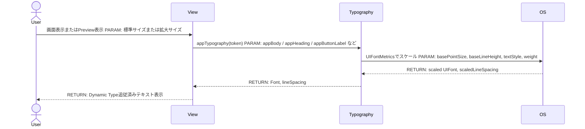
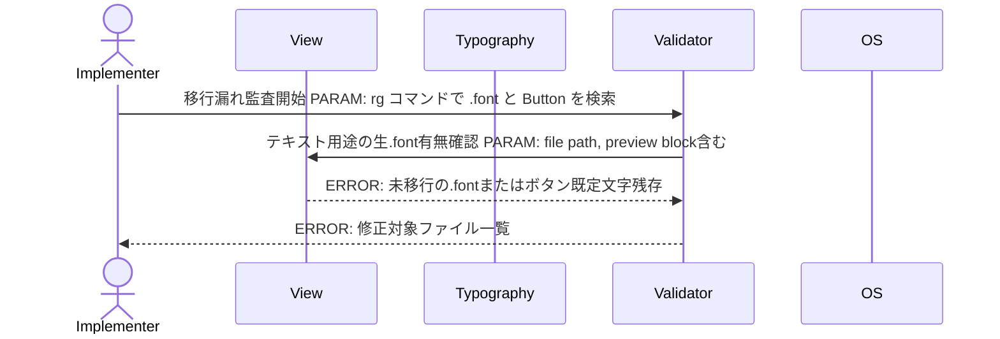
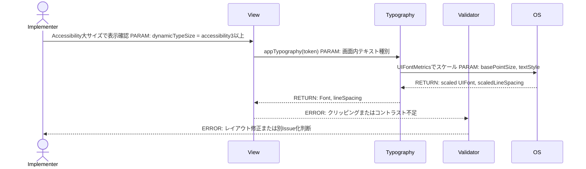
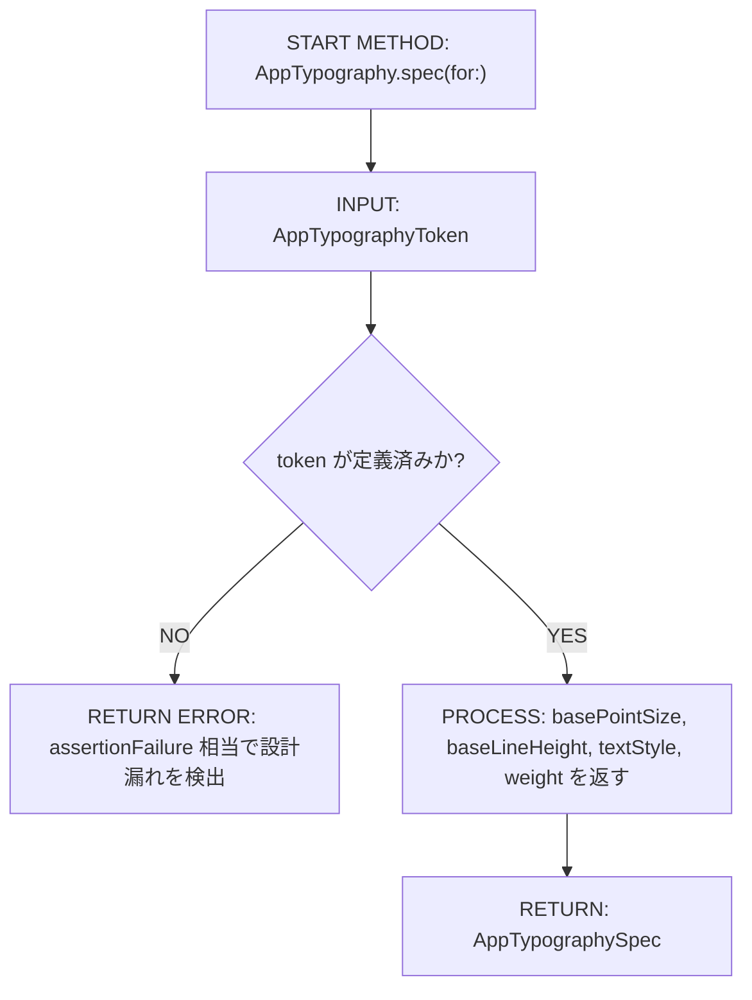
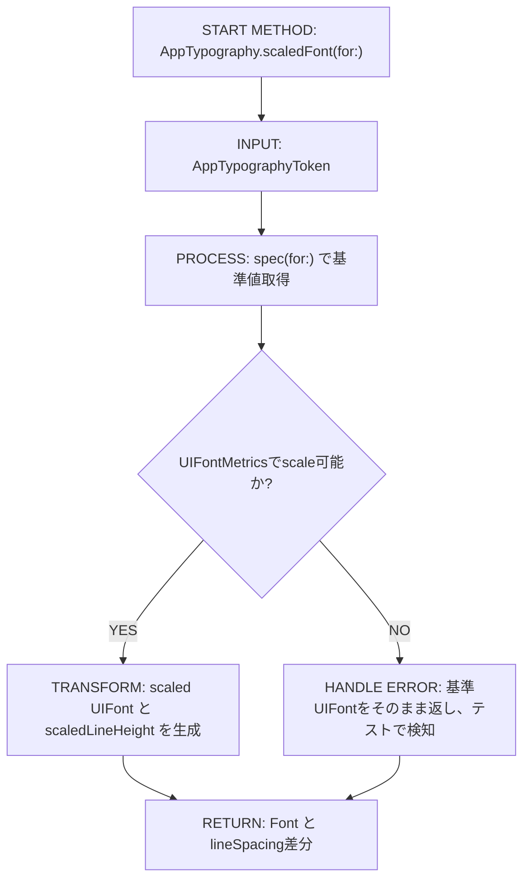
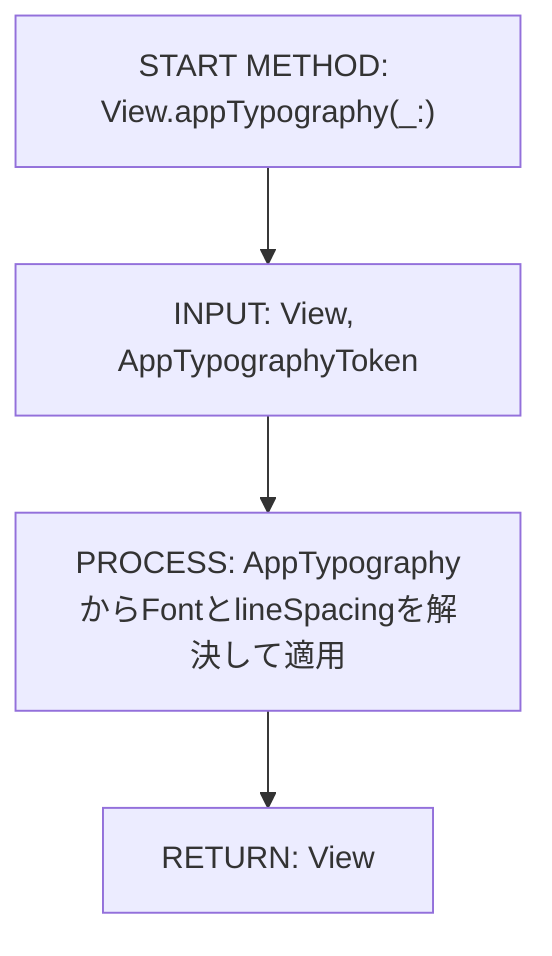
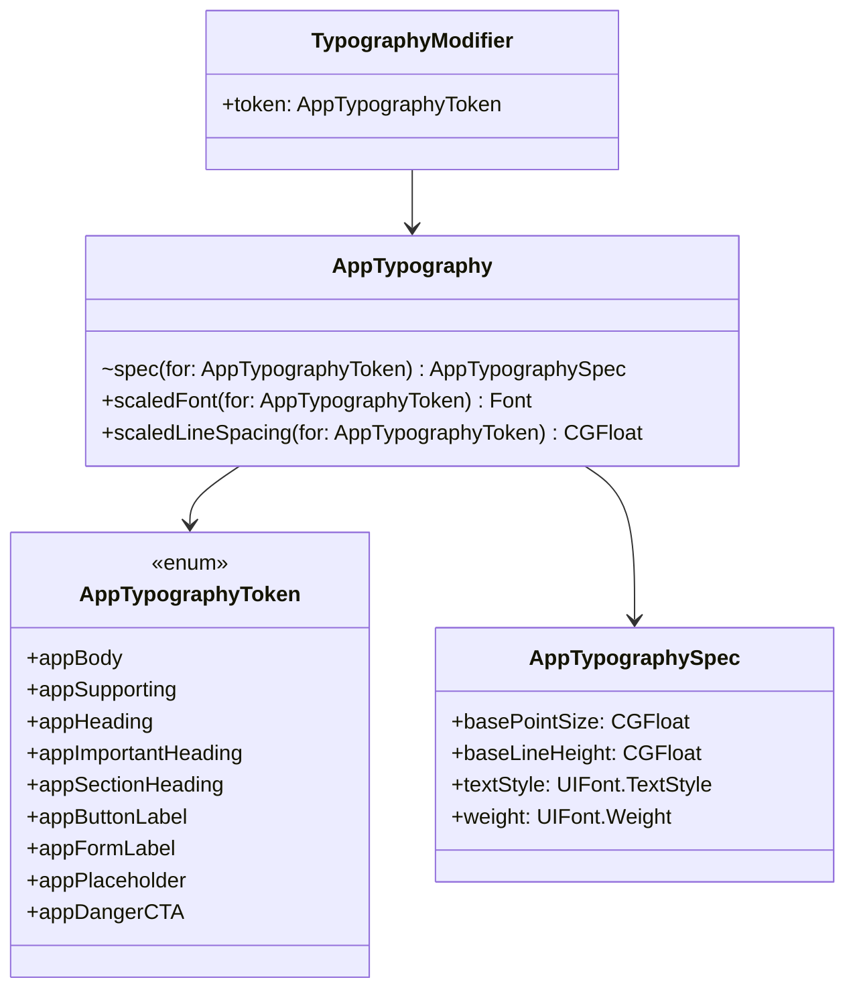

# Implementation Plan — アプリ全体のタイポグラフィスケール導入

---

## 0. 実装入力コンテキスト

| 項目 | 記入 |
| --- | --- |
| 対象Issue | [DESIGN] アプリ全体のフォントサイズ調整（高齢ユーザー想定のタイポグラフィスケール導入） |
| 対象リポジトリ内パス（実装起点） | `/home/runner/work/milk-order-ios/milk-order-ios/MilkOrder/` |
| 前提plan | `/home/runner/work/milk-order-ios/milk-order-ios/.github/copilot/plans/scr-001-login.md`, `/home/runner/work/milk-order-ios/milk-order-ios/.github/copilot/plans/scr-002-menu.md`, `/home/runner/work/milk-order-ios/milk-order-ios/.github/copilot/plans/scr-003-order-input.md`, `/home/runner/work/milk-order-ios/milk-order-ios/.github/copilot/plans/scr-003-correction-delta.md`, `/home/runner/work/milk-order-ios/milk-order-ios/.github/copilot/plans/scr-004-order-confirmation.md`, `/home/runner/work/milk-order-ios/milk-order-ios/.github/copilot/plans/scr-005-order-complete.md`, `/home/runner/work/milk-order-ios/milk-order-ios/.github/copilot/plans/scr-006-order-history.md`, `/home/runner/work/milk-order-ios/milk-order-ios/.github/copilot/plans/scr-007-order-detail.md`, `/home/runner/work/milk-order-ios/milk-order-ios/.github/copilot/plans/scr-007-order-detail-ios-architecture.md`, `/home/runner/work/milk-order-ios/milk-order-ios/.github/copilot/plans/scr-016-announcements.md`, `/home/runner/work/milk-order-ios/milk-order-ios/.github/copilot/plans/order-correction-flow.md` |

運用補足: 本planは実装AgentへのSSOTであり、実装対象は本planが定義する共通タイポグラフィ基盤と既存Viewへの適用のみとする。

### 0.1 変更サマリ一覧

| 区分 | 対象 | 変更概要 |
| --- | --- | --- |
| 追加 | `/home/runner/work/milk-order-ios/milk-order-ios/MilkOrder/DesignSystem/AppTypography.swift` | Dynamic Type追従・行間計算・セマンティックトークンを一元管理する静的タイポグラフィ基盤を追加する |
| 追加 | `/home/runner/work/milk-order-ios/milk-order-ios/MilkOrderTests/DesignSystem/AppTypographyTests.swift` | トークン値・スケーリング・行間差分・重要トークンの境界値を検証するXCTestを追加する |
| 修正 | `/home/runner/work/milk-order-ios/milk-order-ios/MilkOrder/Features/**/*View.swift` | 既存の生 `.font(...)` とボタン既定フォントを新トークン経由へ移行し、`#Preview` を含め統一する |
| 修正 | `/home/runner/work/milk-order-ios/milk-order-ios/MilkOrder/Features/Announcements/**/*.swift` | 重要お知らせ・通常お知らせで見出し/本文/補足文字をトークン適用し、重要情報のコントラスト確認対象を明確化する |
| 修正 | `/home/runner/work/milk-order-ios/milk-order-ios/MilkOrder/Features/OrderInput/ProductRowView.swift` | 商品名・価格・補足表示・数量操作ボタン・危険/重要CTA相当の強調文字を高齢ユーザー向け基準へ合わせる |
| 修正 | 既存各画面planとの関係 | 画面plan本文は更新せず、本planを共通SSOTとして実装側のみ参照する |

### 0.2 入力制約一覧

| 制約区分 | 制約内容 | 適用対象 |
| --- | --- | --- |
| 互換性 | ViewModel / Repository / DataSource / Model の責務分担と `AppEnvironment` のDI経路は変更しない | 全実装 |
| 禁止事項 | アプリ内に「標準/大/特大」切替UIを追加しない。OSのDynamic Type設定追従のみ対応する | DesignSystem, View |
| 禁止事項 | 既存配色を本Issue内で変更しない。コントラスト不足が判明した場合は別Issue化する | 全実装 |
| 禁止事項 | 固定px相当の `Font.system(size:)` を本文・見出し・ボタン文字へ直接再導入しない | 全View |
| その他 | 本文18px、補足16px、見出し22px、重要見出し24px、ボタンラベル18px、危険/重要CTA 19〜20px太字、行間1.6/1.5を新基準とする | AppTypography |
| その他 | `#Preview` は `AppEnvironment.preview()` のままFirebase未接続で動作し続けることを受入条件に含める | `#Preview` を持つView |

### 0.3 関連機能・関連仕様一覧

| 種別 | パス/識別子 | この設計での利用目的 |
| --- | --- | --- |
| 要件 | `/home/runner/work/milk-order-ios/milk-order-ios/.github/copilot/10-requirements.md` §9 操作性 | 高齢者・ITに不慣れな利用者でも読みやすい画面という非機能要件の根拠とする |
| 設計方針 | `/home/runner/work/milk-order-ios/milk-order-ios/.github/copilot/20-architecture.md` | View層中心の横断変更に限定し、既存DIやレイヤ境界を維持する根拠とする |
| 設計方針 | `/home/runner/work/milk-order-ios/milk-order-ios/.github/copilot/30-coding-standards.md` | Viewは表示責務のみ、ロジックは持たない方針とコメント規約の根拠とする |
| テスト | `/home/runner/work/milk-order-ios/milk-order-ios/.github/copilot/40-testing-strategy.md` | XCTestベースのテスト計画とPreview確認要件の根拠とする |
| セキュリティ | `/home/runner/work/milk-order-ios/milk-order-ios/.github/copilot/50-security.md` | Secrets/PII非出力、Previewでの安全な確認手順の根拠とする |
| CI | `/home/runner/work/milk-order-ios/milk-order-ios/.github/copilot/60-ci-quality-gates.md` | build / lint / test / security 実行計画の根拠とする |
| 調査 | Issue本文 §2.4 ユーザー提供リサーチ | 標準プロファイルの数値、WCAG/JISコントラスト基準、老視層向け可読性前提の根拠とする |
| 既存実装 | `/home/runner/work/milk-order-ios/milk-order-ios/MilkOrder/Features/**/*View.swift` | `.font(...)` と `.foregroundStyle(.secondary/.tertiary)` の現状把握、移行対象の洗い出しに用いる |
| 関連Issue | `#26`, `#27` | 数量入力ボタンや締切カウントダウンが本planのトークンを参照する後続関係を固定する |
| 既存plan | 上記10本の画面plan | 画面固有要件と競合しないこと、個別plan更新不要の判断材料とする |

---

## 1. 実装対象機能と機能ゴール

| 項目 | 内容 | 根拠 |
| --- | --- | --- |
| 実装対象詳細 | アプリ全体のView層で参照する共通タイポグラフィ基盤の新設と、既存SwiftUI Viewへのセマンティックフォントトークン適用 | Issue本文 §3, §4 |
| 機能ゴール | 想定利用者層である40代後半〜60代中心の老視対応を前提に、全画面で本文・見出し・ボタンラベル・補足文字が読みやすい基準値へ統一され、OSの文字サイズ変更にも追従する | Issue本文 §2.4, §5 |
| 非ゴール | アプリ内フォントサイズ切替UI、配色変更、ViewModel/Repository層の改修、個別機能の挙動変更、関連画面plan本文の書き換え | Issue本文 §3 非ゴール |
| 完了条件 | ① `AppTypography` 基盤が新設される ② 既存Viewのテキスト系 `.font(...)` と明示的でないボタン文字が新トークンへ統一される ③ Dynamic Type拡大時も主要画面でクリッピング/重なりがない ④ 重要情報のコントラスト確認結果が記録され、不足時は別Issue化方針で止められる ⑤ `#Preview` がFirebase未接続で表示できる ⑥ build / lint / test / security の品質ゲート実行結果が確認される | Issue本文 §5, §7, §8 |
| 受入確認手順 | `rg -n "\\.font\\(|Button\\(|Label\\(" /home/runner/work/milk-order-ios/milk-order-ios/MilkOrder/Features -g "**/*View.swift"` で対象を洗い出し、主要 `#Preview` と Simulator で標準文字サイズおよびアクセシビリティ大サイズを確認し、その後品質ゲートを実行する | Issue本文 §6.2, §7, §8 |

---

## 2. 前提・制約（SSOT）

| 種別 | 内容 | 根拠 |
| --- | --- | --- |
| 参照したSSOT | `/home/runner/work/milk-order-ios/milk-order-ios/.github/copilot/00-index.md`, `/home/runner/work/milk-order-ios/milk-order-ios/.github/copilot-instructions.md`, `/home/runner/work/milk-order-ios/milk-order-ios/.github/instructions/swift.instructions.md`, `/home/runner/work/milk-order-ios/milk-order-ios/.github/instructions/tests.instructions.md`, `/home/runner/work/milk-order-ios/milk-order-ios/.github/instructions/docs.instructions.md`, `/home/runner/work/milk-order-ios/milk-order-ios/.github/instructions/mermaid.instructions.md`, `/home/runner/work/milk-order-ios/milk-order-ios/.github/instructions/commit-messages.instructions.md`, `/home/runner/work/milk-order-ios/milk-order-ios/.github/copilot/10-requirements.md`, `/home/runner/work/milk-order-ios/milk-order-ios/.github/copilot/20-architecture.md`, `/home/runner/work/milk-order-ios/milk-order-ios/.github/copilot/30-coding-standards.md`, `/home/runner/work/milk-order-ios/milk-order-ios/.github/copilot/40-testing-strategy.md`, `/home/runner/work/milk-order-ios/milk-order-ios/.github/copilot/50-security.md`, `/home/runner/work/milk-order-ios/milk-order-ios/.github/copilot/60-ci-quality-gates.md`, `/home/runner/work/milk-order-ios/milk-order-ios/.github/copilot/80-templates/implementation-plan.md` | Issue本文 §2.1 |
| アーキテクチャ前提 | タイポグラフィはView層のみが静的参照する。`AppEnvironment -> 既存ViewModel -> 既存View` の既存データフローとDI起点は不変とする | Issue本文 §4.1, §4.2 |
| iOS バージョン要件 | 既存プロジェクト設定の `IPHONEOS_DEPLOYMENT_TARGET = 26.4` を前提に、SwiftUI / UIKitブリッジを用いた Dynamic Type スケーリングを許容する | `/home/runner/work/milk-order-ios/milk-order-ios/MilkOrder.xcodeproj/project.pbxproj` |
| 技術制約 | フォント定義は `UIFontMetrics` を基盤にして `Font(uiFont:)` へ橋渡しし、固定サイズ直書きではなくセマンティックトークン経由で利用する。行間は同じトークン情報から算出する | Issue本文 §4.3, §6.2 |
| 未確定前提（TBD） | なし。本planは標準プロファイル採用、DesignSystem配置、各画面plan更新不要、配色不足時の別Issue化までを確定済みとする | 本plan §5.1, §10 |

---

## 3. 要件定義（実装受入条件）

### 3.1 機能要件

| ID | 要件 | 受入条件（テスト可能な形） |
| --- | --- | --- |
| FR-01 | 本文・補足文字・見出し・重要見出し・ボタンラベル・フォームラベル・プレースホルダ・危険/重要CTAを表すセマンティックトークンを1箇所に定義する | `/home/runner/work/milk-order-ios/milk-order-ios/MilkOrder/DesignSystem/AppTypography.swift` にトークン列挙と仕様定義が存在する |
| FR-02 | 本文は18px相当、補足文字/プレースホルダは16px相当、見出しは22px相当、重要見出しは24px相当、ボタンラベルとフォームラベルは18px相当、危険/重要CTAは19〜20px太字相当で定義する | XCTestで各トークンの基準値とweightを検証できる |
| FR-03 | 本文系は行間1.6、補足系は1.5を基準とし、実装時はスケール後のフォントと行高差分から `lineSpacing` を算出する | XCTestで基準行高と行間差分を検証し、複数行テキストで目視確認できる |
| FR-04 | OSの文字サイズ変更に追従できるよう `UIFontMetrics` ベースでスケーリングする | Accessibilityの大サイズで主要画面を表示した際、フォントサイズが基準値より拡大される |
| FR-05 | 既存の `.body`, `.caption`, `.caption2`, `.footnote`, `.subheadline`, `.headline`, `.title2`, `.title3`, `.largeTitle` と、ボタンの既定ラベル文字を新トークンへ置換する | `rg -n "\\.font\\(" /home/runner/work/milk-order-ios/milk-order-ios/MilkOrder/Features -g "**/*View.swift"` の残件が装飾用SF Symbolを除いて0件になる |
| FR-06 | `#Preview` 内のテキスト表示も本番と同じトークンを通す | `#Preview` を持つ各Viewで `AppEnvironment.preview()` のままフォントが反映される |
| FR-07 | 重要なお知らせ、締切表示、危険系CTAなど重要情報は通常4.5:1以上に加えて7:1推奨の確認対象として分類する | 対象画面ごとの確認チェックリストに重要情報の分類が含まれる |
| FR-08 | 関連Issue `#26` `#27` が参照できるトークン名を固定する | 実装後に `appSupporting`, `appButtonLabel`, `appDangerCTA` などの命名が共通利用できる |
| FR-09 | 各画面planの本文更新は行わず、本planのみを横断タイポグラフィSSOTとして扱う | 実装PRで既存画面planに追記せず、実装差分はコードと必要最小限のテストに限定される |

### 3.2 非機能要件

| ID | 要件 | 受入条件（テスト可能な形） |
| --- | --- | --- |
| NFR-01 | 既存ViewModel / Repository / DataSource / Model に依存やAPI変更を持ち込まない | `AppEnvironment.swift` や Repository Protocol 群に変更が不要である |
| NFR-02 | PreviewはFirebase未接続を維持する | `#Preview` が `AppEnvironment.preview()` のみを利用し、`live()` を呼ばない |
| NFR-03 | 可読性向上のための変更で既存機能互換性を壊さず、レイアウト崩れがあれば周辺レイアウトを調整してトークン基準値を下げない | アクセシビリティ大サイズでレイアウト崩れが起きた場合、フォント値を戻さずView側調整で解消する |
| NFR-04 | 配色変更は本Issueのスコープ外とし、コントラスト不足は別Issue化で管理する | コントラスト不足が見つかった場合、本PRで色値を変更せず別DESIGN Issueを起票対象として記録する |
| NFR-05 | 品質ゲートは build / lint / test / security を実施し、実行環境に依存する場合でも結果をPRに残す | `/home/runner/work/milk-order-ios/milk-order-ios/.github/copilot/60-ci-quality-gates.md` の4コマンド実行結果が確認できる |

---

## 4. スコープ境界

### 4.0 スコープ境界の定義（機能単位）

| 区分 | 対象機能/責務 | 判定理由 |
| --- | --- | --- |
| In-Scope | `AppTypography` の新設 | タイポグラフィ基盤の一元管理がIssueの中心要件であるため |
| In-Scope | `MilkOrder/Features/**/*View.swift` のテキスト用途フォント移行 | 全画面共通のタイポグラフィ統一が要求されているため |
| In-Scope | `#Preview` のタイポグラフィ適用確認 | PreviewでFirebase未接続を維持した検証が必須なため |
| In-Scope | `.foregroundStyle(.secondary/.tertiary)` と背景色のコントラスト確認 | 通常4.5:1、重要情報7:1推奨の確認方法を定義する必要があるため |
| In-Scope | トークン値・Dynamic Type追従のXCTest追加 | View層変更でも基盤値の回帰防止が必要なため |
| Out-of-Scope | アプリ内フォントサイズ切替UI | Issue本文で明確に非ゴール化されているため |
| Out-of-Scope | 既存配色の変更 | 本Issueでは確認のみ、配色修正は別Issue化と定義されているため |
| Out-of-Scope | ViewModel / Repository / DataSource / Model の責務変更 | View層限定の横断機能であり、SSOTが変更不要としているため |
| Out-of-Scope | 既存画面plan本文の更新 | 本planを共通SSOTにする方針を採用するため |

### 4.2 実装時の影響範囲・互換性リスク

| 影響対象 | 結論 | 影響内容 |
| --- | --- | --- |
| UI/画面 | 影響あり | 13個の既存Viewと各 `#Preview` のテキスト表示が新トークンへ置換される |
| API/外部通信 | 影響なし | ネットワーク/Repository/DataSourceへの変更は行わない |
| データモデル | 影響なし | 永続化モデルやドメインモデルは変更しない |
| 外部依存（SPM） | 影響なし | UIKitブリッジは標準フレームワークのみで実装し、新規パッケージは追加しない |
| CI/運用 | 影響あり | build / lint / test / security に加え、Dynamic Typeとコントラストの手動確認を実施する |

### 4.3 外部依存・Secrets の扱い

| 項目 | 内容 | リスク/対応 |
| --- | --- | --- |
| 外部依存の追加/更新（SPM） | なし | 既存のSwiftUI / UIKit標準APIのみ利用する |
| Secrets 利用有無 | なし | Typography基盤は静的定義のみで機密値を扱わない |
| ログ/設定への機密混入対策 | Preview確認・テスト・手動確認でPIIを含むサンプルやログを追加しない | `50-security.md` に従いダミー値のみを使用する |

### 4.4 4章の自己検証（必須）

| チェック項目 | 合格条件 |
| --- | --- |
| Design PR 差分を書いていないか | `.github/copilot/plans/*.md` 自体の変更を実装スコープとして記載していない |
| 実装責務を書いているか | In-Scope に実装責務が2件以上ある |
| 実装影響を書いているか | 4.2 で `影響あり` が1件以上あり、影響内容が具体的である |

---

## 5. アーキテクチャ設計

### 5.0 依存注入経路（DI）

本機能は新たなDIを導入せず、既存の画面生成経路の末端でViewが静的タイポグラフィ基盤を参照する。

| 区分 | 提供主体 | Protocol 名 | 具象実装名 | 入力 | 出力 | 境界制約 |
| --- | --- | --- | --- | --- | --- | --- |
| 記載例 | `AppEnvironment` | `MilkOrderRepository（Protocol）` | `MilkOrderRepositoryImpl` | 設定/環境値 | Repository インスタンス | View から具象を直接 import しない |
| 記載例 | `ViewModel.init` | `MilkOrderRepository（Protocol）` | `MilkOrderRepositoryImpl` | Repository | ViewModel 生成 | ViewModel は具象型に依存しない |
| 01 | `AppEnvironment` | 該当なし（既存DI経路を維持） | 該当なし | 既存Repository群 | 既存ViewModel | Typography導入のために `AppEnvironment` を変更しない |
| 02 | `既存ViewModel` | 該当なし（既存画面生成を維持） | 該当なし | 既存画面状態 | 既存View | Typography導入のためにViewModel APIを変更しない |
| 03 | `各SwiftUI View` | 該当なし（静的トークン参照） | `AppTypography` | `AppTypographyToken` | `Font` と `lineSpacing` を適用した表示 | View以外のレイヤから `AppTypography` を参照しない |

#### 5.0.1 最小固定セット（TBD禁止）

| 最小固定項目 | 固定内容 |
| --- | --- |
| DI 経路 | `AppEnvironment -> 既存ViewModel -> 既存View -> AppTypography` |
| MainActor 境界 | Typography適用はSwiftUI View描画時にMainActor上で行い、背景スレッドからUI更新しない |
| Protocol/具象 境界 | `AppTypography` はDesignSystem配下の静的実装であり、View/ViewModel/Repository間のProtocol境界に介入しない |

### 5.1 設計判断

#### 5.1.1 責務分離 / データフロー（詳細）

| No. | 決定事項 | 根拠 | 未確定 |
| --- | --- | --- | --- |
| 1 | タイポグラフィ基盤は `/home/runner/work/milk-order-ios/milk-order-ios/MilkOrder/DesignSystem/` を新設して配置する | 既存の `App/`, `Domain/`, `Features/`, `Infrastructure/` と責務が明確に分離でき、View専用の横断定義として最も再利用しやすいため | なし |
| 2 | トークン実装は `UIFontMetrics` を採用し、`Font(uiFont:)` と `lineSpacing` を返す静的APIにする | `@ScaledMetric` は個別数値には有効だが、フォントサイズと行間を同一基準から一括管理しづらいため | なし |
| 3 | 既存Viewの生 `.font(...)` はテキスト用途のみトークン置換し、装飾用SF Symbolの `.font(.system(size: 48))` は文字ではなくアイコン寸法として個別レビュー対象に残す | 文字可読性要件と記号サイズ要件を混同しないため | なし |
| 4 | ボタン既定ラベル文字も監査対象に含め、`.font(...)` が無い `Button` / `Label` には `appButtonLabel` または `appDangerCTA` を明示適用する | 単純な `.font(` 検索だけではボタン文字の未移行を取りこぼすため | なし |
| 5 | 各画面planの更新は不要とする | 既存planは画面機能・遷移・業務要件を扱っており、今回のタイポグラフィ基盤は横断SSOTとして本plan単独で完結させたほうが重複と矛盾を防げるため | なし |
| 6 | コントラスト不足が見つかった場合は本PRを色変更に拡張せず、対象箇所を記録して別DESIGN Issue化する | 本Issueの非ゴールと最小差分方針を守るため | なし |

**既存SwiftUI標準スタイルから新トークンへの1:1マッピング**

| 既存スタイル | 新トークン | 基準値 | 主な適用先 |
| --- | --- | --- | --- |
| `.largeTitle` | `appImportantHeading` | 24px相当 / 太字 / line-height 1.4 | 画面主見出し、空状態主メッセージ、重要見出し |
| `.title2` | `appHeading` | 22px相当 / semibold / line-height 1.4 | 画面内大見出し、お知らせ詳細見出し |
| `.title3` | `appHeading` | 22px相当 / semibold / line-height 1.4 | 注文入力などのセクション見出し |
| `.headline` | `appSectionHeading` | 22px相当 / semibold / line-height 1.4 | 詳細画面カード見出し、完了画面の要点見出し |
| `.subheadline` | `appFormLabel` | 18px相当 / medium / line-height 1.6 | フォームラベル、価格/数量の補助ラベル |
| `.body` | `appBody` | 18px相当 / regular / line-height 1.6 | 本文、通常説明文、商品名 |
| `.footnote` | `appSupporting` | 16px相当 / regular / line-height 1.5 | 補足説明、小さなメタ情報 |
| `.caption` | `appSupporting` | 16px相当 / regular / line-height 1.5 | 日付、注釈、ステータス補足 |
| `.caption2` | `appSupporting` | 16px相当 / regular / line-height 1.5 | 税率バッジや最小補足文 |
| ボタン既定文字 | `appButtonLabel` | 18px相当 / semibold / line-height 1.6 | 通常CTA、選択・確定・戻る |
| 重要/危険CTA | `appDangerCTA` | 20px相当 / bold / line-height 1.6 | 締切警告、重要お知らせ、危険操作 |
| プレースホルダ文字 | `appPlaceholder` | 16px相当 / regular / line-height 1.5 | TextField placeholder、空状態補足 |
| `.font(.system(size: 48))` | 置換対象外（装飾用途のみ） | 個別レイアウト確認 | SF Symbolや装飾アイコン。文字用途なら設計逸脱として差し戻す |

装飾用途と文字用途の判定基準は、「ユーザーに読ませる意味テキストか」「VoiceOver読み上げ対象のラベルか」「金額・件数・見出しなど情報伝達を担う文字コンテンツか」で判断する。単なるSF Symbol、装飾記号、意味を持たないビジュアルアクセントは装飾用途として扱う。

#### 5.1.2 エッジケース / 例外系 / リトライ方針（詳細）

| No. | ケース | 方針 | 根拠 | 未確定 |
| --- | --- | --- | --- | --- |
| 1 | Accessibilityの大サイズでテキストが重なる/切れる | フォント値は下げず、`frame`, `fixedSize`, `lineLimit`, `layoutPriority`, `padding` などViewレイアウト側で解消する | 老視対応の基準値を守るため | なし |
| 2 | `.font(` 検索にヒットしないボタン既定文字が残る | `Button\(` / `Label\(` の監査を追加し、明示トークン適用を完了条件に含める | Issue本文がボタンラベルを対象に含むため | なし |
| 3 | `.foregroundStyle(.secondary/.tertiary)` のコントラストが4.5:1未満 | 本PRで色変更せず、対象箇所・背景・文字種別を記録して別DESIGN Issueを起票する | 非ゴールであるため | なし |
| 4 | 重要情報のコントラストが7:1推奨を下回る | 通常基準4.5:1は満たしていても改善候補として記録し、別Issue化の判断材料にする | Issue本文 §2.4 の推奨値 | なし |
| 5 | `#Preview` で `AppEnvironment.live()` が混入する | 既存 `preview()` を維持し、Typography実装側は環境依存コードを持たない | `swift.instructions.md` のPreview規約 | なし |
| 6 | 装飾アイコン用 `.font(.system(size:))` を誤って本文トークンへ置換する | テキストとアイコンを分類して移行し、装飾アイコンは寸法用途として残す | 可読性要件の対象外であるため | なし |

#### 5.1.3 SwiftUI View 部品一覧

| レイヤ | View/コンポーネント名 | 主責務 | 対応機能 |
| --- | --- | --- | --- |
| Screen | `LoginView`, `MenuView`, `OrderInputView`, `OrderConfirmationView`, `OrderCompleteView`, `OrderHistoryView`, `OrderDetailView`, `OrderCorrectionSelectionView`, `AnnouncementsView`, `AnnouncementDetailView` | 画面単位で新トークンを適用し、主要文字要素を統一する | FR-05, FR-06 |
| Section | `AnnouncementRowView`, `ProductRowView`, `PlaceholderView` | 一覧行・再利用部品・空状態の文字要素を統一する | FR-05 |
| Component | `AppTypography` | トークンからスケール済み `Font` と行間差分を解決する | FR-01〜FR-04 |
| Component | `View.appTypography(_:)` | Viewから1行でセマンティックトークンを適用できるようにする | FR-05 |
| Atom | `AppTypographyToken` | 意味単位のトークン名を列挙し、後続Issueから参照可能にする | FR-01, FR-08 |
| Atom | `AppTypographySpec` | 1トークン分の基準サイズ・行高・weight・textStyleを保持する | FR-02, FR-03 |

#### 5.1.4 ログと観測性（漏洩防止を含む / 詳細）

| No. | 観点 | 方針 | 根拠 | 未確定 |
| --- | --- | --- | --- | --- |
| 1 | ログ出力内容 | Typography基盤はランタイムログを追加しない。検証結果はテスト・レビュー記録で残す | UI基盤変更で機密情報や不要ログを増やさないため | なし |
| 2 | マスキング/非出力項目 | 画面確認時のスクリーンショット・ログ・テストデータに個人情報を含めない | `50-security.md` | なし |
| 3 | エラー記録粒度 | コントラスト不足やレイアウト崩れはUI不具合としてPRコメントまたは別Issueへ記録し、コード内に臨時ログを入れない | 最小差分・漏洩防止方針 | なし |

### 5.2 トレードオフ

| 判断テーマ | 案A | 案B | 採用案 | 採用理由 | 不採用理由 |
| --- | --- | --- | --- | --- | --- |
| Dynamic Type実装方式 | `@ScaledMetric` を各Viewへ分散適用 | `UIFontMetrics` をDesignSystemで集中適用 | 案B | フォントサイズ・行間・weight・ベースtextStyleを一元管理できる | 案Aは画面ごとに値が散り、全画面統一が崩れやすい |
| 適用API | `Font` extension のみ | `AppTypography` + `View.appTypography(_:)` | 案B | 行間も同時適用でき、利用側の記述が揃う | `Font` extension のみでは行間管理が別実装になりやすい |
| 既存画面planの更新 | 各画面planへ参照追記する | 本planのみを横断SSOTとする | 案B | 重複更新を避け、以後の画面追加時にも1箇所参照で済む | 案Aは10本以上のplanを同期更新する運用負荷が高い |
| コントラスト不足の扱い | 同PRで配色変更まで行う | 色は据え置きで別Issue化する | 案B | スコープ逸脱を防ぎ、最小変更で設計を固定できる | 案AはIssue非ゴールを破る |

### 5.3 ナビゲーション方針

| 項目 | 決定内容 | 根拠 |
| --- | --- | --- |
| ナビゲーション方式 | 既存の `NavigationStack` / `navigationDestination` / 通常画面遷移を変更しない | Typographyは表示基盤のみであり、画面遷移責務に影響しないため |
| 画面遷移の責務 | 既存View / ViewModel / `MilkOrderApp` の責務を維持し、Typography導入で遷移ロジックを増やさない | Issue本文 §4.1, §4.2 |
| ディープリンク対応 | 変更なし | 本Issueのスコープ外 |
| 遷移時のデータ受け渡し方式 | 変更なし | Typographyトークンは静的参照であり、遷移データを追加しない |

### 5.4 アーキテクチャレイヤー方針

| レイヤ | 定義 | 許可する依存方向 | 禁止する依存 |
| --- | --- | --- | --- |
| DesignSystem | タイポグラフィトークン・UIFontMetrics適用・View modifier | SwiftUI / UIKit 標準APIのみ | Repository / DataSource / Firebase import |
| View | SwiftUI表示と `appTypography` 適用 | 既存ViewModel, DesignSystem | Repository/DataSource具象を直接 import しない |
| ViewModel | 既存状態管理・業務ロジック | 既存Repository Protocol | Typography基盤へ依存しない |
| Repository | 既存データアクセス抽象 | 既存DataSource | Typography基盤へ依存しない |
| DataSource | 既存外部I/O具象 | 外部SDK/フレームワーク | Typography基盤へ依存しない |
| Model/Entity | 既存ドメイン構造 | なし | Typography基盤へ依存しない |

### 5.5 データ取得ライフサイクル

| データ種別 | 取得タイミング | 取得場所 | 理由 |
| --- | --- | --- | --- |
| タイポグラフィ仕様 | View描画時 | `AppTypography.spec(for:)` | 静的定義を集中管理するため |
| スケール済みフォント | View描画時 | `AppTypography.scaledFont(for:)` | OSのDynamic Type設定を反映するため |
| コントラスト確認対象 | 実装検証時 | 手動確認チェックリスト | 既存配色変更を伴わない監査項目であるため |

| キャッシュ方針 | 採用有無 | ルール |
| --- | --- | --- |
| インメモリキャッシュ | 不採用 | トークン数が少なく、都度 `UIFontMetrics` で解決しても負荷が低いため |
| ディスクキャッシュ | 不採用 | ユーザー設定保存や永続化は不要であるため |

#### 5.5.1 MainActor/BackgroundActor 境界

| 対象処理 | 実行コンテキスト | 実装場所 | 禁止事項 |
| --- | --- | --- | --- |
| UI 更新 | MainActor | 各View, `View.appTypography(_:)` | 背景スレッドからSwiftUI Viewを変更しない |
| フォント解決 | MainActorで利用、内部計算は同期 | `AppTypography` | 非同期処理やTask起動を導入しない |
| 手動コントラスト確認 | 開発時手順 | Simulator / Preview / Xcode Accessibility Inspector | 実装コードに検証用ログや一時フラグを残さない |
| 既存データ取得 | 既存設計どおり | 既存ViewModel / Repository | Typography導入を理由に既存Actor境界を変えない |

### 5.6 エラーハンドリング標準形

| 分類 | エラー型 | UI 表示ルール | 再試行ルール |
| --- | --- | --- | --- |
| network | 該当なし | 変更なし | 変更なし |
| unauthorized | 該当なし | 変更なし | 変更なし |
| notfound | 該当なし | 変更なし | 変更なし |
| validation | 移行漏れ・コントラスト不足・Dynamic Typeクリッピング | 実装時レビューまたはテスト失敗として検出し、PRを通さない | 修正後に再確認する |
| unknown | 予期しないレイアウト崩れ | 画面側レイアウトを修正し、トークン値は維持する | 修正後にPreview / Simulatorで再確認する |

| ログ方針 | 内容 |
| --- | --- |
| 出力する情報 | なし。検証結果はテスト・PR記録に残す |
| 出力しない情報（Secrets/PII） | ユーザー名、注文情報、認証情報、Firebase設定値 |

#### 5.6.1 エラー変換責務（例外 → ドメインエラー）

| 変換対象 | 例外発生層 | ドメインエラーへ変換する層 | 上位層へ渡す型 | 禁止事項 |
| --- | --- | --- | --- | --- |
| 移行漏れ（生 `.font` 残存） | View実装 | 実装レビュー / 検索手順 | 指摘一覧 | 実行時に黙殺しない |
| コントラスト不足 | UI確認手順 | 実装レビュー / 別Issue化判断 | 改善候補一覧 | 同PRで配色変更まで広げない |
| 予期しないレイアウト崩れ | Preview / Simulator確認 | 実装レビュー | 修正対象一覧 | フォント値を基準未満へ戻さない |
| 装飾アイコン誤置換 | View実装 | コードレビュー | 修正対象一覧 | テキスト用トークンを装飾記号へ流用しない |

### 5.7 シーケンス図（Mermaid / 複数必須）

| 必須項目 | 記載ルール |
| --- | --- |
| DI 経路 | 必須（`AppEnvironment -> 既存ViewModel -> 既存View -> AppTypography` を明記） |
| 正常系 | 必須（最低1本） |
| 異常系 | 必須（最低2本。移行漏れ検出/表示崩れ・コントラスト不足） |
| パラメータ | 各呼び出しメッセージに `PARAM` を明記 |
| 戻り値 | 各応答メッセージに `RETURN` を明記 |
| エラー返却 | 各異常系で `ERROR` の返却値とハンドリング先を明記 |

#### 5.7.0 DI 経路（テキスト再掲 / 必須）

| No | 開始主体 | 終了主体 | Protocol 名 | 具象実装名 | 経路文字列 | 境界チェック観点 | 対応シーケンス図ID |
| --- | --- | --- | --- | --- | --- | --- | --- |
| 記載例 | `AppEnvironment` | `SomeScreen` | `MilkOrderRepository（Protocol）` | `MilkOrderRepositoryImpl` | `AppEnvironment -> SomeViewModel -> SomeScreen` | 具象が View/ViewModel に漏れていないこと | SEQ-01 |
| 01 | `AppEnvironment` | `既存View` | 該当なし（既存DI維持） | 該当なし | `AppEnvironment -> 既存ViewModel -> 既存View -> AppTypography` | `AppEnvironment` とViewModelに変更が漏れ込まないこと | SEQ-01 |
| 02 | `実装検証手順` | `既存View` | 該当なし（静的監査） | `AppTypography` | `実装検証手順 -> 既存View -> AppTypography` | 生 `.font` 残存やボタン文字未移行を検出できること | SEQ-02, SEQ-03 |

#### 5.7.1 シーケンス対象一覧

| 図ID | 種別 | 起点 | 終点 | 対応要件ID |
| --- | --- | --- | --- | --- |
| SEQ-01 | 正常 | 画面表示または `#Preview` | `AppTypography` とOS Dynamic Type | FR-01〜FR-06 |
| SEQ-02 | 異常 | 実装後の移行漏れ監査 | 対象Viewの生 `.font` / ボタン文字 | FR-05, NFR-03 |
| SEQ-03 | 異常 | Accessibility大サイズまたは重要情報コントラスト確認 | 画面レイアウト / 別Issue化判断 | FR-04, FR-07, NFR-04 |

#### 5.7.1.1 境界整合チェック（必須）

| 境界テーマ | 文章セクション | 表セクション | 図セクション | 整合判定 |
| --- | --- | --- | --- | --- |
| ログ責務 | `5.1.4` | `5.6` | `5.7.4` | OK |
| エラー変換責務 | `5.1.2` | `5.6.1` | `5.7.3`, `5.7.4` | OK |
| MainActor/Background 境界 | `5.5.1` | `8.3` | `5.7.2` | OK |

#### 5.7.1.2 最小固定セット具体化チェック（必須）

| 最小固定項目 | 文章セクション | 表セクション | 図セクション | TBD残存数 |
| --- | --- | --- | --- | --- |
| DI 経路（`AppEnvironment -> 既存ViewModel -> 既存View -> AppTypography`） | `5.0.1` | `5.0` | `5.7.0`, `5.7.2` | 0 |
| MainActor 境界（UI 更新箇所） | `5.5.1` | `5.5.1` | `5.7.2` | 0 |
| Protocol/具象 境界 | `8.3` | `8.4` | `5.7.2` | 0 |

#### 5.7.2 正常系シーケンス（必須）

#### 5.7.3 異常系シーケンス（業務エラー）

#### 5.7.4 異常系シーケンス（システムエラー）

### 5.8 処理フロー図（メソッドレベル / 複数必須）

| 必須項目 | 記載ルール |
| --- | --- |
| 対象メソッド数 | 必須（最低3メソッド） |
| 分岐 | 各メソッドで正常/異常分岐を明記 |
| 入出力 | 各メソッドの入力/出力を明記 |
| 例外処理 | 例外時の戻り値または伝播先を明記 |

#### 5.8.1 メソッド一覧

| 図ID | メソッド名 | 層 | 対応要件ID |
| --- | --- | --- | --- |
| FLOW-01 | `AppTypography.spec(for:)` | DesignSystem | FR-01, FR-02 |
| FLOW-02 | `AppTypography.scaledFont(for:)` | DesignSystem | FR-03, FR-04 |
| FLOW-03 | `View.appTypography(_:)` | View | FR-05, FR-06 |

#### メソッドフロー（FLOW-01）

#### メソッドフロー（FLOW-02）

#### メソッドフロー（FLOW-03）

---

## 6. 契約仕様（Protocol Contract）

### 6.0 Protocol-DI 固定前提

| 項目 | 固定方針 |
| --- | --- |
| DI 起点 | `AppEnvironment` の既存責務を変更しない |
| Protocol の責務 | Typography導入のための新規Repository/DataSource Protocolは追加しない |
| 具象実装の配置 | `AppTypography` を `/home/runner/work/milk-order-ios/milk-order-ios/MilkOrder/DesignSystem/` に置く |
| View / ViewModel の責務 | Viewのみが `AppTypographyToken` と `View.appTypography(_:)` を参照し、ViewModelは依存しない |

### 6.1 入出力契約（API/関数/UseCase）

| ID | 入口 | 入力 | 出力 | エラー | 備考 |
| --- | --- | --- | --- | --- | --- |
| IFC-01 | `AppTypography.spec(for:)` | `AppTypographyToken` | `AppTypographySpec` | 未定義トークンは設計漏れとして検出 | トークン定義の唯一入口 |
| IFC-02 | `AppTypography.scaledFont(for:)` | `AppTypographyToken` | `Font` | スケーリング失敗時は基準UIFontでフォールバックしテストで検知 | Dynamic Type対応の中心API |
| IFC-03 | `AppTypography.scaledLineSpacing(for:)` | `AppTypographyToken` | `CGFloat` | なし | `View.appTypography(_:)` が行間を適用するための補助API |
| IFC-04 | `View.appTypography(_:)` | `AppTypographyToken` | Typography適用済み `some View` | なし | 既存Viewからの利用窓口 |

### 6.2 型/モデル/スキーマ

| ID | 対象 | 変更内容 | 後方互換 |
| --- | --- | --- | --- |
| TYPE-01 | `AppTypographyToken` | 追加 | 新規enumのため既存型互換性への影響なし |
| TYPE-02 | `AppTypographySpec` | 追加 | DesignSystem内部のstructのため既存画面ロジックと独立 |
| TYPE-03 | `View.appTypography(_:)` | 追加 | 既存Viewへ段階的適用可能 |

### 6.3 Protocol インターフェース定義（実装エンジニア向け固定案）

#### 6.3.1 Repository/DataSource Protocol 一覧

| No. | Protocol 名 | メソッド署名 | 配置ファイル候補 | 備考 |
| --- | --- | --- | --- | --- |
| 1 | 該当なし（Repository追加なし） | なし | なし | 本機能は静的タイポグラフィ基盤のみ |
| 2 | 該当なし（DataSource追加なし） | なし | なし | 外部I/Oや永続化を伴わない |
| 3 | 該当なし（DI変更なし） | なし | なし | `AppEnvironment` 不変 |

#### 6.3.2 ドメインモデルクラス図（Mermaid classDiagram）

| 図ID | ドメイン | 対応 Protocol/実装 | 対応要件ID |
| --- | --- | --- | --- |
| CLS-01 | Typography | `AppTypography` | FR-01〜FR-04 |

##### ドメインレベルのクラス図（CLS-01）

#### 6.3.3 ドメイン別モデル定義（省略不可）

##### 6.3.3.1 モデル一覧

| ドメイン | 型名 | 区分 | 用途 |
| --- | --- | --- | --- |
| Typography | `AppTypographyToken` | enum | セマンティックな文字用途を表現する |
| Typography | `AppTypographySpec` | struct | 1トークン分の基準値を保持する |

##### 6.3.3.2 プロパティ詳細定義（全項目を行で列挙）

| ドメイン | 型名 | プロパティ名 | Swift 型 | 必須 | Optional | 説明 | 例 |
| --- | --- | --- | --- | --- | --- | --- | --- |
| Typography | `AppTypographySpec` | `basePointSize` | `CGFloat` | Y | N | 標準プロファイルの基準文字サイズ | `18` |
| Typography | `AppTypographySpec` | `baseLineHeight` | `CGFloat` | Y | N | 標準プロファイルの基準行高 | `28.8` |
| Typography | `AppTypographySpec` | `textStyle` | `UIFont.TextStyle` | Y | N | `UIFontMetrics` のスケーリング基準 | `.body` |
| Typography | `AppTypographySpec` | `weight` | `UIFont.Weight` | Y | N | 文字の強さを固定する | `.semibold` |

##### 6.3.3.3 列挙型/リテラル制約

| No. | 型名 | case 一覧 | 用途 |
| --- | --- | --- | --- |
| 1 | `AppTypographyToken` | `appBody`, `appSupporting`, `appHeading`, `appImportantHeading`, `appSectionHeading`, `appButtonLabel`, `appFormLabel`, `appPlaceholder`, `appDangerCTA` | 本文/見出し/ボタン/補足/重要情報の用途分類 |

#### 6.3.4 互換性ルール

| 項目 | ルール |
| --- | --- |
| 破壊的変更の扱い | 既存画面の文字サイズは変わるが、機能仕様・データ契約・遷移契約は変更しない |
| Optional 追加の扱い | なし。新規DesignSystem型は必須値のみで構成する |
| 型名変更/移動の扱い | `AppTypography` と関連型はDesignSystem配下に固定し、Features配下へ分散させない |
| 実装側への影響確認手順 | 既存Viewの `.font(` / `Button(` / `Label(` を監査し、トークン適用後に主要PreviewとSimulator確認を行う |

---

## 7. データ設計（必要な場合のみ）

| 項目 | 内容 | 互換性/移行 |
| --- | --- | --- |
| スキーマ変更 | なし | 永続化データやFirestore契約への影響なし |
| マイグレーション方針 | なし | アプリ更新時にView表示のみ差し替わる |
| 既存データ影響 | なし | 注文/お知らせ/認証データは不変 |
| ロールバック方針 | Typography適用前のView実装へ戻すのみ | データ巻き戻し不要 |

---

## 8. 実装指示（製造 Agent 向け）

### 8.1 変更予定ファイル一覧（必須）

| No. | パス | 区分 | 変更タイプ | 実装内容 | 完了条件 |
| --- | --- | --- | --- | --- | --- |
| 1 | `/home/runner/work/milk-order-ios/milk-order-ios/MilkOrder/DesignSystem/AppTypography.swift` | Other | 追加 | トークンenum、spec、UIFontMetrics適用、View modifierを実装する | 各トークンが1箇所定義され、Dynamic Type追従APIが利用可能 |
| 2 | `/home/runner/work/milk-order-ios/milk-order-ios/MilkOrder/Features/Login/LoginView.swift` | View | 変更 | 画面タイトル、説明文、入力欄補助、ボタン文字へトークン適用 | `.largeTitle` と `.footnote` が置換され、ボタン文字が18px相当になる |
| 3 | `/home/runner/work/milk-order-ios/milk-order-ios/MilkOrder/Features/Menu/MenuView.swift` | View | 変更 | メニュー見出し、補足、各ボタン文字へトークン適用 | タップボタン文字も監査対象に含まれる |
| 4 | `/home/runner/work/milk-order-ios/milk-order-ios/MilkOrder/Features/OrderInput/OrderInputView.swift` | View | 変更 | 見出し、補足、締切表示、ボタン文字にトークン適用 | 締切関連の重要表示分類が明確になる |
| 5 | `/home/runner/work/milk-order-ios/milk-order-ios/MilkOrder/Features/OrderInput/ProductRowView.swift` | View | 変更 | 商品名、価格、税率バッジ、数量操作、注文ボタンへトークン適用 | `.caption2`, `.subheadline`, `.body`, ボタン文字が移行される |
| 6 | `/home/runner/work/milk-order-ios/milk-order-ios/MilkOrder/Features/OrderConfirmation/OrderConfirmationView.swift` | View | 変更 | 確認文言、補足、主要ボタンにトークン適用 | フッタ補足が16px相当になる |
| 7 | `/home/runner/work/milk-order-ios/milk-order-ios/MilkOrder/Features/OrderComplete/OrderCompleteView.swift` | View | 変更 | 完了見出し、本文、ボタンにトークン適用 | 完了画面の読みやすさとCTA統一を満たす |
| 8 | `/home/runner/work/milk-order-ios/milk-order-ios/MilkOrder/Features/OrderHistory/OrderHistoryView.swift` | View | 変更 | 一覧見出し、補足、空状態文言へトークン適用 | `.largeTitle`, `.subheadline`, `.caption` が置換される |
| 9 | `/home/runner/work/milk-order-ios/milk-order-ios/MilkOrder/Features/OrderDetail/OrderDetailView.swift` | View | 変更 | カード見出し、本文、補足にトークン適用し、装飾アイコンの48サイズは個別確認に留める | テキスト用途と装飾用途が分類される |
| 10 | `/home/runner/work/milk-order-ios/milk-order-ios/MilkOrder/Features/OrderCorrection/OrderCorrectionSelectionView.swift` | View | 変更 | 見出し、補足、ボタン文字へトークン適用 | 訂正フローでも標準基準が一致する |
| 11 | `/home/runner/work/milk-order-ios/milk-order-ios/MilkOrder/Features/Announcements/AnnouncementsView.swift` | View | 変更 | 一覧見出し、本文、補足へトークン適用 | 重要情報のコントラスト確認対象が明確になる |
| 12 | `/home/runner/work/milk-order-ios/milk-order-ios/MilkOrder/Features/Announcements/AnnouncementDetailView.swift` | View | 変更 | 詳細見出し、本文、補足へトークン適用 | 重要/通常お知らせ両方を確認できる |
| 13 | `/home/runner/work/milk-order-ios/milk-order-ios/MilkOrder/Features/Announcements/AnnouncementRowView.swift` | View | 変更 | 行見出し、メタ情報、本文抜粋へトークン適用 | 一覧情報密度を保ちつつ可読性を上げる |
| 14 | `/home/runner/work/milk-order-ios/milk-order-ios/MilkOrder/Features/Shared/PlaceholderView.swift` | View | 変更 | 空状態見出し・本文にトークン適用 | `.largeTitle`, `.title2`, `.body` が置換される |
| 15 | `/home/runner/work/milk-order-ios/milk-order-ios/MilkOrderTests/DesignSystem/AppTypographyTests.swift` | Test | 追加 | 基準サイズ、行高、Dynamic Typeスケーリング、重要CTA weight を検証する | XCTestで主要トークン値の回帰を防ぐ |

### 8.2 実装手順（順序付き）

| 手順 | 作業内容 | 対象ファイル/モジュール | 完了条件 |
| --- | --- | --- | --- |
| 1 | DesignSystemディレクトリを追加し、`AppTypography` の静的APIとトークン定義を実装する | `/home/runner/work/milk-order-ios/milk-order-ios/MilkOrder/DesignSystem/AppTypography.swift` | トークンとAPIがビルド可能な形で揃う |
| 2 | トークン値とスケーリング挙動をXCTestで固定する | `/home/runner/work/milk-order-ios/milk-order-ios/MilkOrderTests/DesignSystem/AppTypographyTests.swift` | 基準値・lineSpacing・weightがテストで検証できる |
| 3 | 生 `.font(` の検索と `Button(` / `Label(` 監査で対象を洗い出し、13Viewのテキスト用途へ適用する | `/home/runner/work/milk-order-ios/milk-order-ios/MilkOrder/Features/**/*View.swift` | 装飾アイコンを除く生 `.font(` 残件が0になり、ボタン既定文字も移行される |
| 4 | `#Preview` と Simulator で標準サイズおよびアクセシビリティ大サイズを確認し、コントラスト監査を実施する | Preview, Simulator, Accessibility Inspector | 主要画面で重なり・切れがなく、コントラスト不足は記録できる |
| 5 | build / lint / test / security を実行し、結果をPRに残す | CI品質ゲート | 4コマンドの結果が確認できる |

### 8.3 実装禁止事項（ガードレール）

| 項目 | 内容 | 根拠 |
| --- | --- | --- |
| 禁止事項-1 | ViewからDataSource具象やFirebase SDKを直接 import しない | `20-architecture.md`, `5.4` |
| 禁止事項-2 | 背景スレッドからSwiftUI UIを更新しない | `5.5.1` |
| 禁止事項-3 | Secrets/PII をコード・ログ・テスト・スクリーンショットに含めない | `50-security.md` |
| 禁止事項-4 | 本文やボタン文字へ `Font.system(size:)` を直接書き戻さない | Issue本文 §4.3, `5.1.1` |
| 禁止事項-5 | コントラスト不足を理由に本Issueで配色変更まで広げない | Issue本文 §3 非ゴール |
| 禁止事項-6 | `AppEnvironment`, ViewModel, Repository Protocol の署名をTypography導入のために変更しない | Issue本文 §4.1, `5.0.1` |

### 8.4 モジュール/アクセス制御方針

| 項目 | 設定内容 | 検証方法 |
| --- | --- | --- |
| アクセス制御方針 | `AppTypographySpec` と `spec(for:)` は `internal` に固定する。`View.appTypography(_:)` をアプリ本体の推奨利用入口とし、`scaledFont(for:)` / `scaledLineSpacing(for:)` は内部実装とテストで利用する補助APIとして扱う（テストは `@testable import` で参照） | Swiftコンパイラとコードレビュー |
| Protocol 依存強制 | Typography基盤はView専用の静的APIとし、既存Protocol境界へ新規依存を増やさない | コードレビュー |
| CI での強制 | `rg` 監査、XCTest、SwiftLint、xcodebuild で未移行や誤適用を検出する | ローカル確認とCI結果 |

---

## 9. テスト実装計画

### 9.1 テストケース

Unitテストを基本とし、Dynamic Type / Preview / コントラストは手動確認手順を併用する。

| 区分 | パターン名 | 対象 | シナリオ | 期待結果 |
| --- | --- | --- | --- | --- |
| 正常 | 本文トークン基準値 | `AppTypographyTests` | `appBody` のspecを取得する | 18px相当、line-height 1.6相当、regular |
| 正常 | 補足トークン基準値 | `AppTypographyTests` | `appSupporting` / `appPlaceholder` のspecを取得する | 16px相当、line-height 1.5相当 |
| 正常 | 見出しトークン基準値 | `AppTypographyTests` | `appHeading` / `appImportantHeading` を取得する | 22px / 24px相当 |
| 正常 | ボタン・危険CTAトークン基準値 | `AppTypographyTests` | `appButtonLabel` / `appDangerCTA` を取得する | 18px semibold / 20px bold |
| 例外 | Dynamic Type拡大時のスケール | `AppTypographyTests` | 大きい `UITraitCollection` 相当でscaled fontを解決する | 基準値より大きいフォントが返る |
| 例外 | 生 `.font(` 残件監査 | View全体 | `rg -n "\\.font\\("` を実行し装飾用を除外する | テキスト用途の生 `.font(` が残らない |
| 境界 | 重要情報コントラスト確認 | お知らせ/締切表示 | 重要情報の前景色と背景色の組み合わせを確認する | 通常4.5:1以上、7:1未満なら改善候補として記録 |
| 境界 | Accessibility大サイズでのレイアウト確認 | 主要View Preview / Simulator | Dynamic Typeをアクセシビリティ大サイズへ変更して表示する | 文字重なり・クリッピングがない |
| 回帰 | `#Preview` のFirebase非依存維持 | `LoginView`, `MenuView`, `OrderInputView`, `OrderConfirmationView`, `OrderHistoryView`, `OrderCorrectionSelectionView`, `AnnouncementsView`, `OrderDetailView` | 既存 `AppEnvironment.preview()` のままPreviewを開く | Firebase初期化なしで表示できる |
| 回帰 | 既存画面plan不更新方針 | 実装PR差分 | 本plan以外の既存画面planを更新していないことを確認する | 横断SSOTが重複せず維持される |

| 網羅チェック | 判定 | 根拠 |
| --- | --- | --- |
| 正常パターンを網羅している | Y | 基準値・見出し・補足・CTAを個別に検証するため |
| 例外パターンを網羅している | Y | Dynamic Type拡大と生 `.font(` 残件を検証するため |
| 境界パターンを網羅している | Y | コントラストとアクセシビリティ大サイズを確認するため |
| 回帰パターンを網羅している | Y | Preview非依存とSSOT重複防止を確認するため |

**手動確認手順**

1. `#Preview` で `LoginView`, `MenuView`, `OrderInputView`, `OrderConfirmationView`, `OrderHistoryView`, `OrderCorrectionSelectionView`, `AnnouncementsView`, `OrderDetailView` を開く。
2. Simulator で Dynamic Type を標準サイズとアクセシビリティ大サイズに切り替える。
3. 画面タイトル、本文、補足文字、ボタンラベル、重要情報を目視確認し、重なり・切れ・読みにくさがないことを確認する。
4. `.foregroundStyle(.secondary/.tertiary)` 使用箇所と背景色の組み合わせをXcode Accessibility Inspectorまたは等価のコントラスト計算手段で確認する。
5. 不足があれば、配色変更は行わず別DESIGN Issueとして記録する。

**品質ゲート実行計画**

- build: `xcodebuild build -scheme MilkOrder -destination 'platform=iOS Simulator,name=iPhone 17'`
- lint: `swiftlint lint --strict`
- test: `xcodebuild test -scheme MilkOrder -destination 'platform=iOS Simulator,name=iPhone 17'`
- security: `swift package audit`

補足: `swift package audit` はリポジトリ直下に `Package.swift` がないため、実装PRではまずコマンド実行結果を記録したうえで、依存定義変更がないことを `git diff --name-only` で確認する。依存変更がない場合は本Issueの security ゲートを「N/A（依存追加・更新なし）」として扱い、secret scan と PR 上の CodeQL / レビュー結果を補足証跡として残す。

---

## 10. オープン課題 / ADR

| 論点 | 現状 | 決定期限/担当 | ADR要否 |
| --- | --- | --- | --- |
| 各画面planの更新要否 | 更新不要。本planを横断タイポグラフィSSOTとし、既存画面planはそのまま維持する | 本実装PR着手前 / 実装Agent | 不要 |
| 配色変更が必要な場合の扱い | 本PRでは色を変えず、対象箇所を記録して別DESIGN Issue化する | コントラスト確認時 / 実装Agent | 不要 |
| 関連Issue `#26` `#27` のトークン参照 | `appSupporting`, `appButtonLabel`, `appDangerCTA` を後続Issueが参照する前提で固定済み | 後続IMPLEMENT Issue 作成時 / 実装Agent | 不要 |

### 10.1 TBD 回収トラッキング（必須）

| TBD論点 | 現在の記載箇所 | 解決ゲート | BLOCKER | RESOLVE_IN | DEFAULT/ASSUMPTION | ADR記録先 |
| --- | --- | --- | --- | --- | --- | --- |
| なし | 本plan全体 | GATE: 設計完了時に解消済み | BLOCKER: No | RESOLVE_IN: 不要 | DEFAULT/ASSUMPTION: 標準プロファイル採用と各画面plan更新不要を本planで固定 | なし |
